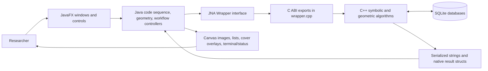

# Abdul Windows BilliardsEverything: Codebase Handbook

Status: authoritative living handbook, begun 2026-07-16  
Source baseline: branch `main`, commit `d2a8e6939807b9053f77596b22d005a3ebe111a0`  
Audience: a mathematically mature reader who knows Java and C but is learning
C++, JavaFX, this program, and its research workflow

This is the document to read when you need to understand or change Abdul's
Windows fork. The older files under `docs/release/reference/` are preserved as
dated investigation evidence. They are not competing manuals. When an older
report and current source disagree, current Abdul source wins and this handbook
must be corrected.

The handbook is deliberately progressive. It first names the object being
computed, then traces a complete research workflow, then opens the Java UI,
native boundary, C++ algorithms, mathematics, concurrency, tests, debugger, and
benchmark harness. Every behavior-bearing source symbol will eventually have an
authored explanation; generated inventory rows are deliberately kept outside
the reading path. You should be able to stop after any resolution and still
have a coherent model.

## 1. How to use this book

### 1.1 Read paths

Use the **first-day path** if the repository currently feels opaque:

1. Read Chapters 2 and 3 without opening the source.
2. Build and run once using Section 2.4.
3. Follow one `Calculate` request in Chapter 4.
4. Do Debugging Lab A in Chapter 11.
5. Only then use the source-level entries for the subsystem you are changing.

Use the **workflow path** if you operate the program but do not know what the
buttons mean: Chapters 3, 4, 8, and 12. The essential distinction is whether an
action is searching for candidate codes, rigorously calculating a region,
adding proof data to a cover, or only changing the view.

Use the **change path** before editing: Chapters 2, 6, 8, 9, 10, and 13, followed
by the exact symbols in Chapter 14. A change crossing Java/JNA/C++ is not one
method edit; it is a contract change with two languages, native allocation, and
usually a UI scheduling rule.

Use the **concurrency path** for MRR, Vary, drawing, progress, or cancellation:
Chapters 4, 6, 9, 10, and Debugging Labs B-C. Read the BUG-012 worked example
even when the current bug looks unrelated; it demonstrates why a completed
background computation and a committed JavaFX image are different events.

### 1.2 Evidence labels

Assertions that matter carry one of these lightweight labels:

- **[SOURCE]** follows directly from the current Abdul source or build files.
- **[RUN]** was observed in an identified build or automated test.
- **[PAPER]** is derived from the primary mathematical literature, especially
  `stuff_i_dont_need_at_the_moment/Obtuse Billiards.pdf`.
- **[HISTORICAL]** describes an older fork, jar, report, or workflow.
- **[INFERRED]** is the best explanation connecting evidence but is not encoded
  as a checked invariant.
- **[UNRESOLVED]** is an explicit knowledge gap. It belongs in the workspace
  agenda rather than being quietly presented as fact.

These labels are about epistemic status, not importance. A source fact can be
trivial; an unresolved research convention can be decisive.

### 1.3 Completeness contract

The reader-facing explanation remains here. Machine inventories generated by
`tools/docs/audit-handbook.ps1` go to `build/doc-audit/`; the tracked
`docs/handbook/coverage.csv` says what kind of explanation every symbol needs.
Stable comments connect authored prose to exact inventory entries without
filling the chapter with tool output:

```markdown
<!-- handbook-entry:the HTML-encoded Ctags symbol ID -->
<!-- handbook-group:a stable name for a justified trivial group -->
```

An authored entry for behavior-bearing code explains purpose, source-order
control flow, every meaningful branch, invariants, callers/callees, a worked
example, failure modes, and optimization constraints. Field-only constructors,
getters/setters, layout declarations, and truly identical overloads may share a
group entry, but the ledger must justify the grouping. JNA ownership, symbolic
overloads, stateful handlers, and conversions are not trivial by default.

The audit has two levels:

1. `-Mode inventory` regenerates a navigable inventory and reports coverage.
2. `-Mode enforce` fails when a production symbol is unclassified, stale, not
   reviewed, missing its exact authored marker, or assigned to an unjustified
   trivial group.

A generated name contributes zero explanatory credit. At the start of the
source-level rewrite the honest audit is 0 percent: the earlier 100 percent
measured marker insertion, not understanding. Chapter 14 reports the current
gate and points to the machine-readable gap report.

### 1.4 What this book does not pretend

Source can prove which handler calls which method. It cannot alone tell us why
an expert decides that a region is hard, how fast they increase LiLuMaxVary
parameters, or when a visually promising pattern should become a triples hunt.
Those choices are marked **[UNRESOLVED]** until captured from narrated real
runs. The workspace `PROJECT-AGENDA.md` tracks that work.

### 1.5 Choosing model reasoning for this repository

Maximum reasoning is useful for unfamiliar cross-layer architecture,
concurrency/happens-before failures, native ownership/ABI changes, mathematical
derivations, and reviewing an optimization whose result representation matters.
Those tasks require holding many contracts together and searching for a wrong
assumption rather than merely writing syntax.

High reasoning is appropriate for ordinary implementation, focused debugging,
test design, and handbook synthesis once the architecture is known. Medium is
appropriate for bounded mechanical work such as adding a known field through
both sides of a tested serializer, updating a fixture, or applying a repetitive
format change with strong validation.

Project size does not make maximum reasoning necessary on every turn. Choose by
uncertainty and blast radius:

\[
\text{needed reasoning}\ \uparrow
\quad\text{as}\quad
\text{cross-layer coupling}+\text{concurrency}+\text{proof sensitivity}
+\text{unclear tests}\ \uparrow.
\]

MRR provenance and AutoPolyVary ordering justify the highest setting. Editing a
VS Code label or adding a known corpus record does not. Use a strong model to
derive/review the contract, then a faster setting for genuinely mechanical
execution when tests can catch mistakes.

### 1.6 Building the HTML and PDF editions

This Markdown file is the authoritative source. The reproducible reader
editions are generated under the ignored `build/handbook/` directory; do not
edit either generated file. The builder requires Pandoc and automatically uses
an installed Chrome or Edge browser for PDF printing:

```powershell
.\tools\docs\build-handbook.ps1
```

Windows execution-policy restrictions can be bypassed for this repository-local
script without changing the machine policy:

```powershell
powershell.exe -NoProfile -ExecutionPolicy Bypass -File `
    .\tools\docs\build-handbook.ps1
```

The output is a self-contained, searchable
`build/handbook/CODEBASE-HANDBOOK.html` plus
`build/handbook/CODEBASE-HANDBOOK.pdf`. The HTML embeds its stylesheet and is
usually the fastest edition for link navigation. The letter-sized PDF has a
title page, two-column contents, internal links, wrapped source lines, and a
document outline when supported by the installed Chromium build. Use
`-HtmlOnly` to omit PDF printing, `-OutputDirectory <path>` to select another
destination, or `-BrowserPath <exe>` when automatic browser discovery is not
appropriate.

## 2. The project at successively finer resolutions

### 2.1 One paragraph

BilliardsEverything studies symbolic trajectories in triangular billiards. A
user supplies or generates a code sequence, the program derives trigonometric
constraints associated with its unfolded path, and it computes a region in
angle-coordinate space where those constraints hold. The JavaFX application
organizes searches, files, cover data, database records, progress, and drawing.
The C++ backend performs the proof-sensitive symbolic, interval, geometry, and
search work. JNA is the foreign-function bridge. SQLite persists calculated
objects and cover-related information. **[SOURCE]**

### 2.2 One diagram



The arrows are ownership boundaries as well as calls. Java objects cannot be
passed arbitrarily to C++. The wrapper flattens values into primitive numbers,
strings, pointers, and C-layout structures. Results crossing back must have a
defined allocator and release path. JavaFX scene objects may be mutated only on
the JavaFX Application Thread.

### 2.3 The four kinds of work

Do not reduce the application to "calculating codes." It coordinates four
materially different jobs:

1. **Search and generation.** Vary families, LiPattern, composition generation,
   and pattern tools propose code sequences or coordinates. Their output is a
   candidate until a calculation establishes the required conditions.
2. **Mathematical calculation.** The backend parses and classifies a sequence,
   constructs equations/inequalities, evaluates or bounds them, and returns a
   region or failure. Some paths are proof-producing; others are search aids.
3. **Cover construction.** Stable regions, triples, rectangles, polygons, and
   empty/hole information are accumulated to account for a target domain.
4. **Inspection and navigation.** Drawing, zooming, colors, one-by-one files,
   backward/forward history, info windows, and image export change what the
   researcher can inspect. A navigation action does not create mathematics.

Many UI bugs come from confusing completion in one category with completion in
another. BUG-012 calculated a new coordinate identity but inspected pixels from
the old coordinate: search state advanced before view state committed.

### 2.4 Build and run on this Windows workspace

The Gradle wrapper is the coordinating build system. It compiles Java 17 source,
resolves JavaFX 21.0.1 and JNA 5.13.0, drives the legacy Gradle native model, and
places the shared backend where JNA can load it. **[SOURCE]** The checked-in
`README.md` still contains old Java 8 and Unix-centric setup history; use this
section and `docs/release/BUILD-RUN-GUIDE.md` for Abdul Windows.

From the Abdul repository root:

```powershell
# Compile both sides without launching the GUI.
.\gradlew.bat --no-daemon compileJava backendSharedLibrary

# Run Java tests.
.\gradlew.bat --no-daemon test

# Run the normal native Boost.Test suite.
.\gradlew.bat --no-daemon testBackend

# Launch the current source build.
.\gradlew.bat --no-daemon run
```

The application defaults are set in `build.gradle`, not in a globally installed
JVM: server mode, `-Xms2g`, `-Xmx6g`, `-XX:MaxDirectMemorySize=2g`, and a 2 MB
thread stack at this baseline. Project properties or environment variables can
override them:

```powershell
.\gradlew.bat --no-daemon run `
  -PbilliardsXms=1g `
  -PbilliardsXmx=8g `
  -PbilliardsDirectMemory=2g `
  -PbilliardsShowVmSettings=true
```

Native debug builds use `-PbilliardsNativeDebug=true`; CPU-specific tuning and
link-time optimization are separate opt-ins. Never combine a correctness
comparison with an unrecorded change in these flags.

### 2.5 Repository map

At the baseline there are 116 production Java files (27,629 physical lines) and
111 native source/header files (17,702 physical lines). Counts are navigation
facts, not complexity measurements.

```text
Abdul-Windows-fork-BilliardsEverything/
|-- build.gradle                 Java/native build, runtime and optimization knobs
|-- gradlew.bat                  pinned Gradle entry point
|-- src/java/                    production Java and JavaFX
|   |-- billiards/codeseq/       sequence representation/classification
|   |-- billiards/database/      Java-side SQLite records and queries
|   |-- billiards/geometry/      Java display/domain geometry
|   |-- billiards/math/          Java symbolic/display math
|   |-- billiards/vary/          Java vary interfaces and conversions
|   |-- billiards/viewer/        main UI, windows, tasks, drawing, orchestration
|   |-- billiards/wrapper/       JNA ABI and native-result ownership
|   `-- patternfinder/           pattern search UI and models
|-- src/backend/
|   |-- headers/                 C++ public/internal declarations
|   `-- cpp/                     symbolic, geometry, search, database, C ABI
|-- src/test/
|   |-- java/                    JUnit 5 tests
|   |-- headers/                 Boost.Test cases included by native main
|   `-- resources/               known code-sequence fixtures
|-- docs/
|   |-- CODEBASE-HANDBOOK.md     this authoritative narrative
|   |-- nextIter.txt             quick observation inbox
|   |-- codex-project-study/     live defect register and planning history
|   `-- release/                 current release notes and archived evidence
|-- tools/docs/                  handbook audit
|-- tools/benchmark/             reproducible performance/correctness harness
|-- app/                         packaged runtime assets and native library location
|-- cover/, examples/            research/runtime inputs; provenance varies
`-- build/                       generated classes, native binaries, reports, audits
```

Do not infer "unused" from an absent Java call. A native function may be reached
through a string-named JNA export, a window may be constructed reflectively or
only from another child window, and research files may be inputs rather than
source. Chapter 14 records reachability evidence separately from existence.

### 2.6 Startup and main ownership

`billiards.viewer.Main` is the Gradle application entry. JavaFX constructs the
primary `Viewer`; `Viewer` owns a very large amount of UI state and wires most
top-level handlers. `DBGui` selects or creates the database context from which a
viewer or pattern finder can be launched. The backend library is loaded through
the JNA interface in `billiards.wrapper.Wrapper`. **[SOURCE]**

The design is historically accreted rather than layered in a strict modern
MVC pattern. `Viewer` is simultaneously a view builder, controller, workflow
coordinator, drawing owner, history owner, and adapter for several child
windows. This explains why small-looking handler changes can affect scheduling
or stale state far away. It is a reason to trace fields and callbacks carefully,
not an invitation to rewrite the class wholesale.

### 2.7 A single data lifecycle

For a representative calculation, follow the value rather than the files:

1. Text fields hold a code and coordinate/view parameters.
2. A JavaFX event handler validates and parses text on the UI thread.
3. Java domain objects such as `CodeSequence`, `ClassifiedCodeSequence`, and
   rectangle/point types encode valid state.
4. A JavaFX `Task` or executor moves expensive work off the UI thread.
5. `Wrapper` converts Java data to the native ABI and calls an exported C
   function in `src/backend/cpp/wrapper.cpp`.
6. C++ parses/classifies again where needed, derives symbolic expressions,
   performs interval/geometric calculations, and may query SQLite.
7. The ABI serializes success, empty results, or errors into a JNA-readable
   result. Native allocations remain native-owned until the matching free call.
8. Java decodes the result into domain/display objects.
9. Task success/failure/cancel callbacks marshal the outcome to JavaFX state.
10. A draw task can prepare pixels in the background, but the displayed image
    has not changed until the UI-thread commit finishes.
11. The user sees a region, list, counter, status, or error and decides the next
    research operation.

Every stage has a distinct failure class: malformed input, invalid mathematical
sequence, native error, empty rigorous result, cancellation, stale callback,
wrong ownership/freeing, database mismatch, or correct data drawn for the wrong
coordinate. Tests should identify which boundary they are asserting.

## 3. The research workflow as software

### 3.1 The observed working loop

The current user-described workflow is:

1. Repeatedly run `LiLuMaxVary` (the AutoPolyVary path) or another list-vary
   operation, increasing parameters as the search progresses.
2. Calculate newly proposed codes/coordinates and retain useful regions.
3. When remaining gaps need a different construction, hunt triples and use them
   to eliminate uncovered portions.
4. Return with new coordinates to `LiLuMaxVary`, `SuperLiLuVary`, `varyL`,
   `LiMVL`, or another vary family.
5. For hard local regions, manually Vary then use `Calculate`, or use
   `LiPattern` to inspect/extend a structured family.
6. Repeat until the cover objective is met or a region remains unresolved.

This is an operational description, not yet a complete mathematical protocol.
The parameter escalation rules and expert stopping criteria remain
**[UNRESOLVED]** and are explicitly tracked in the workspace agenda.

### 3.2 Decide what kind of action you need

Ask these questions in order:

1. **Do I need to change only what I can see?** Use zoom, fill-screen, colors,
   selection, history, one-by-one navigation, or info. Do not expect new proof
   data.
2. **Do I already have one code that needs a region calculation?** Use the
   nearby manual `Calculate` path after placing the exact code and coordinate.
3. **Do I need candidates near many coordinates?** Use `LiLuMaxVary` or a list
   vary path. It automates coordinate -> render -> candidate discovery -> vary.
4. **Do I know a structured pattern rather than a single code?** Use
   `LiPattern`, pattern lookup/calculator, or iterate-to-limit tools.
5. **Am I trying to account for an uncovered domain?** Use cover tools, hole
   finding, stable regions, and triples. Search results matter only when they
   are incorporated with the appropriate validity information.
6. **Do I need to inspect a difficult case?** Prefer one-coordinate/manual work
   so logs, breakpoints, and mathematical intermediates remain attributable.

### 3.3 Tool-family comparison

`LiLuMaxVary` / `AutoPolyVary` consumes a coordinate list one item at a time.
For each coordinate it changes the viewer map, waits for the coordinate's image,
discovers uncovered candidate points, and launches polygon-vary work. Its value
is automation across a file; its risk is cross-coordinate stale state. Use it
when the same operation must be applied consistently to many coordinates.

`SuperLiLuVary` uses the super polygon-vary task and exposes a related but not
identical set of bounds/options. Treat it as a separate algorithmic entry point,
not a "more" button whose output must dominate ordinary LiLuMaxVary.

`BoyanVary` / `PolyVary` launches polygon-based vary from entered bounds and
options. It is useful when the polygon and search settings are already known,
without the AutoPolyVary coordinate-file controller.

`varyL` and `LiMVL` vary length-related or middle/length parameters and provide
one-by-one navigation. Their result spaces and input semantics must be read from
their window/task constructors before substituting one for another.

`LiCycle` / CycleVary follows the cycle-vary task and can load/navigate OBO
output. Use it when the mathematical family is cyclic rather than merely when
you want another batch search.

Manual `Vary` plus `Calculate` minimizes orchestration. It is the best debugger
entry for a single hard code because every input and output can be inspected,
but it transfers iteration and bookkeeping to the researcher.

`LiPattern` and the pattern finder family operate on repeated/limiting symbolic
structure. Use them when the hypothesis concerns a family or extension rule,
not just a neighborhood in coordinate space.

Triples and cover tools are downstream accounting mechanisms. They do not
merely generate another candidate list; they attempt to add stable/triple data,
find remaining holes, or show what a cover accounts for.

### 3.4 The BUG-012 lesson: coordinate state is a transaction

The reported symptom was striking: after the first coordinate, the
AutoPolyVary counter rapidly advanced to 4444 while the terminal stopped showing
real calculation. Inspection showed that `vary` was not called for those later
coordinates.

The bug was not "the counter is too fast." The counter accurately reflected a
chain of tasks that each found zero work and completed immediately. The causal
sequence was:

1. AutoPolyVary changed the `PixelRadianMap` for coordinate (i).
2. It requested the coalesced asynchronous region-image redraw.
3. Before that redraw committed, candidate discovery sampled the current image.
4. The image still represented coordinate (i-1), so it frequently produced
   an empty point list for coordinate (i).
5. With no points, no candidate reached `vary`; the task completed immediately.
6. Coordinate (i+1) replaced/cancelled the pending redraw and repeated the
   error through the file.

The fix makes "begin work for coordinate (i)" depend on completion of the
matching redraw commit, not merely on setting the new map. Terminal diagnostics
now state each point and its uncovered-candidate count. **[SOURCE] [RUN]**

The general invariant is:

\[
\operatorname{discoverCandidates}(i)
\quad\text{may execute only after}\quad
\operatorname{committedImage.coordinate}=i.
\]

This is a happens-before requirement at the application level. Marking a field
`volatile` would not establish it; the controller needs an explicit completion
edge connecting the correct render request to the correct continuation.

## 4. Every UI entry point

This chapter is written as executable tracing, not a label dictionary. Each
entry must ultimately contain its purpose, input model, handler excerpt,
downstream Java/native calls, mathematical role, thread, output, cancellation,
alternatives, failure modes, test, and suggested breakpoint. Section 4.1 gives
the tracing template; Sections 4.2 onward apply it to the current controls.

### 4.1 How to read a JavaFX button handler

In JavaFX, creating `new Button("Calculate")` does nothing by itself. Behavior
is installed by `setOnAction(event -> { ... })` or a method reference. The
handler runs on the JavaFX Application Thread. It may safely read text fields
and mutate controls, but a long backend call there freezes input and repaint.

For every control, trace this chain:

```text
button construction
  -> setOnAction handler
  -> field parsing and domain-object construction
  -> Task/Executor boundary, if any
  -> Wrapper JNA method, if any
  -> wrapper.cpp C export
  -> backend algorithm/database
  -> Task terminal callback
  -> JavaFX state/image commit
```

A breakpoint only at the C++ algorithm misses bad Java parsing. A breakpoint
only in the handler misses native empty/error semantics. Chapter 11 shows how
to attach both debuggers.

### 4.2 Main viewer control map

The main viewer contains several functional bands even though `Viewer.java`
constructs them in one class:

- code and pattern manipulation (`Lookup Patterns`, polygon intersection,
  add/subtract transforms, expando, iterations, `LiPattern`);
- viewport and file navigation (`Zoom`, history, clear/reset, load directory or
  file, info, gradient, classification, main `Calculate`);
- polygon/database/overlay work (`Search`, `Polygon`, `PolygonDB`, `Para`,
  `Merge`, `Trimmer`, zoom-to, fills);
- one-by-one inspection (`Load One By One File`, `Go`, forward/backward, color);
- cover work (`Find Holes`, `Load Cover`, `Cover`, `CoverInfo`, cover color);
- vary launchers (`Auto Vary3`, `BoyanVary`, `varyL`, `LiMVL`, `LiCycle`,
  `LiLuMaxVary`, `SuperLiLuVary`);
- specialized tools (`LiCover`, `LiBainT/B`, `Save V3`, updater, pattern
  calculator, manual check, image export).

The following sections are the current handler catalog. Chapter 14 supplies the
member-by-member accounting for helpers and generated controls that would make
this chapter unreadable if repeated as raw tags.

### 4.3 Database chooser: the real beginning of a session

`Main.start` first shows `DBGui` modally. Until that window closes with a
selection, there is no `ConnectionPool`, `Viewer`, or `PatternFinder`.

- **New** calls `DBGui.newDatabase`, validates the name, creates the Java-side
  schema through `Admin`, and refreshes the list. Use it for a genuinely new
  calculation cache, not as a substitute for a new text output directory.
- **Delete** calls `deleteDatabase`. It is destructive database administration;
  a deleted cache can force expensive MRR recalculation later.
- **Clear** calls `clearDatabase`. The database remains selectable but its
  contents are removed. This is useful for detecting whether stale cached rows
  hide a source change, but only after preserving needed research data.
- **Select** records the highlighted database and closes the chooser. The main
  method then calls `Admin.getConnectionPool(dbName, Utils.numThreads)`.
- **Viewer** and **Pattern Finder** choose which program `Main` constructs after
  selection. They do not open both programs against one pool simultaneously.

The `garbage` database is created at startup for code-list workflows regardless
of the selected research database. The current database path is managed by
`billiards.database.Admin`; database relocation is explicitly deferred.

### 4.4 Calculate: the shortest complete computation path

The current top handler is small enough to read exactly:

```java
btnCalculate.setOnAction(event -> {
    if (txtCodeSequence.getText().isEmpty()) codeWindow.show();
    btnCalculateAction(pool);
});
```

The apparent simplicity hides the useful call chain:

```text
btnCalculateAction
 -> trim and decide single versus exactly three comma-separated codes
 -> buttonCalulator for each code
 -> ClassifiedCodeSequence.create
 -> calculateCurrentCodeNumbers
 -> Database.loadStorage
 -> Wrapper.loadPicture
 -> native load_picture
 -> database lookup or calculate_stable/calculate_unstable + save
 -> CPicture strings -> Picture -> Storage.Stable/Storage.Unstable
 -> render region/MRR/bound according to calculateChooser
 -> optionally append a valid single/triple to Cover
```

Input is either one whitespace-separated integer code or three such codes
separated by commas. Zero, two, or more than three comma components are rejected.
The three-code path calculates each position into `currentCodeNumbers[0..2]`.
The cover checkbox accepts a stable single, or a complete
stable-unstable-stable triple; it refuses empty results, unstable singles, and
wrongly ordered triples. Exact existing lines are not appended twice.

This path is intentionally good for learning and debugging because there is no
coordinate-file controller. It is not fully asynchronous: the event handler can
reach a cache miss and a native calculation while handling the button. A long
calculation can therefore make the JavaFX window appear unresponsive even when
the backend is still working. Breakpoints should distinguish "UI blocked in a
valid native call" from deadlock.

`calculateChooser` selects **Region**, **MRR**, **Bound**, or **All**. Region is
the positivity-valid display region. MRR is the refined boundary representation.
Bound is the initial rational bounding polygon/segment. All overlays them for
diagnosis; it does not ask the backend for a mathematically stronger result.

The nearby **Calculate** in the iteration/code window calls the same action.
**manual check** performs the specialized surrounding validation path rather
than acting as an alias for Calculate.

### 4.5 Code transformations and iteration controls

These controls change symbolic inputs or generate a family before calculation:

- **Lookup Patterns** opens `PatternLookupWindow` for the current context.
  **Polygon** beside it opens `IterationPolyWindow` so generated members may be
  intersected with a chosen polygon.
- The first two **Add 2** / **Subtract 2** pairs call `increase`/`decrease` on
  their code boxes. The third **Add/Subtract 2** pair calls
  `addSubtract`/`addSubtractReverse`, applying alternating transforms rather
  than editing one integer in isolation.
- **Calculate Add/Subtract Iterations** parses the iteration bounds/vectors and
  enters `iterateAction` or `iterateActionWithPolyIntersect`. These generate a
  lattice of sequences, classify them, and load/draw valid `Storage` objects.
- **Calculate expando** expands letter/block templates through `getExpandos` or
  `getMultipleExpandos`. **Calculate expando Iteration** repeats that operation
  through the iteration controls. Expansion mutates working lists during
  recursion, so a debugger must inspect copies at result boundaries rather than
  assume the working list is an immutable input.
- **Calculate Iterations** invokes the ordinary family generator.
- **LiPattern** opens `IterateToLimitWindow`, where **Find Pattern** detects a
  repeating/limiting form, **Lookup** queries saved pattern data, **Run** applies
  the iteration, and **Clear** clears an output field. **Draw** and **Add To
  Cover** choose downstream effects of a found sequence.
- Generated per-code **+** and **-** buttons in the right/current-code panels
  alter one entry by two, synchronize the text, and recalculate. They are
  dynamic handlers installed by `setupButtons`, not separate named methods.

Use these when the hypothesis concerns a related sequence family. Use manual
Calculate when one exact sequence is the subject; it produces a much clearer
trace and failure report.

### 4.6 View, selection, and file controls

These controls primarily change inspection state:

- **draw** parses an entered rectangle/square and overlays it.
- **Zoom** parses view bounds and calls `zoomAction`; **Zoom To** targets an
  entered/selected region; mouse zoom and pan ultimately mutate
  `PixelRadianMap`. **Fill Screen** fits the current content.
- **Backward** and **Forward** move through `viewRectangleBF` history. They are
  view history, distinct from OBO forward/backward and Vary-window result
  history.
- **Clear** removes temporary/on-screen data according to its handler;
  **Reset** restores the default view and state. Neither is a database clear.
- **Clear Fills**, **S**, and **L** remove, save to `fills.txt`, and reload screen
  fill rectangles. These overlays say which screens were marked filled; they
  are not substitutes for native cover proof data.
- Color buttons change layer colors. They trigger rerendering but do not change
  stored equations or code classification.
- **Select** mode routes canvas clicks through `click`: convert pixel to angle,
  find containing stable/unstable/cover objects, test positivity, and rebuild
  the selected-code sidebar. Sidebar **X** removes an item from the display; its
  color button redraws it.
- **Save Image** snapshots the rendered canvas. It is visual evidence only and
  cannot be reloaded as exact mathematical data.

Loading controls have different grammars:

- **Load File** uses `parseFile`: single codes, comma triples, optional colors,
  rectangle lines, and iteration specifications. It can calculate cache misses
  and add loaded codes to `garbage`.
- **Load Directory** processes the directory-form output expected by its
  workflow rather than concatenating arbitrary text files.
- **Classify** reads bare codes, validates/canonicalizes them, sorts by code
  type when configured, and writes a `_classified.txt` file.
- **Load One By One File** uses `parseOBOFile`. Coordinate lines and valid code
  lines are retained; metadata/comments are ignored. The current line is
  one-based in the UI and zero-based in `fileCodeSequences`.
- **Go**, **OBO Forward**, and **OBO Backward** validate a positive step and call
  `setOBO`. They change the coordinate/view and displayed code, but do not by
  themselves launch Vary.
- **Polygon**, **PolygonDB**, **Para**, and **LiBainT/B** open loaders for
  polygons, database polygons, parallelograms, and tetrabar data. Each loader
  has its own load/parse handler; do not exchange files merely because all
  eventually draw geometry.
- **Merge** calls the cover merge path through `Wrapper.mergeCovers`.
  **Trimmer** opens `PolyTrimmer`: **Trim Screen**, **Trim File**, and **Trim
  Cover** choose the polygon source sent to native `trim_cover` or the equivalent
  screen path.

### 4.7 Vary launchers and their controllers

All Vary launchers propose codes around inputs; they do not merely repaint.
Native Vary calls are admitted through one fair Java lock because the backend
currently has one process-global cancellation flag.

**Auto Vary3** opens/starts the Vary3 automation. `PolyVaryTask` coordinates
sample points and invokes the selected Boyan/Vary operations. Use it for the
Vary3 family, not as a synonym for LiLuMaxVary.

**BoyanVary** opens `PolyVaryLoad`, reads a polygon and bounds, generates sample
points with `autoRecurse`, filters already colored pixels, and starts
`drawPolyVary`. Within `BoyanMenu`:

- **Vary** calls `varyAction` for Vary3;
- **LiMV** calls the middle-Vary3 form;
- **Vary3B** follows its specialized construction;
- **V4** calls the Vary4 path;
- **Make Poly** is controlled by the polygon-build option and constructs the
  search polygon rather than running the same operation under another name.

Code-type checkboxes determine which families can survive filtering. Bounds
such as code length/sum or moves are search limits, not proof precision.

**varyL** opens `VaryWindowL` and starts `VaryLTask` over OBO coordinates.
**LiMVL** follows the middle/length variant. Their **Backward**, **Forward**, and
**Go** controls navigate produced lines. They own storage and shot executors for
the run, and closing/cancelling must stop those executors without discarding
already completed partial results.

**LiCycle** opens `CycleVaryWindow` and starts `CycleVaryTask`. **Load OBO** adds
coordinate input, **Clear** removes it, and its navigation controls inspect
cycle output. Use this path when the generated family is cyclic.

**LiLuMaxVary** is AutoPolyVary. Its launch handler requires an OBO file, rejects
MatchV3, validates start/step/end and code-type choices, loads polygon and six
bounds from `AutoPolyVaryLoad`, then calls `autoPolyVaryFunction`. The per-run
`AutoPolyVaryRun` owns one terminal flag, progress object, draw executor, storage
executor, and shot executor.

The current ordering-critical excerpt is:

```java
startAutoPolyVaryCoordinateAfterRender(
    afterCommit -> setOBOAfterRender(currIdx, run.drawExecutor, afterCommit,
        failure -> { run.fail(); throw failure; }),
    () -> continueAutoPolyVaryCoordinate(...));
```

Only the `afterCommit` continuation may sample `regionsImageView`. It then:

1. stops if cancelled/terminal;
2. skips a coordinate covered by a stable from the preceding result;
3. intersects the requested polygon with the current view;
4. recursively samples unresolved cells;
5. filters points whose committed pixel is already colored;
6. prints the uncovered count;
7. creates exactly one `PolyVaryTask` when the count is nonzero;
8. processes partials as they arrive;
9. advances exactly once on success or claims the run terminally on cancel/fail.

This is the direct explanation of the line-4444 bug: prior code performed step
4/5 before the new image committed, so a chain of legitimate zero-item task
completions drove the counter while no Vary call ran.

**SuperLiLuVary** repeats PolyVary or AutoPolyVary for configured rounds. **Use
LiLuMaxVary** selects the Auto controller; otherwise it uses direct PolyVary.
Between rounds it may scale the view or change bounds. A super run therefore
adds an outer controller; its cancel/step property must be terminally updated by
the inner run exactly once.

### 4.8 Cover, triples, and proof-accounting controls

**TokarskyTriples** only shows `StablesWindow`. Its **Calculate** handler parses
stable/unstable text and checks combinations; **Print Triple Combinations**
formats discovered candidates. A printed triple is not automatically part of a
cover unless the appropriate append/save path runs.

**Cover** opens `CoverWindow`. Its main **Calculate** handler snapshots polygon,
stable, triple, digits, magnification/depth, empty allowance, and **MRR** versus
**All** selection. It launches a JavaFX `Task` that calls the appropriate
`Wrapper.coverWrapper...` export, so native verification does not run directly
inside the button event. The progress dialog's **Cancel** calls task cancel and
`Wrapper.cancel`; the backend observes its global flag at checkpoints.

`MRR` tells cover verification to use saved MRR information; `All` uses the
broader saved information expected by that branch. These are data/verification
modes, not worker-count settings. **AutoVary** in the cover window takes returned
unfilled coordinates into a follow-up vary workflow. Related CoverWindow2/3/4
classes handle half, unstable, or diagonal variants; their calculate handlers
choose `coverWrapperHalf`, `coverWrapperUnstable`, or
`coverWrapperDiagonal` as configured.

**LiCover** opens `SmallCoverWindow`. **Calculate** invokes
`smallCoverWrapper`, returning uncovered information suitable for a localized
follow-up. **MRR**/**All** have the same mode distinction. **Print Info** requests
the diagnostic form. Adding results to main Cover or Small Cover changes the
text artifacts used by later verification; exact duplicate lines are suppressed.

**Find Holes** scans transparent pixels in the current rendering and reports
angle coordinates. It is a sampling/inspection aid: absence of a transparent
pixel at screen resolution is not alone a proof of mathematical coverage.
**Load Cover** parses the cover directory/tree and draws certified rectangles.
**CoverInfo** reports the loaded cover and associated stable/triple information.
**Save V3** opens `SaveV3Window`; **Browse**, **Save Matching**, **Save Latest
Vary**, and clear select and write Vary3 result files.

### 4.9 Search, pattern, and diagnostic child windows

- **Search** opens `QueryStage`; its Search button calls the selected database
  query through `Wrapper.code_search_length` or `code_search_even_odd`.
- `PatternFinder` provides **Calculate**, **Clean**, **Super Check**, move-up,
  move-down, **Calc & Ext**, **Search**, **1 Code**, **DUPLICATES**, and **Add +**.
  These manipulate/search `Tpattern`, `Spattern`, triples, and code families.
  `LR`, empty-check, and type controls change the predicate. Pattern output can
  be large, which is why its string-building paths use `StringBuilder`.
- `OneCodeWindow.Calculate` checks one code; `PatternLookupWindow.Copy` copies a
  selected result; `CodeAndPatternLookupWindow.Add` inserts a selection into the
  active pattern context; `PatternCalculator.Calculate Pattern` calculates a
  pattern without the full finder session; `SearchWindow.Search` performs its
  pattern/code search.
- **Info** and **Info2** load serialized native information for a code. Their
  **Show** handlers parse and display points, equations, left/right witnesses,
  and related values. **gradient** opens `GradientWindow.Calculate`, which calls
  native `calculate_gradient`. **LookatMe** is a focused inspection window.
- **Check for Updates** calls the source-tree updater. Treat this as a networked
  release utility, not part of code calculation; packaged runtimes have varied
  historically in whether the updater class is present.

### 4.10 Handler failure semantics

Every handler should end in one of six visible meanings:

1. **Rejected input:** alert shown; no background/native work started.
2. **Certified empty:** the code is valid but the backend returns `0`; display or
   terminal says empty, and that empty may be cached.
3. **Nonempty result:** `1`; decoded, displayed, optionally saved/added.
4. **Cancelled:** task/native cancel protocol completes; partials may remain by
   design; exactly one terminal callback owns cleanup.
5. **Internal failure:** native `-1` or Java exception; it must surface as an
   error and must never enter a mathematical-empty cache.
6. **No work after inspection:** for example an AutoPolyVary coordinate has zero
   uncovered committed pixels. This is neither backend empty nor failure and is
   now printed explicitly.

Progress **Cancel** handlers in `Progress`, `ProgressMultiTask`, and
`ProgressWithStatus` call their owned cancellation callbacks. Their similarity
does not imply interchangeable ownership: one represents a task, one a changing
sequence of tasks, and one adds status text.

## 5. Java and JavaFX internals

### 5.1 Java knowledge you can reuse

Most ordinary Java rules remain intact: packages map to directories, references
are garbage-collected, interfaces define behavior, checked/unchecked exceptions
work normally, and JUnit 5 tests look familiar. The unfamiliar parts are the
JavaFX application thread, observable properties, scene-graph ownership, and
native memory that the Java collector cannot own.

### 5.2 JavaFX's two worlds

The **scene graph** is the hierarchy of `Stage`, `Scene`, layout panes, controls,
canvas/image nodes, and properties. It is UI-thread confined. The **worker
world** contains `Task`, executors, native calls, file parsing, and image
preparation. Results move back through task callbacks or `Platform.runLater`.

The central rule is not simply "background threads cannot touch UI." It is:

1. Snapshot all UI-owned inputs before leaving the JavaFX thread.
2. Compute against immutable or exclusively owned background state.
3. Before committing, confirm the result still belongs to the active request.
4. Commit scene-graph state on the JavaFX thread.
5. Define what cancel means before, during, and after the native call.

BUG-012 violated step 3 temporally even though the code had asynchronous drawing.

### 5.3 Production package map

`billiards.codeseq` is the Java symbolic front door. `CodeSequence` validates,
canonicalizes, rotates/reverses, and exposes integer sequences.
`ClassifiedCodeSequence` adds `CodeType`, length, sum, stability, closedness, and
odd/even facts. `InvalidCodeSequence` represents validation failure rather than
using null. `CompositionGenerator` generates integer compositions for search;
`Storage` here is code-sequence storage metadata, distinct from viewer/database
`Storage` usages. When Java and C++ classification disagree, downstream code can
select the wrong native branch or database representation; parity tests are
therefore contract tests, not duplication cleanup.

`billiards.database` converts serialized native records into Java objects and
manages Java-side queries/caches. `Admin` locates and administers databases and
creates `ConnectionPool`. `Database.loadStorage` is the high-traffic cache-miss
gateway. `Picture`, `PictureStable`, `PictureUnstable`, `Info`, `InfoAll`, and
`LeftRight` are decoded records. They should remain data representations; UI
thread decisions belong in viewer controllers.

`billiards.geometry` is double-based geometry used for display and Java-side
filtering: `Vector2`, `Interval`, `Rectangle`, `LineSegment`, `ConvexPolygon`,
`Location`, and projectable shapes. These types are not a substitute for native
rational/interval proof decisions. Their boundary inclusion and pixel rounding
semantics matter for candidate selection and drawing.

`billiards.math` parses and manipulates the Java-visible symbolic forms:
`Equation`, `SinEquation`, `CosEquation`, `LinCom`, angle symbol enums `XYZ`,
`XYPi`, `XYEta`, plus `CoverSquare` and utilities. This layer mostly consumes
native serialization and supports display/diagnostics; the heavy exact
derivation remains native.

`billiards.vary` is the Java facade over native Vary entry points. `VaryCS`,
`Vary3`, and `Vary4` normalize inputs/results around `Wrapper`; `AutoVary`
assembles higher-level selection; `Convert` translates forms. The global native
cancel flag is why the facade cannot safely allow arbitrary concurrent Vary
calls.

`billiards.wrapper` is the ABI owner. `Wrapper` declares native exports and
enforces admission/return contracts. `CString`, `CPicture`, `CInfo`, and
`CInfoAll` mirror C layouts for JNA. `ConnectionPool` is an opaque native pointer
with explicit destruction. A Java reference to one of these structures does not
own the `char*` memory inside it; matching native cleanup exports do.

`billiards.viewer` contains the JavaFX application and orchestration. Its classes
fall into six roles:

1. `Main`, `DBGui`, `Viewer`: application lifetime and composition.
2. Load/config windows: `AutoPolyVaryLoad`, `PolyVaryLoad`,
   `SuperPolyVaryLoad`, `PolyLoad`, `Parallelogram`, `TetraBar`,
   `SaveV3Window`.
3. Long-work controllers/tasks: `PolyVaryTask`, `CycleVaryTask`, `VaryLTask`,
   draw-picture tasks, `PriorityExecutor`, `PriorityRunnable`,
   `PriorityCallable`, and progress windows.
4. Cover/triples: `CoverWindow` variants, `SmallCoverWindow`, `StablesWindow`,
   `HashTriple`, and cover-info windows.
5. Inspection/pattern: info/gradient/query/look-at-me, iteration/pattern windows,
   `PatternCalculator`, `QueryStage`.
6. Rendering/domain support: `PixelRadianMap`, `Colors`, `ColorPicker`, `Cycle`,
   `SideSum`, `BackwardForward`, `Utils`, and shape/load helpers.

`patternfinder` is a second JavaFX program selected from `DBGui`. `PatternFinder`
is its composition/controller class. `Tpattern`, `Spattern`, `Triple`, `Single`,
and `ThreeState` model search state; `PatUtils` implements formatting and common
operations; `SuperCheckTask` moves expensive validation off the UI thread;
lookup/search/one-code windows are focused views.

### 5.4 Task and executor vocabulary in this repository

JavaFX `Task<V>` combines a background `call()` with observable state and FX
terminal callbacks. `setOnSucceeded`, `setOnFailed`, and `setOnCancelled` run on
the JavaFX thread. Calling `task.get()` inside `setOnSucceeded` is nonblocking
because success is already terminal; calling it elsewhere on the UI thread can
freeze the UI.

`PriorityExecutor` orders work implementing the priority wrappers. It does not
make a non-thread-safe calculation safe; ordering and mutual exclusion are
separate properties. The viewer also receives a fixed `ExecutorService` owned by
`Main`, while individual Vary runs create storage/shot executors. Ownership must
be read from construction and shutdown, not inferred from a variable named
`executor`.

`Utils.runAndWait` executes immediately when already on the FX thread and posts
then waits otherwise. It is for short required UI-thread work. Wrapping a native
calculation in it does not make the calculation asynchronous.

### 5.5 Rendering is a versioned computation

`PixelRadianMap` implements both directions:

\[
r_x = t_x + p_x s,\qquad r_y=t_y+p_y s,
\]

with inverse pixel coordinates obtained by subtracting translation and dividing
by scale. Reflection is a JavaFX image transform layered on the fixed
`SIDE x SIDE` image surface; mathematical sampling still needs the corresponding
map conventions.

`renderRegions` composes guide lines, stable/unstable regions, cover rectangles,
polygons, fills, bounds, and OBO overlays. The full stable image is prepared in
row batches. Coalescing assigns a generation to redraws and discards stale
preparation before FX commit. With one Java worker coalescing is disabled because
a parent render waiting for row jobs submitted to the same single-thread
executor would self-deadlock.

## 6. The Java/native boundary and database

JNA loads the backend shared library and maps Java interface methods to exported
C symbols. C++ classes, templates, `std::vector`, and exceptions cannot cross
that ABI directly. `wrapper.cpp` is therefore a protocol adapter, not boilerplate.

For each export Chapter 14 records:

1. exact Java declaration and native declaration;
2. character encoding and string termination;
3. pointer/null semantics and structure layout;
4. native allocation and matching release function;
5. success, empty, invalid-input, error, and cancellation representation;
6. whether calls may overlap and which state is shared;
7. database connection/transaction expectations.

Never catch a C++ exception only after it has crossed the C boundary: that is
already undefined ABI behavior. The export must translate exceptions to the
documented result/error form before returning.

### 6.1 The ABI families

The declarations in `src/backend/headers/wrapper.hpp` divide into these families:

1. **Initialization and diagnostics:** `sqlite_error_logging`,
   `backend_last_error`, `backend_set_worker_threads`.
2. **Database administration/lifetime:** `database_create`, `database_clear`,
   `create_connection_pool`, `destroy_connection_pool`.
3. **Cover verification:** `cover_wrapper`, `small_cover_wrapper`, duplicate,
   half, diagonal, unstable, all-cover, and unfilled-coordinate variants.
4. **Calculated-object persistence:** `save_to_database`,
   `delete_from_database`, `load_picture`, left/right picture variants,
   `load_info`, slope/all-equation/info variants.
5. **String/search/geometry utilities:** merge, trim, search by length or
   odd/even, bounding polygon, gradient.
6. **Vary:** `vary_cs_cpp`, `vary_3_cpp`, `vary_4_cpp`, and `backend_cancel`.

The generated reference in Section 14.3 is the exact declaration list. This
family map tells you which contract to read before changing one.

### 6.2 Structures, layout, and cleanup

The C-facing structures contain only fixed-width scalars and pointers:

```cpp
struct CPicture {
    char* initial_angles;
    char* points;
    char* equations;
};

struct CString {
    char* string;
};
```

Their JNA counterparts extend `Structure` and expose fields in declaration
order. The backend allocates each returned C string. Java must first copy it into
ordinary Java strings, then call `cleanup_cpicture`, `cleanup_cinfo`,
`cleanup_cinfo_all`, or `cleanup_string`. Cleanup before conversion creates a
use-after-free; omitting cleanup leaks native memory beyond the Java heap.

The good `loadPicture` shape is:

```java
if (rval == 1) {
    final Picture picture = new Picture(cpicture); // copy native strings
    cleanup_cpicture(cpicture);                    // release native allocation
    return Optional.of(picture);
} else if (rval == 0) {
    return Optional.empty();                       // certified empty
} else if (rval == -1) {
    throw nativeMrrFailure("MRR picture load", codeSeq);
}
```

Cleanup in a `finally` is safer when Java conversion can throw. Several older
methods deserve an ownership audit because comments still question leaks or
translate `-1` less strictly than the repaired MRR paths. Do not generalize the
MRR contract to an export until both sides are checked.

JNA `String` arguments are encoded C strings according to JNA's configured
encoding and are valid for the duration of the call. Native code must copy any
string it wants to retain. An `int[]` argument is paired with an explicit
length; native code must never read beyond it. `Pointer pool` is opaque Java-side
and must point to a live `sqlite::ConnectionPool` created by this same backend
binary.

### 6.3 Return and error meanings

For repaired calculated-object paths:

\[
r=1 \Rightarrow \text{valid nonempty result},\qquad
r=0 \Rightarrow \text{certified empty},\qquad
r=-1 \Rightarrow \text{internal failure}.
\]

On `-1`, `wrapper.cpp` stores a diagnostic retrievable through
`backend_last_error`; Java constructs an exception containing operation and code.
This distinction was BUG-010. Before the repair, `-1` became `Optional.empty`
and `Database` cached a backend exception as false mathematics.

Not every export shares that exact return grammar. `backend_cancel` and cleanup
functions return void; gradient returns a floating value plus string outputs;
some cover functions use boolean-like integers; string helpers have their own
translation. Read the native implementation and Java wrapper together. A new
shared result type would be worthwhile only as a designed ABI migration.

### 6.4 MRR and Vary admission

`Wrapper` contains two fair `ReentrantLock`s:

- `NATIVE_MRR_LOCK` admits one outer MRR calculation. The admitted call may use
  the configured native workers internally. This prevents several Java storage
  tasks from each launching an N-worker MRR simultaneously.
- `NATIVE_VARY_LOCK` admits one native Vary because all Vary exports currently
  observe one global `cancel_flag()`.

Both use `lockInterruptibly`, restore Java interrupt status on interruption, and
unlock in `finally`. The lock is an admission policy, not a database lock and
not protection for JavaFX state. MRR's independent internal stages remain
parallel; the ordered constraint reduction does not.

### 6.5 Database lifecycle and cache behavior

`Main` creates one native connection pool sized from `Utils.numThreads` after
database selection. Background work borrows short-lived connections. Expensive
MRR computation was deliberately moved outside borrowed-connection scope so a
small pool is not exhausted by CPU work. Application shutdown first stops Java
workers, waits up to the configured timeout, and destroys the pool only when
workers stopped; destroying it under active JNA calls would be native
use-after-free.

`Database.loadStorage` checks an in-memory cache, calls `Wrapper.loadPicture` on
a miss, converts strings to `Storage`, and caches certified empty or nonempty
results. Internal failures throw and are not cached. The current implementation
does not hold a per-code single-flight lock across compute, so two workers can
both miss and calculate/save the same code. This is a known database-race test
item, not proof that SQLite or the cache is corrupt.

Native database code is divided further:

- `database/viewer.cpp`: save/load calculated viewer objects;
- `database/admin.cpp`: schema and administration;
- `database/serialize.cpp`: exact/native values to stored text/blob forms;
- `database/deserialize.cpp`: stored forms back to native types;
- `database.cpp`: higher-level MRR/all-info lookup and conversion;
- `sqlite.hpp`: RAII database, statement, connection, and pool wrappers.

Database contents are a cache and research artifact with version sensitivity.
When debugging source changes, reproduce once with a known database state and
record whether the row was warm or calculated on demand.

## 7. C++ for a Java/C programmer

The fastest safe route is to map C++ features to concrete ownership in this
repository. A Java reference says little about ownership because the collector
retains reachable objects. A C pointer says little because C leaves policy to
the program. Modern C++ types often encode policy:

- a value `T` owns its contained state and is destroyed at scope exit;
- `const T&` borrows an existing object without copying or mutation;
- `T&` borrows and may mutate;
- `std::unique_ptr<T>` owns exactly once and moves, not copies;
- `std::shared_ptr<T>` shares counted ownership and should not be introduced
  merely to avoid deciding the real owner;
- `std::vector<T>` owns a contiguous sequence whose references can be
  invalidated by growth;
- `std::optional<T>` distinguishes absence from a made-up sentinel;
- templates generate typed implementations at compile time and are heavily
  used by the symbolic/math layer.

RAII means that acquisition and cleanup are paired by object lifetime. A mutex
lock guard, database statement, file, vector, and native allocation should be
released by destructors even along exceptions. JNA is the exception to the
comfort: Java cannot automatically run a C++ destructor for an opaque returned
pointer, so the ABI must expose and Java must call the correct release operation.

### 7.1 Translation guide: Java/C to the C++ seen here

`boost::optional<T>` is the pre-C++17 analogue of `Optional<T>`: it contains a
`T` or no value. It is not an error channel by itself. In `calculate_stable`, no
value means the mathematical region is empty; exceptions mean the computation
failed.

`boost::variant<A,B>` is a tagged union. Use `boost::get<T>(&value)` to test and
borrow a member. This plays the role of Java's `Either`/sealed alternatives,
but the compiler cannot infer every exhaustive visitor in C++14.

`std::set<T>` provides sorted uniqueness. In MRR its order is semantically
important: equation constraints are applied deterministically. Replacing it
with an unordered container is not an innocent speed edit.

`std::map<K,V>` provides sorted keys and stable deterministic iteration; worker
code often builds local maps and merges them in a defined order. `emplace_back`
constructs at a vector's end and may reallocate, invalidating pointers/references
to old elements.

`auto` means the compiler deduces a static type; it is not JavaScript dynamic
typing. `const auto&` is a borrowed immutable reference, often avoiding a large
symbolic copy. A lambda `[&]` captures surrounding variables by reference; it is
dangerous when the lambda can outlive the captured scope or run concurrently.

### 7.2 The stable/unstable calculation pipeline

The stable entry in `equations.cpp` is the best backend spine:

```cpp
const auto code_numbers = code_sequence.numbers();
const auto code_angles = code_sequence.angles(XYZ::X, XYZ::Y);
const Unfolding unfold{code_numbers, code_angles};
CurvesLR curves{};

if (code_type == CodeType::OSO) {
    const auto shooting = shooting_vector_open(code_sequence, code_angles_pi);
    curves = unfold.generate_curves_lr(shooting.first, shooting.second);
} else if (code_type == CodeType::CS) {
    const auto shooting = shooting_vector_closed(code_sequence, code_angles_eta);
    curves = unfold.generate_curves_lr(shooting.first, shooting.second);
} else if (code_type == CodeType::OSNO) {
    const auto shooting = unfold.shooting_vector_general();
    curves = unfold.generate_curves_lr(shooting.first, shooting.second);
}
return points_and_stuff_stable(code_numbers, code_angles, curves);
```

The type decides how the shooting vector is constructed, but all stable paths
generate curve equations with `LeftRight` witnesses and then refine a polygon.
`points_and_stuff_stable` calculates the final polygon, validates convexity,
permutes angle coordinates into the canonical display chamber, rearranges each
boundary equation under the inverse permutation, attaches the witness for every
edge, and returns `Stable`.

Unstable `CNS` and `ONS` first derive a nonzero linear constraint. They refine a
line segment rather than a two-dimensional polygon and return exactly two
endpoints/equations/witnesses. Passing a stable type to the unstable entry, or an
unstable type to the stable entry, throws because it is a programmer/contract
error, not a certified empty region.

The overloads taking `std::vector<LeftRight>` restrict generation to specified
witness choices. They are not merely cached overloads and can change which
boundary representation is constructed.

### 7.3 Backend source atlas

Read backend files in this order for a calculation change:

1. `code_sequence.cpp`, `classified_code_sequence.cpp`, `invalid_code_sequence.cpp`,
   `code_type.hpp`: validation, canonical representative, type.
2. `shooting_vectors.cpp`, `unfolding.cpp`: combinatorics to trigonometric curves
   and `LeftRight` provenance.
3. `bounding_region.cpp`, `bounding_inequalities.cpp`: exact initial
   polygon/segment and bounding constraints.
4. `refine.cpp`, `intersection.hpp`, `newton.hpp`, `linear_derivative.cpp`:
   sign classification and certified boundary intersections.
5. `equations.cpp`: stable/unstable orchestration and final representation.
6. `database/viewer.cpp`, `database.cpp`, `wrapper.cpp`: persistence and ABI.

The remaining production implementation files have these roles:

- `basic.cpp`, `general.cpp`, `common.cpp`, `utils.cpp`: shared types,
  conversions, cover predicates, timing, and general helpers.
- `conversion.cpp`: transformations among `XY`, `XYPi`, `XYEta`, and related
  symbolic coordinate bases.
- `diff.cpp`, `division.cpp`, `factor.hpp`, `equations.cpp`: symbolic
  differentiation, trigonometric/polynomial division, factor handling, and
  equation production.
- `evaluator.cpp`, `evalf.hpp`: interval evaluation; hot cover paths use one
  evaluator per worker/precision to reduce MPFR/MPFI allocation while preserving
  thread isolation.
- `gradient.cpp`: gradients and bounds used in verification/diagnostics.
- `parse.cpp`: exact string parsing for linear combinations and equations.
- `trig_identities.cpp`: canonical sine/cosine simplification under angle bases.
- `merge.cpp`, `trim.cpp`: cover/polygon artifact operations.
- `search.cpp`, `reorder.cpp`: database/code search and result ordering.
- `triangle_billiard.cpp`, `triangle_billiard4.cpp`: Vary geometric state for
  three/four-side constructions; the repaired Vary4 reconfiguration indexes the
  right candidate collection in the right branch.
- `vary_cs.cpp`, `vary3.cpp`, `vary4.cpp`: native search loops, worker pools,
  candidate output, and cancel checkpoints.
- `verify.cpp`: recursive cover and small-cover verification plus specialized
  duplicate/half/all modes.
- `wrapper.cpp`: all C exports, error translation, connection scope, and native
  allocation for JNA.

Subdirectories:

- `cpp/math/` provides explicit definitions/instantiations for symbolic types.
- `headers/math/` defines coefficient arrays/maps/vectors, trigonometric atoms,
  monomials, polynomials, symbols, and side sums.
- `headers/geometry/` is templated exact/open/closed point, segment, rectangle,
  projection, intersection, and convex-polygon code.
- `cpp/cover/` and `headers/cover/` parse/save cover trees and files.
- `cpp/database/` and `headers/database/` implement schema, persistence, and
  serialized viewer objects.

Every file and declaration, including small header-only operators, appears in
Section 14.3. The atlas explains conceptual ownership; the generated accounting
answers exact existence and line navigation.

### 7.4 Template and numeric risks

The backend combines templates with GMP/MPFR/MPFI through Boost
Multiprecision. `Rational` supports exact fractions; `Interval` encloses real
values; integer coefficient widths such as `Coeff16`/`Coeff64` encode expected
ranges. A narrowing `boost::numeric_cast` throws rather than silently wrapping.

`-ftrapv` is enabled in optimized GCC builds to trap signed overflow, but it is
not a substitute for proving coefficient bounds and does not cover every form of
undefined behavior. `NDEBUG` removes assertions in normal optimized builds;
native debug uses `-g3 -Og -fno-omit-frame-pointer` and leaves assertions on.

Eigen two-vectors use `Eigen::DontAlign` because these objects live inside
containers and cross code compiled under older alignment assumptions. Changing
that option can create alignment undefined behavior even when arithmetic is
unchanged.

## 8. Mathematical codebook

### 8.1 Coordinates

The application represents a triangle through angle coordinates rather than
three independent angles. If the first two angles are \(x\) and \(y\), the third
is constrained by

\[
z = \pi - x - y,
\qquad x>0,\quad y>0,\quad x+y<\pi.
\]

Thus the natural parameter space is a two-dimensional open triangle. Viewer
pixels are mapped to this angle domain by `PixelRadianMap`; changing that map is
mathematical state, not merely a camera transform, because candidate sampling
and drawing interpret pixels through it.

### 8.2 Code sequences and unfolding

A code sequence records alternating side interactions in a compressed symbolic
form. The backend classifies validity and type, derives shooting/unfolding data,
and constructs trigonometric conditions. The important implementation mapping
is:

```text
symbolic code input
 -> CodeSequence / ClassifiedCodeSequence
 -> unfolded side/vertex combinatorics
 -> linear combinations of x, y, pi (and eta in specialized paths)
 -> sine/cosine equations and inequalities
 -> interval/gradient/bounding calculations
 -> a verified region, empty result, or failure
```

The Java and C++ trees intentionally contain parallel-looking types. They are
not the same runtime object. Each side owns a representation appropriate to its
job, and `Wrapper` serializes between them.

### 8.3 Linear combinations and trigonometric atoms

Core symbolic expressions reduce angles to integer/rational linear
combinations such as

\[
\ell(x,y) = a x + b y + c\pi
\]

and then form sums/products of trigonometric terms. The specialized C++ math
types under `headers/math/` encode monomials, polynomials, symbols, trigonometric
terms, side sums, and linear-combination containers. They avoid handing proof
logic to a generic computer-algebra system and allow canonicalization rules to
be tailored to billiards identities. **[SOURCE] [HISTORICAL]**

Section 8.9 maps the paper's named constructions to the implementation. Exact
theorem-by-theorem annotations of every inequality family remain future work;
they must not be replaced by an intuition box.

### 8.4 Classification derived from the implementation

Let a legal code be \(c=(c_0,\ldots,c_{n-1})\). The implementation associates an
angle label \(a_i\in\{X,Y,Z\}\) to each position. Begin \(a_0=X,a_1=Y\). For the
next label, an even current entry returns to the label two positions back,
whereas an odd entry chooses the third label:

\[
a_{i+1}=\begin{cases}
a_{i-1}, & c_i\equiv0\pmod 2,\\
\operatorname{other}(a_{i-1},a_i), & c_i\equiv1\pmod2.
\end{cases}
\]

Stability is computed from the alternating coefficient sum

\[
A_s=\sum_{i:a_i=s}(-1)^i c_i,
\qquad s\in\{X,Y,Z\}.
\]

For even-length codes the implementation declares stability exactly when

\[
A_X=A_Y=A_Z=0.
\]

Legal odd-length codes are declared stable directly. `isOdd` uses length parity;
the source documents that legal sequences have odd sum iff odd length.

Closedness is a combinatorial symmetry test. For even (n), search an index
(i<n/2) for which (c_i) and (c_{i+n/2}) are both even. Let

\[
a=(c_{i+1},\ldots,c_{i+n/2-1})
\]

and let \(b\) be the wraparound block after the second even entry back to \(i\).
The sequence is closed if \(a=\operatorname{reverse}(b)\) for some \(i\).

These three booleans map to types:

\[
\begin{array}{c|c|c|c}
\text{type}&\text{closed}&\text{stable}&\text{odd}\\\hline
OSO&0&1&1\\
OSNO&0&1&0\\
ONS&0&0&0\\
CS&1&1&0\\
CNS&1&0&0
\end{array}
\]

Java and C++ implement this map separately. That duplication is intentional at
the current boundary but creates a parity obligation: a code must never be
stable on one side and unstable on the other.

### 8.5 Canonicalization and why order tests matter

A valid code may have many rotations and reversed rotations denoting the same
cyclic object. `CodeSequence` first removes a repeated primitive block, then
chooses the least representative among rotations and reversed rotations. The
current native implementation uses a Booth-style least-rotation index, reducing
the search from quadratic copying/comparison to linear index discovery.

Canonicalization supports:

\[
\operatorname{canonical}(c)
=\operatorname{canonical}(\operatorname{rotate}_k(c))
=\operatorname{canonical}(\operatorname{reverse}(c)).
\]

It affects equality, map/set keys, database identity, duplicate suppression,
and deterministic output. The native tests enumerate rotations/reversals because
a performance optimization here can silently split one mathematical code into
several database keys.

### 8.6 Symbolic coordinate bases

The backend distinguishes bases in the type system:

- `XY`: coefficients of \((x,y)\);
- `XYPi`: coefficients of \((x,y,\pi)\);
- `XYEta`: coefficients of \((x,y,\eta)\), where source comments identify
  \(\eta=\pi/2\);
- `XYZ`: the three triangle-angle labels with \(z=\pi-x-y\).

`LinComArr<E,N>` stores the coefficient vector of basis enum `E` in a fixed
array. For example,

\[
L=a x+b y+c\eta
\]

is an `XYEta` linear combination. `content(L)` is the positive gcd of all
coefficients and `unit(L)` is the sign of the first nonzero coefficient.
`divide_content` and `divide_unit` select a normalized representative, which is
why textual equality and ordered-set deduplication can be meaningful.

`Sin<T>` and `Cos<T>` are typed wrappers around an argument. An equation is a
sorted linear-combination map from trigonometric atoms to integer coefficients:

\[
F(x,y)=\sum_j q_j\sin(L_j(x,y))
\quad\text{or}\quad
F(x,y)=\sum_j q_j\cos(L_j(x,y)).
\]

Maps omit zero coefficients, so structural zero is an empty map. Trigonometric
identity simplification converts arguments among bases and normalizes signs and
periods before comparison.

### 8.7 Bounding, refinement, and certification

Stable computation begins with a rational polygon determined by linear
inequalities. Each nonlinear curve (F_j(x,y)) then refines the current polygon
to the side satisfying the required sign. At a conceptual level:

\[
P_0=\{(x,y):B_k(x,y)>0\ \forall k\},\qquad
P_{j+1}=P_j\cap\{(x,y):F_j(x,y)>0\}.
\]

The implementation cannot perform that intersection as generic exact algebra.
It classifies current vertices using interval evaluation, detects sign-changing
edges, and uses interval/Newton-style intersection routines to enclose boundary
roots. Each new edge stores the curve and `LeftRight` witness that created it.

For an unstable code, the linear constraint (C(x,y)=0) first restricts the
domain to a segment. Refinement classifies the two endpoints and, where signs
cross, intersects (C=0) with a nonlinear curve. Zero-at-endpoint cases inspect
the derivative in the inward direction because endpoint value alone cannot
distinguish tangency from another crossing.

The precision/fudge tolerances in `newton.hpp` and `intersection.hpp` are part of
this certified numerical protocol. BUG-001 changed impractically tiny tolerances
to \(10^{-25}\) for long OSNO convergence. Changing them needs known-region and
interval-enclosure tests, not just a faster completion.

### 8.8 MRR boundary provenance: the repaired invariant

For a stable final polygon with edges \(e_0,\ldots,e_{m-1}\), Abdul requires a
matching nonlinear boundary equation and witness:

\[
\forall i\quad(e_i,F_i,LR_i)\text{ describe the same refined boundary}.
\]

The old large-MRR optimization partitioned curves, refined several copies of
(P_0), and intersected the partial polygons. Geometrically the intersection
could equal applying every inequality, but its surviving edge metadata could
come from (P_0), such as `-x-y+2eta`, with no trigonometric witness. Serialization
then reached a guard whose exact meaning was "a linear edge is impossible here"
and threw `this isn't supposed to happen-x-y+2eta`.

The correct reduction is dependent:

\[
P_j=R(P_{j-1},F_j,LR_j).
\]

It now runs in deterministic equation-set order and applies every curve. The
parallel work that remains does not merge dependent boundary states: unfolding
generates independent curve contributions in worker-local containers, bounding
work uses local results, and one refinement classifies its current vertices with
TBB before the ordered topology update.

This is the precise answer to "what was the MRR bug?": not a conventional
unsynchronized write, but a parallel reduction that preserved the geometric set
while losing the representation invariant required by later code.

### 8.9 Primary-paper map: definition, theorem, and implementation

The primary source is Tokarsky and Marinov's *Obtuse Billiards*, available as
the workspace copy `stuff_i_dont_need_at_the_moment/Obtuse Billiards.pdf` and
[from the authors' site](https://gwtokarsky.github.io/docs/Obtuse%20Billiards.pdf).
The table separates what the paper defines from what this program implements.
It is a navigation map, not a claim that every native routine is a literal
transcription of a proof. **[PAPER] [SOURCE]**

| Paper section | Mathematical role | Current implementation |
| --- | --- | --- |
| 2.1, Side Sequences | Label triangle sides 1, 2, 3; a legal cyclic sequence has distinct adjacent sides, including the last/first pair; rotations and reversals represent the same periodic trajectory. | Side strings are normally not retained as the main runtime object. `CodeSequence` validates the induced angle walk and canonicalizes cyclic/reversed representatives. |
| 2.2, Code Sequences | Compress consecutive equal angle labels into positive run lengths. The code sum equals the side-sequence length. | Java `CodeSequence` and native `CodeSequence` store these positive integers. Creation rejects empty/nonpositive/illegal walks and removes a repeated primitive period before canonical ordering. |
| 2.4, Alphabet Code Sequences | Replace entries by even/odd labels and characterize legality as a closed trail. The paper derives that the number of even entries is even and that code length and sum have the same parity. | `nextAngle`/`next_angle` implements the same parity transition directly: even returns to the earlier label, odd selects the third label, and legality means the walk closes at its initial ordered pair. |
| 3, Map of Triangles | Represent a triangle by `(x,y)` with the third angle determined by `z=180-x-y` in degrees. | Math code uses radians and `z=pi-x-y`; `PixelRadianMap` maps between this domain and pixels. Database/viewer coordinates and labels must be checked for their unit convention at each boundary. |
| 7 and 8, Poolshot Tower Tests | Unfold reflections and test separation of the two colored vertex families; the convex-hull formulation explains why tower geometry encodes a realizable straightened path. | `unfolding.cpp`, `triangle_billiard*.hpp`, `shooting_vectors.hpp`, and equation construction generate the unfolded combinatorics and symbolic separation conditions. The implementation refines/certifies regions instead of drawing a paper tower by hand. |
| 9.1, XYZ Algorithm | Associate each code entry with the triangle angle `X`, `Y`, or `Z` by parity transitions through the fans. | This is the recurrence in Section 8.4 and in Java/native code-sequence classification. It is also why Java/native classification parity is an ABI-level correctness obligation. |
| 10.1 and 10.2, Stable/Unstable and Five Types | The XYZ equation is identically zero for a stable code. Stable regions are open and cover positive area; unstable regions are line segments. Codes are classified as CS, CNS, OSO, ONS, or OSNO. | `ClassifiedCodeSequence` computes stable/closed/odd and selects the same five enum values. Stable calculations produce polygons; unstable calculations first impose a linear constraint and produce a segment. |
| 13, The Prover | Use two-variable bounds to certify that a small square lies within a code region, then combine proved squares into a cover. | `verify.cpp`, `evaluator.hpp`, interval/gradient code, and database/cover paths are the closest implementation counterparts. A future narrated run must document exactly which UI action constitutes an accepted proof in current practice. |
| 15, Bounding Polygons | Enclose a code region or unstable segment in a rational convex polygon before finer work. | `bounding_inequalities.cpp`, `bounding_region.cpp`, `refine.cpp`, and the geometry types construct and refine the working polygon described in Sections 8.7 and 8.8. |

The term **MRR** does not occur in this paper. In this repository it names a
backend calculation/save/load family around refined region data. Therefore the
paper supports the geometry and classification invariants, while the exact MRR
pipeline, serialization contract, concurrency policy, and failure modes must be
learned from source and tests. Treating "MRR" as a paper theorem would obscure
the bug described in Section 8.8.

## 9. Concurrency, ownership, and cancellation

There are at least four schedulers to keep distinct:

1. JavaFX Application Thread: handlers and scene-graph commits.
2. Java executors/tasks: workflow orchestration, file work, image preparation,
   and native call initiation.
3. Native caller threads: the OS threads currently inside a JNA export.
4. TBB/native workers: internal parallel calculation such as MRR.

"Use N threads" is ambiguous unless it names which layer. Spawning N Java tasks
that each allow TBB to use all cores creates nested oversubscription. Conversely,
one Java task with a native `global_control` limit of N may be the intended
design. The MRR repair bounds the requested worker count and caps TBB for that
operation so the configured number has enforceable meaning. **[SOURCE]**

Cancellation is a protocol, not `Thread.interrupt()` alone:

```text
user presses Cancel
 -> Java task/controller records cancellation
 -> native backend_cancel or operation-specific token is signaled
 -> native loops reach defined checkpoints
 -> native allocations/transactions unwind
 -> JNA returns a cancellation result
 -> stale success callbacks are forbidden from committing UI state
 -> progress window reaches one terminal state
```

Window closure additionally decides whether it cancels owned work, merely hides
the view, or transfers ownership. An executor that outlives its window must have
an intentional application-level owner; otherwise it prevents clean shutdown or
publishes into disposed controls.

## 10. Testing strategy

The baseline contains 12 JUnit test methods and 40 Boost native test cases. Test
count is not coverage: the largest orchestration class, UI-to-native workflows,
database behavior, and most cancellation paths require substantially more
focused tests.

Use six layers:

1. **Pure unit tests:** parsing, classification, canonicalization, geometry,
   conversions, controller state transitions.
2. **Mathematical invariant tests:** equivalent rotations/reversals, exact
   symbolic identities, interval enclosure, region containment, deterministic
   result sets.
3. **Golden workflow tests:** sanitized real inputs with stable normalized
   outputs and explicit reasons for any tolerated ordering.
4. **ABI integration tests:** load the built DLL through JNA, call every export,
   test null/error/cancel, and verify allocation/free balance.
5. **Concurrency/controller tests:** deterministic fake stages with latches or
   futures, never sleeps as synchronization; assert stale work cannot commit.
6. **Manual JavaFX validation:** rendering, focus, window close, file chooser,
   large cover responsiveness, and the original user workflow.

The BUG-012 Java tests are controller-level. They check redraw sequencing,
zero-work behavior, advancement, and failure handling without trying to prove
that a pixel color corresponds to the mathematical region. That separation is
healthy: image correctness needs a different fixture.

### 10.1 How the current test runners are assembled

Java tests live under `src/test/java` and use JUnit 5. Gradle's `test` task sets
`useJUnitPlatform()`. Production source remains under the nonstandard historical
`src/java` directory, which `build.gradle` declares explicitly.

Native tests use Boost.Test. `src/test/cpp/main.cpp` defines one module and
includes every header under `src/test/headers`. Gradle links that executable
against the static backend and MSYS2 UCRT libraries, then `testBackend` runs
`build/exe/test/test.exe`. `testBackendSlow` sets
`BILLIARDS_RUN_SLOW_TESTS=1`; the normal suite sees the long case but returns
after a skip message.

Useful targeted native syntax after `testExecutable` is built:

```powershell
$env:Path = "C:\msys64\ucrt64\bin;$env:Path"
.\build\exe\test\test.exe `
  --run_test=test_mrr_worker_count_is_deterministic_and_caps_tbb `
  --log_level=test_suite
```

Use targeted tests for iteration. Run the complete Java/native suites before
claiming compatibility.

### 10.2 Your first Java unit test

Choose a pure method whose contract can be stated without JavaFX startup. BUG-012
extracted exactly such a seam:

```java
@Test
void waitsForCommittedCoordinateViewBeforeStartingVaryWork() {
    final AtomicBoolean workStarted = new AtomicBoolean(false);
    final AtomicReference<Runnable> renderCompletion = new AtomicReference<>();

    Viewer.startAutoPolyVaryCoordinateAfterRender(renderCompletion::set,
            () -> workStarted.set(true));

    assertFalse(workStarted.get());
    renderCompletion.get().run();
    assertTrue(workStarted.get());
}
```

The fake render request captures its completion instead of completing
immediately. The first assertion proves work does not start early; manually
running the completion models the image commit; the final assertion proves the
dependency is connected. No sleep, pixel image, or live `Stage` is necessary.

For Java domain code, build a table of inputs and exact expected values as
`ClassifiedCodeSequenceTest` does. Also test invalid alternatives:

1. construct the smallest valid object;
2. assert the result and the invariant that matters;
3. add boundary and invalid inputs;
4. temporarily make the expected value wrong and confirm the test fails;
5. run `gradlew test`, then inspect `build/reports/tests/test/index.html` when a
   failure message is insufficient.

Use a JavaFX integration test only when behavior genuinely depends on a scene
graph, pulse, layout, or event dispatch. Such tests need toolkit startup and
FX-thread coordination; they should not replace pure controller tests.

### 10.3 Your first native invariant test

Native tests use `BOOST_AUTO_TEST_CASE`. Prefer invariant comparisons over one
large printed golden string. The MRR worker test parses stable code `1 3 3`,
calculates with one worker, installs two workers and verifies the configured/TBB
cap, calculates again, and compares initial angles, equations, `LeftRight`
witnesses, and every interval endpoint.

The RAII `WorkerCountRestore` saves process state in its constructor and restores
it in its destructor, including when a `BOOST_REQUIRE` aborts the case. This is
the C++ equivalent of Java `try/finally` or `@AfterEach` cleanup.

For mathematical code, useful assertion categories are:

- **representation:** normalized coefficients, equation/witness alignment;
- **geometry:** containment, topology, vertex order, interval enclosure;
- **symmetry:** rotation/reversal/permutation equivalence;
- **algorithm parity:** single versus multiple workers, optimized versus known
  simple implementation;
- **error semantics:** invalid throws, certified empty returns none, internal
  failure is not none.

`BOOST_CHECK` continues and can report several differences; `BOOST_REQUIRE`
aborts when later statements would be meaningless or unsafe. Dereference an
optional only after `BOOST_REQUIRE(optional)`.

### 10.4 Testing concurrency without timing guesses

Never use `Thread.sleep(100)` as proof that another thread did or did not run.
The scheduler, debugger, CI load, and host power state can change that timing.
Use a latch, future, captured callback, barrier, or fake executor to control the
partial order.

For a stale-result test, give requests increasing IDs. Complete request 2 before
request 1 and assert only 2 commits. For cancellation, pause the worker at a
known checkpoint, signal cancel, release the checkpoint, and assert one terminal
callback plus no later UI commit. For worker determinism, compare the complete
normalized mathematical result, not only item count.

### 10.5 What still lacks coverage

The symbol inventory is exhaustive; behavioral tests are not. Highest-value
gaps are JNA allocation/free balance, per-export `-1` behavior, concurrent cache
miss/save, real JavaFX render generation/commit, window-owned executor shutdown,
cover file round trips, and golden sanitized LiLuMaxVary/triples/cover workflows.
The agenda keeps these gaps visible rather than converting them into a false
coverage percentage.

## 11. Debugging

The checked-in `.vscode/launch.json` and `.vscode/tasks.json` are the executable
counterpart to this chapter. The primary native debugger is
`C:\msys64\ucrt64\bin\gdb.exe`, matching the UCRT64 GCC toolchain used by the
build. Java attaches through JDWP, ordinarily Gradle `run --debug-jvm` on port
5005.

### 11.1 What the two debuggers can and cannot see

The running program is one Windows `java.exe` process containing the JVM, Java
threads, JavaFX, JNA, `backend.dll`, MSYS2 libraries, and native worker threads.
The Java and native debuggers attach to different representations of that same
process.

The Java debugger speaks JDWP to the JVM. It maps loaded bytecode and debug line
tables back to `.java`, shows Java objects/fields/threads/exceptions, and can
suspend one Java thread or all Java threads. A native JNA method appears as an
opaque call: Step Into cannot reveal `wrapper.cpp`.

GDB reads machine-code symbols emitted by `-g3` into `backend.dll`. It shows C++
frames, templates, native locals, pointers, and OS threads. It generally cannot
present meaningful Java objects managed by the JVM. In ordinary all-stop mode,
a native breakpoint suspends the process, so the JavaFX window freezes by design
while stopped.

Use both at a boundary by placing a Java breakpoint immediately before the
native declaration and a GDB breakpoint on the C export. Continue Java to enter
JNA, then let GDB catch the native symbol. Do not repeatedly step both debuggers
at once; know which one currently owns the suspended process.

### 11.2 One-time VS Code prerequisites

Open the Abdul repository itself as the VS Code workspace, not the parent
research directory. Confirm the Java debugger/test extensions, Microsoft C/C++
(`cppdbg`), and optionally Gradle for Java are enabled.

The checked-in configurations assume:

```text
JDK 17: C:\Program Files\Java\jdk-17
GDB:    C:\msys64\ucrt64\bin\gdb.exe
G++:    C:\msys64\ucrt64\bin\g++.exe
```

`.vscode/c_cpp_properties.json` points IntelliSense at UCRT64 and native headers.
The similarly named `c_cpp_propoerties.json` is a historical typo and is not the
configuration consumed by the extension.

### 11.3 Start and attach to Java

1. Run task **run: app waiting for Java debugger** from Terminal -> Run Task.
   Enter a small worker count such as 2. Gradle builds a native debug library,
   prints effective VM settings, and starts Java suspended on port 5005.
2. Open Run and Debug and choose **Attach Java to Gradle run (5005)**.
3. Set breakpoints by clicking the gutter. A solid breakpoint is resolved; a
   hollow one usually means the class/line is not loaded or is not executable.
4. Continue. On a stop, inspect Call Stack, Variables, Watch, and Threads. Avoid
   calling methods with side effects from Watch.
5. Stop the Gradle task when finished. Detaching alone can leave JavaFX running.

Conditional breakpoints are essential in batch workflows. Stop in
`continueAutoPolyVaryCoordinate` only when `taskIndex == 4439`, for example, or
in `Database.loadStorage` only for the reported code. Logpoints can record an
index without stopping, but they are instrumentation rather than durable logging.

### 11.4 Attach GDB to the Java application

1. Build/start with native debug symbols using the task above.
2. Let Java reach `Main.init`, which loads the backend with
   `Native.register("backend")`. Before then, native breakpoints may be pending.
3. Choose **Attach native GDB to running Java** and select the `java.exe` from
   this Gradle run. `jps -lv` helps distinguish several JVMs.
4. Break on an export such as `load_picture` in `wrapper.cpp`, then on
   `calculate_stable` in `equations.cpp`.
5. Inspect `code_numbers_len` before vector creation and return/error state
   before crossing back.
6. Continue past JNA/JVM assembly; use a source breakpoint at the next backend
   function rather than instruction-stepping through the bridge.

If GDB shows assembly or no symbols, confirm the loaded DLL is
`build/libs/backend/shared/backend.dll` from the same debug build. A packaged
`app/backend/shared/backend.dll` may be a different binary.

### 11.5 Debug native tests first when possible

**Debug native Boost tests** builds with symbols and launches the suite directly,
avoiding JVM/JNA/UI state. Use `--run_test=<case>` to narrow it, or choose
**Debug reported long MRR workload** for the exact regression fixture.
Breakpoints resolve at startup, inputs are fixed, and assertions are near the
algorithm.

Use application attachment when the suspected problem includes ABI conversion,
database state, task scheduling, pixels, or a user workflow. Do not debug the
entire UI when a native unit test reproduces the mathematics.

### Lab A: follow manual Calculate in Java

1. Start the `Run app, wait for Java debugger` task/launch compound.
2. Break in the main Calculate button handler in `Viewer`.
3. Enter the smallest known valid code fixture and press Calculate.
4. Step over parsing, recording each Java domain object and rejecting any
   assumption based only on text-field content.
5. Break at the task's background entry, then its succeeded/failed/cancelled
   callback. Observe the thread name at each stop.
6. Step into the `Wrapper` declaration far enough to identify the native export.
7. Record the returned representation before drawing mutates UI state.

### Lab B: follow MRR across JNA into C++

1. Build with `-PbilliardsNativeDebug=true`.
2. Start the Java app and attach the Java debugger.
3. Attach GDB to the Java process using the supplied native configuration.
4. Break on the MRR export in `wrapper.cpp`, then the calculation entry in
   `equations.cpp`.
5. Inspect the requested worker count, normalized count, TBB control lifetime,
   input code sequence, result cardinality, and cancellation flag.
6. Repeat with one worker and several workers. Result identity must not depend
   on the schedule.

### Lab C: reproduce AutoPolyVary sequencing

Break at four events: coordinate-map assignment, redraw request, redraw commit,
and candidate discovery. Label the coordinate identity at every stop. The valid
order is assignment(i) -> request(i) -> commit(i) -> discover(i). A later
coordinate may cancel obsolete preparation, but discover(i) must never sample
an image committed for another identity.

### Lab D: inspect a cache miss and SQLite lifetime

1. Use a disposable or known database state and a small valid code.
2. Break in `Database.loadStorage` at both cache checks. Record hit or miss.
3. Break in `Wrapper.loadPicture`, native `load_picture`, and
   `calculate_stable` or `calculate_unstable`.
4. In `wrapper.cpp`, observe the short database existence check, release of its
   connection before computation, short save, and final load.
5. On return, verify Java copies `CPicture` before cleanup and caches only after
   successful conversion.
6. Run again and prove the second request is a cache hit. Restart the JVM to
   distinguish the Java memory cache from the SQLite row.

### 11.6 Debugging hangs and high CPU

Pause all Java threads first. If Java workers are blocked in native methods,
attach GDB and inspect native thread backtraces (`thread apply all bt` in the
GDB console). A TBB worker waiting for work is normal; every thread waiting for
the same mutex while its owner waits for JavaFX indicates a cycle.

For high CPU, interruption is not diagnosis. Capture the operation, worker
count, thread stacks, elapsed phase, and whether results advance. A compute-bound
MRR using its configured workers can be correct. Oversubscription appears as
multiple outer calculations each with internal workers, excessive runnable
threads, and worse wall time; the MRR admission lock prevents that specific
multiplication.

## 12. Benchmarking and profiling

A benchmark answers a narrow question under recorded conditions. "It felt
faster" is a useful observation that starts an experiment, not the result of
one. `tools/benchmark/` supplies the experiment contract.

For each workload record:

- workload ID, sanitized inputs, expected result hash/invariants;
- commit, dirty status, Java version, OS, CPU, logical processor count;
- Gradle/native debug, CPU-tuned, and LTO flags;
- JVM heap/direct-memory settings;
- requested and normalized worker count;
- cold or warm process/database/cache condition;
- wall time, process CPU time when available, peak working set, exit status;
- raw stdout/stderr paths and normalized result hash;
- every sample, median, spread, and any outlier exclusion with reason.

Correctness gates timing: if normalized results differ between worker counts,
the performance comparison is invalid and becomes a concurrency investigation.
Small workloads optimize iteration and debugger use; medium workloads expose
meaningful scaling; large workloads represent real research pressure and must
remain optional so ordinary verification is practical.

### 12.1 The checked-in workloads

`tools/benchmark/workloads.json` defines:

- `mrr-small-worker-contract`: code `1 3 3`; quickly verifies result identity
  between one and two workers and the TBB cap.
- `calculate-known-regions-medium`: calculates the complete known-nonempty code
  fixture through length 15 under a worker matrix.
- `reported-long-cs-mrr`: the exact user-reported long CS. A gated Boost case
  runs it once at the requested worker count and prints `BENCH_RESULT` with a
  digest of both interval endpoints, every boundary equation, and every
  `LeftRight` witness.

Corpus JSON records provenance, sanitization, input, and expected invariants.
The large fixture is a real repaired failure, not synthetic random input.

### 12.2 What the runner does

Run:

```powershell
powershell.exe -NoProfile -ExecutionPolicy Bypass -File `
  .\tools\benchmark\run-benchmarks.ps1 `
  -Workload reported-long-cs-mrr `
  -Samples 5 `
  -WorkerCounts 1,2,4
```

The runner normalizes duplicate `Path`/`PATH` keys injected by some Windows
automation hosts, builds `testExecutable` once outside timed samples, performs
configured warmups, launches one isolated process per sample, and samples peak
working set. It writes:

```text
build/benchmarks/<timestamp>-<workload>-<profile>/
|-- metadata.json        commit, dirty status, host, JVM, profile, workers
|-- samples.json/csv     every raw measurement and validity result
|-- summary.csv          per-worker median/min/max and memory
|-- report.md            human comparison table
`-- *.stdout/stderr.txt  complete process evidence per sample
```

A sample is valid only when the process exits zero and the workload's
correctness regex appears. When result hashes exist, more than one distinct hash
fails the run. This makes concurrency correctness a prerequisite for speed.

### 12.3 Reading the statistics

For wall times \(t_1,\ldots,t_n\), the runner reports

\[
\widetilde t=\operatorname{median}(t_1,\ldots,t_n)
\]

plus minimum and maximum so spread remains visible. For worker count (p),
define speedup and efficiency against one worker as

\[
S_p=\frac{\widetilde t_1}{\widetilde t_p},
\qquad E_p=\frac{S_p}{p}.
\]

Do not expect (S_p=p). Ordered refinement, database work, allocation, Java or
test startup, and scheduling are serial/overhead terms. Amdahl's model

\[
S_p\leq\frac{1}{(1-f)+f/p}
\]

is useful only after (f), the parallelizable fraction, is measured or
estimated by phase. CPU occupancy does not determine (f).

Compare only the same commit/dirty patch, corpus, build profile, JVM/native
flags, cache condition, and power state. `debug` exists to obtain good stacks;
its `-Og` timings are not release performance. `cpu-tuned` may emit instructions
unsuitable for another host and must never support a portable release claim.
`-SkipBuild` labels the effective profile unverified because another task may
have replaced the executable with debug or tuned flags.

### 12.4 Adding a real GUI workflow capture

GUI benchmarking needs a repeatable driver or narrated manual protocol. A
sanitized capture must state database snapshot/hash, OBO and polygon files,
start/step/end, every bound/checkbox, worker count, expected result set/hash,
whether rendering is included, and exact terminal completion signal. Add the
input under the matching corpus tier; do not commit private paths or unpublished
research output.

LiLuMaxVary throughput must be separated into coordinate redraw, candidate
sampling, Vary search, storage/MRR, database save, and UI commit before changing
parallelism. Timing only the counter-to-counter interval would repeat BUG-012:
zero actual work looks extraordinarily fast.

## 13. Safe change protocol

1. Write the user-visible symptom and smallest reproducible input.
2. Identify the violated invariant, not merely the suspicious line.
3. Trace the complete Java -> task -> JNA -> native -> callback path.
4. Decide ownership and thread for every new value and callback.
5. Add the narrowest deterministic regression test at the boundary that failed.
6. Make a scoped change and comment only the non-obvious invariant.
7. Run `compileJava backendSharedLibrary`, then Java/native tests appropriate to
   the touched side.
8. Run the original manual workflow when UI, drawing, file, database, or timing
   behavior is involved.
9. Update `bug-register.csv`, a dated release note, this handbook if behavior or
   architecture changed, and `PROJECT-AGENDA.md` if follow-up work changed.
10. Benchmark only after correctness checks pass.

Do not use another fork as a patch queue. A NiShan or Suryansh change is evidence
about a possible solution, while Abdul Windows build paths, database placement,
runtime artifacts, and current behavior define the porting contract.

## 14. Source-level mathematical reference

This chapter is the code-reading layer that the earlier version of this book
lacked. Entries follow implementation order, not merely conceptual order. An
exact hidden marker ties every covered symbol to `docs/handbook/coverage.csv`;
the visible prose remains organized around algorithms rather than a tag dump.

### 14.1 C++ notation used by the backend

Read `T f(const T& x)` as "`f` receives a read-only reference to an existing
`T` and returns a new `T`." A reference is not a Java object reference: it is an
alias with no null state and no ownership. `const` after a member signature, as
in `size_t length() const`, promises that the call will not mutate ordinary
members. The `mutable` keyword makes an explicit exception; `cached_type_` uses
it so `type() const` can memoize a result.

`std::vector<T>` is the nearest analogue of Java's `ArrayList<T>`, with values
stored contiguously. `std::array<T,N>` is a fixed-size value, closer to a Java
array whose length is part of its C++ type. `boost::optional<T>` represents zero
or one result; `boost::variant<A,B>` stores exactly one listed alternative and
is the pre-C++17 counterpart of a sealed sum type. A template such as
`LinComArr<E,N>` is one algorithm compiled for several basis enums `E` and
coefficient types `N`; it is not runtime reflection or inheritance.

The numeric aliases in `numbers.hpp` encode intent, not only storage:

| Alias | Meaning and consequence |
| --- | --- |
| `CodeNumber=int32_t` | One positive code entry. It matches Java `int`; arithmetic can overflow unless explicitly widened. |
| `Coeff16/32/64` | Coefficients at different growth stages. Symbolic sums use `Coeff64`; narrowing to `Coeff16` is an assumption that needs a bound. |
| `Integer=mpz_int` | Arbitrary-precision exact integer. |
| `Rational=mpq_rational` | Arbitrary-precision exact fraction; use it for proof geometry and exact parsed decimals. |
| `Real=mpfr_float_50` | High-precision rounded scalar, not an enclosure. |
| `Interval=mpfi_float_50` | A certified enclosure `[lower,upper]`; arithmetic rounds outward. |
| `Float=float64_t` | Ordinary approximately 64-bit floating point for non-proof evaluation paths. |

The warning in `numbers.hpp` about `auto` is important. Boost expression
templates may store references to operands instead of an already evaluated
number. Naming the result type, for example `const Interval z=x*y`, forces
evaluation while the operands are alive and with the intended outward-rounding
backend.

### 14.2 What a code number actually denotes

A code sequence is not a list of side labels. Starting from a cyclic side
sequence, adjacent sides determine an angle label `X`, `Y`, or `Z`; equal
consecutive angle labels are grouped, and their run lengths are the positive
code numbers. Thus a code number counts consecutive fan/reflection steps about
one triangle angle. The sum of the code numbers is the length of the expanded
side sequence/tower. **[PAPER] [SOURCE]**

Only parity determines how the next angle label changes. If the current code
number is even, the next label is the label from two positions back. If it is
odd, the next label is the third member of `{X,Y,Z}`. Magnitude still matters:
it changes how many reflected triangles/vertices are accumulated and therefore
changes shooting vectors, equations, inequalities, and the final region.

This answers why the UI and pattern tools often adjust entries by two. Adding
two preserves the parity transition skeleton while exploring a longer member
of a related family. It is not a cosmetic edit and it does not promise the same
region or code type.

### 14.3 Native `CodeSequence`: validated identity of a cyclic code

Source: `src/backend/headers/code_sequence.hpp` and
`src/backend/cpp/code_sequence.cpp`.

<!-- handbook-entry:cpp:src/backend/headers/code_sequence.hpp:CodeSequence -->
<!-- handbook-entry:cpp:src/backend/headers/code_sequence.hpp:CodeSequence#cached_type_ -->
<!-- handbook-entry:cpp:src/backend/headers/code_sequence.hpp:CodeSequence#code_numbers -->
<!-- handbook-entry:cpp:src/backend/headers/code_sequence.hpp:CodeSequence#value_type -->
<!-- handbook-entry:cpp:src/backend/headers/code_sequence.hpp:CodeSequence#const_iterator -->
<!-- handbook-entry:cpp:src/backend/cpp/code_sequence.cpp:is_repeated(const std::vector&lt;CodeNumber&gt; &amp; code_numbers,const size_t sub_length) -->
<!-- handbook-entry:cpp:src/backend/cpp/code_sequence.cpp:next_angle(const XYZ prev,const XYZ curr,const CodeNumber number) -->
<!-- handbook-entry:cpp:src/backend/cpp/code_sequence.cpp:is_legal(const std::vector&lt;CodeNumber&gt; &amp; code_numbers,const size_t end) -->
<!-- handbook-entry:cpp:src/backend/cpp/code_sequence.cpp:smallest_index(const std::vector&lt;CodeNumber&gt; &amp; code_numbers) -->
<!-- handbook-entry:cpp:src/backend/cpp/code_sequence.cpp:least_rotation_index(const std::vector&lt;CodeNumber&gt; &amp; input) -->
<!-- handbook-entry:cpp:src/backend/cpp/code_sequence.cpp:rotated_copy(const std::vector&lt;CodeNumber&gt; &amp; values,const size_t start) -->
<!-- handbook-entry:cpp:src/backend/cpp/code_sequence.cpp:minimal_rotation(std::vector&lt;CodeNumber&gt; &amp; code_numbers) -->
<!-- handbook-entry:cpp:src/backend/cpp/code_sequence.cpp:validate(const std::vector&lt;CodeNumber&gt; &amp; code_numbers) -->
<!-- handbook-entry:cpp:src/backend/cpp/code_sequence.cpp:validate#__anon5a5f46a90102(const auto num)  -->
<!-- handbook-entry:cpp:src/backend/cpp/code_sequence.cpp:CodeSequence#CodeSequence(const std::vector&lt;CodeNumber&gt; &amp; code_numbers_) -->

#### 14.3.1 Representation and construction contract

`CodeSequence` is intended as a newtype: if an instance exists, its numbers are
positive, legal, reduced to a primitive period, and in canonical dihedral
order. Equality can then compare stored vectors rather than re-solving cyclic
equivalence. `cached_type_` memoizes classification because closedness and the
stability constraint scan the sequence. `value_type` and `const_iterator` are
ordinary aliases derived from the vector type so generic algorithms can treat
the class as a read-only range.

The implementation does not completely enforce the intended immutability:
`code_numbers` is public. Mutating it after `type()` has filled `cached_type_`
can leave the cached type inconsistent with the vector. Existing code normally
uses the constructor and read-only accessors, but an optimization must not rely
on compiler-enforced immutability here. **[SOURCE] [UNRESOLVED]**

Construction at lines 174-183 performs four ordered stages:

1. `validate` rejects an empty vector, any entry `<=0`, and a parity walk that
   does not close. The second empty check is redundant.
2. `smallest_index` searches candidate primitive lengths from 2 upward. A
   candidate must divide the full length, repeat exactly (`is_repeated`), and
   itself be legal. The first such candidate is the shortest legal period.
3. The constructor copies only `[0,index)` into its own vector.
4. `minimal_rotation` replaces that vector by the least rotation among both
   the forward sequence and its reversal.

`is_repeated(values,p)` checks every `values[i]` against `values[i mod p]` for
`i>=p`. It assumes `p>0`; only `smallest_index`, which begins at 2, calls it.
It proves periodic equality but not that the prefix is a legal cyclic code,
which is why `smallest_index` separately calls `is_legal(values,p)`.

#### 14.3.2 Legality as a finite-state walk

<!-- handbook-entry:cpp:src/backend/cpp/code_sequence.cpp:CodeSequence#isLegal(const std::vector&lt;int32_t&gt; &amp; codeNumbers) -->
<!-- handbook-entry:cpp:src/backend/cpp/code_sequence.cpp:CodeSequence#angles(XYZ first,XYZ second) const -->

`next_angle(prev,curr,n)` contains the complete transition rule:

\[
T(p,c,n)=\begin{cases}
p,&n\text{ even},\\
\{X,Y,Z\}\setminus\{p,c\},&n\text{ odd}.
\end{cases}
\]

`is_legal(values,end)` initializes `(prev,curr)=(X,Y)`, applies `T` to the
prefix `[0,end)`, and after every step assigns `prev=curr; curr=next` in that
order. The prefix is legal exactly if the ordered state returns to `(X,Y)`.
`CodeSequence::isLegal` is a public duplicate operating on the complete vector.
`angles(first,second)` uses the same recurrence but records the label belonging
to every code entry; entry `i` depends on entry `i-1`, not on its own parity.

Worked trace for `1 3 3`:

| Step | State before | Entry | Next label | State after |
| --- | --- | --- | --- | --- |
| 0 | `(X,Y)` | 1 odd | `Z` | `(Y,Z)` |
| 1 | `(Y,Z)` | 3 odd | `X` | `(Z,X)` |
| 2 | `(Z,X)` | 3 odd | `Y` | `(X,Y)` |

It is legal, and its per-entry angle list is `(X,Y,Z)`. Replacing the middle 3
by 5 leaves every row's parity and therefore the entire state trace unchanged.
Replacing it by 4 changes the transition at step 1 to `Y`, so the final state
and subsequent labels differ and legality must be tested again.

#### 14.3.3 Canonicalization under rotation and reversal

`least_rotation_index` is a linear-time least-cyclic-shift algorithm. It builds
`input+input` so a length-`n` cyclic window is contiguous. `i` is a candidate
start, `j` is the competing position, and `k` walks the candidate. Equal values
advance `k`; a strict candidate advantage resets `k` to `i`. On the first loss,
all starts through `k` are skipped in strides `j-k`, because they share the
already compared losing prefix. Each position is eliminated a bounded number
of times, yielding `O(n)` comparisons and `O(n)` temporary storage.

`rotated_copy(values,start)` materializes one length-`n` window using
`(start+i)%n`. `minimal_rotation` computes the best forward rotation, reverses
the vector, computes the best reversed rotation, and keeps the lexicographically
smaller vector. It therefore quotients both choice of starting point and travel
direction. Do not replace it with sorting: code entries may be reordered only
by cyclic rotation or full reversal.

Example: rotations of `3 1 2` are `3 1 2`, `1 2 3`, and `2 3 1`; reversal
rotations include `1 3 2`. The canonical representative is `1 2 3`, not the
sorted multiset by coincidence but the least allowed cyclic/reversed sequence.

#### 14.3.4 Closedness and the perpendicular symmetry

<!-- handbook-entry:cpp:src/backend/cpp/code_sequence.cpp:is_palindrome(const std::vector&lt;CodeNumber&gt; &amp; code_numbers,size_t i) -->
<!-- handbook-entry:cpp:src/backend/cpp/code_sequence.cpp:CodeSequence#closed_index() const -->
<!-- handbook-entry:cpp:src/backend/cpp/code_sequence.cpp:CodeSequence#is_closed() const -->

Odd-length codes immediately return no closed index. For even length `2h`,
`closed_index` tests each `i<h` as a possible first special even entry `E1`; the
opposite entry `i+h` must also be even. `is_palindrome(values,i)` then walks
outward from the entries adjacent to the opposite special entry: `j` moves
backward and `k` moves forward cyclically until they meet at `E1`. Equality at
every step is precisely the reversed-half symmetry

```text
... E1  a0 a1 ... ak  E2  ak ... a1 a0 ...
```

The returned index is useful later because closed CS/CNS constructions need to
know which entries correspond to the two special perpendiculars; the boolean
`is_closed` discards that location and keeps only presence/absence.

#### 14.3.5 Constraint, stability, and five-way type

<!-- handbook-entry:cpp:src/backend/cpp/code_sequence.cpp:CodeSequence#constraint(XYZ first,XYZ second) const -->
<!-- handbook-entry:cpp:src/backend/cpp/code_sequence.cpp:CodeSequence#is_stable() const -->
<!-- handbook-entry:cpp:src/backend/cpp/code_sequence.cpp:CodeSequence#is_odd() const -->
<!-- handbook-entry:cpp:src/backend/cpp/code_sequence.cpp:CodeSequence#type() const -->

For an even-length code with angle labels `a_i`, `constraint(first,second)`
constructs the alternating XYZ equation

\[
C=\sum_{i=0}^{n-1}(-1)^i c_i a_i.
\]

`xyz_to_xyeta` substitutes `Z=2 eta-X-Y`, where `eta=pi/2`, so `C` becomes an
integer `XYEta` vector. The function adds index 0, subtracts index 1, derives
each later angle from the previous code number, and alternates add/subtract.
Finally it divides the coefficient gcd and normalizes the first nonzero sign.
These normalizations preserve the zero set while giving equal constraints a
stable map/set/database representation.

Odd-length legal codes return the zero constraint by convention and are stable.
For even codes, `is_stable` means exactly that the normalized constraint is the
zero vector. `is_odd` tests length parity; the paper's legality result guarantees
that legal code length and code sum have the same parity.

`type()` computes `(odd,closed,stable)` once and caches the result:

| Conditions | Result |
| --- | --- |
| open, stable, odd | `OSO` |
| open, stable, even | `OSNO` |
| open, unstable | `ONS` |
| closed, stable | `CS` |
| closed, unstable | `CNS` |

The final `else` is defensive: the table is exhaustive if `closed` implies
even, as `closed_index` enforces.

#### 14.3.6 Error adapter, accessors, ordering, and printing

<!-- handbook-entry:cpp:src/backend/cpp/code_sequence.cpp:CodeSequence#create(const std::vector&lt;int32_t&gt; &amp; dirtyCodeNumbers) -->
<!-- handbook-entry:cpp:src/backend/cpp/code_sequence.cpp:CodeSequence#begin() const -->
<!-- handbook-entry:cpp:src/backend/cpp/code_sequence.cpp:CodeSequence#end() const -->
<!-- handbook-entry:cpp:src/backend/cpp/code_sequence.cpp:CodeSequence#rotateLeft(std::vector&lt;int32_t&gt; &amp; list) -->
<!-- handbook-entry:cpp:src/backend/cpp/code_sequence.cpp:CodeSequence#subList(std::vector&lt;int32_t&gt; &amp; list,int32_t start,int32_t end) -->
<!-- handbook-entry:cpp:src/backend/cpp/code_sequence.cpp:CodeSequence#length() const -->
<!-- handbook-entry:cpp:src/backend/cpp/code_sequence.cpp:CodeSequence#sum() const -->
<!-- handbook-entry:cpp:src/backend/cpp/code_sequence.cpp:CodeSequence#number(size_t i) const -->
<!-- handbook-entry:cpp:src/backend/cpp/code_sequence.cpp:CodeSequence#numbers() const -->
<!-- handbook-entry:cpp:src/backend/cpp/code_sequence.cpp:CodeSequence#toString() const -->
<!-- handbook-entry:cpp:src/backend/cpp/code_sequence.cpp:CodeSequence#equals(CodeSequence &amp; other) const -->
<!-- handbook-entry:cpp:src/backend/cpp/code_sequence.cpp:compare(const CodeSequence &amp; lhs,const CodeSequence &amp; rhs) -->
<!-- handbook-entry:cpp:src/backend/cpp/code_sequence.cpp:operator ==(const CodeSequence &amp; lhs,const CodeSequence &amp; rhs) -->
<!-- handbook-entry:cpp:src/backend/cpp/code_sequence.cpp:operator &lt;(const CodeSequence &amp; lhs,const CodeSequence &amp; rhs) -->
<!-- handbook-entry:cpp:src/backend/cpp/code_sequence.cpp:operator &lt;&lt;(std::ostream &amp; os,const CodeSequence &amp; code_seq) -->

`create` converts constructor exceptions to `boost::variant<InvalidCodeSequence,
CodeSequence>`. Its string matching contains a defect: `msg.find("non-positive")`
is used as a boolean without comparing against `npos`. Both a found position
other than zero and `npos` convert to true, so most constructor errors reaching
that branch become `NEGATIVE_OR_ZERO_NUMBERS`; the following illegal-pattern
branch is effectively unreachable. Direct construction, which throws the
original message, does not have this misclassification. **[SOURCE]**

`begin/end`, `length`, `number`, and `numbers` expose read operations;
`number` uses checked `at`, while callers can still reach the public vector
directly. `sum` accumulates in `CodeNumber`, so an extreme sequence can overflow
a 32-bit signed integer. `rotateLeft` and `subList` are Java-port compatibility
helpers and do no bounds validation beyond `vector::operator[]` in `subList`.

`compare` orders first by number of code entries and only then
lexicographically. That differs from ordinary dictionary ordering across
different lengths, but canonical codes of equal length use ordinary element
comparison. `operator==` and `operator<` delegate to this total order.
`equals` compares vectors directly. `toString` and stream insertion both emit
space-separated canonical entries; the stream version uses `begin/end` so the
class acts like a read-only range.

### 14.4 Java code identity and classification

The Java model performs the same mathematical jobs because Java must validate,
display, search, and key codes before or after native calls. It is a separate
implementation, so equality of intent is a maintenance obligation rather than
shared execution.


`create` calls `validate` and returns `Either.left` for empty, nonpositive, or
illegal input. On success the private constructor calls `eliminateRepeaters`
then `standardOrder` and stores an immutable Eclipse Collections list.
`isRepeated`, `subList`, `nextAngle`, and `isLegal` implement the same primitive
period and parity-walk logic described for C++.

`legalPatterns` lists the seven even/odd cycles used in the paper's alphabet
description, but current validation does not decompose against that list; it
calls the state-walk `isLegal`. Treat the array as explanatory/dead data unless
a caller is added. Both `evenOddSequence` overloads map each entry to `E` or
`O`; they differ only in accepting primitive or boxed lists.

Java `standardOrder` is simpler but slower than the native least-rotation code.
It copies the list, rotates through all `n` starts, reverses it, and rotates
through all `n` reversed starts, copying each new minimum. Its worst case is
`O(n^2)` element work. `compareIntList` compares length first and then entries,
matching native `compare`; within the fixed-length rotation search that is
lexicographic comparison. `rotateLeft` shifts entries in place, so one rotation
is `O(n)`.

The stored list is genuinely immutable. `toString`, `hashCode`, `equals`, and
`compareTo` delegate to it. Like the classified wrapper below, `equals` casts
without an `instanceof` check; comparing to null or another class throws rather
than returning false. The source comments treat such comparison as a caller bug.


`ClassifiedCodeSequence.create` first obtains the validated canonical
`CodeSequence`; it never classifies dirty input. The constructor caches entry
count, a checked-`long` sum (`Math.addExact`), the five-way type, its derived
stable boolean, and the parity string. These public final fields make later UI
and search code cheap and safe to read.

`calculateCodeType` calls `isOdd`, `isClosed`, and `isStable` and uses the same
five-row table as native `type`. `isClosed` explicitly constructs the two
between-special-entry lists and reverses the wraparound list; native
`is_palindrome` performs the equivalent comparison without allocating them.
`isStable` builds `(X,Y,...)`, accumulates each code number with alternating
sign into an `EnumMap<XYZ,Long>`, and requires all three totals to be zero.
Unlike native arithmetic, the additions/subtractions here are not `addExact`,
although ordinary code entries are far below overflow scale.

`isStableCodeType` is a derived lookup: OSO, OSNO, and CS are stable; ONS and
CNS are not. `calculateOddEvenPattern` exists for searches that distinguish
same-type, same-length families. `length` and string/equality/order methods
delegate to the canonical inner code, so two differently rotated inputs become
the same classified key.

### 14.5 Exact effect of increasing or decreasing an entry

Let `c'` differ from a legal code `c` only by `c'_j=c_j+2k`, with the result
still positive. Before canonicalization:

1. Every entry parity is unchanged, so `angles(first,second)` and legality are
   unchanged.
2. The number of code entries and odd/even length classification are unchanged.
3. The expanded side/tower length changes by `2k`.
4. For an even code, the unnormalized stability constraint changes by
   `(-1)^j 2k a_j`; stability can therefore be gained or lost.
5. Even-entry locations remain even, but closedness can change because the two
   mirrored value lists require exact magnitudes, not only parity.
6. A repeated primitive code can cease to repeat, and canonicalization can move
   the edited entry to another displayed index.
7. Unfolded vertices, shooting vectors, trigonometric equations, bounding
   inequalities, and the refined region must all be recalculated.

For an odd legal code such as `1 3 3`, changing it to `1 5 3` preserves OSO
classification because all legal odd codes return the zero constraint and
cannot be closed. It does not preserve the poolshot geometry: the second fan
contains two more reflection steps. For an even code there is no equivalent
type guarantee because the constraint and closed symmetry use magnitudes.

Subtracting two has the same formal effects with `k<0`, but values must remain
strictly positive. Reaching zero is not "remove this entry"; it is invalid input.
Changing by an odd amount is qualitatively different because it changes the
angle-transition state and may make the whole sequence illegal.

This is the formal reason Pattern, Expando, and the generated `+/-` controls use
two-step families. The expert reason for selecting a particular position or
deciding which family is useful is research intent not recoverable from these
functions alone and remains **[UNRESOLVED]**.

### 14.6 Basis types and symbolic linear combinations

#### 14.6.1 Basis enums are array layouts

<!-- handbook-group:numeric-aliases -->
<!-- handbook-group:basis-enum-declarations -->
<!-- handbook-entry:cpp:src/backend/cpp/math/symbols.cpp:operator &lt;&lt;(std::ostream &amp; os,const XY sym) -->
<!-- handbook-entry:cpp:src/backend/cpp/math/symbols.cpp:operator &lt;&lt;(std::ostream &amp; os,const XYZ sym) -->
<!-- handbook-entry:cpp:src/backend/cpp/math/symbols.cpp:operator &lt;&lt;(std::ostream &amp; os,const XYPi sym) -->
<!-- handbook-entry:cpp:src/backend/cpp/math/symbols.cpp:operator &lt;&lt;(std::ostream &amp; os,const XEta sym) -->
<!-- handbook-entry:cpp:src/backend/cpp/math/symbols.cpp:operator &lt;&lt;(std::ostream &amp; os,const YEta sym) -->
<!-- handbook-entry:cpp:src/backend/cpp/math/symbols.cpp:operator &lt;&lt;(std::ostream &amp; os,const XYEta sym) -->
<!-- handbook-entry:cpp:src/backend/cpp/math/symbols.cpp:operator &lt;&lt;(std::ostream &amp; os,const XYEtaPhi sym) -->
<!-- handbook-entry:cpp:src/backend/cpp/math/symbols.cpp:operator &lt;&lt;(std::ostream &amp; os,const ST sym) -->
<!-- handbook-entry:cpp:src/backend/cpp/math/symbols.cpp:other_angle(const XYZ angle1,const XYZ angle2) -->

`math/symbols.hpp` uses enum values as `std::array` indices. Every basis enum
therefore has underlying type `size_t`, values numbered from zero without gaps,
and a specialization `Enum<E>::size` giving the array length. The compiler
checks the underlying type in `LinComArr`; it cannot check the no-gaps rule.

| Basis | Coefficient meaning |
| --- | --- |
| `XY` | `(a,b)` denotes `a*x+b*y`. |
| `XYZ` | `(a,b,c)` denotes `a*X+b*Y+c*Z` before substituting the triangle relation. |
| `XYPi` | `(a,b,c)` denotes `a*x+b*y+c*pi`. |
| `XEta`, `YEta` | One free angle plus `eta=pi/2`; used after restricting to a line. |
| `XYEta` | `(a,b,c)` denotes `a*x+b*y+c*eta`; since `Z=2*eta-X-Y`, it represents XYZ constraints in two variables. |
| `XYEtaPhi` | Adds a second constant/special parameter `phi` for specialized transformations. |
| `ST` | Local two-parameter coordinates used by interpolation/Bezier calculations. |

The eight stream overloads are exhaustive switch statements mapping enum values
to their serialized symbols. Falling past a switch means memory contained a
value outside the enum and throws `invalid_enum_value`; it is not a fallback
format. `other_angle(a,b)` accepts the six ordered pairs of distinct XYZ values
and returns the third. Equal or invalid inputs throw with their integer values.

#### 14.6.2 Checked absolute value and Euclid's gcd

<!-- handbook-entry:cpp:src/backend/headers/math/arith.hpp:math -->
<!-- handbook-entry:cpp:src/backend/headers/math/arith.hpp:math#abs(const T val) -->
<!-- handbook-entry:cpp:src/backend/headers/math/arith.hpp:math#gcd(T a,T b) -->

`math::abs` branches on sign and negates only negative input. The point of not
using historical `std::abs` is that this project builds with overflow trapping:
negating the most negative fixed-width integer should fail visibly instead of
silently creating a wrong positive-content normalization.

`gcd(a,b)` first makes both inputs nonnegative, then applies Euclid's recurrence
`(a,b) <- (b,a mod b)` until `b=0`. It returns a nonnegative result and defines
`gcd(0,0)=0`. Consequently an all-zero linear combination has content zero,
while any nonzero combination has positive content.

#### 14.6.3 `LinComArr<E,N>`: dense fixed-basis vector

<!-- handbook-entry:cpp:src/backend/headers/math/lin_com_arr.hpp:math -->
<!-- handbook-entry:cpp:src/backend/headers/math/lin_com_arr.hpp:math#LinComArr -->
<!-- handbook-entry:cpp:src/backend/headers/math/lin_com_arr.hpp:math::LinComArr#proper_type -->
<!-- handbook-entry:cpp:src/backend/headers/math/lin_com_arr.hpp:math::LinComArr#coeffs -->
<!-- handbook-entry:cpp:src/backend/headers/math/lin_com_arr.hpp:math::LinComArr#value_type -->
<!-- handbook-entry:cpp:src/backend/headers/math/lin_com_arr.hpp:math::LinComArr#iterator -->
<!-- handbook-entry:cpp:src/backend/headers/math/lin_com_arr.hpp:math::LinComArr#const_iterator -->
<!-- handbook-entry:cpp:src/backend/headers/math/lin_com_arr.hpp:math::LinComArr#LinComArr() -->
<!-- handbook-entry:cpp:src/backend/headers/math/lin_com_arr.hpp:math::LinComArr#LinComArr(const T &amp;...coeffs_) -->
<!-- handbook-entry:cpp:src/backend/headers/math/lin_com_arr.hpp:math::LinComArr#begin() -->
<!-- handbook-entry:cpp:src/backend/headers/math/lin_com_arr.hpp:math::LinComArr#end() -->
<!-- handbook-entry:cpp:src/backend/headers/math/lin_com_arr.hpp:math::LinComArr#begin() const -->
<!-- handbook-entry:cpp:src/backend/headers/math/lin_com_arr.hpp:math::LinComArr#end() const -->
<!-- handbook-entry:cpp:src/backend/headers/math/lin_com_arr.hpp:math::LinComArr#add(const E expr) -->
<!-- handbook-entry:cpp:src/backend/headers/math/lin_com_arr.hpp:math::LinComArr#sub(const E expr) -->
<!-- handbook-entry:cpp:src/backend/headers/math/lin_com_arr.hpp:math::LinComArr#add(const N coeff,const E expr) -->
<!-- handbook-entry:cpp:src/backend/headers/math/lin_com_arr.hpp:math::LinComArr#sub(const N coeff,const E expr) -->
<!-- handbook-entry:cpp:src/backend/headers/math/lin_com_arr.hpp:math::LinComArr#add(const LinComArr&lt;E,N&gt; &amp; other) -->
<!-- handbook-entry:cpp:src/backend/headers/math/lin_com_arr.hpp:math::LinComArr#sub(const LinComArr&lt;E,N&gt; &amp; other) -->
<!-- handbook-entry:cpp:src/backend/headers/math/lin_com_arr.hpp:math::LinComArr#add(const N scale,const LinComArr&lt;E,N&gt; &amp; other) -->
<!-- handbook-entry:cpp:src/backend/headers/math/lin_com_arr.hpp:math::LinComArr#sub(const N scale,const LinComArr&lt;E,N&gt; &amp; other) -->
<!-- handbook-entry:cpp:src/backend/headers/math/lin_com_arr.hpp:math::LinComArr#add(LinComArr&lt;E,N&gt; lhs,const LinComArr&lt;E,N&gt; &amp; rhs) -->
<!-- handbook-entry:cpp:src/backend/headers/math/lin_com_arr.hpp:math::LinComArr#sub(LinComArr&lt;E,N&gt; lhs,const LinComArr&lt;E,N&gt; &amp; rhs) -->
<!-- handbook-entry:cpp:src/backend/headers/math/lin_com_arr.hpp:math::LinComArr#scale(const N scale) -->
<!-- handbook-entry:cpp:src/backend/headers/math/lin_com_arr.hpp:math::LinComArr#unit() const -->
<!-- handbook-entry:cpp:src/backend/headers/math/lin_com_arr.hpp:math::LinComArr#divide_unit() -->
<!-- handbook-entry:cpp:src/backend/headers/math/lin_com_arr.hpp:math::LinComArr#content() const -->
<!-- handbook-entry:cpp:src/backend/headers/math/lin_com_arr.hpp:math::LinComArr#divide_content() -->
<!-- handbook-entry:cpp:src/backend/headers/math/lin_com_arr.hpp:math::LinComArr#coeff(const E expr) const -->
<!-- handbook-entry:cpp:src/backend/headers/math/lin_com_arr.hpp:math::LinComArr#coeff() const -->
<!-- handbook-entry:cpp:src/backend/headers/math/lin_com_arr.hpp:math::LinComArr#is_zero() const -->
<!-- handbook-entry:cpp:src/backend/headers/math/lin_com_arr.hpp:math#operator ==(const LinComArr&lt;E,N&gt; &amp; lhs,const LinComArr&lt;E,N&gt; &amp; rhs) -->
<!-- handbook-entry:cpp:src/backend/headers/math/lin_com_arr.hpp:math#operator &lt;(const LinComArr&lt;E,N&gt; &amp; lhs,const LinComArr&lt;E,N&gt; &amp; rhs) -->
<!-- handbook-entry:cpp:src/backend/headers/math/lin_com_arr.hpp:math#operator &lt;&lt;(std::ostream &amp; os,const LinComArr&lt;E,N&gt; &amp; lin_com) -->

`LinComArr<E,N>` stores one coefficient per member of basis enum `E`; `N` is the
coefficient number type. The private `std::array` means its size and ordering are
part of the type. `proper_type`/`static_assert` rejects an enum not backed by
`size_t`. The default constructor explicitly fills with zero because not every
multiprecision number has a safe implicit zero initialization. The variadic
constructor accepts exactly `Enum<E>::size` arguments, enforced at compile time.

Mutable and const `begin/end` expose array iteration; the `value_type` and
iterator aliases only support generic C++ algorithms. The single-symbol
`add/sub` overloads delegate with coefficient one. The coefficient overloads
cast the enum to an index and use checked `array::at`. Whole-vector overloads
loop over all positions, optionally multiplying the other vector by `scale`.
The static `add/sub` versions copy `lhs`, mutate that copy, and return it, which
provides expression-style use without modifying the caller's left operand.
`scale` multiplies every coefficient, including zeros.

`unit()` scans in basis order and returns the sign of the first nonzero
coefficient, or zero for the zero vector. `divide_unit()` is named as division
but implements `scale(unit())`: multiplying by `-1` flips a negative-leading
vector, multiplying by `+1` changes nothing, and multiplying the already-zero
vector by zero leaves it zero. `content()` folds `gcd` over every coefficient.
`divide_content()` divides by the positive gcd unless it is zero.

Example with `XYEta`: `L=(2,-4,6)` means `2x-4y+6eta`. Its unit is `+1` and
content is `2`; content normalization yields `(1,-2,3)`. For `(-2,4,-6)`, unit
normalization first yields `(2,-4,6)`. This is canonical only up to the methods
the caller actually invokes; construction itself does not normalize.

The runtime `coeff(E)` casts and uses `at`. The compile-time `coeff<Expr>()`
uses `std::get`, allowing a constant index to be resolved by the compiler.
`is_zero` requires every stored coefficient to be zero. Equality and ordering
delegate to `std::array`; ordering is lexicographic in basis order. Printing
skips zero terms, suppresses coefficient `1`, prints only `-` for `-1`, and
inserts `+` between later positive terms. The zero vector prints `0`.

#### 14.6.4 `LinComMap<T,N>`: sparse canonical sum

<!-- handbook-entry:cpp:src/backend/headers/math/lin_com_map.hpp:math -->
<!-- handbook-entry:cpp:src/backend/headers/math/lin_com_map.hpp:math#LinComMap -->
<!-- handbook-entry:cpp:src/backend/headers/math/lin_com_map.hpp:math::LinComMap#coeffs -->
<!-- handbook-entry:cpp:src/backend/headers/math/lin_com_map.hpp:math::LinComMap#value_type -->
<!-- handbook-entry:cpp:src/backend/headers/math/lin_com_map.hpp:math::LinComMap#iterator -->
<!-- handbook-entry:cpp:src/backend/headers/math/lin_com_map.hpp:math::LinComMap#const_iterator -->
<!-- handbook-entry:cpp:src/backend/headers/math/lin_com_map.hpp:math::LinComMap#LinComMap(const std::initializer_list&lt;value_type&gt; &amp; init) -->
<!-- handbook-entry:cpp:src/backend/headers/math/lin_com_map.hpp:math::LinComMap#begin() -->
<!-- handbook-entry:cpp:src/backend/headers/math/lin_com_map.hpp:math::LinComMap#end() -->
<!-- handbook-entry:cpp:src/backend/headers/math/lin_com_map.hpp:math::LinComMap#begin() const -->
<!-- handbook-entry:cpp:src/backend/headers/math/lin_com_map.hpp:math::LinComMap#end() const -->
<!-- handbook-entry:cpp:src/backend/headers/math/lin_com_map.hpp:math::LinComMap#add(const T &amp; expr) -->
<!-- handbook-entry:cpp:src/backend/headers/math/lin_com_map.hpp:math::LinComMap#sub(const T &amp; expr) -->
<!-- handbook-entry:cpp:src/backend/headers/math/lin_com_map.hpp:math::LinComMap#add(const N coeff,const T &amp; expr) -->
<!-- handbook-entry:cpp:src/backend/headers/math/lin_com_map.hpp:math::LinComMap#sub(const N coeff,const T &amp; expr) -->
<!-- handbook-entry:cpp:src/backend/headers/math/lin_com_map.hpp:math::LinComMap#add(const LinComMap&lt;T,N&gt; &amp; other) -->
<!-- handbook-entry:cpp:src/backend/headers/math/lin_com_map.hpp:math::LinComMap#sub(const LinComMap&lt;T,N&gt; &amp; other) -->
<!-- handbook-entry:cpp:src/backend/headers/math/lin_com_map.hpp:math::LinComMap#scale(const N scale) -->
<!-- handbook-entry:cpp:src/backend/headers/math/lin_com_map.hpp:math::LinComMap#content() const -->
<!-- handbook-entry:cpp:src/backend/headers/math/lin_com_map.hpp:math::LinComMap#divide_content() -->
<!-- handbook-entry:cpp:src/backend/headers/math/lin_com_map.hpp:math::LinComMap#size() const -->
<!-- handbook-entry:cpp:src/backend/headers/math/lin_com_map.hpp:math::LinComMap#is_zero() const -->
<!-- handbook-entry:cpp:src/backend/headers/math/lin_com_map.hpp:math::LinComMap#coeff(const T &amp; expr) const -->
<!-- handbook-entry:cpp:src/backend/headers/math/lin_com_map.hpp:math#operator ==(const LinComMap&lt;T,N&gt; &amp; lhs,const LinComMap&lt;T,N&gt; &amp; rhs) -->
<!-- handbook-entry:cpp:src/backend/headers/math/lin_com_map.hpp:math#operator &lt;(const LinComMap&lt;T,N&gt; &amp; lhs,const LinComMap&lt;T,N&gt; &amp; rhs) -->
<!-- handbook-entry:cpp:src/backend/headers/math/lin_com_map.hpp:math#operator &lt;&lt;(std::ostream &amp; os,const LinComMap&lt;T,N&gt; &amp; lin_com) -->

`LinComMap<T,N>` represents `sum coefficient[t]*t` using an ordered map. In an
equation, `T` is usually `Sin<LinComArr...>` or `Cos<...>`. Its central invariant
is that no stored coefficient is zero, so the empty map is the unique structural
zero and equality is meaningful without a cleanup pass.

`add(coeff,expr)` has three cases. A missing expression is inserted only for a
nonzero coefficient. An existing expression is updated; if the sum cancels to
zero the map node is erased. `sub` is the same with a negative insertion or a
difference. Single-expression overloads use coefficient one; whole-map
overloads iterate in sorted order and reuse these invariant-preserving paths.

`scale(0)` clears the map. Any other scale multiplies every stored coefficient;
for an integral domain a nonzero scale cannot introduce a zero. `content` and
`divide_content` operate exactly as in the dense vector but only visit present
terms. `coeff(expr)` returns zero for a missing term. `size` counts nonzero
terms, and `is_zero` tests emptiness.

The initializer-list constructor directly initializes `coeffs` and does not
remove entries whose supplied coefficient is zero. It can therefore violate the
class invariant despite the private map. Callers should construct an empty map
and use `add` unless the initializer is statically known nonzero. Printing has
an explicit zero-coefficient exception that exposes such a violation. **[SOURCE]**

Ordering is the ordered map's lexicographic pair ordering, so `T::operator<`
determines canonical term order. Printing uses that order, sign/coefficient
suppression analogous to `LinComArr`, followed by the expression. This stable
order supports sets, maps, serialization, and deterministic MRR reduction.

#### 14.6.5 `Sin`, `Cos`, and the compact `LinComVec`

<!-- handbook-entry:cpp:src/backend/headers/math/trig.hpp:Sin -->
<!-- handbook-entry:cpp:src/backend/headers/math/trig.hpp:Sin#arg -->
<!-- handbook-entry:cpp:src/backend/headers/math/trig.hpp:Sin#Sin(const T &amp; arg_) -->
<!-- handbook-entry:cpp:src/backend/headers/math/trig.hpp:operator ==(const Sin&lt;T&gt; &amp; lhs,const Sin&lt;T&gt; &amp; rhs) -->
<!-- handbook-entry:cpp:src/backend/headers/math/trig.hpp:operator &lt;(const Sin&lt;T&gt; &amp; lhs,const Sin&lt;T&gt; &amp; rhs) -->
<!-- handbook-entry:cpp:src/backend/headers/math/trig.hpp:operator &lt;&lt;(std::ostream &amp; os,const Sin&lt;T&gt; &amp; sin) -->
<!-- handbook-entry:cpp:src/backend/headers/math/trig.hpp:Cos -->
<!-- handbook-entry:cpp:src/backend/headers/math/trig.hpp:Cos#arg -->
<!-- handbook-entry:cpp:src/backend/headers/math/trig.hpp:Cos#Cos(const T &amp; arg_) -->
<!-- handbook-entry:cpp:src/backend/headers/math/trig.hpp:operator ==(const Cos&lt;T&gt; &amp; lhs,const Cos&lt;T&gt; &amp; rhs) -->
<!-- handbook-entry:cpp:src/backend/headers/math/trig.hpp:operator &lt;(const Cos&lt;T&gt; &amp; lhs,const Cos&lt;T&gt; &amp; rhs) -->
<!-- handbook-entry:cpp:src/backend/headers/math/trig.hpp:operator &lt;&lt;(std::ostream &amp; os,const Cos&lt;T&gt; &amp; cos) -->
<!-- handbook-entry:cpp:src/backend/headers/math/lin_com_vec.hpp:math -->
<!-- handbook-entry:cpp:src/backend/headers/math/lin_com_vec.hpp:math#LinComVec -->
<!-- handbook-entry:cpp:src/backend/headers/math/lin_com_vec.hpp:math::LinComVec#coeffs -->
<!-- handbook-entry:cpp:src/backend/headers/math/lin_com_vec.hpp:math::LinComVec#value_type -->
<!-- handbook-entry:cpp:src/backend/headers/math/lin_com_vec.hpp:math::LinComVec#const_iterator -->
<!-- handbook-entry:cpp:src/backend/headers/math/lin_com_vec.hpp:math::LinComVec#LinComVec() -->
<!-- handbook-entry:cpp:src/backend/headers/math/lin_com_vec.hpp:math::LinComVec#LinComVec(const LinComMap&lt;T,N&gt; &amp; lin_com_map) -->
<!-- handbook-entry:cpp:src/backend/headers/math/lin_com_vec.hpp:math::LinComVec#begin() const -->
<!-- handbook-entry:cpp:src/backend/headers/math/lin_com_vec.hpp:math::LinComVec#end() const -->
<!-- handbook-entry:cpp:src/backend/headers/math/lin_com_vec.hpp:math::LinComVec#size() const -->
<!-- handbook-entry:cpp:src/backend/headers/math/lin_com_vec.hpp:math::LinComVec#is_zero() const -->
<!-- handbook-entry:cpp:src/backend/headers/math/lin_com_vec.hpp:math#operator ==(const LinComVec&lt;T,N&gt; &amp; lhs,const LinComVec&lt;T,N&gt; &amp; rhs) -->
<!-- handbook-entry:cpp:src/backend/headers/math/lin_com_vec.hpp:math#operator &lt;(const LinComVec&lt;T,N&gt; &amp; lhs,const LinComVec&lt;T,N&gt; &amp; rhs) -->
<!-- handbook-entry:cpp:src/backend/headers/math/lin_com_vec.hpp:math#operator &lt;&lt;(std::ostream &amp; os,const LinComVec&lt;T,N&gt; &amp; lin_com) -->

`Sin<T>` and `Cos<T>` are distinct newtypes containing one public `arg`. They
prevent a sine equation from being passed accidentally where a cosine equation
is required while reusing the same argument representation. Construction copies
the argument. Equality, ordering, and printing delegate to it, with the wrapper
name added during printing. Ordering sine arguments does not order a sine
against a cosine; those are different C++ types.

`LinComVec<T,N>` is the evaluation-oriented form of a sparse map. Its converting
constructor iterates a `LinComMap`, copying already sorted nonzero pairs into
contiguous vector storage. Repeated evaluation then avoids tree nodes and
pointer chasing. The empty constructor represents zero; `begin/end`, `size`,
`is_zero`, equality, and ordering have their direct vector meanings.

The class comment calls it immutable, but `coeffs` is public, so callers can
reorder terms, insert zeros, or mutate coefficients after construction. Its
correctness and cache-locality claims currently depend on convention, just as
native `CodeSequence` immutability does. **[SOURCE]**

The stream overload is specialized in practice despite the generic template:
it assumes each `T` has `arg.coeff(XY::X/Y)` and identifies sine versus cosine
by inspecting the first character of the term's printed form. It emits a header
word once (`sin` or `cos`) and then triples `trigCoefficient xCoefficient
yCoefficient`. An empty vector prints an empty string rather than `0`. This is
a database/wrapper-oriented encoding, not the human algebra format used by
`LinComMap`.

#### 14.6.6 Representation pipeline and optimization boundary

The common equation path is:

```text
LinComArr<XY,Coeff64>          exact trig argument
 -> Sin<...> or Cos<...>       trig function becomes part of the type
 -> LinComMap<trig,Coeff64>    mutable sparse construction/canonicalization
 -> LinComVec<trig,Coeff16>    compact repeated evaluation form
```

Dense arrays are appropriate when every basis coordinate has a fixed meaning;
sparse maps are appropriate when most possible trig terms are absent; vectors
are appropriate after construction when the term set no longer changes. Moving
an optimization earlier or later across this pipeline changes more than
container cost: it can lose sorted order, zero elimination, coefficient width,
or the ability to combine like terms.

### 14.7 Shared aliases, interval signs, and coordinate conversion

#### 14.7.1 The concrete types selected by `general.hpp`

<!-- handbook-entry:cpp:src/backend/headers/general.hpp:PointQ -->
<!-- handbook-entry:cpp:src/backend/headers/general.hpp:OpenSegmentQ -->
<!-- handbook-entry:cpp:src/backend/headers/general.hpp:OpenRectangleQ -->
<!-- handbook-entry:cpp:src/backend/headers/general.hpp:OpenConvexPolygonQ -->
<!-- handbook-entry:cpp:src/backend/headers/general.hpp:ClosedSegmentQ -->
<!-- handbook-entry:cpp:src/backend/headers/general.hpp:ClosedRectangleQ -->
<!-- handbook-entry:cpp:src/backend/headers/general.hpp:ClosedConvexPolygonQ -->
<!-- handbook-entry:cpp:src/backend/headers/general.hpp:LinComArrZ -->
<!-- handbook-entry:cpp:src/backend/headers/general.hpp:LinComArrQ -->
<!-- handbook-entry:cpp:src/backend/headers/general.hpp:LinComMapZ -->
<!-- handbook-entry:cpp:src/backend/headers/general.hpp:LinComMapQ -->
<!-- handbook-entry:cpp:src/backend/headers/general.hpp:LinComVecZ -->
<!-- handbook-entry:cpp:src/backend/headers/general.hpp:Vector2 -->
<!-- handbook-entry:cpp:src/backend/headers/general.hpp:Matrix2 -->
<!-- handbook-entry:cpp:src/backend/headers/general.hpp:Equation -->
<!-- handbook-entry:cpp:src/backend/headers/general.hpp:Curves -->
<!-- handbook-entry:cpp:src/backend/headers/general.hpp:CurvesLR -->
<!-- handbook-entry:cpp:src/backend/cpp/general.cpp:geometry#Point -->
<!-- handbook-entry:cpp:src/backend/cpp/general.cpp:geometry#Segment -->
<!-- handbook-entry:cpp:src/backend/cpp/general.cpp:geometry#Rectangle -->
<!-- handbook-entry:cpp:src/backend/cpp/general.cpp:geometry#ConvexPolygon -->
<!-- handbook-entry:cpp:src/backend/cpp/general.cpp:math#LinComArr -->
<!-- handbook-entry:cpp:src/backend/cpp/general.cpp:math#LinComMap -->
<!-- handbook-entry:cpp:src/backend/cpp/general.cpp:math#LinComVec -->

The aliases in `general.hpp` select the concrete instantiations used throughout
the application. `PointQ` and the `*Q` segments/rectangles/polygons use exact
rational coordinates. Their `Open` or `Closed` topology changes membership on
the boundary; it is not a naming hint. Cover verification commonly uses closed
squares, while a stable code region is mathematically open.

`LinComArrZ<E>` and `LinComMapZ<T>` use signed 64-bit integer coefficients;
`LinComArrQ<E>` and `LinComMapQ<T>` use exact rationals. `LinComVecZ<T>` narrows
to `Coeff16`, so conversion into it carries an implicit coefficient-size
assumption. `Equation<Trig>` expands to an integer sparse map of `Trig<XY
integer linear combination>` terms. `Curves` is one set of sine equations plus
one set of cosine equations. `CurvesLR` changes each set to a map from equation
to all `LeftRight` witnesses that generated it.

`Vector2<T>` and `Matrix2<T>` are fixed-size Eigen values with `DontAlign`.
Disabling Eigen vector alignment avoids allocator/container and ABI assumptions
that have caused undefined behavior in older builds. Re-enabling alignment is
not a local speed flag; every containing type and boundary must satisfy Eigen's
alignment contract.

`general.cpp` explicitly instantiates the rational geometry types, three dense
integer bases, sine/cosine sparse maps, and compact vectors. Corresponding
`extern template` declarations suppress repeated instantiation in every source
file. This reduces compile/link duplication; it does not create runtime objects.

#### 14.7.2 `InitialAngles` and serialized orientation

<!-- handbook-entry:cpp:src/backend/headers/general.hpp:InitialAngles -->
<!-- handbook-entry:cpp:src/backend/headers/general.hpp:InitialAngles#first -->
<!-- handbook-entry:cpp:src/backend/headers/general.hpp:InitialAngles#second -->
<!-- handbook-entry:cpp:src/backend/headers/general.hpp:InitialAngles#InitialAngles(const XYZ first_,const XYZ second_) -->
<!-- handbook-entry:cpp:src/backend/headers/general.hpp:operator &lt;&lt;(std::ostream &amp; os,const InitialAngles &amp; initial_angles) -->
<!-- handbook-entry:cpp:src/backend/headers/general.hpp:operator ==(const InitialAngles &amp; lhs,const InitialAngles &amp; rhs) -->
<!-- handbook-entry:cpp:src/backend/headers/general.hpp:operator &lt;(const InitialAngles &amp; lhs,const InitialAngles &amp; rhs) -->

`InitialAngles{first,second}` records which ordered two XYZ labels seeded the
code-angle recurrence. The order chooses one of six triangle-angle
permutations/sextants; `(X,Y)` and `(Y,X)` are not interchangeable metadata.
Printing concatenates the two enum symbols, producing strings such as `xy`.
Equality and ordering use `std::tie(first,second)`, so database/set ordering is
first-label then second-label in enum ordinal order.

#### 14.7.3 Three-valued interval sign

<!-- handbook-entry:cpp:src/backend/headers/general.hpp:Sign -->
<!-- handbook-entry:cpp:src/backend/headers/general.hpp:Sign#NEG -->
<!-- handbook-entry:cpp:src/backend/headers/general.hpp:Sign#ZERO -->
<!-- handbook-entry:cpp:src/backend/headers/general.hpp:Sign#POS -->
<!-- handbook-entry:cpp:src/backend/headers/general.hpp:operator &lt;&lt;(std::ostream &amp; os,const Sign sign) -->
<!-- handbook-entry:cpp:src/backend/headers/general.hpp:sign(const boost::multiprecision::number&lt;boost::multiprecision::mpfi_float_backend&lt;Precision&gt;&gt; &amp; interval) -->

`Sign` prints as `neg`, `zero`, or `pos`. For an interval `I=[l,u]`, `sign(I)`
returns POS only when `l>0`, NEG only when `u<0`, and ZERO when MPFI reports
that zero lies in the enclosure. In this code ZERO usually means "the enclosure
cannot exclude an actual zero," not "the exact mathematical value is proven
equal to zero." Refinement therefore performs derivative/neighbor analysis for
ZERO corners instead of treating them as ordinary roots.

If neither strict side test nor `zero_in` succeeds, the interval may contain an
exceptional representation such as NaN/infinity; the function throws rather
than silently classifying it. Increasing default precision after an interval
was computed does not narrow that existing interval. The whole dependency chain
must be recomputed at higher precision.

#### 14.7.4 Comparing uncertain intervals

<!-- handbook-entry:cpp:src/backend/headers/general.hpp:Order -->
<!-- handbook-entry:cpp:src/backend/headers/general.hpp:Order#Less -->
<!-- handbook-entry:cpp:src/backend/headers/general.hpp:Order#Equal -->
<!-- handbook-entry:cpp:src/backend/headers/general.hpp:Order#Greater -->
<!-- handbook-entry:cpp:src/backend/headers/general.hpp:compare_interval(const Interval &amp; a,const Interval &amp; b) -->

`compare_interval(a,b)` returns Less if all of `a` is below all of `b`, Greater
if all is above, and Equal when the enclosures overlap. "Equal" therefore means
"not separable at current enclosure width," not equality of endpoints or exact
values. The final throw handles an MPFI state that is neither ordered nor
overlapping.

The source comment calls this a total order, but overlap-as-equality need not be
transitive across three intervals. It is safe only where callers maintain
narrow/disjoint enclosure assumptions or use the result for local decisions.
Using it blindly as a general `std::sort` comparator can violate strict weak
ordering. **[SOURCE]**

#### 14.7.5 Exact decimal parsing

<!-- handbook-entry:cpp:src/backend/cpp/general.cpp:parse_int(const char * start,const char * end) -->
<!-- handbook-entry:cpp:src/backend/cpp/general.cpp:decimal_to_rational(std::string str) -->

`parse_int(start,end)` parses an optional leading sign followed by at least one
decimal digit. It checks overflow before multiplying the accumulator by ten and
again before adding the next digit. Because magnitude is accumulated as a
positive `int64_t`, it cannot parse `INT64_MIN`, whose absolute magnitude is one
larger than `INT64_MAX`. Any whitespace or nondigit throws.

`decimal_to_rational` finds the first decimal point. If present, it records the
number of following characters `d`, removes the point, parses the remaining
signed integer `m`, and returns exactly `m/10^d`. Thus `-1.25` becomes
`-125/100=-5/4` without a decimal-to-binary floating conversion. `.5` and `1.`
work; `.` becomes an empty integer and fails. A second point survives removal
and fails as a nondigit. Although the result is arbitrary precision, the parsed
numerator is limited to signed 64-bit magnitude by `parse_int`.

`parse_rational` is declared in `general.hpp` but has no definition in the
current source and no current caller. Calling it would produce a link failure;
it is not an alternate implemented `n/d` parser. **[SOURCE]**

#### 14.7.6 Gradient bounds and geometric subdivision

<!-- handbook-entry:cpp:src/backend/cpp/general.cpp:gradient_bounds(const LinComMapZ&lt;Trig&lt;LinComArrZ&lt;XY&gt;&gt;&gt; &amp; eq) -->
<!-- handbook-entry:cpp:src/backend/cpp/general.cpp:subdivide(const ClosedSegmentQ &amp; seg) -->
<!-- handbook-entry:cpp:src/backend/headers/general.hpp:subdivide(const geometry::Rectangle&lt;Rational,Top&gt; &amp; rect) -->

For

\[
f(x,y)=\sum_j q_j\,\operatorname{trig}(a_jx+b_jy),
\]

the absolute derivative contribution in `x` is bounded by
`|q_j|*|a_j|` because both sine and cosine have absolute value at most one;
similarly for `y`. `gradient_bounds` sums those quantities and returns
`(sum_x,sum_y)`. This is a conservative global bound, not the gradient at a
point. It is used when a center value and maximum coordinate displacement must
prove positivity over an entire square.

Segment `subdivide` uses the exact midpoint and returns the two closed halves in
start-to-end order. Rectangle `subdivide<Top>` uses the exact center and returns
upper-left, upper-right, lower-left, lower-right. It preserves the input topology
template. Shared edges occur in both children for closed rectangles; this is
intentional for cover certification.

#### 14.7.7 XYZ substitutions

<!-- handbook-entry:cpp:src/backend/cpp/conversion.cpp:xyz_to_xyeta(const XYZ symbol) -->
<!-- handbook-entry:cpp:src/backend/cpp/conversion.cpp:xyz_to_xypi(const XYZ symbol) -->
<!-- handbook-entry:cpp:src/backend/cpp/conversion.cpp:xyz_to_xyetaphi(const XYZ symbol) -->

The three conversion functions are exhaustive switches embedding the triangle
identity `X+Y+Z=pi=2*eta`:

| Input | `XYEta` | `XYPi` | `XYEtaPhi` |
| --- | --- | --- | --- |
| `X` | `(1,0,0)` | `(1,0,0)` | `(1,0,0,0)` |
| `Y` | `(0,1,0)` | `(0,1,0)` | `(0,1,0,0)` |
| `Z` | `(-1,-1,2)` | `(-1,-1,1)` | `(-1,-1,2,0)` |

`Phi` is zero because an ordinary triangle angle has no phi component. Invalid
enum values throw. These substitutions are why the same XYZ combinatorics can
feed constraint normalization (`XYEta`), trigonometric identities (`XYPi`), or
specialized bounding calculations (`XYEtaPhi`) without runtime symbolic names.

### 14.8 Pattern Finder: rays through code-number space

The word *pattern* has a precise but slightly hidden meaning in this package.
For one code sequence it describes an integer ray

\[
    c(n)=b+2n p,\qquad n\in\mathbb Z,
\]

where `b` is a positive base code and `p` is a nonnegative integer direction.
The factor two is essential: it changes code-number magnitudes while preserving
every entry's parity. Internally `p[i]` is a **count per coordinate**. In the
text format, the same direction is printed as a **list of one-based coordinate
indices**. Thus internal `p=(2,1,0)` prints as `1 1 2`. Extending by `n=3`
adds twelve to coordinate 1, six to coordinate 2, and zero to coordinate 3:

\[
  2n p = 2(3)(2,1,0)=(12,6,0).
\]

This distinction explains both `printPat` and `addImm`; treating the printed
list itself as a coordinate vector gives the wrong family.

#### 14.8.1 Deriving a primitive direction from two examples

<!-- handbook-entry:java:src/java/patternfinder/PatternFinder.java:PatternFinder#subtCodes(ImmutableIntList line1, ImmutableIntList line2) -->
<!-- handbook-entry:java:src/java/patternfinder/ThreeState.java:ThreeState -->
<!-- handbook-entry:java:src/java/patternfinder/ThreeState.java:ThreeState#TRUE -->
<!-- handbook-entry:java:src/java/patternfinder/ThreeState.java:ThreeState#FALSE -->
<!-- handbook-entry:java:src/java/patternfinder/ThreeState.java:ThreeState#UNSET -->
<!-- handbook-entry:java:src/java/patternfinder/PatUtils.java:PatUtils#listGCD(int[] l) -->
<!-- handbook-entry:java:src/java/patternfinder/PatUtils.java:PatUtils#listGCD(int[] l, Integer coef) -->
<!-- handbook-entry:java:src/java/patternfinder/PatUtils.java:PatUtils#GCD(Integer a1, Integer a2) -->

`subtCodes(line1,line2)` implements the following source-order test.

| Source decision | Mathematical effect | Rejection reason |
| --- | --- | --- |
| lengths differ | the points are not in one coordinate space | no pattern |
| lists are equal | the direction would be zero | no pattern |
| some difference is odd | dividing by two would not give an integer parity-preserving step | no pattern |
| one nonzero difference is positive and another negative | neither point is everywhere forward on a nonnegative ray | no pattern |
| all nonzero differences have one sign | take `abs(line1[i]-line2[i])/2` | continue |
| divide all entries by their GCD | remove a skipped common step | primitive `p` |

`ThreeState.UNSET` means that no nonzero coordinate difference has been seen;
`TRUE` records a negative first difference and `FALSE` a positive one. Zeros do
not choose a direction. The small inner `for` loops at lines 926 and 936 assign
the same value repeatedly; they are equivalent to one assignment and do not
expand the result.

For `line1=(9,5,7)` and `line2=(1,1,7)`, the difference is `(8,4,0)`, half of
its absolute value is `(4,2,0)`, and division by GCD 2 yields `p=(2,1,0)`.
The text pattern is therefore `1 1 2`. For `(9,1)` and `(1,5)`, the signs are
mixed, so the method rejects the pair even though both coordinate differences
are even.

`listGCD(l,coef)` computes a common divisor, then returns
`coef*l[i]/gcd`. Its public `GCD` uses repeated subtraction rather than the
remainder algorithm. Within pattern discovery inputs are nonnegative and not
all zero, and `listGCD` avoids calling `GCD(0,x)`. As a standalone public
method, however, `GCD(0,x)` incorrectly returns zero rather than `x`; negative
inputs can also fail to converge. Those are precondition leaks, not general GCD
semantics. **[SOURCE]**

#### 14.8.2 `Spattern`: choosing the canonical positive base

<!-- handbook-entry:java:src/java/patternfinder/Spattern.java:Spattern -->
<!-- handbook-entry:java:src/java/patternfinder/Spattern.java:Spattern#pat -->
<!-- handbook-entry:java:src/java/patternfinder/Spattern.java:Spattern#base -->
<!-- handbook-entry:java:src/java/patternfinder/Spattern.java:Spattern#Spattern(ImmutableIntList pat, ImmutableIntList ex) -->
<!-- handbook-entry:java:src/java/patternfinder/Spattern.java:Spattern#makeBase(ImmutableIntList p, ImmutableIntList ex) -->
<!-- handbook-entry:java:src/java/patternfinder/Spattern.java:Spattern#same(Spattern p1, Spattern p2) -->
<!-- handbook-entry:java:src/java/patternfinder/Spattern.java:Spattern#size() -->
<!-- handbook-entry:java:src/java/patternfinder/Spattern.java:Spattern#getPat(int i) -->
<!-- handbook-entry:java:src/java/patternfinder/Spattern.java:Spattern#getPat() -->
<!-- handbook-entry:java:src/java/patternfinder/Spattern.java:Spattern#getBase() -->
<!-- handbook-entry:java:src/java/patternfinder/Spattern.java:Spattern#getN(final Single trip) -->
<!-- handbook-entry:java:src/java/patternfinder/Spattern.java:Spattern#equals(Object obj) -->
<!-- handbook-entry:java:src/java/patternfinder/Spattern.java:Spattern#hashCode() -->
<!-- handbook-entry:java:src/java/patternfinder/Spattern.java:Spattern#toString() -->

The constructor rejects only an all-zero pattern (`pat.max()==0`), stores the
immutable direction, and derives `base` from any example `ex` on the ray. For
each active coordinate it computes

\[
 q_i=\left\lfloor\frac{ex_i}{2p_i}\right\rfloor,
\]

then subtracts one if the division was exact. For positive `ex_i` this is the
more revealing formula

\[
 q_i=\left\lfloor\frac{ex_i-1}{2p_i}\right\rfloor.
\]

It takes `m=min_i q_i` over active coordinates and sets
`base=ex-2m p`. Consequently every base entry remains positive, and moving one
more common step backward would make at least one active entry nonpositive.
Inactive coordinates are unchanged. This is why examples separated by several
steps still hash to the same `(p,base)` family.

Worked trace: with `p=(2,1,0)` and `ex=(9,5,7)`, both active quotients are two
and exact division does not occur, so `m=2` and
`base=(9,5,7)-4(2,1,0)=(1,1,7)`. With `ex=(8,4,7)`, exact division makes the
quotients `1`, giving base `(4,2,7)` rather than the invalid `(0,0,7)`.

`getN` finds the first active coordinate and evaluates
`(code[i]-base[i])/pat[i]/2`. It assumes every other coordinate agrees, that
division is exact, and that the code belongs to this family; it validates none
of those conditions. `same` and `equals` compare both direction and base;
`hashCode` is consistent with that equality. The size/getter methods expose the
two immutable lists. `toString` deliberately uses `printPat`, so its `pat` line
is the repeated-index text representation, not the internal count vector.

#### 14.8.3 Input records and ordering

<!-- handbook-entry:java:src/java/patternfinder/Single.java:Single -->
<!-- handbook-entry:java:src/java/patternfinder/Single.java:Single#code -->
<!-- handbook-entry:java:src/java/patternfinder/Single.java:Single#coef -->
<!-- handbook-entry:java:src/java/patternfinder/Single.java:Single#Single(ImmutableIntList code) -->
<!-- handbook-entry:java:src/java/patternfinder/Single.java:Single#create(final String line) -->
<!-- handbook-entry:java:src/java/patternfinder/Single.java:Single#getCode() -->
<!-- handbook-entry:java:src/java/patternfinder/Single.java:Single#isEmpty() -->
<!-- handbook-entry:java:src/java/patternfinder/Single.java:Single#setCoef(int newCoef) -->
<!-- handbook-entry:java:src/java/patternfinder/Single.java:Single#compareTo(Single comparableTrip) -->
<!-- handbook-entry:java:src/java/patternfinder/Single.java:Single#toString() -->
<!-- handbook-entry:java:src/java/patternfinder/Triple.java:Triple -->
<!-- handbook-entry:java:src/java/patternfinder/Triple.java:Triple#codes -->
<!-- handbook-entry:java:src/java/patternfinder/Triple.java:Triple#coef -->
<!-- handbook-entry:java:src/java/patternfinder/Triple.java:Triple#Triple(String line) -->
<!-- handbook-entry:java:src/java/patternfinder/Triple.java:Triple#create(final String line) -->
<!-- handbook-entry:java:src/java/patternfinder/Triple.java:Triple#getCode(final int i) -->
<!-- handbook-entry:java:src/java/patternfinder/Triple.java:Triple#getCodes() -->
<!-- handbook-entry:java:src/java/patternfinder/Triple.java:Triple#setCoef(int newCoef) -->
<!-- handbook-entry:java:src/java/patternfinder/Triple.java:Triple#compare(Triple t1, Triple t2) -->
<!-- handbook-entry:java:src/java/patternfinder/Triple.java:Triple#compareTo(Triple comparableTrip) -->
<!-- handbook-entry:java:src/java/patternfinder/Triple.java:Triple#toString() -->
<!-- handbook-entry:java:src/java/patternfinder/PatUtils.java:PatUtils#intListCompare(final ImmutableIntList l1, final ImmutableIntList l2) -->

`Single.create` trims the surrounding result syntax, parses whitespace-separated
integers, and returns empty on parse failure. Its private constructor merely
stores an immutable list. Natural order is length first and lexicographic value
second. `coef` starts at `-1`; `setCoef` writes it only once and only with a
positive value. No current finder path calls `setCoef`, so ordinary output shows
`(-1)` when `Single.toString` is used. Because empty text cannot pass `create`,
`isEmpty` is normally false for every constructed `Single`.

`Triple` requires exactly three comma-separated integer lists. `create` catches
every constructor exception and converts it to `Optional.empty`; direct
construction throws. `getCodes` returns the array object itself, although its
elements are immutable lists, so callers can replace an array slot and violate
the apparent record invariant.

`Triple.compare(t1,t2)` returns zero exactly when all three corresponding list
lengths match. Its nonzero behavior is not a valid total order for mixed length
vectors: both `compare(a,b)` and `compare(b,a)` can be `-1`. `compareTo` uses
that result, then compares **only the first code** when lengths match. A sorted
set can therefore collapse distinct triples that share their first code. This
matters because `tripAction` converts each discovered group to a sorted set
before enforcing `minLen`. **[SOURCE]**

`intListCompare` is lexicographic only over `l1.size()` and assumes `l2` is at
least that long. Its current substantive callers first establish equal lengths;
it should not be treated as a safe general list comparator.

#### 14.8.4 Triple rays and their shared parameter

<!-- handbook-entry:java:src/java/patternfinder/Tpattern.java:Tpattern -->
<!-- handbook-entry:java:src/java/patternfinder/Tpattern.java:Tpattern#pat -->
<!-- handbook-entry:java:src/java/patternfinder/Tpattern.java:Tpattern#base -->
<!-- handbook-entry:java:src/java/patternfinder/Tpattern.java:Tpattern#Tpattern() -->
<!-- handbook-entry:java:src/java/patternfinder/Tpattern.java:Tpattern#makeBase(ImmutableIntList[] ex) -->
<!-- handbook-entry:java:src/java/patternfinder/Tpattern.java:Tpattern#setPat(final Spattern p, final int i) -->
<!-- handbook-entry:java:src/java/patternfinder/Tpattern.java:Tpattern#setPat(final ImmutableIntList p, final int i) -->
<!-- handbook-entry:java:src/java/patternfinder/Tpattern.java:Tpattern#setBase(final ImmutableIntList[] ex) -->
<!-- handbook-entry:java:src/java/patternfinder/Tpattern.java:Tpattern#size(final int i) -->
<!-- handbook-entry:java:src/java/patternfinder/Tpattern.java:Tpattern#getPat(final int i) -->
<!-- handbook-entry:java:src/java/patternfinder/Tpattern.java:Tpattern#getBase(final int i) -->
<!-- handbook-entry:java:src/java/patternfinder/Tpattern.java:Tpattern#patString() -->
<!-- handbook-entry:java:src/java/patternfinder/Tpattern.java:Tpattern#baseString() -->
<!-- handbook-entry:java:src/java/patternfinder/Tpattern.java:Tpattern#getN(final Triple trip) -->
<!-- handbook-entry:java:src/java/patternfinder/Tpattern.java:Tpattern#equals(Object obj) -->
<!-- handbook-entry:java:src/java/patternfinder/Tpattern.java:Tpattern#hashCode() -->
<!-- handbook-entry:java:src/java/patternfinder/Tpattern.java:Tpattern#toString() -->
<!-- handbook-entry:java:src/java/patternfinder/Tpattern.java:Tpattern#compareTo(Tpattern obj) -->
<!-- handbook-entry:java:src/java/patternfinder/PatternFinder.java:PatternFinder#subtCodes(Triple t1, Triple t2) -->

A `Tpattern` represents three rays driven by one common integer `n`:

\[
 (c_0(n),c_1(n),c_2(n))=(b_0+2np_0,b_1+2np_1,b_2+2np_2).
\]

Triple subtraction first requires equal component lengths. It then requires the
lexicographic direction of all three component pairs to agree and delegates
each pair to the single-code `subtCodes`, which imposes the stronger
coordinatewise sign and parity rules. Each component receives its own primitive
direction. `setBase` scans every active coordinate of all three components,
takes one common minimum backward coefficient, and subtracts that shared number
of steps. It does **not** independently minimize each component, because doing
so would destroy the common parameter.

However, each component difference is GCD-normalized independently and the code
never checks that the two input triples are separated by the same number of
primitive steps in all three components. For example, component pairs `5 -> 1`,
`3 -> 1`, and `3 -> 1` all normalize to pattern `(1)`, even though their step
gaps are two, one, and one. The constructed shared base is `(3),(1),(1)`; the
first triple has common `n=1`, while the second would require `n=-1,0,0` across
its components. The returned `Tpattern` therefore need not contain both points
from which it was supposedly derived. **[SOURCE]**

`getN` reads only the first active coordinate of component zero, assuming every
component agrees. The accessors and string methods expose/format the three
directions and bases. Equality checks all six lists. Two defects surround that
equality: `hashCode` hashes the `pat` array by identity instead of its elements,
so equal objects may have different hashes; and `compareTo` returns `-1` for
every unequal pair, violating antisymmetry. `keySetContains` exists specifically
to bypass the broken hash lookup, but the comparator remains unsafe wherever a
sorted collection receives `Tpattern`. **[SOURCE]**

#### 14.8.5 Pairwise discovery and grouping

<!-- handbook-entry:java:src/java/patternfinder/PatternFinder.java:PatternFinder#singAction(ArrayList&lt;Single&gt; lines, final int minLen, final String printing, final ConnectionPool pool, final boolean verify) -->
<!-- handbook-entry:java:src/java/patternfinder/PatternFinder.java:PatternFinder#keySetContains( LinkedHashMap&lt;Tpattern, MutableSet&lt;Triple&gt;&gt; map, Tpattern key) -->
<!-- handbook-entry:java:src/java/patternfinder/PatternFinder.java:PatternFinder#tripAction(ArrayList&lt;Triple&gt; lines, final int minLen, final String printing, final ConnectionPool pool, final boolean verify) -->
<!-- handbook-entry:java:src/java/patternfinder/PatternFinder.java:PatternFinder#createNs(MutableIntList ns) -->

Both finders enumerate every unordered input pair, so discovery costs
`Theta(m^2)` pair tests before verification. A compatible pair produces a
canonical pattern key; the map value is the set of input records seen as an
endpoint of any pair with that key. If at least `minLen` distinct sorted records
remain, the group is printed.

For a true family, a pair separated by `k` primitive steps initially has a
difference scaled by `k`; GCD normalization removes that gap. Canonical base
normalization then makes all pairwise discoveries of the same ray equal. This
is the reason pair enumeration can reconstruct a family without knowing
adjacent examples in advance.

For each surviving record, `getN` reconstructs its parameter. `createNs`
compresses consecutive sorted values: `0,1,2,4,7,8` prints as
`0 -> 2, 4, 7 -> 8`. It assumes `ns` is nonempty and in increasing order.
The output mode then chooses all examples, the smallest observed code, the
canonical positive base, or the largest observed code as the reusable `+base #
pattern` extension line.

Single grouping uses `Spattern.equals/hashCode`. Triple grouping linearly scans
existing keys with `equals`, then uses the actual stored key for lookup; this is
the workaround for `Tpattern.hashCode`. The later `toSortedSet` step is where
`Triple.compareTo` can discard otherwise distinct triples.

#### 14.8.6 Extending a discovered family

<!-- handbook-entry:java:src/java/patternfinder/PatUtils.java:PatUtils#addImm(ImmutableIntList code, ImmutableIntList pat, int times) -->
<!-- handbook-entry:java:src/java/patternfinder/PatUtils.java:PatUtils#xtndValidate(final String line) -->
<!-- handbook-entry:java:src/java/patternfinder/PatternFinder.java:PatternFinder#xtndAction(ArrayList&lt;String&gt; lines,final int eMin, final int eMax, final ConnectionPool pool, final boolean verify) -->
<!-- handbook-entry:java:src/java/patternfinder/PatternFinder.java:PatternFinder#header(final ImmutableIntList pat, final ImmutableIntList code, final int num) -->

The extension syntax is `+<base> # <pattern>`. A triple places three comma-
separated bases before `#` and three comma-separated patterns after it.
`xtndValidate` strips `+`, demands one or three parts on both sides, parses every
list, and checks only that the largest one-based pattern index does not exceed
the corresponding code length. It does not reject index zero or a negative
index; those pass validation and later index `-1` or lower in `addImm`.

`addImm(code,pat,times)` copies the code, then for every entry `j` in the printed
pattern executes `code[j-1] += 2*times`. Repeated indices therefore encode the
count vector. It performs ordinary Java `int` arithmetic: a huge `times` or
many repetitions can overflow, and out-of-range indices throw.

`xtndAction` uses the half-open range `eMin <= n < eMax`; the displayed header
says `eMin -> eMax`, so the visible upper endpoint is not actually generated.
For triples it builds the three parts of each `n` row and, when verification
finds `empty`, comments that row and stops emitting later rows. For singles it
also calls `Utils.standard`, stopping at the first invalid or verified-empty
sequence. `header` is only a small formatter used by the "down" conversion; it
does not calculate a family.

#### 14.8.7 Parsing, printing, and verification boundaries

<!-- handbook-entry:java:src/java/patternfinder/PatUtils.java:PatUtils -->
<!-- handbook-entry:java:src/java/patternfinder/PatUtils.java:PatUtils#numThreads -->
<!-- handbook-entry:java:src/java/patternfinder/PatUtils.java:PatUtils#trimCodeLine(String line) -->
<!-- handbook-entry:java:src/java/patternfinder/PatUtils.java:PatUtils#tripleTrimmer(String line) -->
<!-- handbook-entry:java:src/java/patternfinder/PatUtils.java:PatUtils#removeEmpty(String[] withEmpties) -->
<!-- handbook-entry:java:src/java/patternfinder/PatUtils.java:PatUtils#printAndTestTrip(final Triple trip, final ConnectionPool pool) -->
<!-- handbook-entry:java:src/java/patternfinder/PatUtils.java:PatUtils#repeat(String str, int times) -->
<!-- handbook-entry:java:src/java/patternfinder/PatUtils.java:PatUtils#printImm(ImmutableIntList imm) -->
<!-- handbook-entry:java:src/java/patternfinder/PatUtils.java:PatUtils#printPat(ImmutableIntList pat) -->
<!-- handbook-entry:java:src/java/patternfinder/PatUtils.java:PatUtils#emptyVerify(final ImmutableIntList pat, final ConnectionPool pool) -->
<!-- handbook-entry:java:src/java/patternfinder/PatUtils.java:PatUtils#emptyVerifyLR(final ImmutableIntList b, final ImmutableIntList c, final ConnectionPool pool) -->
<!-- handbook-entry:java:src/java/patternfinder/PatUtils.java:PatUtils#splitString(final String textCodeSeq) -->

`trimCodeLine` removes `//` comments, discards a prefix before `-`, and strips
older `(coefficient)...O/E` result decoration. `tripleTrimmer` preserves a raw
comma-separated triple with no `)`; otherwise it delegates to that legacy
cleaner. `removeEmpty` removes whitespace-only strings. `splitString` accepts a
nonempty whitespace-separated list of Java `int` values and rejects the whole
list on the first malformed or overflowing token.

`printImm` joins actual code numbers. `printPat` instead repeats coordinate
number `i+1` exactly `pat[i]` times; `repeat` is its low-level string helper.
Negative counts fail in `new char[times]`, while ordinary discovered patterns
are nonnegative. `numThreads` snapshots the JVM's available processors at class
initialization; it does not use the newer resolved application worker limit.

`emptyVerify` delegates to `Wrapper.saveToDatabase`; despite the name, current
callers interpret `true` as a full/nonempty verified result. `emptyVerifyLR`
constructs classified base/candidate codes and calls the left/right MRR path
with the sentinel string `"empty"`, which means "load the base code's stored
left/right witnesses," not an empty witness list. `printAndTestTrip` applies the
single verifier to all three components and prefixes failures with `empty`.

The `fireCalcBtn` input filter has an asymmetric validity branch: an invalid
single is omitted, but for a triple a component that returns
`InvalidCodeSequence` never sets `valid=false`; only a valid component of an
unchecked code type does. The triple can therefore enter `tripAction` with an
invalid component. This is separate from text parsing, which may have succeeded
perfectly. **[SOURCE]**

The finder establishes a compelling arithmetic family, not a proof that every
`n` yields a valid orbit region. Classification and MRR verification are the
separate proof-producing boundaries. Optimization must preserve that
distinction: pair discovery is embarrassingly parallel, but output grouping and
verification need deterministic keys, correct comparators, bounded native MRR
admission, and the exact same accepted/rejected sequence set.

#### 14.8.8 `PatternFinder`: controller and text-state transitions

<!-- handbook-entry:java:src/java/patternfinder/PatternFinder.java:PatternFinder -->
<!-- handbook-entry:java:src/java/patternfinder/PatternFinder.java:PatternFinder#PatternFinder(final Stage primaryStage, final String version, final ConnectionPool pool, final String dbName) -->
<!-- handbook-entry:java:src/java/patternfinder/PatternFinder.java:PatternFinder#start() -->
<!-- handbook-group:pattern-finder-ui-controls -->

The constructor creates one JavaFX stage around two text areas and wires the
commands below. The many control fields are routine UI state and are grouped by
their semantic role:

| Field group | Role |
| --- | --- |
| `mainWindow`, `mainVBox`, `scene`, `pool` | stage ownership and native/database dependency |
| `codesField`, `resultField`, `resultBackup` | current input, visible output, and the uncleaned output retained for super-check |
| `calcBtn`, `cleanBtn`, `superCheckBtn`, `upBtn`, `downBtn`, `extendBtn` | text-pipeline commands |
| `patSize`, `extMin`, `extMax`, `outputCB` and labels | minimum family size, extension half-open range, and print mode |
| `CScb`, `OSOcb`, `OSNOcb`, `ONScb`, `CNScb` | accepted classification types |
| `checkLRsCB`, `checkLenField`, `verifyCB` | super-check mode/depth and immediate verification flag |
| `searchBtn`, `oneCodeBtn` | auxiliary window launchers |
| tooltip delays and `clickColor` | presentation constants |

`start` only shows the already configured stage. Closing this stage calls
`Platform.exit`, so this class behaves as the Pattern Finder application's main
window rather than an independently owned auxiliary stage.

Three constructed commands are not placed in the visible scene:
`calcAndXtBtn`, `removeDupesBtn`, and `verifyCB`. The first would run calculate,
move results upward, calculate again, and super-check; the second would load a
file and deduplicate trimmed lines; the checkbox would enable immediate empty-
set verification. Because none appears in the controls list and no other source
fires them, those behaviors are unreachable through the current UI. **[SOURCE]**

<!-- handbook-entry:java:src/java/patternfinder/PatternFinder.java:PatternFinder#fireCalcBtn() -->
<!-- handbook-entry:java:src/java/patternfinder/PatternFinder.java:PatternFinder#correctType(final CodeType type) -->

`fireCalcBtn` first parses `minLen`, `eMin`, and `eMax`, rejecting malformed
numbers or `eMin>eMax` with an alert. It parses each uncommented input line in
priority order: valid extension syntax, single code, triple, or error. Singles
must classify successfully and pass `correctType`. Triples are intended to do
the same for all three parts, but an invalid classification leaves `valid=true`;
only a successfully classified but unchecked type makes it false (BUG-017).

It then calls `singAction`, `tripAction`, and `xtndAction` synchronously on the
JavaFX event thread, concatenates nonempty result sections, records the entire
string in `resultBackup`, and updates the visible result. Pair discovery is
quadratic, and optional MRR checks are blocking, so large input can freeze UI
painting even though later super-check has a background task.

`correctType` is a direct five-way mapping between `CodeType` and its checkbox;
an unlisted enum or unchecked box returns false. It does not classify a code.

<!-- handbook-entry:java:src/java/patternfinder/PatternFinder.java:PatternFinder#fireDownBtn() -->
<!-- handbook-entry:java:src/java/patternfinder/PatternFinder.java:PatternFinder#fireExtendBtn() -->
<!-- handbook-entry:java:src/java/patternfinder/PatternFinder.java:PatternFinder#fireCleanBtn() -->

`fireDownBtn` converts ordinary single/triple/extension input into result-shaped
blocks with empty headers; it is formatting, not downward iteration. The up
button performs the inverse text movement by copying visible result to input and
clearing result. `fireExtendBtn` prefixes `+` to every syntactically valid
extension line that lacks it.

`fireCleanBtn` removes any result block containing `empty`, discards comments
and reusable `+` lines, strips an old `(coefficient)` prefix from singles, then
places clean singles followed by clean triples in `resultField`. It intentionally
does not alter `resultBackup`, allowing Super Check to inspect full pre-clean
blocks. Super Check success does update both visible result and backup, despite
the older field comment claiming only calculation writes the backup.

#### 14.8.9 Super Check: concurrent extrapolation verification

<!-- handbook-entry:java:src/java/patternfinder/SuperCheckTask.java:SuperCheckTask -->
<!-- handbook-entry:java:src/java/patternfinder/SuperCheckTask.java:SuperCheckTask#checkLength -->
<!-- handbook-entry:java:src/java/patternfinder/SuperCheckTask.java:SuperCheckTask#tasks -->
<!-- handbook-entry:java:src/java/patternfinder/SuperCheckTask.java:SuperCheckTask#pool -->
<!-- handbook-entry:java:src/java/patternfinder/SuperCheckTask.java:SuperCheckTask#SuperCheckTask(final String inputText, final boolean lr, final int len, final ConnectionPool pool) -->
<!-- handbook-entry:java:src/java/patternfinder/SuperCheckTask.java:SuperCheckTask#call() -->
<!-- handbook-entry:java:src/java/patternfinder/PatternFinder.java:PatternFinder#fireSuperCheckBtn(final boolean showProgress) -->

Super Check asks a different question from family discovery: take each printed
`base # pattern`, extend it at one distant `checkLength`, and retain the whole
family block only if that extrapolated code still produces a region. The
constructor splits output on blank lines and creates one `Callable<String>` per
block. A callable skips blocks already containing `empty` or `error`, extracts
headers with or without a `RESULTS` banner, and handles one or three components.

For each component it calls `addImm(base,pattern,checkLength)`. Normal mode calls
`emptyVerify`; LR mode calls `emptyVerifyLR(base,newCode)`, reusing the base's
stored left/right witnesses. The first false verification returns the original
block prefixed with the private `removePls` sentinel. Success returns the block
unchanged. Cancellation/interruption is checked before any queued callable
enters the backend.

`call` submits all block callables to a fixed pool, then consumes futures in
input order. This allows calculations to overlap while keeping retained output
deterministic. Passing blocks go to `result`; rejected blocks go to `antiResult`
and are written to `tmp/superFails.txt`. Progress advances per consumed future.
Cancellation cancels remaining futures and uses bounded shutdown.

The pool size is `Utils.numThreads`? In this file it is `Utils.numThreads`, so it
does honor the configured Java worker count. `fireSuperCheckBtn` unnecessarily
creates a second pool of that same size merely to execute the single JavaFX
`Task`; the useful parallelism is inside `call`. On success it replaces result
and backup, reports the number removed, optionally cleans, closes progress, and
shuts down the outer pool.

An `ExecutionException` from any inner future is stored but never rethrown.
Later futures are cancelled, the task writes partial failures, returns partial
success text, and triggers `setOnSucceeded` rather than `setOnFailed`. A native
or parsing failure can therefore look like legitimate removal of all later
families. Correct behavior is to cancel peers and fail the JavaFX task with the
original cause, without replacing the user's prior result. **[SOURCE]**

#### 14.8.10 Auxiliary pattern/search windows

<!-- handbook-entry:java:src/java/patternfinder/OneCodeWindow.java:OneCodeWindow -->
<!-- handbook-entry:java:src/java/patternfinder/OneCodeWindow.java:OneCodeWindow#OneCodeWindow(final String windowTitle) -->
<!-- handbook-entry:java:src/java/patternfinder/SearchWindow.java:SearchWindow -->
<!-- handbook-entry:java:src/java/patternfinder/SearchWindow.java:SearchWindow#SearchWindow(final String windowTitle, final ConnectionPool pool) -->
<!-- handbook-entry:java:src/java/patternfinder/SearchWindow.java:SearchWindow#parseEvenOdds(final String code) -->
<!-- handbook-group:pattern-finder-aux-ui -->

`OneCodeWindow` does not discover a direction from multiple examples. Its
Calculate handler converts each input code into an extension pattern by a table
of magnitude rules. Each rule has inclusive `[min,max]` and an even coefficient
`q`; a matching coordinate index is emitted `q/2` times, multiplied for the
first three comma-separated components by that component's coefficient field.
With default rule `101..200 -> 2`, code `5 150 8` emits pattern `2`, meaning
that extension adds two to the second code number per iteration. Overlapping
rules emit the same index repeatedly and add their effects.

Every input line is printed as `+code # generated-indices`. Malformed components
are silently omitted from the generated pattern while the original line is
still printed; malformed numeric rule fields throw on the JavaFX thread. The
controls, stage/scene containers, result/input areas, rule grid, and `show`/
`close` wrappers are grouped as routine auxiliary-window plumbing.

`SearchWindow` selects one `CodeType` and delegates to a native/database search.
If the even/odd field is empty it parses the exact length and calls the length
overload. Otherwise `parseEvenOdds` either accepts a string containing only
uppercase `O`, `E`, and whitespace as-is, or parses space-separated integers
and maps odd to `O`, even to `E`. Literal `split(" ")` makes repeated spaces in
numeric mode invalid, and Java's `negativeOdd % 2 == 1` test mislabels negative
odd numbers as even; ordinary code numbers are positive. The constructor shows
an alert for parse failure and displays native search text otherwise. Its
buttons, fields, type toggles, containers, and show/close wrappers are grouped
as routine UI wiring.

### 14.9 Expando: textual block growth plus left/right extrapolation

Expando is not `Spattern`. It starts from a string template containing capital
placeholder letters and inserts an entire integer block once per placeholder
per iteration. If placeholder `A` denotes block `E_A`, candidate `n` contains
`n` copies of `E_A` at every `A` position. The method emits candidate zero as
well as candidates one through the requested iteration, subject to code-
sequence validation and canonical deduplication.

#### 14.9.1 Current placeholder algorithm

<!-- handbook-entry:java:src/java/billiards/viewer/Viewer.java:Viewer#getMultipleExpandos(int iteration, String position, final String repeated_elements) -->

`getMultipleExpandos(iteration,position,repeated_elements)` follows these exact
steps:

1. Trim and split the elements string on commas. Element `i` corresponds to
   character `('A'+i)`; no independent placeholder scan is performed.
2. Construct candidate zero by removing occurrences matching `"A "` or
   `" A"`, then `B`, and so on. Parse the remaining tokens with `split(" ")`.
3. Classify candidate zero. Ignore only `NEGATIVE_OR_ZERO_NUMBERS`; throw for
   other classification failures; add a valid canonical sequence to an
   insertion-ordered set.
4. While `iteration > 0`, copy the current template. Replace every placeholder
   in that copy by its element to obtain this candidate.
5. In the persistent template replace the same placeholder by
   `element + " " + placeholder`. That leaves the marker ready for the next
   iteration after one newly accumulated block.
6. Parse, classify, and add the candidate under the same error policy; decrement
   the local iteration counter.
7. Return the `LinkedHashSet` as a Vavr `Array`, preserving first-discovery order
   while removing sequences equal under `ClassifiedCodeSequence.equals`.

Worked trace:

```text
position = "1 A 3 B 5"
elements = "2 2,4"

n=0: 1 3 5
n=1: 1 2 2 3 4 5
n=2: 1 2 2 2 2 3 4 4 5
```

After `n=1`, the persistent string is `1 2 2 A 3 4 B 5`; after `n=2` it is
`1 2 2 2 2 A 3 4 4 B 5`. Repeated appearances of the same placeholder each
receive the block. A negative iteration still emits candidate zero because the
loop is skipped rather than rejecting the input.

The actual grammar is more fragile than the UI tooltip suggests. Placeholder
removal fails for a template consisting only of `A`; leading, trailing, or
multiple spaces can produce empty `split(" ")` tokens; missing/extra elements
and leftover letters are not diagnosed as input errors; more than 26 elements
advance beyond `Z`. These cases throw parsing/index exceptions on the JavaFX
event thread rather than returning a structured validation result. **[SOURCE]**

#### 14.9.2 The unused positional implementation

<!-- handbook-entry:java:src/java/billiards/viewer/Viewer.java:Viewer#getExpandos(final MutableIntList workingNumbers,final int iteration,final int[] position,final String[] repeated_elements) -->

`getExpandos` is an older, currently uncalled implementation. It mutates both
caller-owned `workingNumbers` and `position`. Each round inserts the same block
at each numeric position, shifts later positions for every insertion, and then
increments **all** positions by the block length twice. It never emits the
unexpanded base. Because its position semantics and double shift are not
explained or exercised by a caller, it is evidence of an abandoned algorithm,
not the contract for the visible Expando button.

#### 14.9.3 Left/right strings are vertex-pair matrices

<!-- handbook-entry:java:src/java/billiards/viewer/Viewer.java:Viewer#subtractLeftRight(String lr1,String lr2) -->
<!-- handbook-entry:java:src/java/billiards/viewer/Viewer.java:Viewer#addLeftRight(String lr1, String lr2) -->
<!-- handbook-entry:java:src/java/billiards/viewer/Viewer.java:Viewer#isleftRightLegal(String leftRights) -->

Each native left/right line contains four nonnegative integers:

```text
left_vertex_number left_branch right_vertex_number right_branch
```

`subtractLeftRight(lr1,lr2)` calculates `lr2-lr1` componentwise. It checks that
the line counts match and returns `null` if not, but assumes matching token
counts within each line. `addLeftRight(lr1,lr2)` calculates `lr2+lr1` with no
shape checks at all. Both build strings by repeated concatenation and ordinary
Java `int` arithmetic, so malformed rows throw and sufficiently large values
wrap. Their argument names do not communicate the order; the loop body is the
authority.

`isleftRightLegal` means only "every parsed integer is nonnegative." It does not
require four integers per row, validate branch ranges, or prove that the vertex
pairs correspond to the candidate unfolding. Native recalculation supplies
that final check.

The visible "use left rights" loop calculates the first candidate normally,
then derives a componentwise delta from consecutive successful results. When a
nonnegative delta is available it predicts the next witness string by addition;
otherwise it recalculates normally and relearns the delta. This is an empirical
linear extrapolation of witness identifiers, not a theorem encoded in Java.

#### 14.9.4 Java/native verification boundary


`Wrapper.loadPictureLR` has two modes. The literal sentinel `"empty"` calls
`load_picture_lr(base,candidate,...)`, which retrieves the base sequence's
stored witnesses. Every other string calls `load_picture_lr_expando` and the
native side parses that string directly. `beginNativeMrr`/`finishNativeMrr`
place either mode behind the fair outer MRR admission lock.

The native Expando function:

1. constructs and classifies the candidate `CodeSequence`;
2. splits the supplied text by newlines and each line by spaces;
3. requires exactly four tokens per line and converts them to unsigned
   `size_t` vertex/branch values;
4. checks the database using a short pooled connection;
5. if absent, performs stable or unstable calculation using the supplied
   witnesses without holding a database connection;
6. returns zero if no region exists;
7. requires the recalculated witnesses to equal the supplied vector exactly,
   otherwise throws `"The pattern changed do it in the slow way!"`;
8. saves a successful result, reloads its picture, copies it to the C struct,
   and returns one;
9. converts a caught `runtime_error` to return `-1` plus preserved backend error
   text.

If the candidate already exists in the database, steps 5-7 are skipped: the
supplied guess is not validated and the stored picture is loaded. On Java return
1, `Picture` copies native buffers before `cleanup_cpicture`; return 0 becomes
`Optional.empty`; return -1 now throws with the backend diagnostic. Database
conversion merely turns a successful picture into `Storage`.

There is an important control-flow mismatch. The visible Expando loop expects
`Optional.empty` to mean a guessed left/right pattern should be retried by the
slow route. A changed-but-nonempty witness vector instead produces native `-1`,
and the corrected Java boundary throws rather than returning empty. The native
message says to use the slow route, but the loop does not catch that condition,
so the batch aborts instead of relearning. This needs a dedicated typed
"witness mismatch, retry normally" result; converting all native errors back to
empty would reintroduce the false-empty database corruption fixed earlier.
**[SOURCE]**

Expando generation itself is sequential and cheap relative to MRR. Safe
parallelism belongs after candidate generation: independent candidates may be
submitted concurrently only through the global MRR admission/budget mechanism,
with results restored to candidate order and database writes left transactional.
The acceptance oracle is exact equality of candidate order, code type,
empty/nonempty/error classification, equations, polygon points, and left/right
witnesses against a one-worker run.

### 14.10 Unfolded vertex addresses and witness provenance

<!-- handbook-entry:cpp:src/backend/headers/vertex_left_right.hpp:Vertex -->
<!-- handbook-entry:cpp:src/backend/headers/vertex_left_right.hpp:Vertex#number -->
<!-- handbook-entry:cpp:src/backend/headers/vertex_left_right.hpp:Vertex#branch -->
<!-- handbook-entry:cpp:src/backend/headers/vertex_left_right.hpp:Vertex#Vertex(const size_t number_,const size_t branch_) -->
<!-- handbook-entry:cpp:src/backend/headers/vertex_left_right.hpp:operator ==(const Vertex &amp; lhs,const Vertex &amp; rhs) -->
<!-- handbook-entry:cpp:src/backend/headers/vertex_left_right.hpp:operator &lt;(const Vertex &amp; lhs,const Vertex &amp; rhs) -->
<!-- handbook-entry:cpp:src/backend/headers/vertex_left_right.hpp:operator &lt;&lt;(std::ostream &amp; os,const Vertex &amp; vertex) -->
<!-- handbook-entry:cpp:src/backend/headers/vertex_left_right.hpp:LeftRight -->
<!-- handbook-entry:cpp:src/backend/headers/vertex_left_right.hpp:LeftRight#left -->
<!-- handbook-entry:cpp:src/backend/headers/vertex_left_right.hpp:LeftRight#right -->
<!-- handbook-entry:cpp:src/backend/headers/vertex_left_right.hpp:LeftRight#LeftRight(const Vertex &amp; left_,const Vertex &amp; right_) -->
<!-- handbook-entry:cpp:src/backend/headers/vertex_left_right.hpp:operator ==(const LeftRight &amp; lhs,const LeftRight &amp; rhs) -->
<!-- handbook-entry:cpp:src/backend/headers/vertex_left_right.hpp:operator &lt;(const LeftRight &amp; lhs,const LeftRight &amp; rhs) -->
<!-- handbook-entry:cpp:src/backend/headers/vertex_left_right.hpp:operator &lt;&lt;(std::ostream &amp; os,const LeftRight &amp; lr) -->

A `Vertex` is an address in the combinatorial unfolding, not a Cartesian point.
`number` identifies a position along the main unfolded chain. `branch` is zero
for that main-chain vertex and positive for an auxiliary vertex created inside
a code-number fan. Both are `size_t` because the unfolding size controls their
range. The constructor stores them without checking whether the address exists
in a particular `Unfolding`; lookup/path construction is where an impossible
address eventually fails.

Equality compares `(number,branch)`. Ordering is lexicographic by number and
then branch, making `Vertex` safe in ordered maps/sets. Stream output is
`(number, branch)`, for example `(17, 2)`. This debug representation is not the
database representation: database/Expando text writes the two integers without
parentheses.

A `LeftRight` stores two such addresses: one chosen from `left_vertices` and one
from `right_vertices`. Equality and ordering compare the four logical fields in
the order `left.number`, `left.branch`, `right.number`, `right.branch`; stream
output nests the vertex forms. It is therefore a provenance witness saying
"this boundary equation arose from the path between these two vertices." It is
not a direction flag, a turn sequence, or proof by itself. Reconstructing the
path and recalculating the equation is what validates it.

### 14.11 Trigonometric canonicalization and exact special values

The backend stores trigonometric equations as ordered maps. Algebraically equal
atoms must therefore be normalized to the same key or cancellation will be
missed. These functions canonicalize signs and eliminate `pi`/`eta` shifts
before inserting atoms into a `LinComMap`.

#### 14.11.1 Sign and shift normalization

<!-- handbook-entry:cpp:src/backend/headers/trig_identities.hpp:signum(const Int val) -->
<!-- handbook-entry:cpp:src/backend/cpp/trig_identities.cpp:simplify_sin_xy(const LinComArrZ&lt;XY&gt; &amp; arg) -->
<!-- handbook-entry:cpp:src/backend/cpp/trig_identities.cpp:simplify_cos_xy(const LinComArrZ&lt;XY&gt; &amp; arg) -->
<!-- handbook-entry:cpp:src/backend/cpp/trig_identities.cpp:simplify_sin_xypi(const LinComArrZ&lt;XYPi&gt; &amp; arg) -->
<!-- handbook-entry:cpp:src/backend/cpp/trig_identities.cpp:simplify_cos_xypi(const LinComArrZ&lt;XYPi&gt; &amp; arg) -->
<!-- handbook-entry:cpp:src/backend/cpp/trig_identities.cpp:simplify_sin_xyeta(const LinComArrZ&lt;XYEta&gt; &amp; arg) -->
<!-- handbook-entry:cpp:src/backend/cpp/trig_identities.cpp:simplify_cos_xyeta(const LinComArrZ&lt;XYEta&gt; &amp; arg) -->

`signum(v)` evaluates `(0<v)-(v<0)`, returning `1`, `0`, or `-1` without taking
an absolute value. For an `XY` argument, the first nonzero coefficient in X/Y
order chooses the canonical orientation. `simplify_sin_xy` returns
`(s, sin(s*a))` because sine is odd. `simplify_cos_xy` returns
`(1, cos(s*a))` because cosine is even. For the zero argument these become
`0*sin(0)` and `1*cos(0)` respectively, which are correct canonical constants.

For `a=xX+yY+k*pi`, the XYPi functions first discard the integer pi shift using
`(-1)^k`, then canonicalize the remaining XY sign:

\[
\sin(a)=s(-1)^k\sin(s(xX+yY)),\qquad
\cos(a)=(-1)^k\cos(s(xX+yY)).
\]

Here `s` is the sign of the first nonzero X/Y coefficient; cosine deliberately
uses `s=1` for a zero variable part. C++ odd remainder is nonzero even for
negative odd `k`, so the parity test handles negative pi shifts.

`eta=pi/2`. The XYEta overloads require an **odd** eta coefficient and throw
with the argument when it is even. If `n` is odd, they implement

\[
\sin(a+n\pi/2)=(-1)^{(n-1)/2}\cos(a),
\]

\[
\cos(a+n\pi/2)=-(-1)^{(n-1)/2}\sin(a),
\]

then call the XY normalizer to fix the sign of `a`. Examples:
`sin(a+eta)=cos(a)`, `sin(a+3eta)=-cos(a)`, and
`cos(a-eta)=sin(a)`. The return type changes from sine to cosine or vice versa;
this is why closed shooting vectors have the apparently swapped template types.

#### 14.11.2 Product-to-sum multiplication

<!-- handbook-entry:cpp:src/backend/cpp/trig_identities.cpp:multiply_lin_com(const LinComMapZ&lt;Cos&lt;LinComArrZ&lt;XY&gt;&gt;&gt; &amp; lin_com_cos,const LinComMapZ&lt;Sin&lt;LinComArrZ&lt;XY&gt;&gt;&gt; &amp; lin_com_sin) -->
<!-- handbook-entry:cpp:src/backend/cpp/trig_identities.cpp:multiply_lin_com(const LinComMapZ&lt;Sin&lt;LinComArrZ&lt;XY&gt;&gt;&gt; &amp; lin_com_sin,const LinComMapZ&lt;Cos&lt;LinComArrZ&lt;XY&gt;&gt;&gt; &amp; lin_com_cos) -->
<!-- handbook-entry:cpp:src/backend/cpp/trig_identities.cpp:multiply_lin_com(const LinComMapZ&lt;Sin&lt;LinComArrZ&lt;XY&gt;&gt;&gt; &amp; lin_com_sin1,const LinComMapZ&lt;Sin&lt;LinComArrZ&lt;XY&gt;&gt;&gt; &amp; lin_com_sin2) -->
<!-- handbook-entry:cpp:src/backend/cpp/trig_identities.cpp:multiply_lin_com(const LinComMapZ&lt;Cos&lt;LinComArrZ&lt;XY&gt;&gt;&gt; &amp; lin_com_cos1,const LinComMapZ&lt;Cos&lt;LinComArrZ&lt;XY&gt;&gt;&gt; &amp; lin_com_cos2) -->

Each overload distributes over both sparse sums. For every atom pair it
multiplies the integer coefficients, constructs sum/difference arguments,
canonicalizes their signs, and adds them to the result so equal terms combine
and zero coefficients disappear. The identities used are the doubled forms

\[
2\cos a\sin b=\sin(a+b)-\sin(a-b),
\]
\[
2\sin a\sin b=\cos(a-b)-\cos(a+b),
\]
\[
2\cos a\cos b=\cos(a-b)+\cos(a+b).
\]

The factor `1/2` is intentionally omitted. Thus `multiply_lin_com(F,G)` returns
**twice** the analytic product, not the product itself. In curve generation the
two cross-product terms each undergo exactly one multiplication, so the common
factor cancels when `divide_content` normalizes the final equation. Repeated
multiplication scales a degree-`d` product by `2^(d-1)`; callers combining such
terms must ensure all terms have the same multiplication depth.

The sine/cosine and cosine/sine overloads contain the same loop with reversed
parameters. Coefficient multiplication and addition use signed 64-bit
arithmetic without overflow checks. An overflow can corrupt canonical equation
identity before later content division, so replacing this layer with arbitrary
precision requires an end-to-end performance/serialization decision rather
than a local type edit.

#### 14.11.3 Curvature combination and corner evaluation

<!-- handbook-entry:cpp:src/backend/cpp/trig_identities.cpp:get_final_result_formula(const LinComMapZ&lt;Cos&lt;LinComArrZ&lt;XY&gt;&gt;&gt; lin_com,const LinComMapZ&lt;Cos&lt;LinComArrZ&lt;XY&gt;&gt;&gt; &amp; lin_com2,const LinComMapZ&lt;Cos&lt;LinComArrZ&lt;XY&gt;&gt;&gt; &amp; lin_com3) -->
<!-- handbook-entry:cpp:src/backend/cpp/trig_identities.cpp:get_final_result_formula(const LinComMapZ&lt;Sin&lt;LinComArrZ&lt;XY&gt;&gt;&gt; lin_com,const LinComMapZ&lt;Sin&lt;LinComArrZ&lt;XY&gt;&gt;&gt; &amp; lin_com2,const LinComMapZ&lt;Sin&lt;LinComArrZ&lt;XY&gt;&gt;&gt; &amp; lin_com3) -->
<!-- handbook-entry:cpp:src/backend/cpp/trig_identities.cpp:simplify_sin_pi2(ParamType&lt;Coeff64&gt; coeff) -->
<!-- handbook-entry:cpp:src/backend/cpp/trig_identities.cpp:simplify_cos_pi2(ParamType&lt;Coeff64&gt; coeff) -->
<!-- handbook-entry:cpp:src/backend/cpp/trig_identities.cpp:simplify_lin_com_zero_zero(const LinComMapZ&lt;Sin&lt;LinComArrZ&lt;XY&gt;&gt;&gt; &amp;) -->
<!-- handbook-entry:cpp:src/backend/cpp/trig_identities.cpp:simplify_lin_com_zero_zero(const LinComMapZ&lt;Cos&lt;LinComArrZ&lt;XY&gt;&gt;&gt; &amp; lin_com) -->
<!-- handbook-entry:cpp:src/backend/cpp/trig_identities.cpp:simplify_lin_com_zero_pi2(const LinComMapZ&lt;Sin&lt;LinComArrZ&lt;XY&gt;&gt;&gt; &amp; lin_com) -->
<!-- handbook-entry:cpp:src/backend/cpp/trig_identities.cpp:simplify_lin_com_zero_pi2(const LinComMapZ&lt;Cos&lt;LinComArrZ&lt;XY&gt;&gt;&gt; &amp; lin_com) -->
<!-- handbook-entry:cpp:src/backend/cpp/trig_identities.cpp:simplify_lin_com_pi2_zero(const LinComMapZ&lt;Sin&lt;LinComArrZ&lt;XY&gt;&gt;&gt; &amp; lin_com) -->
<!-- handbook-entry:cpp:src/backend/cpp/trig_identities.cpp:simplify_lin_com_pi2_zero(const LinComMapZ&lt;Cos&lt;LinComArrZ&lt;XY&gt;&gt;&gt; &amp; lin_com) -->
<!-- handbook-entry:cpp:src/backend/cpp/trig_identities.cpp:simplify_lin_com_pi2_pi2(const LinComMapZ&lt;Sin&lt;LinComArrZ&lt;XY&gt;&gt;&gt; &amp; lin_com) -->
<!-- handbook-entry:cpp:src/backend/cpp/trig_identities.cpp:simplify_lin_com_pi2_pi2(const LinComMapZ&lt;Cos&lt;LinComArrZ&lt;XY&gt;&gt;&gt; &amp; lin_com) -->

Both `get_final_result_formula` overloads return `-A+2B-C`. The current caller
uses this as the implicit-curve curvature numerator
`-F_xx F_y^2 + 2 F_xy F_x F_y - F_yy F_x^2`; sine/cosine overloads differ only
in atom type. The first argument is passed by value and then copied into the
result through subtraction; the other two are references.

`simplify_sin_pi2(k)` and `simplify_cos_pi2(k)` implement the exact four-cycle:

| `k mod 4` | `sin(k*pi/2)` | `cos(k*pi/2)` |
| --- | ---: | ---: |
| 0 | 0 | 1 |
| 1 | 1 | 0 |
| 2 | 0 | -1 |
| 3 | -1 | 0 |

The eight `simplify_lin_com_*` overloads evaluate a whole equation at the four
square corners `(X,Y)` in `{0,pi/2}^2`. Sine at `(0,0)` is identically zero.
Cosine there is the sum of all coefficients. At other corners each atom reduces
to the table using its X coefficient, Y coefficient, or their sum, and the
weighted results are accumulated in `Coeff64`. These are exact integer sign
tests, not floating trigonometric evaluation.

### 14.12 Shooting angles and shooting vectors

#### 14.12.1 Open odd-code angle

<!-- handbook-entry:cpp:src/backend/cpp/shooting_vectors.cpp:shooting_angle_odd(const CodeSequence &amp; code_sequence,const std::vector&lt;LinComArrZ&lt;XYPi&gt;&gt; &amp; code_angles) -->

For code numbers `n_i` and substituted code angles `alpha_i`, the helper builds

\[
P=\pi-n_0\alpha_0+n_1\alpha_1-n_2\alpha_2+\cdots
\]

by starting from `(0,0,1)` in XYPi and subtracting at even indices, adding at
odd indices. It then requires every X, Y, and Pi coefficient of `P` to be even
and divides all three by two. The resulting shooting angle is `theta=P/2`.
This coefficient parity is a derived invariant of valid odd code/type/angle
inputs; the implementation checks rather than assumes it and reports the code
on failure. Vector indexing also assumes `code_angles.size()==code.size()`.

As a coefficient trace, if accumulation produces `P=(2,-4,2)`, division yields
`theta=(1,-2,1)=X-2Y+pi`. The helper stays entirely exact; no radians or floating
point values appear.

#### 14.12.2 Closed perpendicular construction

<!-- handbook-entry:cpp:src/backend/cpp/shooting_vectors.cpp:shooting_angle_closed(const CodeSequence &amp; code_sequence,const std::vector&lt;LinComArrZ&lt;XYEta&gt;&gt; &amp; code_angles) -->
<!-- handbook-entry:cpp:src/backend/cpp/shooting_vectors.cpp:shooting_angle_closed#__anone0210e460102()  -->

Closed code has a reflection symmetry index `c` whose code number is guaranteed
even. The immediately invoked lambda constructs the perpendicular direction

\[
\theta_c^\perp=\eta-\frac{n_c}{2}\alpha_c.
\]

Before `c`, `running_sum` follows the recurrence
`r_{i+1}=-r_i-n_i alpha_i`, encoding successive reflection of the direction.
At the symmetry line, source parity decides which algebraic equation applies:

| `c` parity | source equation | solved shooting angle |
| --- | --- | --- |
| even | `theta + r = theta_perp` | `theta=theta_perp-r` |
| odd | `pi-theta+r = theta_perp` | `theta=r-theta_perp+2*eta` |

Dereferencing `closed_index()` is safe only because callers select the closed
path from a classified closed code. Calling this helper on an open code would
dereference an empty optional.

#### 14.12.3 Cartesian symbolic components

<!-- handbook-entry:cpp:src/backend/cpp/shooting_vectors.cpp:shooting_vector_open(const CodeSequence &amp; code_sequence,const std::vector&lt;LinComArrZ&lt;XYPi&gt;&gt; &amp; code_angles) -->
<!-- handbook-entry:cpp:src/backend/cpp/shooting_vectors.cpp:shooting_vector_closed(const CodeSequence &amp; code_sequence,const std::vector&lt;LinComArrZ&lt;XYEta&gt;&gt; &amp; code_angles) -->

Both public functions convert the derived direction to the polar angle
`phi=pi-theta` by negating the angle and adding pi (`Pi` or `2*Eta`). The open
function returns the Cartesian pair

\[
(\cos\phi,\sin\phi)
\]

as one-term `Equation<Cos>` and `Equation<Sin>` maps after XYPi
canonicalization.

For a closed angle, `phi` has an odd eta coefficient. Shift identities rewrite
its cosine as a sine atom and its sine as a cosine atom, so the C++ return type
is `pair<Equation<Sin>,Equation<Cos>>`. The first item is still the **x
coordinate** and the second still the **y coordinate**; the template name says
which trig atom represents that coordinate, not which coordinate it is.

Each simplifier returns `(coefficient,atom)`, which is inserted into a fresh
sparse map. A zero coefficient is removed by `LinComMap.add`, so a zero
component becomes the canonical empty equation. These vectors feed the
cross-product equation in `Unfolding::generate_curves*`.

### 14.13 `Unfolding`: from a code to every separating path equation

#### 14.13.1 Edge records and path addresses

<!-- handbook-entry:cpp:src/backend/headers/unfolding.hpp:Edge -->
<!-- handbook-entry:cpp:src/backend/headers/unfolding.hpp:Edge#edge_type -->
<!-- handbook-entry:cpp:src/backend/headers/unfolding.hpp:Edge#polar_angle -->
<!-- handbook-entry:cpp:src/backend/headers/unfolding.hpp:Edge#Edge(const XYZ edge_type_,const LinComArrZ&lt;XYPi&gt; &amp; polar_angle_) -->
<!-- handbook-entry:cpp:src/backend/headers/unfolding.hpp:operator ==(const Edge &amp; lhs,const Edge &amp; rhs) -->
<!-- handbook-entry:cpp:src/backend/headers/unfolding.hpp:operator &lt;(const Edge &amp; lhs,const Edge &amp; rhs) -->
<!-- handbook-entry:cpp:src/backend/headers/unfolding.hpp:operator &lt;&lt;(std::ostream &amp; os,const Edge &amp; edge) -->
<!-- handbook-entry:cpp:src/backend/headers/unfolding.hpp:Unfolding -->
<!-- handbook-entry:cpp:src/backend/headers/unfolding.hpp:Unfolding#edges -->
<!-- handbook-entry:cpp:src/backend/headers/unfolding.hpp:Unfolding#left_vertices -->
<!-- handbook-entry:cpp:src/backend/headers/unfolding.hpp:Unfolding#right_vertices -->

An `Edge` contains the data needed to turn one combinatorial hop into a
Cartesian displacement. `edge_type` is the triangle angle opposite that edge,
so its sine is proportional to edge length. `polar_angle` is the exact XYPi
direction of the directed edge. Equality/order compare this pair; stream output
prints `(edge_type, polar_angle)`.

`Unfolding` owns a directed edge map keyed by `(from,to)` and two ordered vertex
families. Every physical adjacency is inserted twice. The reverse record keeps
the same edge type and adds pi to the polar angle, so its displacement is the
negative of the forward record. `left_vertices` and `right_vertices` are the
two endpoint families tested for separation; their names do not mean that a
stored `Vertex.branch` is a left/right flag.

#### 14.13.2 Path construction

<!-- handbook-entry:cpp:src/backend/cpp/unfolding.cpp:find_path(const Vertex &amp; start,const Vertex &amp; end) -->

`find_path` constructs the unique route used by this graph representation:

1. if `start.branch!=0`, append the branch vertex;
2. append main vertices `(start.number,0)` one number at a time toward
   `end.number`, increasing or decreasing;
3. append `(end.number,0)`;
4. if `end.branch!=0`, append the end branch vertex.

For example, `(2,1) -> (5,2)` becomes
`(2,1),(2,0),(3,0),(4,0),(5,0),(5,2)`. The reverse-number loop gives the mirror
route. When both addresses are the same main vertex the path has one vertex and
therefore zero edges. The function does not consult the edge map; a nonexistent
branch/address is discovered later when `path_vector` calls `edges.at`.

#### 14.13.3 Constructor: exact branch matrix

<!-- handbook-entry:cpp:src/backend/cpp/unfolding.cpp:double_if_odd(const std::vector&lt;T&gt; &amp; vec) -->
<!-- handbook-entry:cpp:src/backend/cpp/unfolding.cpp:Unfolding#Unfolding(const std::vector&lt;CodeNumber&gt; &amp; tmp_code_numbers,const std::vector&lt;XYZ&gt; &amp; tmp_code_angles) -->

`double_if_odd` copies its input and appends a second copy only when the length
is odd. The constructor applies it to code numbers and angles together. This
makes the reflection chain even-length so alternating left/right construction
returns to the same parity; even inputs are unchanged. Empty input then fails
at `code_angles.at(size-1)`, but valid `CodeSequence` construction excludes it.

The seed has main vertices 1 and 2, with vertex 1 in `right_vertices` and vertex
2 in `left_vertices`. The directed edge `1 -> 2` has polar angle pi and
`2 -> 1` has angle zero; its edge type is the third triangle angle different
from the final and first code angles.

For code index `i`, let `n` be its code number, `alpha` its angle, and
`s=+1` for even `i`, `-1` for odd `i`. The current main vertex is `i+2` and the
next is `i+3`. If the previous backward polar angle is `p`, the forward main
angle is

\[
p+s n\alpha.
\]

Its edge type is the third angle different from the current and next code
angles. The reverse main edge adds pi. The constructor then follows this exact
case table:

| Code number `n` | Auxiliary vertices at number `i+2` | Forward branch polar angle | Branch edge type |
| ---: | --- | --- | --- |
| 1 | none | none | none |
| 2 | branch 1 | `p+s*alpha` | previous code angle |
| `>=3` | lower branch 1 | `p+s*alpha` | previous code angle |
| `>=3` | upper branch 2 | `p+s*(n-1)*alpha` | next code angle |

Every branch gets a reverse edge at forward angle plus pi. Branches and the next
main vertex are appended to `right_vertices` for even `i` and `left_vertices`
for odd `i`. Finally the pi-shifted reverse main angle becomes the next
iteration's `p`.

This is the direct geometric effect of changing a code number by two. The main
edge polar angle changes by `2s*alpha`. For an entry already at least three, the
upper branch also rotates by `2s*alpha`; the number of stored extremal branch
vertices remains two. Crossing the thresholds `1 <-> 2 <-> 3` changes graph
topology, not just coefficients, although legal parity-preserving `+2/-2`
usually jumps `1 <-> 3` or `2 <-> 4`.

#### 14.13.4 Converting a path to a symbolic vector

<!-- handbook-entry:cpp:src/backend/cpp/unfolding.cpp:Unfolding#path_vector(const std::vector&lt;Vertex&gt; &amp; path) const -->
<!-- handbook-entry:cpp:src/backend/cpp/unfolding.cpp:Unfolding::path_vector#__anone97af0bc0102()  -->
<!-- handbook-entry:cpp:src/backend/cpp/unfolding.cpp:Unfolding::path_vector#__anone97af0bc0202()  -->

`path_vector` accumulates twice the Cartesian displacement of every consecutive
edge. For edge polar angle `a` and edge type/length angle `b`, the two invoked
lambdas construct `a+b` and `a-b`. X uses

\[
2\cos(a)\sin(b)=\sin(a+b)-\sin(a-b),
\]

and Y uses

\[
2\sin(a)\sin(b)=\cos(a-b)-\cos(a+b).
\]

Each term is XYPi-canonicalized before insertion, so equal atoms combine across
edges. The result type is `pair<Equation<Sin>,Equation<Cos>>`: first is X,
second is Y. The common factor two represents the omitted law-of-sines/product-
identity scale and is harmless in the later homogeneous parallelism equation.

#### 14.13.5 General shooting vector and all path vectors

<!-- handbook-entry:cpp:src/backend/cpp/unfolding.cpp:Unfolding#shooting_vector_general() const -->
<!-- handbook-entry:cpp:src/backend/cpp/unfolding.cpp:Unfolding#get_all_vectors() const -->
<!-- handbook-entry:cpp:src/backend/cpp/unfolding.cpp:Unfolding::get_all_vectors#__anone97af0bc0302()  -->

`shooting_vector_general` is the OSNO fallback when the direct open/closed angle
formula is unavailable. It constructs a path from first to last vertex in each
family, selects the one with fewer vertex records, and returns its path vector;
a tie selects the right path. The source itself leaves unresolved whether the
side choice matters. The downstream assumption is that either valid boundary
path gives the needed shooting direction; this equivalence is not checked here.

`get_all_vectors` excludes the last stored vertex from each family, enumerates
the Cartesian product of remaining left/right addresses, and returns the set of
distinct path-vector pairs. It partitions only the left index range into at
most `worker_count` contiguous blocks, writes one ordered set per task, joins,
then unions those sets in task order. No two tasks mutate the same set and final
ordering is independent of scheduling. Complexity before symbolic
deduplication is `O(L*R*path_length)`.

#### 14.13.6 The curve equation shared by all generators

For path vector `p=(p_x,p_y)` and shooting vector `s=(s_x,s_y)`, parallelism is
the zero cross-product condition

\[
s_y p_x-p_y s_x=0.
\]

Every generator computes exactly that expression with two `multiply_lin_com`
calls, subtracts the second result, and divides all integer coefficients by
their GCD. Both products carry the same omitted factor two, so normalization
removes it. `divide_out_lines*` then factors special line components and inserts
the remaining sine/cosine equations; its exhaustive behavior is covered in the
next section.

<!-- handbook-entry:cpp:src/backend/cpp/unfolding.cpp:Unfolding#generate_curves(const Equation&lt;T&gt; &amp; shooting_vector_x,const Equation&lt;S&gt; &amp; shooting_vector_y,const InitialAngles &amp; initial_angles) const -->
<!-- handbook-entry:cpp:src/backend/cpp/unfolding.cpp:Unfolding::generate_curves#__anone97af0bc0402()  -->

The first `generate_curves` overload enumerates all nonterminal left/right
pairs, builds the cross-product equation, and calls
`divide_out_lines(equation,curves,initialX,initialY)`. Each left-index chunk owns
its own `Curves` sets. After joining, set insertion merges/deduplicates equations
deterministically.

<!-- handbook-entry:cpp:src/backend/cpp/unfolding.cpp:Unfolding#generate_curves(const Equation&lt;T&gt; &amp; shooting_vector_x,const Equation&lt;S&gt; &amp; shooting_vector_y,const InitialAngles &amp; initial_angles,const PointQ &amp; center,const Rational &amp; rx,const Rational &amp; ry) const -->
<!-- handbook-entry:cpp:src/backend/cpp/unfolding.cpp:Unfolding::generate_curves#__anone97af0bc0502()  -->

The center/radius overload performs the same enumeration but gives each task an
`Inserter(center,rx,ry)`. That division-layer object can decide equation
orientation/relevance using the target rectangle while collecting curves.
Task-local inserters are constructed before posting and merged as sets after
join; no shared Inserter mutation occurs.

<!-- handbook-entry:cpp:src/backend/cpp/unfolding.cpp:Unfolding#generate_curves_lr(const Equation&lt;T&gt; &amp; shooting_vector_x,const Equation&lt;S&gt; &amp; shooting_vector_y) const -->
<!-- handbook-entry:cpp:src/backend/cpp/unfolding.cpp:Unfolding::generate_curves_lr#__anone97af0bc0602()  -->

The unrestricted LR overload also enumerates all pairs, constructs
`LeftRight{left_vertex,right_vertex}`, and inserts it beside every factored
equation. During merge it appends vectors for equal equation keys across tasks,
then sorts every witness vector. This explicit append-and-sort is what preserves
complete provenance while making results deterministic across worker counts.

<!-- handbook-entry:cpp:src/backend/cpp/unfolding.cpp:Unfolding#generate_curves_lr(const Equation&lt;T&gt; &amp; shooting_vector_x,const Equation&lt;S&gt; &amp; shooting_vector_y,const std::vector&lt;LeftRight&gt; &amp; left_rights) const -->
<!-- handbook-entry:cpp:src/backend/cpp/unfolding.cpp:Unfolding::generate_curves_lr#__anone97af0bc0702()  -->

The restricted LR overload partitions the supplied witnesses themselves and
reconstructs only those paths. This is the Expando shortcut. Its merge differs
from the unrestricted overload: it uses map-range `insert` rather than appending
the witness vectors for an equation key already inserted by an earlier task.
If equal equations occur in multiple chunks, later witnesses are silently lost;
the result is also not sorted. A one-worker run may retain a different witness
vector from a multiworker run. This violates the worker-count equivalence
contract and can make exact supplied-witness comparison fail. **[SOURCE]**

All four parallel lambdas can call throwing operations (`edges.at`, coefficient
arithmetic, simplification, division). They do not capture exceptions into a
future/error slot. The algorithms currently depend on validated unfolding
invariants preventing such throws inside worker tasks; any new validation or
arithmetic failure path must add explicit exception propagation rather than
letting a pool worker terminate the process.

### 14.14 Laurent conversion support: monomials and polynomials

Division rewrites trigonometric atoms using formal variables
`s=exp(iX)` and `t=exp(iY)`. The input trigonometric expression is a Laurent
polynomial because negative exponents occur. Multiplying by one offset monomial
makes every exponent nonnegative; the code stores that numerator as an ordinary
sparse integer polynomial and remembers the offset as `denom`.

#### 14.14.1 `Monomial<E,N>` is an exponent vector

<!-- handbook-entry:cpp:src/backend/headers/math/monomial.hpp:math#Monomial -->
<!-- handbook-entry:cpp:src/backend/headers/math/monomial.hpp:math::Monomial#Monomial() -->
<!-- handbook-entry:cpp:src/backend/headers/math/monomial.hpp:math::Monomial#Monomial(const T &amp;...exps) -->
<!-- handbook-entry:cpp:src/backend/headers/math/monomial.hpp:math::Monomial#multiply(const E expr,const N exponent=1) -->
<!-- handbook-entry:cpp:src/backend/headers/math/monomial.hpp:math::Monomial#divide(const E expr,const N exponent=1) -->
<!-- handbook-entry:cpp:src/backend/headers/math/monomial.hpp:math::Monomial#multiply(const Monomial&lt;E,N&gt; &amp; other) -->
<!-- handbook-entry:cpp:src/backend/headers/math/monomial.hpp:math::Monomial#divide(const Monomial&lt;E,N&gt; &amp; other) -->
<!-- handbook-entry:cpp:src/backend/headers/math/monomial.hpp:math::Monomial#power(const N power) -->
<!-- handbook-entry:cpp:src/backend/headers/math/monomial.hpp:math::Monomial#divides(const Monomial&lt;E,N&gt; &amp; other) const -->
<!-- handbook-entry:cpp:src/backend/headers/math/monomial.hpp:math::Monomial#exponent() const -->
<!-- handbook-entry:cpp:src/backend/headers/math/monomial.hpp:math::Monomial#exponent(const E expr) const -->
<!-- handbook-entry:cpp:src/backend/headers/math/monomial.hpp:math::Monomial#is_one() const -->
<!-- handbook-entry:cpp:src/backend/headers/math/monomial.hpp:math#operator &lt;&lt;(std::ostream &amp; os,const Monomial&lt;E,N&gt; &amp; monom) -->
<!-- handbook-entry:cpp:src/backend/headers/math/monomial.hpp:math#operator *(Monomial&lt;E,N&gt; lhs,const Monomial&lt;E,N&gt; &amp; rhs) -->
<!-- handbook-entry:cpp:src/backend/headers/math/monomial.hpp:math#operator /(Monomial&lt;E,N&gt; lhs,const Monomial&lt;E,N&gt; &amp; rhs) -->
<!-- handbook-group:symbolic-monomial-boilerplate -->

`E` is a contiguous enum naming variables and `N` is the exponent type. A
compile-time assertion requires `E` to use `size_t` underneath; the array length
comes from `Enum<E>::size`. The default constructor fills all exponents with
zero, representing multiplicative identity 1. The variadic constructor requires
exactly one exponent per enum value at compile time. With `E=ST`,
`Monomial(3,2)` denotes `S^3*T^2`.

Multiplication adds exponents and division subtracts them, either at one checked
enum index or componentwise for another monomial. `power(k)` multiplies every
exponent by `k`. None of these operations prevents a negative exponent or
checks arithmetic overflow; the division algorithm's numerator invariant is
what keeps its polynomial monomials nonnegative. The free `*` and `/` operators
copy the left operand and call those mutators.

`a.divides(b)` means `a_i<=b_i` in every coordinate. The template `exponent<E>`
uses compile-time `std::get`; the runtime overload uses bounds-checked `at`.
`is_one` tests that every exponent is zero. Ordering is the `std::array`
lexicographic order, so with ST it compares the S exponent first, then T; it is
not total-degree order. Printing skips zeros, prints exponent one without `^1`,
joins factors with `*`, and prints the all-zero vector as `1`.

The namespace marker, `proper_type`, private exponent array, type aliases,
mutable/const iterators, equality/inequality, and lexicographic `<` are grouped
as direct representation plumbing under this contract.

#### 14.14.2 `Polynomial<E,N>` is a zero-free sparse map

<!-- handbook-entry:cpp:src/backend/headers/math/polynomial.hpp:math#Polynomial -->
<!-- handbook-entry:cpp:src/backend/headers/math/polynomial.hpp:math::Polynomial#Polynomial(const std::initializer_list&lt;value_type&gt; &amp; init) -->
<!-- handbook-entry:cpp:src/backend/headers/math/polynomial.hpp:math::Polynomial#leading_term() const -->
<!-- handbook-entry:cpp:src/backend/headers/math/polynomial.hpp:math::Polynomial#add(const Polynomial&lt;E,N&gt; &amp; other) -->
<!-- handbook-entry:cpp:src/backend/headers/math/polynomial.hpp:math::Polynomial#sub(const Polynomial&lt;E,N&gt; &amp; other) -->
<!-- handbook-entry:cpp:src/backend/headers/math/polynomial.hpp:math::Polynomial#add(const Monomial&lt;E,N&gt; &amp; mono,const N coeff=1) -->
<!-- handbook-entry:cpp:src/backend/headers/math/polynomial.hpp:math::Polynomial#sub(const Monomial&lt;E,N&gt; &amp; mono,const N coeff=1) -->
<!-- handbook-entry:cpp:src/backend/headers/math/polynomial.hpp:math::Polynomial#scale(const N scale) -->
<!-- handbook-entry:cpp:src/backend/headers/math/polynomial.hpp:math::Polynomial#is_zero() const -->
<!-- handbook-entry:cpp:src/backend/headers/math/polynomial.hpp:math::Polynomial#size() const -->
<!-- handbook-entry:cpp:src/backend/headers/math/polynomial.hpp:math::Polynomial#coeff(const Monomial&lt;E,N&gt; &amp; mono) const -->
<!-- handbook-entry:cpp:src/backend/headers/math/polynomial.hpp:math#operator &lt;&lt;(std::ostream &amp; os,const Polynomial&lt;E,N&gt; &amp; poly) -->
<!-- handbook-group:symbolic-polynomial-boilerplate -->

The private map is `monomial -> coefficient`, intended never to store zero.
Normal construction in current callers uses `{}` to obtain the zero polynomial.
The initializer-list constructor directly initializes `std::map`, however, so
it can admit a zero coefficient or ignore a duplicate key rather than combining
it. This is the same invariant hole as the `LinComMap` initializer path and is
currently latent because division constructs empty polynomials then uses
`add/sub`. **[SOURCE]**

Ordinary `begin/end` are intentionally reverse map iterators: loops see the
lexicographically largest monomial first. The unusually named `rbegin/rend`
return the underlying forward iterators, smallest first. `leading_term` returns
the first item of descending iteration or empty for the zero polynomial.

Polynomial `add/sub` loop over another polynomial and delegate termwise.
Term `add(m,c)` inserts a nonzero missing term, updates an existing coefficient,
and erases it if the sum becomes zero. `sub` mirrors those branches and inserts
`-c` for a missing term. `scale(0)` clears the map; nonzero scaling mutates every
coefficient. With fixed-width `N`, coefficient arithmetic is unchecked.
`is_zero`, `size`, and `coeff` expose emptiness, term count, and a zero default
for absent monomials.

Printing walks descending monomial order, handles signs and coefficients
`+/-1`, omits `*1`, and prints an empty polynomial as `0`. Encountering an
actually stored zero throws, turning the claimed invariant into a diagnostic at
serialization time. The namespace, private map, iterator/type aliases, iterator
accessors, equality, and map-lexicographic ordering are grouped as direct
container mechanics.

### 14.15 `division.cpp`: removing known triangle-boundary factors

The triangle parameter domain has boundary lines `X=0`, `Y=0`, and
`Z=pi-X-Y=0`. When an unfolding equation contains `sin(X)`, `sin(Y)`, or
`sin(X+Y)` as a factor, that zero is already a domain boundary and should not
remain as an unrelated nonlinear MRR boundary. This file removes those factors
symbolically, then converts the quotient back to a sine or cosine equation.

#### 14.15.1 Exponential/Laurent encoding

<!-- handbook-group:division-private-state -->
<!-- handbook-entry:cpp:src/backend/cpp/division.cpp:max_coeffs(const LinComMapZ&lt;Trig&lt;LinComArrZ&lt;XY&gt;&gt;&gt; &amp; lin_com) -->
<!-- handbook-entry:cpp:src/backend/cpp/division.cpp:to_poly(const LinComMapZ&lt;Sin&lt;LinComArrZ&lt;XY&gt;&gt;&gt; &amp; lin_com) -->
<!-- handbook-entry:cpp:src/backend/cpp/division.cpp:to_poly(const LinComMapZ&lt;Cos&lt;LinComArrZ&lt;XY&gt;&gt;&gt; &amp; lin_com) -->

The private aliases `MonomialZ` and `PolynomialZ` specialize the Section 14.14
types to variables `ST::{S,T}` and signed 64-bit exponents/coefficients. Formally
let `s=exp(iX)` and `t=exp(iY)`. Ignoring global factors `2i` and `2`,

\[
\sin(bX+cY)\longmapsto s^b t^c-s^{-b}t^{-c},
\]

\[
\cos(bX+cY)\longmapsto s^b t^c+s^{-b}t^{-c}.
\]

`max_coeffs` finds the largest absolute X and Y frequency in the whole sparse
equation. Calling them `B,C`, both `to_poly` overloads multiply every Laurent
term by `denom=s^B t^C`, so exponents `B +/- b`, `C +/- c` are nonnegative.
Sine adds the positive-frequency monomial and subtracts its reciprocal partner;
cosine adds both. Equal monomials combine through `Polynomial.add/sub`.

Worked atom: `3 sin(2X-Y)` has `B=2,C=1`, denominator `s^2 t`, and numerator
`3 s^4 - 3 t^2`. Dividing numerator by denominator recovers
`3(s^2/t-t/s^2)`, the omitted-`2i` sine pair.

#### 14.15.2 Exact division by the three line factors

<!-- handbook-entry:cpp:src/backend/cpp/division.cpp:first_term_divides(const PolynomialZ&lt;ST&gt; &amp; poly) -->
<!-- handbook-entry:cpp:src/backend/cpp/division.cpp:divide_x2m1_full(PolynomialZ&lt;ST&gt; remainder) -->
<!-- handbook-entry:cpp:src/backend/cpp/division.cpp:divide_x2m1_partial(PolynomialZ&lt;ST&gt; remainder) -->

There are one-variable and two-variable template versions of each marker above;
Ctags gives the overloads the same displayed signature. The one-variable
`first_term_divides<S>` scans descending monomial order for any term with S
exponent at least two. The two-variable version requires both chosen exponents
at least two. These are candidate leading terms for division by `x^2-1`, where
`x` is `s`, `t`, or `st`.

For a term `c*x^e*m`, one loop iteration performs

1. remove `c*x^e*m` from the remainder;
2. set quotient term `q=c*x^(e-2)*m`;
3. add `q` to the quotient;
4. add `q` back to the remainder.

Together steps 1 and 4 subtract `q(x^2-1)`. If no remainder term is divisible
by `x^2`, division is not exact and returns empty. Reaching zero returns the
quotient. The two-variable form subtracts two from both exponents, implementing
division by `(st)^2-1`.

The `full` variants have no size cutoff and are used by `factor.hpp`. The
`partial` variants abort when quotient term count exceeds original remainder
size plus two. This heuristic prevents pathological growth in line removal, but
it can report "not divisible" before a mathematically exact long division
finishes. Therefore line factoring is intentionally incomplete; its result can
depend on division order and the size cutoff. **[SOURCE]**

#### 14.15.3 Converting a quotient back to trigonometric form

<!-- handbook-entry:cpp:src/backend/cpp/division.cpp:to_sin(const PolynomialZ&lt;ST&gt; &amp; numer,const MonomialZ&lt;ST&gt; &amp; denom) -->
<!-- handbook-entry:cpp:src/backend/cpp/division.cpp:to_cos(const PolynomialZ&lt;ST&gt; &amp; numer,const MonomialZ&lt;ST&gt; &amp; denom) -->

`to_sin` requires an even number of numerator terms. It walks simultaneously
from lexicographically largest and smallest monomials. Each pair must have
opposite coefficients. After dividing both by `denom`, negating the low
monomial's exponent vector must make it equal to the high monomial. The common
exponent vector becomes one canonical sine argument and the high coefficient
becomes its coefficient. Any broken reciprocal symmetry throws.

`to_cos` applies the same pairing but requires equal coefficients. An odd term
count is allowed only for a middle monomial exactly equal to `denom`, which is
the constant `cos(0)`. Exponential cosine encoding doubles a constant, so an
even middle coefficient is halved. If it is odd, the builder's other
coefficients are doubled and the odd constant is kept, multiplying the entire
equation by a harmless common factor to avoid rational coefficients.

These checks are important: polynomial division is permitted to fail by
returning empty, but a successful quotient that is no longer reciprocal sine/
cosine data is a program invariant violation and throws.

#### 14.15.4 Left/right-preserving line removal

<!-- handbook-entry:cpp:src/backend/cpp/division.cpp:divide_out_lines_general_lr(const LinComMapZ&lt;T&gt; &amp; lin_com,CurvesLR &amp; curves,const LeftRight &amp; left_right,bool one_over_i) -->
<!-- handbook-entry:cpp:src/backend/cpp/division.cpp:divide_out_lines_lr(const LinComMapZ&lt;Sin&lt;LinComArrZ&lt;XY&gt;&gt;&gt; &amp; lin_com,CurvesLR &amp; curves,const LeftRight &amp; left_right) -->
<!-- handbook-entry:cpp:src/backend/cpp/division.cpp:divide_out_lines_lr(const LinComMapZ&lt;Cos&lt;LinComArrZ&lt;XY&gt;&gt;&gt; &amp; lin_com,CurvesLR &amp; curves,const LeftRight &amp; left_right) -->

`divide_out_lines_general_lr` converts the equation, then repeatedly tries
`s^2-1`, `t^2-1`, and `(st)^2-1` in that fixed order. Each successful division
also divides the denominator by `s`, `t`, or `st`. `one_over_i` starts true for
a sine equation and false for cosine, tracking the omitted exponential factor.
Every sine-factor removal toggles it; when the old state is cosine, the identity
`1=(1/i)(-1/i)` also flips the accumulated sign. After all divisions, the sign
is applied and the state chooses `to_sin` or `to_cos`. The original
`LeftRight` is appended under the resulting equation key.

Zero equations are stored directly because zero is divisible by every factor
and the loop would never terminate. A one-atom sine equation with argument
exactly X, Y, or X+Y is also preserved rather than divided to a constant: these
fundamental boundary equations are needed by small boundary MRRs such as code
`2 2`. Other sine and all nonzero cosine equations use general factoring.

#### 14.15.5 Prover-oriented division and rectangle pruning

<!-- handbook-entry:cpp:src/backend/cpp/division.cpp:Division -->
<!-- handbook-entry:cpp:src/backend/cpp/division.cpp:Division#divide_sinx() -->
<!-- handbook-entry:cpp:src/backend/cpp/division.cpp:Division#divide_siny() -->
<!-- handbook-entry:cpp:src/backend/cpp/division.cpp:Division#divide_sinz() -->
<!-- handbook-entry:cpp:src/backend/cpp/division.cpp:Division#divide_angle(const XYZ angle) -->
<!-- handbook-entry:cpp:src/backend/cpp/division.cpp:Division#Division(const LinComMapZ&lt;Sin&lt;LinComArrZ&lt;XY&gt;&gt;&gt; &amp; lin_com) -->
<!-- handbook-entry:cpp:src/backend/cpp/division.cpp:Division#Division(const LinComMapZ&lt;Cos&lt;LinComArrZ&lt;XY&gt;&gt;&gt; &amp; lin_com) -->
<!-- handbook-entry:cpp:src/backend/cpp/division.cpp:Division#divide(Inserter &amp; insert,const XYZ first,const XYZ second) -->
<!-- handbook-entry:cpp:src/backend/cpp/division.cpp:Division#divide(Curves &amp; curves,const XYZ first,const XYZ second) -->
<!-- handbook-entry:cpp:src/backend/cpp/division.cpp:divide_out_lines(const LinComMapZ&lt;Sin&lt;LinComArrZ&lt;XY&gt;&gt;&gt; &amp; lin_com,Curves &amp; curves,const XYZ first,const XYZ second) -->
<!-- handbook-entry:cpp:src/backend/cpp/division.cpp:divide_out_lines(const LinComMapZ&lt;Cos&lt;LinComArrZ&lt;XY&gt;&gt;&gt; &amp; lin_com,Curves &amp; curves,const XYZ first,const XYZ second) -->
<!-- handbook-entry:cpp:src/backend/cpp/division.cpp:divide_out_lines(const LinComMapZ&lt;Sin&lt;LinComArrZ&lt;XY&gt;&gt;&gt; &amp; lin_com,const XYZ first,const XYZ second,Inserter &amp; insert) -->
<!-- handbook-entry:cpp:src/backend/cpp/division.cpp:divide_out_lines(const LinComMapZ&lt;Cos&lt;LinComArrZ&lt;XY&gt;&gt;&gt; &amp; lin_com,const XYZ first,const XYZ second,Inserter &amp; insert) -->
<!-- handbook-entry:cpp:src/backend/headers/division.hpp:Inserter -->
<!-- handbook-entry:cpp:src/backend/headers/division.hpp:Inserter#Inserter(const PointQ &amp; center_,const Rational &amp; rx_,const Rational &amp; ry_) -->
<!-- handbook-entry:cpp:src/backend/headers/division.hpp:Inserter#insert(const Equation&lt;Sin&gt; &amp; eq) -->
<!-- handbook-entry:cpp:src/backend/headers/division.hpp:Inserter#insert(const Equation&lt;Cos&gt; &amp; eq) -->
<!-- handbook-group:division-inserter-state -->

`Division` packages mutable numerator, denominator, accumulated sign,
sine/cosine `one_over_i` state, and last optional quotient. Its two constructors
differ only in the initial state: sine starts true, cosine false. `divide_sinx`,
`divide_siny`, and `divide_sinz` repeat the corresponding partial division and
perform the denominator/state/sign updates described above. `divide_angle`
dispatches XYZ to those methods and rejects an invalid enum.

Both public `divide` methods factor in the order `first`, `second`, then the
third triangle angle returned by `other_angle`. This order can change final
equation length because partial division is heuristic; initial-angle order is
therefore part of prover output behavior. One overload inserts into plain
`Curves`; the other invokes an `Inserter`.

`Inserter` owns task-local curves and a 64-bit-precision `Evaluator`, while
holding references to target rectangle center and radii. For a sine or cosine
equation it computes global gradient bounds and asks whether center value minus
maximum variation proves the equation positive throughout the rectangle. A
provably positive inequality is already satisfied everywhere and is omitted;
otherwise it is retained as a curve needing later work. The five storage/
reference fields are grouped under this exact pruning contract.

The four free `divide_out_lines` overloads preserve a zero equation directly to
avoid infinite factor removal; nonzero input constructs `Division` and targets
either `Curves` or `Inserter`. Unlike the LR path, they do not special-case
single fundamental sine atoms.

#### 14.15.6 Dividing by an arbitrary equation exactly once

<!-- handbook-entry:cpp:src/backend/cpp/division.cpp:term_reducible_by(const PolynomialZ&lt;ST&gt; &amp; poly,const std::pair&lt;MonomialZ&lt;ST&gt;,Coeff64&gt; &amp; leading_term) -->
<!-- handbook-entry:cpp:src/backend/cpp/division.cpp:poly_divide(PolynomialZ&lt;ST&gt; remainder,const PolynomialZ&lt;ST&gt; &amp; divisor) -->
<!-- handbook-entry:cpp:src/backend/cpp/division.cpp:divide_generic(const LinComMapZ&lt;T&lt;LinComArrZ&lt;XY&gt;&gt;&gt; &amp; dividend,const LinComMapZ&lt;S&lt;LinComArrZ&lt;XY&gt;&gt;&gt; &amp; divisor) -->
<!-- handbook-entry:cpp:src/backend/cpp/division.cpp:divide_once(const LinComMapZ&lt;Sin&lt;LinComArrZ&lt;XY&gt;&gt;&gt; &amp; eq,const LinComMapZ&lt;Sin&lt;LinComArrZ&lt;XY&gt;&gt;&gt; &amp; factor) -->
<!-- handbook-entry:cpp:src/backend/cpp/division.cpp:divide_once(const LinComMapZ&lt;Sin&lt;LinComArrZ&lt;XY&gt;&gt;&gt; &amp; eq,const LinComMapZ&lt;Cos&lt;LinComArrZ&lt;XY&gt;&gt;&gt; &amp; factor) -->
<!-- handbook-entry:cpp:src/backend/cpp/division.cpp:divide_once(const LinComMapZ&lt;Cos&lt;LinComArrZ&lt;XY&gt;&gt;&gt; &amp; eq,const LinComMapZ&lt;Sin&lt;LinComArrZ&lt;XY&gt;&gt;&gt; &amp; factor) -->
<!-- handbook-entry:cpp:src/backend/cpp/division.cpp:divide_once(const LinComMapZ&lt;Cos&lt;LinComArrZ&lt;XY&gt;&gt;&gt; &amp; eq,const LinComMapZ&lt;Cos&lt;LinComArrZ&lt;XY&gt;&gt;&gt; &amp; factor) -->

`term_reducible_by` scans the current remainder for a monomial divisible by the
divisor's leading monomial **and** an integer coefficient divisible by the
leading coefficient. `poly_divide` repeatedly forms that term quotient and
subtracts its multiple of every divisor term. It returns empty on the first
nonzero remainder with no reducible term, and a full quotient only when the
remainder reaches zero. A zero divisor is forbidden: `leading_term()` is
unconditionally dereferenced.

`divide_generic` Laurent-converts dividend and divisor, performs exact numerator
division, and divides their denominator monomials. It then tries to divide the
quotient by the same divisor again. A second success throws `factor divides
twice!`; this API enforces multiplicity exactly one rather than returning the
first quotient of a repeated factor.

The four `divide_once` overloads encode the omitted `i` factors:

| Dividend / factor | Quotient representation | Extra sign |
| --- | --- | ---: |
| sine / sine | cosine | + |
| sine / cosine | sine | + |
| cosine / sine | sine | - |
| cosine / cosine | cosine | + |

Failure to divide returns empty; conversion invariant failures and repeated
factors throw. `common.cpp` uses these helpers to remove factors shared among
equations, so caller logic must distinguish "not a factor" from a structural
failure.

### 14.16 `equations.cpp`: assembling a final stable or unstable region

This file is the integration point for the mathematical backend. It does not
derive the unfolding equations or perform the low-level interval intersection;
it selects the right shooting-vector construction, generates the equations,
starts with the exact linear code bounds, refines that bound by every generated
trigonometric inequality, and packages the surviving boundary in the coordinate
order expected by the viewer and database.

The central invariant is stronger than "the returned points describe the right
set." Every final edge or endpoint must carry the exact trigonometric equation
that created it, and that equation must still map to a `LeftRight` unfolding
witness. Later code serializes the three lists by position. Losing provenance
while preserving the same geometric set is therefore a program error.

#### 14.16.1 From exact half-pi coordinates to interval radians

<!-- handbook-entry:cpp:src/backend/cpp/equations.cpp:point_to_vector(const PointQ &amp; point) -->
<!-- handbook-entry:cpp:src/backend/cpp/equations.cpp:convert_to_interval(const RationalLineSegment &amp; rat_line_seg) -->
<!-- handbook-entry:cpp:src/backend/cpp/equations.cpp:convert_to_interval(const RationalPolygon &amp; rat_polygon) -->

The bounding-region layer stores a rational point `(x,y)` in units of
`pi/2`, not radians. `point_to_vector` encloses each exact rational as an
`Interval`, obtains an interval enclosure of `pi/2`, and multiplies them:

\[
(x,y)_Q \longmapsto ([x]\,[\pi/2], [y]\,[\pi/2]).
\]

For example, the rational point `(1/3,1/2)` becomes interval enclosures of
`(pi/6,pi/4)`. This conversion is deliberately outward-rounded through the
interval type; converting the rational to a floating-point scalar first would
lose the proof enclosure.

`convert_to_interval(RationalPolygon)` preserves cyclic item order. For every
`(point,side_line)` pair it converts the point and constructs an
`EquationGradient` from the exact linear `XYEta` side. The line-segment overload
does the same for `point0/line0` and `point1/line1`. At this stage every boundary
is still linear. The refinement stage must replace surviving exterior boundaries
with generated sine or cosine equations before result serialization.

#### 14.16.2 Ordered refinement is a provenance-preserving reduction

<!-- handbook-entry:cpp:src/backend/cpp/equations.cpp:calculate_final_polygon(const std::vector&lt;CodeNumber&gt; &amp; code_numbers,const std::vector&lt;XYZ&gt; &amp; code_angles,const CurvesLR &amp; curves) -->
<!-- handbook-entry:cpp:src/backend/cpp/equations.cpp:calculate_final_line_segment(const std::vector&lt;CodeNumber&gt; &amp; code_numbers,const std::vector&lt;XYZ&gt; &amp; code_angles,const LinComArrZ&lt;XYEta&gt; &amp; constraint,const CurvesLR &amp; curves) -->

`calculate_final_polygon` performs this exact sequence:

1. `calculate_bounding_polygon` intersects the code-number inequalities in
   exact rational half-pi coordinates.
2. An empty optional means the linear feasible region is mathematically empty,
   so the function returns immediately.
3. The exact polygon is converted to an interval polygon.
4. Every sine equation in `curves.first` is applied, in `std::map` key order,
   by `refine_polygon(current,equation)`.
5. Every cosine equation in `curves.second` is applied in the same manner.
6. The first refinement returning empty makes the whole intersection empty;
   otherwise its returned polygon becomes the input to the next equation.

In set notation the desired region is

\[
B \cap \bigcap_{s\in S}\{s>0\}
  \cap \bigcap_{c\in C}\{c>0\},
\]

where `B` is the rational bounding polygon. The implementation is sequential
even though set intersection is commutative. This is intentional: each
refinement records which nonlinear equation created a new edge. Refining copies
of `B` independently and intersecting those results can produce the same point
set while retaining an original linear edge, for which `LeftRightVariant` has
no witness. Curve generation and the corner work inside a refinement may be
parallel; the outer reduction must retain this dependency. This is the
post-BUG-009 concurrency contract. **[SOURCE]**

`calculate_final_line_segment` is the one-dimensional analogue. It obtains the
exact segment cut out by the code bounds and the unstable linear `constraint`,
converts its endpoints, constructs the constraint gradient once, and applies
all sine and then cosine curves through `refine_line_segment`. Its two endpoint
boundary equations evolve as refinements shorten the segment. Empty means no
point satisfies all inequalities. Assignment rather than move in this function
is an implementation detail; it does not change the reduction order.

The `std::map` separation also gives reproducible sine-before-cosine, equation-
lexicographic order. A change to unordered storage could change boundary
provenance, serialized equation order, and chosen first witnesses even when the
geometric intersection was unchanged.

#### 14.16.3 Mapping final boundaries back to unfolding witnesses

<!-- handbook-entry:cpp:src/backend/cpp/equations.cpp:LeftRightVariant -->
<!-- handbook-entry:cpp:src/backend/cpp/equations.cpp:LeftRightVariant#curves -->
<!-- handbook-entry:cpp:src/backend/cpp/equations.cpp:LeftRightVariant#LeftRightVariant(const CurvesLR &amp; curves_) -->
<!-- handbook-entry:cpp:src/backend/cpp/equations.cpp:LeftRightVariant#operator ()(const EquationGradient&lt;XY,LinComArrZ&lt;XYEta&gt;&gt; &amp; eq_grad) const -->
<!-- handbook-entry:cpp:src/backend/cpp/equations.cpp:LeftRightVariant#operator ()(const EquationGradient&lt;XY,LinComMapZ&lt;Sin&lt;LinComArrZ&lt;XY&gt;&gt;&gt;&gt; &amp; eq_grad) const -->
<!-- handbook-entry:cpp:src/backend/cpp/equations.cpp:LeftRightVariant#operator ()(const EquationGradient&lt;XY,LinComMapZ&lt;Cos&lt;LinComArrZ&lt;XY&gt;&gt;&gt;&gt; &amp; eq_grad) const -->
<!-- handbook-entry:cpp:src/backend/cpp/equations.cpp:stable_left_right(const IntervalPolygon &amp; polygon,const CurvesLR &amp; curves) -->
<!-- handbook-entry:cpp:src/backend/cpp/equations.cpp:unstable_left_right(const IntervalLineSegment &amp; line_seg,const CurvesLR &amp; curves) -->

`CurvesLR` is a pair of ordered maps:

```text
sine equation   -> [LeftRight witness 0, witness 1, ...]
cosine equation -> [LeftRight witness 0, witness 1, ...]
```

`LeftRightVariant` holds a reference to those maps and visits the variant stored
in a final boundary's `EquationGradient`. A sine boundary performs
`curves.first.at(equation).at(0)`; a cosine boundary uses `curves.second`.
Consequently a missing equation or empty witness vector is an exception, not an
empty-region result. If several unfolding pairs simplify to the same equation,
only the first witness is exposed. In the unrestricted generator those vectors
are sorted first, making the choice deterministic. The supplied-witness path is
currently subject to BUG-023's lossy parallel merge.

The linear visitor always throws `line ... in LeftRightVariant`. This is the
runtime assertion of the provenance invariant above: a successful final MRR is
not serializable if a rational bounding line remains as an edge. The class
comment says to construct the visitor as a temporary because it stores a
reference; the current `boost::apply_visitor(LeftRightVariant{curves},...)`
calls obey that lifetime rule.

`stable_left_right` visits polygon edges in their existing cyclic order and
returns one witness per edge. `unstable_left_right` visits the two endpoint
equations in point-0, point-1 order. These orders later align with the equation
strings and points. They are not sets and must not be independently sorted.

#### 14.16.4 Equation text, point coordinates, and positional alignment

<!-- handbook-entry:cpp:src/backend/cpp/equations.cpp:stable_equations_to_string(const IntervalPolygon &amp; polygon,const std::array&lt;LinComArrZ&lt;XYEta&gt;,3&gt; &amp; inverse_perm_eta,const std::array&lt;LinComArrZ&lt;XYPi&gt;,3&gt; &amp; inverse_perm_pi) -->
<!-- handbook-entry:cpp:src/backend/cpp/equations.cpp:unstable_equations_to_string(const IntervalLineSegment &amp; line_seg,const std::array&lt;LinComArrZ&lt;XYEta&gt;,3&gt; &amp; inverse_perm_eta,const std::array&lt;LinComArrZ&lt;XYPi&gt;,3&gt; &amp; inverse_perm_pi) -->
<!-- handbook-entry:cpp:src/backend/cpp/equations.cpp:convex_counterexample_checker(const IntervalPolygon &amp; polygon) -->
<!-- handbook-entry:cpp:src/backend/cpp/equations.cpp:points_and_stuff_stable(const std::vector&lt;CodeNumber&gt; &amp; code_numbers,const std::vector&lt;XYZ&gt; &amp; code_angles,const CurvesLR &amp; curves) -->
<!-- handbook-entry:cpp:src/backend/cpp/equations.cpp:points_and_stuff_unstable(const std::vector&lt;CodeNumber&gt; &amp; code_numbers,const std::vector&lt;XYZ&gt; &amp; code_angles,const LinComArrZ&lt;XYEta&gt; &amp; constraint,const CurvesLR &amp; curves) -->

The backend internally uses the fixed independent variables X and Y, with
`Z=pi-X-Y`. The result is displayed in a canonical choice of two initial
angles. `points_and_stuff_stable` therefore:

1. calculates the final polygon and propagates mathematical emptiness;
2. runs the corner diagnostic described below;
3. converts every 2-D point to the corresponding three-angle interval triple;
4. selects a permutation with `permute_angles`;
5. projects/reorders the points into that permutation's two displayed axes;
6. inverts the permutation and derives its `XYEta` and `XYPi` substitutions;
7. prints each boundary equation after the same inverse substitution;
8. obtains the edge witnesses in unchanged polygon order; and
9. returns `Stable{initialAngles,points,equations,leftRights}`.

`InitialAngles` is the first two symbols of the inverse permutation. The inverse
is needed because output variables must be substituted back into an equation
originally expressed in internal X/Y coordinates. `stable_equations_to_string`
uses `RearrangeVariant` on each polygon edge, preserving edge order. Thus for
every index `i`, `points[i]`, `equations[i]`, and `leftRights[i]` describe the
same boundary item. Section 14.17 follows the permutation code line by line.

The unstable function follows the same transform for a two-endpoint segment,
then constructs the flat value
`Unstable{angles,p0,p1,eq0,eq1,lr0,lr1}`. It does not serialize the unstable
constraint; the commented block shows an abandoned attempt. The endpoint
equations, not the constraint line itself, are the two inequalities bounding
the surviving one-dimensional interval.

Before packaging a stable polygon, `convex_counterexample_checker` visits each
vertex and the previous/current boundary equations. It evaluates both gradients
at the vertex and encloses the determinant

\[
D=g_{0x}g_{1y}-g_{0y}g_{1x}.
\]

If `sign(D)` is `ZERO` (the interval contains zero), the boundaries may be
parallel or the interval proof is inconclusive, so it throws and prints both
equations and the point. Nonzero determinants only establish transverse
adjacent boundaries. The function neither compares determinant signs around the
polygon nor otherwise proves global convexity; BUG-027 records this gap between
its name/diagnostic and its implemented check. **[SOURCE]**

#### 14.16.5 Public dispatch matrix

<!-- handbook-entry:cpp:src/backend/cpp/equations.cpp:calculate_stable(const CodeSequence &amp; code_sequence,const CodeType code_type) -->
<!-- handbook-entry:cpp:src/backend/cpp/equations.cpp:calculate_unstable(const CodeSequence &amp; code_sequence,const CodeType code_type) -->
<!-- handbook-entry:cpp:src/backend/cpp/equations.cpp:calculate_stable(const CodeSequence &amp; code_sequence,const CodeType code_type,const std::vector&lt;LeftRight&gt; &amp; left_rights) -->
<!-- handbook-entry:cpp:src/backend/cpp/equations.cpp:calculate_unstable(const CodeSequence &amp; code_sequence,const CodeType code_type,const std::vector&lt;LeftRight&gt; &amp; left_rights) -->

All four entry points first obtain the code numbers and the X/Y angle word. They
derive both eta-basis and pi-basis angle forms because different shooting-vector
formulas require different constant conventions, then construct the complete
`Unfolding`. Stable and unstable dispatch is:

| Entry point | Accepted type | Shooting vector | Final object |
| --- | --- | --- | --- |
| stable | `OSO` | `shooting_vector_open(code,angles_pi)` | polygon |
| stable | `CS` | `shooting_vector_closed(code,angles_eta)` | polygon |
| stable | `OSNO` | `unfold.shooting_vector_general()` | polygon |
| unstable | `CNS` | `shooting_vector_closed(code,angles_eta)` | constrained segment |
| unstable | `ONS` | `unfold.shooting_vector_general()` | constrained segment |

For an unstable calculation, `code_sequence.constraint(X,Y)` supplies the
linear equality on which the segment lies. Passing an unstable type to the
stable overload or a stable type to the unstable overload throws. The type is a
separate argument and is not recomputed from the sequence here. Normal wrapper
callers classify it first, but this public API relies on that caller invariant;
BUG-028 tracks the possibility of a stale or mismatched type selecting the
wrong formula before the coarse stable/unstable guard notices.

The overloads accepting `left_rights` perform the identical dispatch and final
packaging, but call the restricted curve generator that evaluates only those
unfolding witnesses. This is Expando's fast verification route; it is not a
different mathematical region builder. A restricted list must still generate
every equation that survives as a boundary, or witness lookup will throw. Its
current cross-worker merge defect is BUG-023.

The ordered `CurvesLR` maps deduplicate equal symbolic equations while retaining
their witness vectors. They are also the source of deterministic refinement
order. Returning an empty optional has one narrow meaning: the proven
intersection is empty. Construction, lookup, refinement-invariant, or interval-
diagnostic exceptions must reach the wrapper's error channel and must never be
translated into mathematical emptiness.

#### 14.16.6 Cost model and safe optimization boundaries

Both stable and unstable entry points currently build the full unfolding and
generate curves before `calculate_final_*` asks whether the cheap rational
bounding region is already empty. The source contains a TODO to reverse that
order. This can avoid all symbolic and curve work for linearly impossible
codes, but it must reuse exactly the same code numbers, angle word, and unstable
constraint and preserve the three-way result contract: nonempty, proven empty,
or error. It is recorded as OPT-010 pending a benchmark and equivalence tests.

Moving curve generation into the refinement loop is a second source TODO that
could reduce peak memory. It is not mechanically interchangeable with the
current design: map order establishes deterministic sine/cosine reduction;
duplicate equations collect and sort all witnesses; and the final edge lookup
needs those maps to outlive refinement. A safe streaming design must preserve
all three properties.

Parallelizing the outer refinement loop is specifically unsafe under the
current boundary representation. Useful parallel work belongs in independent
unfolding curve construction and inside one refinement's vertex/corner
classification, with worker failures explicitly returned to the caller. That
distinction explains why the recent MRR work parallelizes expensive internal
work but retains the sequential equation reduction.

### 14.17 `reorder.cpp`: choosing displayed initial angles

The triangle has three angles X, Y, and Z but only two independent coordinates,
because `X+Y+Z=pi`. Internal computation always uses X and Y. Output reordering
chooses two of the three angles as the displayed coordinate axes and rewrites
the boundary equations into those same axes. This is a relabeling of one region,
not another mathematical refinement.

#### 14.17.1 Reconstructing all three triangle angles

<!-- handbook-entry:cpp:src/backend/cpp/reorder.cpp:all_three_angles(const Vector2&lt;Interval&gt; &amp; point) -->
<!-- handbook-entry:cpp:src/backend/cpp/reorder.cpp:calculate_all_points(const IntervalPolygon &amp; polygon) -->
<!-- handbook-entry:cpp:src/backend/cpp/reorder.cpp:calculate_all_points(const IntervalLineSegment &amp; line_seg) -->

`all_three_angles` takes an interval X/Y point and returns

\[
(X,Y,Z)=(X,Y,[\pi]-X-Y).
\]

The interval value of pi and outward-rounded subtraction ensure the true Z is
enclosed. The polygon overload maps this operation over vertices without
changing cyclic order. The line-segment overload returns exactly the two triples
for `point0` and `point1`. This positional preservation is why the reordered
points later remain aligned with boundary equations and witnesses.

An empty point vector is outside the next stage's contract: `min` and `max`
dereference the result of `std::min_element`/`max_element`. Current callers only
invoke reordering after a nonempty final polygon or a two-endpoint segment, but
the helper API does not encode or validate that precondition.

#### 14.17.2 Interval extrema and permutation selection

<!-- handbook-entry:cpp:src/backend/headers/reorder.hpp:LessThan -->
<!-- handbook-entry:cpp:src/backend/headers/reorder.hpp:LessThan#operator ()(const std::array&lt;Interval,3&gt; &amp; first,const std::array&lt;Interval,3&gt; &amp; second) const -->
<!-- handbook-entry:cpp:src/backend/headers/reorder.hpp:min(const std::vector&lt;std::array&lt;Interval,3&gt;&gt; &amp; points) -->
<!-- handbook-entry:cpp:src/backend/headers/reorder.hpp:max(const std::vector&lt;std::array&lt;Interval,3&gt;&gt; &amp; points) -->
<!-- handbook-entry:cpp:src/backend/cpp/reorder.cpp:permute_angles(const std::vector&lt;std::array&lt;Interval,3&gt;&gt; &amp; points) -->
<!-- handbook-entry:cpp:src/backend/cpp/reorder.cpp:permute_angles#__anon9213f7090102(const auto&amp; first, const auto&amp; second)  -->

`LessThan<N>` compares component `N` of two triples using `compare_interval`.
That comparison returns less only if the first interval lies wholly below the
second, greater only if wholly above, and equal whenever they overlap. The
templated `min<N>` and `max<N>` apply that comparator to all boundary points and
return the selected interval itself, not merely one endpoint.

`permute_angles` calculates a selected minimum and maximum interval for X, Y,
and Z, builds the records `(symbol,min,max)`, and sorts the three records by:

1. increasing maximum interval;
2. if those compare equal/overlap, increasing minimum interval.

The returned array is the sorted sequence of symbols. Hence the two angles with
the smaller observed upper ranges become output X/Y axes; the angle with the
largest range is reconstructed as `pi-newX-newY`. For point ranges
`X:[.2,.4]`, `Y:[.1,.6]`, `Z:[.3,.7]`, the output permutation is `(X,Y,Z)`.
If Y and Z share the same maximum but Y has the lower minimum, Y precedes Z.

The anonymous comparator implements exactly that max-then-min rule. It supplies
no final XYZ tie-break. More seriously, interval overlap is not a transitive
equivalence relation: A can overlap B and B overlap C while A lies wholly below
C. Such inputs violate the strict-weak-order contract required by `std::sort`
and by the extrema algorithms. BUG-029 records this latent correctness and
determinism risk. A repair needs a documented total order, such as lexicographic
interval endpoints plus XYZ, without pretending that endpoint ordering proves
disjoint mathematical values.

#### 14.17.3 Applying and inverting the permutation

<!-- handbook-entry:cpp:src/backend/cpp/reorder.cpp:rearrange_points(const std::vector&lt;std::array&lt;Interval,3&gt;&gt; &amp; all_points,const std::array&lt;XYZ,3&gt; &amp; permutation) -->
<!-- handbook-entry:cpp:src/backend/cpp/reorder.cpp:invert_permutation(const std::array&lt;XYZ,3&gt; &amp; perm) -->
<!-- handbook-entry:cpp:src/backend/cpp/reorder.cpp:invert_permutation#__anon9213f7090202(const auto&amp; first, const auto&amp; second)  -->

`rearrange_points` interprets `permutation[0]` and `[1]` as the old angle symbols
that become new X and new Y. Since `XYZ::{X,Y,Z}` have array-index values
`0,1,2`, it casts those symbols to indices and copies those two components from
every triple. The third permutation entry is not stored in a point because it is
recoverable from the triangle sum.

Equation substitution needs the inverse mapping: for each old symbol, which new
symbol now represents it? `invert_permutation` begins with pairs

```text
(new X, perm[0]), (new Y, perm[1]), (new Z, perm[2])
```

sorts them by the old symbol in the second component, then returns the new
symbols from the first component. The anonymous comparator is the ordinary XYZ
enum ordering and is a valid total order.

Worked example: if `perm=(Z,X,Y)`, points become `(old Z,old X)`. The pairs are
`(X,Z),(Y,X),(Z,Y)`; sorting by the second component yields
`(Y,X),(Z,Y),(X,Z)`, so the inverse is `(Y,Z,X)`. Therefore old X must be
replaced by new Y, old Y by new Z, and old Z by new X. This is the substitution
that equation serialization requires.

#### 14.17.4 Substituting linear and trigonometric expressions

<!-- handbook-entry:cpp:src/backend/cpp/reorder.cpp:rearrange_enum_com(const LinComArrZ&lt;XY&gt; &amp; enum_com,const std::array&lt;LinComArrZ&lt;XYPi&gt;,3&gt; &amp; perm) -->
<!-- handbook-entry:cpp:src/backend/cpp/reorder.cpp:rearrange_enum_com(const LinComArrZ&lt;XYEta&gt; &amp; enum_com,const std::array&lt;LinComArrZ&lt;XYEta&gt;,3&gt; &amp; perm) -->
<!-- handbook-entry:cpp:src/backend/cpp/reorder.cpp:rearrange_lin_com(const LinComMapZ&lt;Sin&lt;LinComArrZ&lt;XY&gt;&gt;&gt; &amp; lin_com,const std::array&lt;LinComArrZ&lt;XYPi&gt;,3&gt; &amp; perm) -->
<!-- handbook-entry:cpp:src/backend/cpp/reorder.cpp:rearrange_lin_com(const LinComMapZ&lt;Cos&lt;LinComArrZ&lt;XY&gt;&gt;&gt; &amp; lin_com,const std::array&lt;LinComArrZ&lt;XYPi&gt;,3&gt; &amp; perm) -->

For an internal linear form `aX+bY`, the `XY` overload builds
`a*perm[0]+b*perm[1]`, where each `perm[i]` is already a linear `XYPi`
expression for the new axes. An old Z substitution can therefore contribute
`pi-X-Y`. The `XYEta` overload performs the same X/Y substitution and carries
the original eta coefficient through unchanged. Both use canonical linear-
combination addition, so like terms combine and zero terms disappear.

The sine and cosine `rearrange_lin_com` overloads visit every term
`c*T(aX+bY)`, substitute its argument, and call `simplify_sin_xypi` or
`simplify_cos_xypi`. Simplification removes integer pi shifts and canonicalizes
signs as explained in Section 14.11; its returned sign is multiplied into `c`.
Adding the result to the builder also combines terms that become identical only
after relabeling.

With `perm=(Z,X,Y)`, the inverse substitution array is
`(Y,pi-X-Y,X)`. Thus an old argument `2X-Y` becomes
`2Y-(pi-X-Y)=X+3Y-pi`, after which trig simplification removes the pi shift with
the appropriate sine/cosine sign.

#### 14.17.5 Boundary variant serialization

<!-- handbook-entry:cpp:src/backend/headers/reorder.hpp:RearrangeVariant -->
<!-- handbook-entry:cpp:src/backend/headers/reorder.hpp:RearrangeVariant#inverse_perm_eta -->
<!-- handbook-entry:cpp:src/backend/headers/reorder.hpp:RearrangeVariant#inverse_perm_pi -->
<!-- handbook-entry:cpp:src/backend/headers/reorder.hpp:RearrangeVariant#RearrangeVariant(const std::array&lt;LinComArrZ&lt;XYEta&gt;,3&gt; &amp; inverse_perm_eta_,const std::array&lt;LinComArrZ&lt;XYPi&gt;,3&gt; &amp; inverse_perm_pi_) -->
<!-- handbook-entry:cpp:src/backend/headers/reorder.hpp:RearrangeVariant#operator ()(const EquationGradient&lt;XY,LinComArrZ&lt;XYEta&gt;&gt; &amp;) const -->
<!-- handbook-entry:cpp:src/backend/headers/reorder.hpp:RearrangeVariant#operator ()(const EquationGradient&lt;XY,LinComMapZ&lt;Sin&lt;LinComArrZ&lt;XY&gt;&gt;&gt;&gt; &amp; eq_grad) const -->
<!-- handbook-entry:cpp:src/backend/headers/reorder.hpp:RearrangeVariant#operator ()(const EquationGradient&lt;XY,LinComMapZ&lt;Cos&lt;LinComArrZ&lt;XY&gt;&gt;&gt;&gt; &amp; eq_grad) const -->

`RearrangeVariant` is another temporary visitor holding references to the eta-
and pi-basis inverse substitutions. The constructor only binds those references;
callers must not retain the visitor beyond the arrays' lifetime.

For a sine or cosine boundary, the visitor applies the corresponding trig
substitution, prefixes the serialized payload with `sin ` or `cos `, and uses
the database serializer for the canonical sparse expression. Gradient values
are not serialized because they can be recomputed from the equation.

The linear-boundary overload unconditionally throws `this isn't supposed to
happen` with one eta substitution appended only to silence an unused-field
condition. Its unreachable `return ""` and commented implementation are dead
code. This is the same final-boundary invariant enforced independently by
`LeftRightVariant`: a successfully refined MRR may not expose an original
linear code-bound edge. BUG-009 fixed the batch-refinement path that violated
this assumption; future geometry optimizations must keep both visitors valid.

### 14.18 `bounding_inequalities.cpp`: projecting out the shooting angle

Before the nonlinear unfolding equations are considered, every code block puts
linear restrictions on the triangle angles and on an auxiliary shooting angle
`phi`. This file builds those restrictions and eliminates `phi` exactly. Its
output is a deterministic set of strict linear inequalities in X, Y, and
`eta=pi/2`; `bounding_region.cpp` intersects them geometrically.

This is also where a change to one code number first changes the feasible
region. The effect is not confined to one coefficient: the code number changes
its own four inequalities, its parity may select a different formula, and it
changes the recursively propagated angle used by every later block.

#### 14.18.1 Propagating the ray angle through the code

<!-- handbook-entry:cpp:src/backend/cpp/bounding_inequalities.cpp:calculate_angles(const std::vector&lt;std::pair&lt;CodeNumber,XYZ&gt;&gt; &amp; code_nums_angles) -->

`calculate_angles` returns one symbolic `theta_i` for each `(number,angle)`
pair. It starts with the shooting angle

\[
\theta_0=\phi
\]

and a zero running sum `r_0`. After block `i`, it updates

\[
r_{i+1}=-r_i-m_i A_i,
\]

where `m_i` is the code number and `A_i` is X, Y, or
`Z=2eta-X-Y`. It then constructs the next angle as

\[
\theta_{i+1}=
\begin{cases}
2\eta-\phi+r_{i+1},&i\text{ even},\\
\phi+r_{i+1},&i\text{ odd}.
\end{cases}
\]

The loop stops one block before the end because `theta_0` plus `N-1` updates
already supplies N input angles. For pairs `(2,X),(3,Y)`, the returned angles
are `theta_0=phi` and `theta_1=2eta-phi-2X`.

Changing `m_j` by `delta` changes `r_{j+1}` by `-delta*A_j`; each later update
flips that contribution's sign. Thus for `k>j`,

\[
\Delta r_k=(-1)^{k-j}\,\delta A_j.
\]

Every later `theta_k` and its four inequalities inherit that alternating shift.
This is why increasing a coordinate can make a distant bound move in a way that
is not evident from the printed code alone. The function assumes a nonempty
input; `size()-1` underflows for an empty vector.

#### 14.18.2 The four local inequalities

<!-- handbook-entry:cpp:src/backend/cpp/bounding_inequalities.cpp:calculate_even_equations(const CodeNumber code_number,const XYZ code_angle,const LinComArrZ&lt;XYEtaPhi&gt; &amp; theta) -->
<!-- handbook-entry:cpp:src/backend/cpp/bounding_inequalities.cpp:calculate_odd_equations(const CodeNumber code_number,const XYZ code_angle,const LinComArrZ&lt;XYEtaPhi&gt; &amp; theta) -->

Every returned linear form is required to be strictly positive. For an even
number `m=2n` and its angle A, `calculate_even_equations` returns:

\[
\begin{aligned}
&\theta>0,\\
&\eta-\theta-(n-1)A>0,\\
&\theta+(n+1)A-\eta>0,\\
&2\eta-\theta-2nA>0.
\end{aligned}
\]

Equivalently, these bracket `theta`, `theta+(n-1)A`,
`theta+(n+1)A`, and `theta+2nA` against 0, `pi/2`, and pi exactly as the source
comments state. For an odd number `m=2n+1`, the only local threshold difference
is the second inequality:

\[
\begin{aligned}
&\theta>0,\\
&\eta-\theta-nA>0,\\
&\theta+(n+1)A-\eta>0,\\
&2\eta-\theta-(2n+1)A>0.
\end{aligned}
\]

For the even block `(2,X)` at `theta=phi`, these are
`phi`, `eta-phi`, `phi+2X-eta`, and `2eta-phi-2X`, all greater than zero.
Changing 2 to 3 switches to the odd branch, changes the second coefficient, and
changes the fourth from `-2X` to `-3X`; it is not a uniform translation.

All `theta_i` contain `phi` with coefficient `+1` or `-1`, and every local form
uses `theta` with coefficient `+1` or `-1`. Therefore each generated inequality
has a phi coefficient of exactly one of those two signs. `first_inequalities`
checks this invariant rather than silently accepting a zero or larger value.

#### 14.18.3 Parallel generation and classification by phi sign

<!-- handbook-entry:cpp:src/backend/cpp/bounding_inequalities.cpp:first_inequalities(const std::vector&lt;std::pair&lt;CodeNumber,XYZ&gt;&gt; &amp; code_nums_angles) -->
<!-- handbook-entry:cpp:src/backend/cpp/bounding_inequalities.cpp:first_inequalities#__anon030b97780202 -->

`first_inequalities` first calculates all `theta_i`, then divides the N blocks
into at most `billiards_task_count(N,worker_count)` contiguous chunks. Each
Boost.Asio task generates the even or odd quartet for its blocks and inserts the
forms into task-local ordered `positive_phi` or `negative_phi` sets. Per-task
sets deduplicate equal forms without locks. After `pool.join`, the caller merges
them into two global sets, giving results independent of task completion order.

The lambda writes only its indexed pair of local sets and reads disjoint code
ranges, so ordinary result production has no shared-container data race. It can
throw on an invalid phi coefficient or on checked symbolic operations, however,
and no task catches and forwards exceptions. BUG-031 records the same native
worker exception-boundary defect seen in unfolding: `join()` is synchronization,
not exception propagation.

#### 14.18.4 Fourier-Motzkin elimination of `phi`

<!-- handbook-entry:cpp:src/backend/cpp/bounding_inequalities.cpp:remove_phi(const LinComArrZ&lt;XYEtaPhi&gt; &amp; equation) -->
<!-- handbook-entry:cpp:src/backend/cpp/bounding_inequalities.cpp:eliminate_phi(const std::set&lt;LinComArrZ&lt;XYEtaPhi&gt;&gt; &amp; positive_phi,const std::set&lt;LinComArrZ&lt;XYEtaPhi&gt;&gt; &amp; negative_phi) -->
<!-- handbook-entry:cpp:src/backend/cpp/bounding_inequalities.cpp:eliminate_phi#__anon030b97780102 -->

Write a positive-phi inequality as `phi+p(X,Y,eta)>0` and a negative-phi
inequality as `-phi+n(X,Y,eta)>0`. Adding one of each eliminates phi:

\[
p(X,Y,\eta)+n(X,Y,\eta)>0.
\]

Taking every Cartesian-product pair is the one-variable Fourier-Motzkin
projection: it expresses that a lower bound for phi lies below every upper
bound. `remove_phi` verifies that the sum's phi coefficient is exactly zero and
copies its X/Y/eta coefficients. `divide_content` then removes their common
integer factor, so `2eta-2X>0` is stored canonically as `eta-X>0`.

Worked pair: the first `(2,X)` inequality is `phi>0`; the next block in the
example has `theta_1=2eta-phi-2X>0`. Adding them gives
`2eta-2X>0`, which canonicalizes to `eta-X>0`. The shooting angle has vanished,
leaving a restriction on the triangle itself.

`eliminate_phi` chunks the positive set; each worker combines its positive
forms with the entire negative set. Task-local vectors avoid a global lock, are
sorted/uniqued locally, and are finally inserted into one ordered set. The
Cartesian product remains potentially quadratic in the number of distinct phi
bounds. The `task_num==0` return is only sound under the generated-data
invariant that both signs exist together; it is not a general Fourier-Motzkin
API for arbitrary one-sided systems.

Abdul's fork differs materially here from the older source/runtime: it replaced
task-local sets with vectors and a nominal one-million-item buffer. The code
reserves one million results per task. When size reaches that threshold it
sorts and removes duplicates, but it does not spill a chunk, clear the vector,
or reduce a mostly unique vector below the threshold. If one million results
remain unique, every following append satisfies the threshold and can sort the
entire growing vector again. Memory is not capped and the tail can become
repeated `O(k log k)` work. BUG-030 tracks this fork-specific performance and
memory failure mode. **[SOURCE]**

#### 14.18.5 Public construction and code-number consequences

<!-- handbook-entry:cpp:src/backend/cpp/bounding_inequalities.cpp:calculate_bounding_inequalities(const std::vector&lt;CodeNumber&gt; &amp; code_numbers,const std::vector&lt;XYZ&gt; &amp; code_angles) -->
<!-- handbook-entry:cpp:src/backend/cpp/bounding_inequalities.cpp:calculate_bounding_inequalities#__anon030b97780302()  -->

The public function zips numbers and angle symbols by code-number index; a
shorter angle vector throws through `.at`. If the resulting word has odd length,
the lambda appends an identical second copy. This makes the working word even
before ray-angle propagation. It does not change any individual block, but it
adds the inequalities arising on the second traversal, where the recursively
propagated `theta` can differ. The function then returns exactly the phi-
eliminated set; the `bad_angles` augmentation below the return is disabled code.

The practical effect of editing one code number is therefore layered:

1. the number's parity selects the even/odd local quartet;
2. its magnitude changes local multiples of its X/Y/Z angle;
3. it changes every later propagated `theta` with alternating sign;
4. for an odd-length word, the duplicated traversal repeats those downstream
   effects through a second cycle; and
5. Fourier-Motzkin pairs every changed lower phi bound with every upper bound,
   so one edit can add, remove, or move many final X/Y inequalities.

There is no general monotonic rule that "larger code number means smaller
region," because parity changes and alternating downstream terms can move
different half-planes in different directions. The correct way to analyze a
specific edit is to calculate its four local forms, propagate the delta through
later `theta_i`, then inspect the canonical phi-free pairs. The handbook's later
benchmarking chapter will turn that trace into a diagnostic workflow.

### 14.19 `bounding_region.cpp`: exact half-plane clipping

The previous section returns strict linear forms `L(X,Y,eta)>0`. This file
intersects their half-planes using exact rationals. Stable codes start from the
open triangle and retain a two-dimensional polygon. Unstable codes first
intersect their equality constraint with the triangle, then retain an open
one-dimensional segment. The stored rational vertices describe the closure of
those open sets; zero-valued endpoints are boundary metadata, not included
solution points.

#### 14.19.1 Data representation and exact line intersection

<!-- handbook-entry:cpp:src/backend/headers/bounding_region.hpp:RationalLineSegment -->
<!-- handbook-entry:cpp:src/backend/headers/bounding_region.hpp:RationalLineSegment#point0 -->
<!-- handbook-entry:cpp:src/backend/headers/bounding_region.hpp:RationalLineSegment#line0 -->
<!-- handbook-entry:cpp:src/backend/headers/bounding_region.hpp:RationalLineSegment#point1 -->
<!-- handbook-entry:cpp:src/backend/headers/bounding_region.hpp:RationalLineSegment#line1 -->
<!-- handbook-entry:cpp:src/backend/headers/bounding_region.hpp:RationalLineSegment#RationalLineSegment(const PointQ &amp; point0_,const LinComArrZ&lt;XYEta&gt; &amp; line0_,const PointQ &amp; point1_,const LinComArrZ&lt;XYEta&gt; &amp; line1_) -->
<!-- handbook-entry:cpp:src/backend/headers/bounding_region.hpp:RationalPair -->
<!-- handbook-entry:cpp:src/backend/headers/bounding_region.hpp:RationalPair#point -->
<!-- handbook-entry:cpp:src/backend/headers/bounding_region.hpp:RationalPair#side_line -->
<!-- handbook-entry:cpp:src/backend/headers/bounding_region.hpp:RationalPair#RationalPair(const PointQ &amp; point_,const LinComArrZ&lt;XYEta&gt; &amp; side_line_) -->
<!-- handbook-entry:cpp:src/backend/headers/bounding_region.hpp:RationalPolygon -->
<!-- handbook-entry:cpp:src/backend/cpp/bounding_region.cpp:intersection(const LinComArrZ&lt;XYEta&gt; &amp; line1,const LinComArrZ&lt;XYEta&gt; &amp; line2) -->

`RationalLineSegment` stores two endpoint/boundary-line pairs. `line0` is the
inequality whose zero boundary created `point0`, and likewise for `line1`.
The four public fields and copying constructor have no internal validation;
algorithms maintain the pairing invariant by construction.

A `RationalPair` stores a polygon vertex and the side line for the directed edge
from that vertex to the next vertex. `RationalPolygon` is a vector of those
pairs in counterclockwise order. This differs from a representation in which a
line belongs to the edge arriving at a vertex; reading the clipping cases with
the wrong convention reverses which line must be attached to a new point.

Coordinates are rational multiples of eta. If the stored point is `(u,v)`, the
physical point is `(u*eta,v*eta)`. Therefore a line
`aX+bY+c*eta=0` evaluates, after dividing by positive eta, as
`a*u+b*v+c=0`.

For two lines, `intersection` reads 32-bit coefficients into 64-bit integers and
uses Cramer's rule. With `d=a1*b2-b1*a2`, it returns

\[
u=\frac{b_1c_2-b_2c_1}{d},\qquad
v=\frac{a_2c_1-a_1c_2}{d}.
\]

It constructs the rational numerator first and divides by `d`, avoiding a GMP
constructor path that treated negative denominators as unsigned. Parallel lines
are explicitly diagnosed only in debug builds, although rational division is
expected to reject zero in release. The 64-bit determinant products remain
unchecked; sufficiently large symbolic coefficients can overflow before they
reach arbitrary-precision `Rational`. BUG-032 tracks that exact-arithmetic
boundary.

#### 14.19.2 Exact signs in eta-normalized coordinates

<!-- handbook-entry:cpp:src/backend/cpp/bounding_region.cpp:line_sign_at_point(const LinComArrZ&lt;XYEta&gt; &amp; equation,const PointQ &amp; point) -->

`line_sign_at_point` computes the rational

\[
a\,u+b\,v+c
\]

for a stored point `(u,v)` and returns `POS`, `NEG`, or `ZERO` from exact
rational trichotomy. There is no floating tolerance and no interval uncertainty
in this layer. The final throw is defensive: the rational sign should always be
one of negative, zero, or positive.

The convention throughout both clippers is `POS` means retained by the strict
inequality and `NEG` means discarded. `ZERO` is retained only as closure
geometry when positive points exist next to it; a zero-only segment or polygon
has no open feasible region.

#### 14.19.3 Initial unstable segment: all 27 vertex-sign cases

<!-- handbook-entry:cpp:src/backend/cpp/bounding_region.cpp:CASE1(x,y,z) -->
<!-- handbook-entry:cpp:src/backend/cpp/bounding_region.cpp:initial_line_segment(const LinComArrZ&lt;XYEta&gt; &amp; constraint) -->

The base triangle has vertices

```text
O=(0,0), P=(2,0), Q=(0,2)
A: X=0, B: Y=0, C: 2eta-X-Y=0
```

and open interior `X>0`, `Y>0`, `Z>0`. `initial_line_segment` evaluates the
unstable equality constraint at O, P, and Q. The `CASE1` macro is merely an
`if` abbreviation for that sign triple. Intersections `A*`, `B*`, and `C*`
below mean constraint intersection with the named triangle edge. An endpoint
notation `point/line` records both fields stored in `RationalLineSegment`.

| `(O,P,Q)` signs | Result |
| --- | --- |
| `(-,-,-)` | empty |
| `(-,-,0)` | empty |
| `(-,-,+)` | `A*/A` to `C*/C` |
| `(-,0,-)` | empty |
| `(-,0,0)` | empty |
| `(-,0,+)` | `A*/A` to `P/C` |
| `(-,+,-)` | `B*/B` to `C*/C` |
| `(-,+,0)` | `Q/A` to `B*/B` |
| `(-,+,+)` | `A*/A` to `B*/B` |
| `(0,-,-)` | empty |
| `(0,-,0)` | empty |
| `(0,-,+)` | `O/B` to `C*/C` |
| `(0,0,-)` | empty |
| `(0,0,0)` | throws: zero constraint |
| `(0,0,+)` | empty |
| `(0,+,-)` | `O/B` to `C*/C` |
| `(0,+,0)` | empty |
| `(0,+,+)` | empty |
| `(+,-,-)` | `A*/A` to `B*/B` |
| `(+,-,0)` | `Q/A` to `B*/B` |
| `(+,-,+)` | `B*/B` to `C*/C` |
| `(+,0,-)` | `A*/A` to `P/B` |
| `(+,0,0)` | empty |
| `(+,0,+)` | empty |
| `(+,+,-)` | `A*/A` to `C*/C` |
| `(+,+,0)` | empty |
| `(+,+,+)` | empty |

A nonzero affine linear form cannot have arbitrary signs at the three vertices,
but the explicit table avoids relying on those geometric implications. All-one-
sign cases do not cross the triangle. Two zero vertices put the constraint on a
triangle edge, and a lone zero with the other signs equal merely touches one
vertex; both have empty intersection with the open interior. Opposite signs
cross two edges and create a segment. The `(0,0,0)` form vanishes at three
noncollinear vertices and is therefore the zero constraint, which valid
classification is not supposed to produce.

At P or Q two triangle edges meet. The source deliberately chooses one adjacent
line according to which sign side contains the interior segment; the exact
choices `P/C`, `P/B`, and `Q/A` in the table must be preserved because later
clipping carries endpoint boundary equations forward.

#### 14.19.4 Clipping an unstable segment by one strict half-plane

<!-- handbook-entry:cpp:src/backend/cpp/bounding_region.cpp:CASE2(x,y) -->
<!-- handbook-entry:cpp:src/backend/cpp/bounding_region.cpp:refine_line_segment(const LinComArrZ&lt;XYEta&gt; &amp; line,const RationalLineSegment &amp; line_segment,const LinComArrZ&lt;XYEta&gt; &amp; constraint) -->
<!-- handbook-entry:cpp:src/backend/cpp/bounding_region.cpp:calculate_bounding_line_segment(const std::vector&lt;CodeNumber&gt; &amp; code_numbers,const std::vector&lt;XYZ&gt; &amp; code_angles,const LinComArrZ&lt;XYEta&gt; &amp; constraint) -->

`refine_line_segment` evaluates a new strict inequality L at the two endpoints.
The `CASE2` macro abbreviates the nine sign combinations:

| `(point0,point1)` | Result |
| --- | --- |
| `(-,-)`, `(-,0)`, `(0,-)`, `(0,0)` | empty |
| `(-,+)` | replace point0 by `constraint intersect L`, attach L |
| `(+,-)` | replace point1 by `constraint intersect L`, attach L |
| `(0,+)`, `(+,0)`, `(+,+)` | preserve the segment and old boundary lines |

The crossing intersection uses the unstable constraint, not an old endpoint
line, because every point of the segment lies on that constraint. A zero/
positive case keeps the old endpoint line even though L also vanishes there;
both define the same endpoint of the closed representation, and the existing
choice keeps boundary provenance deterministic. Two zero endpoints mean L is
zero along the whole segment, so strict `L>0` leaves nothing.

`calculate_bounding_line_segment` obtains the ordered, deduplicated inequalities,
constructs the triangle/constraint segment from the 27-case table, and reduces
it through every line. It returns at the first empty result. Otherwise the final
two endpoint pairs are the exact closure of the one-dimensional feasible set.

#### 14.19.5 Clipping a stable polygon: all nine directed-edge cases

<!-- handbook-entry:cpp:src/backend/cpp/bounding_region.cpp:refine_polygon(const RationalPolygon &amp; polygon,const LinComArrZ&lt;XYEta&gt; &amp; line) -->
<!-- handbook-entry:cpp:src/backend/cpp/bounding_region.cpp:refine_polygon#__anond0e4376f0102()  -->

The private lambda first calculates L's exact sign at every old vertex. The
main loop then processes each directed edge from `point[i]` to
`point[(i+1)%N]`. Remember that `side_line[i]` describes that outgoing edge.
The output actions are:

| `(current,next)` | Appended output |
| --- | --- |
| `(-,-)` | nothing |
| `(-,0)` | nothing |
| `(-,+)` | old-edge/L intersection, with old `side_line` |
| `(0,-)` | current point, with new clipping line L |
| `(0,0)` | current point, with old `side_line` |
| `(0,+)` | current point, with old `side_line` |
| `(+,-)` | current/old line, then intersection/L |
| `(+,0)` | current point, with old `side_line` |
| `(+,+)` | current point, with old `side_line` |

This is exact Sutherland-Hodgman clipping adapted to the point/outgoing-line
representation. On an outside-to-inside crossing, the new intersection begins
a retained portion of the old edge, so its outgoing line is the old side. On an
inside-to-outside crossing, the old point remains and the intersection begins
the newly introduced clipping boundary, so the intersection's outgoing line is
L. The zero transitions make the same decision without recomputing an
intersection already equal to a vertex.

After a full circuit, fewer than three vertices means the closure has no
two-dimensional polygon, so the strict open feasible region is empty. Otherwise
the output remains counterclockwise and each vertex still owns its outgoing
line. The anonymous lambda and nine branches are sequential; there is no useful
coarse parallelism because each output is appended in cyclic order and later
refinements depend on this exact result.

#### 14.19.6 Building the stable polygon

<!-- handbook-entry:cpp:src/backend/cpp/bounding_region.cpp:calculate_bounding_polygon(const std::vector&lt;CodeNumber&gt; &amp; code_numbers,const std::vector&lt;XYZ&gt; &amp; code_angles) -->

The stable builder starts with the counterclockwise closure of the triangle:

```text
(0,0) / B  ->  (2,0) / C  ->  (0,2) / A  -> back
```

where B is `Y=0`, C is `2eta-X-Y=0`, and A is `X=0`. The source warns that this
order is semantically important: later gradient rotation and corner logic
assume counterclockwise traversal.

It then applies every canonical inequality from the ordered set, replacing the
polygon after each successful clip and returning mathematical empty as soon as
one clip has fewer than three vertices. Sequential order is cheap here and
deterministic. Unlike final nonlinear MRR refinement, rational side-line
provenance is temporary, but cyclic point/edge alignment and orientation remain
required by conversion and subsequent interval clipping.

The active tests contain golden point lists for eight stable and seven unstable
codes. The direct tests of exact sign and Cramer's-rule intersection are disabled
under `#if 0`, and the golden comments say the expected regions came from the
Java implementation rather than hand verification. A complete test expansion
should exercise all 27 and nine/nine case tables, strict boundary degeneracies,
orientation, and coefficient overflow; this is tracked with BUG-032's arithmetic
repair rather than treating the existing golden list as a proof.

### 14.20 `refine.cpp`: interval nonlinear clipping

The rational clipper handled straight lines and exact signs. This file clips by
generated sine and cosine equations whose roots are curved and whose evaluated
points are intervals. It must decide not only whether each corner is positive,
negative, or unresolved/zero, but also on which side of a zero corner the curve
becomes positive. That extra local information drives a much larger case table.

This implementation is not a general certified implicit-curve polygon clipper.
It assumes each boundary side is intersected in its interior at most once and
often infers the sign between endpoints from endpoint data. The source contains
examples of self-intersecting and multiple-root curves that challenge those
assumptions. The tables below distinguish implemented behavior from properties
that would need a separate proof.

#### 14.20.1 Boundary objects and diagnostic printing

<!-- handbook-entry:cpp:src/backend/headers/refine.hpp:EquationPrinter -->
<!-- handbook-entry:cpp:src/backend/headers/refine.hpp:EquationPrinter#operator ()(const EquationGradient&lt;Symbols,S&gt; &amp; eq_grad) const -->
<!-- handbook-entry:cpp:src/backend/headers/refine.hpp:BoundaryEquation -->
<!-- handbook-entry:cpp:src/backend/headers/refine.hpp:IntervalLineSegment -->
<!-- handbook-entry:cpp:src/backend/headers/refine.hpp:IntervalLineSegment#point0 -->
<!-- handbook-entry:cpp:src/backend/headers/refine.hpp:IntervalLineSegment#equation0 -->
<!-- handbook-entry:cpp:src/backend/headers/refine.hpp:IntervalLineSegment#point1 -->
<!-- handbook-entry:cpp:src/backend/headers/refine.hpp:IntervalLineSegment#equation1 -->
<!-- handbook-entry:cpp:src/backend/headers/refine.hpp:IntervalLineSegment#IntervalLineSegment(const Vector2&lt;Interval&gt; &amp; point0_,const BoundaryEquation &amp; equation0_,const Vector2&lt;Interval&gt; &amp; point1_,const BoundaryEquation &amp; equation1_) -->
<!-- handbook-entry:cpp:src/backend/headers/refine.hpp:IntervalPair -->
<!-- handbook-entry:cpp:src/backend/headers/refine.hpp:IntervalPair#point -->
<!-- handbook-entry:cpp:src/backend/headers/refine.hpp:IntervalPair#equation -->
<!-- handbook-entry:cpp:src/backend/headers/refine.hpp:IntervalPair#IntervalPair(const Vector2&lt;Interval&gt; &amp; point_,const BoundaryEquation &amp; equation_) -->
<!-- handbook-entry:cpp:src/backend/headers/refine.hpp:IntervalPolygon -->
<!-- handbook-entry:cpp:src/backend/cpp/refine.cpp:median(const Vector2&lt;Interval&gt; &amp; point) -->
<!-- handbook-entry:cpp:src/backend/cpp/refine.cpp:print_region(const IntervalPolygon &amp; region) -->
<!-- handbook-entry:cpp:src/backend/cpp/refine.cpp:print_region(const IntervalLineSegment &amp; line_seg) -->

A `BoundaryEquation` is a variant of an equation plus its gradient:

```text
linear X/Y/eta equation | sine sum | cosine sum
```

`IntervalLineSegment` pairs each interval endpoint box with the boundary
equation that intersects the unstable constraint there. `IntervalPair` pairs a
polygon point box with the equation for the outgoing generalized edge. An
`IntervalPolygon` is a vector of those pairs in counterclockwise order. It is
called generalized because an edge is a segment of an implicit trig curve, not
necessarily a straight line.

The constructors copy their fields and perform no validation. Positional
alignment, cyclic order, and positive-interior orientation are maintained by
the clipping cases. `EquationPrinter` visits any equation-gradient variant and
streams only its equation. The two `print_region` overloads write point/equation
pairs to standard output for manual diagnosis; they are not normal UI output.

`median` reduces an interval point box to two `Real` midpoint values. Root
finders use these as numerical starting/bracketing inputs. A median is not a
certified representative of the exact intersection by itself; certification
must come from the interval root/intersection helper that consumes it.

#### 14.20.2 Unstable segment refinement: endpoint classification

<!-- handbook-entry:cpp:src/backend/cpp/refine.cpp:refine_line_segment(const IntervalLineSegment &amp; line_segment,const T &amp; curve,const EquationGradient&lt;XY,LinComArrZ&lt;XYEta&gt;&gt; &amp; constraint) -->

The template is explicitly instantiated for sine and cosine equations. A zero
curve makes the strict inequality `0>0` impossible and returns empty. Otherwise
it obtains interval signs at both endpoint boxes. `N`, `Z`, and `P` below mean
`NEG`, `ZERO` (including an interval whose sign cannot be separated from zero),
and `POS`.

For unambiguous endpoint pairs, behavior is:

| Endpoint signs | Result |
| --- | --- |
| `N,N` | empty, assuming no positive interior component |
| `N,P` | find constraint/curve root; keep root-to-point1 |
| `P,N` | keep point0-to-root |
| `P,P` | preserve entire segment, assuming no negative interior component |

A new root is paired with `curve_grad`; an untouched endpoint keeps its old
boundary equation. The ordinary `intersection` helper is seeded by the medians
in endpoint order.

Equal endpoint signs do **not** prove a continuous function has no two interior
roots. The implementation makes that inference anyway, as its comments state.
The same limitation appears on polygon sides and is recorded in BUG-034.

#### 14.20.3 Unstable segment refinement: one zero endpoint

At a zero endpoint, `linear_derivative_sign(curve,constraint,zero,other)` asks
for the first nonzero directional derivative along the constraint toward the
other endpoint. Call that moved sign `M`. The complete one-zero table is:

| Endpoint signs | `M` | Implemented result |
| --- | --- | --- |
| `N,Z` | N | empty |
| `N,Z` | Z | throw `neg-zero-zero` |
| `N,Z` | P | find an interior root; return root/curve to point1/curve |
| `Z,N` | N | empty |
| `Z,N` | Z | throw `zero-zero-neg` |
| `Z,N` | P | return point0/curve to interior root/curve |
| `Z,P` | N | discard negative start; return interior root/curve to point1/old |
| `Z,P` | Z | print diagnostics and throw `zero-zero-pos` |
| `Z,P` | P | return point0/curve to point1/old |
| `P,Z` | N | return point0/old to interior root/curve |
| `P,Z` | Z | throw `pos-zero-zero` |
| `P,Z` | P | return point0/old to point1/curve |

When the curve is zero at an endpoint and positive immediately inside, the
endpoint boundary is deliberately changed to the new curve even if an older
equation also vanishes there. When it becomes negative immediately inside but
the far endpoint is positive, `intersection_zero` searches for the other,
interior root. Its seeds are passed zero endpoint first and other endpoint
second; the helper is intended to avoid converging back to the already-known
endpoint root.

#### 14.20.4 Unstable segment refinement: two zero endpoints

For `(Z,Z)`, the derivative helper is evaluated inward from both endpoints,
yielding `(M0,M1)`. All nine cases are explicit:

| `(M0,M1)` | Implemented result |
| --- | --- |
| `(N,N)` | empty |
| `(P,P)` | preserve both points but replace both boundary equations with the curve |
| every other pair | throw a case-specific runtime error |

In particular `(N,P)` and `(P,N)` are commented as cases where an interior
intersection should exist, yet they intentionally throw to reveal whether the
case occurs. `(Z,Z)` also prints the points and curve before throwing. This is
unfinished algorithmic coverage, not input validation; BUG-035 tracks the
unhandled zero-derivative branches and the analogous polygon fallthroughs.

`intersection_zero` relies on a source-documented heuristic: for a zero endpoint
and another root on the same side, it starts from roughly the second half of the
edge to avoid returning the known endpoint. The comments acknowledge that the
proper method would project and sign-check a midpoint to prove a bracket. This
unproved root-selection strategy is included in BUG-035's repair scope.

#### 14.20.5 Encoding zero-corner neighborhood signs

<!-- handbook-entry:cpp:src/backend/cpp/refine.cpp:ZeroInfo -->
<!-- handbook-entry:cpp:src/backend/cpp/refine.cpp:ZeroInfo#prev_sign -->
<!-- handbook-entry:cpp:src/backend/cpp/refine.cpp:ZeroInfo#next_sign -->
<!-- handbook-entry:cpp:src/backend/cpp/refine.cpp:ZeroInfo#ZeroInfo(const Sign prev_sign_,const Sign next_sign_) -->
<!-- handbook-entry:cpp:src/backend/cpp/refine.cpp:operator ==(const ZeroInfo &amp; lhs,const ZeroInfo &amp; rhs) -->
<!-- handbook-entry:cpp:src/backend/cpp/refine.cpp:Corner -->
<!-- handbook-entry:cpp:src/backend/cpp/refine.cpp:Corner#corner_sign -->
<!-- handbook-entry:cpp:src/backend/cpp/refine.cpp:Corner#zero_info -->
<!-- handbook-entry:cpp:src/backend/cpp/refine.cpp:Corner#Corner(const Sign corner_sign_) -->
<!-- handbook-entry:cpp:src/backend/cpp/refine.cpp:Corner#Corner(const Sign corner_sign_,const ZeroInfo &amp; zero_info_) -->
<!-- handbook-entry:cpp:src/backend/cpp/refine.cpp:operator &lt;&lt;(std::ostream &amp; os,const Corner &amp; corner) -->

`ZeroInfo(prev_sign,next_sign)` records how the new curve changes when leaving a
zero corner along the incoming and outgoing polygon sides. Equality compares
both fields. `Corner` stores the interval sign at the vertex and optional zero
information. Its default is negative with no extra data because the parallel
corner vector must be pre-sized; every worker is expected to overwrite its own
element. The one-sign constructor represents ordinary positive/negative
corners, and the two-argument constructor represents zero corners.

Diagnostic printing emits a plain sign for nonzero corners and
`(prev,Z,next)` for zero corners. Clipping branches dereference `zero_info`
whenever `corner_sign` is zero, so construction must keep those fields
consistent; the type itself does not enforce that invariant.

#### 14.20.6 Parallel corner calculation and the zero correction heuristic

<!-- handbook-entry:cpp:src/backend/cpp/refine.cpp:calculate_corners(const IntervalPolygon &amp; polygon,const T &amp; curve) -->
<!-- handbook-entry:cpp:src/backend/cpp/refine.cpp:calculate_corners#__anon2fc5986f0102(const tbb::blocked_range&lt;size_t&gt;&amp; range)  -->
<!-- handbook-entry:cpp:src/backend/cpp/refine.cpp:correct_zeros(std::vector&lt;Corner&gt; &amp; corners) -->

`calculate_corners` preallocates one `Corner` per vertex and uses TBB blocked
ranges. Each iteration writes only `corners[i]`, so there is no result-container
race; TBB propagates task exceptions through the parallel algorithm. A decisive
curve value creates a plain N or P corner.

For a zero corner at point `p`, the previous boundary is
`polygon[i-1].equation` and the next boundary is `polygon[i].equation`.
Their gradients are rotated into directions leaving the corner along the two
counterclockwise boundary segments:

\[
d_{prev}=(-g_{prev,y},g_{prev,x}),\qquad
d_{next}=(g_{next,y},-g_{next,x}).
\]

The code computes the new curve gradient at p, dots it with each direction, and
interval-classifies those derivatives. Those become the zero corner's previous
and next signs. This is a first-derivative local test; a zero dot product may
mean tangency, a higher-order crossing, a zero gradient, or simply an interval
too wide to decide.

After the parallel pass, `correct_zeros` mutates adjacent pairs sequentially. If
an ordinary N/P corner borders a zero corner and the zero corner's derivative
toward that neighbor is Z, it overwrites Z with the neighbor's N/P sign. It
performs the symmetric rule on both sides. The source explicitly says earlier
numeric "fudging" gave both correct and incorrect answers and that matching the
nonzero endpoint is an assumption that merely worked on observed examples.
There is no theorem or interval proof in the function. BUG-033 records this
deliberate correctness heuristic.

#### 14.20.7 Bounding-box fast rejection

<!-- handbook-entry:cpp:src/backend/cpp/refine.cpp:refine_polygon(const IntervalPolygon &amp; polygon,const T &amp; curve) -->

The polygon template is instantiated for sine, cosine, and linear equations. A
zero curve immediately returns empty. It then constructs an axis-aligned box
from every lower and upper endpoint of every interval vertex coordinate and
evaluates the curve once on that whole box.

If interval evaluation proves positive over the box, every polygon point is
positive and the original polygon is returned. If it proves negative, no
polygon point survives and the result is empty. A Z/inconclusive result falls
through to corner calculation. Although interval dependency can make the box
evaluation wide and inconclusive, it cannot make a certified P or N result
unsafe; this optimization is conservative. The function assumes a nonempty
polygon when it indexes `polygon[0]`, which all active callers provide.

#### 14.20.8 Polygon edge decision table

For each directed side, the algorithm reads corner signs `(C0,C1)`. An emitted
`p/side` keeps the current point with the old outgoing equation; `p/curve`
makes the new curve its outgoing boundary. `root/side` is an entering
intersection and `root/curve` an exiting intersection.

The four ordinary cases are:

| Corners | Output |
| --- | --- |
| `N,N` | nothing |
| `N,P` | ordinary root/side |
| `P,N` | p0/side, ordinary root/curve |
| `P,P` | p0/side |

They are the nonlinear analogue of exact half-plane clipping, subject to the
one-interior-intersection assumption.

For `N,Z`, inspect the second corner's `(prev,next)`:

| Zero info | Output |
| --- | --- |
| `(N,N)`, `(N,Z)`, `(N,P)` | nothing |
| `(P,P)` | endpoint-avoiding interior root/side |
| anything else | diagnostics and throw |

For `Z,N`, inspect the first corner:

| Zero info | Output |
| --- | --- |
| `(N,N)`, `(Z,N)` | nothing |
| `(P,N)` | p0/curve |
| `(P,P)` | p0/side, endpoint-avoiding interior root/curve |
| anything else | throw |

For `Z,P`, inspect the first corner:

| Zero info | Output |
| --- | --- |
| `(N,N)` | endpoint-avoiding interior root/side |
| `(N,P)`, `(Z,P)`, `(P,P)` | p0/side |
| `(P,N)` | p0/curve, endpoint-avoiding interior root/side |
| anything else | diagnostics and throw |

For `P,Z`, inspect the second corner:

| Zero info | Output |
| --- | --- |
| `(N,N)`, `(N,P)` | p0/side, endpoint-avoiding interior root/curve |
| `(P,N)`, `(P,Z)`, `(P,P)` | p0/side |
| anything else | diagnostics and throw |

Each endpoint-avoiding intersection uses `IntersectionZeroVariant`; ordinary
N/P crossings use `IntersectionVariant`. Both visit the old side's actual
linear/sine/cosine boundary type and combine it with the new curve gradient.

#### 14.20.9 The `Z,Z` polygon table

When both side endpoints are zero, the branch forms
`(c0.prev,c0.next,c1.prev,c1.next)`. Exactly ten quadruples are accepted:

| Four local signs | Output |
| --- | --- |
| `(N,N,N,N)` | nothing |
| `(N,N,N,P)` | nothing |
| `(N,Z,Z,N)` | nothing |
| `(N,P,P,P)` | p0/side |
| `(Z,P,P,P)` | p0/side |
| `(P,N,N,N)` | p0/curve |
| `(P,N,N,P)` | p0/curve |
| `(P,Z,Z,P)` | p0/curve |
| `(P,P,P,N)` | p0/side |
| `(P,P,P,P)` | p0/side |

Every other quadruple prints the curve, side equation, and endpoints, then
throws. Several accepted branches are accompanied only by example codes or a
TODO to compare curve versus side equation. These cases choose which coincident
zero boundary owns the outgoing arc; they do not prove that the two implicit
curves coincide between endpoints. This incomplete table and the many error
fallthroughs are part of BUG-035.

After all sides, fewer than two output points returns empty. Exactly two points
throws `size 2 MRR polygon` rather than classifying the strict two-dimensional
region as empty; three or more returns the generalized polygon. This diagnostic
choice is another observable incomplete/degenerate case covered by BUG-035.

#### 14.20.10 Dormant polygon-intersection path

<!-- handbook-entry:cpp:src/backend/cpp/refine.cpp:__anon2fc5986f0211 -->
<!-- handbook-entry:cpp:src/backend/cpp/refine.cpp:__anon2fc5986f0211#RefineWithEquation -->
<!-- handbook-entry:cpp:src/backend/cpp/refine.cpp:__anon2fc5986f0211::RefineWithEquation#polygon -->
<!-- handbook-entry:cpp:src/backend/cpp/refine.cpp:__anon2fc5986f0211::RefineWithEquation#RefineWithEquation(const IntervalPolygon &amp; polygon_) -->
<!-- handbook-entry:cpp:src/backend/cpp/refine.cpp:__anon2fc5986f0211::RefineWithEquation#operator ()(const EquationGradient&lt;XY,LinComArrZ&lt;XYEta&gt;&gt; &amp; eq_grad) const -->
<!-- handbook-entry:cpp:src/backend/cpp/refine.cpp:__anon2fc5986f0211::RefineWithEquation#operator ()(const EquationGradient&lt;XY,LinComMapZ&lt;Sin&lt;LinComArrZ&lt;XY&gt;&gt;&gt;&gt; &amp; eq_grad) const -->
<!-- handbook-entry:cpp:src/backend/cpp/refine.cpp:__anon2fc5986f0211::RefineWithEquation#operator ()(const EquationGradient&lt;XY,LinComMapZ&lt;Cos&lt;LinComArrZ&lt;XY&gt;&gt;&gt;&gt; &amp; eq_grad) const -->
<!-- handbook-entry:cpp:src/backend/cpp/refine.cpp:intersect_one_way(const IntervalPolygon &amp; subject,const IntervalPolygon &amp; clip) -->
<!-- handbook-entry:cpp:src/backend/cpp/refine.cpp:intersect_polygons(const IntervalPolygon &amp; a,const IntervalPolygon &amp; b) -->

`RefineWithEquation` is a temporary visitor holding the current subject polygon
by reference. Its three overloads discard the stored gradient and call the
matching linear, sine, or cosine `refine_polygon` instantiation.
`intersect_one_way` starts with one polygon and sequentially clips it by every
boundary equation in the other, moving each fresh result into the accumulator.
`intersect_polygons` rejects empty inputs and chooses the polygon with fewer
vertices as the subject to reduce work.

No production call currently reaches these functions. They supported the
independent batch-refinement optimization removed for BUG-009. Even if the
geometric intersection is correct, the resulting boundary can retain a linear
bounding equation without a `LeftRight` witness, making it invalid as a final
MRR. The code remains useful only if a future caller proves the stronger
boundary-provenance contract; it must not be reactivated as a generic MRR
parallel merge.

#### 14.20.11 What the refiner does and does not prove

The reliable interval mechanisms are local: a P/N interval evaluation is a
proof over that input box, the full-bounding-box fast path is conservative, and
the intersection routines can enclose a selected root. The global topology is
not certified by those facts. Current control flow additionally assumes:

1. each old side has at most one relevant interior crossing;
2. equal endpoint signs imply the same sign throughout the side/segment;
3. the adjacent nonzero corner sign can replace an inconclusive zero derivative;
4. endpoint-avoiding seeds find the intended second root; and
5. the enumerated zero tables cover every valid region encountered in practice.

The source comments explicitly mention figure-eight, self-intersection, zero-
gradient, and multiple-curve examples. Optimizing this code should wait until
tests can isolate each assumption. A robust direction is adaptive certified
subdivision of each boundary arc: evaluate sign over a parameter interval,
isolate every root, determine crossing/tangency multiplicity, and then assemble
the positive arcs in cyclic order. That changes the algorithm rather than
merely adding more branches, so parity against the current research database
must be measured and disagreements investigated individually.

### 14.21 `evalf.hpp`: scalar samples and interval enclosures

All evaluation functions are templates in numeric type `N`. With a scalar
`Real`, they calculate one high-precision value. With `Interval`, every
arithmetic and trig operation is outward-rounded, so the result encloses the
function over all X/Y values in the input boxes. The algebraic source expression
is the same; the evidentiary meaning is not.

#### 14.21.1 One-dimensional linear and trigonometric evaluation

<!-- handbook-entry:cpp:src/backend/headers/evalf.hpp:evalf(const LinComArrQ&lt;XEta&gt; &amp; equation,ParamType&lt;N&gt; x) -->
<!-- handbook-entry:cpp:src/backend/headers/evalf.hpp:evalf(const LinComArrQ&lt;YEta&gt; &amp; equation,ParamType&lt;N&gt; y) -->
<!-- handbook-entry:cpp:src/backend/headers/evalf.hpp:evalf(const LinComMapQ&lt;Sin&lt;LinComArrQ&lt;XEta&gt;&gt;&gt; &amp; equation,ParamType&lt;N&gt; x) -->
<!-- handbook-entry:cpp:src/backend/headers/evalf.hpp:evalf(const LinComMapQ&lt;Cos&lt;LinComArrQ&lt;XEta&gt;&gt;&gt; &amp; equation,ParamType&lt;N&gt; x) -->
<!-- handbook-entry:cpp:src/backend/headers/evalf.hpp:evalf(const LinComMapQ&lt;Sin&lt;LinComArrQ&lt;YEta&gt;&gt;&gt; &amp; equation,ParamType&lt;N&gt; y) -->
<!-- handbook-entry:cpp:src/backend/headers/evalf.hpp:evalf(const LinComMapQ&lt;Cos&lt;LinComArrQ&lt;YEta&gt;&gt;&gt; &amp; equation,ParamType&lt;N&gt; y) -->

The rational linear overloads implement `a*x+c*pi/2` or `b*y+c*pi/2`.
`ParamType<N>` is the project's pass-by-value/reference selector for the numeric
type; it does not change the formula. The four sparse trig overloads evaluate

\[
\sum_k q_k\sin(a_kx+c_k\pi/2),\quad
\sum_k q_k\cos(a_kx+c_k\pi/2)
\]

and the Y analogues. Coefficients and arguments are rational because these
forms arise after substituting an unstable constraint into a two-dimensional
curve. Each loop starts from exact numeric zero, converts coefficients to N,
evaluates the N-specific trig overload, and accumulates in deterministic map
order.

For example, `3/2 sin(2x-eta)` at scalar x evaluates
`1.5*sin(2x-pi/2)`. At interval x, the identical code returns an enclosure of
that expression throughout the interval, possibly wider because x appears
inside a periodic nonlinear function.

#### 14.21.2 Two-dimensional evaluation

<!-- handbook-entry:cpp:src/backend/headers/evalf.hpp:evalf(const Coeff64 value,ParamType&lt;N&gt;,ParamType&lt;N&gt;) -->
<!-- handbook-entry:cpp:src/backend/headers/evalf.hpp:evalf(const LinComArrZ&lt;XYEta&gt; &amp; equation,ParamType&lt;N&gt; x,ParamType&lt;N&gt; y) -->
<!-- handbook-entry:cpp:src/backend/headers/evalf.hpp:evalf(const LinComMapZ&lt;Sin&lt;LinComArrZ&lt;XY&gt;&gt;&gt; &amp; equation,ParamType&lt;N&gt; x,ParamType&lt;N&gt; y) -->
<!-- handbook-entry:cpp:src/backend/headers/evalf.hpp:evalf(const LinComMapZ&lt;Cos&lt;LinComArrZ&lt;XY&gt;&gt;&gt; &amp; equation,ParamType&lt;N&gt; x,ParamType&lt;N&gt; y) -->
<!-- handbook-entry:cpp:src/backend/headers/evalf.hpp:evalf(const LinComVecZ&lt;Sin&lt;LinComArrZ&lt;XY&gt;&gt;&gt; &amp; equation,ParamType&lt;N&gt; x,ParamType&lt;N&gt; y) -->
<!-- handbook-entry:cpp:src/backend/headers/evalf.hpp:evalf(const LinComVecZ&lt;Cos&lt;LinComArrZ&lt;XY&gt;&gt;&gt; &amp; equation,ParamType&lt;N&gt; x,ParamType&lt;N&gt; y) -->

The constant overload ignores X/Y and converts a 64-bit coefficient to N. The
linear form evaluates `aX+bY+c*pi/2`. Sparse map and sorted-vector trig forms
both evaluate

\[
F(X,Y)=\sum_k c_k T(a_kX+b_kY),\qquad T\in\{\sin,\cos\}.
\]

The map/vector distinction is storage and construction cost only; equal
canonical terms produce the same sum. The vector overload supports immutable
compact equations used in hot paths, while map overloads support symbolic
building. Empty equations evaluate to zero.

With interval X and Y, repeated occurrences of a variable are evaluated by
ordinary interval arithmetic and can introduce dependency overestimation. A
result strictly above or below zero is still a proof; a result containing zero
means "not decided by this enclosure," not necessarily that the exact function
has a root.

#### 14.21.3 Global derivative-magnitude bound

<!-- handbook-entry:cpp:src/backend/headers/evalf.hpp:bound(const LinComMapZ&lt;Sin&lt;LinComArrZ&lt;XY&gt;&gt;&gt; &amp; equation) -->
<!-- handbook-entry:cpp:src/backend/headers/evalf.hpp:bound(const LinComMapZ&lt;Cos&lt;LinComArrZ&lt;XY&gt;&gt;&gt; &amp; equation) -->

Both `bound<N>` overloads return

\[
B=\sum_k |c_k|\,(|a_k|+|b_k|).
\]

Because sine and cosine and their first derivatives have absolute value at most
one, this bounds the sum of absolute X and Y derivative contributions globally.
It is a conservative L1-style Lipschitz/gradient magnitude bound, independent
of the evaluation point. It is cheap but can be much larger than a local bound
because it ignores cancellation.

The absolute values, addition, and multiplication occur in the fixed-width
coefficient types before addition to N. `abs(INT_MIN)` and large products/sums
can overflow, invalidating a value later presented as a bound. BUG-036 records
this proof-critical arithmetic risk.

#### 14.21.4 Symbolic squares and cubes

<!-- handbook-entry:cpp:src/backend/headers/evalf.hpp:multiply_square(const LinComMapZ&lt;Cos&lt;LinComArrZ&lt;XY&gt;&gt;&gt; &amp; equation) -->
<!-- handbook-entry:cpp:src/backend/headers/evalf.hpp:multiply_cubic(const LinComMapZ&lt;Cos&lt;LinComArrZ&lt;XY&gt;&gt;&gt; &amp; equation) -->
<!-- handbook-entry:cpp:src/backend/headers/evalf.hpp:multiply_square(const LinComMapZ&lt;Sin&lt;LinComArrZ&lt;XY&gt;&gt;&gt; &amp; equation) -->
<!-- handbook-entry:cpp:src/backend/headers/evalf.hpp:multiply_cubic(const LinComMapZ&lt;Sin&lt;LinComArrZ&lt;XY&gt;&gt;&gt; &amp; equation) -->

The four internal-linkage helpers delegate to the product-to-sum routines from
Section 14.11. Cosine squared and sine squared become cosine sums; cosine cubed
remains cosine and sine cubed remains sine. The cubic helpers first square, then
multiply by the original equation in the argument order needed by the available
overloads.

`multiply_lin_com` intentionally omits analytic division by two: it returns
twice a product. Consequently these helpers represent `2F^2` and `4F^3`, not
literally `F^2` and `F^3`. Positive global scales preserve zeros and signs, but
they must be carried consistently when different powered terms are combined in
a quantitative bound. Their active caller is the native wrapper's formula-bound
diagnostic; that caller is documented and checked later rather than assuming
the helper names imply unit scaling.

### 14.22 `gradient.cpp`: ordinary and factor-recovered gradients

`EquationGradient` caches the two symbolic partial derivatives of an equation.
Most gradient evaluations simply evaluate those expressions over an interval
point. Special triangle corners need additional handling because an equation can
still contain a known boundary factor whose zero makes both ordinary partials
vanish. This file attempts to recover the gradient of the equation after that
factor is divided out by examining higher derivatives.

#### 14.22.1 Recognizing four canonical corners

<!-- handbook-entry:cpp:src/backend/cpp/gradient.cpp:is_zero_zero(const Vector2&lt;Interval&gt; &amp; point) -->
<!-- handbook-entry:cpp:src/backend/cpp/gradient.cpp:is_zero_pi2(const Vector2&lt;Interval&gt; &amp; point) -->
<!-- handbook-entry:cpp:src/backend/cpp/gradient.cpp:is_pi2_zero(const Vector2&lt;Interval&gt; &amp; point) -->
<!-- handbook-entry:cpp:src/backend/cpp/gradient.cpp:is_pi2_pi2(const Vector2&lt;Interval&gt; &amp; point) -->

The four predicates use interval sign tests on X or `X-pi/2` and Y or
`Y-pi/2`. They return true when both tested intervals contain zero. This means
"the interval box contains the named corner," not "the point is exactly that
corner." Narrow root boxes make those meanings close in normal use; a broad box
can contain more than one canonical value and be routed by the predicates'
fixed priority.

The corners correspond to intersections of the triangle-boundary factors
`sin(X)`, `sin(Y)`, and `sin(X+Y)`. `(0,0)` can contain all three factor lines;
`(0,pi/2)`, `(pi/2,0)`, and `(pi/2,pi/2)` have dedicated higher-derivative
recovery routines.

#### 14.22.2 Recovering after repeated boundary factors

<!-- handbook-entry:cpp:src/backend/cpp/gradient.cpp:max_exp -->
<!-- handbook-entry:cpp:src/backend/cpp/gradient.cpp:gradient_zero_pi2(const LinComMapZ&lt;Trig&lt;LinComArrZ&lt;XY&gt;&gt;&gt; &amp; f) -->
<!-- handbook-entry:cpp:src/backend/cpp/gradient.cpp:gradient_pi2_zero(const LinComMapZ&lt;Trig&lt;LinComArrZ&lt;XY&gt;&gt;&gt; &amp; f) -->
<!-- handbook-entry:cpp:src/backend/cpp/gradient.cpp:gradient_pi2_pi2(const LinComMapZ&lt;Trig&lt;LinComArrZ&lt;XY&gt;&gt;&gt; &amp; f) -->

The intended model is `f=sin(X)^n*g` at `(0,pi/2)`, `f=sin(Y)^n*g` at
`(pi/2,0)`, or `f=sin(X+Y)^n*g` at `(pi/2,pi/2)`. Since the ordinary gradient of
f vanishes for a remaining factor, repeated differentiation in the factor's
normal direction can expose derivatives of g.

Each routine starts with `df/dX` and `df/dY`, differentiates both repeatedly in
X, Y, or X respectively, and alternates sine/cosine storage as derivative parity
changes. On loop value n, `factorial` is `(n+1)!`. The first nonzero exact pair
is rescaled into a candidate `(g_X,g_Y)`:

| Corner/factor | first component | second component |
| --- | --- | --- |
| `(0,pi/2)`, `sin(X)^n` | `evalX/(n+1)!` | `evalY/n!` |
| `(pi/2,0)`, `sin(Y)^n` | `evalX/n!` | `evalY/(n+1)!` |
| `(pi/2,pi/2)`, `sin(X+Y)^n` | signed `evalX/(n+1)!` | signed `evalY/(n+1)!` |

It then divides both integers by two n times to compensate for the symbolic
factor normalization. The divisions are plain integer division and rely on an
unchecked exact-divisibility assumption. Search stops before n reaches
`max_exp=10`; no result throws `zero gradient after 10 divisions`.

There is a direct implementation defect: all three routines call
`simplify_lin_com_pi2_pi2` to evaluate the higher derivatives. The first should
evaluate at `(0,pi/2)` and the second at `(pi/2,0)`; dedicated
`simplify_lin_com_zero_pi2` and `simplify_lin_com_pi2_zero` functions exist but
are not used. BUG-037 records this critical wrong-corner evaluation, along with
the divisibility and exponent-limit validation needed around its repair.

#### 14.22.3 Selecting special recovery

<!-- handbook-entry:cpp:src/backend/cpp/gradient.cpp:zero_gradient(const LinComMapZ&lt;Trig&lt;LinComArrZ&lt;XY&gt;&gt;&gt; &amp; lin_com,const Vector2&lt;Interval&gt; &amp; point) -->

`zero_gradient` checks the four predicates in the order `(0,0)`, `(0,pi/2)`,
`(pi/2,0)`, `(pi/2,pi/2)`. The `(0,0)` branch has an empty body and therefore
falls through to `undealt with case`; the source comment says all three boundary
lines may occur there. The other three dispatch to their recovery routines. A
zero gradient anywhere else also throws because the code cannot distinguish a
local extremum, saddle, self-intersection, remaining factor, or interval
overestimation there.

Thus special recovery is a narrow pattern-based fallback, not a general method
for singular implicit curves. Its output is used as a gradient as if certified,
so wrong corner selection or truncated division directly affects zero-corner
direction decisions.

#### 14.22.4 Public gradient overloads

<!-- handbook-entry:cpp:src/backend/cpp/gradient.cpp:gradient(const EquationGradient&lt;XY,LinComArrZ&lt;XYEta&gt;&gt; &amp; eq_grad,const Vector2&lt;Interval&gt; &amp; point) -->
<!-- handbook-entry:cpp:src/backend/cpp/gradient.cpp:gradient(const EquationGradient&lt;XY,Equation&lt;Trig&gt;&gt; &amp; eq_grad,const Vector2&lt;Interval&gt; &amp; point) -->

The linear overload interval-evaluates cached `diff0` and `diff1`. A linear
equation should have a constant nonzero normal, so if both component intervals
contain zero it throws rather than inventing a direction.

The sine/cosine template performs the same ordinary evaluation. If either
component has a decisive nonzero sign it returns both original interval
components, including a possibly zero other component. Only when both signs are
Z does it invoke `zero_gradient` and wrap the returned integers as degenerate
intervals. The template is explicitly instantiated for sine and cosine so the
implementation is compiled once in the C++ translation unit.

#### 14.22.5 Variant dispatch

<!-- handbook-entry:cpp:src/backend/headers/gradient.hpp:GradientVariant -->
<!-- handbook-entry:cpp:src/backend/headers/gradient.hpp:GradientVariant#point -->
<!-- handbook-entry:cpp:src/backend/headers/gradient.hpp:GradientVariant#GradientVariant(const Vector2&lt;Interval&gt; &amp; point_) -->
<!-- handbook-entry:cpp:src/backend/headers/gradient.hpp:GradientVariant#operator ()(const EquationGradient&lt;XY,S&gt; &amp; eq_grad) const -->

`GradientVariant` holds an interval point by reference and forwards any linear,
sine, or cosine `EquationGradient` to its matching overload. It must be created
as a temporary because retaining it beyond the point's lifetime would dangle
the reference. Refinement uses it for old generalized side equations, and the
stable corner diagnostic uses it for adjacent final boundaries.

### 14.23 `intersection.hpp`: selecting and enclosing a boundary root

Refinement needs the intersection of the new inequality curve with an existing
linear or trigonometric boundary. This header selects a numerical root using a
damped two-equation Newton solver, wraps the approximation in a small interval
box, and checks that both interval evaluations contain zero. There are two
selection modes: an ordinary crossing and a side with an already-known zero
endpoint where Newton must be steered toward a different root.

The word "intersection" here does not mean a certified interval-Newton or
Krawczyk existence/uniqueness proof. The implementation produces a candidate
box and performs a necessary consistency test. That proof boundary matters
because the returned box becomes a polygon vertex.

#### 14.23.1 Classifying a curve over an interval point

<!-- handbook-entry:cpp:src/backend/headers/intersection.hpp:curve_sign_at_point(const LinComArrZ&lt;XYEta&gt; &amp; equation,const Vector2&lt;Interval&gt; &amp; point) -->
<!-- handbook-entry:cpp:src/backend/headers/intersection.hpp:curve_sign_at_point(const Equation&lt;Sin&gt; &amp; equation,const Vector2&lt;Interval&gt; &amp; point) -->
<!-- handbook-entry:cpp:src/backend/headers/intersection.hpp:curve_sign_at_point(const Equation&lt;Cos&gt; &amp; equation,const Vector2&lt;Interval&gt; &amp; point) -->

The linear overload delegates to `evalf<Interval>` and the common interval
`sign` function. The sine and cosine overloads perform the same sparse sum
directly with MPFI objects at 168-bit precision:

\[
F([X],[Y])=\sum_k c_k T(a_k[X]+b_k[Y]).
\]

For each term they multiply the two coordinate intervals by signed integer
frequencies, add the arguments, apply MPFI sine or cosine, multiply by the term
coefficient, and accumulate. Temporary MPFI values are cleared before every
normal return. A strictly positive enclosure returns P, a strictly negative one
returns N, and any enclosure containing zero returns Z. A malformed/empty/NaN
interval that satisfies none of those predicates throws and leaks only the
still-live `sum` MPFI object on that exceptional path.

Z has two meanings that callers must not conflate: the exact equation may have
a zero in the point box, or interval overestimation may merely fail to exclude
zero. It does not prove the selected numerical approximation is a root.

The manual MPFI loops bypass the generic `evalf` abstraction and hard-code
precision. Any future change to `Interval` precision or equation coefficient
types must keep these overloads synchronized; otherwise refinement sign tests
can depend on which overload represents the same formula.

#### 14.23.2 The chord-projection admissibility test

<!-- handbook-entry:cpp:src/backend/headers/intersection.hpp:point_sign_line(const Vector2&lt;Real&gt; &amp; p,const Vector2&lt;Real&gt; &amp; q,const Vector2&lt;Real&gt; &amp; x) -->

`point_sign_line(p,q,x)` computes

\[
(q-p)\mathbin{\cdot}(x-p)
\]

and returns its scalar sign as an integer. `intersection_unchecked` calls it in
both directions and accepts a Newton trial x only when

\[
(b-a)\cdot(x-a)>0,
\qquad
(a-b)\cdot(x-b)>0.
\]

These inequalities say that x's orthogonal projection onto the chord from a to
b lies strictly between its endpoints. They define an infinite open slab, not a
tube around the chord and not membership in a curved boundary arc.

Worked example: for `a=(0,0)` and `b=(2,0)`, every point `(x,y)` with
`0<x<2` passes, regardless of y. The candidate `(1,100)` is "inside." If the old
boundary is a straight line and Newton also solves its equation, the root lies
on that line segment. For a nonlinear or self-intersecting old boundary, another
branch can enter the same slab. BUG-038 records the resulting root-selection
gap.

#### 14.23.3 One scalar Newton attempt and its returned box

<!-- handbook-entry:cpp:src/backend/headers/intersection.hpp:intersection_unchecked(const EquationGradient&lt;Symbols,T&gt; &amp; eq0,const EquationGradient&lt;Symbols,S&gt; &amp; eq1,const Vector2&lt;Real&gt; &amp; a,const Vector2&lt;Real&gt; &amp; b) -->
<!-- handbook-entry:cpp:src/backend/headers/intersection.hpp:intersection_unchecked#__anoncbdfd6cb0102(const Vector2&lt;Real&gt;&amp; x_trial)  -->

`intersection_unchecked` starts Newton at the chord midpoint `(a+b)/2`. Its
capturing `inside` lambda implements the open-slab test above. A temporary
`Newton` object holds references to the two equation-gradient objects and the
lambda, then solves the scalar system

\[
e_0(X,Y)=0,\qquad e_1(X,Y)=0.
\]

The solver uses cached symbolic derivatives, full-pivot LU, step halving to
stay in the slab, residual-reducing damping, a per-component step threshold of
`1e-25`, and a 100-iteration limit. Section 14.24 audits those details directly.

After convergence, this function does not derive an error bound from the
Jacobian or residual. It constructs

\[
[x_0-10^{-25},x_0+10^{-25}]
\times
[x_1-10^{-25},x_1+10^{-25}].
\]

The width was relaxed from `1e-45` to match practical long-code convergence.
Matching the stopping tolerance is operationally useful, but `|delta x|<eps`
does not mathematically imply the true root lies within eps, especially near a
singular or ill-conditioned Jacobian.

The name "unchecked" means it returns this fixed box without evaluating either
equation over it. The outer functions perform that test.

#### 14.23.4 Ordinary crossing retries

<!-- handbook-entry:cpp:src/backend/headers/intersection.hpp:intersection(const EquationGradient&lt;Symbols,T&gt; &amp; eq0,const EquationGradient&lt;Symbols,S&gt; &amp; eq1,const Vector2&lt;Real&gt; &amp; v,const Vector2&lt;Real&gt; &amp; w) -->

The ordinary overload tries up to three chords in this order:

1. the whole `v` to `w` chord;
2. `v` to the midpoint;
3. the midpoint to `w`.

After each converged Newton candidate, it interval-evaluates both original
equations on the fixed box. It accepts only `(Z,Z)`. If all three converged
candidates fail, it throws with the final signs, equations, box, and original
endpoints.

The retries change the open slab and initial midpoint, steering Newton toward a
different basin. They do not subdivide until a sign bracket is proven, enumerate
all roots, or catch a failed Newton attempt. If the first attempt throws for a
singular Jacobian, nonconvergence, or inability to enter the slab, attempts two
and three are never reached. BUG-040 tracks this mismatch between "retry" intent
and actual exception control flow.

Even `(Z,Z)` is only necessary evidence: each equation's interval range
contains zero, but the zeros may occur at different points in the box. No
existence or uniqueness operator proves a common solution, and the fixed box is
not derived from Newton error. BUG-039 records this proof gap.

#### 14.23.5 Avoiding an already-known endpoint root

<!-- handbook-entry:cpp:src/backend/headers/intersection.hpp:intersection_zero(const EquationGradient&lt;Symbols,T&gt; &amp; eq0,const EquationGradient&lt;Symbols,S&gt; &amp; eq1,const Vector2&lt;Real&gt; &amp; v,const Vector2&lt;Real&gt; &amp; w) -->

Here v is already a root and refinement wants another root between v and w.
Let `m=(v+w)/2`, `l=(v+m)/2`, and `r=(m+w)/2`. The function tries:

1. `m` to w, the far half;
2. l to r, the middle half;
3. `v+(w-v)/10000` to m, nearly the near half but excluding v.

Together the slabs cover chord projections from 0.01 percent through 100
percent of the edge with overlaps. The order comes from named regression codes:
the far half is most common, the middle catches another case, and the near-
endpoint interval catches a third.

Each result receives the same independent `(Z,Z)` interval-range check. The
first accepted candidate returns. After three invalid candidates, the function
throws a detailed diagnostic. As in ordinary intersection, a thrown Newton
attempt aborts the sequence rather than proceeding to the next search region.
The 1/10000 exclusion and interval ordering are heuristics; they do not prove
that a second root exists or that the selected one is the topologically relevant
crossing.

#### 14.23.6 Boundary-variant adapters

<!-- handbook-entry:cpp:src/backend/headers/intersection.hpp:IntersectionVariant -->
<!-- handbook-entry:cpp:src/backend/headers/intersection.hpp:IntersectionVariant#curve -->
<!-- handbook-entry:cpp:src/backend/headers/intersection.hpp:IntersectionVariant#point0 -->
<!-- handbook-entry:cpp:src/backend/headers/intersection.hpp:IntersectionVariant#point1 -->
<!-- handbook-entry:cpp:src/backend/headers/intersection.hpp:IntersectionVariant#IntersectionVariant(const EquationGradient&lt;Symbols,T&gt; &amp; curve_,const Vector2&lt;Real&gt; &amp; point0_,const Vector2&lt;Real&gt; &amp; point1_) -->
<!-- handbook-entry:cpp:src/backend/headers/intersection.hpp:IntersectionVariant#operator ()(const EquationGradient&lt;Symbols,S&gt; &amp; eq_grad) const -->
<!-- handbook-entry:cpp:src/backend/headers/intersection.hpp:IntersectionZeroVariant -->
<!-- handbook-entry:cpp:src/backend/headers/intersection.hpp:IntersectionZeroVariant#curve -->
<!-- handbook-entry:cpp:src/backend/headers/intersection.hpp:IntersectionZeroVariant#point0 -->
<!-- handbook-entry:cpp:src/backend/headers/intersection.hpp:IntersectionZeroVariant#point1 -->
<!-- handbook-entry:cpp:src/backend/headers/intersection.hpp:IntersectionZeroVariant#IntersectionZeroVariant(const EquationGradient&lt;Symbols,T&gt; &amp; curve_,const Vector2&lt;Real&gt; &amp; point0_,const Vector2&lt;Real&gt; &amp; point1_) -->
<!-- handbook-entry:cpp:src/backend/headers/intersection.hpp:IntersectionZeroVariant#operator ()(const EquationGradient&lt;Symbols,S&gt; &amp; eq_grad) const -->

Both visitors hold references to the new curve gradient and the two scalar seed
points. Their templated call operators receive whichever linear, sine, or cosine
equation-gradient type is stored in the old boundary variant. The ordinary
visitor calls `intersection(old,new,p0,p1)`; the zero visitor calls
`intersection_zero` with the same ordering.

They must remain one-expression temporaries because all three fields are
references. The adapters add no mathematical checks; they only recover the old
boundary's compile-time type so the templated solver can evaluate both
equations and Jacobian rows without virtual dispatch.

#### 14.23.7 Repair and optimization boundary

A certified replacement should isolate every relevant root on a parameterized
old boundary arc or apply an interval existence/uniqueness operator to candidate
boxes. It must prove arc membership, distinguish tangent from crossing roots,
and return all crossings needed by Section 14.20 rather than one Newton basin.
Simply shrinking `fudge`, increasing precision, or adding more seed fractions
does not close the logical gaps.

The current scalar solver remains useful as a fast candidate generator. A
pragmatic design is candidate Newton followed by certified interval contraction
and adaptive subdivision on failure. Benchmarks should separately report scalar
iterations, certification subdivisions, multi-root edges, and rejected false
candidates; one wall-clock average would hide the hard regions this code is
specifically trying to handle.

### 14.24 `linear_derivative.*`: sign immediately along an unstable constraint

At an unstable segment endpoint, ordinary interval evaluation can return Z for
the new curve. Refinement needs to know whether the curve becomes positive or
negative when moving from that endpoint into the segment. These files restrict
the two-variable trigonometric equation to the segment's linear constraint,
obtain a one-variable equation, and inspect successive derivatives at the
endpoint parameter.

The mathematical basis is Taylor's formula. If the first nonzero derivative at
`t0` has order n, then sufficiently near the point

\[
f(t_0+h)\sim \frac{f^{(n)}(t_0)}{n!}h^n.
\]

An even n has the same sign in both directions; an odd n reverses sign when h
changes sign. The implementation searches only orders one through nine and
uses interval signs, so failure to decide is an exception rather than a guessed
answer.

#### 14.24.1 Compile-time choice of remaining variable

<!-- handbook-entry:cpp:src/backend/headers/linear_derivative.hpp:Eta -->
<!-- handbook-entry:cpp:src/backend/headers/linear_derivative.hpp:Eta#Type -->

The primary `Eta<Symbol>` template has no member. Its X specialization maps to
`XEta`, and its Y specialization maps to `YEta`. This is a compile-time way to
say that eliminating Y leaves expressions in X and eta, while eliminating X
leaves Y and eta. Ctags assigns the primary template and both specializations
the same displayed `Eta` ID; this entry covers all three declarations and both
`Type` aliases.

The disabled `#if 0` block above them is an abandoned attempt to canonicalize
rational trig arguments. It contributes no production symbols or behavior.

#### 14.24.2 Solving a constraint and substituting one linear argument

<!-- handbook-entry:cpp:src/backend/cpp/linear_derivative.cpp:in_terms_of(const LinComArrZ&lt;XY&gt; &amp; lin_com,const LinComArrZ&lt;XYEta&gt; &amp; constraint) -->

Let the constraint be

\[
aX+bY+c\eta=0
\]

and one trig argument be `dX+eY`. The X specialization requires `b!=0`, solves

\[
Y=-\frac abX-\frac cb\eta,
\]

and returns

\[
\frac{db-ea}{b}X-\frac{ec}{b}\eta.
\]

The Y specialization requires `a!=0`, solves for X, and returns

\[
\frac{ea-db}{a}Y-\frac{dc}{a}\eta.
\]

Ctags gives both explicit specializations the same signature ID, and this entry
covers both source bodies. The selected caller checks the relevant denominator
indirectly: it uses the Y specialization only when b is zero, so a valid
nonconstant constraint must then have nonzero a; otherwise it uses X and divides
by b.

Worked example: on `2X+Y-2eta=0`, substitute `3X+4Y`. Solving for Y gives
`Y=-2X+2eta`, hence the argument becomes `-5X+8eta`. On the vertical constraint
`2X-eta=0`, the same argument becomes `4Y+3eta/2`.

The numerator expressions `d*b-e*a`, `-e*c`, `e*a-d*b`, and `-d*c` are computed
in fixed-width coefficient arithmetic before construction of `Rational`.
Therefore exact rational storage does not protect this substitution from prior
overflow. BUG-041 tracks the same fixed-to-arbitrary-precision boundary found in
the rational geometry layer.

#### 14.24.3 Substituting a complete trig equation

<!-- handbook-entry:cpp:src/backend/headers/linear_derivative.hpp:in_terms_of(const LinComMapZ&lt;Trig&lt;LinComArrZ&lt;XY&gt;&gt;&gt; &amp; equation,const LinComArrZ&lt;XYEta&gt; &amp; line) -->
<!-- handbook-entry:cpp:src/backend/headers/linear_derivative.hpp:in_terms_of#EtaSymbol -->

The equation template selects `EtaSymbol` from the mapping above, visits every
integer-coefficient sine or cosine atom, substitutes its linear argument with
the matching specialization, wraps the rational argument in the same trig type,
and adds the original coefficient to a rational-argument sparse map. Terms that
become exactly identical combine through `LinComMapQ.add`.

The code does not canonicalize negative arguments or eta-period shifts after
substitution. That affects expression size and the chance of cancellation, not
the direct numerical formula: rational-argument `evalf` and `diff` accept the
stored form. A future simplifier must preserve sine oddness, cosine evenness,
and rational multiples of pi/2 exactly.

#### 14.24.4 Direction and sign utilities

<!-- handbook-entry:cpp:src/backend/headers/linear_derivative.hpp:negate_sign(const Sign sign) -->
<!-- handbook-entry:cpp:src/backend/headers/linear_derivative.hpp:is_increasing(const Order order) -->

`negate_sign` maps N to P, P to N, and Z to Z; an invalid enum throws.
`is_increasing` maps `Order::Greater` to true and `Order::Less` to false. Equal
throws because overlapping/equal endpoint parameter intervals do not establish
a direction. This is a deliberate refusal, not a tie-break.

The names are read relative to the call `compare_interval(b,a)`: Greater means
the other endpoint b lies wholly above endpoint a in the selected coordinate,
so motion from a toward b increases that coordinate. Less means it decreases.

#### 14.24.5 Finding the first decisive derivative

<!-- handbook-entry:cpp:src/backend/headers/linear_derivative.hpp:linear_derivative_sign(const LinComMapQ&lt;Trig&lt;LinComArrQ&lt;T&gt;&gt;&gt; &amp; equation,const Interval &amp; point,const bool increasing) -->

The one-variable overload keeps two equation objects because differentiating
switches sine to cosine and cosine to sine. `diff_same` initially holds f;
`diff_different` has the opposite trig type. For `n=1..9`:

1. odd n differentiates `diff_same` into `diff_different`;
2. even n differentiates `diff_different` back into `diff_same`;
3. the selected derivative is interval-evaluated at the endpoint parameter;
4. Z proceeds to the next order;
5. a decisive even-order sign returns unchanged; and
6. a decisive odd-order sign returns unchanged for increasing motion and
   negated for decreasing motion.

Example: if f and f' vanish but `f''(t0)<0`, the curve is negative immediately
on both sides. If f, f', and f'' vanish but `f'''(t0)>0`, it is positive in the
increasing direction and negative in the decreasing direction.

If all first nine derivative enclosures contain zero, the function throws with
the equation, point, and direction. This can mean a root of multiplicity ten or
higher, an identically zero restricted equation, interval overestimation, or a
large point enclosure. The code does not distinguish those cases.

#### 14.24.6 Two-dimensional public entry point

<!-- handbook-entry:cpp:src/backend/headers/linear_derivative.hpp:linear_derivative_sign(const LinComMapZ&lt;Trig&lt;LinComArrZ&lt;XY&gt;&gt;&gt; &amp; curve,const LinComArrZ&lt;XYEta&gt; &amp; line,const Vector2&lt;Interval&gt; &amp; a,const Vector2&lt;Interval&gt; &amp; b) -->

The public overload examines the constraint's Y coefficient. If it is zero,
the constraint fixes X, so the curve is rewritten in Y/eta and endpoint motion
is classified with `b[Y]` versus `a[Y]`. Otherwise it solves for Y, rewrites in
X/eta, and compares the X endpoint intervals. It then passes endpoint a's
selected coordinate and the increasing flag to the one-variable derivative
search.

This axis choice avoids division by zero and handles vertical lines, but it is
not chosen to minimize rational coefficient growth or interval width. A valid
nonvertical segment must have separated X endpoint intervals, and a valid
vertical segment must have separated Y intervals; overlap causes
`compare_interval` to return Equal and `is_increasing` to throw.

Most importantly, the Taylor conclusion assumes f actually vanishes at the
specific endpoint represented by a. The caller enters this path when interval
evaluation returns Z, which can also mean mere uncertainty, and some endpoint
boxes come from the non-certified intersection procedure in Section 14.23.
Without a proven common root, the sign of a derivative does not determine the
curve sign after the stored endpoint. BUG-042 records this proof precondition.

#### 14.24.7 Testing and repair constraints

There are no focused active tests for these substitutions or derivative-order
branches. A sufficient suite needs analytic lines of both orientations,
rational substitutions, odd/even roots of orders one through ten, decreasing
motion, overlapping endpoint intervals, zero restricted equations, and
near-limit coefficients. Each result should be checked against a direct
one-variable formula, not another call through the same substitution helper.

A certified refinement path should invoke this derivative logic only after root
existence at the endpoint is established. Adaptive interval subdivision can
often determine the one-sided sign directly and reserve higher derivatives for
true tangencies. Raising `max_iters` alone would increase expression growth
without resolving uncertain endpoint identity or substitution overflow.

### 14.25 `newton.hpp`: damped scalar root candidate generation

This is a two-variable, two-equation Newton solver using high-precision scalar
`Real` arithmetic and Eigen linear algebra. It was reimplemented from GSL's
gnewton approach because GSL is hard-coded around ordinary doubles. It is a
candidate generator, not an interval existence proof; callers that need proof
must validate or certify its output separately.

#### 14.25.1 State, lifetimes, and equation evaluation

<!-- handbook-entry:cpp:src/backend/headers/newton.hpp:Newton -->
<!-- handbook-entry:cpp:src/backend/headers/newton.hpp:Newton#eq0 -->
<!-- handbook-entry:cpp:src/backend/headers/newton.hpp:Newton#eq1 -->
<!-- handbook-entry:cpp:src/backend/headers/newton.hpp:Newton#inside -->
<!-- handbook-entry:cpp:src/backend/headers/newton.hpp:Newton#reduce_norm -->
<!-- handbook-entry:cpp:src/backend/headers/newton.hpp:Newton#Newton(const EquationGradient&lt;Symbols,Eq0&gt; &amp; eq0_,const EquationGradient&lt;Symbols,Eq1&gt; &amp; eq1_,const Func &amp; inside_,const bool reduce_norm_=true) -->
<!-- handbook-entry:cpp:src/backend/headers/newton.hpp:Newton#f(const Vector2&lt;Real&gt; &amp; x) const -->
<!-- handbook-entry:cpp:src/backend/headers/newton.hpp:Newton#jac(const Vector2&lt;Real&gt; &amp; x) const -->

The class stores references to two `EquationGradient` objects and an admissible-
region predicate. `reduce_norm`, true by default and true at all current call
sites, enables residual-reducing damping. Because all three principal objects
are references, the class must be constructed and consumed as a temporary while
the equations and lambda remain alive.

`f\(x\)` scalar-evaluates both equations into

\[
F(x)=\begin{bmatrix}e_0(x)\\e_1(x)\end{bmatrix}.
\]

`jac\(x\)` evaluates their cached partial derivatives into

\[
J(x)=\begin{bmatrix}
\partial_X e_0&\partial_Y e_0\\
\partial_X e_1&\partial_Y e_1
\end{bmatrix}.
\]

Both use `Real`, so these are high-precision point samples. They carry no
outward interval enclosure.

#### 14.25.2 Step convergence and the solve loop

<!-- handbook-entry:cpp:src/backend/headers/newton.hpp:test_delta(const Vector2&lt;Real&gt; &amp; dx,ParamType&lt;Real&gt; eps) -->
<!-- handbook-entry:cpp:src/backend/headers/newton.hpp:Newton#solve(Vector2&lt;Real&gt; x) const -->

`test_delta` returns true only when both absolute step components are below eps.
`solve` fixes eps at `1e-25`, calls `gnewton_iterate` at least once, and stops
when that componentwise test succeeds. The tolerance was loosened from earlier
values because long codes failed to converge at roughly 50 decimal digits of
working precision. More than 100 nonconverged iterations throws; because the
counter test is `iters > 100`, the failing call has performed 101 iterations.

The stopping rule does not test `||F\(x\)||`, certify distance to a root, or check
that the Jacobian has full rank. A small Newton step can result from genuine
convergence, stagnation, a singular/ill-conditioned solve, or rounded values.
The large source comment recommends a final sign/root check, but this class does
not implement one. BUG-043 records the solver-level false-convergence risk.

Worked regular case: for `e0=X-1`, `e1=Y-2`, J is the identity. From `(0,0)`,
the raw step is `(1,2)`, the next point is the exact root, and the following
step is zero. The method works as textbook Newton because the system is linear,
full-rank, and the admissibility predicate accepts the step.

#### 14.25.3 One damped Newton iteration

<!-- handbook-entry:cpp:src/backend/headers/newton.hpp:Newton#gnewton_iterate(Vector2&lt;Real&gt; &amp; x,Vector2&lt;Real&gt; &amp; dx) const -->

The iteration performs these operations in source order:

1. evaluate y=F\(x\) and its Euclidean norm;
2. evaluate J\(x\);
3. solve `J*dx=-y` with Eigen full-pivot LU;
4. start a scale `t=1` and trial point `x+t*dx`;
5. halve t until the caller's `inside(trial)` predicate is true;
6. if norm reduction is enabled, evaluate the trial residual;
7. while it is uphill and t exceeds machine epsilon, set

\[
r=\frac{||F(x+t\,dx)||}{||F(x)||},\qquad
u=\frac{\sqrt{1+6r}-1}{3r},\qquad t\leftarrow tu;
\]

8. accept the scaled step, write `dx=t*dx`, and replace x with the trial.

Full-pivot LU is chosen instead of floating-point Cramer's rule for numerical
stability. The code does not inspect LU rank, invertibility, condition, NaN/
infinity, or solve residual before using dx.

The admissibility halving loop has no explicit iteration/floor limit. Active
callers start inside a convex chord slab or similarly intended local region, so
shrinking toward the already-inside x is expected to terminate. The generic
class contract does not enforce that x is inside or that the predicate is
star-convex along the step. After the first inside point is found, residual
damping only reduces t; this remains inside for convex regions but is not
guaranteed for an arbitrary predicate.

If `reduce_norm=false`, the first inside trial is accepted without a residual
comparison. With it true, an uphill step is eventually accepted once t falls to
numeric epsilon even if no decrease was achieved. These choices favor progress
over a proof of convergence.

#### 14.25.4 Active callers and required contract

The solver is used by boundary intersection, Bezier curve intersection, and
Bezier interpolation. Each caller supplies a different `inside` predicate and
must independently ensure:

1. the initial point is admissible;
2. the intended root is reachable within the admissible component;
3. the Jacobian is nonsingular near that root;
4. the returned residual is acceptably small; and
5. any proof-requiring result receives interval certification.

The intersection caller currently supplies only the chord-slab restriction and
the necessary `(Z,Z)` range test described in Section 14.23. Bezier callers are
audited with their own geometry later.

A robust evolution would return a structured result containing convergence
reason, iteration count, residual norm, step norm, rank/conditioning evidence,
and the approximation. Callers could then retry other basins on nonconvergence
and run interval certification only for plausible candidates. Throwing one
generic maximum-iteration string loses information needed to benchmark hard
regions and distinguish topology from numeric failure.

### 14.26 Unfolded-triangle state and the periodicity accumulator

The three native Vary engines do not search code-number strings directly. They
walk a binary tree of reflected copies of one triangle. A node says which
unfolded triangle the ray has reached, which original side is now its base, and
which rays can still pass through the accumulated tower. The code is the list
of original side labels crossed along the route to that node.

For UI coordinates `x` and `y` in radians, the third triangle angle is

```text
z = pi - x - y.
```

The sine rule permits the common scale used here:

```text
|BC| = sin\(x\),  |AC| = sin\(y\),  |AB| = sin\(z\) = sin(x + y).
```

Thus the initial base can be placed on the x-axis without changing any angle.
`VaryDocs.md` and `Vary4Docs.md` describe this geometric intention; the entries
below tie it to every native field and operation.

#### 14.26.1 `Vector2D`: value semantics and reflection

<!-- handbook-entry:cpp:src/backend/headers/triangle_billiard.hpp:TRIANGLE_BILLIARD_HPP -->
<!-- handbook-entry:cpp:src/backend/headers/triangle_billiard.hpp:Vector2D -->
<!-- handbook-entry:cpp:src/backend/headers/triangle_billiard.hpp:Vector2D#x -->
<!-- handbook-entry:cpp:src/backend/headers/triangle_billiard.hpp:Vector2D#y -->
<!-- handbook-entry:cpp:src/backend/headers/triangle_billiard.hpp:Vector2D#Vector2D() -->
<!-- handbook-entry:cpp:src/backend/cpp/triangle_billiard.cpp:Vector2D#Vector2D(float64_t x_,float64_t y_) -->
<!-- handbook-entry:cpp:src/backend/cpp/triangle_billiard.cpp:Vector2D#create(float64_t x,float64_t y) -->
<!-- handbook-entry:cpp:src/backend/cpp/triangle_billiard.cpp:Vector2D#sub(Vector2D &amp; v) -->
<!-- handbook-entry:cpp:src/backend/cpp/triangle_billiard.cpp:Vector2D#add(Vector2D &amp; v) -->
<!-- handbook-entry:cpp:src/backend/cpp/triangle_billiard.cpp:Vector2D#scale(float64_t s) -->
<!-- handbook-entry:cpp:src/backend/cpp/triangle_billiard.cpp:Vector2D#norm() -->
<!-- handbook-entry:cpp:src/backend/cpp/triangle_billiard.cpp:Vector2D#dot(Vector2D &amp; v,Vector2D &amp; w) -->
<!-- handbook-entry:cpp:src/backend/cpp/triangle_billiard.cpp:Vector2D#cross(Vector2D &amp; v,Vector2D &amp; w) -->
<!-- handbook-entry:cpp:src/backend/cpp/triangle_billiard.cpp:Vector2D#to_string() const -->

`Vector2D` is a pair of `float64_t` values. The no-argument constructor produces
the origin; the two-argument constructor and `create` produce the requested
point. Despite the non-const reference parameters, `sub`, `add`, and `scale`
are value-returning operations: they do **not** modify `this` or their argument.
This is the same immutable-use convention as Java's `Vector2`, but C++ does not
enforce it in the type system. Discarding a return value therefore silently
discards the arithmetic.

`norm` is `hypot(x,y)`. `dot(v,w)` is `v.x*w.x + v.y*w.y`; `cross(v,w)` is the
two-dimensional determinant `v.x*w.y - v.y*w.x`. `to_string` prints decimal
coordinates for diagnostics.

<!-- handbook-entry:cpp:src/backend/cpp/triangle_billiard.cpp:Vector2D#reflect(Vector2D &amp; l1,Vector2D &amp; l2,Vector2D &amp; reflectMe) -->

`reflect(l1,l2,p)` reflects `p` across the infinite line through `l1,l2`. It
translates to `l2`, forms the unit line-direction vector

```text
n = (l1 - l2) / ||l1 - l2||,
q = p - l2,
```

and returns

```text
l2 + 2 dot(q,n)n - q.
```

The parallel component of `q` is preserved and its perpendicular component is
negated. Coincident line endpoints make the normalization divide by zero; the
unfolding assumes every triangle side has nonzero length.

<!-- handbook-entry:cpp:src/backend/cpp/triangle_billiard.cpp:Vector2D#equals(Vector2D &amp; other) const -->

`equals` is not exact equality. Its current thresholds are `|dx| < 1e9` and
`|dy| < 1e12`. Those are enormous positive tolerances, not `1e-9` and `1e-12`;
almost every coordinate encountered by this application compares equal. The
method feeds only the diagnostic `TriangleBilliard::equals` in current source,
so it does not drive the active Vary traversal, but it cannot be trusted by a
test or future algorithm.

#### 14.26.2 `TriangleBilliard`: one node in the Vary3/CS tree

<!-- handbook-entry:cpp:src/backend/headers/triangle_billiard.hpp:TriangleBilliard -->
<!-- handbook-entry:cpp:src/backend/headers/triangle_billiard.hpp:TriangleBilliard#side -->
<!-- handbook-entry:cpp:src/backend/headers/triangle_billiard.hpp:TriangleBilliard#orient -->
<!-- handbook-entry:cpp:src/backend/headers/triangle_billiard.hpp:TriangleBilliard#vertexA -->
<!-- handbook-entry:cpp:src/backend/headers/triangle_billiard.hpp:TriangleBilliard#vertexB -->
<!-- handbook-entry:cpp:src/backend/headers/triangle_billiard.hpp:TriangleBilliard#vertexC -->
<!-- handbook-entry:cpp:src/backend/cpp/triangle_billiard.cpp:TriangleBilliard#TriangleBilliard(Vector2D &amp; vertexA,Vector2D &amp; vertexB,Vector2D &amp; vertexC,int32_t side,int32_t orient) -->

`vertexA` and `vertexB` are the current base endpoints; `vertexC` is the
opposite vertex. `side` is the original triangle-side label of the base and is
always intended to be 0, 1, or 2. `orient` is +1 or -1 and flips after every
reflection. The public constructor simply copies these five state components.

<!-- handbook-entry:cpp:src/backend/cpp/triangle_billiard.cpp:TriangleBilliard#create(float64_t xAngle,float64_t yAngle,float64_t pos) -->

`create(xAngle,yAngle,pos)` rejects only `xAngle+yAngle >= pi`, then constructs

```text
A = (-pos, 0)
B = (sin(xAngle+yAngle)-pos, 0)
C = (sin(yAngle)cos(xAngle)-pos, sin(yAngle)sin(xAngle))
side = 2, orient = +1.
```

For Vary3, the shot origin is `(0,0)` and `pos` selects its location on AB. For
VaryCS, `pos=0` puts A at the origin and the vertical beam is represented by x
positions on AB. The function does not reject negative angles, a nonpositive
third angle, NaN, or infinity; normal UI parsing is an implicit precondition.

<!-- handbook-entry:cpp:src/backend/cpp/triangle_billiard.cpp:TriangleBilliard#getNext(bool left) -->
<!-- handbook-entry:cpp:src/backend/cpp/triangle_billiard.cpp:TriangleBilliard#getNext2(bool left) -->

`getNext` returns the next value without changing the current node. `getNext2`
performs the same transition in place. For the boolean called `left`:

```text
true:  (A,B,C) -> (A,C, reflect B across AC)
       newSide = (side + 2*orient) mod 3
false: (A,B,C) -> (C,B, reflect A across BC)
       newSide = (side + orient) mod 3
both:  newOrient = -orient.
```

The code number appended by the Vary callers is

```text
crossedSide = 3 - oldBaseSide - newBaseSide.
```

Because the old and new base labels are two distinct members of `{0,1,2}`, this
selects the third label. The `true` branch increments that label's signed side
count; the `false` branch decrements it.

<!-- handbook-entry:cpp:src/backend/cpp/triangle_billiard.cpp:TriangleBilliard#getNextReverse(bool left) -->

`getNextReverse` reconstructs a parent by reflecting the generated vertex back
over the shared edge and reversing the side/orientation update. The active Vary
loops instead keep whole node values in explicit frames and restore only their
code and `SideSum`, so this method is currently a reversibility/debug helper.

<!-- handbook-entry:cpp:src/backend/cpp/triangle_billiard.cpp:TriangleBilliard#getSpecialAngle() -->

`getSpecialAngle` returns `atan2(C.y,C.x)`: the ray angle from the Vary3 shot
origin to the splitting vertex. Rays on opposite sides of this angle strike
different non-base edges, which is why a node's feasible angle interval can
branch there.

<!-- handbook-entry:cpp:src/backend/cpp/triangle_billiard.cpp:TriangleBilliard#equals(TriangleBilliard &amp; other) const -->
<!-- handbook-entry:cpp:src/backend/cpp/triangle_billiard.cpp:TriangleBilliard#to_string() const -->

`TriangleBilliard::equals` compares side and orientation using another `1e9`
threshold, delegates all vertices to the broken broad `Vector2D::equals`, and
prints five booleans. It is unsuitable for semantic equality and should not be
used in production decisions. `to_string` is the non-mutating diagnostic form
`side/orient (A, B, C)`.

#### 14.26.3 `SideSum`: why "sum near zero" is a candidate test

<!-- handbook-entry:cpp:src/backend/headers/math/side_sum.hpp:SIDESUM_HPP -->
<!-- handbook-entry:cpp:src/backend/headers/math/side_sum.hpp:SideSum -->
<!-- handbook-entry:cpp:src/backend/headers/math/side_sum.hpp:SideSum#coeffs -->
<!-- handbook-entry:cpp:src/backend/headers/math/side_sum.hpp:SideSum#x -->
<!-- handbook-entry:cpp:src/backend/headers/math/side_sum.hpp:SideSum#y -->
<!-- handbook-entry:cpp:src/backend/headers/math/side_sum.hpp:SideSum#z -->
<!-- handbook-entry:cpp:src/backend/cpp/math/side_sum.cpp:SideSum#SideSum(const std::array&lt;int32_t,3&gt; &amp; coeffs,const float64_t &amp; x,const float64_t &amp; y,const float64_t &amp; z) -->
<!-- handbook-entry:cpp:src/backend/cpp/math/side_sum.cpp:SideSum#create(const float64_t &amp; x,const float64_t &amp; y) -->

`SideSum` stores a signed integer coefficient for each original side angle and
the three floating values `x`, `y`, and `z=pi-x-y`. `create` starts with all
coefficients zero. The private constructor is also used by `copy` to preserve a
worker's exact current accumulator state.

<!-- handbook-entry:cpp:src/backend/cpp/math/side_sum.cpp:SideSum#add(int32_t num) -->
<!-- handbook-entry:cpp:src/backend/cpp/math/side_sum.cpp:SideSum#sub(int32_t num) -->
<!-- handbook-entry:cpp:src/backend/cpp/math/side_sum.cpp:SideSum#sum() -->

`add(k)` increments `coeffs[k]`; `sub(k)` decrements it. No bounds check protects
the array, so the unfolding invariant `k in {0,1,2}` is essential. `sum` evaluates

```text
S = coeffs[0]*x + coeffs[1]*y + coeffs[2]*(pi-x-y).
```

Each reflection rotates the unfolded triangle by a signed multiple of the
corresponding angle. A return to parallel orientation requires the accumulated
signed rotation to vanish modulo the convention encoded by this traversal.
The engines therefore use `|S| < OFFSET` as a cheap *candidate* periodicity
test. It is floating-point and tolerant; code classification and later
calculate/verify stages remain separate obligations.

<!-- handbook-entry:cpp:src/backend/cpp/math/side_sum.cpp:SideSum#copy() const -->
<!-- handbook-entry:cpp:src/backend/cpp/math/side_sum.cpp:SideSum#to_string() const -->

`copy` duplicates coefficients and angles for an independent Vary4 subtree.
`to_string` prints the symbolic linear combination using labels A, B, C; it
does not print the evaluated scalar.

#### 14.26.4 `TriangleBilliard4`: beam bounds from vertex trails

<!-- handbook-entry:cpp:src/backend/headers/triangle_billiard4.hpp:TriangleBilliard4 -->
<!-- handbook-entry:cpp:src/backend/headers/triangle_billiard4.hpp:TriangleBilliard4#side -->
<!-- handbook-entry:cpp:src/backend/headers/triangle_billiard4.hpp:TriangleBilliard4#orient -->
<!-- handbook-entry:cpp:src/backend/headers/triangle_billiard4.hpp:TriangleBilliard4#vertexA -->
<!-- handbook-entry:cpp:src/backend/headers/triangle_billiard4.hpp:TriangleBilliard4#vertexB -->
<!-- handbook-entry:cpp:src/backend/headers/triangle_billiard4.hpp:TriangleBilliard4#vertexC -->
<!-- handbook-entry:cpp:src/backend/headers/triangle_billiard4.hpp:TriangleBilliard4#lefts -->
<!-- handbook-entry:cpp:src/backend/headers/triangle_billiard4.hpp:TriangleBilliard4#rights -->
<!-- handbook-entry:cpp:src/backend/headers/triangle_billiard4.hpp:TriangleBilliard4#specMin -->
<!-- handbook-entry:cpp:src/backend/headers/triangle_billiard4.hpp:TriangleBilliard4#specMax -->

Vary4 adds `lefts` and `rights`, trails of limiting vertices on the two sides of
the unfolded tower. `specMin` and `specMax` are the open angular bounds of rays
that can pass through that tower. Unlike Vary3, Vary4 represents a family of
starting points along the base rather than fixing one shot origin.

<!-- handbook-entry:cpp:src/backend/cpp/triangle_billiard4.cpp:_USE_MATH_DEFINES -->
<!-- handbook-entry:cpp:src/backend/cpp/triangle_billiard4.cpp:TriangleBilliard4#TriangleBilliard4(Vector2D &amp; A,Vector2D &amp; B,Vector2D &amp; C,int32_t s,int32_t o) -->
<!-- handbook-entry:cpp:src/backend/cpp/triangle_billiard4.cpp:TriangleBilliard4#create(float64_t xAngle,float64_t yAngle) -->

On Windows `_USE_MATH_DEFINES` exposes `M_PI`. The initial constructor sets
`lefts={A}`, `rights={B}`, and `(specMin,specMax)=(0,pi)`. `create` uses the same
unshifted triangle as Section 14.26.2, with A at the origin, and starts at
`side=2`, `orient=+1`.

<!-- handbook-entry:cpp:src/backend/cpp/triangle_billiard4.cpp:TriangleBilliard4#TriangleBilliard4(Vector2D &amp; A,Vector2D &amp; B,Vector2D &amp; C,int32_t s,int32_t o,std::vector&lt;Vector2D&gt; &amp; L,std::vector&lt;Vector2D&gt; &amp; R) -->

The child constructor copies both trails and recomputes bounds from the lines

```text
specMin vector = rights.last - lefts.first
specMax vector = lefts.last  - rights.first.
```

It maps those vectors through `atan3`. This constructor uses the return from
`sub` correctly.

<!-- handbook-entry:cpp:src/backend/cpp/triangle_billiard4.cpp:TriangleBilliard4#getNext(bool left) -->

`getNext` is intended to compute two visibility angles before reflecting:

```text
newAngle1 = angle(C - rights.first), using the right-side convention
newAngle2 = angle(C - lefts.first),  using the left-side convention.
```

For a left reflection it rejects `newAngle1 >= specMax`, may append C to the
right trail, trims the left trail, and reflects across AC. The right reflection
is symmetric: it rejects `newAngle2 <= specMin`, may append C to the left trail,
trims the right trail, and reflects across BC. Side and orientation change by
the same formulas as `TriangleBilliard`.

The current C++ source does **not** execute those two vector differences. It
copies `vertexC`, calls the value-returning `sub`, discards the result, and then
computes both angles from the absolute coordinates of C. Branch visibility and
trail updates can consequently disagree with the Java reference and the Vary4
derivation.

<!-- handbook-entry:cpp:src/backend/cpp/triangle_billiard4.cpp:TriangleBilliard4#reconfigure(bool left,std::vector&lt;Vector2D&gt; &amp; L,std::vector&lt;Vector2D&gt; &amp; R) -->

`reconfigure` is meant to keep only the suffix beginning at the worst limiting
vertex. On the left it should maximize
`|atan2((R.last-L[i]).y,(R.last-L[i]).x)|`; on the right it should minimize the
analogous angle from `L.last-R[i]`. The right branch correctly indexes `R[i]`
after BUG-002, but both branches again discard the returned subtraction. They
rank candidates using the absolute endpoint `R.last` or `L.last`, so every loop
iteration sees the same angle and the chosen index usually has no geometric
relationship to the candidate vertex.

<!-- handbook-entry:cpp:src/backend/cpp/triangle_billiard4.cpp:TriangleBilliard4#atan3(float64_t y,float64_t x,bool left) -->
<!-- handbook-entry:cpp:src/backend/cpp/triangle_billiard4.cpp:TriangleBilliard4#mod3(int32_t value) -->

`atan3` starts with `atan2`. If the result is negative, it clamps it to 0 for
the left convention and pi for the right convention, allowing unfolded pieces
below the x-axis without introducing negative beam angles. `mod3` repeatedly
adds or subtracts 3 until a side label lies in `[0,2]`.

<!-- handbook-entry:cpp:src/backend/cpp/triangle_billiard4.cpp:TriangleBilliard4#getSpecialAngle() const -->
<!-- handbook-entry:cpp:src/backend/cpp/triangle_billiard4.cpp:TriangleBilliard4#between(float64_t perfectAngle) const -->
<!-- handbook-entry:cpp:src/backend/cpp/triangle_billiard4.cpp:TriangleBilliard4#interval() const -->
<!-- handbook-entry:cpp:src/backend/cpp/triangle_billiard4.cpp:TriangleBilliard4#toString() const -->

`getSpecialAngle` is `atan2(C.y,C.x)`. `between(a)` is the strict open test
`specMin < a < specMax`; equality is excluded because a boundary ray hits a
vertex. `interval` is the signed width `specMax-specMin` and is used only to
sort initial worker subtrees. `toString` prints triangle state and both trails,
but not the numeric bounds.

### 14.27 Native Vary3, Vary4, and VaryCS searches

All three generators return *candidate code sequences*. They do not establish
the stable/unstable region inequalities used by calculate or cover. Their job
is to search feasible reflection towers at one triangle coordinate, recognize
approximately periodic geometry, and retain candidates whose code-number form
has a requested classification.

| Engine | Starting rays | Search parallelism | Candidate construction |
|---|---|---|---|
| Vary3 | one base position, angle interval `(0,pi)` | serial DFS; parallel classification | current side-label path |
| Vary4 | all feasible base positions encoded by worst-line trails | independent DFS subtrees | current side-label path |
| VaryCS | vertical rays with base-position interval | serial DFS; parallel classification | half-path followed by its reverse |

In every loop, `depth > min` makes the lower bound exclusive and
`depth >= max` backtracks before testing, making the upper bound exclusive too.
The directly tested half-path lengths are therefore `min+1` through `max-1`.
VaryCS divides both user bounds by two and doubles its half-path, with ordinary
C++ integer truncation for odd inputs.

#### 14.27.1 Public declarations and shared types

<!-- handbook-entry:cpp:src/backend/headers/vary3.hpp:VARY3_HPP -->
<!-- handbook-entry:cpp:src/backend/headers/vary3.hpp:high_prec_t -->
<!-- handbook-entry:cpp:src/backend/headers/vary4.hpp:VARY4_HPP -->
<!-- handbook-entry:cpp:src/backend/headers/vary4.hpp:TriangleStart -->
<!-- handbook-entry:cpp:src/backend/headers/vary_cs.hpp:VARY_CS_HPP -->

The headers declare the iterative and top-level functions. `high_prec_t` is an
MPFR 50-decimal-digit alias retained in `vary3.hpp`, but the active traversal
uses `float64_t`. `TriangleStart` is a Vary4 tuple of one subtree root, its code
prefix, and its copied `SideSum`.

`vary4.hpp` closes its guard with the stale comment `VARY3_HPP`; the directive
itself is correct. `vary3.hpp` includes `vary_cs.hpp` to obtain the shared memory
helper declarations, coupling two otherwise independent algorithms.

#### 14.27.2 Vary3: a fixed shot position and angular partition

<!-- handbook-entry:cpp:src/backend/cpp/vary3.cpp:OFFSET -->
<!-- handbook-entry:cpp:src/backend/cpp/vary3.cpp:fireAway3(const int32_t movesMin,const int32_t movesMax,const float64_t xAngle,const float64_t yAngle,const float64_t pos,const std::string reqType) -->

`fireAway3` constructs the shifted triangle and zero `SideSum`, starts with an
empty code, and calls the iterator over `(specMin,specMax)=(0,pi)`. Geometrically,
`pos` fixes the shot at the origin on AB. Every ray direction between 0 and pi
is initially possible.

The native `OFFSET` is `0.000005`. The retained Java algorithm and its source
documentation use `0.05`. Thus the C++ preliminary periodicity gate is 10,000
times narrower than the reference: a path with, for example, `|SideSum|=1e-4`
passes Java's candidate gate and is silently omitted by native Vary3.

<!-- handbook-entry:cpp:src/backend/cpp/vary3.cpp:iterateFireAway3(int32_t min,int32_t max,float64_t specMin,float64_t specMax,float64_t initPosition,SideSum &amp; sideSum,TriangleBilliard billiard,std::vector&lt;int32_t&gt; &amp; code,std::vector&lt;std::vector&lt;int32_t&gt;&gt; &amp; codesFound,std::string reqType) -->
<!-- handbook-entry:cpp:src/backend/cpp/vary3.cpp:iterateFireAway3#Frame -->
<!-- handbook-entry:cpp:src/backend/cpp/vary3.cpp:iterateFireAway3::Frame#specMin -->
<!-- handbook-entry:cpp:src/backend/cpp/vary3.cpp:iterateFireAway3::Frame#specMax -->
<!-- handbook-entry:cpp:src/backend/cpp/vary3.cpp:iterateFireAway3::Frame#swapValue -->
<!-- handbook-entry:cpp:src/backend/cpp/vary3.cpp:iterateFireAway3::Frame#cbilliard -->
<!-- handbook-entry:cpp:src/backend/cpp/vary3.cpp:iterateFireAway3::Frame#leftTried -->
<!-- handbook-entry:cpp:src/backend/cpp/vary3.cpp:iterateFireAway3::Frame#rightTried -->
<!-- handbook-entry:cpp:src/backend/cpp/vary3.cpp:iterateFireAway3::Frame#goLeft -->

`iterateFireAway3` replaces recursive calls with a vector of frames. Each frame
holds one angular interval, current triangle, the side label appended to reach
it, two branch-progress flags, and `goLeft`, which records whether the entering
branch added or subtracted that label. `depth`, `code.size()`, and stack depth
move together apart from the root frame.

At first entry to a frame, it tests a candidate only when all of these hold:

1. `depth > min`;
2. `abs(sideSum.sum()) < OFFSET`;
3. the current base is original side 2;
4. orientation has returned to +1;
5. `perfectAngle = atan2(A.y, A.x + initPosition)` lies strictly inside the
   frame's feasible angle interval; and
6. classification recognizes the side-label path and its type occurs in the
   parsed request list.

The perfect angle is the direction from the original unshifted A position to
the current copy of A, expressed in the shifted coordinates used for this shot.
Conditions 3 and 4 require the unfolded copy to return parallel to the chosen
starting side and orientation. Condition 5 ensures the corresponding ray took
the branch sequence represented by this frame.

The frame then splits at `specialAngle=atan2(C.y,C.x)`:

```text
if specMax > specialAngle:
    visit getNext(true)
    child interval = (max(specMin,specialAngle), specMax)
    SideSum.add(crossedSide)

if specMin < specialAngle:
    visit getNext(false)
    child interval = (specMin, min(specMax,specialAngle))
    SideSum.sub(crossedSide)
```

On backtrack it pops the code, decrements depth, and applies the inverse
`SideSum` operation selected by `goLeft`. The field name is historical: its
essential meaning is "the entering transition used add," not a screen direction.
At `depth >= max` the same restoration happens immediately.

<!-- handbook-entry:cpp:src/backend/cpp/vary3.cpp:iterateFireAway3#__anona111fc4b0102 -->

Traversal itself is serial. Candidate classification runs in a Boost.Asio pool
whose size is `billiards_worker_count()`. Each task copies the code, calls the
type-only `getCodeType`, and appends under `codesFoundMutex`. The in-flight count
is bounded by both a physical-memory estimate and `4*workers`; the producer
polls that atomic count every 100 microseconds. Worker exceptions are captured,
the first message is rethrown after `join`, and an invalid code is simply not
appended. Because workers append when they finish, result order is scheduling-
dependent.

The iterator clears the process-wide cancel flag before starting. During DFS,
cancellation stops the pool, joins workers, and returns the candidates already
appended; queued but unstarted classifications can be discarded by `stop`.
Nothing is streamed across JNA while the call is active, so partial native
results are not visible to Java until the native function returns and the Java
caller chooses to retain them.

#### 14.27.3 Vary4: worker subtrees and worst-line beam state

<!-- handbook-entry:cpp:src/backend/cpp/vary4.cpp:OFFSET -->
<!-- handbook-entry:cpp:src/backend/cpp/vary4.cpp:makeStarts(TriangleBilliard4 &amp; billiard,int32_t depth,int32_t maxDepth,std::vector&lt;int32_t&gt; &amp; code,SideSum &amp; sideSum) -->

Vary4 uses `OFFSET=0.05`. `makeStarts` recursively expands both feasible
`TriangleBilliard4::getNext` branches to a chosen split depth, mutating and then
restoring the shared code and `SideSum`. At the split depth it copies a
`TriangleStart`, making later worker traversal independent.

If both branches are infeasible before the split depth, the C++ function
returns an empty list. The Java reference explicitly emits that dead-end node
as a start so its current code can still receive the periodic candidate test.
Native Vary4 therefore misses a valid candidate whenever its tower terminates
before the parallel split frontier.

<!-- handbook-entry:cpp:src/backend/cpp/vary4.cpp:lazySort(std::vector&lt;TriangleStart&gt; array) -->
<!-- handbook-entry:cpp:src/backend/cpp/vary4.cpp:lazySort#__anona12414cc0102(const TriangleStart&amp; a, const TriangleStart&amp; b)  -->

`lazySort` takes the starts by value and sorts ascending by
`TriangleBilliard4::interval()`. This changes submission order only; it does not
balance estimated subtree size and cannot restore deterministic output because
workers merge in completion order.

<!-- handbook-entry:cpp:src/backend/cpp/vary4.cpp:fireAway4(const int32_t movesMin,const int32_t movesMax,const float64_t xAngle,const float64_t yAngle,const std::string reqType) -->
<!-- handbook-entry:cpp:src/backend/cpp/vary4.cpp:fireAway4#__anona12414cc0202()  -->

`fireAway4` chooses the smallest ideal binary split depth whose nominal frontier
is at least the worker count, stopping before `movesMax`. Actual feasibility can
produce fewer starts. It sorts the resulting starts and posts at most one task
per native worker at a time. Each task copies its tuple, runs a whole serial DFS,
then inserts its local result vector into `allCodes` under a mutex. The first
worker exception is retained and rethrown after the pool joins.

This is coarse-grained parallelism: geometry, candidate testing, and code
conversion all happen inside independent subtree workers. It avoids sharing
the mutable frame stack and `SideSum`, but completion-order merging makes the
returned sequence order nondeterministic.

<!-- handbook-entry:cpp:src/backend/cpp/vary4.cpp:iterateFireAway4(int32_t min,int32_t max,float64_t specMin,float64_t specMax,SideSum &amp; sideSum,TriangleBilliard4 billiard,std::vector&lt;int32_t&gt; &amp; code,std::vector&lt;std::vector&lt;int32_t&gt;&gt; &amp; codesFound,std::string reqType) -->
<!-- handbook-entry:cpp:src/backend/cpp/vary4.cpp:iterateFireAway4#Frame -->
<!-- handbook-entry:cpp:src/backend/cpp/vary4.cpp:iterateFireAway4::Frame#swapValue -->
<!-- handbook-entry:cpp:src/backend/cpp/vary4.cpp:iterateFireAway4::Frame#cbilliard -->
<!-- handbook-entry:cpp:src/backend/cpp/vary4.cpp:iterateFireAway4::Frame#leftTried -->
<!-- handbook-entry:cpp:src/backend/cpp/vary4.cpp:iterateFireAway4::Frame#rightTried -->
<!-- handbook-entry:cpp:src/backend/cpp/vary4.cpp:iterateFireAway4::Frame#goLeft -->

The Vary4 frame omits explicit angle bounds because `TriangleBilliard4` owns
them. `depth` starts at the prefix code length. Its left/right transition and
backtrack bookkeeping is otherwise the same signed-side scheme as Vary3, but a
branch is followed only when `getNext` returns a value.

A node reaches code conversion when:

```text
depth > min
abs(SideSum) < 0.05
current side == 2
current orientation == +1
perfectAngle = atan2(current A.y,current A.x) is inside the feasible beam
requested type contains convert(code).codeType.
```

The current C++ line implementing the beam condition calls
`billiard.between(perfectAngle)`, where `billiard` is the worker's fixed subtree
root. It should call `frame.cbilliard.between`, as the Java reference does.
Deeper nodes have updated trails and narrower bounds, so testing the root can
both admit a ray excluded by the current tower and reject a ray admitted by it.
This error compounds the broken bound construction in Section 14.26.4.

Every Vary4 subtree calls `iterateFireAway4`, and every call clears the one
shared cancel flag before traversing. A cancellation can therefore be observed
by an early worker and then erased by a later-starting worker, which continues
computing. Flag reset belongs once at the public operation boundary, before any
worker is posted, rather than inside every worker.

The `specMin` and `specMax` iterator parameters are unused; `fireAway4` passes
`0` and the worker count. They are remnants of the Vary3-shaped interface and
must not be mistaken for the active Vary4 beam bounds.

#### 14.27.4 VaryCS: vertical beam positions and mirrored codes

<!-- handbook-entry:cpp:src/backend/cpp/vary_cs.cpp:get_total_physical_memory() -->
<!-- handbook-entry:cpp:src/backend/cpp/vary_cs.cpp:compute_max_inflight(float usage_fraction=0.75f,size_t per_task_bytes=128) -->

`get_total_physical_memory` asks macOS `sysctlbyname`, Linux `sysconf`, or Windows
`GlobalMemoryStatusEx`; an unknown platform assumes 4 GiB. Query failure returns
zero on macOS/Windows. Linux negative error returns are cast to `size_t` without
checking. `compute_max_inflight` multiplies total physical memory by a requested
fraction, divides by an estimated per-task byte count, and narrows the result to
`int`. Vary3 and VaryCS then clamp it to at least one and at most four tasks per
worker. This is a queue-pressure heuristic, not a measurement of each code
vector or GMP allocation.

The header also declares `get_stack_limit()` without any definition. More
importantly, it declares an eight-argument `iterateFireAwayCS2` with no
`reqType`, while the implementation defines only a nine-argument overload with
`reqType`. Internal calls compile because they occur after the definition in
the same translation unit; any other translation unit calling the advertised
eight-argument API will fail at link time.

<!-- handbook-entry:cpp:src/backend/cpp/vary_cs.cpp:OFFSET -->
<!-- handbook-entry:cpp:src/backend/cpp/vary_cs.cpp:SMALLOFFSET -->
<!-- handbook-entry:cpp:src/backend/cpp/vary_cs.cpp:fireAwayCS(const int32_t movesMin,const int32_t movesMax,const float64_t xAngle,const float64_t yAngle,const std::string reqType) -->

VaryCS uses `OFFSET=0.0005` for approximate periodicity and
`SMALLOFFSET=5e-13` for nonzero beam width, matching the retained Java values.
`fireAwayCS` creates the triangle with `pos=0` and calls the half-path iterator
over base-position interval `(0,B.x)`, where `B.x=sin(x+y)`.

It passes `movesMin/2` and `movesMax/2`. If the half-path is
`[a,b,c]`, the submitted full side path is
`[a,b,c,c,b,a]`. This palindrome implements the reflection symmetry used to
target CS codes. The full path is then converted from side labels to run-length
code numbers and retained only when classified exactly `CS`.

<!-- handbook-entry:cpp:src/backend/cpp/vary_cs.cpp:iterateFireAwayCS2(int32_t min,int32_t max,float64_t specMin,float64_t specMax,SideSum &amp; sideSum,TriangleBilliard billiard,std::vector&lt;int32_t&gt; &amp; code,std::vector&lt;std::vector&lt;int32_t&gt;&gt; &amp; codesFound,std::string reqType) -->
<!-- handbook-entry:cpp:src/backend/cpp/vary_cs.cpp:iterateFireAwayCS2#Frame -->
<!-- handbook-entry:cpp:src/backend/cpp/vary_cs.cpp:iterateFireAwayCS2::Frame#specMin -->
<!-- handbook-entry:cpp:src/backend/cpp/vary_cs.cpp:iterateFireAwayCS2::Frame#specMax -->
<!-- handbook-entry:cpp:src/backend/cpp/vary_cs.cpp:iterateFireAwayCS2::Frame#swapValue -->
<!-- handbook-entry:cpp:src/backend/cpp/vary_cs.cpp:iterateFireAwayCS2::Frame#cbilliard -->
<!-- handbook-entry:cpp:src/backend/cpp/vary_cs.cpp:iterateFireAwayCS2::Frame#leftTried -->
<!-- handbook-entry:cpp:src/backend/cpp/vary_cs.cpp:iterateFireAwayCS2::Frame#rightTried -->
<!-- handbook-entry:cpp:src/backend/cpp/vary_cs.cpp:iterateFireAwayCS2::Frame#goLeft -->

Its frame and restoration invariant match Vary3, but `specMin/specMax` are x
coordinates of vertical rays rather than angles. The splitting coordinate is
the unfolded vertex `C.x`:

```text
if specMin < C.x:
    visit getNext(true), add crossedSide
    child beam = (specMin, min(C.x,specMax))

if specMax > C.x:
    visit getNext(false), subtract crossedSide
    child beam = (max(C.x,specMin), specMax).
```

A half-path is submitted when `depth > min`, `|SideSum| < 0.0005`, and the open
beam width exceeds `5e-13`. Side and orientation are not separately checked
because the mirrored construction and final `CS` classification enforce the
target structure.

The code parses `reqType` into `allowed` but never reads that vector; the task
hard-codes `codeType == CS`. That behavior is sensible for a CS-only engine,
but the public parameter is misleading and selecting a request that excludes
CS does not exclude its results.

`stack.reserve(max*2)` reserves by converted unsigned size. A negative `max`
can therefore request an enormous allocation before traversal; no native range
validation protects this entry point.

<!-- handbook-entry:cpp:src/backend/cpp/vary_cs.cpp:iterateFireAwayCS2#__anone523442d0102 -->

As in Vary3, one thread performs DFS and a bounded Boost.Asio pool performs
`convert` and classification. Result insertion is mutex-protected, exceptions
are deferred until after `join`, and completion order determines output order.
The iterator resets cancellation once at its start, which is safe only because
`fireAwayCS` makes one iterator call per public operation.

#### 14.27.5 What the user controls, and what a result means

Increasing `movesMax` does not refine an already-tested code. It extends the
reflection tree by another level and can nearly double its frontier. Increasing
`movesMin` skips candidate checks on shorter paths but still traverses them to
reach longer paths. Changing Vary3 `shots` changes the set of `pos` values from
which rays are fired; it is coverage over starting positions, not a numeric
accuracy setting. Vary4 and VaryCS encode a continuum of base positions and do
not use that shot count.

A returned item has passed geometric feasibility, approximate parallelism, and
syntactic/classification checks. It has **not** yet proved positive stable and
unstable inequalities over a region. `Calculate`, MRR/refinement, database
storage, triples, and cover are later stages with stronger and different
contracts. Therefore:

- more Vary results means more candidates, not a larger certified cover;
- no Vary result may mean no path, overly strict/tolerant numeric filtering, a
  search bound that excluded its length, cancellation, or one of the defects
  above;
- worker-count changes should not change the mathematical set, but current
  completion order changes the list order and the Vary4 cancellation race can
  change how much work finishes; and
- incremental terminal output requested in `nextIter.txt` requires a streaming
  or callback boundary plus explicit partial-result semantics. The current JNA
  functions serialize one result only when the native call returns.

### 14.28 `common`: the mathematical proof layer behind Cover

The cover code does not prove a region by sampling pixels or evaluating an
equation only at a square center. It stores exact rational geometry, compresses
each trigonometric inequality, and asks `Evaluator` for a strict lower bound on
the whole square. `common.hpp/.cpp` supplies that proof data and the algorithms
that verify saved cover trees.

#### 14.28.1 Compression and the global gradient bound

<!-- handbook-entry:cpp:src/backend/headers/common.hpp:gradient_bound(const LinComMapZ&lt;Trig&lt;LinComArrZ&lt;XY&gt;&gt;&gt; &amp; eq) -->
<!-- handbook-entry:cpp:src/backend/headers/common.hpp:map_to_vec(const Equation&lt;Trig&gt; &amp; eq) -->

For an equation

```text
f(x,y) = sum_j c_j trig(a_j*x + b_j*y),
```

`gradient_bound` returns the scalar

```text
B = sum_j |c_j| (|a_j| + |b_j|).
```

Since the absolute derivatives of sine and cosine are at most one, `B` bounds
`|df/dx|+|df/dy|`. If every point in a square is at most `r` from its center in
each coordinate, then

```text
|f(point)-f(center)| <= r*B.
```

This is why `Evaluator::is_positive(eq,B,center,r)` can certify the entire
square from an interval value at its center. For example,
`2*sin(3x-y)` contributes `2*(3+1)=8`; with `r=1/100`, subtracting `8/100`
from a certified center lower bound still gives a valid global lower bound.

The products and accumulation occur in fixed-width `Coeff64` before any wider
representation is introduced. This has the same overflow class as BUG-036:
very large generated coefficients can invalidate a value whose purpose is to
be a conservative bound.

`map_to_vec` changes the map-backed symbolic equation to the compact `EqVec`
form used in repeated cover checks. Every x frequency, y frequency, and outer
coefficient is narrowed with `boost::numeric_cast<Coeff16>`. Out-of-range input
throws rather than truncating silently. The conversion preserves iteration
order and does not combine terms; the source `Equation` map has already done
canonical combination.

#### 14.28.2 Triples and uncompressed database records

<!-- handbook-entry:cpp:src/backend/headers/common.hpp:Triple -->
<!-- handbook-entry:cpp:src/backend/headers/common.hpp:Triple#stable_neg -->
<!-- handbook-entry:cpp:src/backend/headers/common.hpp:Triple#unstable -->
<!-- handbook-entry:cpp:src/backend/headers/common.hpp:Triple#stable_pos -->
<!-- handbook-entry:cpp:src/backend/headers/common.hpp:Triple#Triple(const CodeSequence &amp; stable_neg_,const CodeSequence &amp; unstable_,const CodeSequence &amp; stable_pos_) -->
<!-- handbook-entry:cpp:src/backend/headers/common.hpp:operator ==(const Triple &amp; lhs,const Triple &amp; rhs) -->
<!-- handbook-entry:cpp:src/backend/headers/common.hpp:operator &lt;(const Triple &amp; lhs,const Triple &amp; rhs) -->
<!-- handbook-entry:cpp:src/backend/headers/common.hpp:operator &lt;&lt;(std::ostream &amp; os,const Triple &amp; triple) -->

`Triple` is the input-level value `(stable_neg, unstable, stable_pos)`. The two
stable codes are intended to cover opposite sides of the unstable code's
one-dimensional locus. Equality and ordering compare that tuple in exactly
that order, so `std::set<Triple>` deduplicates and sorts lexicographically.
Streaming writes the three ordinary code-number sequences separated by comma
and space, which is also the human-facing triples format.

<!-- handbook-entry:cpp:src/backend/headers/common.hpp:HalfTriple -->
<!-- handbook-entry:cpp:src/backend/headers/common.hpp:HalfTriple#stable_neg -->
<!-- handbook-entry:cpp:src/backend/headers/common.hpp:HalfTriple#unstable -->
<!-- handbook-entry:cpp:src/backend/headers/common.hpp:HalfTriple#HalfTriple(const CodeSequence &amp; stable_neg_,const CodeSequence &amp; unstable_) -->
<!-- handbook-entry:cpp:src/backend/headers/common.hpp:operator ==(const HalfTriple &amp; lhs,const HalfTriple &amp; rhs) -->
<!-- handbook-entry:cpp:src/backend/headers/common.hpp:operator &lt;(const HalfTriple &amp; lhs,const HalfTriple &amp; rhs) -->
<!-- handbook-entry:cpp:src/backend/headers/common.hpp:operator &lt;&lt;(std::ostream &amp; os,const HalfTriple &amp; triple) -->

`HalfTriple` retains only a negative-side stable and an unstable. Its tuple
operators and output follow the same two-field order. In current production it
is used only by the duplicate-factor diagnostic; it is not a cover variant.
Although `cover::HalfTriple` is declared elsewhere, `cover::Cover` excludes it.

<!-- handbook-entry:cpp:src/backend/headers/common.hpp:CodeInfo -->
<!-- handbook-entry:cpp:src/backend/headers/common.hpp:CodeInfo#points -->
<!-- handbook-entry:cpp:src/backend/headers/common.hpp:CodeInfo#sin_equations -->
<!-- handbook-entry:cpp:src/backend/headers/common.hpp:CodeInfo#cos_equations -->
<!-- handbook-entry:cpp:src/backend/headers/common.hpp:CodeInfo#CodeInfo(const std::vector&lt;PointQ&gt; &amp; points_,const std::set&lt;Equation&lt;Sin&gt;&gt; &amp; sin_equations_,const std::set&lt;Equation&lt;Cos&gt;&gt; &amp; cos_equations_) -->
<!-- handbook-entry:cpp:src/backend/headers/common.hpp:CodeInfo#CodeInfo() -->

`CodeInfo` is the mutable, uncompressed form loaded or calculated for one code:
bounding vertices plus separate sets of sine and cosine inequalities. The full
constructor copies all three collections. The empty constructor supports later
database population. Sets remove exact duplicate equations.

#### 14.28.3 Prepared stable, unstable, and triple proof data

<!-- handbook-entry:cpp:src/backend/headers/common.hpp:StableInfo -->
<!-- handbook-entry:cpp:src/backend/headers/common.hpp:StableInfo#polygon -->
<!-- handbook-entry:cpp:src/backend/headers/common.hpp:StableInfo#sines -->
<!-- handbook-entry:cpp:src/backend/headers/common.hpp:StableInfo#cosines -->
<!-- handbook-entry:cpp:src/backend/headers/common.hpp:StableInfo#StableInfo(const CodeInfo &amp; code_info) -->

`StableInfo` constructs an **open** rational polygon from `CodeInfo::points` and
stores every inequality as `(EqVec, gradient bound)`. Polygon construction uses
`geometry::Check::Unchecked`: historical MRR polygons can contain collinear
vertices and fail the strict constructor check. All later geometry still
assumes the supplied order describes a convex boundary. A genuinely nonconvex
or misordered database record therefore violates an unchecked precondition.

<!-- handbook-entry:cpp:src/backend/headers/common.hpp:UnstableInfo -->
<!-- handbook-entry:cpp:src/backend/headers/common.hpp:UnstableInfo#segment -->
<!-- handbook-entry:cpp:src/backend/headers/common.hpp:UnstableInfo#sines -->
<!-- handbook-entry:cpp:src/backend/headers/common.hpp:UnstableInfo#cosines -->
<!-- handbook-entry:cpp:src/backend/headers/common.hpp:UnstableInfo#UnstableInfo(const CodeInfo &amp; code_info) -->

`UnstableInfo` constructs an open segment from `points[0]` and `points[1]`, then
compresses equations identically. Fewer than two points throws through `at`;
extra points are ignored. The open topology excludes the unstable region's two
stored endpoints.

<!-- handbook-entry:cpp:src/backend/headers/common.hpp:TripleInfo -->
<!-- handbook-entry:cpp:src/backend/headers/common.hpp:TripleInfo#stable_neg_info -->
<!-- handbook-entry:cpp:src/backend/headers/common.hpp:TripleInfo#unstable_info -->
<!-- handbook-entry:cpp:src/backend/headers/common.hpp:TripleInfo#stable_pos_info -->
<!-- handbook-entry:cpp:src/backend/headers/common.hpp:TripleInfo#TripleInfo(const StableInfo &amp; stable_neg_info_,const UnstableInfo &amp; unstable_info_,const StableInfo &amp; stable_pos_info_) -->
<!-- handbook-entry:cpp:src/backend/headers/common.hpp:HalfTripleInfo -->
<!-- handbook-entry:cpp:src/backend/headers/common.hpp:HalfTripleInfo#stable_neg_info -->
<!-- handbook-entry:cpp:src/backend/headers/common.hpp:HalfTripleInfo#unstable_info -->
<!-- handbook-entry:cpp:src/backend/headers/common.hpp:HalfTripleInfo#HalfTripleInfo(const StableInfo &amp; stable_neg_info_,const UnstableInfo &amp; unstable_info_) -->

`TripleInfo` and `HalfTripleInfo` are ownership-by-value aggregates of those
prepared records. The database layer removes the unstable common factor from
stable equations before constructing them. This transformation is the reason a
triple is not equivalent to testing three independently loaded code regions.

#### 14.28.4 Removing the unstable common factor

<!-- handbook-entry:cpp:src/backend/cpp/common.cpp:remove_factor(CodeInfo &amp; info,const Equation&lt;Sin&gt; &amp; factor,const bool pos) -->
<!-- handbook-entry:cpp:src/backend/cpp/common.cpp:remove_factor(CodeInfo &amp; info,const Equation&lt;Cos&gt; &amp; factor,const bool pos) -->

Suppose the unstable constraint is

```text
a*x + b*y + c*eta = 0,    eta = pi/2.
```

On its locus, `a*x+b*y=-c*pi/2`. If `c` is even,
`sin(a*x+b*y)=0`; if `c` is odd, `cos(a*x+b*y)=0`. That sine or cosine equation
is the common factor separating the adjacent stable sides.

The two private `remove_factor` overloads scan both equation sets with
`divide_once`, collect every successful `(original, quotient)` pair, and only
then mutate the sets so iteration is not invalidated. Dividing by a sine factor
switches sine quotients to cosine and cosine quotients to sine. Dividing by a
cosine factor preserves the trigonometric family. If `pos` is false, the
quotient is negated to make its required sign positive on the chosen side.
Equations not divisible by the factor remain unchanged.

<!-- handbook-entry:cpp:src/backend/cpp/common.cpp:remove_factor(CodeInfo &amp; stable_neg_info,const CodePair &amp; unstable,CodeInfo &amp; stable_pos_info) -->

The public three-record overload derives `(a,b,c)` from the unstable code and
initial angles. For even `c` it builds the one-term sine factor; for odd `c` it
builds the cosine factor. Parity of `c/2` or `(c-1)/2` determines which stable
side receives the unnegated quotient. It then transforms negative and positive
stable records with opposite sign choices.

For example, `c=2` gives an unstable factor at argument `a*x+b*y=-pi`.
Crossing that zero reverses the factor sign, so the two stable quotients must
receive opposite signs even when their original inequalities used the same
orientation.

<!-- handbook-entry:cpp:src/backend/cpp/common.cpp:remove_factor_duplicate_stables(CodeInfo &amp; info,const Equation&lt;Sin&gt; &amp; factor,const bool pos,const bool show) -->
<!-- handbook-entry:cpp:src/backend/cpp/common.cpp:remove_factor_duplicate_stables(CodeInfo &amp; info,const Equation&lt;Cos&gt; &amp; factor,const bool pos,const bool show) -->
<!-- handbook-entry:cpp:src/backend/cpp/common.cpp:remove_factor_duplicate_stables(CodeInfo &amp; stable_neg_info,const CodePair &amp; unstable,CodeInfo &amp; stable_pos_info,const bool show) -->

The duplicate-stable versions perform the same transformations but return
whether at least one equation was divisible. With `show=true`, they print the
factor and every original/quotient pair. The public overload returns one boolean
for each stable side. It is a structural diagnostic, not a cover proof.

<!-- handbook-entry:cpp:src/backend/cpp/common.cpp:remove_factor_half_duplicate_stables(CodeInfo &amp; info,const Equation&lt;Sin&gt; &amp; factor,const bool pos) -->
<!-- handbook-entry:cpp:src/backend/cpp/common.cpp:remove_factor_half_duplicate_stables(CodeInfo &amp; info,const Equation&lt;Cos&gt; &amp; factor,const bool pos) -->
<!-- handbook-entry:cpp:src/backend/cpp/common.cpp:remove_factor_duplicate_stables_2(CodeInfo &amp; stable_neg_info,const CodePair &amp; unstable) -->

The half-triple helpers transform only the negative stable, return whether a
factor was found, and print the factor plus every replacement unconditionally.
`remove_factor_duplicate_stables_2` derives the same sine/cosine factor and
parity sign as the full overload.

`common.hpp` also advertises one-sided `remove_factor` and
`remove_factor_duplicate_stables` overloads plus half-triple positivity,
unstable positivity, corner positivity, and a `CoverAll` half-triple visitor.
None has a definition in the repository. Active cover variants cannot contain
`cover::HalfTriple`, and current half-triple calls remain in unused diagnostic
helpers, masking the incomplete API from normal optimized builds (BUG-052).

#### 14.28.5 Precision and strict positivity

<!-- handbook-entry:cpp:src/backend/cpp/common.cpp:digits_to_bits(const uint32_t digits) -->

`digits_to_bits(d)` approximates `ceil(d*log2(10))` using `1000/301` and adds
one or two safety bits:

```text
(d*1000)/301 + (remainder ? 2 : 1).
```

Thirty requested decimal digits become 101 bits. The multiplication is
unsigned 32-bit and can overflow for extreme inputs above about 4.29 million
digits; ordinary UI values are far below that boundary.

<!-- handbook-entry:cpp:src/backend/cpp/common.cpp:all_positive(const std::vector&lt;std::pair&lt;EqVec&lt;Trig&gt;,Coeff64&gt;&gt; &amp; eqs,const PointQ &amp; center,const Rational &amp; radius,Evaluator &amp; eval) -->

`all_positive` short-circuits on the first equation whose interval/gradient
test cannot prove strict positivity. It returns true for an empty equation
vector, the usual vacuous conjunction. "False" means disproved **or
inconclusive at this square and precision**; callers subdivide to distinguish
those cases when depth remains.

<!-- handbook-entry:cpp:src/backend/cpp/common.cpp:is_positive(const StableInfo &amp; info,const ClosedRectangleQ &amp; square,const PointQ &amp; center,const Rational &amp; radius,Evaluator &amp; eval) -->

A single stable colors a square only if the closed square is a subset of its
open bounding polygon and every sine and cosine inequality is certified over
the square. The polygon check is essential because earlier equation generation
can discard inequalities; the retained equations alone are not promised to
characterize the region globally.

<!-- handbook-entry:cpp:src/backend/cpp/common.cpp:GetMidpoint -->
<!-- handbook-entry:cpp:src/backend/cpp/common.cpp:GetMidpoint#operator ()(const geometry::Empty) const -->
<!-- handbook-entry:cpp:src/backend/cpp/common.cpp:GetMidpoint#operator ()(const PointQ &amp; point) const -->
<!-- handbook-entry:cpp:src/backend/cpp/common.cpp:GetMidpoint#operator ()(const ClosedSegmentQ &amp; seg) const -->

`GetMidpoint` converts the square/unstable-segment intersection variant to an
optional test center: empty gives none, a point gives itself, and a segment
gives its exact midpoint.

<!-- handbook-entry:cpp:src/backend/cpp/common.cpp:GetIntersection -->
<!-- handbook-entry:cpp:src/backend/cpp/common.cpp:GetIntersection#operator ()(const geometry::Empty) const -->
<!-- handbook-entry:cpp:src/backend/cpp/common.cpp:GetIntersection#operator ()(const PointQ &amp; point) const -->
<!-- handbook-entry:cpp:src/backend/cpp/common.cpp:GetIntersection#operator ()(const ClosedSegmentQ &amp; seg) const -->

`GetIntersection` similarly returns only a segment and maps empty or a
single-point touch to none. It has no current caller.

<!-- handbook-entry:cpp:src/backend/cpp/common.cpp:collinear_element(const geometry::Point&lt;N&gt; &amp; point,const geometry::Point&lt;N&gt; &amp; start,const geometry::Point&lt;N&gt; &amp; end) -->
<!-- handbook-entry:cpp:src/backend/cpp/common.cpp:intersects(const geometry::Point&lt;N&gt; &amp; l0_start,const geometry::Point&lt;N&gt; &amp; l0_end,const geometry::Point&lt;N&gt; &amp; l1_start,const geometry::Point&lt;N&gt; &amp; l1_end) -->

These unused local geometry templates implement closed-segment intersection.
`collinear_element` compares y coordinates for a vertical segment and x
coordinates otherwise, assuming collinearity was established first.
`intersects` uses four exact orientations, handling a proper crossing followed
by all four endpoint-on-segment cases. Equivalent maintained logic also exists
in the geometry module.

<!-- handbook-entry:cpp:src/backend/cpp/common.cpp:is_positive(const TripleInfo &amp; info,const ClosedRectangleQ &amp; square,const PointQ &amp; center,const Rational &amp; radius,Evaluator &amp; eval) -->

A triple first clips its **open** unstable segment against the closed square via
`special_intersection`. If a point or closed subsegment remains, it tests:

1. all factored positive-stable equations over the square center/radius;
2. all unstable equations around the clipped intersection midpoint, using the
   square radius, which encloses that clipped subsegment coordinatewise; and
3. all factored negative-stable equations over the whole square.

All three conjunctions must succeed. The stable bounding polygons are not
checked; their two checks are commented out beside TODOs questioning the exact
required geometry. This is a proof-contract gap because singles explicitly
require polygon containment after equation removal, while triples assume the
factored equations alone suffice over the entire square (BUG-053).

`special_intersection` returns empty whenever a nontrivial clipped segment
retains either original open-segment endpoint. That is conservative, not a false
proof: it declines to represent a half-open result. It can nevertheless force
extra subdivision or leave holes around unstable endpoints (OPT-012).

<!-- handbook-entry:cpp:src/backend/cpp/common.cpp:get_cost(const StableInfo &amp; info) -->

`get_cost` sums the term count of every compressed sine and cosine equation.
It estimates evaluation work and is used to order singles cheaply-first and to
report weighted cover cost. It does not include polygon or allocation cost.

#### 14.28.6 Rechecking assigned single and triple cells

<!-- handbook-entry:cpp:src/backend/cpp/common.cpp:cover_square(const ClosedConvexPolygonQ &amp; polygon,const SinglePair &amp; single_pair,const StableInfo &amp; info,const ClosedRectangleQ &amp; square,const uint32_t prec,const uint32_t extra_depth) -->
<!-- handbook-entry:cpp:src/backend/cpp/common.cpp:cover_square#__anon2cb14bdf0102 -->
<!-- handbook-entry:cpp:src/backend/cpp/common.cpp:cover_square#__anon2cb14bdf0202 -->
<!-- handbook-entry:cpp:src/backend/cpp/common.cpp:cover_square#__anon2cb14bdf0302 -->
<!-- handbook-entry:cpp:src/backend/cpp/common.cpp:cover_square#__anon2cb14bdf0402 -->

The saved-single verifier ignores squares disjoint from the target polygon,
then reuses a thread-local `Evaluator` at `prec`. If the assigned single proves
the cell, it returns that `cover::Single`. Otherwise, while `extra_depth>0`, it
subdivides in upper-left, upper-right, lower-left, lower-right order and checks
the four children through `tbb::parallel_invoke`. Exhausted inconclusive cells
become `cover::Empty`.

<!-- handbook-entry:cpp:src/backend/cpp/common.cpp:cover_square(const ClosedConvexPolygonQ &amp; polygon,const TriplePair &amp; triple,const TripleInfo &amp; triple_info,const StableInfo &amp; stable_neg,const StableInfo &amp; stable_pos,const ClosedRectangleQ &amp; square,const uint32_t prec,const uint32_t extra_depth) -->
<!-- handbook-entry:cpp:src/backend/cpp/common.cpp:cover_square#__anon2cb14bdf0502 -->
<!-- handbook-entry:cpp:src/backend/cpp/common.cpp:cover_square#__anon2cb14bdf0602 -->
<!-- handbook-entry:cpp:src/backend/cpp/common.cpp:cover_square#__anon2cb14bdf0702 -->
<!-- handbook-entry:cpp:src/backend/cpp/common.cpp:cover_square#__anon2cb14bdf0802 -->

The assigned-triple verifier tries the factored triple first. If it fails, it
tries each complete stable region independently, allowing a saved triple cell
to be simplified to a single. Only then does it quarter recursively. Thus an
old assignment is not blindly declared valid by `CoverAll`; it is re-proved at
the requested precision and may be refined.

#### 14.28.7 `CoverAll`: visitor over a saved cover

<!-- handbook-entry:cpp:src/backend/headers/common.hpp:CoverAll -->
<!-- handbook-entry:cpp:src/backend/headers/common.hpp:CoverAll#square -->
<!-- handbook-entry:cpp:src/backend/headers/common.hpp:CoverAll#polygon -->
<!-- handbook-entry:cpp:src/backend/headers/common.hpp:CoverAll#stable_infos -->
<!-- handbook-entry:cpp:src/backend/headers/common.hpp:CoverAll#triple_infos -->
<!-- handbook-entry:cpp:src/backend/headers/common.hpp:CoverAll#half_triple_infos -->
<!-- handbook-entry:cpp:src/backend/headers/common.hpp:CoverAll#prec -->
<!-- handbook-entry:cpp:src/backend/headers/common.hpp:CoverAll#extra_depth -->
<!-- handbook-entry:cpp:src/backend/headers/common.hpp:CoverAll#CoverAll(const ClosedRectangleQ &amp; square_,const ClosedConvexPolygonQ &amp; polygon_,const std::map&lt;SinglePair,StableInfo&gt; &amp; stable_infos_,const std::map&lt;TriplePair,TripleInfo&gt; &amp; triple_infos_,const uint32_t prec_,const uint32_t extra_depth_) -->
<!-- handbook-entry:cpp:src/backend/headers/common.hpp:CoverAll#CoverAll(const ClosedRectangleQ &amp; square_,const ClosedConvexPolygonQ &amp; polygon_,const std::map&lt;SinglePair,StableInfo&gt; &amp; stable_infos_,const std::map&lt;TriplePair,TripleInfo&gt; &amp; triple_infos_,const std::map&lt;HalfTriplePair,HalfTripleInfo&gt; &amp; half_triple_infos_,const uint32_t prec_,const uint32_t extra_depth_) -->

`CoverAll` stores references to the current square, polygon, and stable/triple
maps plus precision and permitted refinement below assigned leaves. Its second
constructor copies a half-triple map, but no executable half-triple visitor
exists and `cover::Cover` cannot contain that alternative.

<!-- handbook-entry:cpp:src/backend/cpp/common.cpp:CoverAll#operator ()(const cover::Empty) const -->

A saved `Empty` that intersects the target polygon throws
`"empty intersects polygon"`; an outside empty remains empty. `CoverAll` is a
verifier of assignments already present in an MRR cover, not a search using all
available codes to fill old holes.

<!-- handbook-entry:cpp:src/backend/cpp/common.cpp:CoverAll#operator ()(const cover::Single &amp; single) const -->
<!-- handbook-entry:cpp:src/backend/cpp/common.cpp:CoverAll#operator ()(const cover::Triple &amp; triple) const -->

Single and triple alternatives look up their exact `SinglePair`/`TriplePair` in
the prepared maps with `at`, then invoke the leaf recheck algorithms above.
Missing metadata is an exception, not "not covered."

<!-- handbook-entry:cpp:src/backend/cpp/common.cpp:CoverAll#operator ()(const cover::Divide &amp; divide) const -->
<!-- handbook-entry:cpp:src/backend/cpp/common.cpp:CoverAll::operator ()#__anon2cb14bdf0902 -->
<!-- handbook-entry:cpp:src/backend/cpp/common.cpp:CoverAll::operator ()#__anon2cb14bdf0a02 -->
<!-- handbook-entry:cpp:src/backend/cpp/common.cpp:CoverAll::operator ()#__anon2cb14bdf0b02 -->
<!-- handbook-entry:cpp:src/backend/cpp/common.cpp:CoverAll::operator ()#__anon2cb14bdf0c02 -->

For `Divide`, it pairs each saved child with the matching geometric quarter and
visits all four in parallel. It does not decrement `extra_depth` while walking
existing structure; that parameter permits additional subdivisions *below*
each assigned leaf, independent of saved depth. Each task writes a distinct
local result, so this implementation does not contain BUG-044's aliasing error.

#### 14.28.8 Summarizing a cover tree

<!-- handbook-entry:cpp:src/backend/headers/common.hpp:CoverInfo -->
<!-- handbook-entry:cpp:src/backend/headers/common.hpp:CoverInfo#not_filled -->
<!-- handbook-entry:cpp:src/backend/headers/common.hpp:CoverInfo#single_square_count -->
<!-- handbook-entry:cpp:src/backend/headers/common.hpp:CoverInfo#triple_square_count -->
<!-- handbook-entry:cpp:src/backend/headers/common.hpp:CoverInfo#half_triple_square_count -->
<!-- handbook-entry:cpp:src/backend/headers/common.hpp:CoverInfo#deepest -->
<!-- handbook-entry:cpp:src/backend/headers/common.hpp:CoverInfo#CoverInfo(const uint32_t deep) -->

`CoverInfo` accumulates unresolved target cells, leaf counts per assignment,
and the deepest leaf depth. Its half-triple count is dormant for the same
variant reason. Counts are numbers of final quadtree leaves, not equal areas:
one leaf at depth 2 has one quarter the side length and one sixteenth the area
of a depth-0 leaf.

<!-- handbook-entry:cpp:src/backend/headers/common.hpp:CoverVisitor -->
<!-- handbook-entry:cpp:src/backend/headers/common.hpp:CoverVisitor#cover_info -->
<!-- handbook-entry:cpp:src/backend/headers/common.hpp:CoverVisitor#polygon -->
<!-- handbook-entry:cpp:src/backend/headers/common.hpp:CoverVisitor#square -->
<!-- handbook-entry:cpp:src/backend/headers/common.hpp:CoverVisitor#depth -->
<!-- handbook-entry:cpp:src/backend/headers/common.hpp:CoverVisitor#CoverVisitor(CoverInfo &amp; cover_info_,const ClosedConvexPolygonQ &amp; polygon_,const ClosedRectangleQ &amp; square_,const uint32_t depth_) -->
<!-- handbook-entry:cpp:src/backend/headers/common.hpp:CoverVisitor#operator ()(const cover::Empty) -->
<!-- handbook-entry:cpp:src/backend/headers/common.hpp:CoverVisitor#operator ()(const cover::Single &amp; stable_covered) -->
<!-- handbook-entry:cpp:src/backend/headers/common.hpp:CoverVisitor#operator ()(const cover::Triple &amp; triple_covered) -->
<!-- handbook-entry:cpp:src/backend/headers/common.hpp:CoverVisitor#operator ()(const cover::HalfTriple &amp; triple_covered) -->
<!-- handbook-entry:cpp:src/backend/headers/common.hpp:CoverVisitor#operator ()(const cover::Divide &amp; sub) -->

Every leaf updates `deepest`. An `Empty` is appended to `not_filled` only when
its square intersects the target polygon; this is where "outside target" and
"unresolved hole," both represented by `cover::Empty`, finally diverge. Assigned
leaves increment their keyed counts. `Divide` subdivides the current square and
visits corresponding children serially at `depth+1`. The half-triple overload
is well-formed as an ordinary method but cannot be reached through the current
variant.

<!-- handbook-entry:cpp:src/backend/cpp/common.cpp:cover_to_info(const ClosedConvexPolygonQ &amp; polygon,const ClosedRectangleQ &amp; square,const cover::Cover &amp; cover) -->

`cover_to_info` initializes depth zero, applies `CoverVisitor`, and returns the
aggregate. Consequently `not_filled.empty()` is the operational definition of
"covered," even though the tree can contain arbitrarily many `Empty` leaves
outside the polygon.

<!-- handbook-entry:cpp:src/backend/cpp/common.cpp:center_degrees(const ClosedRectangleQ &amp; rect) -->

`center_degrees` computes the exact rational center, multiplies normalized eta
coordinates by 90, narrows to `Float`, and prints x and y with
`max_digits10`. It is a navigation coordinate for a hole, not its bounds.

#### 14.28.9 Saved-cover output pipeline

<!-- handbook-entry:cpp:src/backend/headers/common.hpp:get_index_info(const std::map&lt;T,uint64_t&gt; &amp; counts) -->

`get_index_info` ignores counts and enumerates sorted map keys from zero. Cover
serialization stores compact numeric indices; deterministic map order makes the
sidecar code list and tree agree across a save.

<!-- handbook-entry:cpp:src/backend/headers/common.hpp:cover_square_all(const std::string &amp; mrr_dir,const std::string &amp; all_dir,const Func &amp; load,const uint32_t extra_depth) -->
<!-- handbook-entry:cpp:src/backend/headers/common.hpp:cover_square_all#__anon8d57827d0102(const std::string&amp; msg, const auto&amp; begin, const auto&amp; end)  -->

`cover_square_all` is the template pipeline behind `check_cover_all`:

1. load polygon, root square, assigned singles/triples, saved cover, and decimal
   precision from `mrr_dir`;
2. let the supplied callback load **ALL** equation data for those assignments;
3. apply `CoverAll`, optionally refining failed assigned leaves;
4. summarize holes and assignment counts;
5. print/write timing and representative hole centers; and
6. save a new self-contained cover to `all_dir` with only used assignments.

It returns true exactly when the summary has no target-intersecting empty leaf.
The timing lambda prints hours, minutes, and seconds with a three-digit
microsecond-remainder field; despite the variable name, `%1000` makes that
fraction effectively milliseconds.

### 14.29 `verify.cpp`: parsing, searching, and persisting covers

Where `common` verifies one prepared inequality system, `verify.cpp` chooses
candidate systems for each square and owns user-facing output. Its ordinary
cover functions rebuild from `cover::Empty`; the old resume path is disabled.

#### 14.29.1 Input formats

<!-- handbook-entry:cpp:src/backend/cpp/verify.cpp:DecReal -->

`DecReal` is a 50-decimal-digit floating type used only to print rational
coordinates in degrees without first narrowing to binary double.

<!-- handbook-entry:cpp:src/backend/cpp/verify.cpp:parse_singles(const std::string &amp; str) -->

`parse_singles` splits on every newline, parses each line as a code-number
sequence, and inserts it into a sorted set. An empty whole string produces an
empty set because the shared `split` helper special-cases it. A trailing newline
produces an empty final token and depends on `parse_code_sequence` rejecting it;
the caller normally trims UI text first.

<!-- handbook-entry:cpp:src/backend/cpp/verify.cpp:parse_triples(const std::string &amp; str) -->

Each triple line must have at least three comma-separated components in
negative-stable, unstable, positive-stable order. `at(0..2)` makes missing
components an exception. Extra components are silently ignored. Whitespace
handling belongs to `parse_code_sequence`; this function does not trim.

<!-- handbook-entry:cpp:src/backend/cpp/verify.cpp:parse_triples_half(const std::string &amp; str) -->

The diagnostic half parser always emits `(component0,component1)`. With exactly
three components it additionally emits `(component0,component2)` first, so one
stable can be checked against two unstable candidates. More than three
components silently fall back to only the first pair. This is not the ordinary
three-code triple format despite sharing its input control.

<!-- handbook-entry:cpp:src/backend/cpp/verify.cpp:parse_polygon(const std::string &amp; str) -->

Polygon lines are `xDegrees yDegrees`. Each decimal is converted exactly to a
rational and divided by 90, yielding the normalized coordinates used by the
backend: `(45,30)` becomes `(1/2,1/3)`. Construction then enforces the closed
convex-polygon contract. Missing columns, blank lines, invalid decimals, bad
ordering, or nonconvex input throw.

<!-- handbook-entry:cpp:src/backend/cpp/verify.cpp:to_degrees(const ClosedRectangleQ &amp; rect) -->

`to_degrees` is compiled only under the legacy `OLD` macro. It converts all four
rectangle bounds to `DecReal*90` and formats them. Current builds use
`center_degrees` or explicit interval serialization instead.

#### 14.29.2 Candidate collections and first-success search

<!-- handbook-entry:cpp:src/backend/cpp/verify.cpp:StableInfos -->
<!-- handbook-entry:cpp:src/backend/cpp/verify.cpp:TripleInfos -->
<!-- handbook-entry:cpp:src/backend/cpp/verify.cpp:HalfTripleInfos -->

These aliases are vectors of `(identity, prepared proof info)`. Vector indices
are passed down recursion to avoid copying large equation structures. Singles
arrive cost-sorted from the database; triples retain set/loader order.

<!-- handbook-entry:cpp:src/backend/cpp/verify.cpp:any_singles_positive(const StableInfos &amp; single_infos,const std::vector&lt;size_t&gt; &amp; single_indices,const ClosedRectangleQ &amp; square,Evaluator &amp; eval) -->
<!-- handbook-entry:cpp:src/backend/cpp/verify.cpp:any_triples_positive(const TripleInfos &amp; triple_infos,const std::vector&lt;size_t&gt; &amp; triple_indices,const ClosedRectangleQ &amp; square,Evaluator &amp; eval) -->

Both helpers compute exact center and radius once, visit the supplied candidate
indices, and return the first index whose `is_positive` proof succeeds. Singles
are tried before triples by the caller, so cover assignment favors an
independent stable even when a triple would also work. Failure returns
`boost::none`, combining definite failure with interval inconclusiveness.

<!-- handbook-entry:cpp:src/backend/cpp/verify.cpp:any_half_triples_positive(const HalfTripleInfos &amp; triple_infos,const std::vector&lt;size_t&gt; &amp; triple_indices,const ClosedRectangleQ &amp; square,Evaluator &amp; eval) -->
<!-- handbook-entry:cpp:src/backend/cpp/verify.cpp:any_unstables_positive(const HalfTripleInfos &amp; triple_infos,const std::vector&lt;size_t&gt; &amp; triple_indices,const ClosedRectangleQ &amp; square,Evaluator &amp; eval) -->

The half-triple helpers have no active cover caller. They call the undefined
half-triple positivity APIs described under BUG-052. A commented nested search
would pair two distinct unstable codes sharing one stable and call the also
undefined corner proof.

#### 14.29.3 Geometric pruning

<!-- handbook-entry:cpp:src/backend/cpp/verify.cpp:trim_single_indices(const ClosedRectangleQ &amp; square,const StableInfos &amp; single_infos,const std::vector&lt;size_t&gt; &amp; single_indices) -->
<!-- handbook-entry:cpp:src/backend/cpp/verify.cpp:trim_triple_indices(const ClosedRectangleQ &amp; square,const TripleInfos &amp; triple_infos,const std::vector&lt;size_t&gt; &amp; triple_indices) -->
<!-- handbook-entry:cpp:src/backend/cpp/verify.cpp:trim_half_triple_indices(const ClosedRectangleQ &amp; square,const HalfTripleInfos &amp; triple_infos,const std::vector&lt;size_t&gt; &amp; triple_indices) -->

Before expensive interval evaluation, singles survive only if their bounding
polygon intersects the square; triples and half triples survive only if their
unstable segment intersects it. These are necessary-condition filters. A parent
candidate list is a superset for every child, so passing the trimmed list into
recursion cannot discard a candidate that reappears in a child.

#### 14.29.4 Building a new quadtree cover

<!-- handbook-entry:cpp:src/backend/cpp/verify.cpp:cover_square(const ClosedRectangleQ &amp; square,const ClosedConvexPolygonQ &amp; polygon,const StableInfos &amp; single_infos,const std::vector&lt;size_t&gt; &amp; single_indices,const TripleInfos &amp; triple_infos,const std::vector&lt;size_t&gt; &amp; triple_indices,bool subset,const uint32_t prec,const uint32_t mags_left) -->

`cover_square` receives a `subset` fact inherited from its parent. If not
already known, it checks whether the square is wholly inside the target polygon.
A square both outside and disjoint becomes `Empty` immediately. A boundary-
intersecting square continues because part of it still belongs to the target.

It obtains one `Evaluator::thread_local_instance(prec)`, trims singles, and
returns the first proven `cover::Single`; otherwise it trims and tries triples.
If neither works but at least one bounding polygon/segment still intersects and
`mags_left>0`, it subdivides. If no candidates remain or depth is exhausted, it
returns `Empty`. Later summarization decides whether that empty is harmless or
a hole.

<!-- handbook-entry:cpp:src/backend/cpp/verify.cpp:cover_square#__anon41c67c8b0102 -->
<!-- handbook-entry:cpp:src/backend/cpp/verify.cpp:cover_square#__anon41c67c8b0202 -->
<!-- handbook-entry:cpp:src/backend/cpp/verify.cpp:cover_square#__anon41c67c8b0302 -->
<!-- handbook-entry:cpp:src/backend/cpp/verify.cpp:cover_square#__anon41c67c8b0402 -->

The four lambdas recurse on distinct quarters and result variables through
`tbb::parallel_invoke`, passing the already-trimmed candidate lists and
decremented depth. Output child order is deterministic even though execution
order is not. Thread-local evaluators keep mutable MPFR/MPFI scratch isolated.

#### 14.29.5 `UpdateCover` and the disabled resume design

<!-- handbook-entry:cpp:src/backend/cpp/verify.cpp:UpdateCover -->
<!-- handbook-entry:cpp:src/backend/cpp/verify.cpp:UpdateCover#square -->
<!-- handbook-entry:cpp:src/backend/cpp/verify.cpp:UpdateCover#polygon -->
<!-- handbook-entry:cpp:src/backend/cpp/verify.cpp:UpdateCover#single_infos -->
<!-- handbook-entry:cpp:src/backend/cpp/verify.cpp:UpdateCover#triple_infos -->
<!-- handbook-entry:cpp:src/backend/cpp/verify.cpp:UpdateCover#prec -->
<!-- handbook-entry:cpp:src/backend/cpp/verify.cpp:UpdateCover#mags_left -->
<!-- handbook-entry:cpp:src/backend/cpp/verify.cpp:UpdateCover#UpdateCover(const ClosedRectangleQ &amp; square_,const ClosedConvexPolygonQ &amp; polygon_,const StableInfos &amp; single_infos_,const TripleInfos &amp; triple_infos_,const uint32_t prec_,const uint32_t mags_left_) -->

The visitor holds references to root geometry and candidate vectors plus current
precision/depth. Historical half-triple constructors are commented out. All
public ordinary/small/get-empties entry points currently pass `cover::Empty`, so
only its empty overload is live.

<!-- handbook-entry:cpp:src/backend/cpp/verify.cpp:UpdateCover#operator ()(const cover::Empty) const -->

For `Empty`, it builds full index vectors and calls the new-cover recursion with
`subset=false`. This makes `UpdateCover` merely an entry adapter in current use.

<!-- handbook-entry:cpp:src/backend/cpp/verify.cpp:UpdateCover#operator ()(const cover::Single &amp; single) const -->
<!-- handbook-entry:cpp:src/backend/cpp/verify.cpp:UpdateCover#operator ()(const cover::Triple &amp; triple) const -->

Existing singles and triples are returned without rechecking their equations,
precision, target polygon, or presence in the new candidate vectors. A resumed
cover would therefore need metadata compatibility validation before these
fast paths are sound.

<!-- handbook-entry:cpp:src/backend/cpp/verify.cpp:UpdateCover#operator ()(const cover::Divide &amp; divide) const -->
<!-- handbook-entry:cpp:src/backend/cpp/verify.cpp:UpdateCover::operator ()#__anon41c67c8b0502 -->
<!-- handbook-entry:cpp:src/backend/cpp/verify.cpp:UpdateCover::operator ()#__anon41c67c8b0602 -->
<!-- handbook-entry:cpp:src/backend/cpp/verify.cpp:UpdateCover::operator ()#__anon41c67c8b0702 -->
<!-- handbook-entry:cpp:src/backend/cpp/verify.cpp:UpdateCover::operator ()#__anon41c67c8b0802 -->

The divided-cover implementation is BUG-044. Only branch 0 uses square 0,
saved child 0, and result 0 consistently. Branches 1-3 construct visitors for
squares 1-3 but all apply them to child 0 and all write `cover0`. Four TBB tasks
therefore race on one variant while `cover1..3` remain their default empties.
It also subtracts one from unsigned `mags_left` without a zero guard, so resumed
depth zero wraps to `UINT32_MAX` (BUG-054). Saved-cover loading remains disabled
and must not be re-enabled until both defects and metadata validation are fixed.

#### 14.29.6 Coordinates, counts, and hole sampling

<!-- handbook-entry:cpp:src/backend/cpp/verify.cpp:rationalToDegrees(const Rational &amp; rat) -->

`rationalToDegrees` multiplies by 90 before constructing `DecReal`, preserving
the exact rational value up to the chosen 50-digit output precision.

<!-- handbook-entry:cpp:src/backend/cpp/verify.cpp:get_or(const std::map&lt;K,uint64_t&gt; &amp; m,const K &amp; k,const uint64_t v) -->

`get_or` returns a map count or a caller-supplied default without inserting.
It lets reporting distinguish unused candidates while keeping count maps clean.

<!-- handbook-entry:cpp:src/backend/cpp/verify.cpp:getEmpties(const std::string &amp; polygon_str,const std::string &amp; singles_str,const std::string &amp; triples_str,const uint32_t digits,const uint32_t max_depth,const size_t empty,const bool mrr,sqlite::ConnectionPool &amp; pool,const bool is_last_cycle) -->

`getEmpties` parses a target inside normalized root square `[0,1]^2`, loads MRR
or ALL proof data through one pooled connection, builds a fresh cover, and
returns at most `empty` hole **centers in degrees**. If there are `H` holes and
`n=min(H,empty)>0`, `inc=H/n` and indices `0,inc,...,(n-1)inc` are selected.
This is deterministic spacing in traversal order, not random sampling.

On the last cycle, or as soon as no holes remain, it saves polygon, square,
used assignments, cover, digits, and sampled holes to fixed directory `cover`.
Intermediate cycles return coordinates without saving. The pooled SQLite
connection remains owned through the CPU-heavy recursive cover calculation,
which can starve concurrent database users (OPT-011).

#### 14.29.7 Full-root cover output

<!-- handbook-entry:cpp:src/backend/cpp/verify.cpp:cover_polygon(const cover::Cover &amp; old_cover,const ClosedRectangleQ &amp; square,const ClosedConvexPolygonQ &amp; polygon,const StableInfos &amp; single_infos,const TripleInfos &amp; triple_infos,const uint32_t digits,const uint32_t max_mag,const size_t empties,const bool mrr) -->

`cover_polygon` validates that the target polygon lies in its root square,
builds/updates the tree, summarizes it, and writes `cover/info.txt` plus
`unused.txt`. Used singles are reported with type, length, sum, equation-term
cost, leaf count, and code. Used triples are printed as three codes. Unused
candidates go to the separate file.

Its returned string contains sampled hole **bounds in normalized coordinates**:
`xLower xUpper yLower yUpper` per line. This differs deliberately from
`getEmpties`, which returns center degrees. It saves only used assignments, the
tree, digits, and requested number of holes, then returns after printing elapsed
time. "Covered" means `CoverInfo::not_filled` is empty.

<!-- handbook-entry:cpp:src/backend/cpp/verify.cpp:check_cover(const std::string &amp; polygon_str,const std::string &amp; singles_str,const std::string &amp; triples_str,const uint32_t digits,const uint32_t max_depth,const size_t empty,const bool mrr,sqlite::ConnectionPool &amp; pool) -->

`check_cover` owns the public parsing/database stage. Saved square, assignments,
cover, and precision loading is present under `#if 0`; active code always starts
from `cover::Empty` and `[0,1]^2`, then calls `cover_polygon`. Thus repeated runs
recalculate rather than extend `cover/`. The pooled connection remains in scope
during the recursive work.

All full-root cover operations write the same relative `cover` directory and
the Java wrapper provides no cover-specific admission lock. Manual cover,
CycleVary get-empties, or ALL verification can therefore overwrite one another's
sidecars and tree if run concurrently (BUG-055).

#### 14.29.8 Small-cover region and output

<!-- handbook-entry:cpp:src/backend/cpp/verify.cpp:parse_fraction_to_double(const std::string &amp; fractionString) -->

This helper accepts either a decimal understood by `stod` or one slash with
`stoi` numerator and denominator. It rejects denominator zero, invalid numbers,
and 32-bit integer overflow, but permits extra slash text only insofar as
`stoi` accepts a numeric prefix. It returns binary `double`, not an exact
rational.

<!-- handbook-entry:cpp:src/backend/cpp/verify.cpp:check_small_cover(const std::string &amp; polygon_str,const std::string &amp; singles_str,const std::string &amp; triples_str,const uint32_t digits,const uint32_t max_depth,const size_t empty,const bool mrr,sqlite::ConnectionPool &amp; pool,const bool printInfo) -->

Small-cover `polygon_str` is actually four space-separated rectangle bounds.
They are parsed through `double` and then converted to `Rational` for the exact
geometry types. A fraction such as `1/10` therefore proves a square whose exact
boundary is the binary-double approximation, not mathematical `1/10`
(BUG-056). The rectangle's four corners become the target polygon. Codes load
as usual and active code again starts from `cover::Empty`.

<!-- handbook-entry:cpp:src/backend/cpp/verify.cpp:cover_small_polygon(const cover::Cover &amp; old_cover,const ClosedRectangleQ &amp; square,const ClosedConvexPolygonQ &amp; polygon,const StableInfos &amp; single_infos,const TripleInfos &amp; triple_infos,const uint32_t digits,const uint32_t max_mag,const size_t empties,const bool mrr,const bool printInfo) -->

`cover_small_polygon` mirrors `cover_polygon` into fixed directory
`small_cover`. It optionally suppresses console detail but always writes info
and artifacts. Its return string is three sections separated by `-----`:
used-single report lines, used triple lines, and sampled hole centers in degrees.
It still holds the caller's pooled connection during computation and fixed-path
writes can race with another small-cover run.

#### 14.29.9 Duplicate-factor diagnostics and dormant database mutation

<!-- handbook-entry:cpp:src/backend/cpp/verify.cpp:check_cover_duplicate_stables(const std::string &amp; polygon_str,const std::string &amp; singles_str,const std::string &amp; triples_str,const bool mrr,sqlite::ConnectionPool &amp; pool,const bool show) -->

Despite its name and broad signature, this function ignores polygon and singles,
does no cover calculation, and asks whether each triple's unstable factor can be
removed from its two stable systems. It returns 2 when both sides have a
divisible equation, 1 when only one does, and 0 when neither does. Across
multiple input triples, the database helper's aggregate semantics determine the
final pair; this entry point is a factor diagnostic only.

<!-- handbook-entry:cpp:src/backend/cpp/verify.cpp:update_equation(CodeSequence code_sequence,StableInfo stable_neg,sqlite::Database &amp; db) -->

`update_equation` reads and returns the original MRR equation text, serializes
the supplied compressed sine and nonzero-bound cosine equations, appends
`sin(1*x+0*y)` and `sin(0*x+1*y)` guards, and overwrites the row selected by
code type and canonical code. It does not use a transaction or validate that
`stable_neg` belongs to that code.

<!-- handbook-entry:cpp:src/backend/cpp/verify.cpp:update_initial_angles(CodeSequence code_sequence,sqlite::Database &amp; db) -->

`update_initial_angles` returns the old string and writes a version with x and y
characters swapped, z preserved, and every other character silently dropped.
It is a specialized repair transform, not a general parser.

<!-- handbook-entry:cpp:src/backend/cpp/verify.cpp:update_points(CodeSequence code_sequence,sqlite::Database &amp; db) -->

`update_points` returns old points and overwrites them with the hard-coded
approximate triangle `3.1415926 0 / 0 3.1415926 / 0 0`, regardless of code or
existing geometry. It is unsafe as a generic public maintenance operation.

<!-- handbook-entry:cpp:src/backend/cpp/verify.cpp:update_unstable_equations(CodeSequence code_sequence,sqlite::Database &amp; db) -->

This repair reads each text equation, preserves its trigonometric prefix, and
swaps the second and third frequency coefficient of every three-number term.
It uses manual space/newline indices and overwrites the row without parsing into
the structured equation type. Unexpected spacing can therefore change token
grouping or produce malformed output.

<!-- handbook-entry:cpp:src/backend/cpp/verify.cpp:restore(std::set&lt;std::pair&lt;CodeSequence,std::string&gt;&gt; sequence_equations,std::set&lt;std::pair&lt;CodeSequence,std::string&gt;&gt; sequence_init_angles,std::set&lt;std::pair&lt;CodeSequence,std::string&gt;&gt; sequence_points,sqlite::ConnectionPool &amp; pool) -->

`restore` takes all backup sets by value, acquires one connection, and performs
individual updates for equations, initial angles, then points. There is no
enclosing transaction, so an exception can leave a partially restored database.
None of the four mutation helpers has a current Java/native wrapper call.

<!-- handbook-entry:cpp:src/backend/cpp/verify.cpp:check_cover_half_duplicate_stables(const std::string &amp; polygon_str,const std::string &amp; singles_str,const std::string &amp; triples_str,const uint32_t digits,const uint32_t max_depth,const size_t empty,const bool mrr,std::set&lt;std::pair&lt;CodeSequence,std::string&gt;&gt; &amp; sequence_equations,sqlite::ConnectionPool &amp; pool) -->

This second misleadingly named diagnostic ignores polygon, singles, digits,
depth, empty count, and the backup-output set. It parses half triples and returns
whether database factor removal found a matching equation. It does not mutate
the database because the transformed `CodeInfo` is local and discarded.

#### 14.29.10 Revalidating an on-disk MRR cover with ALL equations

<!-- handbook-entry:cpp:src/backend/cpp/verify.cpp:check_cover_all(const std::string &amp; mrr_dir,sqlite::ConnectionPool &amp; pool,const uint32_t extra_depth) -->
<!-- handbook-entry:cpp:src/backend/cpp/verify.cpp:check_cover_all#__anon41c67c8b0902(std::map&lt;SinglePair, StableInfo&gt;&amp; single_infos, std::map&lt;TriplePair, TripleInfo&gt;&amp; triple_infos, const std::vector&lt;SinglePair&gt;&amp; mrr_singles, const std::vector&lt;TriplePair&gt;&amp; mrr_triples)  -->

`check_cover_all` acquires a database connection and supplies
`cover_square_all` with a loader callback. The callback deduplicates every stable
referenced directly or by a triple, reverses that sorted set to reduce historical
memory-loading pressure, loads ALL stable information, and loads ALL triple
information. `CoverAll` then re-proves each saved assignment and may refine it
by `extra_depth`.

The connection remains captured and alive through loading, proof, reporting,
and saving. Output goes to the same fixed `cover` directory used by ordinary
cover, so both the connection-pressure and artifact-race findings apply.

#### 14.29.11 Operational result distinctions

For debugging and research use, keep these states separate:

- **outside target:** `cover::Empty`, but its square does not intersect the
  polygon and is excluded from holes;
- **certified single/triple:** every required strict inequality has a positive
  interval/gradient lower bound for that leaf;
- **unresolved:** no candidate proved the leaf before depth ran out; stored as
  `Empty` and reported as a hole;
- **candidate exhausted:** geometric pruning removed all candidates, also an
  unresolved hole when it intersects the target;
- **invalid input/data:** parsing, geometry construction, numeric narrowing, or
  map lookup throws;
- **saved-cover structural failure:** `CoverAll` encounters an old empty inside
  the target and throws rather than searching other codes; and
- **artifact success:** files were written after calculation. This is separate
  from mathematical coverage because a not-covered run is also saved.

Subdivision can turn an inconclusive parent into certified children because the
gradient error term shrinks with radius. Increasing `digits` tightens center
interval evaluation; increasing `max_depth` shrinks spatial boxes. Neither
changes the underlying inequalities, and neither can repair a wrong database
equation, bounding polygon, triple association, or coordinate parser.

### 14.30 `cover/`: recursive cover values and their disk format

The proof algorithms in Sections 14.28-14.29 return a tree whose leaves name a
certifying single or triple. This module defines the in-memory identities and a
five-file persistence protocol. A saved cover is meaningful only as one set:
root square, target polygon, precision, indexed assignment sidecars, and the
prefix-encoded tree.

#### 14.30.1 Code identities carry initial-angle provenance

<!-- handbook-entry:cpp:src/backend/headers/cover/cover.hpp:CodePair -->
<!-- handbook-entry:cpp:src/backend/headers/cover/cover.hpp:CodePair#sequence -->
<!-- handbook-entry:cpp:src/backend/headers/cover/cover.hpp:CodePair#angles -->
<!-- handbook-entry:cpp:src/backend/headers/cover/cover.hpp:CodePair#CodePair(const CodeSequence &amp; code_sequence_,const InitialAngles &amp; initial_angles_) -->
<!-- handbook-entry:cpp:src/backend/headers/cover/cover.hpp:operator ==(const CodePair &amp; lhs,const CodePair &amp; rhs) -->
<!-- handbook-entry:cpp:src/backend/headers/cover/cover.hpp:operator &lt;(const CodePair &amp; lhs,const CodePair &amp; rhs) -->
<!-- handbook-entry:cpp:src/backend/headers/cover/cover.hpp:operator &lt;&lt;(std::ostream &amp; os,const CodePair &amp; code_pair) -->

`CodePair` combines a canonical code-number sequence with the initial-angle
assignment used to derive its equations. Two identical number lists with
different initial angles are different proof identities. Equality and ordering
compare `(sequence,angles)`; streaming writes `sequence, angles`. Ordered maps
therefore produce deterministic sidecar order.

#### 14.30.2 Value-comparing pointer wrappers

<!-- handbook-entry:cpp:src/backend/headers/cover/cover.hpp:UniquePtr -->
<!-- handbook-entry:cpp:src/backend/headers/cover/cover.hpp:UniquePtr#ptr -->
<!-- handbook-entry:cpp:src/backend/headers/cover/cover.hpp:UniquePtr#UniquePtr(Args &amp;&amp;...args) -->
<!-- handbook-entry:cpp:src/backend/headers/cover/cover.hpp:UniquePtr#get() -->
<!-- handbook-entry:cpp:src/backend/headers/cover/cover.hpp:UniquePtr#get() const -->
<!-- handbook-entry:cpp:src/backend/headers/cover/cover.hpp:operator ==(const UniquePtr&lt;T&gt; &amp; lhs,const UniquePtr&lt;T&gt; &amp; rhs) -->
<!-- handbook-entry:cpp:src/backend/headers/cover/cover.hpp:operator &lt;(const UniquePtr&lt;T&gt; &amp; lhs,const UniquePtr&lt;T&gt; &amp; rhs) -->
<!-- handbook-entry:cpp:src/backend/headers/cover/cover.hpp:operator &lt;&lt;(std::ostream &amp; os,const UniquePtr&lt;T&gt; &amp; p) -->

`UniquePtr<T>` constructs a `T` through perfect forwarding and exposes mutable
and const references through `get`. Its comparison and stream operators act on
the pointed-to value, not the address. It is move-only through its underlying
`unique_ptr`; the active recursive cover uses `SharedPtr` instead.

<!-- handbook-entry:cpp:src/backend/headers/cover/cover.hpp:SharedPtr -->
<!-- handbook-entry:cpp:src/backend/headers/cover/cover.hpp:SharedPtr#ptr -->
<!-- handbook-entry:cpp:src/backend/headers/cover/cover.hpp:SharedPtr#SharedPtr(Args &amp;&amp;...args) -->
<!-- handbook-entry:cpp:src/backend/headers/cover/cover.hpp:SharedPtr#get() -->
<!-- handbook-entry:cpp:src/backend/headers/cover/cover.hpp:SharedPtr#get() const -->
<!-- handbook-entry:cpp:src/backend/headers/cover/cover.hpp:operator ==(const SharedPtr&lt;T&gt; &amp; lhs,const SharedPtr&lt;T&gt; &amp; rhs) -->
<!-- handbook-entry:cpp:src/backend/headers/cover/cover.hpp:operator &lt;(const SharedPtr&lt;T&gt; &amp; lhs,const SharedPtr&lt;T&gt; &amp; rhs) -->
<!-- handbook-entry:cpp:src/backend/headers/cover/cover.hpp:operator &lt;&lt;(std::ostream &amp; os,const SharedPtr&lt;T&gt; &amp; p) -->

`SharedPtr<T>` has the same value-facing interface over `std::shared_ptr`.
Copies share lifetime, but equality is still deep value equality. This matters
when a cover loaded from sidecars outlives the temporary sidecar vectors: each
leaf keeps a shared owner of its `CodePair`, and separately allocated equal
pairs remain equal map keys.

#### 14.30.3 Single, triple, and half-triple assignment keys

<!-- handbook-entry:cpp:src/backend/headers/cover/cover.hpp:SinglePair -->
<!-- handbook-entry:cpp:src/backend/headers/cover/cover.hpp:SinglePair#stable -->
<!-- handbook-entry:cpp:src/backend/headers/cover/cover.hpp:SinglePair#SinglePair(const SharedPtr&lt;CodePair&gt; &amp; stable_) -->
<!-- handbook-entry:cpp:src/backend/headers/cover/cover.hpp:operator ==(const SinglePair &amp; lhs,const SinglePair &amp; rhs) -->
<!-- handbook-entry:cpp:src/backend/headers/cover/cover.hpp:operator &lt;(const SinglePair &amp; lhs,const SinglePair &amp; rhs) -->
<!-- handbook-entry:cpp:src/backend/headers/cover/cover.hpp:operator &lt;&lt;(std::ostream &amp; os,const SinglePair &amp; single_pair) -->

`SinglePair` wraps the stable `CodePair`; all operations delegate to that value.

<!-- handbook-entry:cpp:src/backend/headers/cover/cover.hpp:TriplePair -->
<!-- handbook-entry:cpp:src/backend/headers/cover/cover.hpp:TriplePair#stable_neg -->
<!-- handbook-entry:cpp:src/backend/headers/cover/cover.hpp:TriplePair#unstable -->
<!-- handbook-entry:cpp:src/backend/headers/cover/cover.hpp:TriplePair#stable_pos -->
<!-- handbook-entry:cpp:src/backend/headers/cover/cover.hpp:TriplePair#TriplePair(const SharedPtr&lt;CodePair&gt; &amp; stable_neg_,const SharedPtr&lt;CodePair&gt; &amp; unstable_,const SharedPtr&lt;CodePair&gt; &amp; stable_pos_) -->
<!-- handbook-entry:cpp:src/backend/headers/cover/cover.hpp:operator ==(const TriplePair &amp; lhs,const TriplePair &amp; rhs) -->
<!-- handbook-entry:cpp:src/backend/headers/cover/cover.hpp:operator &lt;(const TriplePair &amp; lhs,const TriplePair &amp; rhs) -->
<!-- handbook-entry:cpp:src/backend/headers/cover/cover.hpp:operator &lt;&lt;(std::ostream &amp; os,const TriplePair &amp; triple_pair) -->

`TriplePair` owns negative stable, unstable, and positive stable identities in
that order. Tuple comparison preserves the order; streaming separates the
three `CodePair` strings with semicolons so their internal commas stay
distinguishable during load.

<!-- handbook-entry:cpp:src/backend/headers/cover/cover.hpp:HalfTriplePair -->
<!-- handbook-entry:cpp:src/backend/headers/cover/cover.hpp:HalfTriplePair#stable_neg -->
<!-- handbook-entry:cpp:src/backend/headers/cover/cover.hpp:HalfTriplePair#unstable -->
<!-- handbook-entry:cpp:src/backend/headers/cover/cover.hpp:HalfTriplePair#HalfTriplePair(const SharedPtr&lt;CodePair&gt; &amp; stable_neg_,const SharedPtr&lt;CodePair&gt; &amp; unstable_) -->
<!-- handbook-entry:cpp:src/backend/headers/cover/cover.hpp:operator ==(const HalfTriplePair &amp; lhs,const HalfTriplePair &amp; rhs) -->
<!-- handbook-entry:cpp:src/backend/headers/cover/cover.hpp:operator &lt;(const HalfTriplePair &amp; lhs,const HalfTriplePair &amp; rhs) -->
<!-- handbook-entry:cpp:src/backend/headers/cover/cover.hpp:operator &lt;&lt;(std::ostream &amp; os,const HalfTriplePair &amp; triple_pair) -->

The half key is the analogous two-value diagnostic identity. It has no active
serialization or `Cover` alternative.

#### 14.30.4 Fixed-order quarters

<!-- handbook-entry:cpp:src/backend/headers/cover/cover.hpp:Quarters -->
<!-- handbook-entry:cpp:src/backend/headers/cover/cover.hpp:Quarters#arr -->
<!-- handbook-entry:cpp:src/backend/headers/cover/cover.hpp:Quarters#value_type -->
<!-- handbook-entry:cpp:src/backend/headers/cover/cover.hpp:Quarters#iterator -->
<!-- handbook-entry:cpp:src/backend/headers/cover/cover.hpp:Quarters#const_iterator -->
<!-- handbook-entry:cpp:src/backend/headers/cover/cover.hpp:Quarters#Quarters(T ul,T ur,T ll,T lr) -->

`Quarters<T>` stores exactly four values in geometric order `(UL,UR,LL,LR)`.
The constructor takes them by value and moves them into its array. This order
must agree with `subdivide`, recursive proof, visitor traversal, and disk parse.

<!-- handbook-entry:cpp:src/backend/headers/cover/cover.hpp:Quarters#begin() -->
<!-- handbook-entry:cpp:src/backend/headers/cover/cover.hpp:Quarters#end() -->
<!-- handbook-entry:cpp:src/backend/headers/cover/cover.hpp:Quarters#begin() const -->
<!-- handbook-entry:cpp:src/backend/headers/cover/cover.hpp:Quarters#end() const -->

Mutable/const iterators expose that fixed array order to range loops.

<!-- handbook-entry:cpp:src/backend/headers/cover/cover.hpp:Quarters#get() -->
<!-- handbook-entry:cpp:src/backend/headers/cover/cover.hpp:Quarters#get() const -->
<!-- handbook-entry:cpp:src/backend/headers/cover/cover.hpp:Quarters#at(const size_t i) -->
<!-- handbook-entry:cpp:src/backend/headers/cover/cover.hpp:Quarters#at(const size_t i) const -->

Compile-time `get<index>` delegates to `std::get`; runtime `at(i)` bounds-checks
and throws. Both return references, so callers must keep the `Quarters` owner
alive and must synchronize concurrent mutation themselves.

#### 14.30.5 Recursive cover alternatives

<!-- handbook-entry:cpp:src/backend/headers/cover/cover.hpp:cover -->
<!-- handbook-entry:cpp:src/backend/headers/cover/cover.hpp:cover#Empty -->

The `cover` namespace's empty alternative carries no reason. Geometry-aware
visitors decide whether it means outside-target or unresolved.

<!-- handbook-entry:cpp:src/backend/headers/cover/cover.hpp:cover#Single -->
<!-- handbook-entry:cpp:src/backend/headers/cover/cover.hpp:cover::Single#single_pair -->
<!-- handbook-entry:cpp:src/backend/headers/cover/cover.hpp:cover::Single#Single(const SinglePair &amp; single_pair_) -->
<!-- handbook-entry:cpp:src/backend/headers/cover/cover.hpp:cover#Triple -->
<!-- handbook-entry:cpp:src/backend/headers/cover/cover.hpp:cover::Triple#triple_pair -->
<!-- handbook-entry:cpp:src/backend/headers/cover/cover.hpp:cover::Triple#Triple(const TriplePair &amp; triple_pair_) -->

Single and triple leaves copy their assignment key. Through nested
`SharedPtr`s, that copy retains all code/initial-angle identities needed for
reporting and saving.

<!-- handbook-entry:cpp:src/backend/headers/cover/cover.hpp:cover#HalfTriple -->
<!-- handbook-entry:cpp:src/backend/headers/cover/cover.hpp:cover::HalfTriple#half_triple_pair -->
<!-- handbook-entry:cpp:src/backend/headers/cover/cover.hpp:cover::HalfTriple#HalfTriple(const HalfTriplePair &amp; half_triple_pair_) -->

`HalfTriple` is a defined struct but intentionally/accidentally absent from the
variant and disk protocol. It is dead cover state under the current type alias,
as recorded in BUG-052.

<!-- handbook-entry:cpp:src/backend/headers/cover/cover.hpp:cover#Cover -->
<!-- handbook-entry:cpp:src/backend/headers/cover/cover.hpp:cover#Divide -->
<!-- handbook-entry:cpp:src/backend/headers/cover/cover.hpp:cover::Divide#quarters -->
<!-- handbook-entry:cpp:src/backend/headers/cover/cover.hpp:cover::Divide#Divide(Cover &amp;&amp; cover0,Cover &amp;&amp; cover1,Cover &amp;&amp; cover2,Cover &amp;&amp; cover3) -->

`Cover` is `boost::variant<Empty,Single,Triple,Divide>`. The forward declaration
allows the recursive alternative; `Divide` breaks infinite inline size by
holding shared ownership of `Quarters<Cover>`. Its four rvalue-reference
parameters are named lvalues inside the body and passed without `std::move` to
the by-value `Quarters` constructor, causing an avoidable variant copy before
storage (OPT-013). Semantics remain correct because internal pointers are shared.

#### 14.30.6 Saving exact geometry and sidecars

<!-- handbook-entry:cpp:src/backend/headers/cover/save.hpp:cover -->
<!-- handbook-entry:cpp:src/backend/cpp/cover/save.cpp:cover#save_polygon(const std::string &amp; dir,const ClosedConvexPolygonQ &amp; polygon) -->
<!-- handbook-entry:cpp:src/backend/cpp/cover/save.cpp:cover#save_square(const std::string &amp; dir,const ClosedRectangleQ &amp; square) -->

`save_polygon` writes one exact normalized rational `x y` vertex per line.
`save_square` writes `xLower xUpper yLower yUpper`. Neither uses degrees; a
reader who sees `1/2` should interpret 45 degrees.

<!-- handbook-entry:cpp:src/backend/cpp/cover/save.cpp:cover#save_digits(const std::string &amp; dir,const uint32_t digits) -->

Requested decimal precision is written to legacy name `precision.txt`, not the
MPFR bit count. Loading converts it again through `digits_to_bits`.

<!-- handbook-entry:cpp:src/backend/cpp/cover/save.cpp:cover#save_singles(const std::string &amp; dir,const std::map&lt;SinglePair,size_t&gt; &amp; singles) -->
<!-- handbook-entry:cpp:src/backend/cpp/cover/save.cpp:cover#save_triples(const std::string &amp; dir,const std::map&lt;TriplePair,size_t&gt; &amp; triples) -->

`save_singles` writes legacy `stables.txt` lines `index: CodePair`;
`save_triples` writes `triples.txt` lines `index: neg; unstable; pos`. Maps
iterate by value key, so the supplied indices must already be sequential in
that same key order. Current `get_index_info` establishes this invariant.

<!-- handbook-entry:cpp:src/backend/cpp/cover/save.cpp:cover#save_holes(const std::string &amp; dir,const std::vector&lt;ClosedRectangleQ&gt; &amp; not_filled,size_t empties) -->

`save_holes` explicitly discards `dir` and always truncates global
`tmp/holes.txt`. It writes the same evenly spaced sample of center-degree
coordinates described in Section 14.29.6. Full cover and small cover therefore
share this file even though their other artifacts use different directories;
this is another concrete writer in BUG-055.

#### 14.30.7 Prefix tree serialization

<!-- handbook-entry:cpp:src/backend/cpp/cover/save.cpp:CoverSaver -->
<!-- handbook-entry:cpp:src/backend/cpp/cover/save.cpp:CoverSaver#os -->
<!-- handbook-entry:cpp:src/backend/cpp/cover/save.cpp:CoverSaver#singles -->
<!-- handbook-entry:cpp:src/backend/cpp/cover/save.cpp:CoverSaver#triples -->
<!-- handbook-entry:cpp:src/backend/cpp/cover/save.cpp:CoverSaver#CoverSaver(std::ostream &amp; os_,const std::map&lt;SinglePair,size_t&gt; &amp; singles_,const std::map&lt;TriplePair,size_t&gt; &amp; triples_) -->

`CoverSaver` holds output and assignment-index maps by reference. Those objects
must outlive the recursive visitor.

<!-- handbook-entry:cpp:src/backend/cpp/cover/save.cpp:CoverSaver#operator ()(const cover::Empty) -->
<!-- handbook-entry:cpp:src/backend/cpp/cover/save.cpp:CoverSaver#operator ()(const cover::Single &amp; single) -->
<!-- handbook-entry:cpp:src/backend/cpp/cover/save.cpp:CoverSaver#operator ()(const cover::Triple &amp; triple) -->

Leaves emit `E`, `S index`, or `T index`. `map::at` makes an assignment absent
from its sidecar map a save-time exception rather than a dangling file index.

<!-- handbook-entry:cpp:src/backend/cpp/cover/save.cpp:CoverSaver#operator ()(const cover::Divide &amp; divide) -->

Divide emits `D` then recursively visits four children in array order. The
format is preorder and self-delimiting because every `D` has exactly four
subtrees. For example, a divided root with one single and three empties starts
`D S 0 E E E`.

<!-- handbook-entry:cpp:src/backend/cpp/cover/save.cpp:cover#save_cover(const std::string &amp; dir,const cover::Cover &amp; cover,const std::map&lt;SinglePair,size_t&gt; &amp; singles,const std::map&lt;TriplePair,size_t&gt; &amp; triples) -->

`save_cover` truncates `cover.txt`, applies the visitor, appends a newline, and
closes explicitly. Each token also has a trailing space, which the loader trims.
The file is written separately from sidecars, so process failure or concurrent
publication can leave a mixed generation even when each individual file is
syntactically valid (BUG-055).

#### 14.30.8 Loading root geometry

<!-- handbook-entry:cpp:src/backend/headers/cover/load.hpp:cover -->
<!-- handbook-entry:cpp:src/backend/cpp/cover/load.cpp:cover#load_square(const std::string &amp; dir) -->

`load_square` trims `square.txt`, requires exactly four space-separated tokens,
constructs exact rationals directly from strings, and requires equal width and
height. This path avoids the small-cover double round trip in BUG-056.

<!-- handbook-entry:cpp:src/backend/cpp/cover/load.cpp:cover#load_polygon(const std::string &amp; dir) -->

`load_polygon` trims the complete file, requires exactly two rational tokens per
line, and invokes checked closed-convex-polygon construction. An empty or
malformed file fails rather than producing an empty target.

#### 14.30.9 Loading indexed assignments

<!-- handbook-entry:cpp:src/backend/cpp/cover/load.cpp:cover#load_singles(const std::string &amp; dir) -->

For every `stables.txt` line, the loader replaces the first colon with a comma,
requires three components `(index,sequence,angles)`, trims them, and requires
the parsed index to equal the zero-based line number. It then creates a shared
`CodePair` and a `SinglePair`. Blank lines are not skipped.

<!-- handbook-entry:cpp:src/backend/cpp/cover/load.cpp:cover#load_triples(const std::string &amp; dir) -->

Triples loading replaces the first colon and all semicolons with commas,
requires seven components, and parses three sequence/angle pairs. Indices must
again be contiguous and in line order. This strictness detects sidecars whose
map values were not generated by the standard sorted index builder.

#### 14.30.10 Loading the recursive tree

<!-- handbook-entry:cpp:src/backend/cpp/cover/load.cpp:Iterator -->
<!-- handbook-entry:cpp:src/backend/cpp/cover/load.cpp:Iterator#current -->
<!-- handbook-entry:cpp:src/backend/cpp/cover/load.cpp:Iterator#end -->
<!-- handbook-entry:cpp:src/backend/cpp/cover/load.cpp:Iterator#Iterator(const It start,const It end_) -->
<!-- handbook-entry:cpp:src/backend/cpp/cover/load.cpp:Iterator#next() -->

The local iterator owns a current/end pair. `next` returns the current token and
advances, or throws a runtime error on premature end. It does not expose a
finished predicate.

<!-- handbook-entry:cpp:src/backend/cpp/cover/load.cpp:parse_cover_recursive(Iterator&lt;std::vector&lt;std::string&gt;::const_iterator&gt; &amp; iter,const std::vector&lt;SinglePair&gt; &amp; singles,const std::vector&lt;TriplePair&gt; &amp; triples) -->

The recursive parser is the inverse prefix grammar. `E` returns empty; legacy
`H` also becomes empty; `S` and `T` consume one index and use bounds-checked
sidecar lookup; `D` recursively consumes exactly four children. An unknown token
or premature end throws. Deep hostile input can exhaust the native call stack
because neither parser nor saver has a depth limit.

<!-- handbook-entry:cpp:src/backend/cpp/cover/load.cpp:cover#load_cover(const std::string &amp; dir,const std::vector&lt;SinglePair&gt; &amp; singles,const std::vector&lt;TriplePair&gt; &amp; triples) -->

`load_cover` trims `cover.txt`, splits on spaces, constructs the iterator, and
returns one recursively parsed tree. It never verifies that the iterator reached
the end. A valid tree followed by arbitrary additional tokens is accepted and
the suffix is ignored (BUG-057).

<!-- handbook-entry:cpp:src/backend/cpp/cover/load.cpp:cover#load_digits(const std::string &amp; dir) -->

`load_digits` trims legacy `precision.txt` and lexical-casts it to `uint32_t`.
Range, sign, or extra-text errors throw; semantic upper bounds are not imposed.

#### 14.30.11 Persistence invariants for debugging

When a loaded cover looks wrong, validate the set in this order:

1. `square.txt` and `polygon.txt` use normalized rational coordinates, not
   degree decimals;
2. `precision.txt` contains decimal digits;
3. `stables.txt` and `triples.txt` indices are contiguous in file order;
4. every `S i`/`T i` tree reference is in range;
5. `D` children use UL, UR, LL, LR order; and
6. no tokens remain after parsing the root.

Current load code enforces items 1-4, assumes item 5, and misses item 6. It also
cannot establish that all files came from the same calculation. Atomic
directory publication and a small manifest containing format version, counts,
and hashes would turn that cross-file assumption into a checkable contract.

### 14.31 Database representations: viewer rows, proof rows, and lazy calculation

The database is not one uniform cache. Each code-type table contains two
representations with different producers and numerical contracts:

| column group | producer and consumer | meaning |
|---|---|---|
| `initial_angles`, `points`, `equations`, `left_rights`, `lr_code_sequence` | MRR calculation, viewer, and `mrr=true` cover loading | display/MRR data; point intervals have already been reduced to decimal midpoints |
| `polygon`, `sin_equations`, `cos_equations` | native `calculate_*_all_info` and `mrr=false` cover loading | lazily cached rational bounding geometry and complete native equation sets |

This distinction explains an otherwise confusing row: a newly calculated MRR
code can have useful `points` and `equations` while its `polygon` is empty. The
first ALL-mode proof later fills only the last three columns. It also explains
why timing a cold ALL run measures equation construction and a database write,
whereas a warm run mostly measures parsing and proof.

#### 14.31.1 Schema ownership and table dispatch

<!-- handbook-entry:cpp:src/backend/cpp/database/admin.cpp:database#create(const std::string &amp; db_path) -->
<!-- handbook-entry:cpp:src/backend/cpp/database/admin.cpp:database#clear(const std::string &amp; db_path) -->
<!-- handbook-entry:cpp:src/backend/headers/database/admin.hpp:database -->

`database::create` opens a read/write/create SQLite connection and creates five
tables, `oso`, `osno`, `cs`, `cns`, and `ons`. Splitting by `CodeType` makes the
code sequence the primary key within its classification and keeps each index
smaller. Every payload column is text because all mathematical objects have a
project-specific textual grammar. The schema's nine columns are the two groups
in the table above plus the primary `code_sequence`.

The creation loop has no `IF NOT EXISTS` and no encompassing transaction. It is
therefore a fresh-database operation: an existing table raises an SQLite error,
and a failure after some loop iterations can leave a partial schema.
`database::clear` opens an existing database and issues one `DELETE` per table,
also without a cross-table transaction. Administrative callers must exclude
normal readers/writers if they need an all-or-nothing clear.

Table selection elsewhere is not inferred by SQL. `serialize(CodeType)` maps
the five enum values to those five fixed lowercase names and rejects an invalid
enum. `table_name(code_sequence)` merely serializes `code_sequence.type()`.
Viewer functions instead accept both a sequence and a `CodeType`; their caller
must keep the two consistent.

#### 14.31.2 Exact serialization grammar

<!-- handbook-entry:cpp:src/backend/cpp/database/serialize.cpp:database#serialize(std::ostream &amp; os,const CodeType &amp; code_type) -->
<!-- handbook-entry:cpp:src/backend/cpp/database/serialize.cpp:database#serialize(std::ostream &amp; os,const CodeSequence &amp; code_sequence) -->
<!-- handbook-entry:cpp:src/backend/cpp/database/serialize.cpp:database#serialize(std::ostream &amp; os,const InitialAngles &amp; initial_angles) -->
<!-- handbook-entry:cpp:src/backend/cpp/database/serialize.cpp:database#serialize(std::ostream &amp; os,const PointQ &amp; point) -->
<!-- handbook-entry:cpp:src/backend/cpp/database/serialize.cpp:database#serialize(std::ostream &amp; os,const std::vector&lt;PointQ&gt; &amp; points) -->
<!-- handbook-entry:cpp:src/backend/cpp/database/serialize.cpp:database#serialize(std::ostream &amp; os,const LinComMapZ&lt;Trig&lt;LinComArrZ&lt;XY&gt;&gt;&gt; &amp; equation) -->
<!-- handbook-entry:cpp:src/backend/cpp/database/serialize.cpp:database#serialize(std::ostream &amp; os,const std::set&lt;LinComMapZ&lt;Trig&lt;LinComArrZ&lt;XY&gt;&gt;&gt;&gt; &amp; eqs) -->
<!-- handbook-entry:cpp:src/backend/headers/database/serialize.hpp:database -->
<!-- handbook-entry:cpp:src/backend/headers/database/serialize.hpp:database#serialize(const T &amp; t) -->
<!-- handbook-entry:cpp:src/backend/headers/database/serialize.hpp:table_name(const CodeSequence &amp; code_sequence) -->

All serializers write to an existing stream; the header's generic
`serialize(const T&)` supplies an `ostringstream` and returns its contents.
That small adapter is what almost every SQL binding uses.

- A `CodeSequence` uses its normal stream grammar, so its canonical number
  representation is also its database key.
- `InitialAngles` writes the two axis letters with no separator, such as `xy`.
- `PointQ` writes exact normalized rationals as `x y`; a point vector writes
  one point per line with no trailing newline.
- One sine or cosine equation is a sequence of integer triples
  `a u v`. Each triple means the term `a*T(u*x + v*y)`, where `T` is the
  equation's sine or cosine template. Terms are separated by spaces.
- A set of equations writes one equation per line. Iteration over the ordered
  maps and sets makes both term and equation order deterministic.

For example, tokens `3 2 -1 -4 0 5` reconstruct
`3*T(2*x-y) - 4*T(5*y)`. An empty point vector or empty equation set serializes
as the empty string. That is useful as a cache sentinel, but the meaning comes
from the column: empty `polygon` means "ALL data not calculated," while empty
`sin_equations` may be a legitimate calculated set when the companion geometry
is nonempty.

The explicit sine and cosine template instantiations keep the template bodies
in `serialize.cpp` while making the two supported equation types linkable from
other translation units. There is no generic database grammar for arbitrary
trigonometric or coefficient types.

#### 14.31.3 Deserialization and normalization

<!-- handbook-entry:cpp:src/backend/cpp/database/deserialize.cpp:database#deserialize(const std::string &amp; str) -->
<!-- handbook-entry:cpp:src/backend/cpp/database/deserialize.cpp:database#deserialize(const std::string &amp; point_str) -->
<!-- handbook-entry:cpp:src/backend/cpp/database/deserialize.cpp:database#deserialize(const std::string &amp; polygon_str) -->
<!-- handbook-entry:cpp:src/backend/cpp/database/deserialize.cpp:parse_equation(const std::string &amp; coeffs_str) -->
<!-- handbook-entry:cpp:src/backend/cpp/database/deserialize.cpp:database#deserialize(const std::string &amp; coeffs_str) -->
<!-- handbook-entry:cpp:src/backend/cpp/database/deserialize.cpp:database#deserialize(const std::string &amp; coeffs_str) -->
<!-- handbook-entry:cpp:src/backend/cpp/database/deserialize.cpp:parse_equations(const std::string &amp; equations_str) -->
<!-- handbook-entry:cpp:src/backend/cpp/database/deserialize.cpp:database#deserialize(const std::string &amp; equations_str) -->
<!-- handbook-entry:cpp:src/backend/cpp/database/deserialize.cpp:database#deserialize(const std::string &amp; equations_str) -->
<!-- handbook-entry:cpp:src/backend/headers/database/deserialize.hpp:database -->

The generic `deserialize<T>` is only a declaration; the cpp file supplies the
supported specializations. Initial-angle parsing recognizes exactly the six
ordered pairs of distinct axes: `xy`, `xz`, `yx`, `yz`, `zx`, and `zy`. Equal
axes, uppercase text, whitespace, or an unknown pair throws.

Point parsing splits on spaces, constructs two exact `Rational` values from the
first two tokens, and returns `(x,y)`. Missing or malformed tokens fail through
`at` or rational construction, but surplus tokens are ignored. Polygon parsing
splits on newlines and applies that point parser to every line; because the
project's `split` returns an empty vector for empty input, an empty string
becomes an empty point vector rather than one malformed point.

`parse_equation<T>` requires a token count divisible by three. For each
`(a,u,v)` it builds `T(u*x+v*y)` and calls `sum.add(a,trig)`. `add` is important:
duplicate trigonometric keys combine and zero coefficients normalize away, so
the parsed object is canonical even if the text was not. Lexical conversion to
`Coeff64` rejects nonintegers and overflow. Directly parsing an empty equation
produces the zero equation; parsing an empty equation-set string produces the
empty set. The sine/cosine specializations select the template but otherwise
share the same algorithm.

These grammars are internal formats, not permissive user parsers. When
debugging a damaged row, check token cardinality first, then coefficient range,
then whether its point data uses normalized coordinates or physical radians.

#### 14.31.4 Raw viewer transfer records

<!-- handbook-entry:cpp:src/backend/headers/database/viewer.hpp:Picture -->
<!-- handbook-entry:cpp:src/backend/headers/database/viewer.hpp:Picture#initial_angles -->
<!-- handbook-entry:cpp:src/backend/headers/database/viewer.hpp:Picture#points -->
<!-- handbook-entry:cpp:src/backend/headers/database/viewer.hpp:Picture#equations -->
<!-- handbook-entry:cpp:src/backend/headers/database/viewer.hpp:Picture#Picture(const std::string &amp; initial_angles_,const std::string &amp; points_,const std::string &amp; equations_) -->
<!-- handbook-entry:cpp:src/backend/headers/database/viewer.hpp:Info -->
<!-- handbook-entry:cpp:src/backend/headers/database/viewer.hpp:Info#initial_angles -->
<!-- handbook-entry:cpp:src/backend/headers/database/viewer.hpp:Info#points -->
<!-- handbook-entry:cpp:src/backend/headers/database/viewer.hpp:Info#equations -->
<!-- handbook-entry:cpp:src/backend/headers/database/viewer.hpp:Info#left_rights -->
<!-- handbook-entry:cpp:src/backend/headers/database/viewer.hpp:Info#code_seq_lr -->
<!-- handbook-entry:cpp:src/backend/headers/database/viewer.hpp:Info#Info(const std::string &amp; initial_angles_,const std::string &amp; points_,const std::string &amp; equations_,const std::string &amp; left_rights_,const std::string &amp; code_seq_lr_) -->

`Picture` is a three-string transfer object for `initial_angles`, `points`, and
`equations`. `Info` extends it with serialized `left_rights` and the base
`code_seq_lr`. Their constructors copy strings without validating or parsing
them. This is deliberate: wrapper code transfers the exact database payload to
Java, whose picture and information views consume those formats.

Consequently, an empty `Picture` is not proof that a valid empty mathematical
object was loaded. Existence is checked by the wrapper before these loaders are
used; the SQLite statement layer and wrapper boundary are documented later.

#### 14.31.5 Canonical stable MRR records

<!-- handbook-entry:cpp:src/backend/headers/database/viewer.hpp:StableRef -->
<!-- handbook-entry:cpp:src/backend/headers/database/viewer.hpp:StableRef#left_right -->
<!-- handbook-entry:cpp:src/backend/headers/database/viewer.hpp:StableRef#index -->
<!-- handbook-entry:cpp:src/backend/headers/database/viewer.hpp:StableRef#StableRef(const LeftRight &amp; left_right_,const size_t index_) -->
<!-- handbook-entry:cpp:src/backend/headers/database/viewer.hpp:operator ==(const StableRef &amp; lhs,const StableRef &amp; rhs) -->
<!-- handbook-entry:cpp:src/backend/headers/database/viewer.hpp:operator &lt;(const StableRef &amp; lhs,const StableRef &amp; rhs) -->
<!-- handbook-entry:cpp:src/backend/headers/database/viewer.hpp:Stable -->
<!-- handbook-entry:cpp:src/backend/headers/database/viewer.hpp:Stable#initial_angles -->
<!-- handbook-entry:cpp:src/backend/headers/database/viewer.hpp:Stable#points -->
<!-- handbook-entry:cpp:src/backend/headers/database/viewer.hpp:Stable#equations -->
<!-- handbook-entry:cpp:src/backend/headers/database/viewer.hpp:Stable#left_rights -->
<!-- handbook-entry:cpp:src/backend/headers/database/viewer.hpp:Stable#Stable(const InitialAngles &amp; initial_angles_,const std::vector&lt;Vector2&lt;Interval&gt;&gt; &amp; points_,const std::vector&lt;std::string&gt; &amp; equations_,const std::vector&lt;LeftRight&gt; &amp; left_rights_) -->
<!-- handbook-entry:cpp:src/backend/headers/database/viewer.hpp:Stable::Stable#__anon6cdc6f8a0102(const auto&amp; stable_ref)  -->
<!-- handbook-entry:cpp:src/backend/headers/database/viewer.hpp:operator &lt;&lt;(std::ostream &amp; os,const Stable &amp; stable) -->

An MRR stable result has four parallel pieces: an initial-angle pair and cyclic
arrays of interval points, formatted equations, and `LeftRight` vertex labels.
`StableRef` holds one label and its original array index. Its equality and order
compare only the label; the index is provenance used to move the other arrays.

The `Stable` constructor performs these steps in source order:

1. create `StableRef(left_rights[i],i)` for every label;
2. rotate the reference vector to its lexicographically minimum cyclic
   rotation with `falgo::min_rotation`;
3. follow each retained original index and append the corresponding label,
   point, and equation to the stored arrays.

Thus input labels `[C,A,B]` become `[A,B,C]`, and point/equation records rotate
by the same one-place offset. This canonicalizes cyclically equivalent stable
orbits without breaking correspondence. It does not reflect or otherwise sort
individual entries despite the old "rotations and reflections" comment.

The required precondition is
`points.size() >= left_rights.size()` and
`equations.size() >= left_rights.size()`. A short parallel array throws from
`at`; surplus points or equations are silently omitted because labels control
the loop length. Duplicate equal labels retain their input-relative ordering,
since `StableRef` deliberately does not use `index` as a comparison tiebreaker.

The stream operator prints heading, angles, and point midpoints to the supplied
stream at `float64_t::max_digits10`. Its equation loop incorrectly writes to
global `std::cout` instead of `os`; the returned stream therefore lacks the
equations and printing a `Stable` to a file or string has a terminal side
effect. This is BUG-059.

#### 14.31.6 Canonical unstable MRR records

<!-- handbook-entry:cpp:src/backend/headers/database/viewer.hpp:Unstable -->
<!-- handbook-entry:cpp:src/backend/headers/database/viewer.hpp:Unstable#initial_angles -->
<!-- handbook-entry:cpp:src/backend/headers/database/viewer.hpp:Unstable#points -->
<!-- handbook-entry:cpp:src/backend/headers/database/viewer.hpp:Unstable#equations -->
<!-- handbook-entry:cpp:src/backend/headers/database/viewer.hpp:Unstable#left_rights -->
<!-- handbook-entry:cpp:src/backend/headers/database/viewer.hpp:Unstable#Unstable(const InitialAngles &amp; initial_angles_,const Vector2&lt;Interval&gt; &amp; point0,const Vector2&lt;Interval&gt; &amp; point1,const std::string &amp; equation0,const std::string &amp; equation1,const LeftRight &amp; left_right0,const LeftRight &amp; left_right1) -->
<!-- handbook-entry:cpp:src/backend/headers/database/viewer.hpp:operator &lt;&lt;(std::ostream &amp; os,const Unstable &amp; unstable) -->

`Unstable` holds exactly two point/equation/`LeftRight` records. The constructor
compares the two labels. If the second is smaller, it swaps the complete record
order; if they are equal, it throws because the two endpoints would not define
an ordered unstable pair. Otherwise it preserves input order. The arrays make
the fixed cardinality explicit and prevent the stable constructor's surplus
case.

Its stream operator uses the same midpoint formatting and has the same
`std::cout` equation defect as `Stable`, also covered by BUG-059. These stream
operators are diagnostics; SQL saving uses the dedicated conversion functions
below and is not affected by that output bug.

<!-- handbook-entry:cpp:src/backend/headers/database/viewer.hpp:database -->

The `database` declarations expose existence, primary and derived saves,
deletion, and three load shapes. They all operate on a caller-owned
`sqlite::Database`; none acquires a pool connection or starts a transaction.

#### 14.31.7 Converting MRR objects to row text

<!-- handbook-entry:cpp:src/backend/cpp/database/viewer.cpp:convert_points(const T &amp; points) -->
<!-- handbook-entry:cpp:src/backend/cpp/database/viewer.cpp:convert_equations(const T &amp; equations) -->
<!-- handbook-entry:cpp:src/backend/cpp/database/viewer.cpp:convert_left_rights(const T &amp; left_rights) -->

`convert_points` iterates interval points, takes each coordinate's midpoint,
casts it to binary `float64_t`, and writes scientific decimal with enough
digits to round-trip that double. The interval radius is discarded. This is a
display/MRR representation, not an exact serialization of the interval.

`convert_equations` joins already formatted equation strings with newlines and
does not parse, sort, or canonicalize them. `convert_left_rights` writes one
`left.number left.branch right.number right.branch` record per line. All three
avoid a trailing newline and map empty input to an empty string.

#### 14.31.8 Primary-row existence, save, and deletion

<!-- handbook-entry:cpp:src/backend/cpp/database/viewer.cpp:database#in(const CodeSequence &amp; code_seq,const CodeType &amp; code_type,sqlite::Database &amp; db) -->
<!-- handbook-entry:cpp:src/backend/cpp/database/viewer.cpp:save_impl(const CodeSequence &amp; code_seq,const CodeType &amp; code_type,const T &amp; info,sqlite::Database &amp; db) -->
<!-- handbook-entry:cpp:src/backend/cpp/database/viewer.cpp:database#delete_from_db(const CodeSequence &amp; code_seq,const CodeType &amp; code_type,sqlite::Database &amp; db) -->
<!-- handbook-entry:cpp:src/backend/cpp/database/viewer.cpp:database#save(const CodeSequence &amp; code_seq,const CodeType &amp; code_type,const Stable &amp; info,sqlite::Database &amp; db) -->
<!-- handbook-entry:cpp:src/backend/cpp/database/viewer.cpp:database#save(const CodeSequence &amp; code_seq,const CodeType &amp; code_type,const Unstable &amp; info,sqlite::Database &amp; db) -->

`database::in` selects `exists(...)` from the explicitly supplied type table
and binds the serialized sequence. It answers whether that primary key exists;
it does not verify that the supplied type equals `code_seq.type()` or that the
payload is complete.

The first `save_impl` inserts all nine columns. MRR fields receive the
canonicalized record; `lr_code_sequence` and all three ALL-cache fields start
empty. The Abdul concurrency change uses `INSERT OR IGNORE`: two workers that
save the same primary key no longer race into a uniqueness exception. The
first committed row wins. This is correct when both calculations are truly the
same, but SQLite does not compare the ignored payloads or report a differing
second result; reproducibility diagnostics must compare before relying on this
as conflict resolution.

The stable and unstable overloads only select that template implementation.
`delete_from_db` deletes the key from the supplied type table; deleting an
absent key is a successful no-op.

#### 14.31.9 Derived rows and viewer loads

<!-- handbook-entry:cpp:src/backend/cpp/database/viewer.cpp:save_impl(const CodeSequence &amp; base_code_seq,const CodeSequence &amp; code_seq,const CodeType &amp; code_type,const T &amp; info,sqlite::Database &amp; db) -->
<!-- handbook-entry:cpp:src/backend/cpp/database/viewer.cpp:database#save(const CodeSequence &amp; base_code_seq,const CodeSequence &amp; code_seq,const CodeType &amp; code_type,const Stable &amp; info,sqlite::Database &amp; db) -->
<!-- handbook-entry:cpp:src/backend/cpp/database/viewer.cpp:database#save(const CodeSequence &amp; base_code_seq,const CodeSequence &amp; code_seq,const CodeType &amp; code_type,const Unstable &amp; info,sqlite::Database &amp; db) -->
<!-- handbook-entry:cpp:src/backend/cpp/database/viewer.cpp:database#load_picture(const CodeSequence &amp; code_seq,const CodeType &amp; code_type,sqlite::Database &amp; db) -->
<!-- handbook-entry:cpp:src/backend/cpp/database/viewer.cpp:database#load_info(const CodeSequence &amp; code_seq,const CodeType &amp; code_type,sqlite::Database &amp; db) -->
<!-- handbook-entry:cpp:src/backend/cpp/database/viewer.cpp:parse_left_rights(const std::string &amp; str) -->
<!-- handbook-entry:cpp:src/backend/cpp/database/viewer.cpp:database#load_left_rights(const CodeSequence &amp; code_seq,const CodeType &amp; code_type,sqlite::Database &amp; db) -->

The second `save_impl` is for a left/right-derived code. It stores the base code
sequence in `lr_code_sequence` and otherwise uses the same MRR fields. Unlike
the primary saver, it uses plain `INSERT`; an existing derived key is an error.
The two public overloads again differ only in stable versus unstable record
type.

`load_picture` selects the three raw picture strings. `load_info` selects all
five MRR strings. Neither parses them. `parse_left_rights` is the typed loader:
it requires exactly four space-separated unsigned values per nonempty line,
constructs the two `Vertex` objects, and then a `LeftRight`. Empty input yields
an empty vector; malformed cardinality, sign/range, or numeric text throws.
`load_left_rights` performs the single-column query then invokes that parser.

Every query interpolates only a fixed enum-derived table name and binds the
sequence value, so sequence contents cannot alter SQL structure. A wrong but
valid type selects the wrong table rather than producing an injection risk.

#### 14.31.10 Turning stored MRR data into proof inputs

<!-- handbook-entry:cpp:src/backend/cpp/database.cpp:parse_mrr_equations(const std::string &amp; equations_str) -->
<!-- handbook-entry:cpp:src/backend/cpp/database.cpp:parse_mrr_polygon(const std::string &amp; points_str) -->
<!-- handbook-entry:cpp:src/backend/cpp/database.cpp:bounding_line_segment(const CodeSequence &amp; code_sequence,const InitialAngles &amp; initial_angles) -->
<!-- handbook-entry:cpp:src/backend/cpp/database.cpp:bounding_polygon(const CodeSequence &amp; code_sequence,const InitialAngles &amp; initial_angles) -->
<!-- handbook-entry:cpp:src/backend/cpp/database.cpp:bounding_polygon#__anon6370c50b0102(const auto&amp; rat_pair)  -->
<!-- handbook-entry:cpp:src/backend/cpp/database.cpp:load_stable_mrr_from_database(const CodeSequence &amp; code_sequence,sqlite::Database &amp; db) -->
<!-- handbook-entry:cpp:src/backend/cpp/database.cpp:load_unstable_mrr_from_database(const CodeSequence &amp; code_sequence,sqlite::Database &amp; db) -->
<!-- handbook-entry:cpp:src/backend/cpp/database.cpp:load_all_from_database(const CodeSequence &amp; code_sequence,sqlite::Database &amp; db) -->

MRR equation text differs from the native set grammar: each line begins with
`sin ` or `cos `. `parse_mrr_equations` removes that tag, applies the exact
equation parser from Section 14.31.3, and inserts into the corresponding set.
An untagged, blank, or unknown line throws. Set insertion removes duplicate
equations.

MRR stable points are stored in physical radians as interval midpoints.
`parse_mrr_polygon` parses each decimal coordinate as `Float`, divides by
`pi/2`, and constructs a `Rational` normalized coordinate. It requires at least
two tokens per line but ignores surplus tokens. The resulting rational is exact
only with respect to that rounded decimal computation, not the original
interval endpoint or unknown true vertex.

`bounding_line_segment` avoids that problem for unstable MRR codes. It derives
angles and the unstable constraint from the code, calls the exact rational
bounding-line calculation, and returns the two endpoints. `bounding_polygon`
is the analogous exact helper for stable code display: it calculates rational
pairs and projects each pair's `.point` field.

`load_stable_mrr_from_database` selects angles, MRR points, and tagged
equations, then uses the rounded polygon as its `CodeInfo` geometry.
`load_unstable_mrr_from_database` selects no saved points; it recomputes the
exact bounding line and combines it with the parsed MRR equations.
`load_all_from_database` instead reads `polygon`, `sin_equations`, and
`cos_equations` through the exact native grammars.

This asymmetry matters to a proof. Stable positivity requires containment in
the loaded open polygon, yet the MRR polygon was reduced from intervals to
double midpoints before reconstruction. The reconstructed polygon is not a
certified inner bound; a rounding displacement outward can admit a square not
known to lie in the true MRR region. This proof-contract gap is BUG-060.

#### 14.31.11 Calculating complete stable and unstable data

<!-- handbook-entry:cpp:src/backend/cpp/database.cpp:calculate_stable_all_info(const CodeSequence &amp; code_sequence,const InitialAngles &amp; initial_angles) -->
<!-- handbook-entry:cpp:src/backend/cpp/database.cpp:calculate_stable_all_info#__anon6370c50b0202(const auto&amp; rat_pair)  -->
<!-- handbook-entry:cpp:src/backend/cpp/database.cpp:calculate_unstable_all_info(const CodeSequence &amp; code_sequence,const InitialAngles &amp; initial_angles) -->

`calculate_stable_all_info` derives code angles and an exact rational bounding
polygon, projects its vertices, prepares both eta-coordinate and pi-coordinate
angle forms, and constructs an `Unfolding`. Shooting-vector selection is by
stable code type:

| type | shooting-vector path |
|---|---|
| `OSO` | `shooting_vector_open` with pi-coordinate angles |
| `CS` | `shooting_vector_closed` with eta-coordinate angles |
| `OSNO` | `Unfolding::shooting_vector_general` |

The selected pair and initial angles go to `generate_curves`; its sine and
cosine results are sets, so duplicate generated inequalities collapse. Passing
`CNS` or `ONS` throws as an unstable code in the stable calculator. The local
point-projection lambda is only the `.point` extraction described above.

`calculate_unstable_all_info` instead calculates the exact constrained
bounding segment and stores its two endpoints. `CNS` uses the closed shooting
vector with eta-coordinate angles; `ONS` uses the general unfolding vector.
Stable types throw. Its generated curve sets have the same meaning as the
stable result. These functions calculate bounding regions, not the later
cell-by-cell cover proof; the TODO notes that stable geometry is not trimmed by
the generated inequalities at this stage.

#### 14.31.12 General equation-enumeration utilities

<!-- handbook-entry:cpp:src/backend/cpp/database.cpp:calculate_all_info(const CodeSequence &amp; code_sequence,const InitialAngles &amp; initial_angles) -->
<!-- handbook-entry:cpp:src/backend/cpp/database.cpp:calculate_all_vector(const CodeSequence &amp; code_sequence,const InitialAngles &amp; initial_angles) -->

`calculate_all_info` supports all five code types and chooses the same shooting
vectors as the two specialized calculators, but calls `generate_curves_lr`.
That generator maps each equation to the `LeftRight` origins that produced it.
The function then copies only the map keys into sine and cosine sets and returns
no points. It therefore means "all distinct generated equations," not complete
proof geometry and not the origin mapping. Wrapper tools use it for equation
inspection.

`calculate_all_vector` calls `Unfolding::get_all_vectors`, whose elements are
paired sine/cosine equations. It projects all first components into one set and
all second components into another, again returning no points. Pairing is lost:
if `(s1,c1)` and `(s2,c2)` occur, the returned `CodeInfo` cannot distinguish
those from another pairing of the same two component sets. Consumers must use
it as two equation pools, not reconstruct vector correspondences from it.

Both functions construct the unfolding from code numbers and derived angles.
`calculate_all_vector` computes `code_type` but does not use it; all types take
the same `get_all_vectors` path.

#### 14.31.13 Lazy ALL cache and mode selection

<!-- handbook-entry:cpp:src/backend/cpp/database.cpp:save_to_database(const CodeSequence &amp; code_sequence,const CodeInfo &amp; info,sqlite::Database &amp; db) -->
<!-- handbook-entry:cpp:src/backend/cpp/database.cpp:ensure_stable_all_in_database(const CodeSequence &amp; code_sequence,sqlite::Database &amp; db) -->
<!-- handbook-entry:cpp:src/backend/cpp/database.cpp:ensure_unstable_all_in_database(const CodeSequence &amp; code_sequence,sqlite::Database &amp; db) -->
<!-- handbook-entry:cpp:src/backend/cpp/database.cpp:get_stable_info(const CodeSequence &amp; code_sequence,const bool mrr,sqlite::Database &amp; db) -->
<!-- handbook-entry:cpp:src/backend/cpp/database.cpp:get_unstable_info(const CodeSequence &amp; code_sequence,const bool mrr,sqlite::Database &amp; db) -->

`save_to_database` updates only `polygon`, `sin_equations`, and
`cos_equations` for an existing primary key. It does not insert a missing row
and does not verify the affected-row count.

The stable and unstable `ensure_*_all_in_database` functions select
`initial_angles` and `polygon`. A nonempty polygon is the completed-cache
sentinel. If it is empty, they deserialize angles, calculate the appropriate
ALL data, and update the row. The expensive calculation occurs outside any
coordinating transaction. Concurrent cold requests can all observe empty,
duplicate the same unfolding work, then serialize their SQLite updates. This
does not corrupt deterministic equal results, but it is a cache stampede and
can dominate concurrent cover latency (OPT-014).

`get_stable_info` and private `get_unstable_info` are the mode switch:

- `mrr=true` loads MRR equations immediately and never populates ALL columns;
- `mrr=false` ensures the native ALL cache, then loads its exact representation.

A fair benchmark must report at least four cases: MRR load, cold ALL, warm ALL,
and the subsequent cover proof. Deleting or changing the database between
samples otherwise mixes fundamentally different workloads.

#### 14.31.14 Constructing single and triple proof assignments

<!-- handbook-entry:cpp:src/backend/cpp/database.cpp:get_single_info(const CodeSequence &amp; code_seq,const bool mrr,sqlite::Database &amp; db) -->
<!-- handbook-entry:cpp:src/backend/cpp/database.cpp:get_single_infos(const std::set&lt;CodeSequence&gt; &amp; code_seqs,const bool mrr,sqlite::Database &amp; db) -->
<!-- handbook-entry:cpp:src/backend/cpp/database.cpp:get_single_infos#__anon6370c50b0302(const auto&amp; p0, const auto&amp; p1)  -->
<!-- handbook-entry:cpp:src/backend/cpp/database.cpp:get_triple_info(const Triple &amp; triple,const bool mrr,sqlite::Database &amp; db) -->
<!-- handbook-entry:cpp:src/backend/cpp/database.cpp:get_triple_info_duplicate_stables(const Triple &amp; triple,const bool mrr,sqlite::Database &amp; db,const bool show) -->
<!-- handbook-entry:cpp:src/backend/cpp/database.cpp:get_triple_info_half_duplicate_stables(const HalfTriple &amp; triple,const bool mrr,sqlite::Database &amp; db) -->
<!-- handbook-entry:cpp:src/backend/cpp/database.cpp:get_triple_infos(const std::set&lt;Triple&gt; &amp; triples,const bool mrr,sqlite::Database &amp; db) -->
<!-- handbook-entry:cpp:src/backend/cpp/database.cpp:get_triple_infos_duplicate_stables(const std::set&lt;Triple&gt; &amp; triples,const bool mrr,sqlite::Database &amp; db,const bool show) -->
<!-- handbook-entry:cpp:src/backend/cpp/database.cpp:get_triple_infos_half_duplicate_stables(const std::set&lt;HalfTriple&gt; &amp; half_triples,const bool mrr,sqlite::Database &amp; db) -->
<!-- handbook-entry:cpp:src/backend/cpp/database.cpp:get_single_infos_map(const std::vector&lt;CodePair&gt; &amp; code_seqs,const bool mrr,sqlite::Database &amp; db) -->
<!-- handbook-entry:cpp:src/backend/cpp/database.cpp:get_triple_infos_map(const std::vector&lt;TriplePair&gt; &amp; triples,const bool mrr,sqlite::Database &amp; db) -->

`get_single_info` loads stable data, combines the sequence with the row's
initial angles in a shared `CodePair`, and returns a `SinglePair` beside
`StableInfo`. `get_single_infos` repeats this for an ordered input set, computes
each proof cost, and sorts by `(cost, code length, code-number sum)`. The local
comparison lambda captures the precomputed cost map so equation evaluation is
not repeated during sort. Lower-cost candidates are tried first by cover code.

`get_triple_info` loads negative stable, unstable, and positive stable records;
creates three shared `CodePair`s; and calls `remove_factor` on the two mutable
stable `CodeInfo`s around the unstable identity. That call removes the common
unstable factor described in Section 14.28 before `TripleInfo` compresses the
remaining equations. Order is semantically fixed as negative, unstable,
positive. `get_triple_infos` preserves the input set order and deliberately has
no cost sort.

The two duplicate-stable helpers load the same records but return diagnostics
from `remove_factor_duplicate_stables` or its two-code half-triple form rather
than constructing proof information. Their set-level wrappers overwrite the
result on every iteration and return only the last triple's booleans. Earlier
positive findings disappear when a later item is negative, and an empty input
returns default false values. This aggregation defect is BUG-061.

The two map reloaders support saved-cover/ALL workflows. `get_single_infos_map`
reloads each sequence and rejects an initial-angle mismatch before insertion.
`get_triple_infos_map` reconstructs the three-sequence `Triple`, reloads and
factor-removes it, then requires the complete regenerated `TriplePair` to equal
the saved one. Map insertion gives the proof visitors value-keyed lookup after
those provenance checks.

#### 14.31.15 Database debugging and optimization constraints

When a code exists but a proof load fails, inspect in this order:

1. confirm the sequence was queried in the table matching its `CodeType`;
2. distinguish the MRR columns from the three ALL columns;
3. validate two-letter initial angles and line/token cardinalities;
4. for stable records, verify equal point/equation/`LeftRight` counts before
   canonical rotation;
5. for ALL mode, determine whether the row is cold (`polygon=''`) or partially
   written; and
6. for triples, verify all three stored initial-angle assignments before
   investigating factor removal.

Do not optimize these paths by weakening the representations. MRR midpoint
text is suitable for drawing but cannot silently replace certified geometry;
the native equation triples must stay integer-exact; stable parallel arrays
must rotate together; and a duplicate-save concurrency policy needs a way to
detect nonidentical payloads. Safe performance work is to shorten pooled
connection lifetimes, coordinate one cold ALL calculation per key, prepare
repeated statements, and benchmark cold and warm phases separately.

### 14.32 `sqlite.hpp`: statement cardinality, ownership, and pool waiting

The native layer deliberately wraps only a small SQLite subset. It gives the
rest of the backend three guarantees: bound values have one of three supported
types, `exec` reads exactly zero columns or exactly one row, and a
`PooledConnection` returns its handle at scope exit. It does not implement
transactions, statement reuse, a busy timeout, query cancellation, or safe
pool shutdown. Those omissions are part of the concurrency model, not hidden
SQLite details.

#### 14.32.1 Error translation and one-time logging configuration

<!-- handbook-entry:cpp:src/backend/headers/sqlite.hpp:result_code_string(const int result_code) -->
<!-- handbook-entry:cpp:src/backend/headers/sqlite.hpp:error_message(const int error_code) -->
<!-- handbook-entry:cpp:src/backend/headers/sqlite.hpp:error_message(const int error_code,sqlite3 * const db) -->
<!-- handbook-entry:cpp:src/backend/headers/sqlite.hpp:error_log_callback(void *,const int error_code,const char * const error_message) -->
<!-- handbook-entry:cpp:src/backend/headers/sqlite.hpp:sqlite -->
<!-- handbook-entry:cpp:src/backend/headers/sqlite.hpp:sqlite#error_logging() -->

`result_code_string` turns the common primary SQLite result codes into stable
names and falls back to `unknown result code: N`; extended result codes are not
decoded individually. The first `error_message` combines that name with
SQLite's process-level `sqlite3_errstr`. The overload taking a database handle
also appends the connection-specific `sqlite3_errmsg`, which is useful for
open, prepare, and close failures. `error_log_callback` writes SQLite log
records directly to standard error.

`sqlite::error_logging` calls `sqlite3_config(SQLITE_CONFIG_LOG, ...)` and
throws on any non-OK result. SQLite requires this configuration before its
library initialization and the source comments require exactly one call per
process. The JNA-facing `sqlite_error_logging` wrapper invokes it during native
bootstrap; it must not be treated as a per-pool or per-operation setup call.

#### 14.32.2 `Statement`: one prepared statement and one result shape

<!-- handbook-entry:cpp:src/backend/headers/sqlite.hpp:sqlite#Statement -->
<!-- handbook-entry:cpp:src/backend/headers/sqlite.hpp:sqlite::Statement#stmt -->
<!-- handbook-entry:cpp:src/backend/headers/sqlite.hpp:sqlite::Statement#Statement(sqlite3_stmt * const stmt_) -->
<!-- handbook-entry:cpp:src/backend/headers/sqlite.hpp:sqlite::Statement#Statement(Statement &amp;&amp; other) -->
<!-- handbook-entry:cpp:src/backend/headers/sqlite.hpp:sqlite::Statement#~Statement() -->
<!-- handbook-entry:cpp:src/backend/headers/sqlite.hpp:sqlite::Statement#bind_value(const int index,const double val) -->
<!-- handbook-entry:cpp:src/backend/headers/sqlite.hpp:sqlite::Statement#bind_value(const int index,const int64_t val) -->
<!-- handbook-entry:cpp:src/backend/headers/sqlite.hpp:sqlite::Statement#bind_value(const int index,const std::string &amp; val) -->
<!-- handbook-entry:cpp:src/backend/headers/sqlite.hpp:sqlite::Statement#bind_unpack(const int) -->
<!-- handbook-entry:cpp:src/backend/headers/sqlite.hpp:sqlite::Statement#bind_unpack(const int index,const T &amp; val,const Args &amp;...args) -->
<!-- handbook-entry:cpp:src/backend/headers/sqlite.hpp:sqlite::Statement#bind(const Args &amp;...args) -->

`Statement` owns its raw `sqlite3_stmt*`. `Database::prepare` is its only
friend-created path. Its move constructor transfers the pointer and nulls the
source; copying is unavailable because the user-declared move constructor
deletes the implicit copy operation. The destructor finalizes the pointer and
only logs a finalization error because throwing from a destructor would
terminate stack unwinding. A statement must die before the database connection
that prepared it; the wrapper contains no shared lifetime link to enforce that
ordering.

The three `bind_value` overloads support exactly `double`, `int64_t`, and
`std::string`. Strings use `SQLITE_TRANSIENT`, so SQLite copies their bytes and
the caller's temporary may safely disappear after `bind`. Unsupported native
types fail at C++ overload resolution rather than receiving an accidental SQL
conversion.

`bind_unpack` is a recursive pack walk. `bind(args...)` first compares the
argument count to SQLite's parameter count, then assigns 1-based parameter
indices in call order and returns the statement as an rvalue reference for the
idiom `db.prepare(sql).bind(...).exec(...)`. It does not reset existing
bindings; the intended lifecycle is prepare, bind, execute, destroy.

#### 14.32.3 Exact column typing and `exec` versus `step`

<!-- handbook-entry:cpp:src/backend/headers/sqlite.hpp:sqlite::Statement#get_value(const int col,double &amp; val) -->
<!-- handbook-entry:cpp:src/backend/headers/sqlite.hpp:sqlite::Statement#get_value(const int col,int64_t &amp; val) -->
<!-- handbook-entry:cpp:src/backend/headers/sqlite.hpp:sqlite::Statement#get_value(const int col,std::string &amp; val) -->
<!-- handbook-entry:cpp:src/backend/headers/sqlite.hpp:sqlite::Statement#column_unpack(const int) -->
<!-- handbook-entry:cpp:src/backend/headers/sqlite.hpp:sqlite::Statement#column_unpack(const int index,T &amp; val,Args &amp;...args) -->
<!-- handbook-entry:cpp:src/backend/headers/sqlite.hpp:sqlite::Statement#exec(Args &amp;...args) -->
<!-- handbook-entry:cpp:src/backend/headers/sqlite.hpp:sqlite::Statement#step(Args &amp;...args) -->

`get_value` rejects SQLite values whose runtime storage class is not exactly
the requested one: `SQLITE_FLOAT` for `double`, `SQLITE_INTEGER` for `int64_t`,
and `SQLITE_TEXT` for `std::string`. Text extraction obtains the text pointer,
then its byte length, and copies the exact byte range into `std::string`; it
does not depend on a trailing NUL. This strictness is why the database schema
uses text checks and why callers select columns in the expected order.

`column_unpack` mirrors binding: it extracts result columns left to right into
nonconst output references. `exec(outputs...)` checks that the number of output
references exactly equals SQLite's column count.

- For a write or pragma with zero result columns, it skips first-row extraction
  and steps once to completion.
- For a query, it steps until a non-BUSY result, requires one `SQLITE_ROW`,
  extracts every column, then steps again and requires `SQLITE_DONE`.

Thus `exec` means *exactly one row* for a query. No row throws `error: no rows
retrieved`; two or more rows throw `error: more than one row retrieved`.
`step(outputs...)` has the same exact column check but consumes one row per
call, returning `true` after extraction and `false` on `SQLITE_DONE`. Search
code uses the standard `while (statement.step(value))` pattern.

Both methods retry `sqlite3_step` while the result is `SQLITE_BUSY` in a naked
tight loop. No busy handler, sleep, retry limit, cancellation check, or queue
exists. A competing writer can therefore make a worker consume a CPU core
indefinitely until the lock clears, even though SQLite would normally expose a
wait/failure policy to the application. This is BUG-062 and is especially
relevant after the parallel MRR/database changes.

#### 14.32.4 Opening and preparing a connection

<!-- handbook-entry:cpp:src/backend/headers/sqlite.hpp:sqlite#Open -->
<!-- handbook-entry:cpp:src/backend/headers/sqlite.hpp:sqlite::Open#Readonly -->
<!-- handbook-entry:cpp:src/backend/headers/sqlite.hpp:sqlite::Open#Readwrite -->
<!-- handbook-entry:cpp:src/backend/headers/sqlite.hpp:sqlite::Open#Create -->
<!-- handbook-entry:cpp:src/backend/headers/sqlite.hpp:sqlite::Open#Uri -->
<!-- handbook-entry:cpp:src/backend/headers/sqlite.hpp:sqlite::Open#Memory -->
<!-- handbook-entry:cpp:src/backend/headers/sqlite.hpp:sqlite::Open#Nomutex -->
<!-- handbook-entry:cpp:src/backend/headers/sqlite.hpp:sqlite::Open#Fullmutex -->
<!-- handbook-entry:cpp:src/backend/headers/sqlite.hpp:sqlite::Open#Sharedcache -->
<!-- handbook-entry:cpp:src/backend/headers/sqlite.hpp:sqlite::Open#Privatecache -->
<!-- handbook-entry:cpp:src/backend/headers/sqlite.hpp:sqlite#operator |(const Open a,const Open b) -->
<!-- handbook-entry:cpp:src/backend/headers/sqlite.hpp:sqlite#Database -->
<!-- handbook-entry:cpp:src/backend/headers/sqlite.hpp:sqlite::Database#db -->
<!-- handbook-entry:cpp:src/backend/headers/sqlite.hpp:sqlite::Database#Database(const std::string &amp; db_path,const Open flags) -->
<!-- handbook-entry:cpp:src/backend/headers/sqlite.hpp:sqlite::Database#Database(Database &amp;&amp; other) -->
<!-- handbook-entry:cpp:src/backend/headers/sqlite.hpp:sqlite::Database#~Database() -->
<!-- handbook-entry:cpp:src/backend/headers/sqlite.hpp:sqlite::Database#prepare(const std::string &amp; sql) -->

`Open` exposes the SQLite open-flag bits used by this program: read-only,
read/write, create, URI, memory, no-mutex/full-mutex, and shared/private cache.
The bitwise `operator|` combines them without allowing unrelated integer flags.
Pool creation uses `Readwrite | Fullmutex`; database creation uses
`Readwrite | Create`.

`Database` is the move-only raw connection owner. Its constructor initializes
`db` to null and calls `sqlite3_open_v2`; a successful object has one handle.
Its move constructor transfers that handle and makes closing a moved-from
object harmless. The destructor calls `sqlite3_close` and reports rather than
throws if a live statement makes close return `SQLITE_BUSY`. Correct scope order
is therefore connection outermost, statement innermost.

On an open failure, SQLite may still return a nonnull partially opened handle.
The constructor throws without calling the commented-out `sqlite3_close(db)`,
so that handle is leaked on the exceptional path. This is BUG-064. A repair
must close the returned handle before throwing while preserving an error string
obtained before close.

`prepare(sql)` uses `sqlite3_prepare_v2`, throws with the connection-specific
message on failure, and returns a `Statement` value. SQLite prepares only the
first statement in a supplied SQL string; the wrapper does not check or expose
the unused tail. All current SQL builders issue one statement at a time.

#### 14.32.5 Connection pool handoff

<!-- handbook-entry:cpp:src/backend/headers/sqlite.hpp:sqlite#ConnectionPool -->
<!-- handbook-entry:cpp:src/backend/headers/sqlite.hpp:sqlite::ConnectionPool#pool_size -->
<!-- handbook-entry:cpp:src/backend/headers/sqlite.hpp:sqlite::ConnectionPool#mut -->
<!-- handbook-entry:cpp:src/backend/headers/sqlite.hpp:sqlite::ConnectionPool#connections -->
<!-- handbook-entry:cpp:src/backend/headers/sqlite.hpp:sqlite::ConnectionPool#cv -->
<!-- handbook-entry:cpp:src/backend/headers/sqlite.hpp:sqlite::ConnectionPool#borrow() -->
<!-- handbook-entry:cpp:src/backend/headers/sqlite.hpp:sqlite::ConnectionPool::borrow#__anona1d59d460102()  -->
<!-- handbook-entry:cpp:src/backend/headers/sqlite.hpp:sqlite::ConnectionPool#unborrow(Database db) -->
<!-- handbook-entry:cpp:src/backend/headers/sqlite.hpp:sqlite::ConnectionPool#ConnectionPool(const Func &amp; func,const size_t pool_size) -->
<!-- handbook-entry:cpp:src/backend/headers/sqlite.hpp:sqlite::ConnectionPool#curr_size() const -->
<!-- handbook-entry:cpp:src/backend/headers/sqlite.hpp:sqlite::ConnectionPool#start_size() const -->

`ConnectionPool` owns a fixed `pool_size`, mutex, FIFO queue of move-only
`Database` objects, and condition variable. Its constructor invokes the caller
factory exactly `pool_size` times and pushes the resulting handles. The JNA
wrapper validates a positive pool size before construction and configures each
handle for WAL plus full synchronous mode.

`borrow` locks, waits on the predicate `!connections.empty()`, moves the queue
front out, pops it, and returns exclusive ownership. The predicate handles
spurious wakes. `unborrow` locks, pushes the moved database back, then wakes
one waiter. FIFO fairness applies only to returned handles, not to waiting
thread scheduling; there is no timeout or shutdown wake-up.

`curr_size()` returns `connections.size()` without acquiring `mut`. While any
thread borrows or returns a connection, that is an unsynchronized read of a
`std::queue` concurrently being modified and is a C++ data race. It currently
has no repository caller, but the public method is unsafe for diagnostics or
future scheduling (BUG-063). `start_size()` only reads immutable `pool_size`
and is safe. Direct C++ construction with size zero is also an invalid practical
configuration: every borrower waits forever; only the JNA boundary currently
guards it.

#### 14.32.6 `PooledConnection`: scope is the capacity boundary

<!-- handbook-entry:cpp:src/backend/headers/sqlite.hpp:sqlite#PooledConnection -->
<!-- handbook-entry:cpp:src/backend/headers/sqlite.hpp:sqlite::PooledConnection#pool -->
<!-- handbook-entry:cpp:src/backend/headers/sqlite.hpp:sqlite::PooledConnection#db -->
<!-- handbook-entry:cpp:src/backend/headers/sqlite.hpp:sqlite::PooledConnection#PooledConnection(ConnectionPool &amp; pool_) -->
<!-- handbook-entry:cpp:src/backend/headers/sqlite.hpp:sqlite::PooledConnection#~PooledConnection() -->

`PooledConnection` contains a reference to its pool and a public move-owned
`Database`. Construction immediately borrows. Destruction moves the database
back through `unborrow`, so exceptions in the intervening computation still
return capacity during normal C++ unwinding. It neither holds a transaction nor
locks the database; it reserves one connection for its whole lexical scope.

That last point explains OPT-011. A verifier that loads proof inputs and then
recurses for minutes while its `PooledConnection` remains alive has removed a
handle from the pool even though no SQLite work is occurring. Put only the
database load/save portion inside the connection scope, retain immutable
in-memory results outside it, and reacquire only for a later database phase.

#### 14.32.7 SQLite concurrency checklist

For a stalled backend operation, determine which boundary is stalled before
changing worker counts:

1. a pool wait means all handles are held; inspect lexical
   `PooledConnection` scopes and `curr_size` only after fixing its race;
2. a BUSY loop means a borrowed handle is repeatedly stepping against a SQLite
   lock; inspect writers, WAL setup, and BUG-062 rather than adding workers;
3. a cold ALL calculation can duplicate expensive computation before it writes
   (OPT-014); and
4. an artifact conflict can occur after database work is complete because cover
   files use shared directories (BUG-055).

Useful benchmarks separately record pool-wait time, SQLite-BUSY retry count and
duration, cold/warm cache state, writer concurrency, and overall wall time.
Without those, a faster MRR search can merely move waiting from TBB workers to
the SQLite wrapper.

### 14.33 [PROVISIONAL] Native wrapper, Part I: ABI ownership, error state, and cover calls

`wrapper.hpp/.cpp` is the C ABI that Java JNA calls. It is not a proof layer:
it converts Java-owned primitive arrays and strings into C++ values, manages
native heap strings, borrows database handles, and converts selected failures
to integer statuses. The central debugging rule is that a return status and
`backend_last_error()` are separate channels, and only some entry points keep
them synchronized.

#### 14.33.1 C-layout return records


`CCover` is a legacy C layout: `length` counts coordinate entries, `coords`
points to native `float64_t` storage, and `code_sequences` points to a textual
assignment list. It is declared here but has no active construction/export in
this cpp file.

`CPicture` is the three-field transfer version of database `Picture`:
initial-angle text, point text, and equation text. `CInfo` adds left/right text
and a base left/right code sequence. `CInfoAll` adds native ALL-mode sine/cosine
equation strings and `vectorX`/`vectorY`; its `points`/`equations` still carry
the older MRR-shaped fields. Every `char*` is separately allocated by
`to_cstr`, owned by native code after a successful call, and must be released
by the matching cleanup export. No struct owns or deep-copies another field.

`CString` is the same one-field ownership convention for textual results from
cover, search, gradient, and Vary operations. Java must never free the pointer
itself; it reads the string then calls `cleanup_string` exactly once. A failed
call does not promise to initialize or clear output fields.

#### 14.33.2 Allocating text and preserving native errors


`to_cstr` allocates `str.size()+1` bytes and `strcpy`s the C++ string. Its
contract is a NUL-terminated copy freed by `delete[]`; embedded NUL data would
be truncated, but every active grammar is text and excludes it. Allocation
failure propagates.

The private `thread_local backend_error_message` is one string per native
calling thread. `clear_backend_error` empties it. The two `remember_*` helpers
format `operation failed: detail`, store it in that thread's string, and also
write to stderr. `backend_last_error` returns `c_str()` into that mutable
thread-local buffer: Java must copy it before another native call on the same
thread, and querying from a different Java/JNA thread sees that other thread's
error state.

`sqlite_error_logging` directly calls the SQLite one-time pre-open
configuration from Section 14.32. It neither clears nor catches errors. A
configuration exception can therefore cross this `extern "C"` boundary, which
is undefined for JNA callers; this is part of BUG-065 below.

`backend_set_worker_threads` is a safer void export. It clears state, requires
a positive `int32_t`, converts to unsigned, and sets the process-wide TBB/Boost
worker limit. It catches both `std::exception` and unknown exceptions, retaining
the error for Java instead of allowing it across the ABI. A void return means
Java must call `backend_last_error` to distinguish accepted from rejected input.

#### 14.33.3 Database and pool lifecycle exports


`database_create` and `database_clear` clear the thread-local error, reject a
null path, delegate to the administrative functions in Section 14.31, and
convert all exceptions into retained errors. They do not return a status, so
the Java wrapper checks the error channel immediately.

`create_connection_pool` validates a nonnull path and positive size, then uses
a factory for each `Database` in the pool. Every handle opens read/write with
`Fullmutex`, requests WAL mode and verifies the response is literally `wal`,
sets `synchronous=full`, and verifies its numeric setting is `2`. It returns a
raw pool pointer on success and null with `backend_last_error` on any failure.
The local factory lambda closes a failed partial pool through ordinary C++
destruction.

`destroy_connection_pool` logs the configured and current pool sizes then
deletes the raw pointer. It assumes no other native operation still owns or is
waiting for a `PooledConnection`; there is no reference count, shutdown state,
or waiter wake-up. Destruction concurrent with an operation is use-after-free
risk, and its `curr_size()` diagnostic has the race documented as BUG-063.
Java lifecycle must stop/join work before it destroys the pool.

#### 14.33.4 Ordinary and small cover calls


`cover_wrapper` and `small_cover_wrapper` copy the three input strings, convert
nonnegative decimal controls to `uint32_t`/`size_t`, call `check_cover` or
`check_small_cover`, allocate the returned report in `result->string`, and
return `1` on completed native execution. The old comments claiming `0` means
"not a cover" are stale: mathematical coverage/emptiness is represented inside
the returned report, while the ABI status means success (`1`) or caught runtime
failure (`-1`). `small_cover_wrapper` additionally passes `printInfo`.

`get_not_filled_coordinates` has the same conversion/status pattern around
`getEmpties`; `is_last_cycle` selects its persistence/reporting behavior.
These three functions catch only `std::runtime_error`, print errors directly to
stderr, and do not call `clear_backend_error` or `remember_backend_error`.
Thus Java can receive `-1` with no useful current error, or see a stale error
from an earlier operation. Negative controls can also throw a Boost conversion
exception outside the caught type. This inconsistent C ABI error contract is
BUG-065.

#### 14.33.5 Duplicate diagnostics and saved ALL verification


`cover_wrapper_duplicate_stables` forwards the three strings, MRR flag, pool,
and `show` directly to the diagnostic function. Its unused digits/subdivide/
empty parameters are ABI baggage. Its integer result comes from the database
diagnostic, which currently has the last-triple aggregation defect in BUG-061;
`-1` is only this wrapper's caught runtime failure.

`cover_wrapper_half_duplicate_stables` constructs three local diagnostic sets,
passes only the equation set to the half-triple checker, and maps its Boolean to
`1`/`0`. The other two sets are unused. It inherits the same stale-error and
runtime-error-only catch behavior.

`cover_wrapper_all` accepts an MRR directory and extra depth, converts the
depth, and delegates to saved-cover ALL revalidation. Its return value is
forwarded unchanged: success/failure semantics belong to `check_cover_all`, not
to the older cover-wrapper comment. It has the same ABI failure weakness.

#### 14.33.6 ABI outcome table

| entry-point family | normal status | mathematical result | error reporting |
|---|---|---|---|
| create/clear/worker/pool | void or pointer | not applicable | thread-local `backend_last_error` is maintained |
| ordinary/small cover and empties | `1` | allocated textual report | `-1` prints only; error state may be stale |
| duplicate diagnostics | delegated `0/1` | Boolean/diagnostic result | `-1` prints only |
| saved ALL | delegated integer | verifier-defined | `-1` prints only |

This mixed design is why "nothing printed to the terminal" is not enough to
classify a failed UI operation. Capture the JNA return status first, copy
`backend_last_error` on the same caller thread where that API maintains it, and
then inspect native stderr. Unifying all exports under `clear`, `try`,
`remember`, status is the required fix direction for BUG-065.

### 14.34 [PROVISIONAL] Native wrapper, Part II: database pictures, diagnostics, and Vary

This completes `wrapper.cpp`. The ABI is deliberately separated into MRR
database pictures, ALL-equation diagnostic payloads, and textual Vary results;
the same `CInfoAll` struct is reused for incompatible payload shapes.

#### 14.34.1 Save, delete, and derived provenance


The private ordinary `save_to_database` checks its typed table, calculates a
missing stable or unstable MRR record, returns false for an empty optional, and
saves otherwise. Existing rows are accepted unchanged. Its base-code overload
does the same with supplied `LeftRight` origins and records base provenance.
The public integer export clears the error, copies Java's code array,
classifies it, borrows a connection, and returns `0`/`1` or remembered `-1`.

`delete_from_database` returns true only for an existing row that it deletes.
The alternate left/right saver verifies that calculated labels equal the
provided ones before saving, preventing a mismatch between equations and their
claimed origins. These calculation-on-miss helpers hold their pooled handle for
the full MRR calculation; that is a pool-capacity cost, not a database need.

#### 14.34.2 Picture handoff and Expando/derived loading


`copy_to_cpicture` allocates all three strings before assigning any output
field and frees partial allocations on failure; `cleanup_cpicture` releases
them. `load_picture` checks existence in a short connection scope, calculates a
missing record connection-free, saves in a new scope, reloads raw picture text,
and returns `1`, `0` for an empty calculation, or remembered `-1`.

`load_picture_lr_expando` parses an explicit four-integer-per-line label list
and requires calculated labels to match. `load_picture_lr` instead loads a base
code's labels, uses them for a derived calculation, saves the derived row, then
requires its stored labels to match the base before publishing. Both retain the
same short-scope shape. A concurrent pair of derived misses can still reach the
derived plain `INSERT`; one then fails after duplicate work, unlike primary
`INSERT OR IGNORE` (BUG-066).

#### 14.34.3 MRR and ALL information payloads


`copy_to_cinfo` faithfully copies the five raw MRR strings; `load_info` creates
a missing row then returns that payload. `copy_to_cinfoAll` instead serializes
only exact sine/cosine ALL equation sets and fills seven legacy fields with
empty strings. `load_all_equations` recalculates specialized stable/unstable
ALL data, while `load_info_all` calls generic `calculate_all_info`.

`copy_to_cinfoAll_2` puts `calculate_all_vector`'s two unpaired equation pools
in `vectorX` and `vectorY`; `load_slope_info` exports it. `cleanup_cinfo` and
`cleanup_cinfo_all` delete every field allocated by their matching copier.
The three ALL exports keep a `PooledConnection` while calculating equations,
unlike `load_picture`; this can starve unrelated work (OPT-015). They also use
stderr-only `-1` handling from BUG-065.

#### 14.34.4 Tools and physical polygon display


`merge_covers` parses newline-separated directories and returns `1` or `0`,
not `-1`. The two search exports cast a raw integer to `CodeType`, run their
database search, and return allocated text; invalid enum values are not
validated at the ABI. `trim_cover` is artifact-only and needs no pool.

The private `bounding_polygon` loads initial angles, computes exact normalized
vertices, multiplies by pi/2, and returns floating physical-radian text. Its
export allocates that display text. It is not the exact polygon serialization
used by cover persistence.

#### 14.34.5 Gradient diagnostic pipeline


`parse_equation_database` removes the `sin `/`cos ` tag and uses the exact
database grammar. The display parser uses `replaceAll` and `parse_term` to turn
formatted trigonometric text into coefficient triples, including implicit
plus/minus one. It is formatting-sensitive rather than a general parser.

`equation_stuff` prints F, first/second derivatives, and the implicit formulas
`y'=-F_x/F_y` and
`y''=-(F_xx F_y^2-2F_xyF_xF_y+F_yyF_x^2)/F_y^3`, without a nonzero `F_y`
guard. `equation_stuff_first_only` returns `bound(F_y)+bound(F_y)` despite
printing both derivative bounds, so its radius calculation is wrong (BUG-067).
`calculate_gradient` returns two allocated diagnostic strings and `1.0`/`-1.0`
despite a floating return type; it is not a proof predicate. `cleanup_string`
is null-safe for the wrapper pointer and frees its string.

#### 14.34.6 Vary results and cancellation


The three Vary exports translate type text, call `fireAwayCS`, `fireAway3`, or
`fireAway4`, and emit one space-terminated code row per line into `CString`.
They return `1` or stderr-only `-1`, so inherit BUG-065; Vary4's failure text
mistakenly says "vary 3." `backend_cancel` relaxed-stores the global flag. It
does not await, clear, or identify work, and Vary4's reset race remains BUG-047.

### 14.35 [PROVISIONAL] Java JNA boundary: native bytes become workflow results

This is the Java half of Sections 14.33-14.34. JNA maps C integers, doubles,
and pointers mechanically; this class supplies the missing semantics: which
mutex serializes a global native algorithm, when native strings are released,
and whether a status becomes an exception, `Optional.empty()`, `false`, or an
empty string.

#### 14.35.1 Exact C-structure layouts and ownership


`CString`, `CPicture`, `CInfo`, and `CInfoAll` extend JNA `Structure`. Their
public mutable `Pointer` fields are the native `char*` fields, not Java strings.
`getFieldOrder` is the ABI: it must match the C++ declarations byte-for-byte.
In particular `CInfoAll` orders `(initial,points,equations,sin,cos,leftRights,
baseCode,vectorX,vectorY)`, even though its Java field declarations place some
names differently. JNA uses the returned order, so changing it would make Java
read/free unrelated pointers.

`ConnectionPool` owns only a raw native pointer created by `Wrapper`; it has no
Java reference count, closed flag, or finalizer. `destroy()` leaves `pointer`
unchanged, so a second call can pass the same freed pointer to C++ (BUG-070).

#### 14.35.2 Process-wide native admission control


The static initializer registers the `backend` library. `errorLogging` invokes
the SQLite configuration call and must run before native connections open.
`configureNativeThreads` pushes Java's resolved worker limit and checks the
same-thread native error buffer.

Two fair `ReentrantLock`s encode application-level concurrency policy.
`NATIVE_VARY_LOCK` surrounds every VaryCS/Vary3/Vary4 call because native
cancellation is one global flag. `NATIVE_MRR_LOCK` surrounds ordinary MRR
save/load calls because one MRR calculation itself uses the configured worker
budget. `begin*` waits interruptibly and restores interruption before throwing;
`finish*` unlocks in `finally`. This gives FIFO admission inside this JVM, not
across processes and not for cover/ALL artifact writers.

`backendLastError` reads C++ thread-local text through JNA and maps a null or
blank pointer to `unknown native error`. `throwIfBackendError` therefore only
works for exports that actually refresh that native buffer. `createDatabase`,
`clearDatabase`, and pool creation do; many cover/diagnostic exports do not,
as BUG-065 documents. The null-pointer helper makes a null Java reference and a
zero-valued native pointer equivalent.

#### 14.35.3 Cover statuses and the erased-error path


The ordinary cover, small-cover, and empty-coordinate wrappers allocate a
`CString`, call native code, then use `stringResultOrEmpty`. On `1`, it copies
the native bytes before `cleanup_string`; on `-1`, it returns `""` instead of
throwing. A backend failure is therefore indistinguishable from a legitimate
empty textual report to the caller. This Java-side erasure makes BUG-065
concrete (BUG-069).

Duplicate-stable, half-triple, and ALL wrappers instead decode `0/1` (and the
full duplicate diagnostic's `2`) explicitly and throw on `-1`. Their exception
text still lacks the native detail. `backend_cancel` merely forwards the
asynchronous global-flag request; it cannot promise the selected operation has
observed it.

#### 14.35.4 MRR records: success, empty, and failure


Every MRR record call first converts an Eclipse primitive code list to `int[]`.
`saveToDatabase` enters the MRR lock, maps native `1` to true and `0` to false,
and turns `-1` into a same-thread `nativeMrrFailure` exception. Both overloads
have identical semantics.

`loadPicture`, `loadPictureLR`, and `loadInfo` hold the lock around native
calculation/save/load. On `1`, they construct an immutable Java model from
native pointers, clean native memory, and return `Optional.of`; `0` is the
mathematical empty result; `-1` throws. The LR method chooses the saved-base
path only when the literal `lr` is `"empty"`; any other string is an Expando
left/right serialization.

The picture/info success branches do not put cleanup in a `finally`. If a Java
model constructor throws after native allocation, cleanup is skipped and all
native strings leak (BUG-068). ALL-model success branches correctly use finally,
which is the required pattern.

#### 14.35.5 ALL equation payloads and tools


`loadAllEquation`, `loadInfoAll`, and `loadSlopeInfo` construct `InfoAll` then
always clean `CInfoAll` in a finally block. But their `-1` branches print and
return `Optional.empty()`, conflating backend failure with an empty mathematical
result. `loadAllEquation` means specialized stable/unstable equation sets;
`loadInfoAll` means all distinct generated curves; `loadSlopeInfo` means two
unpaired equation pools in `vectorX/Y`.

`mergeCovers`, searches, trimming, and bounding-polygon drawing each map native
integers/text to Java. Searches and polygon drawing clean text in finally.
`cleanupStringIfPresent` prevents double native free only after it sets the
field null; it cannot repair a duplicate `ConnectionPool.destroy`. The generic
string helper's `-1 -> ""` behavior is reused only by ordinary cover outputs.

#### 14.35.6 Gradient units, Vary parsing, and examples


`calculateGradient` and `calculateGradient2` parse UI degree strings and apply
`Math.toRadians` before calling C++. For example `x=60` becomes pi/3, matching
the physical-radian display equations, while cover proof coordinates elsewhere
use normalized `(pi/2)` units. The first returns the verbose derivative report;
the second returns the chosen radius text. Neither repairs BUG-067.

Each Vary wrapper obtains the Vary lock, calls native, parses rows, releases the
native string, then unlocks in finally. `parseNativeCodeSequences` splits lines,
parses integer tokens, calls `Utils.convert` to reclassify each code, and treats
any malformed line as a thrown visible backend error rather than silently
dropping it. That preserves candidate-set integrity. A native `-1` currently
becomes an "unknown return value" exception, so it still lacks backend detail.

#### 14.35.7 Debugging checklist

1. For MRR save/load, distinguish `Optional.empty()`/false from the thrown
   `nativeMrrFailure`; they mean different things.
2. For ordinary cover text, treat `""` as ambiguous until BUG-069 is fixed.
3. Copy all JNA strings before cleanup; native memory is owned by the C++
   matching cleanup export.
4. Never destroy a pool until all Java work using its pointer is joined, and
   call destroy once.
5. Convert UI angles to radians only for the gradient diagnostic; normalized
   cover geometry follows the separate coordinate contract in Section 14.29.

### 14.36 [PROVISIONAL] Java database transfer records: copy before native cleanup


`Picture`, `Info`, and `InfoAll` are immutable Java snapshots of JNA structures.
Their constructors immediately call `Pointer.getString(0)` for every native
field and store ordinary Java `String`s. After construction, the matching
`cleanup_cpicture`, `cleanup_cinfo`, or `cleanup_cinfo_all` may safely free the
native fields; no Java record retains a native pointer.

`Picture` contains MRR initial angles, physical-radian points, and formatted
equations. `Info` adds left/right origins and the base left/right sequence.
`InfoAll` has the nine-field C order from Section 14.35: depending on the
native export, sine/cosine fields hold specialized or generic ALL equations,
or `vectorX/Y` hold the unpaired vector pools while other strings are empty.

These constructors require every expected pointer to be nonnull. A malformed
success result raises `NullPointerException`; callers must clean native fields
in a finally block even in that case, which ordinary picture/info loading
currently violates (BUG-068). Treat the textual fields as display/transport
formats until `Database.java` parses them; they are not themselves typed proof
objects.

### 14.37 [PROVISIONAL] Java database workflow: constraints, typed MRR storage, and iteration history

#### 14.37.1 Reconstructing an unstable constraint


`findConstraintEta` and `findConstraint` replay the code-number/angle walk.
Odd-length codes are stable and return zero. For an even code, they begin
`n0*first - n1*second`; at each later index the next symbolic angle is
`prevPrev` when the preceding number is even, otherwise the third angle. Even
indices add and odd indices subtract. The update order `prevPrev=prev;
prev=current` is essential.

After forming `aX+bY+cZ`, eta form substitutes `Z=2eta-X-Y`, giving
`(a-c)X+(b-c)Y+2c eta`; pi form substitutes `Z=pi-X-Y`, giving
`(a-c)X+(b-c)Y+c pi`. Both divide common content then normalize sign/unit.
This is the Java counterpart of the native unstable bounding-line constraint.

#### 14.37.2 Parsing MRR transport text into storage


Initial angles accept only six ordered axis pairs. Points parse newline-separated
physical-radian `double` pairs. Equations parse tagged `sin`/`cos` rows whose
remaining integers become Java equation coefficients. Left/right parsing needs
four integers per line. These are strict positional grammars; missing tokens
throw array/numeric exceptions and surplus tokens are ignored.

`convertToStorage` first parses points/equations. A stable code makes a convex
polygon and `Storage.Stable`; an unstable code parses initial angles, derives
the pi constraint above, makes a two-point line segment, and creates
`Storage.Unstable`. `pointsStr` is retained for display. Thus normalized cover
coordinates and MRR display radians must never be interchanged.

#### 14.37.3 Native MRR cache


The synchronized access-order `LinkedHashMap` holds at most 1000
`ClassifiedCodeSequence -> Optional<Storage>` entries. It intentionally caches
certified empty results but native wrapper failures throw before insertion. The
heartbeat is a daemon scheduled task cancelled in finally; it is currently
silent instrumentation.

`loadStorage` checks the map twice but releases it before native work. Several
threads can miss the same key, queue through the global MRR lock, and each
calculate/reload it before storing. Results remain correct but repeated work is
possible (OPT-016). `loadStorageShowLR` returns storage plus parsed labels;
`loadStorageUseLR` selects the base/Expando native path then converts normally.

#### 14.37.4 Direct JDBC and iteration patterns


`exists` uses an enum-derived table name and a bound code key. The legacy
`saveToDatabase(code,dbName)` inserts only `code_sequence`, unlike native MRR
saves that populate every textual field; it must not be used as a substitute
for native calculation. Triple history is a separate deduplicated text table.

`codeAndOEMatch` validates each comma group and each number's E/O parity before
iteration history is saved. `saveIterationPatternToDatabase` creates the table,
rejects invalid input with a JavaFX alert, and upserts by `(code_sequence,
iter_pattern)` with an America/Denver ISO timestamp. The two lookup methods
create the same table and query by code or distinct parity pattern, newest
first; `getPatternsFromDB` drains the result set in query order.

### 14.38 [PROVISIONAL] Java `Storage`: stable areas, unstable segments, and positivity margins


`Storage` is Java's two-case replacement for a sum type. Both cases preserve a
classified code, immutable equation list, and original point text; only their
geometric carrier differs. `Stable` holds a `ConvexPolygon`; `Unstable` holds
the exact-form-derived `LinCom<XYPi>` constraint plus its finite `LineSegment`.
Their intersection and min/max methods delegate to the corresponding geometry,
so callers can prune a region before evaluating equations.

`isPositive(x,y)` is a floating sample test: every equation must satisfy
`f(x,y) >= -1e-14`. It says nothing about neighboring points. In contrast
`isPositiveProver(c_x,c_y,h,offset)` applies the bound

```text
f(p) >= f(c) - B*h
```

for every point `p` within the assumed half-width geometry, where `B` is the
equation's stored derivative bound. It accepts only when `f(c)-B*h > offset`.
That is a Lipschitz-margin certificate only if `equation.bound` matches the
chosen norm and `halfWidth` encloses the entire test region. It is still
double-based Java logic, unlike the exact/interval native cover proof.

Code type, length, sum, and odd/even pattern delegate to the classified code,
so stable and unstable candidates sort the same way. `compareTo`, hash, and
string likewise use that identity. `equals` casts without a null/type check;
comparing a `Storage` to another object throws rather than returning false,
violating Java's equality contract (BUG-071).

`LeftRight` is the immutable four-integer origin label copied from native MRR.
Its string, equality, and hash use all four fields. It is provenance for an
equation/vertex record, not a geometric coordinate.

### 14.39 [PROVISIONAL] Java code sequences: legality, canonical dihedral identity, and classification


`CodeSequence.create` is the only normal constructor. It rejects empty or
nonpositive lists and rejects parity walks that do not return to `(X,Y)`. Given
previous angles `(p,q)`, a number `n` produces `p` if `n` is even and the third
angle otherwise; then the state becomes `(q,next)`. Legal sequences end where
they started. The listed legal parity patterns are examples of this state rule,
not an independent arbitrary whitelist.

Repeated legal blocks are reduced to the shortest repeating divisor. Then
`standardOrder` selects the lexicographically least of every rotation of the
list and every rotation of its reversal. Thus a code identifies a dihedral
orbit of number lists. `rotateLeft`, `compareIntList`, and `subList` are the
mechanical building blocks. For example rotations of `3 1 5` and rotations of
its reversal `5 1 3` all store as the same minimal list. Changing one number
can change its parity walk, its shortest period, its canonical representative,
its code sum, and therefore its type.

`ClassifiedCodeSequence` derives length, exact long sum, E/O string, and type
once from that canonical value. A code is closed only when an even-length pair
of opposite even separators encloses two reverse-equal arcs. Stability uses the
same angle walk but forms

```text
C = sum_i (-1)^i n_i * angle_i
```

and is stable exactly when all X/Y/Z coefficients of `C` are zero. Odd codes
are stable by rule. Type is then the complete five-way partition: OSO, OSNO,
ONS, CS, CNS. `isStableCodeType` is the stable/unstable projection used by
storage and database logic.

`evenOddSequence` supplies the compact parity form for primitive or boxed
lists. `InvalidCodeSequence.errorMessage` turns the three validation reasons
into user text. `CodeType` names the five classification states.

Both `CodeSequence.equals` and `ClassifiedCodeSequence.equals` directly cast
`Object`, like `Storage.equals`; null or unrelated comparisons throw. BUG-071
therefore applies to these identity values too. `compareTo`, hashing, and string
conversion otherwise use the canonical number list, making ordered maps and
database keys deterministic.

### 14.40 [PROVISIONAL] Java planar geometry: floating SAT, boundary conventions, and display regions


`Vector2` is immutable double geometry: add/subtract/scale, hypot norm, dot,
and scalar cross product `x1*y2-y1*x2`. Reflection translates to the line,
projects on its normalized direction `u`, and returns `2(u dot v)u-v` translated
back. Zero-length reflection lines and `perp(v)` at zero norm divide by zero.
Like other old Java values, Vector2 equality directly casts its Object argument
(BUG-071).

`Interval` sorts endpoints but models an open interval: containment and overlap
use strict `<`. `Rectangle.intersects`, however, uses inclusive comparisons;
touching rectangles intersect while touching projections do not. This deliberate/
accidental boundary mismatch means SAT results can differ on exactly touching
figures. `Rectangle.subdivide` always orders UL, UR, LL, LR, matching native
cover order, and `project` checks all four corners along an arbitrary axis.

`LineSegment` is directed for display but projection/intersection treats its
endpoints as an undirected closed hull. Polygon/segment intersection uses the
separating-axis theorem (SAT): if any candidate axis has disjoint open
projections, figures are separated. Segment versus rectangle first tests x/y
projections then the segment normal; polygon versus rectangle tests x/y then
polygon edge normals. `Projectable` supplies this projection abstraction;
`Location` distinguishes inside/boundary/outside for point classification.

`ConvexPolygon.location` tests the sign of every oriented edge determinant
`(y-y0)(x1-x0)-(x-x0)(y1-y0)`: common nonzero sign is inside, zero is boundary,
and a sign change is outside. It then implements SAT for polygon-polygon and
polygon-rectangle collisions using every polygon-edge normal and scalar
intervals.

Construction requires three vertices and calls `giftWrapCheck`, but that check
has two fundamental defects: its `current` remains vertex zero through the
loop, and `acos` is in `[0,pi]`, so the `angle > pi` branch is unreachable.
Zero edges also yield NaN and pass through. It is not a convexity proof;
nonconvex or degenerate MRR display input may enter the polygon operations
(BUG-072). Native proof geometry must remain authoritative.

### 14.41 Native ABI foundation: layouts, ownership, error state, and pool creation

#### 14.41.1 The C layout is an ownership contract

<!-- handbook-entry:cpp:src/backend/headers/wrapper.hpp:CCover -->
<!-- handbook-entry:cpp:src/backend/headers/wrapper.hpp:CCover#length -->
<!-- handbook-entry:cpp:src/backend/headers/wrapper.hpp:CCover#coords -->
<!-- handbook-entry:cpp:src/backend/headers/wrapper.hpp:CCover#code_sequences -->
<!-- handbook-entry:cpp:src/backend/headers/wrapper.hpp:CPicture -->
<!-- handbook-entry:cpp:src/backend/headers/wrapper.hpp:CPicture#initial_angles -->
<!-- handbook-entry:cpp:src/backend/headers/wrapper.hpp:CPicture#points -->
<!-- handbook-entry:cpp:src/backend/headers/wrapper.hpp:CPicture#equations -->
<!-- handbook-entry:cpp:src/backend/headers/wrapper.hpp:CInfo -->
<!-- handbook-entry:cpp:src/backend/headers/wrapper.hpp:CInfo#initial_angles -->
<!-- handbook-entry:cpp:src/backend/headers/wrapper.hpp:CInfo#points -->
<!-- handbook-entry:cpp:src/backend/headers/wrapper.hpp:CInfo#equations -->
<!-- handbook-entry:cpp:src/backend/headers/wrapper.hpp:CInfo#left_rights -->
<!-- handbook-entry:cpp:src/backend/headers/wrapper.hpp:CInfo#code_seq_lr -->
<!-- handbook-entry:cpp:src/backend/headers/wrapper.hpp:CInfoAll -->
<!-- handbook-entry:cpp:src/backend/headers/wrapper.hpp:CInfoAll#initial_angles -->
<!-- handbook-entry:cpp:src/backend/headers/wrapper.hpp:CInfoAll#points -->
<!-- handbook-entry:cpp:src/backend/headers/wrapper.hpp:CInfoAll#equations -->
<!-- handbook-entry:cpp:src/backend/headers/wrapper.hpp:CInfoAll#sinEquations -->
<!-- handbook-entry:cpp:src/backend/headers/wrapper.hpp:CInfoAll#cosEquations -->
<!-- handbook-entry:cpp:src/backend/headers/wrapper.hpp:CInfoAll#left_rights -->
<!-- handbook-entry:cpp:src/backend/headers/wrapper.hpp:CInfoAll#code_seq_lr -->
<!-- handbook-entry:cpp:src/backend/headers/wrapper.hpp:CInfoAll#vectorX -->
<!-- handbook-entry:cpp:src/backend/headers/wrapper.hpp:CInfoAll#vectorY -->
<!-- handbook-entry:cpp:src/backend/headers/wrapper.hpp:CString -->
<!-- handbook-entry:cpp:src/backend/headers/wrapper.hpp:CString#string -->

`wrapper.hpp` contains no smart pointers or C++ containers because JNA needs a
stable C field layout. `CCover` is legacy output: `length` counts coordinate
entries, `coords` is a native `float64_t[]`, and `code_sequences` is text. It
has no active producer in `wrapper.cpp`, so no Java cleanup path currently
matches it; do not introduce a caller without defining one.

`CPicture` is three separately allocated NUL strings: initial-angle ordering,
physical-radian point rows, and tagged MRR equation rows. `CInfo` extends that
with serialized left/right origins and its base-code provenance. `CInfoAll` is
not a superclass of `CInfo`: it is a fixed nine-pointer record in this exact
order:

```text
initial_angles, points, equations, sinEquations, cosEquations,
left_rights, code_seq_lr, vectorX, vectorY
```

Different native exports deliberately fill different subsets and allocate empty
strings for the rest. A consumer must use the export contract, not infer a
common meaning from a nonnull pointer. `CString` is the one-pointer version for
reports and search/Vary output. Every nonnull `char*` produced by this ABI is
allocated with `new[]` through `to_cstr` and must be released exactly once by
the matching `cleanup_*` export. The allocation is complete before the output
struct is published, preventing Java from owning a half-written record.

#### 14.41.2 Text allocation and the per-thread error register

<!-- handbook-entry:cpp:src/backend/cpp/wrapper.cpp:to_cstr(const std::string &amp; str) -->
<!-- handbook-entry:cpp:src/backend/cpp/wrapper.cpp:__anonc5d5e1370111 -->
<!-- handbook-entry:cpp:src/backend/cpp/wrapper.cpp:__anonc5d5e1370111#backend_error_message -->
<!-- handbook-entry:cpp:src/backend/cpp/wrapper.cpp:__anonc5d5e1370111#clear_backend_error() -->
<!-- handbook-entry:cpp:src/backend/cpp/wrapper.cpp:__anonc5d5e1370111#remember_backend_error(const char * const operation,const std::exception &amp; except) -->
<!-- handbook-entry:cpp:src/backend/cpp/wrapper.cpp:__anonc5d5e1370111#remember_unknown_backend_error(const char * const operation) -->
<!-- handbook-entry:cpp:src/backend/cpp/wrapper.cpp:backend_last_error() -->
<!-- handbook-entry:cpp:src/backend/cpp/wrapper.cpp:sqlite_error_logging() -->

`to_cstr(str)` allocates `str.size()+1`, copies `str.c_str()` with `strcpy`, and
returns ownership. It preserves normal textual payloads but cannot represent an
embedded NUL; all current formats are grammar text, so that is an invariant.
Its only failure is allocation failure, which must be caught before an output
field is assigned.

The anonymous namespace hides one `thread_local std::string`. The namespace
marker represents that translation-unit-private state, not a global shared
error channel. `clear_backend_error` empties only the calling native thread's
register. `remember_backend_error(op,e)` stores `op + " failed: " + e.what()`
and writes the same message to stderr; `remember_unknown_backend_error` gives
the corresponding non-`std::exception` result. `backend_last_error` returns a
borrowed `c_str()` pointer whose validity ends at the next mutation of that
thread's string.

The Java sequence is therefore:

```text
same Java/JNA thread: native operation -> status -> backend_last_error -> copy
```

Reading the error on another thread, or after a later native call, is not a
reliable diagnostic. This explains why an operation that only writes stderr and
returns `-1` cannot be repaired by Java-side error lookup alone (BUG-065).

`sqlite_error_logging` simply calls the SQLite pre-open configuration. It has
no clear/try/catch wrapper, so an exception crosses `extern "C"`; callers must
invoke it once before any connection and the ABI needs the BUG-065 unified
noexcept guard before this can be considered safe.

#### 14.41.3 Configuration and administrative entry points

<!-- handbook-entry:cpp:src/backend/cpp/wrapper.cpp:backend_set_worker_threads(const int32_t worker_count) -->
<!-- handbook-entry:cpp:src/backend/cpp/wrapper.cpp:database_create(const char * const db_path) -->
<!-- handbook-entry:cpp:src/backend/cpp/wrapper.cpp:database_clear(const char * const db_path) -->

`backend_set_worker_threads` demonstrates the intended ABI pattern: clear old
state, reject nonpositive `int32_t`, checked-convert to unsigned, configure the
shared native worker budget, and catch both standard and unknown exceptions.
It returns `void`, so Java's `configureNativeThreads` must immediately inspect
the same-thread error register. This is the budget consumed by TBB/Boost loops;
it is not a per-call thread count.

`database_create` and `database_clear` use the same pattern around the Section
14.31 administration operations. A null C string is rejected before converting
to `std::string`; normal SQL failures are retained instead of crossing JNA.
Both are lifecycle operations: clear is not a transactional concurrent-user
operation, and create is for a fresh schema.

#### 14.41.4 Pool construction has two durability checks

<!-- handbook-entry:cpp:src/backend/cpp/wrapper.cpp:create_connection_pool(const char * const db_path,const int32_t pool_size) -->
<!-- handbook-entry:cpp:src/backend/cpp/wrapper.cpp:create_connection_pool#__anonc5d5e1370202 -->
<!-- handbook-entry:cpp:src/backend/cpp/wrapper.cpp:destroy_connection_pool(const sqlite::ConnectionPool * const pool) -->

`create_connection_pool(path,n)` clears error state, validates `path != null`
and `n > 0`, then passes a factory to `ConnectionPool`. Each invocation opens a
separate read/write/full-mutex handle and performs, in order:

1. `PRAGMA journal_mode = wal`, requiring returned text exactly `wal`;
2. `PRAGMA synchronous = full`; and
3. `PRAGMA synchronous`, requiring integer `2`.

The factory lambda captures the copied path, returns its move-only `Database`,
and fails the whole pool if any handle cannot meet those conditions. On success
the exported function returns a raw pointer; on either standard or unknown
failure it records the error and returns null. Java turns null into an exception
with the copied current error text.

`destroy_connection_pool` is not a graceful shutdown protocol. It clears error,
silently accepts null, prints configured/current size, then deletes the raw
pool. It assumes no borrower or waiter remains; destruction during work is
use-after-free risk, and `curr_size()` itself is the unsynchronized observation
in BUG-063. Java must join operations and destroy once; `ConnectionPool.destroy`
currently fails that idempotence requirement (BUG-070).

### 14.42 Native cover exports: textual proof reports versus status values

<!-- handbook-entry:cpp:src/backend/cpp/wrapper.cpp:cover_wrapper(const char * const poly_str,const char * const codes_str,const char * const unstables_str,const int32_t digits,const int32_t subdivide,const int32_t empty,const int32_t mrr,sqlite::ConnectionPool * const pool,CString * const result) -->
<!-- handbook-entry:cpp:src/backend/cpp/wrapper.cpp:small_cover_wrapper(const char * const poly_str,const char * const codes_str,const char * const unstables_str,const int32_t digits,const int32_t subdivide,const int32_t empty,const int32_t mrr,sqlite::ConnectionPool * const pool,const bool printInfo,CString * const result) -->
<!-- handbook-entry:cpp:src/backend/cpp/wrapper.cpp:get_not_filled_coordinates(const char * const poly_str,const char * const codes_str,const char * const unstables_str,const int32_t digits,const int32_t subdivide,const int32_t empty,const int32_t mrr,sqlite::ConnectionPool * const pool,const bool is_last_cycle,CString * const result) -->
<!-- handbook-entry:cpp:src/backend/cpp/wrapper.cpp:cover_wrapper_duplicate_stables(const char * const poly_str,const char * const codes_str,const char * const unstables_str,const int32_t digits,const int32_t subdivide,const int32_t empty,const int32_t mrr,sqlite::ConnectionPool * const pool,const bool show) -->
<!-- handbook-entry:cpp:src/backend/cpp/wrapper.cpp:cover_wrapper_half_duplicate_stables(const char * const poly_str,const char * const codes_str,const char * const unstables_str,const int32_t digits,const int32_t subdivide,const int32_t empty,const int32_t mrr,sqlite::ConnectionPool * const pool) -->
<!-- handbook-entry:cpp:src/backend/cpp/wrapper.cpp:cover_wrapper_all(const char * const mrr_str,sqlite::ConnectionPool * const pool,const int32_t extra_depth) -->

All six exports copy three incoming C strings into `std::string` before calling
the verifier. They pass `digits` and `subdivide` through checked conversion to
`uint32_t`, `empty` to `size_t`, and dereference the caller-owned pool. Thus a
negative bound is an exception, a null string/pool is undefined before the
catch, and every normal result is owned by the deeper verification layer.

`cover_wrapper` calls `check_cover`, stores its textual report through
`to_cstr`, and returns `1`. It does **not** return whether every square was
proved: the report describes holes/status. `small_cover_wrapper` does the same
for an explicitly supplied small domain and adds `printInfo`. `get_not_filled_
coordinates` calls `getEmpties`; `is_last_cycle` controls final-cycle artifact
behavior, while its text reports unresolved coordinates. For all three,
`CString.string` is valid only on status `1` and must be cleanup-owned by Java.

`cover_wrapper_duplicate_stables` ignores its ABI digits/subdivide/empty values
and forwards only strings, MRR mode, pool, and `show`. Its result is the
diagnostic's multi-valued result, already affected by BUG-061's last-triple
aggregation. `cover_wrapper_half_duplicate_stables` constructs three local
sets but passes only `sequence_equations`; the other two allocations are dead
locals. It maps the checker Boolean to `1`/`0`.

`cover_wrapper_all` takes an MRR artifact directory rather than polygon/code
text and delegates saved-cover revalidation with checked `extra_depth`. Its
integer success semantics are defined by `check_cover_all`.

Every function catches only `std::runtime_error`, writes an error to stderr,
and returns `-1`; none clears or records `backend_error_message`. That is the
native half of BUG-065. In particular the historical comments "0 on not a
cover" are false for ordinary wrappers: `1` means the call returned a report,
not a mathematical cover proof. Java must preserve this distinction rather
than converting `-1` to an empty report (BUG-069).

### 14.43 Native persistence boundary: solve, validate a pattern, then cache

<!-- handbook-entry:cpp:src/backend/cpp/wrapper.cpp:save_to_database(const CodeSequence &amp; code_sequence,const CodeType &amp; code_type,sqlite::Database &amp; db) -->
<!-- handbook-entry:cpp:src/backend/cpp/wrapper.cpp:save_to_database(const CodeSequence &amp; base_code_sequence,const std::vector&lt;LeftRight&gt; &amp; left_rights,const CodeSequence &amp; code_sequence,const CodeType &amp; code_type,sqlite::Database &amp; db) -->
<!-- handbook-entry:cpp:src/backend/cpp/wrapper.cpp:save_to_database(const int32_t * const code_numbers_ptr,const int32_t code_numbers_len,sqlite::ConnectionPool * const pool) -->
<!-- handbook-entry:cpp:src/backend/cpp/wrapper.cpp:delete_from_database(const CodeSequence &amp; code_sequence,const CodeType &amp; code_type,sqlite::Database &amp; db) -->
<!-- handbook-entry:cpp:src/backend/cpp/wrapper.cpp:delete_from_database(const int32_t * const code_numbers_ptr,const int32_t code_numbers_len,sqlite::ConnectionPool * const pool) -->
<!-- handbook-entry:cpp:src/backend/cpp/wrapper.cpp:save_to_database(const std::vector&lt;LeftRight&gt; &amp; left_rights,const CodeSequence &amp; code_sequence,const CodeType &amp; code_type,sqlite::Database &amp; db) -->

#### 14.43.1 What "save" means here

This is a *derived-result cache*, not an unconditional insert API. The input
is a code-number word `n = (n_0, ..., n_{k-1})`; `CodeSequence{n}` first
validates and classifies that word as a `CodeType`. The wrapper then asks the
equation engine to construct either a `Stable` or `Unstable` witness. An empty
`optional` means the requested code has no nonempty admissible region under
that calculation. Only a present witness is serialized into the database.

The ordinary helper therefore has this state machine:

```text
row already exists                         -> true, do no calculation
row absent, calculate_* returns no witness -> false, do no insert
row absent, calculate_* returns witness    -> save witness, return true
```

In particular, `true` means "the database contains a usable row after this
call", not "this invocation newly discovered a region". A repeated UI press
is deliberately idempotent at the application level. It must not be read as
evidence that the solver was run twice or that two equal rows were written.

The dispatcher is mathematical rather than cosmetic:

```cpp
if (is_stable(code_type))
    witness = calculate_stable(code_sequence, code_type[, left_rights]);
else
    witness = calculate_unstable(code_sequence, code_type[, left_rights]);
```

The stable and unstable families have different geometric constraints and
different witness types. Calling the wrong calculation would not merely use a
different cache table: it would assert the wrong proof model for the same word.
The equations chapter's `calculate_stable`/`calculate_unstable` entries
(14.16.5) are the next place to read the actual construction.

#### 14.43.2 The three overloads and their invariants

`save_to_database(CodeSequence, CodeType, Database&)` is the ordinary internal
path. It probes `database::in`, runs the type-selected calculation only on a
miss, and calls `database::save(code_sequence, code_type, *witness, db)`.
Because `db` is borrowed, it neither acquires a pool connection nor commits a
separate transaction policy; those responsibilities are outside this helper.

`save_to_database(base_code_sequence, left_rights, code_sequence, code_type,
Database&)` is the derived-code path. `base_code_sequence` identifies the
stored source relationship, whereas `code_sequence` is the calculated child.
On success it uses the corresponding four-argument `database::save`, so the
database can retain that derivation rather than pretending the child was
entered independently. In the current source its historical equality checks
between supplied and inferred patterns are commented out. Therefore callers
who use this overload receive no active proof that their supplied word survived
the calculation unchanged. It should be reserved for a workflow whose parent
relationship is the intended authoritative provenance.

The third helper, `save_to_database(left_rights, code_sequence, code_type,
Database&)`, intentionally makes that omitted check mandatory. It calculates
using the supplied word and then compares the resulting word exactly:

```cpp
stable->left_rights != left_rights
unstable->left_rights != left_rights
```

For the unstable result the code copies the witness vector before comparing it;
mathematically this is still equality of the ordered `L/R` sequence, not a set
comparison. The invariant is

\[
  \operatorname{pattern}(\operatorname{solve}(n,p)) = p.
\]

If it fails, the helper throws `runtime_error("The pattern changed do it in the
slow way!")` rather than caching a witness under a pattern that did not produce
it. This is the correct defensive boundary for a fast pattern-based UI action:
the user should re-run the slower, pattern-discovering route, because the
assumption that made the fast route meaningful has been falsified. The `return
false` after the unstable throw is unreachable and has no behavior.

#### 14.43.3 The C ABI status path and deletion

The exported `save_to_database(int32_t*, int32_t, ConnectionPool*)` clears the
thread-local backend diagnostic, copies the Java-owned contiguous array into a
`vector<CodeNumber>`, constructs the sequence, obtains one `PooledConnection`,
and calls the ordinary helper. Its externally observable values are:

| result | meaning |
| --- | --- |
| `1` | a witness is already cached or was computed and cached |
| `0` | calculation completed but found no nonempty witness |
| `-1` | a caught `runtime_error`; `backend_error_message` describes it |

The pool lease spans construction, classification, calculation, and the
database operation. That is functionally safe but potentially expensive: a
long calculation occupies a finite connection even though the database is only
needed for the initial probe and final write. It is a throughput constraint,
not permission to move the final save onto an unrelated connection without
checking the cache/transaction design.

The deletion pair has deliberately different semantics. Its internal helper
deletes only when `database::in` says the row exists, returning `true` for an
actual deletion and `false` for an absent row. The public ABI returns `1`,
`0`, or `-1` accordingly. Unlike save, it does **not** clear or populate the
thread-local error message and instead writes caught failures to stderr. This
inconsistency is another concrete caller-facing instance of BUG-065: a Java
caller cannot uniformly ask `backend_error_message` after every status `-1`.

#### 14.43.4 Concurrency and cache correctness

Each helper performs `in` followed by calculate followed by save as separate
operations. It prevents duplicate work only when those operations are
serialized by the caller. With two UI tasks and two pooled connections, both
may observe a miss, compute the same expensive witness, and race to insert. A
unique database constraint may prevent duplicate rows, but it cannot recover
the wasted calculation or define a graceful result unless `database::save`
handles the resulting constraint failure. This is the cache-stampede concern
recorded as OPT-014; it is not solved by the Boolean return type.

The pattern-preserving helper adds a second concurrency-sensitive fact: its
comparison validates the *calculation output*, not a snapshot/version of any
shared pattern editor state. A caller must pass an immutable copied
`vector<LeftRight>` for the duration of the call. The native code itself does
receive a const reference and does not mutate it, but that says nothing about
the lifetime of the UI decision that chose the vector.

#### 14.43.5 Worked interaction trace

Suppose a user varies a CS word and asks the fast route to preserve
`p = (L,R,R,L)`. The bridge constructs `CodeSequence{n}`, sees the CS family,
and invokes `calculate_stable(n, CS, p)`. There are three materially different
outcomes:

1. No stable witness: return `0`; no row, picture, or equations exist to load.
2. A stable witness whose stored word is `(L,R,R,L)`: save it and return `1`.
3. A stable witness whose inferred word is `(L,R,L,L)`: throw; return `-1` at
   the ABI boundary; do not save. Recalculate by the slow route before treating
   the child as belonging to the old pattern.

This is why changing a code number or an Expando parameter can unexpectedly
make a formerly convenient pattern action fail. The input word changes the
unfolding constraints, and the inferred left/right combinatorics can cross a
case boundary even though the user changed only one displayed integer.

### 14.44 Native picture loading: result ownership, pattern provenance, and short pool leases

<!-- handbook-entry:cpp:src/backend/cpp/wrapper.cpp:copy_to_cpicture(const Picture &amp; picture,CPicture * const cpicture) -->
<!-- handbook-entry:cpp:src/backend/cpp/wrapper.cpp:load_picture(const int32_t * const code_numbers_ptr,const int32_t code_numbers_len,CPicture * const cpicture,sqlite::ConnectionPool * const pool) -->
<!-- handbook-entry:cpp:src/backend/cpp/wrapper.cpp:cleanup_cpicture(const CPicture * const cpicture) -->
<!-- handbook-entry:cpp:src/backend/cpp/wrapper.cpp:load_picture_lr_expando(const int32_t * const code_numbers_ptr,const int32_t code_numbers_len,CPicture * const cpicture,sqlite::ConnectionPool * const pool,const char * const lr) -->
<!-- handbook-entry:cpp:src/backend/cpp/wrapper.cpp:load_picture_lr(const int32_t * const base_code_numbers_ptr,const int32_t base_code_numbers_len,const int32_t * const code_numbers_ptr,const int32_t code_numbers_len,CPicture * const cpicture,sqlite::ConnectionPool * const pool) -->

#### 14.44.1 A `Picture` is a serialized witness, not an image bitmap

The native `Picture` object contains three already-formatted database fields:
`initial_angles`, `points`, and `equations`. `copy_to_cpicture` translates that
C++ value into the JNA layout by allocating one NUL-terminated `char[]` for
each field with `to_cstr`. It first stores all three allocation results in local
pointers. Only after all allocations succeed does it publish them into
`CPicture`:

```cpp
char* initial_angles = nullptr;
char* points = nullptr;
char* equations = nullptr;
try {
    initial_angles = to_cstr(picture.initial_angles);
    points         = to_cstr(picture.points);
    equations      = to_cstr(picture.equations);
} catch (...) {
    delete[] initial_angles;
    delete[] points;
    delete[] equations;
    throw;
}
```

This is a small but real exception-safety transaction: on allocation failure,
the caller's `CPicture` is not half-published and the already allocated fields
are reclaimed. On success the ownership crosses into Java. `Picture(cpicture)`
must copy every string *before* `cleanup_cpicture`; the cleanup function performs
the matching three `delete[]` calls. It does not null the fields, so calling it
twice or reading a field afterwards is invalid. The `const CPicture*` parameter
means the function will not reassign the pointer fields; it does not make the
pointed-to allocations immutable or automatically safe.

The return protocol shared by the load functions is deliberately three-way:

| native status | Java meaning | ownership consequence |
| --- | --- | --- |
| `1` | a stored/calculated witness was loaded | `CPicture` owns three strings until cleanup |
| `0` | calculation proved no nonempty witness | no `CPicture` field may be consumed |
| `-1` | runtime/program/input/database failure | ask `backend_last_error`; do not treat as empty |

This correct distinction prevents the historic false-negative cache bug: an
error is not proof that the candidate region is empty.

#### 14.44.2 Ordinary load: calculate only on a cache miss

`load_picture(code_numbers, ..., pool)` has five source-order stages:

1. Clear the thread-local error, copy the JNA array, construct/classify the
   `CodeSequence`.
2. Lease a connection briefly for `database::in(code_sequence, type, db)`, then
   release it.
3. If absent, run `calculate_stable` or `calculate_unstable` with **no** pooled
   connection held. An empty optional returns `0` immediately.
4. Lease a fresh connection briefly to save a present witness.
5. Lease another fresh connection, load the three persisted columns, and copy
   them to `CPicture`.

The important change is the lexical scoping around stages 2, 4, and 5. A long
unfolding/equation calculation cannot monopolize a pool slot while it does CPU
work. With a finite pool, that lets unrelated UI reads and persistence requests
continue instead of waiting behind a geometry computation that may last seconds
or minutes. The implementation consequently avoids the broad pool-starvation
failure that a single, whole-function `PooledConnection` would create.

This is not an atomic cache operation. Between the short `in` lease and the
short save lease, another worker can save the same code. The possible outcomes
are duplicate calculation, an insert conflict, or a successful final load of
the other worker's equivalent row, depending on database constraints and save
behavior. The scoped lease fixes pool occupancy; it does not itself solve the
check-then-act race identified in Section 14.43 / OPT-014.

#### 14.44.3 Expando pattern load: parse and prove the supplied word

`load_picture_lr_expando` takes the candidate code and a textual left/right
word. Its parser requires one nonempty line per `LeftRight`, exactly four
space-separated integer fields per line:

```text
left_vertex_number left_branch right_vertex_number right_branch
```

Each line becomes
`LeftRight{ Vertex{left_number,left_branch}, Vertex{right_number,right_branch} }`.
Wrong field count, non-numeric text, or an out-of-range lexical conversion
throws, producing `-1` and a `load_picture_lr_expando` backend error. There is
no permissive recovery such as skipping malformed lines, because a shifted
pattern would silently change the mathematical calculation.

After parsing, the cache-miss route mirrors ordinary load but calls the
left/right-aware stable or unstable solver. Before saving, it requires exact
ordered equality between the supplied and calculated `left_rights`. The useful
mathematical contract is

\[
    W_{\mathrm{calculated}}(n,p).\mathrm{left\_rights}=p.
\]

If the equation construction discovers a different pattern, the wrapper throws
"The pattern changed do it in the slow way!" and refuses to cache the result.
That message is operationally precise: changing a code number can alter the
case split that determines `p`, so reuse of a fast Expando word is no longer a
valid shortcut. The slow path must rediscover its pattern instead of attaching
the new geometry to an old combinatorial label.

#### 14.44.4 Derived load: inherit from an existing base row

`load_picture_lr(base, candidate, ...)` is the alternative used when Java
passes the literal sentinel `"empty"`. The sentinel is Java routing syntax, not
a mathematical empty pattern. Native code receives both code words, loads the
base's stored left/right vector, and checks whether the candidate row already
exists during one short initial lease. On a miss it calculates the candidate
using that immutable `base_lr`, saving with the base sequence recorded as
provenance.

Before publishing the candidate picture, it reloads the candidate's persisted
left/right vector and requires

\[
     \operatorname{LR}(\text{candidate row}) = \operatorname{LR}(\text{base row}).
\]

This post-save check matters even though the solver took `base_lr`: the
database could already have contained a candidate row, or the calculated
derived witness could have a different combinatorics. A mismatch throws rather
than returning a visually plausible picture under the base's label. The error
message prints the code and both vectors; its labels say `given` for the loaded
candidate and `expected` for the base vector, which is worth remembering when
debugging the log.

The derived route does not take an explicit pattern string, so the base row is
part of its precondition. If that row is missing, malformed, or belongs to a
different type than expected, `database::load_left_rights` fails at the native
boundary. This is a failure (`-1`), not a candidate code with an empty region.

#### 14.44.5 Java handoff and a concrete debugging trace

`Wrapper.loadPictureLR` chooses paths as follows:

```java
if ("empty".equals(lr))
    rval = load_picture_lr(base, candidate, cpicture, pool);
else
    rval = load_picture_lr_expando(candidate, cpicture, pool, lr);
```

Both calls sit inside the Java MRR admission guard and use `finally` to release
that guard. At status `1`, Java constructs its immutable `Picture` snapshot and
then calls `cleanup_cpicture`; at `0` it returns `Optional.empty`; at `-1` it
throws `nativeMrrFailure` rather than poisoning `Database` with a cached empty.

To diagnose a reported pattern failure, break at the selected native function.
First record the base/candidate numbers and the raw Expando string. Then inspect
the parsed vector or `base_lr`, the cache-hit Boolean, and the left/right vector
reloaded just before the comparison. This distinguishes four causes that look
similar from the UI: malformed input, a genuinely empty witness, a changed
pattern, and a missing/failed database row. Finally break at `copy_to_cpicture`
only after status `1`; inspecting it on a `0` or `-1` path assumes allocations
that the contract deliberately did not make.

### 14.45 Native information exports: two `CInfoAll` conventions and their pool cost

<!-- handbook-entry:cpp:src/backend/cpp/wrapper.cpp:copy_to_cinfoAll(const CodeInfo &amp; info,CInfoAll * const cinfoAll) -->
<!-- handbook-entry:cpp:src/backend/cpp/wrapper.cpp:load_all_equations(const int32_t * const code_numbers_ptr,const int32_t code_numbers_len,CInfoAll * const cinfoAll,sqlite::ConnectionPool * const pool) -->
<!-- handbook-entry:cpp:src/backend/cpp/wrapper.cpp:load_info_all(const int32_t * const code_numbers_ptr,const int32_t code_numbers_len,CInfoAll * const cinfoAll,sqlite::ConnectionPool * const pool) -->
<!-- handbook-entry:cpp:src/backend/cpp/wrapper.cpp:copy_to_cinfo(const Info &amp; info,CInfo * const cinfo) -->
<!-- handbook-entry:cpp:src/backend/cpp/wrapper.cpp:load_info(const int32_t * const code_numbers_ptr,const int32_t code_numbers_len,CInfo * const cinfo,sqlite::ConnectionPool * const pool) -->
<!-- handbook-entry:cpp:src/backend/cpp/wrapper.cpp:copy_to_cinfoAll_2(const CodeInfo &amp; info,CInfoAll * const cinfoAll) -->
<!-- handbook-entry:cpp:src/backend/cpp/wrapper.cpp:load_slope_info(const int32_t * const code_numbers_ptr,const int32_t code_numbers_len,CInfoAll * const cinfoAll,sqlite::ConnectionPool * const pool) -->
<!-- handbook-entry:cpp:src/backend/cpp/wrapper.cpp:cleanup_cinfo(const CInfo * const cinfo) -->
<!-- handbook-entry:cpp:src/backend/cpp/wrapper.cpp:cleanup_cinfo_all(const CInfoAll * const cinfoAll) -->

#### 14.45.1 `Info` versus `CodeInfo`, and why the names matter

The ordinary database record `Info` is a persisted witness package:
`initial_angles`, `points`, `equations`, `left_rights`, and `code_seq_lr`.
`copy_to_cinfo` allocates and publishes those five strings into `CInfo` using
the same all-or-nothing local-allocation discipline as `CPicture`. Its cleanup
therefore deletes exactly those five arrays.

`CodeInfo` is different. It is a recomputed ALL-style mathematical object with
a polygon/line representation and two equation sets,

\[
    (\mathcal E_{\sin}, \mathcal E_{\cos}).
\]

It does not inherently contain an `Info` record's display strings or derived
left/right provenance. The native bridge nevertheless uses the larger
`CInfoAll` layout for it. This creates two real wire conventions that a reader
must not conflate:

| producer | populated `CInfoAll` fields | intentionally empty fields |
| --- | --- | --- |
| `copy_to_cinfoAll` | `sinEquations=serialize(E_sin)`, `cosEquations=serialize(E_cos)` | angles, points, equations, LR, provenance, vectorX, vectorY |
| `copy_to_cinfoAll_2` | `vectorX=serialize(E_sin)`, `vectorY=serialize(E_cos)` | sin/cos fields and all ordinary-record fields |

Both helpers allocate all nine fields, including the intentional empty strings,
and roll back every local allocation if one fails. They only assign the struct
after success. `cleanup_cinfo_all` must then free all nine fields regardless of
which convention produced the value. Empty string here means "not exported by
this endpoint", not an empty mathematical equation set; an actual empty set is
serialized as the database serializer's representation.

The overloaded field meaning is source fact, not an interpretation. It is a
fragile API: a Java caller that expects `sinEquations` after calling the slope
endpoint will receive an allocated empty string, not a null-pointer alarm.

#### 14.45.2 Ordinary `load_info`: persisted witness plus pattern provenance

`load_info` clears the native error, copies and classifies code numbers, leases
a pooled database connection, and calls the ordinary `save_to_database` helper
from Section 14.43. If a witness exists or is successfully calculated, it loads
the five persisted columns and copies them to `CInfo`; an empty calculation
returns `0`; a caught runtime failure records `load_info` in the thread-local
error and returns `-1`.

This makes `Info` the correct endpoint when the UI needs the original MRR
serializations and the left/right word that was stored with the code. It does
not recompute the expanded ALL equation family.

There is an important contrast with `load_picture`: `load_info` keeps its
`PooledConnection` alive while `save_to_database` may run an expensive solver.
Its observable answers remain correct, but the pool slot is unavailable for the
whole calculation. Under concurrent AutoVary/cover work this can starve short
read/write operations, so it is part of OPT-015's remaining scope. Any fix
must retain correct cache-miss/insertion behavior; simply releasing the
connection inside the current helper would invalidate its borrowed `Database&`.

#### 14.45.3 ALL equations: recomputation from stored initial angles

`load_all_equations` first loads ordinary `Info` and deserializes
`info.initial_angles`. It then selects the stable or unstable ALL constructor:

```cpp
if (code_sequence.is_stable())
    infoAll = calculate_stable_all_info(code_sequence, initial_angles);
else
    infoAll = calculate_unstable_all_info(code_sequence, initial_angles);
```

The stored initial angles are the anchor that makes the reconstructed curves
refer to the same witness as the database row. The resulting `CodeInfo` is
exported with the first `CInfoAll` convention, so `sinEquations` and
`cosEquations` are the useful fields. This function returns `1` after a
successful recomputation, not after an independent nonempty-region test: it
assumes the required ordinary record exists. A missing row or deserialization
failure is `-1`, not `0`.

`load_info_all` follows the same first two steps but calls the type-dispatching
`calculate_all_info`. That helper chooses stable/unstable internally. It has
the same all-equation field convention and the same precondition that a normal
database record is available to supply initial angles.

Both endpoints currently acquire `PooledConnection conn{*pool}` before loading
the record and retain it through the entire ALL calculation and C-string
allocation. Thus their source order is:

```text
lease -> load Info -> deserialize initial angles -> expensive ALL calculation
      -> allocate nine ABI strings -> return/release
```

That is the inverse of the shorter-leased picture path. It does not introduce
a mathematical race, but it needlessly couples CPU duration to scarce SQLite
capacity. A safe improvement must copy `initial_angles`, end the first lease,
calculate, then acquire a separate short lease only if a final database action
is needed. These functions have no final save/load after calculation, so the
main proof obligation is preserving their error and ownership protocol.

#### 14.45.4 Slope/vector endpoint: same layout, different columns

`load_slope_info` also loads and deserializes the persisted initial angles, but
calls `calculate_all_vector`. Its `CodeInfo` is passed to
`copy_to_cinfoAll_2`, which serializes its two equation sets into `vectorX` and
`vectorY`. Despite those names, the source does **not** export floating point
coordinate arrays here. They are strings whose semantic interpretation is the
equation-set result of `calculate_all_vector`; consult that function's source
entry before deciding how to display them.

It shares the same long lease and stderr-only failure handling as the ALL
endpoints. Unlike `load_info`, these three functions do not call
`clear_backend_error` or `remember_backend_error`. Consequently an old native
error can survive a new `-1`, while the new details appear only on stderr. That
is another concrete manifestation of BUG-065, not a Java parsing issue.

#### 14.45.5 Call contracts and debugging matrix

Java `loadInfo` correctly handles the ordinary endpoint's three statuses and
copies `CInfo` before cleanup. The ALL/slope endpoints must make the equivalent
copy-before-cleanup guarantee for `CInfoAll`; every populated and empty field is
native-owned. Do not use `null` as an endpoint discriminator: both copiers
allocate empty C strings.

When an information request seems wrong, first identify the endpoint, then
inspect these facts in order:

1. Does the ordinary code row exist and deserialize to the expected initial
   angle pair?
2. Is the code stable, and therefore which ALL algorithm runs?
3. Which field convention does the chosen copier promise?
4. Is the problem a serialized empty mathematical set, or merely an endpoint's
   deliberately empty field?
5. Did the error travel through `backend_last_error` (`load_info`) or only
   stderr (ALL/slope)?

This avoids the common but false conclusion that an empty `sinEquations` field
means the ALL calculation found no sine constraints. On the slope endpoint it
only means the caller inspected the wrong member of a reused ABI struct.

### 14.46 Native utility exports: artifact transforms, exact search, and physical bounds

<!-- handbook-entry:cpp:src/backend/cpp/wrapper.cpp:merge_covers(const char * const merge_dir_ptr,const char * const cover_dirs_ptr,sqlite::ConnectionPool * const pool) -->
<!-- handbook-entry:cpp:src/backend/cpp/wrapper.cpp:code_search_length(const int32_t code_type_int,const int32_t length_int,CString * const cstring,sqlite::ConnectionPool * const pool) -->
<!-- handbook-entry:cpp:src/backend/cpp/wrapper.cpp:code_search_even_odd(const int32_t code_type_int,const char * const even_odd,CString * const cstring,sqlite::ConnectionPool * const pool) -->
<!-- handbook-entry:cpp:src/backend/cpp/wrapper.cpp:trim_cover(const char * const poly_str,const char * const in_dir,const char * const out_dir) -->
<!-- handbook-entry:cpp:src/backend/cpp/wrapper.cpp:bounding_polygon(const CodeSequence &amp; code_seq,sqlite::Database &amp; db) -->
<!-- handbook-entry:cpp:src/backend/cpp/wrapper.cpp:bounding_polygon(const int32_t * const code_numbers_ptr,const int32_t code_numbers_len,CString * const cstring,sqlite::ConnectionPool * const pool) -->

#### 14.46.1 `merge_covers` unions saved cover trees, not arbitrary regions

`merge_covers(merge_dir, cover_dirs, pool)` converts the newline-separated
directory list to a vector and calls `union_covers`. Although the wrapper leases
a SQLite connection, the callee's current signature ignores its database
argument: this operation is file/artifact based. Holding the lease while it
loads and writes cover trees is therefore unnecessary pool occupancy and should
not be copied into new filesystem-only exports.

For each input directory, `union_covers` loads its singles, triples, cover tree,
precision, and square. It rejects any input whose stored square is not exactly
the normalized unit square

\[
    [0,1] \times [0,1].
\]

It then recursively takes the union of the two cover trees. The output writes a
new `info.txt`, polygon, square, singles/triples index tables, cover tree, and
the maximum input precision. The output polygon is explicitly reset to the
unit square because the code cannot calculate a geometric polygon union:

```cpp
const ClosedConvexPolygonQ polygon{{{0,0},{1,0},{1,1},{0,1}}};
cover::save_polygon(merged_dir, polygon);
```

Thus "merged" means *cover-tree union over the common unit-square coordinate
domain*, not a proof of the union of user-specified physical polygons. The
operation prints one `merged <dir>` line per input. It has no transactional
directory publication and no mutual exclusion around the output path; a reader
or another merge targeting the same directory can observe mixed artifacts.
That artifact-publication risk belongs with the cover persistence agenda, not
with SQLite despite this wrapper's incidental lease.

The ABI maps a caught `runtime_error` to `0` (unlike most other `-1`-failure
exports), writes the detail only to stderr, and leaves the thread-local backend
error untouched. Java consequently reports only a generic merge failure. Empty
input lists, malformed directories, non-unit input squares, and output I/O
failure must be differentiated from the native log or a debugger.

#### 14.46.2 Database search: a complete scan with deterministic grouping

`code_search_length` accepts a Java `CodeType` ordinal and a desired length,
casts the type, converts the signed length to `size_t`, leases a connection,
and delegates to `code_search`. The length overload executes a table scan,
parses each serialized code, retains only `code_seq.length() == length`, then
groups retained words by their parity word

\[
   \operatorname{eo}(n)_i =
   \begin{cases} E,&n_i\equiv0\pmod2\\ O,&n_i\equiv1\pmod2.\end{cases}
\]

It emits blocks such as:

```text
// EOEO
2 1 4 3
...
```

`std::map` orders parity keys lexicographically and `std::set<CodeSequence>`
orders words by the code sequence comparator, so this textual report is stable
for a fixed database content. It is not a solver and does not search codes that
have not already been saved to the selected type's table.

`code_search_even_odd` performs the same full table scan but filters with an
exact character-by-character predicate. The supplied string must have the same
length as the code and use uppercase `E` or `O` to match; lower case or any
other character simply produces no matches. An empty report is therefore a
valid successful result, distinct from `-1`.

Both wrappers allocate their report in `CString` and return `1` even for empty
text. Java must always copy and clean up that pointer on `1`. They rely on Java
passing a valid `CodeType.ordinal()`; `static_cast<CodeType>` does not validate
an arbitrary integer before downstream table-name selection. Likewise, only
`runtime_error` is caught, so conversion/other exception behavior at this C
boundary should be covered by an ABI test before treating malformed native calls
as safely recoverable. These are preconditions of the current interface, not
UI validation implemented by this wrapper.

#### 14.46.3 Trimming: preserve witness references while restricting a cover

`trim_cover(poly_str, in_dir, out_dir)` parses `poly_str` through the verified
closed-convex-polygon grammar and calls the filesystem transform. The transform
loads the input square, singles, triples, cover tree, and precision; applies
the `CoverTrim` visitor against the requested polygon; then writes the complete
output artifact family:

```text
info.txt, polygon, square, singles, triples, cover tree, digits
```

The output square and precision come from the input cover, while the output
polygon is the requested trimming polygon. References to singles/triples are
re-indexed to only witnesses still used by the trimmed tree. Hence it is not
safe to copy only `cover.txt` from the output directory: its indexes are paired
with the rewritten witness tables.

The wrapper does not use the database or pool. Its `1` means the transform
returned without a caught runtime error; it does not by itself state how much
area remained. A caller that needs proof content must load the generated cover
and inspect it. As with merge, file publication is a multi-file sequence, so
readers must not consume an output directory concurrently with a trim unless a
higher-level workflow provides isolation.

#### 14.46.4 Bounding polygon: reuse the witness's initial-angle basis

The private `bounding_polygon(CodeSequence, Database&)` is a reconstruction
pipeline, not a generic polygon calculator. It:

1. derives the code type and selects that table;
2. queries the saved `initial_angles` for exactly this code;
3. parses those angles;
4. calls the mathematical `bounding_polygon(code_seq, initial_angles)`;
5. converts each rational normalized point back to physical radians.

The last conversion is explicit:

\[
   (x,y)_{\mathrm{output}}=
   \left(\frac{\pi}{2}x_{\mathrm{rational}},
         \frac{\pi}{2}y_{\mathrm{rational}}\right).
\]

The returned text is one `x y` pair per line, no header and no closing-point
duplication imposed by this wrapper. The initial-angle lookup is essential:
the code word's angle expressions must be evaluated at the same witness basis
that made the stored row meaningful. A missing row cannot be repaired by this
endpoint because it never calls `save_to_database`.

The public overload performs the JNA array copy, constructs `CodeSequence`,
leases a connection, calls that private helper, allocates a `CString`, and
returns `1`. On a caught runtime error it prints to stderr and returns `-1`
without refreshing `backend_last_error`. This is again BUG-065's error-channel
inconsistency. At status `1`, the Java caller must clean the `CString` even if
the polygon text happens to be empty.

#### 14.46.5 Practical checks before using these tools

For a merge, assert every input cover has unit-square coordinates and choose an
otherwise unused output directory. For a trim, preserve all output files as one
artifact set. For a search, decide first whether the goal is a length grouping
or a parity filter; neither creates new codes. For a bounding polygon, ensure
the exact code already has a saved witness and remember the returned coordinates
are physical radians, whereas many cover artifacts use normalized coordinates.
Those four checks prevent most apparent "tool bugs" that are actually an input
domain or coordinate-system mismatch.

### 14.47 Gradient diagnostic: parsing, implicit curvature, and a non-proof radius report

<!-- handbook-entry:cpp:src/backend/cpp/wrapper.cpp:parse_equation_database(const std::string &amp; equation_str) -->
<!-- handbook-entry:cpp:src/backend/cpp/wrapper.cpp:replaceAll(std::string &amp; str,const std::string &amp; from,const std::string &amp; to) -->
<!-- handbook-entry:cpp:src/backend/cpp/wrapper.cpp:parse_term(std::string &amp; coeff,std::stringstream &amp; buffer) -->
<!-- handbook-entry:cpp:src/backend/cpp/wrapper.cpp:parse_equation_info(const std::string &amp; equation_str) -->
<!-- handbook-entry:cpp:src/backend/cpp/wrapper.cpp:equation_stuff_first_only(const Equation&lt;T&gt; equation,float64_t x_value,float64_t y_value,std::ostringstream &amp; oss,bool is_p) -->
<!-- handbook-entry:cpp:src/backend/cpp/wrapper.cpp:equation_stuff(const Equation&lt;T&gt; equation,float64_t x_value,float64_t y_value,std::ostringstream &amp; oss,bool is_sin) -->
<!-- handbook-entry:cpp:src/backend/cpp/wrapper.cpp:calculate_gradient(const char * const equation_cstr,float64_t x_value,float64_t y_value,bool from_database,CString * const cstring,CString * const cstring2) -->
<!-- handbook-entry:cpp:src/backend/cpp/wrapper.cpp:cleanup_string(const CString * const cstring) -->

#### 14.47.1 The object being evaluated

The gradient endpoint receives one trigonometric equation in two variables. The
underlying representation is a finite integer linear combination of terms

\[
 F(x,y)=\sum_j c_j\,T(a_jx+b_jy),\qquad T\in\{\sin,\cos\}.
\]

`evalf<double>` evaluates this expression directly at the supplied real point.
The helper called `bound` is not that point value and not automatically a sharp
supremum of `F`: for each term it adds

\[
 |c_j|\,(|a_j|+|b_j|).
\]

It is a coefficient/frequency-derived magnitude bound used by this diagnostic.
The printed report labels every such number, so a reader must keep it distinct
from the exact `= f`, `= f_x`, and other point evaluations on the same line.

Java converts the two user text inputs from degrees with `Math.toRadians` before
calling native code. Consequently all of this section's `x` and `y` are
**radians**. Passing normalized half-pi coordinates or values already converted
to radians through that Java method silently evaluates the wrong point.

#### 14.47.2 There are two incompatible input grammars

`parse_equation_database<T>` is the safe route for a serialized database
equation. The caller has already checked a leading `"sin"` or `"cos"`; the
parser removes the first four characters (the family tag plus space) and calls
the database's exact `deserialize<Equation<T>>` grammar. It should be used only
for the stored format, not for what a user sees rendered in an information
panel.

`parse_equation_info<T>` is a narrow display-format converter, not a general
mathematical parser. Its source-order transformation is:

```text
replace "cos" and "sin" by "s"
remove every "(" and "+"
drop the final character
split on ")"
scan each term for s, x, y markers
serialize triples: coefficient x-coefficient y-coefficient
deserialize those triples as Equation<T>
```

`parse_term` supplies coefficient `1` for an empty buffer and `-1` for a lone
minus; otherwise it uses the buffer verbatim, then clears it. For example, in
the very specific display grammar, `-sin(2x-3y)` becomes the coefficient triple
`-1 2 -3`. This works only when the formatted term boundaries, signs, marker
order, and final delimiter match the printer that motivated it. Whitespace,
constants, nested forms, a missing final delimiter, or a different pretty
printer can produce an invalid equation or a misleading one. `replaceAll`
itself is conventional non-overlapping replacement and correctly treats an
empty search string as a no-op; the fragility is in the grammar layered above
it.

The public dispatcher makes the grammar choice from `from_database`, then from
the presence/prefix of `sin`/`cos`. It does not cross-check that a display
string really has only one trigonometric family. Treat it as a diagnostic
viewer for known backend formats, not an input validator for arbitrary user
formulae.

#### 14.47.3 The implicit derivative mathematics

Assume the displayed level curve satisfies `F(x,y)=0` locally and
`F_y(x,y) != 0`, so it can be written locally as `y\(x\)`. The code evaluates

\[
 y'=-\frac{F_x}{F_y}
\]

and

\[
 y''=-\frac{F_{xx}F_y^2-2F_{xy}F_xF_y+F_{yy}F_x^2}{F_y^3}.
\]

`equation_stuff` obtains `F_x`, `F_y`, `F_{xx}`, `F_{xy}`, and `F_{yy}` by the
symbolic `diff<XY::X/Y>` operation, evaluates each at the selected point, and
prints both the symbolic derivative and its numerical value. It also constructs
the second-derivative numerator symbolically:

```cpp
inter1 = F_xx * F_y^2;
inter3 = F_xy * F_x * F_y;
inter4 = F_yy * F_x^2;
inter5 = -inter1 + 2*inter3 - inter4;
denom  = F_y^3;
```

The `get_final_result_formula` implementation supplies those signs and the
factor two. This is useful because the report can show a symbolic numerator and
denominator alongside the direct floating evaluation. The `is_sin` parameter
to `equation_stuff` is unused; only `is_p` in the smaller helper changes report
labels from `P` to `Q`, not the mathematics.

There is no `F_y == 0` or near-zero guard. At a vertical tangent the implicit
function theorem assumption fails, and the divisions can emit infinity or NaN
while the native function still returns `1`. Those values are an invalid local
graph diagnostic, not a usable gradient result.

#### 14.47.4 What the reported `min` attempts to measure, and the known defect

The routine names the magnitude of the symbolic curvature numerator `P` and
denominator `Q=F_y^3`, then calculates two ratios:

\[
 r_1=\frac{|P(x,y)|}{|S_P|},\qquad
 r_2=\frac{|Q(x,y)|}{|S_Q|},\qquad
 \text{reported min}=\min(r_1,r_2),
\]

where `S_P` and `S_Q` come from `equation_stuff_first_only`. That helper prints
both first-derivative bounds, but returns

```cpp
bound(first_derivative_y) + bound(first_derivative_y)
```

for both inputs. It should not be described as `|F_x|` plus `|F_y|`: it is
twice the y-derivative coefficient bound. As a result the displayed `r1`, `r2`,
and minimum can be materially wrong for asymmetric equations. This is BUG-067.
Until fixed and independently derived, the result is a debugging heuristic,
not a certified radius for a refinement, Newton, or coverage claim.

The code also divides by `abs(sum)` and `abs(sum2)` without a zero check. If a
constructed derivative has zero bound, the report can contain non-finite
ratios. This makes an ordinary successful native status insufficient evidence
that the text is numerically meaningful.

#### 14.47.5 ABI output and failure ownership

`calculate_gradient` returns `1` on its normal path and allocates two separate
`CString` values: the long derivation report and the short `min_r` string.
`Wrapper.calculateGradient` reads the first; `calculateGradient2` reads the
second. Both Java methods correctly clean both strings after a successful call,
even though each returns only one of them.

The allocation sequence is not transactional:

```cpp
cstring->string  = to_cstr(oss.str());
cstring2->string = to_cstr(min_r);
```

If the first allocation succeeds and the second throws, the `runtime_error`
handler returns `-1` without freeing the first allocation. Java sees `-1` and
throws before its success-only cleanup block. This native-memory leak is
recorded as BUG-073. Unlike the picture and information copiers, this function
needs local temporary pointers and rollback before it can claim all-or-nothing
ownership transfer.

All caught failures print only to stderr; the function neither clears nor
records `backend_last_error`. A caller debugging a parse or calculation error
therefore needs native stderr/a debugger, and must not reuse a stale prior
thread-local error as the gradient failure explanation. `cleanup_string` is
safe for a null `CString*` and `delete[]` accepts a null `string`, but it does
not null a non-null field after release. Call it exactly once per successfully
returned string.

#### 14.47.6 A disciplined use case

Use a known equation from the database, select `from_database=true`, choose a
point in degrees only once at the Java boundary, and first confirm that the
report has a finite nonzero `F_y`. Then compare the printed `F`, derivatives,
and symbolic numerator against a hand calculation for a small equation before
using it to reason about curvature. Treat `min` as an implementation diagnostic
until BUG-067 is repaired. For a rendered `Info` equation, use the display
parser only after confirming that its exact printer format is the one expected
above; otherwise obtain the serialized equation instead.

### 14.48 Native Vary exports and cancellation: one global search lane

<!-- handbook-entry:cpp:src/backend/cpp/wrapper.cpp:vary_cs_cpp(const int32_t int_movesMin,const int32_t int_movesMax,const float64_t int_xAngle,const float64_t int_yAngle,CString * const result,const char * const reqTypes) -->
<!-- handbook-entry:cpp:src/backend/cpp/wrapper.cpp:vary_3_cpp(const int32_t int_movesMin,const int32_t int_movesMax,const float64_t db_initPosition,const float64_t db_xAngle,const float64_t db_yAngle,CString * const result,const char * const reqTypes) -->
<!-- handbook-entry:cpp:src/backend/cpp/wrapper.cpp:vary_4_cpp(const int32_t int_movesMin,const int32_t int_movesMax,const float64_t db_xAngle,const float64_t db_yAngle,CString * const result,const char * const reqTypes) -->
<!-- handbook-entry:cpp:src/backend/cpp/wrapper.cpp:backend_cancel() -->

#### 14.48.1 What crosses this ABI

`vary_cs_cpp`, `vary_3_cpp`, and `vary_4_cpp` are serialization bridges around
the corresponding native search engines. Their inputs are the integer minimum
and maximum move bounds, geometry parameters, an opaque requested-type string,
and an output `CString`. The parameter order for Vary3 is worth writing down
because the wrapper signature and engine call differ:

```text
ABI:    (movesMin, movesMax, initPosition, xAngle, yAngle, reqTypes)
engine: fireAway3(movesMin, movesMax, xAngle, yAngle, initPosition, reqTypes)
```

The wrapper forwards the values in the engine's expected order. A caller should
not infer the internal Vary3 geometry convention from the ABI ordering; the
engine's source entry owns that explanation.

Every engine returns `vector<vector<int32_t>>`: one candidate code word per
inner vector. The wrappers serialize the result as one whitespace-separated
integer word per line, with a trailing space before each newline. For example:

```text
1 2 3 4 
5 6 7 
```

That is a transport grammar, not the database serialization grammar. Java's
`parseNativeCodeSequences` trims each line, splits on arbitrary whitespace,
converts to integers, and reclassifies through `Utils.convert`. It deliberately
treats a malformed nonempty native line as an error rather than silently
drawing a partial search result. An empty successful buffer becomes a present,
empty candidate list: it does **not** mean an exception or a cancellation.

VaryCS builds that text with a reserved `std::string` and `snprintf`; Vary3 and
Vary4 use an `ostringstream`. The difference is an allocation strategy only;
all three expose the same textual contract and use `to_cstr` for Java-owned
output.

#### 14.48.2 Status, ownership, and errors

Each Vary wrapper returns `1` after successful engine return and string
allocation, even when the candidate vector is empty. A caught `runtime_error`
is written to stderr and returned as `-1`. None clears or records
`backend_last_error`, so these methods have BUG-065's stderr-only error channel.
Java currently treats every nonpositive result as an "unknown return value"
runtime exception rather than recovering detailed native context.

At status `1`, Java must copy the full string before `cleanup_string`; its
`finally` block does so even if Java parsing/classification then fails. That is
the correct ownership shape. At status `-1`, the wrapper has not promised a
valid `CString`. Null `reqTypes` or `result` are invalid C ABI inputs before the
`runtime_error` catch; `std::string(reqTypes)` and `result->string` dereference
them directly.

The Vary4 catch message says `"vary 3 failed"`. This is a diagnostic-label
defect, not evidence that Vary3 ran, but it makes stderr-based problem reports
ambiguous and should be corrected with an endpoint-specific regression test.

#### 14.48.3 Cancellation is process-global, not request-scoped

`backend_cancel` contains only:

```cpp
cancel_flag().store(true, std::memory_order_relaxed);
```

The flag is a function-local static `atomic<bool>` shared by every VaryCS,
Vary3, and Vary4 invocation in the process. The search engines reset it to
`false` when a run begins and periodically read it with relaxed ordering. This
is sufficient to avoid a data race on the Boolean itself: no accompanying data
requires publication ordering. It does **not** associate a cancellation with a
particular job.

Without admission control, this interleaving is possible:

```text
A starts Vary4, resets flag false
B starts VaryCS, resets flag false
user cancels A, sets flag true
both searches observe true and stop, or a later reset loses the request
```

That is the underlying shared-cancel/reset problem in BUG-047. The Java wrapper
contains the present mitigation: `beginNativeVary` obtains one fair
`NATIVE_VARY_LOCK` before any native Vary call, and `finishNativeVary` releases
it in `finally`. Therefore normal Java entry points permit one native Vary run
at a time, while preserving fair queueing rather than failing a later user
action immediately. This is intentionally a **global lane**; it does not mean
that Vary algorithms themselves are single-threaded. Each may create bounded
native worker pools internally.

The mitigation has a boundary: any future JNI/JNA caller that invokes the C
exports without that Java lock reintroduces the race, and `backend_cancel` has
no token to reject a stale cancellation issued near the start of the next run.
An eventual scalable design needs a per-operation cancellation token passed
into each engine, not a different atomic memory order.

#### 14.48.4 What a cancel result means to the caller

When the engine observes the flag it stops its internal worker pool/work loop
and returns its vector. The ABI has no separate "cancelled" status, so a cancel
may serialize zero or a partial set and still return `1`. The Java UI must use
its task/progress cancellation state to decide whether to publish or persist
those candidates; it cannot infer cancellation from an empty native string.

For a reproducible debugging run, log the move range, geometry parameters,
requested types, and whether the caller had acquired the Vary lock. Trigger
cancel while a single search is definitely active, then verify the UI marks that
task cancelled rather than treating an empty result as an exhaustive search. If
two native Vary calls can be made concurrently, first fix the entry discipline;
changing only the search worker count does not make the shared cancellation
state correct.

#### 14.48.5 Relation to the research workflow

These methods discover candidate code words. They do not calculate/store an
MRR witness, prove coverage, or identify a stable/unstable region. The next
workflow stage must classify and load the returned codes through the MRR paths
in Sections 14.43-14.45, then use triples/cover verification as appropriate.
This is why a fast, nonempty Vary output is evidence for *what to investigate*,
not a proof that the displayed angle region has been resolved.

### 14.49 Java JNA structures: pointer layouts, not Java data models

<!-- handbook-entry:java:src/java/billiards/wrapper/CInfo.java:CInfo -->
<!-- handbook-entry:java:src/java/billiards/wrapper/CInfo.java:CInfo#initial_angles -->
<!-- handbook-entry:java:src/java/billiards/wrapper/CInfo.java:CInfo#points -->
<!-- handbook-entry:java:src/java/billiards/wrapper/CInfo.java:CInfo#equations -->
<!-- handbook-entry:java:src/java/billiards/wrapper/CInfo.java:CInfo#left_rights -->
<!-- handbook-entry:java:src/java/billiards/wrapper/CInfo.java:CInfo#code_seq_lr -->
<!-- handbook-entry:java:src/java/billiards/wrapper/CInfo.java:CInfo#getFieldOrder() -->
<!-- handbook-entry:java:src/java/billiards/wrapper/CInfoAll.java:CInfoAll -->
<!-- handbook-entry:java:src/java/billiards/wrapper/CInfoAll.java:CInfoAll#initial_angles -->
<!-- handbook-entry:java:src/java/billiards/wrapper/CInfoAll.java:CInfoAll#points -->
<!-- handbook-entry:java:src/java/billiards/wrapper/CInfoAll.java:CInfoAll#equations -->
<!-- handbook-entry:java:src/java/billiards/wrapper/CInfoAll.java:CInfoAll#left_rights -->
<!-- handbook-entry:java:src/java/billiards/wrapper/CInfoAll.java:CInfoAll#code_seq_lr -->
<!-- handbook-entry:java:src/java/billiards/wrapper/CInfoAll.java:CInfoAll#sinEquations -->
<!-- handbook-entry:java:src/java/billiards/wrapper/CInfoAll.java:CInfoAll#cosEquations -->
<!-- handbook-entry:java:src/java/billiards/wrapper/CInfoAll.java:CInfoAll#vectorX -->
<!-- handbook-entry:java:src/java/billiards/wrapper/CInfoAll.java:CInfoAll#vectorY -->
<!-- handbook-entry:java:src/java/billiards/wrapper/CInfoAll.java:CInfoAll#getFieldOrder() -->
<!-- handbook-entry:java:src/java/billiards/wrapper/CPicture.java:CPicture -->
<!-- handbook-entry:java:src/java/billiards/wrapper/CPicture.java:CPicture#initial_angles -->
<!-- handbook-entry:java:src/java/billiards/wrapper/CPicture.java:CPicture#points -->
<!-- handbook-entry:java:src/java/billiards/wrapper/CPicture.java:CPicture#equations -->
<!-- handbook-entry:java:src/java/billiards/wrapper/CPicture.java:CPicture#getFieldOrder() -->
<!-- handbook-entry:java:src/java/billiards/wrapper/CString.java:CString -->
<!-- handbook-entry:java:src/java/billiards/wrapper/CString.java:CString#string -->
<!-- handbook-entry:java:src/java/billiards/wrapper/CString.java:CString#getFieldOrder() -->

#### 14.49.1 The boundary represented by these classes

`CPicture`, `CInfo`, `CInfoAll`, and `CString` extend JNA `Structure`. They are
mutable Java memory layouts whose fields tell JNA where native `char*` values
were written. They are **not** the application's durable `Picture`, `Info`, or
`InfoAll` value objects. A `Pointer` field is valid only while the matching
native allocation remains alive; the Java object does not own a Java copy of its
characters merely because it contains a `Pointer`.

The safe handoff is always:

```text
native fills Structure's pointers
-> Java immutable model calls Pointer.getString(0) for every needed field
-> matching native cleanup_* deletes the char[] allocations exactly once
-> Java model continues with copied String values
```

Freeing first is use-after-free. Retaining a `Pointer` inside a long-lived Java
model after cleanup is equally invalid. The source makes fields non-final
because JNA must populate them after Java creates an initially empty structure.

#### 14.49.2 Exact C++/Java order contract

JNA uses `getFieldOrder`, not the visual grouping a maintainer may infer from
the Java declaration order. The lists must match the C++ structs in
`src/backend/headers/wrapper.hpp` exactly:

| Java structure | ordered native fields |
| --- | --- |
| `CPicture` | `initial_angles`, `points`, `equations` |
| `CInfo` | `initial_angles`, `points`, `equations`, `left_rights`, `code_seq_lr` |
| `CString` | `string` |
| `CInfoAll` | `initial_angles`, `points`, `equations`, `sinEquations`, `cosEquations`, `left_rights`, `code_seq_lr`, `vectorX`, `vectorY` |

`CInfoAll` is the important trap. Its Java field declarations place
`left_rights` and `code_seq_lr` before `sinEquations`/`cosEquations`, but its
overridden `getFieldOrder` correctly puts sine/cosine fields in their C++ slots
before those two fields. Reordering that returned list to match visual
declaration order would shift every field from `sinEquations` onward: Java
would read a string using the wrong pointer and native cleanup would delete the
wrong allocation. This is ABI memory corruption, not a cosmetic display bug.

The `FastList` construction creates a Java list of field names for JNA. The
names themselves are part of the contract because they select the corresponding
public Java fields. Renaming one side without updating the other is therefore a
layout change and requires an end-to-end native/JNA test, not merely a Java
refactor.

#### 14.49.3 Field meanings and the two `CInfoAll` modes

`CPicture` carries three serialized persisted-witness fields. `CInfo` adds the
left/right vertex-pair word and the base-code provenance used by derived
patterns. These map directly to the database record described in Sections
14.43-14.44.

`CInfoAll` deliberately has more fields than a `CodeInfo` calculation needs.
The native helper `copy_to_cinfoAll` writes serialized ALL equation sets into
`sinEquations` and `cosEquations`, leaving the rest as allocated empty strings.
`copy_to_cinfoAll_2`, used by the slope/vector endpoint, writes its serialized
sets into `vectorX` and `vectorY` instead, again allocating empty strings for
the other fields. The empty pointer target is a valid `""` allocation, not a
null indication that Java may skip cleanup. Section 14.45 gives the source
calculations behind those two modes.

Therefore callers must choose a field map from the endpoint they invoked; they
must not use "non-null pointer" to infer mathematical content. Every field in a
successfully returned `CInfoAll` is cleanup-owned even when its text is empty.

#### 14.49.4 Scope of the grouped ledger credit

The declarations and `getFieldOrder` methods in these four files have no
independent algorithm beyond the single layout/ownership contract above. They
are grouped as one source-level entry rather than padded with one paragraph per
pointer field. The grouping is valid only because it lists every field, its
offset order, its native producer modes, its Java read rule, and its matching
cleanup consequence. Any future field addition must reopen this section and the
native layout section before it receives coverage credit.

### 14.50 Java `ConnectionPool`: a raw native lifetime handle

<!-- handbook-entry:java:src/java/billiards/wrapper/ConnectionPool.java:ConnectionPool -->
<!-- handbook-entry:java:src/java/billiards/wrapper/ConnectionPool.java:ConnectionPool#pointer -->
<!-- handbook-entry:java:src/java/billiards/wrapper/ConnectionPool.java:ConnectionPool#ConnectionPool(final String dbPath, final int poolSize) -->
<!-- handbook-entry:java:src/java/billiards/wrapper/ConnectionPool.java:ConnectionPool#destroy() -->

`ConnectionPool` is not a JDBC pool and does not manage Java `Connection`
objects. It owns one JNA `Pointer` returned by native `create_connection_pool`.
The pointed object is a C++ `sqlite::ConnectionPool`, configured by the native
factory with the database path and requested capacity. Every MRR/cover/database
call subsequently passes this raw pointer back through JNA.

Construction is a two-step contract:

```java
pointer = Wrapper.createConnectionPool(dbPath, poolSize);
```

The `Wrapper` factory checks both a Java-null `Pointer` and native address zero,
then uses `backend_last_error` when creation failed. Thus a successfully
constructed Java `ConnectionPool` has a nonzero native address at that instant.
It does **not** prove that the database file stays available or that later
operations cannot fail.

`destroy()` delegates to `Wrapper.destroyConnectionPool(pointer)`, which in turn
calls C++ `delete`. There is no Java finalizer/cleaner and no automatic close on
scope exit, so the owner must arrange a single shutdown point after every task
that could enter native code has finished. Destroying a pool while a worker has
leased or is about to lease one invalidates memory under that worker; neither
the final field nor JNA provides synchronization around the C++ lifetime.

The field is `final`, and `destroy()` neither records a closed state nor changes
the pointer. After the first destruction the Java object still holds the same
nonzero address. A second `destroy()` can double-delete it, while any later
`pool.pointer` use can pass freed memory to native code. `Wrapper`'s null check
does not help because the stale pointer is non-null. This is BUG-070.

The required current discipline is therefore:

```text
create pool -> submit/use all native work -> join/cancel and wait for it ->
destroy exactly once -> discard the Java ConnectionPool object
```

The intended repair is stateful ownership, for example a private mutable
pointer/atomic closed flag that rejects all post-close use and coordinates close
with active operations. It must be designed with the MRR/Vary admission locks
and executor shutdown order; simply making `pointer` nullable prevents an easy
second close but does not make concurrent close safe.

### 14.51 Java `Wrapper` control plane: JNA loading, errors, pools, and admission locks

<!-- handbook-entry:java:src/java/billiards/wrapper/Wrapper.java:Wrapper -->
<!-- handbook-entry:java:src/java/billiards/wrapper/Wrapper.java:Wrapper#NATIVE_VARY_LOCK -->
<!-- handbook-entry:java:src/java/billiards/wrapper/Wrapper.java:Wrapper#NATIVE_MRR_LOCK -->
<!-- handbook-entry:java:src/java/billiards/wrapper/Wrapper.java:Wrapper#sqlite_error_logging() -->
<!-- handbook-entry:java:src/java/billiards/wrapper/Wrapper.java:Wrapper#database_create(final String dbPath) -->
<!-- handbook-entry:java:src/java/billiards/wrapper/Wrapper.java:Wrapper#database_clear(final String dbPath) -->
<!-- handbook-entry:java:src/java/billiards/wrapper/Wrapper.java:Wrapper#backend_last_error() -->
<!-- handbook-entry:java:src/java/billiards/wrapper/Wrapper.java:Wrapper#backend_set_worker_threads(final int workerCount) -->
<!-- handbook-entry:java:src/java/billiards/wrapper/Wrapper.java:Wrapper#errorLogging() -->
<!-- handbook-entry:java:src/java/billiards/wrapper/Wrapper.java:Wrapper#configureNativeThreads(final int workerCount) -->
<!-- handbook-entry:java:src/java/billiards/wrapper/Wrapper.java:Wrapper#beginNativeVary(final String operationName) -->
<!-- handbook-entry:java:src/java/billiards/wrapper/Wrapper.java:Wrapper#finishNativeVary() -->
<!-- handbook-entry:java:src/java/billiards/wrapper/Wrapper.java:Wrapper#beginNativeMrr(final String operationName) -->
<!-- handbook-entry:java:src/java/billiards/wrapper/Wrapper.java:Wrapper#finishNativeMrr() -->
<!-- handbook-entry:java:src/java/billiards/wrapper/Wrapper.java:Wrapper#nativeMrrFailure(final String operation, final Object code) -->
<!-- handbook-entry:java:src/java/billiards/wrapper/Wrapper.java:Wrapper#createDatabase(final String dbPath) -->
<!-- handbook-entry:java:src/java/billiards/wrapper/Wrapper.java:Wrapper#clearDatabase(final String dbPath) -->
<!-- handbook-entry:java:src/java/billiards/wrapper/Wrapper.java:Wrapper#create_connection_pool(final String dbPath, final int poolSize) -->
<!-- handbook-entry:java:src/java/billiards/wrapper/Wrapper.java:Wrapper#destroy_connection_pool(final Pointer dbPtr) -->
<!-- handbook-entry:java:src/java/billiards/wrapper/Wrapper.java:Wrapper#createConnectionPool(final String dbPath, final int poolSize) -->
<!-- handbook-entry:java:src/java/billiards/wrapper/Wrapper.java:Wrapper#destroyConnectionPool(final Pointer dbPtr) -->
<!-- handbook-entry:java:src/java/billiards/wrapper/Wrapper.java:Wrapper#isNullPointer(final Pointer pointer) -->
<!-- handbook-entry:java:src/java/billiards/wrapper/Wrapper.java:Wrapper#backendLastError() -->
<!-- handbook-entry:java:src/java/billiards/wrapper/Wrapper.java:Wrapper#throwIfBackendError(final String operation) -->
<!-- handbook-entry:java:src/java/billiards/wrapper/Wrapper.java:Wrapper#backend_cancel() -->

#### 14.51.1 Class initialization and the native error channel

Loading `Wrapper` runs `Native.register("backend")`. This binds the Java
`native` declarations in this class to exported symbols in the backend library.
If the library cannot be found or its ABI does not match, class initialization
fails before any wrapper method can translate the problem. A native debugger
must attach to the JVM process after this point; breakpoints before library load
may initially be pending.

`backend_last_error()` returns a native `char*` backed by a C++
`thread_local std::string`. `backendLastError()` immediately copies it with
`Pointer.getString(0)` and normalizes null/blank values to `"unknown native
error"`. The immediate copy is essential: a later native call on the same
thread may clear or replace the native string. Conversely, an error generated
on a different native/JNA thread is not the current caller's error at all.

`throwIfBackendError(operation)` is used only after native exports that follow
the clear-then-remember convention. It throws when the copied message is not the
sentinel. It cannot manufacture context for older exports that write only to
stderr; those remain BUG-065 cases documented in the native sections.

#### 14.51.2 Startup ordering and configured parallelism

`errorLogging()` calls native `sqlite_error_logging`. SQLite's configuration
hook must run before SQLite is opened, so `Main.init` invokes it before normal
database/pool work. Calling it later is not a general runtime logging toggle;
the one-time SQLite configuration requirement still applies.

`configureNativeThreads(workerCount)` forwards the launcher-resolved thread
budget to `backend_set_worker_threads` and immediately checks the same-thread
native error. The backend rejects a nonpositive count and stores the limit used
by native Boost/TBB loops. This is an agreement between Java executors and
native internal pools, not an instruction to create one C++ thread per Java
task. `Main.init` calls it once after JNA registration. Changing it while Vary,
MRR, or cover work is active would alter a shared backend configuration without
an operation-level snapshot, so treat configuration as startup-only.

#### 14.51.3 Two fair locks solve two different global-resource problems

`NATIVE_VARY_LOCK` and `NATIVE_MRR_LOCK` are separate fair
`ReentrantLock(true)` instances. `beginNativeVary`/`finishNativeVary` bracket
the three native Vary methods; `beginNativeMrr`/`finishNativeMrr` bracket MRR
picture/info loading in `finally` blocks. `lockInterruptibly` means a Java task
can be cancelled while waiting rather than becoming an uninterruptible queued
request; the code restores the interrupt flag and throws an explanatory
`IllegalStateException`.

The locks do not protect the same state:

| lock | reason for serializing outer calls | work still parallel inside one call |
| --- | --- | --- |
| `NATIVE_VARY_LOCK` | C++ VaryCS/Vary3/Vary4 share one global cancel flag | each Vary engine may use native workers |
| `NATIVE_MRR_LOCK` | one MRR calculation already spends the configured backend worker budget | curve generation/corner classification |

The Vary lock prevents BUG-047's cross-run cancel/reset race for normal Java
callers. The MRR lock prevents AutoVary from multiplying native worker pools by
the number of queued outer storage tasks, which would otherwise compete for CPU,
memory, and SQLite capacity. Fairness gives queued user actions FIFO-style
admission rather than indefinite barging, but it also means a long MRR job can
make later MRR jobs wait. This is intentional backpressure, not evidence that
the program has become single-threaded.

`finish...` methods call `unlock` with no ownership guard. They must be used
only in `finally` after the matching successful `begin...`; calling them out of
order raises Java lock errors. The current wrapper methods meet that rule.

#### 14.51.4 Database and native-pool lifecycle

`createDatabase` and `clearDatabase` forward a path, then read the native error
channel. The native side clears it at entry and converts both ordinary and
unknown exceptions into a message, so this immediate check has a reliable
meaning for these two exports. Their callers are `Admin.newDatabase` and
`Admin.clearDatabase`; clearing a database remains a state-changing operation
that must be coordinated with active pool users outside this wrapper.

`createConnectionPool` invokes the native factory, treats Java null or address
zero as failure, and includes the captured native detail in its exception. It
returns a raw `Pointer`, later stored by `ConnectionPool`. `destroyConnectionPool`
does nothing for a null/zero pointer and otherwise calls native delete. This
null convenience is not a lifetime protocol: it cannot identify a nonzero stale
pointer, so `ConnectionPool.destroy()` remains exposed to BUG-070.

`isNullPointer` deliberately checks both Java object nullness and
`Pointer.nativeValue(pointer)==0`. JNA can represent a zero native address in a
non-null Java `Pointer`, so checking only `pointer == null` would miss a failed
native factory result.

The application shutdown path in `Main.stop` first attempts orderly executor
shutdown, destroys the pool only if that succeeded, and then drops its Java
reference. That ordering is necessary because raw pool deletion cannot safely
race native work. It is still a policy the rest of the application must honor;
the pointer itself carries no reference count.

#### 14.51.5 Failure helpers and cancellation export

`nativeMrrFailure(operation, code)` creates a Java exception carrying the
current thread's native error. It is the correct bridge for MRR functions that
clear and remember errors, and distinguishes backend failure from a valid empty
region. `backend_cancel` is exposed directly because its only native action is
setting the global Vary flag; it has no return status or per-operation identity.
Its meaning is therefore constrained by the Vary lock and BUG-047, not by Java
method visibility.

The private native declarations in this block are part of the ABI contract:
parameter order and JNA types must remain synchronized with `wrapper.hpp`.
They are grouped here with their public facades because the behavior is defined
by that cross-language pair. Altering a declaration, error helper, or lock
without reviewing the matching native export can change lifecycle or
concurrency semantics even when Java compilation succeeds.

### 14.52 Java cover facades: report text, duplicate diagnostics, and proof status

<!-- handbook-entry:java:src/java/billiards/wrapper/Wrapper.java:Wrapper#cover_wrapper(String polygon, String codes, String unstables, int digits, int subdivide, int empty, boolean mrr, Pointer pool, CString result) -->
<!-- handbook-entry:java:src/java/billiards/wrapper/Wrapper.java:Wrapper#small_cover_wrapper(String polygon, String codes, String unstables, int digits, int subdivide, int empty, boolean mrr, Pointer pool, boolean printInfo, CString result) -->
<!-- handbook-entry:java:src/java/billiards/wrapper/Wrapper.java:Wrapper#cover_wrapper_duplicate_stables(String polygon, String codes, String unstables, int digits, int subdivide, int empty, boolean mrr, Pointer pool, boolean show) -->
<!-- handbook-entry:java:src/java/billiards/wrapper/Wrapper.java:Wrapper#cover_wrapper_half_duplicate_stables(String polygon, String codes, String unstables, int digits, int subdivide, int empty, boolean mrr, Pointer pool) -->
<!-- handbook-entry:java:src/java/billiards/wrapper/Wrapper.java:Wrapper#cover_wrapper_all(String mrr_dir, Pointer pool, int depth) -->
<!-- handbook-entry:java:src/java/billiards/wrapper/Wrapper.java:Wrapper#coverWrapper(final String polygon, final String codes, final String unstables, final int digits, final int subdivide, final int empty, final boolean mrr, final ConnectionPool pool) -->
<!-- handbook-entry:java:src/java/billiards/wrapper/Wrapper.java:Wrapper#smallCoverWrapper(final String polygon, final String codes, final String unstables, final int digits, final int subdivide, final int empty, final boolean mrr, final ConnectionPool pool, final boolean printInfo) -->
<!-- handbook-entry:java:src/java/billiards/wrapper/Wrapper.java:Wrapper#get_not_filled_coordinates(String polygon, String codes, String unstables, int digits, int subdivide, int empty, boolean mrr, Pointer pool, boolean isLastCycle, CString result) -->
<!-- handbook-entry:java:src/java/billiards/wrapper/Wrapper.java:Wrapper#getNotFilledCoordinates(String polygon, String codes, String unstables, int digits, int subdivide, int empty, boolean mrr, Pointer pool, boolean isLastCycle) -->
<!-- handbook-entry:java:src/java/billiards/wrapper/Wrapper.java:Wrapper#coverWrapperDuplicateStables(final String polygon, final String codes, final String unstables, final int digits, final int subdivide, final int empty, final boolean mrr, final ConnectionPool pool, boolean show) -->
<!-- handbook-entry:java:src/java/billiards/wrapper/Wrapper.java:Wrapper#coverWrapperHalfDuplicateStables(final String polygon, final String codes, final String unstables, final int digits, final int subdivide, final int empty, final boolean mrr, final ConnectionPool pool) -->
<!-- handbook-entry:java:src/java/billiards/wrapper/Wrapper.java:Wrapper#coverWrapperAll(final String mrrDir, final ConnectionPool pool, final int depth) -->
<!-- handbook-entry:java:src/java/billiards/wrapper/Wrapper.java:Wrapper#load_info_all(int[] codeNumbers, int codeNumbersLength, CInfoAll cInfoAll, Pointer poolPtr) -->
<!-- handbook-entry:java:src/java/billiards/wrapper/Wrapper.java:Wrapper#load_all_equations(int[] codeNumbers, int codeNumbersLength, CInfoAll cInfoAll, Pointer poolPtr) -->
<!-- handbook-entry:java:src/java/billiards/wrapper/Wrapper.java:Wrapper#cleanup_cinfo_all(CInfoAll cInfoAll) -->
<!-- handbook-entry:java:src/java/billiards/wrapper/Wrapper.java:Wrapper#loadAllEquation(final ClassifiedCodeSequence codeSeq, final ConnectionPool pool ) -->
<!-- handbook-entry:java:src/java/billiards/wrapper/Wrapper.java:Wrapper#loadInfoAll(final ClassifiedCodeSequence codeSeq, final ConnectionPool pool ) -->
<!-- handbook-entry:java:src/java/billiards/wrapper/Wrapper.java:Wrapper#delete_from_database(int[] codeNumbers, int codeNumbersLength, Pointer poolPtr) -->
<!-- handbook-entry:java:src/java/billiards/wrapper/Wrapper.java:Wrapper#deleteFromDatabase(final ClassifiedCodeSequence codeSeq, final ConnectionPool pool) -->
<!-- handbook-entry:java:src/java/billiards/wrapper/Wrapper.java:Wrapper#save_to_database(int[] codeNumbers, int codeNumbersLength, Pointer poolPtr) -->
<!-- handbook-entry:java:src/java/billiards/wrapper/Wrapper.java:Wrapper#saveToDatabase(final ClassifiedCodeSequence codeSeq, final ConnectionPool pool) -->
<!-- handbook-entry:java:src/java/billiards/wrapper/Wrapper.java:Wrapper#saveToDatabase(final int[] codeNumbersArray, final ConnectionPool pool) -->

#### 14.52.1 Ordinary cover reports are text, not Boolean proofs

The five private cover declarations mirror the C++ exports in Section 14.42.
`coverWrapper`, `smallCoverWrapper`, and `getNotFilledCoordinates` allocate a
`CString`, call native code, and delegate the result to `stringResultOrEmpty`.
On native status `1`, that helper copies the textual report then cleans its
native allocation. The report may be empty on a genuine successful call, and
the caller's meaning of an empty report depends on the verifier endpoint.

The dangerous branch is native `-1`: `stringResultOrEmpty` returns Java `""`
instead of throwing. The underlying cover exports often printed the actual
runtime error only to native stderr and did not refresh `backend_last_error`.
Thus a malformed input, a database error, or another native failure becomes
indistinguishable from a successful empty report. This is BUG-069, layered on
the native BUG-065 channel mismatch. For example, `AutoVary` uses
`coverWrapper(...).isEmpty()` as a coverage decision; treating failure as the
same string as a proof-relevant report can advance a workflow under false
premises.

The current safe reading is: ordinary cover text is evidence only if the native
call is known to have returned `1`. The public Java API unfortunately discards
that status. The repair must reserve `""` for successful output and throw a
same-thread native failure on `-1`, while still cleaning a string if a future
native ABI ever supplies one on failure.

`getNotFilledCoordinates` accepts a raw `Pointer` rather than a
`ConnectionPool`, unlike the two ordinary cover methods. Its CycleVary caller
therefore bypasses the Java ownership type and can pass a stale pointer after
pool destruction. This is not an independent ownership mechanism; it is the
same raw lifetime hazard described in Section 14.50.

#### 14.52.2 Duplicate diagnostics have a tri-state result

`coverWrapperDuplicateStables` preserves the native diagnostic integer rather
than pretending it is a Boolean:

| result | native aggregate meaning |
| --- | --- |
| `0` | neither duplicate-stable condition was found |
| `1` | exactly one of the two conditions was found |
| `2` | both conditions were found |
| `-1` | diagnostic failure |

The source obtains the first three values from a pair of Booleans returned for
the triple set. It is used by `StablesWindow` to select triples when the result
is `2`. That decision is currently unreliable for multiple triples because
BUG-061's deeper aggregate overwrites earlier observations and returns only the
last triple's result. The Java mapping is faithful to the integer it receives;
it cannot repair an already incorrect aggregate.

`coverWrapperHalfDuplicateStables` maps the half-triple diagnostic to a Boolean
and `coverWrapperAll` maps saved-artifact revalidation to a Boolean. In both
methods `false` means a completed negative diagnostic/proof result, whereas
`-1` becomes a generic Java exception. These wrappers do better than the
ordinary text helpers by not converting `-1` to `false`, but their exception
does not contain the native reason because these exports are stderr-only
(BUG-065). The digits/subdivide/empty arguments passed to the duplicate helper
are retained for ABI compatibility but ignored natively; callers must not treat
them as diagnostic controls.

None of these cover facades enters `NATIVE_MRR_LOCK`. They may use the shared
SQLite pool and native verification worker machinery concurrently with MRR
loads. That is an intentional distinction in the current code, not a guarantee
of unbounded parallel speed; pool capacity, cover artifact publication, and
internal worker limits remain the real resource constraints.

#### 14.52.3 ALL information has a dual payload and currently erases failures

`loadAllEquation` calls native `load_all_equations`; `loadInfoAll` calls native
`load_info_all`. At status `1`, both construct `InfoAll` while the native
`CInfoAll` pointers are live and clean all nine allocations in `finally`. That
is the correct copy-before-cleanup ownership pattern, including when Java
construction throws.

Their field interpretation differs as described in Section 14.45: ALL equation
data arrives through `sinEquations`/`cosEquations`, not by a generic guarantee
that all `CInfoAll` fields are populated. The native endpoints recompute from
stored initial angles and normally return `1` or `-1`; they do not use `0` for a
mathematical empty result. The Java `rval == 0` branches are defensive legacy
branches, not a documented native outcome for this pair.

Two branches nevertheless erase diagnosis:

```java
catch (NullPointerException e) { return Optional.empty(); }
else if (rval == -1) { ... return Optional.empty(); }
```

An allocation/layout problem while converting `CInfoAll`, or an error loading
the native row/calculating ALL equations, is returned as the same
`Optional.empty()` used for an ordinary absence. The native exports also report
their error only to stderr. This is BUG-074: callers can cache or display an
empty information result even though no mathematical empty result was proved.
The right contract is to preserve `Optional.empty()` only for a documented
successful absence, and throw an error for `-1` or conversion failure after
cleanup.

These two methods also do not take `NATIVE_MRR_LOCK`, despite the expensive
native ALL calculations and the long native pool lease documented in OPT-015.
Parallel UI callers can therefore enter several such calculations at once and
hold several SQLite connections. Before adding more Java parallelism, benchmark
this path with MRR picture work and decide whether it belongs behind the MRR
admission budget.

#### 14.52.4 Delete and save have intentionally different result meanings

`deleteFromDatabase` converts the classified code to an `int[]` and calls the
native delete export. There, `1` means a row was deleted and `0` means the row
was absent. Java returns `false` for both that ordinary absence and native `-1`
after only printing a message. Thus its `boolean` means neither strictly
"deleted" nor strictly "operation succeeded". A caller that must distinguish
an absent row from a database failure cannot do so through this facade; inspect
stderr/native behavior or change the API before automating a destructive
workflow.

Both `saveToDatabase` overloads use the MRR admission lock around native save,
which prevents multiplication of expensive stable/unstable calculations by
queued Java tasks. They return:

| result | Java meaning |
| --- | --- |
| `1` | a witness was already saved or was calculated and saved |
| `0` | calculation completed with no nonempty witness |
| `-1` | throw `nativeMrrFailure` with the classified word/array context |

The overload taking `ClassifiedCodeSequence` obtains a fresh primitive array;
the overload taking `int[]` is used by Pattern Finder and reports the literal
array in errors. Neither treats a candidate returned from Vary as proven. A
true save result only establishes the database witness/cache state explained in
Section 14.43; picture/info/cover steps still have their own contracts.

#### 14.52.5 A minimal safe call sequence

For an ordinary cover run, retain the native status or use a corrected facade
before branching on empty report text. For duplicate diagnostics, account for
BUG-061 and do not promote `2` to a global theorem about an uninspected triple
list. For ALL information, copy fields, clean in `finally`, and propagate
failure instead of storing an empty optional. For a save/delete workflow,
serialize expensive saves through the current MRR lane, wait for outstanding
users before destroying the pool, and record whether a `false` deletion meant
absence or error. These distinctions are the difference between a UI result and
a justified step in the research pipeline.

### 14.53 Java MRR picture and information loading: correct status, incomplete exception cleanup

<!-- handbook-entry:java:src/java/billiards/wrapper/Wrapper.java:Wrapper#load_picture(int[] codeNumbers, int codeNumbersLength, CPicture cpicture, Pointer poolPtr) -->
<!-- handbook-entry:java:src/java/billiards/wrapper/Wrapper.java:Wrapper#cleanup_cpicture(CPicture cpicture) -->
<!-- handbook-entry:java:src/java/billiards/wrapper/Wrapper.java:Wrapper#loadPicture(final ClassifiedCodeSequence codeSeq, final ConnectionPool pool) -->
<!-- handbook-entry:java:src/java/billiards/wrapper/Wrapper.java:Wrapper#load_picture_lr(int[] baseCodeNumbers, int baseCodeNumbersLen, int[] codeNumbers, int codeNumbersLength, CPicture cpicture, Pointer poolPtr) -->
<!-- handbook-entry:java:src/java/billiards/wrapper/Wrapper.java:Wrapper#load_picture_lr_expando(int[] codeNumbers, int codeNumbersLength, CPicture cpicture, Pointer poolPtr, String lr) -->
<!-- handbook-entry:java:src/java/billiards/wrapper/Wrapper.java:Wrapper#loadPictureLR(final ClassifiedCodeSequence baseCodeSeq, final ClassifiedCodeSequence codeSeq, final ConnectionPool pool,final String lr) -->
<!-- handbook-entry:java:src/java/billiards/wrapper/Wrapper.java:Wrapper#load_info(int[] codeNumbers, int codeNumbersLength, CInfo cinfo, Pointer poolPtr) -->
<!-- handbook-entry:java:src/java/billiards/wrapper/Wrapper.java:Wrapper#cleanup_cinfo(CInfo cinfo) -->
<!-- handbook-entry:java:src/java/billiards/wrapper/Wrapper.java:Wrapper#loadInfo(final ClassifiedCodeSequence codeSeq, final ConnectionPool pool) -->

#### 14.53.1 The shared three-way MRR contract

`loadPicture`, `loadPictureLR`, and `loadInfo` convert the immutable classified
code to a primitive `int[]`, allocate an empty JNA structure, enter the fair
MRR admission lane, make one native call, and release the lane in `finally`.
They interpret native status consistently:

| status | Java result |
| --- | --- |
| `1` | copy native strings into `Picture`/`Info`, then return `Optional.of` |
| `0` | return `Optional.empty()` for a certified no-witness calculation |
| `-1` | throw `nativeMrrFailure` with code context |

This distinction is essential because `Database.loadStorage` caches an empty
optional as a no-region fact. A native failure must not populate that cache as
an empty region. The native functions in Sections 14.44-14.45 clear and record
their errors, so `nativeMrrFailure` is appropriate for these three endpoints.

The MRR lock covers native calculation, database access, and native allocation,
but is released before Java string conversion. That is correct: the native
function has completed, and the remaining operation is Java copying plus native
buffer disposal, not more MRR work. It avoids keeping a global compute lane
locked while Java UI/model code runs.

#### 14.53.2 Ordinary picture load and the ownership transfer gap

At `1`, `loadPicture` constructs `new Picture(cpicture)`. The constructor calls
`getString(0)` for `initial_angles`, `points`, and `equations`, producing Java
strings independent of native memory. It then calls `cleanup_cpicture`, whose
C++ partner deletes the three `char[]` allocations. This produces a durable
`Picture` snapshot suitable for the database/cache layer.

The order is right on the success path, but cleanup is not in a `finally`:

```java
final Picture picture = new Picture(cpicture);
cleanup_cpicture(cpicture);
```

If `Picture` throws, for example because a pointer unexpectedly is null, the
three native strings leak. The same pattern occurs in the left/right picture and
ordinary `Info` paths. This is BUG-068. The required Java shape is:

```java
try {
    return Optional.of(new Picture(cpicture));
} finally {
    cleanup_cpicture(cpicture);
}
```

inside the `rval == 1` branch. The finally must remain limited to successful
native return because the `0`/`-1` contract does not promise initialized
pointers.

#### 14.53.3 Left/right route selection is a provenance decision

`loadPictureLR(base, candidate, pool, lr)` has two native routes:

```java
if ("empty".equals(lr))
    load_picture_lr(base, candidate, ...);
else
    load_picture_lr_expando(candidate, ..., lr);
```

The literal `"empty"` is a Java sentinel for *use the base row's saved
left/right pattern*. It is not an empty pattern and does not ask native code to
find an empty region. The base route loads `base_lr`, calculates/saves the
candidate under that provenance when needed, and requires the persisted
candidate word to equal the base word. The non-sentinel route parses the given
Expando text as an explicit pattern and requires the calculated word to equal
that exact input. Those native invariants and grammars are detailed in Section
14.44.

This distinction explains a common workflow result: changing code numbers can
make the Expando route return `-1` with "The pattern changed do it in the slow
way!" even though ordinary load succeeds. It means the old combinatorial word
cannot be reused for the changed code, not necessarily that the candidate has
no region. Because `loadPictureLR` maps `-1` to an exception, this fact reaches
the caller instead of being cached as `Optional.empty()`.

#### 14.53.4 Ordinary information load

`loadInfo` follows the same admission/status/ownership shape using `CInfo`.
At success, `Info` copies five fields: initial angles, points, equations,
left/right word, and base-code provenance. This is the appropriate endpoint for
a user trying to understand why a stored/derived code belongs to a pattern; it
does not use the dual-field ALL `CInfoAll` transport.

It shares BUG-068 because `new Info(cinfo)` happens before `cleanup_cinfo` with
no cleanup finally. It otherwise preserves the correct no-witness/error split,
so the targeted repair is ownership cleanup, not changing its `Optional`
meaning. A test should force a Java model-construction failure after native
allocation and assert that every native string is nevertheless released.

#### 14.53.5 Debugging sequence

For a reported empty result, inspect the returned native status first: only `0`
is mathematical emptiness. For a pattern failure, record the `lr` argument and
whether it was the Java sentinel or an explicit Expando text, then inspect the
native base/calculated word comparison. For a crash/leak near picture/info
display, break after native status `1`, inspect all pointer fields before model
construction, and verify the matching cleanup runs even when construction
throws. These checks separate proof status, pattern provenance, and ownership
defects that otherwise appear as the same failed UI action.

### 14.54 Java utility facades: string ownership, ALL-vector failure, and gradient ABI mismatch

<!-- handbook-entry:java:src/java/billiards/wrapper/Wrapper.java:Wrapper#merge_covers(String mergeDir, String coverDirs, Pointer poolPtr) -->
<!-- handbook-entry:java:src/java/billiards/wrapper/Wrapper.java:Wrapper#mergeCovers(final String mergeDir, final List&lt;String&gt; coverDirs, final ConnectionPool pool) -->
<!-- handbook-entry:java:src/java/billiards/wrapper/Wrapper.java:Wrapper#code_search_length(int code_type_int, int length_int, CString cstring, Pointer poolPtr) -->
<!-- handbook-entry:java:src/java/billiards/wrapper/Wrapper.java:Wrapper#code_search_even_odd(int code_type_int, String evenOdd, CString cstring, Pointer poolPtr) -->
<!-- handbook-entry:java:src/java/billiards/wrapper/Wrapper.java:Wrapper#cleanup_string(CString cstring) -->
<!-- handbook-entry:java:src/java/billiards/wrapper/Wrapper.java:Wrapper#cleanupStringIfPresent(final CString cstring) -->
<!-- handbook-entry:java:src/java/billiards/wrapper/Wrapper.java:Wrapper#stringResultOrEmpty(final int rval, final CString result) -->
<!-- handbook-entry:java:src/java/billiards/wrapper/Wrapper.java:Wrapper#search(final CodeType type, final int length, final ConnectionPool pool) -->
<!-- handbook-entry:java:src/java/billiards/wrapper/Wrapper.java:Wrapper#search(final CodeType type, final String evenOdd, final ConnectionPool pool) -->
<!-- handbook-entry:java:src/java/billiards/wrapper/Wrapper.java:Wrapper#trim_cover(String polygonStr, String inDir, String outDir) -->
<!-- handbook-entry:java:src/java/billiards/wrapper/Wrapper.java:Wrapper#trimCover(final String polygonStr, final String inDir, final String outDir) -->
<!-- handbook-entry:java:src/java/billiards/wrapper/Wrapper.java:Wrapper#bounding_polygon(int[] codeNumbers, int codeNumbersLength, CString cstring, Pointer poolPtr) -->
<!-- handbook-entry:java:src/java/billiards/wrapper/Wrapper.java:Wrapper#boundingPolygon(final ClassifiedCodeSequence codeSeq, final ConnectionPool pool) -->
<!-- handbook-entry:java:src/java/billiards/wrapper/Wrapper.java:Wrapper#load_slope_info(int[] codeNumbers, int codeNumbersLength, CInfoAll cinfoAll, Pointer poolPtr) -->
<!-- handbook-entry:java:src/java/billiards/wrapper/Wrapper.java:Wrapper#loadSlopeInfo(ClassifiedCodeSequence codeSequence, ConnectionPool pool) -->
<!-- handbook-entry:java:src/java/billiards/wrapper/Wrapper.java:Wrapper#calculate_gradient(String equation_str, double x, double y, boolean from_database, CString result,CString r) -->
<!-- handbook-entry:java:src/java/billiards/wrapper/Wrapper.java:Wrapper#calculateGradient(String euqation_str, String x_str, String y_str, boolean from_database) -->
<!-- handbook-entry:java:src/java/billiards/wrapper/Wrapper.java:Wrapper#calculateGradient2(String euqation_str, String x_str, String y_str, boolean from_database) -->

#### 14.54.1 Artifact tools and `CString` ownership

`mergeCovers` joins selected directory paths with newline characters, passes the
result and a pool pointer to native code, and treats zero as failure. Native
merge is a filesystem cover-tree union over the unit square, not a transaction;
its C++ implementation does not use the borrowed database. A successful return
does not make a multi-file output safe for concurrent readers. A path containing
a newline cannot be represented by this Java-to-native transport format.

`trimCover` similarly forwards polygon text and input/output paths to a
filesystem transform. It accepts only native `1`. Its output is an artifact
family, not one file: cover tree, indexes, polygon/square, precision, and
report must remain together. See Section 14.46 for the exact domain and
publication constraints of both operations.

Search, bounding-polygon, gradient, and ordinary cover reports use `CString`.
`cleanupStringIfPresent` calls native `cleanup_string` only for a non-null
pointer, then sets that Java field to null. This makes repeated cleanup of the
same local structure harmless; it is not a thread-safe reference count.

`stringResultOrEmpty` copies a successful pointer in `try/finally`, which is the
right success ownership shape. Its `-1 -> ""` branch is the cover failure
erasure in BUG-069. Do not reuse it for a new native text endpoint unless that
endpoint deliberately defines failure as an empty string.

The two `search` overloads instead copy/clean on `1` and throw on `-1`. An
empty successful report means no saved code matched the length or exact parity
word; it is not a solver result. `boundingPolygon` has the same cleanup shape
but throws for any non-`1` status. Its coordinates are physical radians from a
stored witness, not normalized cover coordinates.

#### 14.54.2 Slope information repeats the ALL failure collapse

`loadSlopeInfo` allocates `CInfoAll`, calls native `load_slope_info`, and at
status `1` builds `InfoAll` inside a cleanup `finally`. The native slope endpoint
uses the second `CInfoAll` convention: useful serialized data is in `vectorX`
and `vectorY`; sine/cosine fields are allocated empty strings.

It repeats two problematic branches from the ALL-information methods. A
`NullPointerException` during conversion returns `Optional.empty()`, and native
`-1` also returns `Optional.empty()` after stderr output. Neither branch is a
proved mathematical empty result. This is another caller of BUG-074. It also
does not take `NATIVE_MRR_LOCK`, even though native ALL-vector calculation holds
a pool connection during expensive work (OPT-015).

#### 14.54.3 Gradient calls: units, two outputs, and an ABI defect

`calculateGradient` and `calculateGradient2` each parse user strings, convert
degrees to radians, call the same native routine, and return one of two native
strings. The first is the detailed derivative report and the second is the
diagnostic minimum from Section 14.47. On a successful call both Java methods
clean both strings in `finally`, which is required because each call allocates
both outputs.

Their native declaration is currently:

```java
private static native int calculate_gradient(...);
```

but the C++ header and definition export:

```cpp
float64_t calculate_gradient(...);
```

JNA marshals according to the Java declaration. This return-type mismatch means
Java is not entitled to receive native `1.0` or `-1.0` correctly; platform ABI
register conventions can yield garbage or an unrelated value. The subsequent
comparison with `-1` can therefore accept a failure or reject a success. This
is BUG-075. Align the declaration to `double` (or intentionally change C++ to
`int32_t`) and add a JNA success/failure regression test.

On an actual native failure these Java methods skip cleanup. Normally no result
is promised on `-1`, but BUG-073 proves a partial native allocation can exist
when the second output allocation fails. Native rollback is mandatory; Java can
also clean defensively in a failure finally once that ABI contract is settled.

The `from_database` flag chooses the native equation grammar. It is not a
display choice: use true for serialized database equations and false only for
the narrow formatted-Info grammar. Inputs must be degrees at this Java boundary;
do not pre-convert them or supply normalized half-pi coordinates.

### 14.55 Java Vary bridge: serialized native search and result reclassification

<!-- handbook-entry:java:src/java/billiards/wrapper/Wrapper.java:Wrapper#vary_cs_cpp(int int_movesMin, int int_movesMax, double db_xAngle, double db_yAngle, CString result, String reqTypes) -->
<!-- handbook-entry:java:src/java/billiards/wrapper/Wrapper.java:Wrapper#varyCSCpp(int movesMin, int movesMax, double xAngle, double yAngle, String reqTypes) -->
<!-- handbook-entry:java:src/java/billiards/wrapper/Wrapper.java:Wrapper#vary_3_cpp(int int_movesMin, int int_movesMax, double db_initPosition, double db_xAngle, double db_yAngle, CString result, String reqTypes) -->
<!-- handbook-entry:java:src/java/billiards/wrapper/Wrapper.java:Wrapper#vary3Cpp(int movesMin, int movesMax, double initPosition, double xAngle, double yAngle, String reqTypes) -->
<!-- handbook-entry:java:src/java/billiards/wrapper/Wrapper.java:Wrapper#vary_4_cpp(int int_movesMin, int int_movesMax, double db_xAngle, double db_yAngle, CString result, String reqTypes) -->
<!-- handbook-entry:java:src/java/billiards/wrapper/Wrapper.java:Wrapper#vary4Cpp(int movesMin, int movesMax, double xAngle, double yAngle, String reqTypes) -->
<!-- handbook-entry:java:src/java/billiards/wrapper/Wrapper.java:Wrapper#parseNativeCodeSequences(final String strseq) -->

`varyCSCpp`, `vary3Cpp`, and `vary4Cpp` are the Java half of the Vary transport
described in Section 14.48. Each acquires `NATIVE_VARY_LOCK` before allocating a
result `CString`, calls its matching native export, parses successful result
text, then releases both string and lock in `finally`. Therefore an exception
from JNA, text parsing, or code classification cannot leak the native result or
leave future Vary requests permanently blocked.

The parameter order for Vary3 is again deliberate: Java passes
`(movesMin, movesMax, initPosition, xAngle, yAngle)`, matching the Java native
declaration, while C++ reorders the values when calling its engine. VaryCS and
Vary4 forward their two angles directly. `reqTypes` is passed unchanged as the
native engine's opaque type-selection grammar.

The wrappers accept any positive native status and return
`Optional.of(parsedList)`. Current native code uses `1` for both a populated
and an empty result buffer, including a cancelled search that returns partial or
empty candidates. Thus the `Optional` is present on every ordinary native
return; an empty candidate list is represented by `Optional.of(emptyList)`, not
`Optional.empty()`. The fallback `if (!values.isPresent())` branches in Java
Vary callers are not a cancellation/proof signal under this implementation.
Native `-1` becomes an exception, but because Vary exports use stderr-only
failure handling it lacks the detailed same-thread error text.

`parseNativeCodeSequences` defines the text-to-domain boundary:

1. estimate newline count to preallocate a Java list;
2. split on any Java line break, trim, and ignore blank lines;
3. split nonblank lines on whitespace and parse signed decimal `int`s;
4. convert the primitive array to an `IntList` and ask `Utils.convert` to
   validate/classify it;
5. collect classified words, then throw if numeric parsing threw for any line.

The parser intentionally reports `NumberFormatException` and other thrown
runtime failures by line number instead of silently returning a partial list.
However, `Utils.convert(list)` returns an empty `Optional` for an invalid code
without throwing, and the current `ifPresent` silently drops that numeric line.
This contradicts the nearby intention to expose malformed native output and is
BUG-076. It can make a native Vary response appear to contain fewer candidates
than it serialized, with no count or failure signal. The fix is to increment
`badLines` or throw when classification is absent, including the original line
and reason if `Utils.convert` can expose one.

The returned `ClassifiedCodeSequence` values are candidates only. They have
passed Java structural classification, not stable/unstable equation calculation,
database saving, left/right validation, or coverage proof. The normal next step
is the MRR save/load pipeline, whose failure and empty statuses remain distinct.

### 14.56 Java result snapshots: copy native strings before releasing the ABI buffers

<!-- handbook-entry:java:src/java/billiards/database/Info.java:Info -->
<!-- handbook-entry:java:src/java/billiards/database/Info.java:Info#initialAngles -->
<!-- handbook-entry:java:src/java/billiards/database/Info.java:Info#points -->
<!-- handbook-entry:java:src/java/billiards/database/Info.java:Info#equations -->
<!-- handbook-entry:java:src/java/billiards/database/Info.java:Info#leftRights -->
<!-- handbook-entry:java:src/java/billiards/database/Info.java:Info#codeSeqLR -->
<!-- handbook-entry:java:src/java/billiards/database/Info.java:Info#Info(final CInfo cinfo) -->
<!-- handbook-entry:java:src/java/billiards/database/InfoAll.java:InfoAll -->
<!-- handbook-entry:java:src/java/billiards/database/InfoAll.java:InfoAll#initialAngles -->
<!-- handbook-entry:java:src/java/billiards/database/InfoAll.java:InfoAll#points -->
<!-- handbook-entry:java:src/java/billiards/database/InfoAll.java:InfoAll#equations -->
<!-- handbook-entry:java:src/java/billiards/database/InfoAll.java:InfoAll#leftRights -->
<!-- handbook-entry:java:src/java/billiards/database/InfoAll.java:InfoAll#codeSeqLR -->
<!-- handbook-entry:java:src/java/billiards/database/InfoAll.java:InfoAll#sinEquations -->
<!-- handbook-entry:java:src/java/billiards/database/InfoAll.java:InfoAll#cosEquations -->
<!-- handbook-entry:java:src/java/billiards/database/InfoAll.java:InfoAll#vectorX -->
<!-- handbook-entry:java:src/java/billiards/database/InfoAll.java:InfoAll#vectorY -->
<!-- handbook-entry:java:src/java/billiards/database/InfoAll.java:InfoAll#InfoAll(final CInfoAll cinfoAll) -->
<!-- handbook-entry:java:src/java/billiards/database/Picture.java:Picture -->
<!-- handbook-entry:java:src/java/billiards/database/Picture.java:Picture#initialAngles -->
<!-- handbook-entry:java:src/java/billiards/database/Picture.java:Picture#points -->
<!-- handbook-entry:java:src/java/billiards/database/Picture.java:Picture#equations -->
<!-- handbook-entry:java:src/java/billiards/database/Picture.java:Picture#Picture(final CPicture cpicture) -->

`Picture`, `Info`, and `InfoAll` are immutable Java snapshots, not views of the
JNA structures passed to their constructors. Each constructor immediately calls
`Pointer.getString(0)` and stores ordinary final Java `String` fields. Once the
constructor returns successfully, the matching native `cleanup_cpicture`,
`cleanup_cinfo`, or `cleanup_cinfo_all` may free every native `char[]`; the
snapshot contains no retained native pointer.

The field maps are exact:

| model | copied fields | role |
| --- | --- | --- |
| `Picture` | initial angles, points, equations | minimum persisted witness used to build a region/storage object |
| `Info` | `Picture` fields plus left/right word and base-code provenance | explain/display a pattern or derived code |
| `InfoAll` | all `CInfoAll` fields: ordinary fields, sin/cos sets, and vectorX/vectorY | endpoint-specific ALL or slope diagnostic payload |

`InfoAll` must not be read as one uniformly populated record. For ordinary ALL
equation export, `sinEquations` and `cosEquations` carry the serialized sets;
for slope/vector export, `vectorX` and `vectorY` do, while the former fields
are valid allocated empty strings. The constructor deliberately copies all nine
fields so a caller can choose its interpretation later without touching native
memory. The dual convention originates in Section 14.45.

There are no null guards, parsing checks, or fallback values in these
constructors. A null/invalid native pointer causes `getString` to throw. That is
correctly loud at the model boundary, but it makes caller cleanup discipline
essential: Section 14.53 records BUG-068, where ordinary picture/info callers
do not currently clean native allocations if construction throws. The ALL
callers use `finally` and are safer on this particular ownership point, though
they have their separate failure-status bug.

The fields are final so that after construction a model represents one coherent
native result. They do not validate the mathematical serialization. Parsing
those strings into `Vector2`, equations, and left/right pairs is the job of
`Database` methods beginning in the next section. This grouping covers the
classes, field declarations, and constructors together because their only
behavior is this single copy-before-cleanup ABI contract; one entry per getter-
like field would add no distinct source behavior.

### 14.57 Java `Database` foundation: reconstructing constraints, parsing witnesses, and cache admission

<!-- handbook-entry:java:src/java/billiards/database/Database.java:Database -->
<!-- handbook-entry:java:src/java/billiards/database/Database.java:Database#findConstraintEta(final IntList codeNumbers, final XYZ first, final XYZ second) -->
<!-- handbook-entry:java:src/java/billiards/database/Database.java:Database#findConstraint(final IntList codeNumbers, final XYZ first, final XYZ second) -->
<!-- handbook-entry:java:src/java/billiards/database/Database.java:Database#parseInitialAngles(final String string) -->
<!-- handbook-entry:java:src/java/billiards/database/Database.java:Database#parsePoints(final String string) -->
<!-- handbook-entry:java:src/java/billiards/database/Database.java:Database#parseEquations(final String string) -->
<!-- handbook-entry:java:src/java/billiards/database/Database.java:Database#parseLeftRights(final String string) -->
<!-- handbook-entry:java:src/java/billiards/database/Database.java:Database#convertToStorage(final ClassifiedCodeSequence codeSeq, final String initialAnglesStr, final String pointsStr, final String equationsStr) -->
<!-- handbook-entry:java:src/java/billiards/database/Database.java:Database#CACHE_MAX_SIZE -->
<!-- handbook-entry:java:src/java/billiards/database/Database.java:Database#STORAGE_CACHE -->
<!-- handbook-entry:java:src/java/billiards/database/Database.java:Database#HEARTBEAT_SCHEDULER -->
<!-- handbook-entry:java:src/java/billiards/database/Database.java:Database#loadStorage(final ClassifiedCodeSequence codeSeq, final ConnectionPool pool) -->
<!-- handbook-entry:java:src/java/billiards/database/Database.java:Database#loadStorageShowLR(final ClassifiedCodeSequence codeSeq, final ConnectionPool pool) -->
<!-- handbook-entry:java:src/java/billiards/database/Database.java:Database#loadStorageUseLR(final String lr,final ClassifiedCodeSequence baseCodeSeq, final ClassifiedCodeSequence codeSeq, final ConnectionPool pool) -->

#### 14.57.1 Reconstructing the unstable linear constraint

`findConstraintEta` and `findConstraint` rebuild the same alternating symbolic
angle sum in two coordinate bases. Let the code word be
`n=(n_0,...,n_{k-1})` and let `a_0=first`, `a_1=second` be two of the triangle
angle symbols `X,Y,Z`. For every later position, the source computes a label
from the prior code number:

\[
 a_i = \begin{cases}
 a_{i-2}, & n_{i-1}\text{ is even},\\
 \operatorname{other}(a_{i-2},a_{i-1}), & n_{i-1}\text{ is odd}.
 \end{cases}
\]

It then forms the alternating linear combination

\[
 C= n_0a_0-n_1a_1+n_2a_2-\cdots.
\]

Odd-length words are stable in this program's classification, so both methods
return the zero linear form immediately. For even/unstable words, `LinCom<XYZ>`
holds the integer coefficients `(A_X,A_Y,A_Z)` of `C`.

The methods differ only in eliminating `Z`. `findConstraintEta` uses

\[
 Z=2\eta-X-Y,
\]

giving

\[
 (A_X-A_Z)X+(A_Y-A_Z)Y+2A_Z\eta.
\]

`findConstraint` uses the physical triangle relation `Z=\pi-X-Y`, giving

\[
 (A_X-A_Z)X+(A_Y-A_Z)Y+A_Z\pi.
\]

Both divide by the positive greatest common divisor and orient the first
nonzero coefficient positive with `normalizeUnit`. Thus the returned form is a
canonical integer representative of the same zero line, not a new equation.

For a concrete trace, with `n=(1,2,1,4)`, `first=Z`, `second=Y`, the recurrence
is `Z,Y,Z,X`, so

\[
 C=Z-2Y+Z-4X=-4X-2Y+2Z.
\]

The eta form normalizes to `3X+2Y-2eta`; the pi form normalizes to
`3X+2Y-pi`. This is why an unstable storage object can display a line constraint
even though its native record only supplied initial-angle labels and endpoints.

#### 14.57.2 Native text grammars become Java mathematical objects

`parseInitialAngles` accepts exactly the six ordered two-letter strings
`xy,xz,yx,yz,zx,zy`; order matters because it seeds the recurrence above. It
does not trim or guess. A malformed serialization is a program/data error and
throws rather than selecting a plausible pair.

`parsePoints` reads newline-separated `x y` pairs into immutable `Vector2`
values. These are physical-radian coordinates when the source is a native
picture/bounding polygon. `parseEquations` reads one serialized trigonometric
equation per line: the first token must be `sin` or `cos`; the remaining integer
tokens become the coefficient array for `SinEquation` or `CosEquation`.
`parseLeftRights` reads one four-integer vertex pair per line:

```text
leftNumber leftBranch rightNumber rightBranch
```

All three parsers trust the backend format. Missing fields cause indexing or
number-conversion exceptions; extra fields in point/left-right lines are not
validated by these methods. They are conversion boundaries, not user-input
validators. When debugging, retain the original serialized string because the
thrown Java exception does not identify its input line.

#### 14.57.3 `convertToStorage` makes the stable/unstable semantic split

The private converter parses points and equations once, then branches on the
already classified code type. A stable code creates
`ConvexPolygon.create(points)` and `Storage.Stable`; its stored points are an
MRR polygon and its equations bound the stable region. An unstable code parses
initial-angle provenance, reconstructs the canonical pi constraint above,
creates `LineSegment.create(points)`, and builds `Storage.Unstable`.

The branch is a mathematical type assertion. Passing malformed points to a
stable code may fail polygon validation; passing anything other than the needed
segment endpoints to an unstable code may fail line-segment construction. The
converter also retains the raw points string in `Storage`, so later display or
database workflows can preserve the native serialization while operating on the
parsed geometry.

The conversion must never be used to turn an unknown native failure into a
region. It is called only after the wrapper returned a successful `Picture` or
`Info`. A valid native `0` is handled before this point as no witness; a native
`-1` is supposed to throw through the MRR facade.

#### 14.57.4 Cache and native-load admission

`STORAGE_CACHE` is a synchronized insertion-ordered `LinkedHashMap` from a
classified code to `Optional<Storage>`, capped at 1,000 entries by
`removeEldestEntry`. It caches both a parsed storage object and a certified
empty native result. The latter is safe only because `Wrapper.loadPicture`
throws on native failure rather than returning `Optional.empty()` for `-1`.

`loadStorage` has this source-order state machine:

```text
cache hit                         -> return cached Storage or certified empty
cache miss -> native load returns 0 -> cache Optional.empty, return empty
cache miss -> native load returns 1 -> parse Storage, cache it, return it
cache miss -> native/JNA/parser failure -> throw; cache remains unchanged
```

It reads the cache twice under synchronization, but there is no native work
between the two reads. The second read does not create a per-key claim. After
the lock is released, several callers of the same absent key can all reach
`Wrapper.loadPicture`; the wrapper's global MRR lane serializes those calls but
does not coalesce them. Each may calculate/reload the same code before storing
the same cache value. This is OPT-016: correctness is preserved, but concurrent
AutoVary can do duplicate expensive work.

The nested synchronization also protects map access but not native object
creation. A future fix should store an in-flight per-key future/promise, remove
it on failure, and distinguish an actual cached empty result from an unfinished
calculation. Holding `STORAGE_CACHE` across native work would avoid duplicates
but would serialize unrelated keys and is not the right general solution.

`HEARTBEAT_SCHEDULER` is one daemon scheduled executor. For every cache miss,
`loadStorage` schedules a periodic no-op diagnostic hook and cancels it in a
finally block. The print is currently commented out, so it does not alter user
output; its only live cost is scheduling. The finally runs for successful,
empty, and exceptional native loads, preventing a repeated long calculation
from accumulating heartbeat tasks.

#### 14.57.5 Pattern-aware storage variants

`loadStorageShowLR` calls `Wrapper.loadInfo`, converts its witness to `Storage`,
parses the four-integer left/right lines, and returns both together. This is the
appropriate route for a user who needs to inspect or reuse the actual stored
pattern. It returns empty only for the wrapper's certified empty result and
otherwise propagates native failure.

`loadStorageUseLR(lr, base, candidate, pool)` calls `Wrapper.loadPictureLR` and
then performs ordinary witness conversion. Its `lr` can be the Java sentinel
`"empty"` (inherit base pattern) or explicit Expando text (prove the supplied
word). It returns no left/right list because the native LR loader already
enforces the selected provenance invariant. If that invariant fails, this
method receives an exception rather than an empty optional.

Together these methods connect the workflow: Vary supplies a candidate,
ordinary load discovers a witness/pattern, show-LR exposes it, and use-LR tests
whether an altered candidate can legitimately reuse it. None of these steps
alone proves a cover; they construct or inspect the per-code objects later
supplied to triple and cover verification.

### 14.58 Java legacy JDBC records: code history, triples, and iteration-pattern lookup

<!-- handbook-entry:java:src/java/billiards/database/Database.java:Database#exists(final ClassifiedCodeSequence codeSeq, final String dbName) -->
<!-- handbook-entry:java:src/java/billiards/database/Database.java:Database#saveToDatabase(final ClassifiedCodeSequence codeSeq, final String dbName) -->
<!-- handbook-entry:java:src/java/billiards/database/Database.java:Database#deleteBaseFromDatabase(final ClassifiedCodeSequence base, final String db) -->
<!-- handbook-entry:java:src/java/billiards/database/Database.java:Database#saveTripleToDatabase(final String Triple, final String db) -->
<!-- handbook-entry:java:src/java/billiards/database/Database.java:Database#codeAndOEMatch(final String codeSeq, final String OEPattern) -->
<!-- handbook-entry:java:src/java/billiards/database/Database.java:Database#saveIterationPatternToDatabase(final String codeSeq, final String OEPattern, final String iterPattern, final String dbName) -->
<!-- handbook-entry:java:src/java/billiards/database/Database.java:Database#lookUpIterPatByCodeSeq(final String codeSeq, final String dbName) -->
<!-- handbook-entry:java:src/java/billiards/database/Database.java:Database#lookUpIterPatByOEPat(final String oePattern, final String dbName) -->
<!-- handbook-entry:java:src/java/billiards/database/Database.java:Database#getPatternsFromDB(PreparedStatement pstmt) -->

#### 14.58.1 This is distinct from native MRR persistence

These methods open JDBC connections using `Admin.getUrl(dbName)`. They operate
on SQLite tables directly and do not use the JNA `ConnectionPool`. In
particular, `saveToDatabase(ClassifiedCodeSequence, dbName)` inserts only the
text `code_sequence` into the enum-selected type table. It does **not** compute
initial angles, points, equations, left/right information, or an MRR witness.
It must never replace `Wrapper.saveToDatabase` in a workflow that needs a
loadable region.

`exists` forms its table name from the closed `CodeType` enum and binds the code
key with a prepared statement. The table identifier is not user input, while
the sequence value is parameterized. SQLite `EXISTS` should return one Boolean
row; the code loops over the result and unboxes its final value. A missing table
or JDBC error throws a Java runtime exception rather than returning false.

The `exists -> insert` sequence is not atomic across its two separately opened
connections. Two callers can both observe absence and one can receive a unique-
constraint error on insert. This direct JDBC store therefore has the same
check-then-act shape as the native cache, but without the native MRR admission
lock. Its normal callers use it as a simple historical list, not a concurrent
calculation cache.

`deleteBaseFromDatabase` has an empty body. It accepts a base code and database
name, performs no SQL, and reports no status. It is an unimplemented public API
(BUG-077), not a successful deletion. There are no current Java call sites, but
future code must not rely on its name until a transaction, table scope, and
result contract are defined.

#### 14.58.2 Triple history is opaque deduplicated text

`saveTripleToDatabase` creates `main.triple` if needed, then uses
`INSERT OR IGNORE` on its text primary key. The full triple string is stored
opaque: this method neither parses the three component codes nor verifies
stable/unstable ordering. Repeated identical text is intentionally idempotent;
formatting differences are different keys. It is a history/convenience table,
not proof that the triple is geometrically valid or cover-useful.

#### 14.58.3 Iteration-pattern grammar and parity validation

The iteration-pattern feature stores four strings:

```text
code_sequence, oe_pattern, iter_pattern, last_used
```

Its primary key is `(code_sequence, iter_pattern)`, so one code can retain many
different iteration patterns. Before saving, `codeAndOEMatch` requires the
comma-separated code groups and parity groups to have equal counts, then checks
each digit position:

\[
 n_{i,j}\bmod2=0 \iff p_{i,j}=E,
 \qquad
 n_{i,j}\bmod2=1 \iff p_{i,j}=O.
\]

The source grammar is stricter than it first appears. Code groups split on
`", "` (comma plus space), whereas OE groups split on `","`; numbers within a
group split on a literal space. The saved UI producer builds exactly that form.
Ad hoc spacing, lowercase parity, or a group-length mismatch fails or throws;
this method is not a forgiving normalizer. The inner index `j` is correctly
used to select the parity character, fixing the earlier later-digit mismatch.

On mismatch the method creates a JavaFX error alert and returns `void`. That
makes data validation depend on a UI toolkit even though the class is called
`Database`; headless callers have no success/failure value to inspect. A future
service-layer API should return a validation result and let the UI choose how to
render it.

#### 14.58.4 Upsert and lookup behavior

`saveIterationPatternToDatabase` creates its table if missing and upserts only
`last_used` when the `(code_sequence, iter_pattern)` key already exists. It
does not overwrite the stored OE pattern, which is coherent because a valid OE
word is determined by the code word. Timestamps are formatted as ISO date-time
in the explicit `America/Denver` zone so the lookup query can order recent use
without relying on the machine default zone.

`lookUpIterPatByCodeSeq` retrieves all patterns for one exact code; `lookUpIterPatByOEPat` retrieves distinct patterns shared by an exact parity word.
Both order descending by `last_used`. `getPatternsFromDB` executes the prepared
statement and copies the `iter_pattern` column into a mutable `ArrayList`.
They return an empty list for no rows and throw on JDBC failure. Each lookup also
runs `CREATE TABLE IF NOT EXISTS`; it is idempotent but adds schema work to a
read path.

The user-facing workflow is therefore: derive/display a code and its parity,
save a pattern string only after exact parity validation, then retrieve recent
patterns by code or broader parity. This database helps recall a combinatorial
iteration recipe. It does not replace a current code's left/right witness or
guarantee that reusing the recipe remains valid after code numbers change.

### 14.59 `CodeSequence`: the canonical mathematical identity of a code word

<!-- handbook-entry:java:src/java/billiards/codeseq/CodeSequence.java:CodeSequence -->
<!-- handbook-entry:java:src/java/billiards/codeseq/CodeSequence.java:CodeSequence#codeNumbers -->
<!-- handbook-entry:java:src/java/billiards/codeseq/CodeSequence.java:CodeSequence#CodeSequence(final IntList dirtyCodeNumbers) -->
<!-- handbook-entry:java:src/java/billiards/codeseq/CodeSequence.java:CodeSequence#create(final IntList dirtyCodeNumbers) -->
<!-- handbook-entry:java:src/java/billiards/codeseq/CodeSequence.java:CodeSequence#subList(final IntList list, final int start, final int end) -->
<!-- handbook-entry:java:src/java/billiards/codeseq/CodeSequence.java:CodeSequence#isRepeated(final IntList codeNumbers, final int subLength) -->
<!-- handbook-entry:java:src/java/billiards/codeseq/CodeSequence.java:CodeSequence#legalPatterns -->
<!-- handbook-entry:java:src/java/billiards/codeseq/CodeSequence.java:CodeSequence#validate(final IntList dirtyCodeNumbers) -->
<!-- handbook-entry:java:src/java/billiards/codeseq/CodeSequence.java:CodeSequence#eliminateRepeaters(final IntList codeNumbers) -->
<!-- handbook-entry:java:src/java/billiards/codeseq/CodeSequence.java:CodeSequence#evenOddSequence(final IntList codeNumbers) -->
<!-- handbook-entry:java:src/java/billiards/codeseq/CodeSequence.java:CodeSequence#evenOddSequence(final List&lt;Integer&gt; codeNumbers) -->
<!-- handbook-entry:java:src/java/billiards/codeseq/CodeSequence.java:CodeSequence#nextAngle(final XYZ prev, final XYZ curr, final int number) -->
<!-- handbook-entry:java:src/java/billiards/codeseq/CodeSequence.java:CodeSequence#isLegal(final IntList codeNumbers) -->
<!-- handbook-entry:java:src/java/billiards/codeseq/CodeSequence.java:CodeSequence#standardOrder(final IntList codeNumbers) -->
<!-- handbook-entry:java:src/java/billiards/codeseq/CodeSequence.java:CodeSequence#compareIntList(final IntList list1, final IntList list2) -->
<!-- handbook-entry:java:src/java/billiards/codeseq/CodeSequence.java:CodeSequence#rotateLeft(final MutableIntList list) -->
<!-- handbook-entry:java:src/java/billiards/codeseq/CodeSequence.java:CodeSequence#toString() -->
<!-- handbook-entry:java:src/java/billiards/codeseq/CodeSequence.java:CodeSequence#hashCode() -->
<!-- handbook-entry:java:src/java/billiards/codeseq/CodeSequence.java:CodeSequence#equals(final Object obj) -->
<!-- handbook-entry:java:src/java/billiards/codeseq/CodeSequence.java:CodeSequence#compareTo(final CodeSequence other) -->

`CodeSequence` is the immutable, *unclassified* identity of a billiard code.
It answers a deliberately narrower question than `ClassifiedCodeSequence`:
does this word describe a legal unfolding walk, and which rotation/reflection
and repeated spelling should count as the same code?  It has one public field,
`codeNumbers`, an `ImmutableIntList`; callers cannot mutate the stored word
through this API.  All ordering, equality, hashing, text rendering, cache keys,
and native calls downstream use this canonical list rather than the spelling a
user happened to type.

#### 14.59.1 Construction is validation, primitive reduction, then dihedral normalization

The only construction route is `create(dirtyCodeNumbers)`. It first calls
`validate`, returning `Either.left(InvalidCodeSequence)` without constructing
anything on failure. On success the private constructor performs these two
transformations in precisely this order:

```java
this.codeNumbers = standardOrder(eliminateRepeaters(dirtyCodeNumbers));
```

`eliminateRepeaters` searches increasing proper block lengths `i=2,...,n-1`.
When `n % i == 0`, `isRepeated` compares every contiguous length-`i` block to
the first. If all match *and that block is itself legal*, it immediately returns
that shortest legal block. Otherwise it returns the original input. Thus
`1 2 1 2` and `1 2` can become the same object only if `1 2` passes the legal
automaton. This removes a repeated traversal, not arbitrary numeric common
factors or repeated subsequences. `subList` is the small explicit copying loop
used because this primitive-list library did not supply the desired slice API;
it returns indices `[start,end)` and does no bounds checking of its own.

`standardOrder` then treats rotation and reversal as equivalent descriptions.
It copies the word to a mutable list, keeps an immutable current minimum,
checks every left rotation, reverses the original orientation after the full
rotation cycle, and checks every rotation of that reversed word. The selected
representative is the least by `compareIntList`: shorter word first, then the
first unequal number lexicographically. It is not a numeric ordering by sum,
not a parity ordering, and not a search heuristic. The algorithm is
quadratic-to-cubic in the literal implementation (up to `2n` rotations and an
up-to-`n` comparison per rotation, with a length-`n` rotate), adequate for
ordinary codes but a real cost for thousand-entry exploratory inputs.

For example, the rotational/reflection family of `3 1 2`, `1 2 3`, `2 3 1`,
`2 1 3`, `1 3 2`, `3 2 1` has canonical spelling `1 2 3`. A change that merely
rotates the code will therefore not create a new storage-cache or database key.
Changing a code number can, however, change both the representative and the
mathematics: canonicalization never discards a non-repeated numeric change.

#### 14.59.2 Legality is a three-angle state machine, not a list of permitted integers

Every code number must be positive, but its magnitude does **not** decide
legality. `validate` checks in source order: nonempty, every number greater
than zero, then `isLegal`. `legalPatterns` lists accepted parity motifs
(`EE`, `OOO`, `OEOE`, `EOEO`, and the three listed length-six motifs), but it is
documentation/data only here. The actual decision is the state machine below.

Let the state be an ordered pair of distinct triangle-angle labels
`(previous,current)`, initially `(X,Y)`. `nextAngle(previous,current,n)`
returns `previous` for even `n`; for odd `n` it returns the unique third label
`XYZ.otherAngle(previous,current)`. `isLegal` assigns
`previous = current; current = next` for each number. Consequently the actual
transition is

\[
 T_{\mathrm{even}}(p,c)=(c,p),\qquad
 T_{\mathrm{odd}}(p,c)=(c,\operatorname{other}(p,c)).
\]

The word is legal exactly when the final ordered pair is again `(X,Y)`. This
is why changing any number by `+2` preserves legality (its parity is unchanged)
whereas changing it by `+1` may make the code illegal: it changes one transition
and every later state. It also explains why a manually entered code can be
rejected even though every number looks reasonable.

For `1 2 1`, the states are `(Y,Z)`, `(Z,Y)`, `(Y,X)`, so it is not legal.
For `1 1 1`, they are `(Y,Z)`, `(Z,X)`, `(X,Y)`, so it is legal. The legal
parity language is therefore the return language of this six-state ordered-pair
automaton. A future edit must preserve this rule rather than merely extending
the `legalPatterns` constant; changing that constant currently changes no
validation result.

`evenOddSequence` has two overloads because Java callers use both primitive
and boxed lists. Both implement the same total map `even -> 'E'`, `odd -> 'O'`;
they do not validate positivity or legality. `rotateLeft` mutates a supplied
nonempty list by shifting every element one index down and placing index zero
at the end. It is public only because the normalization support code and tests
need it; applying it to a caller's working list deliberately changes that list.

#### 14.59.3 Identity helpers and their sharp edges

`toString` joins canonical numbers with one space, so that text is a stable
key spelling. `hashCode`, `equals`, and `compareTo` delegate to the canonical
list/comparator. This is the correct behavior for set membership: equivalent
raw spellings have already collapsed before they reach these methods.

There is an important Java-contract defect in the otherwise simple helpers:
`equals` directly casts `Object` to `CodeSequence`, without a null or
`instanceof` check. `code.equals("x")` and `code.equals(null)` throw instead of
returning false. Do not use it at a heterogeneous collection boundary; the same
direct-cast pattern reappears in several value classes and is recorded as
BUG-071. The focused behavior here is otherwise clear: `compareIntList` returns
only `-1`, `0`, or `1`, comparing length first and elements second.

### 14.60 `ClassifiedCodeSequence`: stable/open/closed classification from the canonical word

<!-- handbook-entry:java:src/java/billiards/codeseq/ClassifiedCodeSequence.java:ClassifiedCodeSequence -->
<!-- handbook-entry:java:src/java/billiards/codeseq/ClassifiedCodeSequence.java:ClassifiedCodeSequence#codeSequence -->
<!-- handbook-entry:java:src/java/billiards/codeseq/ClassifiedCodeSequence.java:ClassifiedCodeSequence#codeLength -->
<!-- handbook-entry:java:src/java/billiards/codeseq/ClassifiedCodeSequence.java:ClassifiedCodeSequence#codeSum -->
<!-- handbook-entry:java:src/java/billiards/codeseq/ClassifiedCodeSequence.java:ClassifiedCodeSequence#codeType -->
<!-- handbook-entry:java:src/java/billiards/codeseq/ClassifiedCodeSequence.java:ClassifiedCodeSequence#stable -->
<!-- handbook-entry:java:src/java/billiards/codeseq/ClassifiedCodeSequence.java:ClassifiedCodeSequence#oddEvenPattern -->
<!-- handbook-entry:java:src/java/billiards/codeseq/ClassifiedCodeSequence.java:ClassifiedCodeSequence#ClassifiedCodeSequence(final CodeSequence codeSequence) -->
<!-- handbook-entry:java:src/java/billiards/codeseq/ClassifiedCodeSequence.java:ClassifiedCodeSequence#create( final IntList dirtyCodeNumbers) -->
<!-- handbook-entry:java:src/java/billiards/codeseq/ClassifiedCodeSequence.java:ClassifiedCodeSequence#calculateOddEvenPattern(final IntList codeNumbers) -->
<!-- handbook-entry:java:src/java/billiards/codeseq/ClassifiedCodeSequence.java:ClassifiedCodeSequence#calculateCodeType(final IntList codeNumbers) -->
<!-- handbook-entry:java:src/java/billiards/codeseq/ClassifiedCodeSequence.java:ClassifiedCodeSequence#calculateCodeSum(final IntList codeNumbers) -->
<!-- handbook-entry:java:src/java/billiards/codeseq/ClassifiedCodeSequence.java:ClassifiedCodeSequence#isStableCodeType(final CodeType codeType) -->
<!-- handbook-entry:java:src/java/billiards/codeseq/ClassifiedCodeSequence.java:ClassifiedCodeSequence#isOdd(final IntList codeNumbers) -->
<!-- handbook-entry:java:src/java/billiards/codeseq/ClassifiedCodeSequence.java:ClassifiedCodeSequence#isClosed(final IntList codeNumbers) -->
<!-- handbook-entry:java:src/java/billiards/codeseq/ClassifiedCodeSequence.java:ClassifiedCodeSequence#isStable(final IntList codeNumbers) -->
<!-- handbook-entry:java:src/java/billiards/codeseq/ClassifiedCodeSequence.java:ClassifiedCodeSequence#length() -->
<!-- handbook-entry:java:src/java/billiards/codeseq/ClassifiedCodeSequence.java:ClassifiedCodeSequence#toString() -->
<!-- handbook-entry:java:src/java/billiards/codeseq/ClassifiedCodeSequence.java:ClassifiedCodeSequence#equals(final Object obj) -->
<!-- handbook-entry:java:src/java/billiards/codeseq/ClassifiedCodeSequence.java:ClassifiedCodeSequence#hashCode() -->
<!-- handbook-entry:java:src/java/billiards/codeseq/ClassifiedCodeSequence.java:ClassifiedCodeSequence#compareTo(final ClassifiedCodeSequence other) -->
<!-- handbook-entry:java:src/java/billiards/codeseq/CodeType.java:CodeType -->
<!-- handbook-entry:java:src/java/billiards/codeseq/CodeType.java:CodeType#OSO -->
<!-- handbook-entry:java:src/java/billiards/codeseq/CodeType.java:CodeType#OSNO -->
<!-- handbook-entry:java:src/java/billiards/codeseq/CodeType.java:CodeType#ONS -->
<!-- handbook-entry:java:src/java/billiards/codeseq/CodeType.java:CodeType#CS -->
<!-- handbook-entry:java:src/java/billiards/codeseq/CodeType.java:CodeType#CNS -->
<!-- handbook-entry:java:src/java/billiards/codeseq/InvalidCodeSequence.java:InvalidCodeSequence -->
<!-- handbook-entry:java:src/java/billiards/codeseq/InvalidCodeSequence.java:InvalidCodeSequence#EMPTY -->
<!-- handbook-entry:java:src/java/billiards/codeseq/InvalidCodeSequence.java:InvalidCodeSequence#NEGATIVE_OR_ZERO_NUMBERS -->
<!-- handbook-entry:java:src/java/billiards/codeseq/InvalidCodeSequence.java:InvalidCodeSequence#ILLEGAL_PATTERN -->
<!-- handbook-entry:java:src/java/billiards/codeseq/InvalidCodeSequence.java:InvalidCodeSequence#errorMessage( final IntList codeNumbers, final InvalidCodeSequence errorCode) -->

This wrapper receives only a `CodeSequence`, so its private constructor has a
strong precondition: the input is already positive, legal, primitive, and in
canonical orientation. It computes and freezes six dependent facts in source
order: canonical word; `codeLength`; exact `long` `codeSum`; `codeType`;
redundant boolean `stable`; and parity text `oddEvenPattern`. `create` is the
public route that preserves the `Either<InvalidCodeSequence,...>` failure
channel of `CodeSequence.create`; it must be used for untrusted UI or Vary
output. The fields are public final snapshots, not values recomputed when read.

`calculateCodeSum` uses `Math.addExact`, so impossible-but-corrupt huge inputs
fail loudly on overflow. `calculateOddEvenPattern` appends one `E` or `O` per
canonical number; unlike the earlier boxed/primitive helpers, it is stored as
part of the search identity metadata. Two codes can have the same length and
`CodeType` but different parity words, which is why iteration-pattern lookup
retains `oddEvenPattern` separately.

#### 14.60.1 Stability is an alternating labeled sum

For an even-length code, `isStable` reconstructs the angle label at every code
position. It seeds `L_0=X`, `L_1=Y`, then for `i=1,...,n-2` reads `n_i` and
appends

\[
 L_{i+1}=\begin{cases}
 L_{i-1},&n_i\text{ even},\\
 \operatorname{other}(L_{i-1},L_i),&n_i\text{ odd}.
 \end{cases}
\]

This agrees with the recurrence used by `Database.findConstraint` when its
initial angles are X,Y. It next accumulates a coefficient for each triangle
angle label:

\[
 A_v=\sum_{i: L_i=v}(-1)^i n_i,\qquad v\in\{X,Y,Z\}.
\]

The code is stable iff all three `long` coefficients are zero. This is the
algebraic cancellation behind the stable-polygon versus unstable-line split;
it is not a numerical tolerance test. Odd-length legal codes take an explicit
early return of stable, so no coefficient calculation is run for them.

This is the operational answer to "what happens when I increase a code
number?" Increasing `n_i` by two preserves the parity automaton and its label
sequence, but changes exactly one `A_{L_i}` by `+2(-1)^i`. It normally breaks
stability. Increasing by one also changes parity, so it may invalidate the
code and, if valid, can relabel every later term. Vary tools exploit these
facts: they generate valid parity structures, then assess the actual weighted
numbers rather than treating the displayed sequence as a generic integer list.

`isOdd` is implemented as `length % 2 != 0`, despite its comment speaking of
the sum. For legal sequences the stated parity theorem makes the two agree;
the implementation deliberately relies on the prior validation precondition.
`isStableCodeType` is the closed exhaustive mapping `OSO`, `OSNO`, `CS -> true`
and `ONS`, `CNS -> false`; its default exception protects against a future enum
constant not being handled.

#### 14.60.2 Closedness is a cyclic mirror test

`isClosed` first rejects odd-length words. For an even word of length `n`, it
tries each offset `i` in the first half, pairing positions `i` and `i+n/2`.
Both must be even. It then builds

\[
 a=(n_{i+1},\ldots,n_{i+n/2-1}),
\]

and the complementary cyclic block after the second even number, wrapped to
the start, reverses it, and accepts exactly when that equals `a`. In other
words the word has a cyclic spelling `E a E reverse(a)`, with the two distinguished
even entries allowed to have different values. The source's sample
`1 2 1 3 3 1 3 4 3 1 3 3` is closed because the blocks between `2` and `4`
mirror after wrapping.

The five `CodeType` enum values are therefore not arbitrary flags:

| Type | Meaning | Storage geometry |
| --- | --- | --- |
| `OSO` | open, stable, odd length | stable polygon |
| `OSNO` | open, stable, even length | stable polygon |
| `ONS` | open, non-stable | unstable line segment |
| `CS` | closed, stable | stable polygon |
| `CNS` | closed, non-stable | unstable line segment |

`calculateCodeType` computes `odd`, `closed`, and `stable` once, then selects
this table. The logically unreachable final `throw` is a guard against a
broken predicate combination. `length`, `toString`, `hashCode`, and `compareTo`
delegate to the canonical sequence. `equals` has the same direct-cast BUG-071
as `CodeSequence`; equality means canonical code equality, not equality of
separately recomputed metadata.

`InvalidCodeSequence` is the three-value failure vocabulary: `EMPTY`,
`NEGATIVE_OR_ZERO_NUMBERS`, and `ILLEGAL_PATTERN`. Its `errorMessage` preserves
the submitted space-joined list and selects the corresponding user-facing text;
an unknown enum value throws. This function is presentation support, not a
validator, so callers should retain the `Either` rather than parse its message.

### 14.61 `Storage`: one code plus its certified stable region or unstable constraint

<!-- handbook-entry:java:src/java/billiards/codeseq/Storage.java:Storage -->
<!-- handbook-entry:java:src/java/billiards/codeseq/Storage.java:Storage#classCodeSeq -->
<!-- handbook-entry:java:src/java/billiards/codeseq/Storage.java:Storage#equations -->
<!-- handbook-entry:java:src/java/billiards/codeseq/Storage.java:Storage#points -->
<!-- handbook-entry:java:src/java/billiards/codeseq/Storage.java:Storage#Storage(final ClassifiedCodeSequence classCodeSeq, final ImmutableList&lt;Equation&gt; equations) -->
<!-- handbook-entry:java:src/java/billiards/codeseq/Storage.java:Storage#Storage(final ClassifiedCodeSequence classCodeSeq, final ImmutableList&lt;Equation&gt; equations,final String points) -->
<!-- handbook-entry:java:src/java/billiards/codeseq/Storage.java:Storage#Stable -->
<!-- handbook-entry:java:src/java/billiards/codeseq/Storage.java:Storage.Stable#polygon -->
<!-- handbook-entry:java:src/java/billiards/codeseq/Storage.java:Storage.Stable#Stable(final ClassifiedCodeSequence classCodeSeq, final ImmutableList&lt;Equation&gt; equations, final ConvexPolygon polygon) -->
<!-- handbook-entry:java:src/java/billiards/codeseq/Storage.java:Storage.Stable#Stable(final ClassifiedCodeSequence classCodeSeq, final ImmutableList&lt;Equation&gt; equations, final ConvexPolygon polygon,final String points) -->
<!-- handbook-entry:java:src/java/billiards/codeseq/Storage.java:Storage.Stable#intersects(final Rectangle rect) -->
<!-- handbook-entry:java:src/java/billiards/codeseq/Storage.java:Storage.Stable#intersects(final ConvexPolygon rect) -->
<!-- handbook-entry:java:src/java/billiards/codeseq/Storage.java:Storage.Stable#getMinX() -->
<!-- handbook-entry:java:src/java/billiards/codeseq/Storage.java:Storage.Stable#getMaxX() -->
<!-- handbook-entry:java:src/java/billiards/codeseq/Storage.java:Storage.Stable#getMinY() -->
<!-- handbook-entry:java:src/java/billiards/codeseq/Storage.java:Storage.Stable#getMaxY() -->
<!-- handbook-entry:java:src/java/billiards/codeseq/Storage.java:Storage#Unstable -->
<!-- handbook-entry:java:src/java/billiards/codeseq/Storage.java:Storage.Unstable#constraint -->
<!-- handbook-entry:java:src/java/billiards/codeseq/Storage.java:Storage.Unstable#lineSegment -->
<!-- handbook-entry:java:src/java/billiards/codeseq/Storage.java:Storage.Unstable#Unstable(final ClassifiedCodeSequence classCodeSeq, final ImmutableList&lt;Equation&gt; equations, final LinCom&lt;XYPi&gt; constraint, final LineSegment lineSegment) -->
<!-- handbook-entry:java:src/java/billiards/codeseq/Storage.java:Storage.Unstable#Unstable(final ClassifiedCodeSequence classCodeSeq, final ImmutableList&lt;Equation&gt; equations, final LinCom&lt;XYPi&gt; constraint, final LineSegment lineSegment,final String points) -->
<!-- handbook-entry:java:src/java/billiards/codeseq/Storage.java:Storage.Unstable#intersects(final Rectangle rect) -->
<!-- handbook-entry:java:src/java/billiards/codeseq/Storage.java:Storage.Unstable#intersects(final ConvexPolygon rect) -->
<!-- handbook-entry:java:src/java/billiards/codeseq/Storage.java:Storage.Unstable#getMinX() -->
<!-- handbook-entry:java:src/java/billiards/codeseq/Storage.java:Storage.Unstable#getMaxX() -->
<!-- handbook-entry:java:src/java/billiards/codeseq/Storage.java:Storage.Unstable#getMinY() -->
<!-- handbook-entry:java:src/java/billiards/codeseq/Storage.java:Storage.Unstable#getMaxY() -->
<!-- handbook-entry:java:src/java/billiards/codeseq/Storage.java:Storage#intersects(final Rectangle rect) -->
<!-- handbook-entry:java:src/java/billiards/codeseq/Storage.java:Storage#intersects(final ConvexPolygon rect) -->
<!-- handbook-entry:java:src/java/billiards/codeseq/Storage.java:Storage#getMinX() -->
<!-- handbook-entry:java:src/java/billiards/codeseq/Storage.java:Storage#getMaxX() -->
<!-- handbook-entry:java:src/java/billiards/codeseq/Storage.java:Storage#getMinY() -->
<!-- handbook-entry:java:src/java/billiards/codeseq/Storage.java:Storage#getMaxY() -->
<!-- handbook-entry:java:src/java/billiards/codeseq/Storage.java:Storage#isPositive(final double rx, final double ry) -->
<!-- handbook-entry:java:src/java/billiards/codeseq/Storage.java:Storage#isPositiveProver( final double rx, final double ry, final double halfWidth, final double offset) -->
<!-- handbook-entry:java:src/java/billiards/codeseq/Storage.java:Storage#codeType() -->
<!-- handbook-entry:java:src/java/billiards/codeseq/Storage.java:Storage#codeLength() -->
<!-- handbook-entry:java:src/java/billiards/codeseq/Storage.java:Storage#codeSum() -->
<!-- handbook-entry:java:src/java/billiards/codeseq/Storage.java:Storage#oddEvenPattern() -->
<!-- handbook-entry:java:src/java/billiards/codeseq/Storage.java:Storage#compareTo(final Storage other) -->
<!-- handbook-entry:java:src/java/billiards/codeseq/Storage.java:Storage#toString() -->
<!-- handbook-entry:java:src/java/billiards/codeseq/Storage.java:Storage#equals(final Object obj) -->
<!-- handbook-entry:java:src/java/billiards/codeseq/Storage.java:Storage#hashCode() -->

`Storage` is the Java result object used after the native backend has computed
an MRR witness. It is a manually encoded sum type: every instance has a
classified code, an immutable private list of bounding `Equation`s, and a raw
serialized `points` string, but exactly one subtype supplies the geometry.
The two-argument private base constructor sets `points` to `""`; the overload
preserves native text. This distinction matters when callers want to re-display
or persist the exact backend serialization rather than just its parsed geometry.

The class comment correctly says Java lacks algebraic sum types here. Callers
must use `storage.codeType()`/`stable`, or cast only after that classification:
`Storage.Stable` means a two-dimensional certified region; `Storage.Unstable`
means a one-dimensional constraint segment. `Database.convertToStorage` is the
controlled factory that makes this choice from the same `ClassifiedCodeSequence`.

#### 14.61.1 Stable and unstable geometry have the same spatial query surface

`Storage.Stable` holds a `ConvexPolygon`; its two constructors retain that
polygon and choose empty or supplied raw points. Both `intersects` overloads
delegate to the polygon. Its four extrema collect the corresponding coordinate
over all vertices every call, so each is `O(number of vertices)` rather than a
cached bounding box.

`Storage.Unstable` instead holds the canonical `LinCom<XYPi> constraint` from
the alternating code sum and a `LineSegment` clipped to the computed region.
It delegates rectangle/polygon intersections to the segment. Its extrema are
the min/max of the two endpoint coordinates, hence constant time. The common
abstract intersection and extrema methods let cover selection, culling, and
view rendering operate without first branching on code type; the actual
geometry remains semantically different.

The line is not "a thin stable polygon." It represents a non-stable equality
constraint such as `3X+2Y-pi=0`; the segment is the portion relevant to the
parameter region. Treating an unstable result as an area, or blindly casting it
to `Storage.Stable`, is a category error and leads to missed/invalid cover work.

#### 14.61.2 Equation positivity: normal display versus conservative proof display

The private equations are the analytic inequalities associated with a witness.
`isPositive(rx,ry)` evaluates every equation at the given point and accepts
only when none is meaningfully negative:

\[
 e_i(rx,ry)\geq -10^{-14}\quad\text{for every }i.
\]

The exact code uses `Precision.compareTo(result, 0, 1e-14) < 0` as the reject
condition, so a very small negative floating result is accepted for ordinary
rendering. A false result identifies the first failed equation only internally;
the API returns no diagnostic.

`isPositiveProver(rx,ry,halfWidth,offset)` is stricter. For each equation it
requires

\[
 e_i(rx,ry)-B_i\,h > o,
\]

where `B_i` is `equation.bound`, `h` is the cell half-width, and `o` is the
caller supplied error offset. The intended bound is that every point within the
pixel/cell can lower the equation by at most `B_i h`; satisfying the strict
margin proves positivity throughout that cell, rather than at its center only.
This is why `Viewer` calls the prover version when its prover option is active
and the ordinary version otherwise. The strict `<= offset` rejection makes a
boundary cell intentionally remain unpainted instead of claiming a proof from
rounding noise.

The remaining methods are deliberate metadata forwarding: `codeType`,
`codeLength`, `codeSum`, and `oddEvenPattern` read from `classCodeSeq`; sorting,
text, equality, and hashing likewise use only that code. Thus two `Storage`
objects for the same code compare equal even if their points/equations differ.
This is an identity design choice for deduplication, but it hides differing
witness data. `equals` also directly casts to `Storage`, sharing BUG-071's
null/type exception behavior. Do not make an untyped collection call equality
on it without a guard.


### 14.62 `LeftRight`: boundary provenance for Expando and Show LR

<!-- handbook-entry:java:src/java/billiards/database/LeftRight.java:LeftRight -->
<!-- handbook-entry:java:src/java/billiards/database/LeftRight.java:LeftRight#leftNumber -->
<!-- handbook-entry:java:src/java/billiards/database/LeftRight.java:LeftRight#leftBranch -->
<!-- handbook-entry:java:src/java/billiards/database/LeftRight.java:LeftRight#rightNumber -->
<!-- handbook-entry:java:src/java/billiards/database/LeftRight.java:LeftRight#rightBranch -->
<!-- handbook-entry:java:src/java/billiards/database/LeftRight.java:LeftRight#LeftRight(final int leftNumber, final int leftBranch, final int rightNumber, final int rightBranch) -->
<!-- handbook-entry:java:src/java/billiards/database/LeftRight.java:LeftRight#toString() -->
<!-- handbook-entry:java:src/java/billiards/database/LeftRight.java:LeftRight#equals(final Object obj) -->
<!-- handbook-entry:java:src/java/billiards/database/LeftRight.java:LeftRight#hashCode() -->

This small immutable Java value is the decoded form of one native line

```text
leftNumber leftBranch rightNumber rightBranch
```

not a four-parameter adjustment the user should tune. In C++, the matching
`LeftRight` contains two `Vertex` values, and each vertex is `(number,branch)`.
During unfolding, a boundary curve is generated from a particular pair of
unfolded vertices. `number` identifies the unfolding vertex and `branch`
distinguishes its branch; together the ordered pair identifies the curve's
left/right provenance. The native `CurvesLR` type is a map from each sine or
cosine boundary equation to a vector of these pairs. When the equation builder
keeps a boundary of a stable polygon or an endpoint boundary of an unstable
segment, it carries one corresponding pair into the saved `Info.left_rights`
field.

The four public final fields exactly mirror this wire format. The constructor
performs no validation, normalization, or conversion; `Database.parseLeftRights`
has already split and parsed the integers. This is appropriate because the
allowed range is a native unfolding implementation detail, but it means that
hand-crafted invalid LR text can become a Java object and fail only after it is
sent back through `loadPictureLR`/Expando. The class does not double values or
otherwise alter them; old source comments suggesting that are stale debugging
notes, not behavior.

#### 14.62.1 Why a region can have a different left/right pattern

For a stable region, native `stable_left_right` emits one provenance pair per
retained polygon boundary. For an unstable region, `unstable_left_right` emits
the two endpoint-boundary pairs. The native lookup visitor currently takes the
first stored provenance pair for an equation, even when `CurvesLR` holds several
equivalent origins. Therefore the list is a selected witness of how the region
was constructed, not a complete catalog of all equivalent curves.

`DrawPictureTaskShowLR` calls `Database.loadStorageShowLR` for every candidate,
receives `(Storage, ImmutableList<LeftRight>)`, and writes either the first
pattern seen, `same <code>`, or a changed pattern to the terminal. It returns
only the `Storage` array to the renderer. So Show LR is diagnostic provenance:
it does not alter the polygon/segment, prove a new code, or choose an Expando
branch. If the window closes without terminal output, inspect task cancellation
and worker failure before inferring an LR difference; ordinary output happens
only after a future completes and its result is processed.

The practical workflow is: calculate a base code normally, use Show LR to
capture the native-selected pattern, and pass a serialized pattern to the LR
loader only when deliberately testing a candidate against that provenance.
`"empty"` has a separate native meaning of inherited base provenance; it is
not the same as a printed empty list. Changing code numbers may preserve a
geometric-looking region while invalidating the native curve provenance, so an
LR reuse failure is evidence that the candidate needs a newly calculated
witness, not permission to edit these four integers until it loads.

`toString` renders `(%d, %d, %d, %d)`, convenient for list logging but not the
space-separated native input grammar. `equals` compares all four fields and
`hashCode` uses `Objects.hash` on them, making immutable lists of patterns
comparable in Show LR. As in `CodeSequence` and `Storage`, direct casting in
`equals` violates the normal null/wrong-type false contract (BUG-071).

### 14.63 `Vector2`: floating coordinate algebra and triangle reflection

<!-- handbook-entry:java:src/java/billiards/geometry/Vector2.java:Vector2 -->
<!-- handbook-entry:java:src/java/billiards/geometry/Vector2.java:Vector2#x -->
<!-- handbook-entry:java:src/java/billiards/geometry/Vector2.java:Vector2#y -->
<!-- handbook-entry:java:src/java/billiards/geometry/Vector2.java:Vector2#Vector2(final double x, final double y) -->
<!-- handbook-entry:java:src/java/billiards/geometry/Vector2.java:Vector2#sub(final Vector2 v) -->
<!-- handbook-entry:java:src/java/billiards/geometry/Vector2.java:Vector2#add(final Vector2 v) -->
<!-- handbook-entry:java:src/java/billiards/geometry/Vector2.java:Vector2#scale(final double scale) -->
<!-- handbook-entry:java:src/java/billiards/geometry/Vector2.java:Vector2#norm() -->
<!-- handbook-entry:java:src/java/billiards/geometry/Vector2.java:Vector2#perp(final Vector2 v) -->
<!-- handbook-entry:java:src/java/billiards/geometry/Vector2.java:Vector2#create(final double x, final double y) -->
<!-- handbook-entry:java:src/java/billiards/geometry/Vector2.java:Vector2#dot(final Vector2 v, final Vector2 w) -->
<!-- handbook-entry:java:src/java/billiards/geometry/Vector2.java:Vector2#cross(final Vector2 v, final Vector2 w) -->
<!-- handbook-entry:java:src/java/billiards/geometry/Vector2.java:Vector2#reflect( final Vector2 l1, final Vector2 l2, final Vector2 reflectMe) -->
<!-- handbook-entry:java:src/java/billiards/geometry/Vector2.java:Vector2#hashCode() -->
<!-- handbook-entry:java:src/java/billiards/geometry/Vector2.java:Vector2#equals(final Object obj) -->
<!-- handbook-entry:java:src/java/billiards/geometry/Vector2.java:Vector2#toString() -->

`Vector2` is an immutable pair of Java `double`s. In the core geometry and MRR
display path, coordinates are normally triangle angles in radians, not pixels
or Euclidean billiard-table positions; the same class is also reused for
unfolded triangle vertices and screen-independent geometry. Therefore a vector
has no unit attached to it. The caller must know whether `(x,y)` means angle
parameters, an unfolded vertex, a screen-derived sample, or a degree-converted
display value.

The private constructor and public `create` make that immutability explicit.
`sub`, `add`, and `scale` allocate new vectors and implement componentwise
`u-v`, `u+v`, and `a u`. `norm` is `FastMath.hypot(x,y)`, the numerically
stable Euclidean norm \(\sqrt{x^2+y^2}\). The static `dot` and `cross` are

\[
 u\cdot v=u_xv_x+u_yv_y,\qquad
 u\times v=u_xv_y-u_yv_x.
\]

The scalar cross product gives signed turning/orientation and the dot product
gives a projection coordinate. They underlie the separating-axis tests and the
polygon point-side predicate later in this section. Neither checks finiteness;
NaN or infinity contaminates every subsequent comparison.

`perp(v)` is historically an instance method but ignores its receiver. It
returns the unit clockwise normal

\[
 (v_y,-v_x)/\lVert v\rVert.
\]

The only current call is `direct.perp(direct)` in unstable-line rendering,
which thickens a line segment into a visible quadrilateral. A zero-length
segment divides by zero and yields non-finite coordinates. The native result
contract is presumed to avoid coincident endpoints; this method does not
enforce it, so a malformed loaded unstable witness can fail much later during
display rather than at parsing.

`reflect(l1,l2,p)` reflects `p` in the infinite line through `l1,l2`. With
`s=p-l2` and unit line direction \(d=(l1-l2)/\lVert l1-l2\rVert\), the source
returns

\[
 l2+2(s\cdot d)d-s,
\]

which is exactly the line reflection formula. `TriangleBilliard.getNext` uses
it to unfold across the current side. It is undefined when `l1==l2`; there is
no defensive exception before floating division. `toString` is `(x, y)` and
the equality/hash pair uses exact IEEE `==` components. That makes vector
identity suitable for exact parsed/cached coordinates but unsuitable for
approximate geometric equivalence. `equals` also has the direct-cast contract
defect recorded under BUG-071.

### 14.64 Open intervals, projections, rectangles, and line segments

<!-- handbook-entry:java:src/java/billiards/geometry/Interval.java:Interval -->
<!-- handbook-entry:java:src/java/billiards/geometry/Interval.java:Interval#min -->
<!-- handbook-entry:java:src/java/billiards/geometry/Interval.java:Interval#max -->
<!-- handbook-entry:java:src/java/billiards/geometry/Interval.java:Interval#Interval(final double min, final double max) -->
<!-- handbook-entry:java:src/java/billiards/geometry/Interval.java:Interval#create(final double a, final double b) -->
<!-- handbook-entry:java:src/java/billiards/geometry/Interval.java:Interval#center() -->
<!-- handbook-entry:java:src/java/billiards/geometry/Interval.java:Interval#length() -->
<!-- handbook-entry:java:src/java/billiards/geometry/Interval.java:Interval#contains(final double x) -->
<!-- handbook-entry:java:src/java/billiards/geometry/Interval.java:Interval#intersects(final Interval a, final Interval b) -->
<!-- handbook-entry:java:src/java/billiards/geometry/Interval.java:Interval#hashCode() -->
<!-- handbook-entry:java:src/java/billiards/geometry/Interval.java:Interval#equals(final Object obj) -->
<!-- handbook-entry:java:src/java/billiards/geometry/Interval.java:Interval#toString() -->
<!-- handbook-entry:java:src/java/billiards/geometry/Projectable.java:Projectable -->
<!-- handbook-entry:java:src/java/billiards/geometry/Projectable.java:Projectable#project(final Vector2 axis) -->
<!-- handbook-entry:java:src/java/billiards/geometry/Rectangle.java:Rectangle -->
<!-- handbook-entry:java:src/java/billiards/geometry/Rectangle.java:Rectangle#intervalX -->
<!-- handbook-entry:java:src/java/billiards/geometry/Rectangle.java:Rectangle#intervalY -->
<!-- handbook-entry:java:src/java/billiards/geometry/Rectangle.java:Rectangle#trimable -->
<!-- handbook-entry:java:src/java/billiards/geometry/Rectangle.java:Rectangle#Rectangle(final Interval intervalX, final Interval intervalY) -->
<!-- handbook-entry:java:src/java/billiards/geometry/Rectangle.java:Rectangle#create( final double x0, final double x1, final double y0, final double y1) -->
<!-- handbook-entry:java:src/java/billiards/geometry/Rectangle.java:Rectangle#setTrimable(boolean trim) -->
<!-- handbook-entry:java:src/java/billiards/geometry/Rectangle.java:Rectangle#center() -->
<!-- handbook-entry:java:src/java/billiards/geometry/Rectangle.java:Rectangle#contains(final double x, final double y) -->
<!-- handbook-entry:java:src/java/billiards/geometry/Rectangle.java:Rectangle#intersects(final Rectangle a, final Rectangle b) -->
<!-- handbook-entry:java:src/java/billiards/geometry/Rectangle.java:Rectangle#project(final Vector2 axis) -->
<!-- handbook-entry:java:src/java/billiards/geometry/Rectangle.java:Rectangle#projectX() -->
<!-- handbook-entry:java:src/java/billiards/geometry/Rectangle.java:Rectangle#projectY() -->
<!-- handbook-entry:java:src/java/billiards/geometry/Rectangle.java:Rectangle#toConvexPolygon() -->
<!-- handbook-entry:java:src/java/billiards/geometry/Rectangle.java:Rectangle#subdivide() -->
<!-- handbook-entry:java:src/java/billiards/geometry/Rectangle.java:Rectangle#hashCode() -->
<!-- handbook-entry:java:src/java/billiards/geometry/Rectangle.java:Rectangle#equals(final Object obj) -->
<!-- handbook-entry:java:src/java/billiards/geometry/Rectangle.java:Rectangle#toString() -->
<!-- handbook-entry:java:src/java/billiards/geometry/LineSegment.java:LineSegment -->
<!-- handbook-entry:java:src/java/billiards/geometry/LineSegment.java:LineSegment#start -->
<!-- handbook-entry:java:src/java/billiards/geometry/LineSegment.java:LineSegment#end -->
<!-- handbook-entry:java:src/java/billiards/geometry/LineSegment.java:LineSegment#LineSegment(final Vector2 start, final Vector2 end) -->
<!-- handbook-entry:java:src/java/billiards/geometry/LineSegment.java:LineSegment#create(final ImmutableList<Vector2> points) -->
<!-- handbook-entry:java:src/java/billiards/geometry/LineSegment.java:LineSegment#intersects(final ConvexPolygon poly) -->
<!-- handbook-entry:java:src/java/billiards/geometry/LineSegment.java:LineSegment#intersects(final Rectangle rect) -->
<!-- handbook-entry:java:src/java/billiards/geometry/LineSegment.java:LineSegment#separatingAxis(final Projectable figure) -->
<!-- handbook-entry:java:src/java/billiards/geometry/LineSegment.java:LineSegment#project(final Vector2 axis) -->
<!-- handbook-entry:java:src/java/billiards/geometry/LineSegment.java:LineSegment#projectX() -->
<!-- handbook-entry:java:src/java/billiards/geometry/LineSegment.java:LineSegment#projectY() -->
<!-- handbook-entry:java:src/java/billiards/geometry/LineSegment.java:LineSegment#hashCode() -->
<!-- handbook-entry:java:src/java/billiards/geometry/LineSegment.java:LineSegment#equals(final Object obj) -->
<!-- handbook-entry:java:src/java/billiards/geometry/LineSegment.java:LineSegment#toString() -->

`Interval.create(a,b)` sorts its arguments and stores `min <= max`. Its
mathematical contract is nevertheless an *open* interval: `contains\(x\)` is
`min < x < max`, and `Interval.intersects(a,b)` is

\[
 a_{min}<b_{max}\ \land\ b_{min}<a_{max}.
\]

Endpoint-only contact and a zero-length interval therefore do not intersect.
`center=(min+max)/2` and `length=max-min`; `toString` deliberately uses square
brackets even though membership is open, a potentially misleading debug
notation. As with the other value objects, equality is exact endpoints and
direct-cast (BUG-071).

`Projectable` is the one-method Separating Axis Theorem (SAT) contract:
`project(axis)` returns the open scalar interval of all dot products onto that
axis. The axis need not be unit length because multiplying an axis by any
positive constant scales both projections together and preserves overlap.
Callers must not supply a zero axis if they expect meaningful geometric
separation.

#### 14.64.1 Rectangle: closed-looking overlap, open containment, quarter subdivision

`Rectangle` is a pair of sorted `Interval`s. `create` accepts corners in either
order; `center` creates their midpoint vector; and `contains` uses the open
interval rule, so every rectangle boundary is outside. Its mutable `trimable`
flag is initialized true and changed by `setTrimable`; it is control metadata,
deliberately omitted from equality and hashing, so the same geometric rectangle
remains the same map key after its trimming policy changes.

The static `Rectangle.intersects` uses inclusive comparisons, unlike
`Interval.intersects`:

\[
 a_{min}\le b_{max}\ \land\ a_{max}\ge b_{min}
\]

in both dimensions. Thus rectangles merely touching at an edge/corner are
reported intersecting, while their interval projections report no open
overlap. This is intentional-or-at-least-current behavior, not a universal
geometry convention. A debugger trace that reaches a rectangle broad-phase
hit and then fails a SAT/containment check is therefore coherent, especially
on a boundary.

`project(axis)` explicitly dots all four corners and returns their min/max.
`projectX`/`projectY` reuse the stored intervals. `toConvexPolygon` emits the
four corners in consistent clockwise order. `subdivide` returns `UL, UR, LL,
LR`, each using the center as an endpoint. Because intervals are open, the
parent's central vertical and horizontal lines belong to none of the children;
this avoids double ownership in refinement, but zero-width/height parents
produce degenerate children without an error. The remaining text/hash/equality
methods describe only geometry and share BUG-071's direct cast.

#### 14.64.2 LineSegment: a directed witness and its SAT test

`LineSegment.create(points)` requires exactly two points, preserving them in
order as `start -> end`. It does not reject equal endpoints. The `Storage.Unstable`
loader uses this exact-size check when decoding an unstable MRR witness.

For a segment \(s\to e\), projection on `axis` is the sorted pair
\([s\cdot a,e\cdot a]\). `projectX` and `projectY` are specialized versions.
`separatingAxis(figure)` forms a normal \((-d_y,d_x)\) to `d=e-s`; it returns
true when that segment-normal projection has no open overlap with the other
figure. For a segment against a convex polygon, both sets of axes are required:
`segment.intersects(poly)` tests `poly.separatingAxis(segment)` and the segment
normal. Against an axis-aligned rectangle, x/y projections are first rejected
cheaply, then the segment normal is checked. This is the SAT theorem specialized
to a segment and a convex figure.

The proof is conditional on nondegenerate, convex input. A zero-length segment
has the zero normal, and because its projection is a degenerate open interval,
these predicates can reject situations a point-in-shape test would accept. No
caller should reinterpret these display/culling predicates as an interval proof
of MRR correctness. Exact endpoint equality and direct-cast equality again
belong to BUG-071.

### 14.65 `ConvexPolygon`: point classification and Separating Axis Theorem

<!-- handbook-entry:java:src/java/billiards/geometry/ConvexPolygon.java:ConvexPolygon -->
<!-- handbook-entry:java:src/java/billiards/geometry/ConvexPolygon.java:ConvexPolygon#vertices -->
<!-- handbook-entry:java:src/java/billiards/geometry/ConvexPolygon.java:ConvexPolygon#ConvexPolygon(final ImmutableList<Vector2> vertices) -->
<!-- handbook-entry:java:src/java/billiards/geometry/ConvexPolygon.java:ConvexPolygon#create(final ImmutableList<Vector2> points) -->
<!-- handbook-entry:java:src/java/billiards/geometry/ConvexPolygon.java:ConvexPolygon#giftWrapCheck(final ImmutableList<Vector2> points) -->
<!-- handbook-entry:java:src/java/billiards/geometry/ConvexPolygon.java:ConvexPolygon#location(final double x, final double y) -->
<!-- handbook-entry:java:src/java/billiards/geometry/ConvexPolygon.java:ConvexPolygon#sign(final Vector2 v0, final Vector2 v1, final double x, final double y) -->
<!-- handbook-entry:java:src/java/billiards/geometry/ConvexPolygon.java:ConvexPolygon#separatingAxis(final Projectable figure) -->
<!-- handbook-entry:java:src/java/billiards/geometry/ConvexPolygon.java:ConvexPolygon#intersects(final ConvexPolygon poly) -->
<!-- handbook-entry:java:src/java/billiards/geometry/ConvexPolygon.java:ConvexPolygon#intersects(final Rectangle rect) -->
<!-- handbook-entry:java:src/java/billiards/geometry/ConvexPolygon.java:ConvexPolygon#projectX() -->
<!-- handbook-entry:java:src/java/billiards/geometry/ConvexPolygon.java:ConvexPolygon#projectY() -->
<!-- handbook-entry:java:src/java/billiards/geometry/ConvexPolygon.java:ConvexPolygon#project(final Vector2 axis) -->
<!-- handbook-entry:java:src/java/billiards/geometry/ConvexPolygon.java:ConvexPolygon#hashCode() -->
<!-- handbook-entry:java:src/java/billiards/geometry/ConvexPolygon.java:ConvexPolygon#equals(final Object obj) -->
<!-- handbook-entry:java:src/java/billiards/geometry/ConvexPolygon.java:ConvexPolygon#toString() -->
<!-- handbook-entry:java:src/java/billiards/geometry/Location.java:Location -->
<!-- handbook-entry:java:src/java/billiards/geometry/Location.java:Location#INSIDE -->
<!-- handbook-entry:java:src/java/billiards/geometry/Location.java:Location#BOUNDARY -->
<!-- handbook-entry:java:src/java/billiards/geometry/Location.java:Location#OUTSIDE -->

`ConvexPolygon` stores an immutable cyclic vertex order. `Location` is its
three-way result vocabulary: `INSIDE`, exact `BOUNDARY`, or `OUTSIDE`. The
private constructor trusts that ordering; `create` attempts to require at least
three points and convexity before publishing it. The intended clients are
stable MRR regions, thickened unstable display lines, clipping/culling, and
pixel classification.

#### 14.65.1 Current construction validator is unsound (BUG-072)

`giftWrapCheck` appears intended to verify that all consecutive turn angles lie
on one side of \(\pi\). It initializes `current=points.get(0)` once and never
updates it in the loop. Every iteration except the first therefore measures
vectors from vertex zero, not the previous/current/next triple. More
fundamentally, `acos` returns a value in \([0,\pi]\), so the `angle > Math.PI`
branch can never set its positive state. A concave or malformed order can pass;
zero-length edges yield NaN, which passes both comparisons and also passes.

This is BUG-072. It means `ConvexPolygon.create` is not a sufficient proof that
the input is convex. Native MRR polygons are expected to be good, but Java
loaded data, constructed display polygons, or future external files must not
use this class's successful construction as a validation certificate. The
repair direction is consecutive-edge cross products with finite/nonzero-edge
checks and a consistent nonzero orientation, followed by dedicated convex,
concave, collinear, repeated, and NaN tests.

#### 14.65.2 Point location and SAT work only under that convexity invariant

For each directed edge \(v_0\to v_1\), `sign` computes

\[
 (y-v_{0y})(v_{1x}-v_{0x})-(x-v_{0x})(v_{1y}-v_{0y}),
\]

the negative of one common cross-product convention. `location` takes the
first edge sign, returns `BOUNDARY` on exact zero, and then requires every
remaining edge to have that same sign. Consistent sign means `INSIDE`; a
different sign means `OUTSIDE`. Clockwise and counterclockwise vertex orders
both work. Floating arithmetic has no tolerance here: a near-edge point is
inside or outside according to rounding, not an epsilon policy; NaN throws
from `sign` as deliberately unorderable.

For SAT, `separatingAxis(figure)` visits every polygon edge, uses its normal as
an axis, and returns true as soon as its open projections do not overlap. Two
convex polygons intersect iff neither finds a separating edge normal. A
polygon/rectangle check first rejects x/y projection gaps, then needs only the
polygon edge normals because the rectangle axes were already tested. `projectX`,
`projectY`, and general `project` scan vertices for extrema/dot extrema.

These calls are `O(number of vertices)` per axis and allocate an `Interval` per
projection. More importantly, their correctness assumes actual convexity and
the open-overlap convention in Section 14.64: tangency can be reported as no
SAT overlap. `vertices` equality/hash/text are ordered-list identity, so cyclic
rotations of the same polygon are not equal Java objects. `equals` is also a
direct cast (BUG-071). Rendering uses these geometry routines for visibility
and sampling; the C++ interval proof pipeline remains the mathematical source
of a certified MRR result.

### 14.66 Java unfolded triangles: the geometric candidate generator beneath Vary3, VaryCS, and Vary4

<!-- handbook-entry:java:src/java/billiards/geometry/TriangleBilliard.java:TriangleBilliard -->
<!-- handbook-entry:java:src/java/billiards/geometry/TriangleBilliard.java:TriangleBilliard#side -->
<!-- handbook-entry:java:src/java/billiards/geometry/TriangleBilliard.java:TriangleBilliard#orient -->
<!-- handbook-entry:java:src/java/billiards/geometry/TriangleBilliard.java:TriangleBilliard#vertexA -->
<!-- handbook-entry:java:src/java/billiards/geometry/TriangleBilliard.java:TriangleBilliard#vertexB -->
<!-- handbook-entry:java:src/java/billiards/geometry/TriangleBilliard.java:TriangleBilliard#vertexC -->
<!-- handbook-entry:java:src/java/billiards/geometry/TriangleBilliard.java:TriangleBilliard#TriangleBilliard(final Vector2 vertexA, final Vector2 vertexB, final Vector2 vertexC, final int side, final int orient) -->
<!-- handbook-entry:java:src/java/billiards/geometry/TriangleBilliard.java:TriangleBilliard#create(final double xAngle, final double yAngle, final double pos) -->
<!-- handbook-entry:java:src/java/billiards/geometry/TriangleBilliard.java:TriangleBilliard#getNext(final boolean left) -->
<!-- handbook-entry:java:src/java/billiards/geometry/TriangleBilliard.java:TriangleBilliard#getSpecialAngle() -->
<!-- handbook-entry:java:src/java/billiards/geometry/TriangleBilliard.java:TriangleBilliard#toString() -->
<!-- handbook-entry:java:src/java/billiards/geometry/TriangleBilliard4.java:TriangleBilliard4 -->
<!-- handbook-entry:java:src/java/billiards/geometry/TriangleBilliard4.java:TriangleBilliard4#side -->
<!-- handbook-entry:java:src/java/billiards/geometry/TriangleBilliard4.java:TriangleBilliard4#orient -->
<!-- handbook-entry:java:src/java/billiards/geometry/TriangleBilliard4.java:TriangleBilliard4#vertexA -->
<!-- handbook-entry:java:src/java/billiards/geometry/TriangleBilliard4.java:TriangleBilliard4#vertexB -->
<!-- handbook-entry:java:src/java/billiards/geometry/TriangleBilliard4.java:TriangleBilliard4#vertexC -->
<!-- handbook-entry:java:src/java/billiards/geometry/TriangleBilliard4.java:TriangleBilliard4#lefts -->
<!-- handbook-entry:java:src/java/billiards/geometry/TriangleBilliard4.java:TriangleBilliard4#rights -->
<!-- handbook-entry:java:src/java/billiards/geometry/TriangleBilliard4.java:TriangleBilliard4#specMin -->
<!-- handbook-entry:java:src/java/billiards/geometry/TriangleBilliard4.java:TriangleBilliard4#specMax -->
<!-- handbook-entry:java:src/java/billiards/geometry/TriangleBilliard4.java:TriangleBilliard4#TriangleBilliard4(final Vector2 vertexA, final Vector2 vertexB, final Vector2 vertexC, final int side, final int orient, final MutableList<Vector2> left, final MutableList<Vector2> right) -->
<!-- handbook-entry:java:src/java/billiards/geometry/TriangleBilliard4.java:TriangleBilliard4#TriangleBilliard4(final Vector2 vertexA, final Vector2 vertexB, final Vector2 vertexC, final int side, final int orient) -->
<!-- handbook-entry:java:src/java/billiards/geometry/TriangleBilliard4.java:TriangleBilliard4#create(final double xAngle, final double yAngle) -->
<!-- handbook-entry:java:src/java/billiards/geometry/TriangleBilliard4.java:TriangleBilliard4#getNext(final boolean left) -->
<!-- handbook-entry:java:src/java/billiards/geometry/TriangleBilliard4.java:TriangleBilliard4#getSpecialAngle() -->
<!-- handbook-entry:java:src/java/billiards/geometry/TriangleBilliard4.java:TriangleBilliard4#between(final double perfectAngle) -->
<!-- handbook-entry:java:src/java/billiards/geometry/TriangleBilliard4.java:TriangleBilliard4#interval() -->
<!-- handbook-entry:java:src/java/billiards/geometry/TriangleBilliard4.java:TriangleBilliard4#reconfigure( boolean left, MutableList<Vector2> L, MutableList<Vector2> R) -->
<!-- handbook-entry:java:src/java/billiards/geometry/TriangleBilliard4.java:TriangleBilliard4#atan3(double y, double x, boolean left) -->
<!-- handbook-entry:java:src/java/billiards/geometry/TriangleBilliard4.java:TriangleBilliard4#mod3(int value) -->
<!-- handbook-entry:java:src/java/billiards/geometry/TriangleBilliard4.java:TriangleBilliard4#toString() -->

These classes model a normalized physical triangle and repeatedly reflect it
into the unfolded plane. They are search machinery for the older Java Vary
algorithms, not the canonical symbolic C++ unfolding used by native MRR. Their
output is a *candidate* word; it is accepted only after `Utils.convert` reaches
the `CodeSequence` legality/canonicalization and `ClassifiedCodeSequence`
classification described in Sections 14.59-14.60.

`side` is the currently entered side label in `{0,1,2}` and `orient` is `+1`
or `-1`, recording whether this unfolded copy has the original orientation or
its mirror. `vertexA`, `vertexB`, and `vertexC` are the current geometric copy.
All are public final references to immutable vectors. The private constructor
is the raw state transition target, so its invariant is stronger than its type:
the three points must be a nondegenerate reflection of the previous triangle
and side/orientation must correspond to them.

#### 14.66.1 Initial normalized triangle and one reflection step

For input angles `xAngle=X`, `yAngle=Y`, with \(X+Y<\pi\), `create` chooses

\[
 A=(-p,0),\quad B=(\sin(X+Y)-p,0),
\]
\[
 C=A+\sin(Y)(\cos X,\sin X).
\]

The base has length \(\sin(X+Y)=\sin Z\); this is a sine-law normalization,
not a user-provided physical side length. `pos=p` translates the base relative
to the origin and affects later `atan2` angular tests. The initial state enters
side `2` with orientation `+1`. The method checks only `X+Y<pi`, not positivity
or finiteness of either angle; normal callers must maintain the triangle-angle
domain \(X>0,Y>0,X+Y<\pi\).

`getNext(left)` unfolds across a current sloping side. A left step retains
`A,C`, reflects `B` across their line, chooses

\[
 newSide=(side+2\,orient)\bmod3;
\]

a right step retains `C,B`, reflects `A` across that line, and uses

\[
 newSide=(side+orient)\bmod3.
\]

Both flip orientation. `Utils.modN` supplies nonnegative modular arithmetic.
The VaryCS/Vary3 caller derives the next code increment as
`3 - oldSide - newSide`: given two distinct labels in `{0,1,2}`, that is the
third label. Thus left/right reflection choices become the displayed code
numbers. This is a concrete answer to why growing the search changes code
numbers: Vary is tracing geometrically admissible side swaps, not randomly
incrementing list entries.

`getSpecialAngle` is `atan2(C.y,C.x)`, the ray angle from the global origin to
the current special vertex. Vary3 and VaryCS compare it with their current
admissible angular interval to decide whether a left and/or right child may be
explored. `toString` reports `side/orient` and the three vertices for geometric
debugging; it is not code-sequence serialization.

#### 14.66.2 `TriangleBilliard4`: the same unfolding plus a pruned angular cone

Vary4 needs stronger pruning, so this class tracks two mutable trails of
previous unfolded vertices, `lefts` and `rights`, and a strict interval
`(specMin,specMax)`. The initial constructor puts `A` in the left trail and `B`
in the right trail, with interval `(0,pi)`. The transition constructor copies
the supplied trails, then derives

\[
 specMin=atan3((R_{last}-L_{first}), false),\qquad
 specMax=atan3((L_{last}-R_{first}), true).
\]

The field names are search bounds, not triangle angles. `between(a)` requires
strict membership, and `interval()` returns their width. Vary4 uses `between`
for a candidate periodic path and sorts pending states by `interval`, so narrow
cones are processed first. A boundary-equal perfect angle is deliberately
rejected: it represents a grazing/ambiguous condition rather than a robust
interior candidate.

`atan3(y,x,left)` starts from `atan2`. A negative result is snapped to `0` when
its Boolean argument is true and to `pi` otherwise. This is a branch-cut policy
for valid unfoldings dipping below the x axis, not standard `atan2` behavior.
The current callers use `false` for the lower-bound calculation and `true` for
the upper-bound calculation, so read call sites before changing the Boolean's
name or polarity.

`getNext(left)` first clones both trails. It computes two rays from the old
first trail vertices to `C`. A left request fails with `Optional.empty()` when
`newAngle1 >= specMax`; a right request fails when `newAngle2 <= specMin`.
Otherwise, a crossing ray may append `C` to the opposite trail and call
`reconfigure`. Only then does it perform the same reflection, side update, and
orientation flip as `TriangleBilliard`. `Optional.empty` is expected geometric
pruning, not an exception or calculation failure.

`reconfigure(true,L,R)` looks from `R.last` to all `L` vertices, chooses the
largest absolute `atan2` direction, and returns `L.drop(index)` so that the
extreme becomes the new first left witness. The false branch symmetrically
looks from `L.last` through `R`, chooses the smallest absolute direction
(starting at `pi`), and drops the corresponding prefix of `R`. This trail
maintenance keeps only vertices relevant to the current angular cone. It is a
linear scan and allocation on a changing trail, not constant-time state.

`mod3` is an explicit repeated-add/subtract nonnegative modulus used instead
of `%`; for the tiny bounded side changes it is equivalent to mathematical
modulo. `toString` adds both trails, which is useful for a failed Vary4 trace
but can be very large. The class is not truly immutable despite final fields:
the trail lists are private mutable objects copied into each successor. No
thread shares a state by mutation in this code, but a future accessor exposing
those lists would break the pruning invariant.

### 14.67 From unfolded side labels to displayed code numbers

<!-- handbook-entry:java:src/java/billiards/viewer/SideSum.java:SideSum -->
<!-- handbook-entry:java:src/java/billiards/viewer/SideSum.java:SideSum#coeffs -->
<!-- handbook-entry:java:src/java/billiards/viewer/SideSum.java:SideSum#x -->
<!-- handbook-entry:java:src/java/billiards/viewer/SideSum.java:SideSum#y -->
<!-- handbook-entry:java:src/java/billiards/viewer/SideSum.java:SideSum#z -->
<!-- handbook-entry:java:src/java/billiards/viewer/SideSum.java:SideSum#SideSum(final int[] coeffs, final double x, final double y, final double z) -->
<!-- handbook-entry:java:src/java/billiards/viewer/SideSum.java:SideSum#create(final double x, final double y) -->
<!-- handbook-entry:java:src/java/billiards/viewer/SideSum.java:SideSum#add(final int num) -->
<!-- handbook-entry:java:src/java/billiards/viewer/SideSum.java:SideSum#sub(final int num) -->
<!-- handbook-entry:java:src/java/billiards/viewer/SideSum.java:SideSum#sum() -->
<!-- handbook-entry:java:src/java/billiards/viewer/SideSum.java:SideSum#copy() -->
<!-- handbook-entry:java:src/java/billiards/viewer/SideSum.java:SideSum#toString() -->
<!-- handbook-entry:java:src/java/billiards/vary/Convert.java:Convert -->
<!-- handbook-entry:java:src/java/billiards/vary/Convert.java:Convert#convert(final IntList codeList) -->

The variable called `code` inside the legacy Java Vary loops is initially **not**
the code sequence a user sees. It is a cyclic list of side labels in `{0,1,2}`.
Each unfolded left/right step calculates the omitted side label
`3 - oldSide - newSide` and appends it. Since `oldSide` and `newSide` are
distinct values in `{0,1,2}`, the expression is the third side. A user-facing
code number is the length of a maximal run of equal side labels.

For example, the cyclic side sequence

```text
2 2 2 0 0 1 1
```

becomes the code-number word `3 2 2`. The sum of code numbers equals the
number of unfolded steps, although the number of code entries is the number of
side runs. This is why increasing a Vary "moves" bound explores longer side
traces and can produce a code with very few large entries rather than more
entries one-for-one.

`Convert.convert` makes that transformation. It copies its input, rotates left
until its first and last labels differ (so a run is not split across the cyclic
cut), and rejects an all-equal list. It then counts entries until the next
cyclic label differs, appends each count, and calls
`ClassifiedCodeSequence.create(finalList)`. Invalid run-length words return
empty by catching Javaslang's `Either.get()` `NoSuchElementException`. Empty
input and an all-equal cyclic trace also return empty. The method does not
distinguish those three cases to the caller. `Utils.convert` is a duplicated
implementation used by VaryCS/Vary4; a future change must keep the two in
lockstep or eliminate one.

`SideSum` supplies a different, geometric prefilter. It freezes
\(X,Y,Z=\pi-X-Y\) and a mutable three-integer coefficient vector. `add(j)`
increments coefficient `j`, `sub(j)` decrements it, and `sum()` evaluates

\[
S=c_0X+c_1Y+c_2Z.
\]

Left expansions add their new side label and right expansions subtract theirs;
backtracking performs the inverse adjustment. A near-zero `S` says the
unfolded angular displacement has a promising return relation. It is a
floating heuristic with class-specific tolerances, **not** the exact
alternating-angle stability test of `ClassifiedCodeSequence.isStable`. `copy`
deep-copies only the coefficient array so Vary4 worker starts can mutate
independent sums; `toString` prints the symbolic coefficients as `A,B,C`, which
here mean the three triangle angles, not the triangle vertex objects.

### 14.68 Legacy Java VaryCS, Vary3, and Vary4 search engines

<!-- handbook-entry:java:src/java/billiards/vary/VaryCS.java:VaryCS -->
<!-- handbook-entry:java:src/java/billiards/vary/VaryCS.java:VaryCS#OFFSET -->
<!-- handbook-entry:java:src/java/billiards/vary/VaryCS.java:VaryCS#SMALLOFFSET -->
<!-- handbook-entry:java:src/java/billiards/vary/VaryCS.java:VaryCS#iterateFireAway( final int min, final int max, final double specMax, final SideSum sideSum, final TriangleBilliard billiard, final MutableIntList code, final MutableList<ClassifiedCodeSequence> codesFound) -->
<!-- handbook-entry:java:src/java/billiards/vary/VaryCS.java:VaryCS#doneIteration(MutableIntList code, IntArrayList sideSumArray, DoubleArrayList specMinArray, DoubleArrayList specMaxArray, BooleanArrayList leftArray, BooleanArrayList rightArray, ArrayList<TriangleBilliard> billiards, int iterationDepth, SideSum sideSum) -->
<!-- handbook-entry:java:src/java/billiards/vary/VaryCS.java:VaryCS#removeLast(MutableIntList code, IntArrayList sideSumArray, DoubleArrayList specMinArray, DoubleArrayList specMaxArray, BooleanArrayList leftArray, BooleanArrayList rightArray, ArrayList<TriangleBilliard> billiards) -->
<!-- handbook-entry:java:src/java/billiards/vary/VaryCS.java:VaryCS#fireAway(final int movesMin, final int movesMax, final double xAngle, final double yAngle) -->
<!-- handbook-entry:java:src/java/billiards/vary/VaryCS.java:VaryCS#fireAway(final int movesMin, final int movesMax, final double xAngle, final double yAngle,final String reqTypes) -->
<!-- handbook-entry:java:src/java/billiards/vary/Vary3.java:Vary3 -->
<!-- handbook-entry:java:src/java/billiards/vary/Vary3.java:Vary3#OFFSET -->
<!-- handbook-entry:java:src/java/billiards/vary/Vary3.java:Vary3#iterateFireAway( final int min, final int max, final double initPosition, final SideSum sideSum, final TriangleBilliard billiard, final MutableIntList code, final MutableList<ClassifiedCodeSequence> codesFound) -->
<!-- handbook-entry:java:src/java/billiards/vary/Vary3.java:Vary3#fireAway(final int movesMin, final int movesMax, final double xAngle, final double yAngle, final double pos) -->
<!-- handbook-entry:java:src/java/billiards/vary/Vary3.java:Vary3#fireAway(final int movesMin, final int movesMax, final double xAngle, final double yAngle, final double pos,final String reqTypes) -->
<!-- handbook-entry:java:src/java/billiards/vary/Vary4.java:Vary4 -->
<!-- handbook-entry:java:src/java/billiards/vary/Vary4.java:Vary4#OFFSET -->
<!-- handbook-entry:java:src/java/billiards/vary/Vary4.java:Vary4#iterateFireAway( final int min, final int max, final int depth, final SideSum sideSum, final TriangleBilliard4 billiard, final MutableIntList code, final MutableList<ClassifiedCodeSequence> codesFound) -->
<!-- handbook-entry:java:src/java/billiards/vary/Vary4.java:Vary4#makeStarts( final TriangleBilliard4 billiard, final int depth, final int maxDepth, final MutableIntList code, final SideSum sideSum) -->
<!-- handbook-entry:java:src/java/billiards/vary/Vary4.java:Vary4#fireAway(final int movesMin, final int movesMax, final double xAngle, final double yAngle) -->
<!-- handbook-entry:java:src/java/billiards/vary/Vary4.java:Vary4#lazySort( final Array<Tuple3<TriangleBilliard4, MutableIntList, SideSum>> array) -->
<!-- handbook-entry:java:src/java/billiards/vary/Vary4.java:Vary4#doneIteration(MutableIntList code, IntArrayList sideSumArray, BooleanArrayList leftArray, BooleanArrayList rightArray, ArrayList<TriangleBilliard4> billiards, int iterationDepth, SideSum sideSum) -->
<!-- handbook-entry:java:src/java/billiards/vary/Vary4.java:Vary4#removeLast(MutableIntList code, IntArrayList sideSumArray, BooleanArrayList leftArray, BooleanArrayList rightArray, ArrayList<TriangleBilliard4> billiards) -->
<!-- handbook-entry:java:src/java/billiards/vary/Vary4.java:Vary4#fireAway(final int movesMin, final int movesMax, final double xAngle, final double yAngle,final String reqTypes) -->

The Java implementations are iterative depth-first searches that simulate a
recursive call stack with parallel arrays: current code labels, one side-sum
delta per depth, left/right completion flags, the current unfolded triangles,
and, in VaryCS/Vary3, angular lower/upper bounds. At a node the first untried
child is left, then right, then `doneIteration` pops the child and marks the
appropriate parent branch complete. `removeLast` removes one element from
every stack in lockstep. This alignment is a hard invariant: changing one stack
without all the others corrupts the next backtrack even though Java type checks
still pass.

At a depth cutoff each loop calls `doneIteration` and continues. On normal
searches with a positive maximum, parent completion reaches the ordinary
bottom-of-loop empty-stack exit. With an interrupted worker, however, the top
cutoff branch keeps taking `continue`; after the root is popped the empty-stack
exit is skipped indefinitely. This legacy cancellation defect is BUG-079.
The current UI overloads with `reqTypes` delegate to the native wrapper, whose
global Vary cancellation lane has a different contract; do not assume the
legacy Java behavior describes current native cancellation.

#### 14.68.1 VaryCS makes a mirrored closed candidate

`VaryCS` starts the angular position window at `(0, billiard.vertexB.x)`, runs
its geometric trace only to half the requested moves (`movesMin/2`,
`movesMax/2`), and tests a leaf when `depth > min`. Its side-sum tolerance is
`OFFSET = 5e-4`, and its angular window must have width greater than
`SMALLOFFSET = 5e-13`. On success it forms

\[
q=s\mathbin{\|}\operatorname{reverse}(s)
\]

from the half side-label list `s`, then run-length-converts `q`. The final code
has total move count twice the search depth. The strict lower test means a
legacy `movesMin` is not necessarily included exactly; the upper bound is a
hard depth cutoff. The mirrored construction is why this variant targets its
CS-style family rather than simply returning every local trace.

At each node, `specialPos = current.vertexC.x` divides the current position
window. Left is permitted only when `min < specialPos`, adds its side label and
sets the child's upper bound to `min(specialPos,parentMax)`. Right is permitted
only after left has completed and when `max > specialPos`; it subtracts its
side label and sets the child's lower bound to `max(specialPos,parentMin)`.
The `doneIteration` correction reverses the side-sum delta according to whether
the child was a left or right choice. This produces a depth-first enumeration
of nonempty admissible position intervals, not a proof that every returned code
has a nonempty MRR.

The four-argument `fireAway` is this local engine. The five-argument overload
is the current route used by menu callers: it calls `Wrapper.varyCSCpp` with
the requested native type text and maps an empty optional to an empty list.
It does not fall back to the Java search on a native empty/error result.

#### 14.68.2 Vary3 returns a direct cyclic trace

Vary3 begins with the full angular window `(0,pi)` and carries the initial
translation `pos`. Its candidate test requires all of the following:

\[
|S|<0.05,\qquad side=2,\qquad orient=1,
\]

and `perfectAngle = atan2(A.y, A.x + initPosition)` must lie strictly inside
the current window. The last two conditions require an unfolded return in the
same side/orientation and a non-grazing closure ray. The wider `0.05` tolerance
is a heuristic prefilter, not an accuracy statement.

The child interval update is the opposite orientation of VaryCS's positional
cut: left requires `max > specialAngle` and raises the lower bound; right
requires `min < specialAngle` and lowers the upper bound. It sends the raw side
trace to `Convert.convert`, not the mirrored CS construction. As a result,
the code's type is determined only after canonicalization/classification; Vary3
does not directly prove it is stable or open from its name.

Its five-argument overload is likewise the current native route
`Wrapper.vary3Cpp(movesMin,movesMax,pos,X,Y,reqTypes)`. The no-type overload
is retained legacy Java logic. Both public overloads return mutable lists that
may contain equal canonical codes more than once; callers needing set semantics
must deduplicate.

#### 14.68.3 Vary4 prunes with trail cones and splits legacy work in parallel

Vary4 replaces Vary3's scalar bounds with `TriangleBilliard4.getNext`, which
returns empty for a left/right ray outside its maintained cone. A leaf needs
`|S| < 0.05`, side `2`, orientation `1`, and the ray from the origin to `A`
strictly inside that cone. Its `depth` parameter is unused in `iterateFireAway`;
the actual depth is the local stack counter.

The no-type `fireAway` first calls `makeStarts` to enumerate all pruned states
at depth `Utils.numThreads`. Each start carries a copied triangle, side-label
list, and `SideSum`. `lazySort` orders those starts by ascending cone width,
then a fixed-size executor processes each suffix with `iterateFireAway` and
the main thread collects every future in sorted order. This is a real parallel
legacy search, but it creates a frontier whose size depends exponentially on
the worker-count split depth. It is not connected to the wrapper's native Vary
global admission lock.

An `InterruptedException` or worker `ExecutionException` in collection is
wrapped without restoring interrupt status, and the executor shutdown is not in
a finally block. Those are part of BUG-079's legacy cancellation/resource
risk. The current typed overload delegates instead to `Wrapper.vary4Cpp`; it
returns native parsed candidates or an empty list and leaves type filtering to
the native backend.

### 14.69 `AutoVary`: disabled recursive cover prototype

<!-- handbook-entry:java:src/java/billiards/vary/AutoVary.java:AutoVary -->
<!-- handbook-entry:java:src/java/billiards/vary/AutoVary.java:AutoVary#movesMin -->
<!-- handbook-entry:java:src/java/billiards/vary/AutoVary.java:AutoVary#movesMax -->
<!-- handbook-entry:java:src/java/billiards/vary/AutoVary.java:AutoVary#shots -->
<!-- handbook-entry:java:src/java/billiards/vary/AutoVary.java:AutoVary#types -->
<!-- handbook-entry:java:src/java/billiards/vary/AutoVary.java:AutoVary#maxDepth -->
<!-- handbook-entry:java:src/java/billiards/vary/AutoVary.java:AutoVary#polygon -->
<!-- handbook-entry:java:src/java/billiards/vary/AutoVary.java:AutoVary#pool -->
<!-- handbook-entry:java:src/java/billiards/vary/AutoVary.java:AutoVary#executor -->
<!-- handbook-entry:java:src/java/billiards/vary/AutoVary.java:AutoVary#AutoVary(final int min, final int max, final int numShots, boolean[] type, final int depth, final ConvexPolygon poly, final ConnectionPool cPool, final ExecutorService exe) -->
<!-- handbook-entry:java:src/java/billiards/vary/AutoVary.java:AutoVary#recurseFireAway(final int depth, final CoverSquare square, MutableList<ClassifiedCodeSequence> codesFound) -->
<!-- handbook-entry:java:src/java/billiards/vary/AutoVary.java:AutoVary#fireaway() -->

This class is an old prototype, not the enabled AutoPolyVary workflow. Current
cover-window buttons contain only commented-out construction/call sites. It
stores Vary bounds, shot count, requested type flags, maximum dyadic cover
depth, an allowed polygon, a native pool, and an executor; the constructor only
assigns them.

`recurseFireAway` samples a `CoverSquare` center. If that center is strictly
inside the configured polygon, it calls `BoyanMenu.findCodes3` once per shot,
then asks native `coverWrapper` whether those codes cover the square. A
nonempty report is treated as uncovered and recursively subdivided into four
dyadic children until `maxDepth`; all four child booleans must be true to call
the parent covered. A center outside the polygon remains uncovered and is also
subdivided, so the polygon is a candidate-generation mask rather than a claim
that outside squares should be skipped as covered.

The source never adds the locally found `codes` to `codesFound`, so
`fireaway()` always returns an empty list even when it has generated codes and
called the native cover routine. It also treats the wrapper's empty string as
coverage, inheriting BUG-069's failure/empty ambiguity. This disabled public
API is recorded as BUG-078; it must not be revived for research automation
without defining its return artifact and using an error-distinguishing cover
contract. The supplied executor is passed onward to `findCodes3`, not used to
parallelize the recursive square traversal itself.

### 14.70 `CoverSquare`: dyadic squares in the triangle-angle domain

<!-- handbook-entry:java:src/java/billiards/math/CoverSquare.java:CoverSquare -->
<!-- handbook-entry:java:src/java/billiards/math/CoverSquare.java:CoverSquare#numerX -->
<!-- handbook-entry:java:src/java/billiards/math/CoverSquare.java:CoverSquare#numerY -->
<!-- handbook-entry:java:src/java/billiards/math/CoverSquare.java:CoverSquare#denom -->
<!-- handbook-entry:java:src/java/billiards/math/CoverSquare.java:CoverSquare#CoverSquare(final long numerX, final long numerY, final byte denom) -->
<!-- handbook-entry:java:src/java/billiards/math/CoverSquare.java:CoverSquare#initial() -->
<!-- handbook-entry:java:src/java/billiards/math/CoverSquare.java:CoverSquare#subdivide() -->
<!-- handbook-entry:java:src/java/billiards/math/CoverSquare.java:CoverSquare#radius() -->
<!-- handbook-entry:java:src/java/billiards/math/CoverSquare.java:CoverSquare#bounds() -->
<!-- handbook-entry:java:src/java/billiards/math/CoverSquare.java:CoverSquare#center() -->
<!-- handbook-entry:java:src/java/billiards/math/CoverSquare.java:CoverSquare#contains(final double x, final double y) -->
<!-- handbook-entry:java:src/java/billiards/math/CoverSquare.java:CoverSquare#toString() -->

`CoverSquare` is an immutable dyadic address, used only by the disabled Java
`AutoVary` prototype. It does not store floating corners. A state
`(numerX,numerY,denom)` denotes center coordinates

\[
 (x_c,y_c)=\frac{\pi}{2}\left(
 \frac{numerX}{2^{denom}},\frac{numerY}{2^{denom}}\right)
\]

and square half-width \(r=\frac{\pi}{2^{denom+1}}\). `initial()` is `(1,1,1)`,
so its center is `(pi/4,pi/4)` and its bounds are `[0,pi/2] x [0,pi/2]`.
That is a square containing the usual positive triangle-angle region, not the
triangle itself. The caller's `ConvexPolygon` mask decides which centers are
eligible for candidate generation.

`subdivide` increases the denominator and replaces each numerator by
`2*numer +/- 1`. Its return order is upper-left, upper-right, lower-left,
lower-right. This is exact integer bookkeeping: every child center lands at
the proper odd numerator over the next power of two and the four children tile
the parent's interior apart from open boundaries. `bounds` converts the center
and radius to `{xmin,xmax,ymin,ymax}` radians; `center` returns `{x,y}`;
`contains` is strict in both coordinates. `toString` uses `(numerX,numerY) /
denom`, the text consumed by the legacy native-cover call rather than a decimal
corner list.

There is no safe depth guard. `radius` evaluates `1.0 / (1 << denom)`, where
the shift occurs in a 32-bit `int`; at sufficiently large depths its Java shift
count wraps and can make the radius negative or nonsensical. Independently,
repeated `2*numer +/- 1` can overflow `long`, and `byte denom` itself wraps.
This is BUG-080. Typical shallow AutoVary depths avoid it, but a public depth
parameter must never be treated as an arbitrary precision knob.

### 14.71 `BoyanMenu`: practical Vary dispatch, type filters, and output

<!-- handbook-entry:java:src/java/billiards/viewer/BoyanMenu.java:BoyanMenu -->
<!-- handbook-entry:java:src/java/billiards/viewer/BoyanMenu.java:BoyanMenu#printAll -->
<!-- handbook-entry:java:src/java/billiards/viewer/BoyanMenu.java:BoyanMenu#splitUp -->
<!-- handbook-group:boyan-menu-ui-controls -->
<!-- handbook-entry:java:src/java/billiards/viewer/BoyanMenu.java:BoyanMenu#BoyanMenu(final Button cycleVaryButton, final Button middleVaryLButton, final Button polyAutoBtn, final Button varyLBtn, final Button autoPolyVaryBtn, final TextField lineStartField, final TextField lineStepField, final TextField lineEndField, final Button superPolyVaryBtn, final CheckBox superAutoCb, final double TipOpenDelay, final double TipCloseDelay) -->
<!-- handbook-entry:java:src/java/billiards/viewer/BoyanMenu.java:BoyanMenu#varyAction(String title, String outFile, boolean printMid) -->
<!-- handbook-entry:java:src/java/billiards/viewer/BoyanMenu.java:BoyanMenu#click(final double xDeg, final double yDeg) -->
<!-- handbook-entry:java:src/java/billiards/viewer/BoyanMenu.java:BoyanMenu#varyTriangles( final int version, final ExecutorService exe) -->
<!-- handbook-entry:java:src/java/billiards/viewer/BoyanMenu.java:BoyanMenu#varyTriangles( final double aX1, final double aY1, final double aX2, final double aY2, final double aX3, final double aY3, final double aCut1, final double aCut2, final int version, final ExecutorService exe) -->
<!-- handbook-entry:java:src/java/billiards/viewer/BoyanMenu.java:BoyanMenu#varyTrianglesL( final Vector2 point, final ExecutorService executor) -->
<!-- handbook-entry:java:src/java/billiards/viewer/BoyanMenu.java:BoyanMenu#varyTrianglesL( final Vector2 point, final int CSmaxSS, final int OSOmaxSS, final int OSNOmaxSS, final ExecutorService executor) -->
<!-- handbook-entry:java:src/java/billiards/viewer/BoyanMenu.java:BoyanMenu#autoVary( final Vector2 point, final ExecutorService exe) -->
<!-- handbook-entry:java:src/java/billiards/viewer/BoyanMenu.java:BoyanMenu#autoVary( final Vector2 point, final int CSmaxSS, final int OSOmaxSS, final int OSNOmaxSS, final ExecutorService exe) -->
<!-- handbook-entry:java:src/java/billiards/viewer/BoyanMenu.java:BoyanMenu#findCodes( final double xCoord, final double yCoord, final int version, final ExecutorService exe) -->
<!-- handbook-entry:java:src/java/billiards/viewer/BoyanMenu.java:BoyanMenu#findCodes2( final double xCoord, final double yCoord, final int min, final int max, final double shots, final boolean[] types, final ExecutorService executor) -->
<!-- handbook-entry:java:src/java/billiards/viewer/BoyanMenu.java:BoyanMenu#findCodes3( final double xCoord, final double yCoord, final int min, final int max, final double shots, final boolean[] types, final ExecutorService executor) -->
<!-- handbook-entry:java:src/java/billiards/viewer/BoyanMenu.java:BoyanMenu#findCodes4( final double xCoord, final double yCoord, final int min, final int max, final double shots, final boolean[] types) -->
<!-- handbook-entry:java:src/java/billiards/viewer/BoyanMenu.java:BoyanMenu#cList -->
<!-- handbook-entry:java:src/java/billiards/viewer/BoyanMenu.java:BoyanMenu#savePairs -->
<!-- handbook-entry:java:src/java/billiards/viewer/BoyanMenu.java:BoyanMenu#varySeq -->
<!-- handbook-entry:java:src/java/billiards/viewer/BoyanMenu.java:BoyanMenu#compare -->
<!-- handbook-entry:java:src/java/billiards/viewer/BoyanMenu.java:BoyanMenu#dragIntend -->
<!-- handbook-entry:java:src/java/billiards/viewer/BoyanMenu.java:BoyanMenu#printCodes(final MutableSortedSet<ClassifiedCodeSequence> allCodes, final String file, final boolean print, final boolean erase, final int Number, final boolean printMid) -->
<!-- handbook-entry:java:src/java/billiards/viewer/BoyanMenu.java:BoyanMenu#addFirstMidLast( ArrayList<ClassifiedCodeSequence> organizedCodes, Map<String, ArrayList<ClassifiedCodeSequence>> processedCodes, Map<String, Integer> processedCodesLength, String oddEvenPattern) -->
<!-- handbook-entry:java:src/java/billiards/viewer/BoyanMenu.java:BoyanMenu#printCodes(final MutableSortedSet<ClassifiedCodeSequence> allCodes, final String file, final boolean print, final boolean erase, final int Number) -->
<!-- handbook-entry:java:src/java/billiards/viewer/BoyanMenu.java:BoyanMenu#typeString() -->
<!-- handbook-entry:java:src/java/billiards/viewer/BoyanMenu.java:BoyanMenu#getRadianCoord() -->

This is the user-facing coordination layer for older Vary operations. Its
grouped JavaFX fields provide degree-coordinate inputs, move bounds, shot
count, five primary type boxes in `[OSO, CS, CNS, ONS, OSNO]` order, output
limits, and clicked-point routing. The constructor installs defaults
`(X,Y)=(30,40)` degrees, bounds `0..200`, and four shots. It validates neither
numeric text nor the triangle-angle domain. `click` copies a degree click into
the selected line fields and optionally prints it for polygon construction;
`getRadianCoord` converts the first line only. `typeString` emits selected
primary enum names as native request tokens.

`varyAction` backs Vary and LiMV. It checks that a type is selected, creates an
executor and JavaFX task, calls `varyTriangles(3, executor)`, and on success
writes each result to legacy JDBC database `garbage` and to a text output file.
This is code history, not native MRR persistence. Cancellation interrupts the
task and shuts down its executor; native Vary has a separate global admission
and cancellation lane below the task.

`varyTriangles` samples one point or an independent two-cut grid. With both
cuts positive its sample is

\[
P(i,j)=P_1+\frac{i}{c_1}(P_2-P_1)+\frac{j}{c_2}(P_3-P_1).
\]

It is not barycentric-triangle-only sampling: large `i` and `j` can lie beyond
the triangle. Each sample calls `findCodes`, and a sorted set deduplicates
canonical codes. `varyTrianglesL` is the single-point variant; its bounded
overload runs CS and non-CS passes separately, then excludes OSO/OSNO results
with `codeSum >=` their maximum, making those maxima exclusive.

`findCodes2` is legacy Java Vary. `findCodes3` is the normal route: it converts
the degree inputs to radians; turns selected types into `reqTypes`; invokes
native VaryCS for three cyclic roles if CS is requested; and invokes native
Vary3 at interior base positions
\(k\sin(X+Y)/(shots+1)\). It returns a set, but non-CS future failures only
print a stack trace and return a partial set (BUG-081). The native global Vary
lock serializes the actual native calculations, so these Java futures do not
create safe parallel Vary computations.

`findCodes4` uses native Vary4 except for an intended CS-only special case. Its
condition tests `!types[0]` twice and never tests `!types[3]`, so CS plus ONS
can incorrectly take the CS-only route (BUG-083). The V4 button supplies an
outer executor that version-4 dispatch never uses and never shuts down
(BUG-082). In the override AutoVary method, `OSstep` starts at zero and updates
with `OSstep += OSstep`, so the non-CS upper range never grows after an empty
iteration (BUG-084).

`printCodes` persists the selected code text and parity word. LiMV groups sorted
codes by `(CodeType, codeLength, oddEvenPattern)` and `addFirstMidLast` retains
first, index `size/2`, and last representatives. It reduces display volume,
not mathematical redundancy. `printAll` is false. `splitUp` is false because
its true branch writes to an uninitialized `splitCodes` list (BUG-085). The
comparison lists are shared mutable UI state for recent printed strings and
have no synchronization contract.

### 14.72 Java trigonometric equations: integer syntax, floating evaluation, and a proof margin

<!-- handbook-entry:java:src/java/billiards/math/Equation.java:Equation -->
<!-- handbook-entry:java:src/java/billiards/math/Equation.java:Equation#coeffs -->
<!-- handbook-entry:java:src/java/billiards/math/Equation.java:Equation#bound -->
<!-- handbook-entry:java:src/java/billiards/math/Equation.java:Equation#Equation(final int[] intCoeffs) -->
<!-- handbook-entry:java:src/java/billiards/math/Equation.java:Equation#convertDouble(final int[] intCoeffs) -->
<!-- handbook-entry:java:src/java/billiards/math/Equation.java:Equation#calculateBound(final int[] intCoeffs) -->
<!-- handbook-entry:java:src/java/billiards/math/Equation.java:Equation#parseArray(final String str, final String trig) -->
<!-- handbook-entry:java:src/java/billiards/math/Equation.java:Equation#parseXY(final String str) -->
<!-- handbook-entry:java:src/java/billiards/math/Equation.java:Equation#parseNumber(final String num) -->
<!-- handbook-entry:java:src/java/billiards/math/Equation.java:Equation#formatSum(final String trig) -->
<!-- handbook-entry:java:src/java/billiards/math/Equation.java:Equation#formatArg(final StringBuilder builder, final int x, final int y) -->
<!-- handbook-entry:java:src/java/billiards/math/Equation.java:Equation#evalf(final double x, final double y) -->
<!-- handbook-entry:java:src/java/billiards/math/SinEquation.java:SinEquation -->
<!-- handbook-entry:java:src/java/billiards/math/SinEquation.java:SinEquation#SinEquation(final int[] coeffs) -->
<!-- handbook-entry:java:src/java/billiards/math/SinEquation.java:SinEquation#evalf(final double x, final double y) -->
<!-- handbook-entry:java:src/java/billiards/math/SinEquation.java:SinEquation#toString() -->
<!-- handbook-entry:java:src/java/billiards/math/CosEquation.java:CosEquation -->
<!-- handbook-entry:java:src/java/billiards/math/CosEquation.java:CosEquation#CosEquation(final int[] coeffs) -->
<!-- handbook-entry:java:src/java/billiards/math/CosEquation.java:CosEquation#evalf(final double x, final double y) -->
<!-- handbook-entry:java:src/java/billiards/math/CosEquation.java:CosEquation#toString() -->
<!-- handbook-entry:java:src/java/billiards/math/MathUtils.java:MathUtils -->
<!-- handbook-entry:java:src/java/billiards/math/MathUtils.java:MathUtils#absExact(final int val) -->
<!-- handbook-entry:java:src/java/billiards/math/MathUtils.java:MathUtils#divideExact(final int left, final int right) -->

The native backend is the authority for producing coefficient rows, but Java
needs to display their equations and evaluate them at the cursor, in the
gradient window, and in the proof-margin test described in Section 14.62.
`Equation` is that small Java representation. It is deliberately not a general
symbolic algebra tree. It represents one of exactly two functions,

\[
 F(x,y)=\sum_{j=0}^{n-1} a_j\sin(b_jx+c_jy)
 \quad\text{or}\quad
 F(x,y)=\sum_{j=0}^{n-1} a_j\cos(b_jx+c_jy),
\]

by flattening its integer triples to
`{a0,b0,c0,a1,b1,c1,...}`. The triple alignment and an array length divisible
by three are construction invariants; neither the protected constructor nor
the loops validate them. A malformed backend row therefore normally fails as
an array-bounds exception instead of becoming a partially meaningful equation.

#### 14.72.1 Representation and construction

`coeffs` is the protected `double[]` used by all evaluation and formatting
loops. `bound` is a public, final `double`, although its source calculation is
an exact `int` accumulation. The constructor makes a new double array with
`convertDouble`, then calculates the bound from the original integer array.
Every Java `int` has an exact IEEE-754 binary64 representation, so this change
does not round a coefficient. Keeping the evaluation array in doubles avoids
an integer-to-double conversion for every term and also means later mutation
of the caller's `int[]` cannot alter the equation. The price is that a consumer
inside the package/subclass boundary could still mutate the protected double
array; this class provides no immutable view.

`convertDouble` is intentionally a one-way element-for-element copy. It does
not parse, canonicalize, or eliminate zero triples. If a native producer emits
the same term twice, Java evaluates and prints both terms. That preserves the
backend's row rather than silently changing a diagnostics string.

`calculateBound` walks `i=0,3,6,...` and computes

\[
 B=\sum_j |a_j|\bigl(|b_j|+|c_j|\bigr).
\]

It uses `MathUtils.absExact`, `Math.addExact`, and `Math.multiplyExact`, so a
coefficient or accumulated bound that cannot be represented by `int` throws
immediately. That is the correct direction for proof-related code: silently
wrapping to a smaller bound could wrongly certify a square. An empty equation
gets `B=0`.

The reason this expression is useful is elementary but important. For a sine
term, with \(u=b x+c y\),

\[
 \left|\frac{\partial}{\partial x}a\sin u\right|\le |a b|,
 \qquad
 \left|\frac{\partial}{\partial y}a\sin u\right|\le |a c|,
\]

and cosine has exactly the same bounds. Summing the terms gives
\(\lvert F_x\rvert+\lvert F_y\rvert\le B\). Thus moving from a point to
any point in an axis-aligned box whose coordinate displacements have total
size at most \(d\) changes the function by at most \(Bd\). `Storage` uses
the corresponding half-width form `value - bound * halfWidth > offset` before
calling an inequality positive on the entire sampled square. It is a Lipschitz
upper bound, not the value of the equation, its gradient at the point, or a
tight interval enclosure.

For example, triples `{2,3,-1, -1,0,4}` in a `SinEquation` mean

\[
2\sin(3x-y)-\sin(4y),\qquad B=2(3+1)+1(0+4)=12.
\]

At \((x,y)=(0.1,0.2)\), `evalf` evaluates the displayed expression with
`FastMath.sin`; the bound is still 12 regardless of that point. If the
relevant box displacement budget is 0.001, this representation permits a
conservative variation budget of 0.012. It does not say that the actual
variation is 0.012.

#### 14.72.2 Concrete sine and cosine classes

`SinEquation` and `CosEquation` supply the only polymorphic operation:
`evalf(x,y)`. Their constructors forward the raw integer triples to
`Equation`; they add no type validation and use no differently scaled units.
Each evaluation loop reads the three doubles in source order, forms
`xCoeff * x + yCoeff * y`, calls `FastMath.sin` or `FastMath.cos`, multiplies
by `trigCoeff`, and adds to a local `double sum`. An empty coefficient array
therefore evaluates to `0.0`.

The order matters numerically. Floating addition is not associative, and the
implementation preserves backend term order rather than sorting by magnitude.
For the modest integer coefficient rows used here that is a display/probing
choice, not a certified numerical interval calculation. Native verifier
results must remain the proof authority.

Their `toString` methods call the common formatter with literal `"sin"` or
`"cos"`. A round trip is only intended for the restricted printer grammar;
there is no public constructor from this text. In particular, seeing a Java
equation in an info panel does not mean the string was parsed and revalidated
by Java.

#### 14.72.3 The dormant compact parser and the live formatter

`parseArray`, `parseXY`, and `parseNumber` are private code with no call from
the active constructors or `Database` row parser. They describe a small,
legacy textual grammar rather than the current native-token import path. It is
still worth understanding because it precisely explains the strings produced
by `toString` and would be the parser behavior if revived.

`parseArray(str,trig)` accepts `"0"` as an empty triple list. Otherwise it
scans left to right. A run of digits (possibly preceded by `-`) before a
trigonometric name becomes its `a` coefficient; a bare prefix means `+1`, and
`-` alone means `-1`. On the first letter of a term it requires the next four
characters to equal its supplied token, normally `"sin("` or `"cos("`, finds
the next `)`, parses the interior as an `x,y` linear form, then appends the
three integers. It allows `+`, `-`, digits, and `*` as harmless multiplication
notation; other characters throw a `RuntimeException` with source position.

That is not a robust expression parser. It finds the next closing parenthesis
with `indexOf`, has no nested-parenthesis grammar, and assumes the fixed
four-character trig prefix is in range. A malformed/truncated string can
therefore throw a substring/index exception rather than its curated error.
Do not expose it to user input without replacing it with a deliberate grammar
and a checked error result.

`parseXY` is the analogous scan for the argument. `"0"` maps to `(0,0)`;
bare `x`, `-y`, and `3*x+2*y` map to `(1,0)`, `(0,-1)`, and `(3,2)`.
Repeated variables overwrite the previous coefficient rather than add, so
`x+x` becomes `(1,0)`, not `(2,0)`. `parseNumber` supplies the implicit signs
and otherwise delegates range/syntax checking to `Integer.parseInt`.

`formatSum` is the live inverse-shaped printer. It emits `0` for no triples;
otherwise it prints signs only where needed, omits a coefficient of `+1`, uses
`-` for `-1`, and throws if a stored trigonometric coefficient is zero. It
then writes `trig(`, delegates the linear argument, and writes `)`. Zero
trigonometric triples are algebraically harmless but are prohibited here so a
corrupt/noncanonical row cannot look like a legitimate omitted term.

`formatArg` prints `0` only when both coordinate coefficients vanish. For each
nonzero coordinate it similarly suppresses `+1`, renders `-1` as `-`, and
inserts `+` only after an earlier term. Consequently `(3,-1)` becomes `3x-y`,
`(0,2)` becomes `2y`, and `(-1,1)` becomes `-x+y`. `front` records whether a
term has already been emitted; it is the detail preventing an initial plus
sign. The argument coefficients are read back by casting the stored doubles to
`int`, which is safe only because construction copied exact `int` values and
the class itself never changes them.

#### 14.72.4 Exact integer guardrails

`MathUtils.absExact` fills the one gap in `Math.abs(int)`: Java would return
the negative `Integer.MIN_VALUE` because its positive counterpart is not an
`int`. This helper throws `ArithmeticException` instead. `divideExact` does
the matching check for `Integer.MIN_VALUE / -1`, the only signed integer
division whose mathematical result is out of range. It leaves ordinary Java
division semantics intact, including `ArithmeticException` for a zero divisor.
`Equation.calculateBound` and `LinCom.divideContent` use these methods to
make overflow a visible failed calculation rather than a changed inequality or
constraint.

### 14.73 `LinCom` and coordinate enums: canonical integer constraints

<!-- handbook-entry:java:src/java/billiards/math/LinCom.java:LinCom -->
<!-- handbook-entry:java:src/java/billiards/math/LinCom.java:LinCom#coeffs -->
<!-- handbook-entry:java:src/java/billiards/math/LinCom.java:LinCom#LinCom(final int... coeffs) -->
<!-- handbook-entry:java:src/java/billiards/math/LinCom.java:LinCom#coeff(final E symbol) -->
<!-- handbook-entry:java:src/java/billiards/math/LinCom.java:LinCom#add(final E symbol) -->
<!-- handbook-entry:java:src/java/billiards/math/LinCom.java:LinCom#sub(final E symbol) -->
<!-- handbook-entry:java:src/java/billiards/math/LinCom.java:LinCom#add(final int coeff, final E symbol) -->
<!-- handbook-entry:java:src/java/billiards/math/LinCom.java:LinCom#sub(final int coeff, final E symbol) -->
<!-- handbook-entry:java:src/java/billiards/math/LinCom.java:LinCom#scale(final int s) -->
<!-- handbook-entry:java:src/java/billiards/math/LinCom.java:LinCom#unit() -->
<!-- handbook-entry:java:src/java/billiards/math/LinCom.java:LinCom#normalizeUnit() -->
<!-- handbook-entry:java:src/java/billiards/math/LinCom.java:LinCom#content() -->
<!-- handbook-entry:java:src/java/billiards/math/LinCom.java:LinCom#divideContent() -->
<!-- handbook-entry:java:src/java/billiards/math/LinCom.java:LinCom#isZero() -->
<!-- handbook-entry:java:src/java/billiards/math/LinCom.java:LinCom#toString() -->
<!-- handbook-entry:java:src/java/billiards/math/XYEta.java:XYEta -->
<!-- handbook-entry:java:src/java/billiards/math/XYEta.java:XYEta#X -->
<!-- handbook-entry:java:src/java/billiards/math/XYEta.java:XYEta#Y -->
<!-- handbook-entry:java:src/java/billiards/math/XYEta.java:XYEta#Eta -->
<!-- handbook-entry:java:src/java/billiards/math/XYPi.java:XYPi -->
<!-- handbook-entry:java:src/java/billiards/math/XYPi.java:XYPi#X -->
<!-- handbook-entry:java:src/java/billiards/math/XYPi.java:XYPi#Y -->
<!-- handbook-entry:java:src/java/billiards/math/XYPi.java:XYPi#Pi -->
<!-- handbook-entry:java:src/java/billiards/math/XYZ.java:XYZ -->
<!-- handbook-entry:java:src/java/billiards/math/XYZ.java:XYZ#X -->
<!-- handbook-entry:java:src/java/billiards/math/XYZ.java:XYZ#Y -->
<!-- handbook-entry:java:src/java/billiards/math/XYZ.java:XYZ#Z -->
<!-- handbook-entry:java:src/java/billiards/math/XYZ.java:XYZ#otherAngle(final XYZ angle1, final XYZ angle2) -->

`LinCom<E>` is the mutable integer vector used while `Database` turns the
native recurrence/constraint text into a Java constraint. `E` is not stored;
the enum merely supplies an ordinal index. With `E=XYZ`, an array `[p,q,r]`
means \(pX+qY+rZ\). With `E=XYEta` it means \(pX+qY+r\eta\); with `E=XYPi`
it means \(pX+qY+r\pi\). Those last two bases make it possible to carry a
derived angle (`Eta`) or the constant \(\pi\) in the same exact integer
machinery. Their enum declaration order is therefore part of the data format,
not cosmetic naming: `X`, `Y`, then the third coordinate must remain ordinals
0, 1, and 2 for existing coefficient vectors to retain their meaning.

The class deliberately avoids `EnumMap` and boxing: an `int[]` is indexed
directly by `symbol.ordinal()`. That is appropriate in tight recurrence
conversion, but it moves safety to the caller. The constructor stores the
varargs array reference directly, does not copy it, and never learns the
number of constants in `E`. Passing an explicit `int[]` lets another owner
mutate the `LinCom`; passing too short an array or a symbol from an enum with a
larger ordinal causes an array-bounds failure. Every caller must establish the
dimension invariant before construction.

`coeff(symbol)` is the read primitive. The two unit `add`/`sub` overloads
forward to their coefficient-taking versions. Those locate the ordinal and
call `Math.addExact` or `Math.subtractExact`; overflow is a failed conversion,
not a wrapped constraint. `scale(s)` mutates every coordinate with
`Math.multiplyExact`, including `s=0`, which turns the entire vector into the
zero vector.

The next four methods define canonicalization. `unit()` scans coordinates in
enum/array order, returning the sign of the first nonzero coordinate, or zero
when every coordinate is zero. `normalizeUnit()` multiplies by that sign. It
therefore makes the first nonzero coefficient positive while preserving the
zero set of the equation. `content()` computes the nonnegative gcd of all
coordinates, starting from zero. `divideContent()` divides every coordinate by
that gcd when it is nonzero; it intentionally does nothing for the all-zero
vector. `isZero()` is the direct all-elements test, and `toString()` exposes
the raw array only for diagnostics, not a parseable algebra syntax.

The order is meaningful. Suppose a recurrence produces
\((-6,-4,2)\) in the `XYZ` basis. `divideContent()` gives \((-3,-2,1)\), and
`normalizeUnit()` then gives \((3,2,-1)\). Both represent the same zero line,
\(3X+2Y-Z=0\), but only the second is a stable key/display representative.
Doing the sign step first happens to reach the same result here, but division
before sign is the source's explicit normalization pipeline used by the
database constraint conversion. Never divide by `content()` yourself without
checking its zero case.

`XYZ.otherAngle(angle1,angle2)` is a separate semantic helper, not vector
arithmetic. It returns the third member of `{X,Y,Z}` exactly when its two
arguments are distinct: `otherAngle(X,Y)=Z`, `otherAngle(X,Z)=Y`, and
`otherAngle(Y,Z)=X`, independent of argument order. Equal labels, nulls, or
anything outside those pairs reach the final `RuntimeException`. Callers use
that fail-fast behavior when a triangle recurrence requires two different
angles; treating `otherAngle(X,X)` as `X` would silently change the geometry.
It is also why changing a code's associated angle label cannot be treated as
a numerical perturbation: it changes a discrete recurrence branch.

### 14.74 Progress dialogs and graceful cancellation

<!-- handbook-entry:java:src/java/billiards/viewer/Progress.java:Progress -->
<!-- handbook-group:progress-ui-state -->
<!-- handbook-entry:java:src/java/billiards/viewer/Progress.java:Progress#Progress(final Task<?> task) -->
<!-- handbook-entry:java:src/java/billiards/viewer/Progress.java:Progress#requestCancel(final Task<?> task) -->
<!-- handbook-entry:java:src/java/billiards/viewer/Progress.java:Progress#close() -->
<!-- handbook-entry:java:src/java/billiards/viewer/Progress.java:Progress#show() -->
<!-- handbook-entry:java:src/java/billiards/viewer/Progress.java:Progress#incrementWindowCount(AtomicInteger count) -->
<!-- handbook-entry:java:src/java/billiards/viewer/ProgressWithStatus.java:ProgressWithStatus -->
<!-- handbook-group:progress-with-status-ui-state -->
<!-- handbook-entry:java:src/java/billiards/viewer/ProgressWithStatus.java:ProgressWithStatus#ProgressWithStatus(final Task<?> task, String formatString, long offset) -->
<!-- handbook-entry:java:src/java/billiards/viewer/ProgressWithStatus.java:ProgressWithStatus#syncProgress() -->
<!-- handbook-entry:java:src/java/billiards/viewer/ProgressWithStatus.java:ProgressWithStatus#close() -->
<!-- handbook-entry:java:src/java/billiards/viewer/ProgressWithStatus.java:ProgressWithStatus#show() -->
<!-- handbook-entry:java:src/java/billiards/viewer/ProgressWithStatus.java:ProgressWithStatus#requestCancel(final Task<?> task) -->
<!-- handbook-entry:java:src/java/billiards/viewer/ProgressMultiTask.java:ProgressMultiTask -->
<!-- handbook-group:progress-multi-task-ui-state -->
<!-- handbook-entry:java:src/java/billiards/viewer/ProgressMultiTask.java:ProgressMultiTask#ProgressMultiTask(String formatString, boolean allowCancel, long offset, long total) -->
<!-- handbook-entry:java:src/java/billiards/viewer/ProgressMultiTask.java:ProgressMultiTask#syncProgress() -->
<!-- handbook-entry:java:src/java/billiards/viewer/ProgressMultiTask.java:ProgressMultiTask#changeTask(final Task<?> task) -->
<!-- handbook-entry:java:src/java/billiards/viewer/ProgressMultiTask.java:ProgressMultiTask#increment(final long step) -->
<!-- handbook-entry:java:src/java/billiards/viewer/ProgressMultiTask.java:ProgressMultiTask#resetProgress() -->
<!-- handbook-entry:java:src/java/billiards/viewer/ProgressMultiTask.java:ProgressMultiTask#close() -->
<!-- handbook-entry:java:src/java/billiards/viewer/ProgressMultiTask.java:ProgressMultiTask#show() -->
<!-- handbook-entry:java:src/java/billiards/viewer/ProgressMultiTask.java:ProgressMultiTask#isCancelled() -->
<!-- handbook-entry:java:src/java/billiards/viewer/ProgressMultiTask.java:ProgressMultiTask#requestCancel(final Task<?> task) -->

The program has two intentionally different forms of stopping work. Ordinary
JavaFX `Task.cancel()` changes the task state and may interrupt its worker.
`GracefullyCancelable` is a marker for a softer contract: its one method asks
the task to start no new work but permits already-running database/native calls
to finish and place their completed `Storage` in the result list. The tasks in
this family implement the request with a `volatile boolean`, so an FX-thread
click becomes visible to a worker-loop polling it. It is a request, not a join,
an exception result, or a native cancellation token.

That distinction matters for research runs. A region calculation that has
already entered the native backend can still finish after a graceful cancel;
the intended behavior is to retain its completed code region rather than throw
away expensive useful work. A task which merely calls `Task.cancel()` follows
the usual hard-cancel path instead. Callers must not infer from a closed dialog
that every executor worker or the backend has stopped.

The simple `Progress` owns a root layout, cancel button, progress bar, scene,
and modal stage. These are grouped as `progress-ui-state`: they only construct
the fixed display surface. Its constructor binds the bar directly to
`task.progressProperty()`, makes the stage application-modal, and uses the
same cancellation helper from both the Cancel button and the window close
handler. `close()` hides the stage, `show()` displays it, and
`incrementWindowCount` replaces the close handler with a counter increment;
that last legacy hook therefore changes cancellation behavior and should not
be installed on a live calculation accidentally.

`ProgressWithStatus` is the version used by one active task. Its grouped state
`progress-with-status-ui-state` holds a task, its progress property, an offset,
a format string, and the visual controls. `syncProgress` translates JavaFX's
normalized fraction back to task units:

\[
 current=\operatorname{round}(p\,T)+offset,
 \qquad end=\operatorname{round}(T)+offset,
\]

where \(p\) is `progressProperty.get()` and \(T=task.getTotalWork()\). It
then formats those numbers and assigns the same fraction to the bar. A null
property would show `N/A`, though JavaFX tasks normally supply one. `show` and
`close` only manage the modal stage.

`ProgressMultiTask` instead displays a caller-maintained outer loop. Its
grouped state contains the optional currently-bound task, `completed`, fixed
`total`, format string, volatile `cancelled` flag, and controls. `changeTask`
changes which inner task receives a cancel request. `increment` adds a step,
clamps only at the upper end, and calls `syncProgress`; `resetProgress` starts
the outer counter over. Thus `total=0` produces a division by zero in the
double progress expression, and negative increments are not forbidden. The
existing callers use positive nonzero iteration counts, but the constructor
does not enforce that precondition. `isCancelled` exposes the visible
cross-thread cancellation state to recursive orchestration callbacks.

All three helpers use a common private policy: when the task implements
`GracefullyCancelable`, invoke `requestGracefulCancel`; otherwise call
`task.cancel()`. Their Cancel buttons additionally call `Wrapper.backend_cancel()`
first. That reaches the wrapper's global native cancellation lane, which is
needed for an in-flight native Vary call. The stage close-request handlers do
**not** call `Wrapper.backend_cancel()`. Closing a progress window with its
window-manager close control therefore asks a graceful task to stop admitting
new Java work but can leave the native operation running until its normal
return. This is BUG-086. It also explains why a window can disappear cleanly
without the terminal showing a native cancellation result: dialog closure and
backend cancellation are distinct source paths.

### 14.75 `PolyVaryTask`: a sequential sampler with concurrent region loading

<!-- handbook-entry:java:src/java/billiards/viewer/PolyVaryTask.java:PolyVaryTask -->
<!-- handbook-group:poly-vary-task-state -->
<!-- handbook-entry:java:src/java/billiards/viewer/PolyVaryTask.java:PolyVaryTask#requestGracefulCancel() -->
<!-- handbook-entry:java:src/java/billiards/viewer/PolyVaryTask.java:PolyVaryTask#PolyVaryTask( final MutableList&lt;Double&gt; points, final MutableSortedSet&lt;ClassifiedCodeSequence&gt; onScreenCodes, final BoyanMenu boyan, final Array&lt;Integer&gt; max, final ConnectionPool pool, final boolean override, final ExecutorService eOne, final ExecutorService eTwo, final ImageView screen, final PixelRadianMap map, final int mode, final int numGroupToPrint) -->
<!-- handbook-entry:java:src/java/billiards/viewer/PolyVaryTask.java:PolyVaryTask#call() -->
<!-- handbook-entry:java:src/java/billiards/viewer/PolyVaryTask.java:PolyVaryTask#checkStatus(final Future&lt;Either&lt;String, Storage&gt;&gt; future) -->
<!-- handbook-entry:java:src/java/billiards/viewer/PolyVaryTask.java:PolyVaryTask#autoCodesFiltered(final Vector2 coords, final ExecutorService executor) -->
<!-- handbook-entry:java:src/java/billiards/viewer/PolyVaryTask.java:PolyVaryTask#shouldStopAfterVaryFailure(final RuntimeException e) -->
<!-- handbook-entry:java:src/java/billiards/viewer/PolyVaryTask.java:PolyVaryTask#toCoords(final MutableList&lt;Double&gt; points) -->
<!-- handbook-entry:java:src/java/billiards/viewer/PolyVaryTask.java:PolyVaryTask#initializePixelCache() -->
<!-- handbook-entry:java:src/java/billiards/viewer/PolyVaryTask.java:PolyVaryTask#pixelColor(final Vector2 point) -->
<!-- handbook-entry:java:src/java/billiards/viewer/PolyVaryTask.java:PolyVaryTask#loadStorage(final ClassifiedCodeSequence classCodeSeq) -->
<!-- handbook-entry:java:src/java/billiards/viewer/PolyVaryTask.java:PolyVaryTask#getPartials() -->
<!-- handbook-entry:java:src/java/billiards/viewer/PolyVaryTask.java:PolyVaryTask#getPartialProperty() -->
<!-- handbook-entry:java:src/java/billiards/viewer/PolyVaryTask.java:PolyVaryTask#loadStorageFromDB(ClassifiedCodeSequence classCodeSeq, MutableSortedSet&lt;ClassifiedCodeSequence&gt; usedCodes, MutableList&lt;Future&lt;Either&lt;String, Storage&gt;&gt;&gt; futures, AtomicInteger progress, int todo) -->
<!-- handbook-entry:java:src/java/billiards/viewer/PolyVaryTask.java:PolyVaryTask#loadPrintedCodesStorage(MutableSortedSet&lt;ClassifiedCodeSequence&gt; usedCodes, MutableList&lt;Future&lt;Either&lt;String, Storage&gt;&gt;&gt; futures, AtomicInteger progress, int todo, ArrayList&lt;ClassifiedCodeSequence&gt; printedCodes) -->

`PolyVaryTask` is the active automatic polygon workflow behind the viewer's
PolyVary paths. It does **not** parallelize candidate discovery itself. It
visits sampled coordinates in deterministic supplied order and calls
`BoyanMenu.autoVary` at one eligible point at a time. It overlaps that
relatively quick discovery phase with the slower `Database.loadStorage`/
native-region work by submitting selected codes to a separate storage executor.
This is the useful form of parallelism here: Vary admission still reaches the
native global lane described in Section 14.71, whereas independent storage
calculations can be queued and prioritized safely by code length.

The grouped `poly-vary-task-state` fields are one coherent protocol rather
than arbitrary UI members. `coordList` is the immutable traversal list;
`onScreenCodes` and local `usedCodes` prevent duplicate region work; `boyanMenu`
supplies the Vary dispatch; `pool` is the wrapper database-pool handle; six
limits select code length and optional side-sum thresholds for CS, OSO, and
OSNO. `storageExecutor` handles `Storage` construction, while `shotExecutor`
is supplied to the Vary calls. The image/map/cache fields turn the currently
shown coverage raster into a cheap point prefilter. `partialResults` is the
only incremental publication channel, and the volatile graceful-cancel flag is
the Java-side stop request.

The constructor converts a flat list
`[x0,y0,x1,y1,...]` to `Vector2` pairs, copies references to the supplied
sets/executors/UI objects, and reads `max[0]` through `max[5]` in the exact
order stated above. It validates none of these inputs. An odd number of point
coordinates fails while indexing `i+1`; a shorter `max` array fails during
construction; and callers must not mutate an on-screen code set concurrently
without its own synchronization. `toCoords` deliberately does not shuffle,
so runs over the same input have repeatable candidate order and can reuse the
last successful region more effectively.

#### 14.75.1 The coordinate loop and its skip rules

`call()` initializes a sorted local `usedCodes` set, a list of storage futures,
an empty `storages` list, and an atomic progress counter whose advertised total
is `coordList.size()`. It snapshots the pixel cache first and immediately
returns the current partial list if it sees graceful cancel, JavaFX cancel, or
a worker interrupt. It then visits each coordinate as follows.

1. It tests the successful `Storage.Stable` objects from the *previous
   non-skipped coordinate*. If any polygon reports `Location.INSIDE`, it skips
   this coordinate. Boundary points are deliberately not skipped. Just before
   a new candidate calculation it clears `storages`, so this is a one-step
   locality heuristic, not a global containment index.
2. It reads the cached pixel. A nonzero ARGB value skips candidate search;
   zero means "not known filled by this raster". The task trusts that image
   convention and does not inspect color meaning beyond zero/nonzero.
3. For an empty pixel it converts radians to degrees, calls `autoVary`, filters
   candidates, and either stops after the cumulative eighth empty candidate
   set or selects codes for region calculation. `empty` never resets after a
   hit, so this is an eight-empty-results budget across the entire run, not a
   consecutive-empty threshold.
4. It waits for all region futures submitted for that coordinate. Right values
   are appended to the local `storages` list for the next coordinate's
   containment test; nonempty left values are printed. The public result is
   always `partialResults`, not that transient list.

For mode `0`, the task submits only the first code in sorted `localCodes` that
is absent from both `onScreenCodes` and `usedCodes`. For mode `1`, it asks
`PrintMid.printMid` for selected representatives; mode `2` asks
`PrintMid.printFirstMidLast(..., true)`; any other mode throws
`NotImplementedException`. The print modes can submit more than one code, but
they remain deduplicated through `usedCodes`. The automated workflow is
therefore an exploration and coverage heuristic, not an exhaustive proof that
every candidate code at every sample has been calculated.

`autoCodesFiltered` is the boundary from geometry points to candidate types.
It returns an empty set immediately after cancellation or executor shutdown.
Otherwise it converts the point to degrees because the menu API expects degree
input, calls the normal or override-side-sum `autoVary` overload, and retains
only CS/OSO/OSNO whose code lengths are at most their respective maxima. It
does not pass CNS or ONS candidates into this region-loading workflow. Length
limits are inclusive. The side-sum maxima affect candidate generation only
when `overrideSS` is true; they are not a second filter after the return.

`shouldStopAfterVaryFailure` separates termination caused by cancellation from
unexpected failure. It says stop quietly if the task is already stopping or if
the failure is a rejected submission after `shotExecutor` has shut down; all
other runtime failures propagate. This prevents an executor shutdown caused by
progress-dialog cleanup from crashing the JavaFX task, but it does not turn a
real native/Vary failure into a valid empty candidate result.

#### 14.75.2 Pixel snapshot and JavaFX handoff

`initializePixelCache` cannot directly touch the `ImageView` from the worker,
so it uses `Platform.runLater` and `FutureTask.get()` to obtain a pixel reader,
then schedules a second FX task to obtain the image dimensions. If interrupted,
it restores the interrupt bit, marks graceful cancellation, and disables the
cache. An execution failure prints diagnostics and likewise makes all later
points look empty. `pixelColor` maps radians through `PixelRadianMap`, truncates
to integer pixel coordinates, and returns zero for no reader or an out-of-bounds
location; otherwise it returns `getArgb`.

The apparent snapshot is not atomic. The pixel reader comes from one FX task,
but width and height come from a separately scheduled later task. The image can
change between them, yielding an old reader with new dimensions (or the reverse
logical view). In the former case the bounds check can approve a coordinate
which is out of range for the old reader; in either case the skip decision can
belong to the wrong coverage image. This is BUG-088. The correct snapshot is
one FX runnable that reads the `Image` once and assigns reader, width, and
height from that same object.

#### 14.75.3 Storage futures, publication, and cancellation

`loadStorageFromDB` first refuses new work after graceful/task cancellation or
storage-executor shutdown. It adds the code to `usedCodes` *before* submission,
so even a later failed/empty calculation is not retried within this task. The
submitted `PriorityCallable` calls `loadStorage`, then increments task progress
unless hard JavaFX cancellation occurred. Its priority is `classCodeSeq.length()`;
the supplied priority executor orders lower numbers first. A rejected submit is
quiet only when shutdown/cancellation explains it; otherwise it propagates.

`loadStorage` checks graceful cancellation, hard cancellation, and the worker
interrupt before database work. Its use of `Thread.interrupted()` deliberately
clears then restores the bit before returning a blank left value. After
`Database.loadStorage`, it repeats the cancellation check. A present storage is
published through `Platform.runLater`, because an `ObservableList` must be
changed on the FX thread, and returned as `Either.right`; an absent storage is
an explanatory left string. `getPartials` exposes the list and
`getPartialProperty` exposes its read-only property; observers must still
install/consume them on the FX thread.

During future collection, hard task cancellation calls `future.cancel(true)`.
Graceful cancellation is intentionally softer: on its first observation,
`Utils.cancelQueuedFutures` calls `cancel(false)` on every outstanding future.
Already-running jobs are allowed to finish and publish; queued jobs are
suppressed and their `CancellationException` is ignored by `checkStatus`.
An `ExecutionException` becomes a runtime failure. An interrupt that is not
also hard task cancellation is wrapped without restoring the worker interrupt,
so an external interrupt is not preserved by this particular path.

`loadPrintedCodesStorage` applies the same submission helper to each selected
representative. Its local variable is misleadingly named `skipped`: it is true
when `loadStorageFromDB` returned false, which actually means a storage future
was submitted. If none were submitted, it advances progress once so the UI has
some movement. This exposes a broader progress defect: coverage-containment
skips advance no progress at all, whereas an empty candidate or submitted
storage calculation can advance it twice while `todo` counts only coordinates.
The progress fraction therefore need not represent visited points and can end
below completion after a fully successful, heavily skipped run. This is
BUG-087; progress should advance exactly once per completed coordinate or use
separate explicitly named discovery/load totals.

### 14.76 Priority region scheduling: what is parallel and what order it gets

<!-- handbook-entry:java:src/java/billiards/viewer/PriorityCallable.java:PriorityCallable -->
<!-- handbook-entry:java:src/java/billiards/viewer/PriorityCallable.java:PriorityCallable#getPriority() -->
<!-- handbook-entry:java:src/java/billiards/viewer/PriorityRunnable.java:PriorityRunnable -->
<!-- handbook-entry:java:src/java/billiards/viewer/PriorityRunnable.java:PriorityRunnable#getPriority() -->
<!-- handbook-entry:java:src/java/billiards/viewer/PriorityExecutor.java:PriorityExecutor -->
<!-- handbook-entry:java:src/java/billiards/viewer/PriorityExecutor.java:PriorityExecutor#PriorityExecutor(final int poolSize) -->
<!-- handbook-entry:java:src/java/billiards/viewer/PriorityExecutor.java:PriorityExecutor#newTaskFor(final Callable&lt;T&gt; callable) -->
<!-- handbook-entry:java:src/java/billiards/viewer/PriorityExecutor.java:PriorityExecutor#newTaskFor(final Runnable runnable, final T value) -->
<!-- handbook-entry:java:src/java/billiards/viewer/PriorityExecutor.java:PriorityExecutor#ComparableFutureTask -->
<!-- handbook-entry:java:src/java/billiards/viewer/PriorityExecutor.java:PriorityExecutor.ComparableFutureTask#priority -->
<!-- handbook-entry:java:src/java/billiards/viewer/PriorityExecutor.java:PriorityExecutor.ComparableFutureTask#ComparableFutureTask(final int priority, final Callable&lt;T&gt; call) -->
<!-- handbook-entry:java:src/java/billiards/viewer/PriorityExecutor.java:PriorityExecutor.ComparableFutureTask#ComparableFutureTask(final int priority, final Runnable run, final T ret) -->
<!-- handbook-entry:java:src/java/billiards/viewer/PriorityExecutor.java:PriorityExecutor.ComparableFutureTask#compareTo(final ComparableFutureTask&lt;T&gt; o) -->

`PriorityCallable<T>` and `PriorityRunnable<T>` extend Java's usual callable
and runnable contracts by one integer `getPriority()` method. The type
parameter on `PriorityRunnable` is unused because `Runnable` has no result;
it does not provide result typing. These are only labels. A normal executor
will ignore them entirely; the labels matter only when tasks are submitted to
`PriorityExecutor`.

`PriorityExecutor` is a `ThreadPoolExecutor` with exactly `poolSize` core and
maximum threads, a 60-second keepalive, and an unbounded
`PriorityBlockingQueue<Runnable>` constructed with initial capacity 11. The
capacity is not a limit. Because the queue is unbounded, overload produces a
growing queue rather than new threads beyond the core size or a rejection.
The fixed maximum is therefore largely documentary, and the keepalive does not
retire core threads under the default `ThreadPoolExecutor` policy. A nonpositive
pool size is rejected by the superclass constructor.

The two `newTaskFor` overrides are the key. `submit(Callable)` and
`submit(Runnable,value)` normally wrap work in a `RunnableFuture`; this class
instead wraps every such submission in its private `ComparableFutureTask`.
When the supplied work implements a priority interface, its integer label is
copied into that wrapper. Ordinary callable/runnable submissions get priority
zero, so they still enter the same comparable queue rather than causing a
mixed-comparability failure.

`ComparableFutureTask` has constructors matching the callable and runnable
forms and stores its immutable priority. Its `compareTo` is simply

\[
  a\prec b\quad\Longleftrightarrow\quad a.priority<b.priority.
\]

Thus **smaller numbers run first** among queued work. The PolyVary, VaryL, and
CycleVary storage loaders provide `classCodeSeq.length()` as priority, so short
codes are preferred. That can improve time-to-first-visible-region and lets a
cancel save smaller jobs sooner; it makes no statement that short codes are
mathematically better candidates.

Two scheduler limits are easy to miss. First, equal priorities compare equal;
`PriorityBlockingQueue` does not promise FIFO order for equal elements. The
order in which same-length storage results appear can therefore vary with
scheduling, even though each individual `Storage` calculation is independent.
Second, the safety wrapper is selected by `submit`, not by an override of
`execute`. Calling the inherited public `execute` directly with an arbitrary,
non-`Comparable` runnable can place an incompatible item into the priority
queue and fail once it must be compared. Existing Vary task callers use
`submit`; future callers should do the same or override/restrict `execute`.

This executor parallelizes independent Java storage/database/native-region
loads. It does not make native Vary discovery simultaneously safe: the latter
still follows the wrapper's global Vary admission/cancellation contract. The
correct performance question is therefore whether several completed candidates
have independent region calculations ready to overlap, not whether raising
`Utils.numThreads` makes a single Vary request explore more mathematical paths
at once.

### 14.77 `AutoPolyVaryLoad`: the persisted request for automatic polygon Vary

<!-- handbook-entry:java:src/java/billiards/viewer/AutoPolyVaryLoad.java:AutoPolyVaryLoad -->
<!-- handbook-group:auto-poly-vary-load-state -->
<!-- handbook-entry:java:src/java/billiards/viewer/AutoPolyVaryLoad.java:AutoPolyVaryLoad#AutoPolyVaryLoad(final String windowTitle, final String buttonText, final String fileName, final String boundsFileName) -->
<!-- handbook-entry:java:src/java/billiards/viewer/AutoPolyVaryLoad.java:AutoPolyVaryLoad#getLoad() -->
<!-- handbook-entry:java:src/java/billiards/viewer/AutoPolyVaryLoad.java:AutoPolyVaryLoad#close() -->
<!-- handbook-entry:java:src/java/billiards/viewer/AutoPolyVaryLoad.java:AutoPolyVaryLoad#getOverride() -->
<!-- handbook-entry:java:src/java/billiards/viewer/AutoPolyVaryLoad.java:AutoPolyVaryLoad#allPositiveIsSelected() -->
<!-- handbook-entry:java:src/java/billiards/viewer/AutoPolyVaryLoad.java:AutoPolyVaryLoad#plusMinusIsSelected() -->
<!-- handbook-entry:java:src/java/billiards/viewer/AutoPolyVaryLoad.java:AutoPolyVaryLoad#getModesHBox() -->
<!-- handbook-entry:java:src/java/billiards/viewer/AutoPolyVaryLoad.java:AutoPolyVaryLoad#getMode() -->
<!-- handbook-entry:java:src/java/billiards/viewer/AutoPolyVaryLoad.java:AutoPolyVaryLoad#getNumGroupToPrint() -->
<!-- handbook-entry:java:src/java/billiards/viewer/AutoPolyVaryLoad.java:AutoPolyVaryLoad#getAutoSmallCover() -->

This dialog is the parameter boundary for the active AutoPolyVary workflow,
not a general polygon editor. It returns an optional seven-tuple

\[
(P,L_{CS},L_{OSO},L_{OSNO},S_{CS},S_{OSO},S_{OSNO}),
\]

where \(P\) is the cleaned convex cover polygon, the three \(L\)'s are
inclusive code-length maxima, and the three \(S\)'s are the override
side-sum maxima. `Viewer` passes this tuple into the recursive automatic run;
the `PolyVaryTask` described above reads the six limits in that exact order.
Changing an apparent "max" field therefore changes candidate admission before
any code region is calculated. It is not an output-display filter.

The grouped `auto-poly-vary-load-state` contains three layers of direct state:
global mutable defaults (`polygonString`, six bounds, `Reverse`, `Override`,
and `AutoCover`); the text/checkbox/radio controls exposing them; and the
stage/scene/result plumbing. The nine public static settings are shared by all
instances and are neither final nor synchronized. The application normally
keeps one dialog instance, but they are still process-wide state, not a
per-run immutable configuration. A caller must read them before starting a
run, rather than assume a later reopened dialog cannot change them.

The rest of the group is intentionally ordinary JavaFX construction: the
read-only text area displays the current polygon, six text fields hold the
tuple's numeric limits, and check boxes choose reverse traversal, side-sum
override, adding results to the regular/small cover, and two
IterateToLimit destinations. The three radio buttons and `numToPrintTextField`
choose which representatives later enter `PolyVaryTask`: regular (`0`), middle
(`1`), or first/middle/last (`2`). `result` is the optional handoff filled only
by a successful load action or an explicit/OS-window close.

#### 14.77.1 Construction, persistence, and polygon source

The constructor reads `fileName` into the static `polygonString`, then attempts
to parse the first six tokens of `boundsFileName` as integers. It installs a
listener on `CoverWindow.polyStringProperty`; every subsequent cover-polygon
change overwrites both the static string and the displayed text. Because the
text area is not editable, this window follows the cover representation rather
than accepting arbitrary hand-entered vertices. On a button click it runs
`cleanPolygon` and `createConvexPolygon`; invalid polygon syntax/convexity is
not caught by this dialog's number-format error handling.

On successful loading it writes the six integer bounds back as one
space-separated line. The polygon write is deliberately commented out, so this
dialog persists bounds only. It returns the freshly constructed polygon rather
than the raw text. The initial file read is therefore a startup cache, while
the listener makes the live cover string authoritative only after a property
change has been observed.

The bounds recovery behavior is inconsistent. A six-or-more-token file whose
first six tokens contain a noninteger resets to
`(300,100,36,222,222,222)`. A shorter file does no reset at all and leaves
whatever shared static values happen to be present, initially
`(300,50,36,800,300,150)`. Multiple spaces also produce empty tokens because
the source uses `split(" ")`, not general whitespace splitting. Thus malformed
configuration can silently choose materially different search limits based on
its exact spelling and prior dialog history. This is BUG-089. A loader should
parse a full six-token record with `split("\\s+")`, validate ranges, and use
one documented fallback object for every malformed case.

The constructor wires the stage close event to `result=Optional.empty()` and
then closes it. It initializes check boxes as two-state only and copies the
three static booleans into reverse/override/auto-cover selection. The small
cover and IterateToLimit check boxes always start false; their choices are not
persisted. The returned tuple deliberately omits all five booleans; callers
obtain `Override`/`AutoCover` from static state and the other choices through
the accessors below.

The Load button first commits the three static boolean selections, then parses
all six numeric strings after trimming. It rejects nonintegers with an alert
but accepts negative and otherwise nonsensical maxima. Only after those writes
does it construct the polygon, assign the optional tuple, persist bounds, and
close. An exception from polygon construction therefore occurs after global
bound state has changed but before `result` is set. This is a normal source
order fact to remember when debugging a failed button click.

#### 14.77.2 Modal result and representative modes

`getLoad()` uses `stage.showAndWait()` and returns `result`. Under ordinary
button success the result is present; window close and the public `close()`
method force it empty so the caller treats the operation as aborted. `close()`
exists so closing the main viewer can dismiss an already-open dialog without
starting a run. `getOverride`, `allPositiveIsSelected`,
`plusMinusIsSelected`, and `getAutoSmallCover` are direct readers of their
respective shared/checkbox selections; the latter two feed
`IterateToLimitWindow` routing, not candidate classification.

`getModesHBox()` installs the three radio buttons in one toggle group, selects
regular mode by default, initializes group count to `2`, and returns the row
inserted by the constructor. `getMode()` maps those button states to `0`, `1`,
and `2`, returning `-1` only if none is selected. The downstream mapping is:

| Mode | `PolyVaryTask` selection |
| --- | --- |
| 0 | first new sorted code only |
| 1 | `PrintMid.printMid` representatives |
| 2 | `PrintMid.printFirstMidLast` representatives |

`getNumGroupToPrint()` accepts a blank field and negative integer as a
user-visible informational alert returning `null`; the caller stops the active
run when it sees null. But a nonempty unparsable value, including otherwise
reasonable whitespace such as `" 2 "`, catches `NumberFormatException` only
to throw a new one. The `Viewer` caller reads this method without a catch, so
that input escapes the UI validation path instead of producing the same alert
and abort result. This is BUG-090. It should trim before parsing and return the
same explicit invalid result for every malformed/negative/blank input.

### 14.78 `CycleVaryTask`: cycle sampling with an eager storage queue

<!-- handbook-entry:java:src/java/billiards/viewer/CycleVaryTask.java:CycleVaryTask -->
<!-- handbook-group:cycle-vary-task-state -->
<!-- handbook-entry:java:src/java/billiards/viewer/CycleVaryTask.java:CycleVaryTask#requestGracefulCancel() -->
<!-- handbook-entry:java:src/java/billiards/viewer/CycleVaryTask.java:CycleVaryTask#CycleVaryTask( final MutableList&lt;Double&gt; points, final MutableSortedSet&lt;ClassifiedCodeSequence&gt; onScreenCodes, final Array&lt;Integer&gt; max, final ConnectionPool pool, final ExecutorService eOne, final int shots, final ExecutorService eTwo, final ImageView screen, final PixelRadianMap map, final int mode, final int numGroupToPrint, final boolean CSIsSelected, final boolean OSOIsSelected, final boolean OSNOIsSelected) -->
<!-- handbook-entry:java:src/java/billiards/viewer/CycleVaryTask.java:CycleVaryTask#call() -->
<!-- handbook-entry:java:src/java/billiards/viewer/CycleVaryTask.java:CycleVaryTask#checkStatus(final Future&lt;Either&lt;String, Storage&gt;&gt; future) -->
<!-- handbook-entry:java:src/java/billiards/viewer/CycleVaryTask.java:CycleVaryTask#autoCodesFiltered(final Vector2 coords, final ExecutorService executor) -->
<!-- handbook-entry:java:src/java/billiards/viewer/CycleVaryTask.java:CycleVaryTask#toCoords(final MutableList&lt;Double&gt; points) -->
<!-- handbook-entry:java:src/java/billiards/viewer/CycleVaryTask.java:CycleVaryTask#initializePixelCache() -->
<!-- handbook-entry:java:src/java/billiards/viewer/CycleVaryTask.java:CycleVaryTask#pixelColor(final Vector2 point) -->
<!-- handbook-entry:java:src/java/billiards/viewer/CycleVaryTask.java:CycleVaryTask#loadStorage(final ClassifiedCodeSequence classCodeSeq) -->
<!-- handbook-entry:java:src/java/billiards/viewer/CycleVaryTask.java:CycleVaryTask#getPartials() -->
<!-- handbook-entry:java:src/java/billiards/viewer/CycleVaryTask.java:CycleVaryTask#getPartialProperty() -->
<!-- handbook-entry:java:src/java/billiards/viewer/CycleVaryTask.java:CycleVaryTask#loadStorageFromDB(ClassifiedCodeSequence classCodeSeq, MutableSortedSet&lt;ClassifiedCodeSequence&gt; usedCodes, MutableList&lt;Future&lt;Either&lt;String, Storage&gt;&gt;&gt; futures, AtomicInteger progress, int todo) -->
<!-- handbook-entry:java:src/java/billiards/viewer/CycleVaryTask.java:CycleVaryTask#loadPrintedCodesStorage(MutableSortedSet&lt;ClassifiedCodeSequence&gt; usedCodes, MutableList&lt;Future&lt;Either&lt;String, Storage&gt;&gt;&gt; futures, AtomicInteger progress, int todo, ArrayList&lt;ClassifiedCodeSequence&gt; printedCodes) -->
<!-- handbook-entry:java:src/java/billiards/viewer/CycleVaryTask.java:CycleVaryTask#autoVary( final Vector2 point, final int CSmaxSS, final int OSOmaxSS, final int OSNOmaxSS, final ExecutorService exe) -->

`CycleVaryTask` shares the `Task<ObservableList<Storage>>` and graceful-cancel
contract of `PolyVaryTask`, but its batching policy is deliberately different.
It samples an ordered cycle/line list sequentially and queues *all* selected
storage jobs before waiting for any of them. This lets the priority executor
work across many coordinates, rather than only the one coordinate currently
being examined. It can improve throughput when code-region calculations are
independent, but it creates a larger cancellation/memory window and does not
parallelize the native Vary calls themselves.

The grouped `cycle-vary-task-state` carries the same partial-result, coordinate,
pool, six limit, dual-executor, image/map, mode, and cache protocol as Section
14.75. Its additional fields are `shots` and three explicit selection flags
for CS/OSO/OSNO. These flags are final values captured from the cycle window,
not live checkbox reads. The task has no `BoyanMenu` field: its local
`autoVary` implementation invokes the static `BoyanMenu.findCodes3` API
directly.

The constructor again assumes an even flat radians list and a six-element
maximum vector in `[CS length, OSO length, OSNO length, CS side sum, OSO side
sum, OSNO side sum]` order. It stores all executor/UI references and captures
the three type choices. `toCoords` converts adjacent doubles to `Vector2` and
does not shuffle; reproducibility is particularly important here because the
cycle caller compares partial outcomes and coordinates in traversal order.

#### 14.78.1 Main loop versus PolyVary

`call()` starts `usedCodes`, one accumulated future list, an atomic progress
counter, and a cached raster. As in PolyVary, it stops before scanning after
graceful cancel, hard cancel, or interrupt. For each coordinate it reads one
pixel, advances the coordinate progress counter, checks graceful cancellation,
and skips every nonzero color. Unlike PolyVary, it does **not** carry a list of
last-coordinate stable polygons and has no geometric containment skip. It
therefore relies only on the rendered pixel coverage for its cheap prefilter.

The off-screen policy differs too. `pixelColor` returns `-1` for no reader or
an out-of-bounds mapped coordinate; because the loop treats every nonzero value
as filled, off-image cycle points are skipped. PolyVary instead returns zero
for those cases and varies them. Neither policy is mathematically inferred
from the point; each is an operational decision about what the current screen
image means. This task also repeats the two-FX-runnable reader/dimension
snapshot described in Section 14.75, so BUG-088 applies here as well.

For a zero pixel the task calls `autoCodesFiltered`. An empty filtered result
increments a cumulative `empty` count and stops at eight; that count never
resets after a success. In modes 0/1/2 it makes exactly the same first-code,
middle, or first/middle/last selections as PolyVary and keeps `onScreenCodes`
and `usedCodes` from resubmitting equal canonical codes. Unlike PolyVary it
does not wait for the current coordinate's futures. All accepted submissions
remain in one list until the coordinate loop has ended. This gives the priority
queue a global batch but means a long cycle can hold many outstanding futures
and many `usedCodes` entries before discovering the first calculation failure.

After the loop it visits those futures. A first `ExecutionException` is saved;
later futures are cancelled with interruption and the saved error is thrown
after the scan. A graceful cancellation calls `cancel(false)` across the
accumulated list once, retaining already-running storage work and ignoring
their expected `CancellationException`s. Successful storage values were
already scheduled into `partialResults` on the FX thread by `loadStorage`, so
`checkStatus` only prints nonempty left/error strings and tracks exceptions.
As in PolyVary, hard cancellation uses `cancel(true)` and an unexpected
`InterruptedException` is wrapped without restoring the worker interrupt.
The candidate-search exception branch also calls `Thread.interrupted()` merely
to decide whether to break; that method clears the interrupt flag, and this
path does not restore it. An externally interrupted worker can consequently
return a partial list through the normal task-success path with its interrupt
signal erased. This is BUG-091.

`loadStorageFromDB` is a simpler, older submission helper than PolyVary's. It
adds the code to `usedCodes`, calls `storageExecutor.submit` without a shutdown
or `RejectedExecutionException` guard, and assigns code length as priority. A
graceful cancellation normally avoids new submission at the next loop poll,
but an independently shut-down executor can still fail the task at this line.
`loadPrintedCodesStorage` has the same inverted `skipped` variable name as
PolyVary: true there means a future was actually submitted. Progress also has
the same double-count pattern for empty/submitted work, so BUG-087 applies to
CycleVary as well.

#### 14.78.2 Its local `autoVary` is a one-pass side-sum query

`autoCodesFiltered` converts radians to degrees, calls the local `autoVary`,
then retains only selected CS/OSO/OSNO codes whose **length** is within the
three inclusive length maxima. The local routine is not the general
`BoyanMenu.autoVary` loop. It fixes `CSmin=OSmin=0`, fixes both steps at zero,
and makes one candidate pass:

\[
 \begin{aligned}
 C_{CS} &\leftarrow \operatorname{findCodes3}(0,S_{CS},shots,onlyCS),\\
 C_{nonCS} &\leftarrow \operatorname{findCodes3}
     (0,\max(S_{OSO},S_{OSNO}),shots,noCS).
 \end{aligned}
\]

The CS call happens only when `CSmaxSS>0`; the non-CS call happens
unconditionally. The five-element type arrays request CS in `onlyCS`, and
request OSO/OSNO in `noCS` whenever their side-sum maximum is positive. The
three captured selection flags are applied only after native candidate search,
so an unselected type with a positive limit can still consume native search
work before being discarded. CNS/ONS and secondary type choices are not
represented by this task's local arrays at all.

Finally it removes OSO/OSNO candidates whose code sum is greater than or equal
to their respective side-sum maxima. Thus those two upper limits are exclusive
in the final set, while the initial `findCodes3` request has used their maximum
as an upper search bound. CS has no analogous post-filter here. This distinction
is essential when interpreting an apparent "maximum": code length maxima in
`autoCodesFiltered` are inclusive, but the OSO/OSNO side-sum post-filters are
strictly below their maximum. The function returns a sorted set, so its result
is deduplicated by canonical code order; it does not prove that all allowed
types or ever-larger side-sum ranges were tried.

### 14.79 `VaryLTask`: one line point, representative selection, and Iteration-to-Limit handoff

<!-- handbook-entry:java:src/java/billiards/viewer/VaryLTask.java:VaryLTask -->
<!-- handbook-group:vary-l-task-state -->
<!-- handbook-entry:java:src/java/billiards/viewer/VaryLTask.java:VaryLTask#requestGracefulCancel() -->
<!-- handbook-entry:java:src/java/billiards/viewer/VaryLTask.java:VaryLTask#VaryLTask( final Array&lt;Vector2&gt; points, List&lt;String&gt; coverCodes, final BoyanMenu boyan, final Array&lt;Integer&gt; max, final ConnectionPool pool, final boolean override, final boolean draw, final Integer maxPrint, final ExecutorService eOne, final ExecutorService eTwo, final boolean printMid, final boolean firstLast, boolean addToAllPositive, boolean addToPlusMinus, IterateToLimitWindow iterateToLimitWindow, final int idx, final int step, final int end, final int codesFound) -->
<!-- handbook-entry:java:src/java/billiards/viewer/VaryLTask.java:VaryLTask#call() -->
<!-- handbook-entry:java:src/java/billiards/viewer/VaryLTask.java:VaryLTask#addProcessedCode( Map&lt;CodeType, Map&lt;String, ArrayList&lt;ClassifiedCodeSequence&gt;&gt;&gt; processedCodes, Map&lt;CodeType, Map&lt;String, Integer&gt;&gt; processedCodesLength, ClassifiedCodeSequence code ) -->
<!-- handbook-entry:java:src/java/billiards/viewer/VaryLTask.java:VaryLTask#checkStatus(final Future&lt;Either&lt;String, Storage&gt;&gt; future) -->
<!-- handbook-entry:java:src/java/billiards/viewer/VaryLTask.java:VaryLTask#autoCodesFiltered(final Vector2 coords, final ExecutorService executor) -->
<!-- handbook-entry:java:src/java/billiards/viewer/VaryLTask.java:VaryLTask#loadStorage(final ClassifiedCodeSequence classCodeSeq) -->
<!-- handbook-entry:java:src/java/billiards/viewer/VaryLTask.java:VaryLTask#getPartials() -->
<!-- handbook-entry:java:src/java/billiards/viewer/VaryLTask.java:VaryLTask#getPartialProperty() -->
<!-- handbook-entry:java:src/java/billiards/viewer/VaryLTask.java:VaryLTask#addToIterToLimitCover(String classCodeSeq) -->
<!-- handbook-entry:java:src/java/billiards/viewer/VaryLTask.java:VaryLTask#printMidFirstLast( Map&lt;CodeType, Map&lt;String, ArrayList&lt;ClassifiedCodeSequence&gt;&gt;&gt; processedCodes, Map&lt;CodeType, Map&lt;String, Integer&gt;&gt; processedCodesLength, CodeType codeType, String oddEvenPattern, AtomicInteger codeNum ) -->
<!-- handbook-entry:java:src/java/billiards/viewer/VaryLTask.java:VaryLTask#loadStorage( MutableSortedSet&lt;ClassifiedCodeSequence&gt; usedCodes, int todo, MutableList&lt;Future&lt;Either&lt;String, Storage&gt;&gt;&gt; futures, AtomicInteger progress, ClassifiedCodeSequence codePrinted ) -->
<!-- handbook-entry:java:src/java/billiards/viewer/VaryLTask.java:VaryLTask#printAndLoadStorage( Map&lt;CodeType, Map&lt;String, ArrayList&lt;ClassifiedCodeSequence&gt;&gt;&gt; processedCodes, Map&lt;CodeType, Map&lt;String, Integer&gt;&gt; processedCodesLength, CodeType codeType, String oddEvenPattern, AtomicInteger codeNum, MutableSortedSet&lt;ClassifiedCodeSequence&gt; usedCodes, int todo, MutableList&lt;Future&lt;Either&lt;String, Storage&gt;&gt;&gt; futures, AtomicInteger progress ) -->

VaryL is a line/sequence workflow, but this task handles only **one** element
of that line. `Viewer.recurseDrawVaryL` creates a new `VaryLTask` for index
`idx`, observes its published storages on the FX thread, then starts the next
one at `idx+step`. The task's `coordList` is already in degrees, unlike the
radian coordinate inputs of PolyVary/CycleVary. It does not convert before
calling `BoyanMenu.varyTrianglesL`.

The grouped `vary-l-task-state` is the complete request/publishing protocol:
the degree coordinate list and recursive `idx/step/end`; existing cover-code
strings; six length/side-sum limits and override choice; two executors and the
pool; representative-selection controls; an optional Iteration-to-Limit
window/destination flags; and the partial-results/cancellation fields.
`draw` is captured too, but it is not read anywhere in this task's executable
code. Actual region drawing happens later in the `Viewer` partial-result and
success handlers, which close over their own `draw` parameter. This task still
loads storage when drawing is false, because those storages can support the
next line point's coverage logic.

The constructor inserts the supplied existing cover strings into a sorted
`coverCodes` set, reads the six `max` values in the established order, and
copies references to the menu, pool, executors, and Iteration-to-Limit window.
It does not validate `idx`, range direction, `maxPrint`, or that the optional
window is nonnull when either destination flag is true. The recursive caller
normally establishes those preconditions.

#### 14.79.1 Candidate discovery and ordinary selection

`call()` chooses exactly `coordList.get(idx)`, prints a point banner, and calls
`autoCodesFiltered`. If that call throws while graceful/hard cancellation or
an interrupt is observed, it returns its partial list; otherwise the exception
propagates. This branch uses `Thread.interrupted()`, which clears an external
interrupt before returning and does not restore it. BUG-091 therefore applies
to VaryL as well as CycleVary.

`autoCodesFiltered` delegates to `BoyanMenu.varyTrianglesL`: the ordinary
overload uses the menu's current bounds/types, while the override overload
uses the three stored side-sum maxima. It then rejects CS/OSO/OSNO over their
respective inclusive length maxima and rejects a candidate when
`code.codeSequence.toString()` occurs in the preexisting cover-code set. It
does not impose a length maximum on CNS or ONS here. This is a candidate
deduplication/display filter, not proof that an absent string is uncovered.

`maxPrint==0` means select all local candidates; otherwise it initially bounds
the number of ordinary candidates selected. In non-middle mode, the sorted
candidate order is printed with `Utils.standard`, sent to
`addToIterToLimitCover`, and scheduled for storage until that local counter is
exhausted. The local `usedCodes` set is filled but never consulted before these
submissions; uniqueness relies on the sorted local candidate set and the
representative logic rather than a defensive check.

Each selected code is sent to `loadStorage`, which wraps `Database.loadStorage`
in a length-priority callable. The inner `loadStorage(classCodeSeq)` handles
pre/post cancellation, restores a detected worker interrupt, and publishes a
present storage with `Platform.runLater`; a missing storage becomes a left
string. `getPartials` and `getPartialProperty` expose that FX-owned incremental
list. `checkStatus` waits futures, propagates an execution failure after
cancelling later futures, and ignores expected graceful-cancel cancellation.
Unlike the Poly/Cycle versions, it discards a completed `Either.left` without
printing its nonempty message, so an ordinary empty code-region calculation
may be silent at this layer.

The task's advertised total work is `coordList.size() * maxPrint`, even though
this one task processes only one coordinate. When the documented all-codes
mode uses `maxPrint=0`, the total is zero while every selected storage still
increments progress. Thus its progress cannot describe the actual work in
either common mode. This is BUG-094; the recursive controller needs either a
per-task total based on selected candidates or an explicitly managed outer
progress counter.

#### 14.79.2 Middle and first/middle/last representatives

When `printMid` is true, candidates are grouped by the triple

\[
(\text{CodeType},\;\text{codeLength},\;\text{oddEvenPattern}).
\]

The source processes increasing code lengths from the sorted candidate set.
`addProcessedCode` updates a per-type/per-pattern count and appends the code
to that group's list. At each length boundary, and once more at end of input,
it visits each fixed `CodeType` and pattern group, asks
`printMidFirstLast` for representatives, prints/routes them, and schedules
every returned code.

For a group of size \(n\), the mandatory middle is index `n/2` using Java
integer division, so an even group chooses the upper middle. With `firstLast`
false it is the only selected representative. With `firstLast` true, a group
of size at least two also selects index zero, and a group of size at least
three selects index `n-1`; hence a four-element group selects positions
0, 2, and 3. These are display/search representatives, not a mathematical
equivalence quotient.

There are two source consequences. The inner pattern maps are `HashMap`s and
the task iterates their `keySet()` while decrementing a global cap. Hash-map
iteration has no declared stable order, so a capped middle run may choose a
different subset of pattern groups even when the candidate set is unchanged.
Further, the cap is decremented once per group before `printMidFirstLast`, but
that method can return three codes when first/last is enabled. A configured
limit of one group can therefore print and schedule three codes. This is
BUG-093: `maxPrint` is neither deterministic nor a hard maximum in this mode.
Use an ordered map/explicit sorted pattern list and decrement/enforce the cap
per emitted code or rename it to a group budget.

`printAndLoadStorage` is the composition helper: it gets the one-to-three
representatives, then calls the storage-submit helper for each. It explains why
the apparent one-unit progress/cap accounting must be checked against emitted
codes rather than groups.

#### 14.79.3 Iteration-pattern side effect and thread ownership

`addToIterToLimitCover` runs before storage loading. For each enabled target it
calls `IterateToLimitWindow.getIterationPattern(code, allPositive)`. An empty
pattern is printed as a skip; a nonempty pattern is passed to
`iterateToLimitWindow.addToContent`. That target method updates JavaFX
`TextArea` controls directly. `VaryLTask.call()` runs on a JavaFX worker thread,
not the FX application thread, so this direct call violates JavaFX thread
ownership whenever either add-to-cover choice is enabled. It can manifest as
an `IllegalStateException`, lost/reordered text, or a run-dependent UI update.
This is BUG-092. Pattern computation may stay in the worker, but the final
`addToContent` must be marshalled through `Platform.runLater` (with an ordering
policy if deterministic text order matters).

The same graceful cancellation rule used in the other task families applies
to queued storage futures: `cancel(false)` prevents pending jobs, lets started
ones publish, and returns the partial list. It is deliberately distinct from
the progress-dialog's native `backend_cancel` lane documented in Section 14.74.

### 14.80 `PrintMid`: grouped representative selection used by PolyVary and CycleVary

<!-- handbook-entry:java:src/java/billiards/utils/PrintMid.java:PrintMid -->
<!-- handbook-entry:java:src/java/billiards/utils/PrintMid.java:PrintMid#printMid(Collection&lt;ClassifiedCodeSequence&gt; codes, final int numToPrint) -->
<!-- handbook-entry:java:src/java/billiards/utils/PrintMid.java:PrintMid#printFirstMidLast(Collection&lt;ClassifiedCodeSequence&gt; codes, final int numToPrint, final boolean firstLast) -->
<!-- handbook-entry:java:src/java/billiards/utils/PrintMid.java:PrintMid#printFirstOfGroup(boolean firstLast, Map&lt;CodeType, Map&lt;String, ArrayList&lt;ClassifiedCodeSequence&gt;&gt;&gt; processedCodes, Map&lt;CodeType, Map&lt;String, Integer&gt;&gt; processedCodesLength, int codeNum, ArrayList&lt;ClassifiedCodeSequence&gt; codesPrinted, CodeType codeType, String oddEvenPattern) -->
<!-- handbook-entry:java:src/java/billiards/utils/PrintMid.java:PrintMid#printLastOfGroup(boolean firstLast, Map&lt;CodeType, Map&lt;String, ArrayList&lt;ClassifiedCodeSequence&gt;&gt;&gt; processedCodes, Map&lt;CodeType, Map&lt;String, Integer&gt;&gt; processedCodesLength, int codeNum, ArrayList&lt;ClassifiedCodeSequence&gt; codesPrinted, CodeType codeType, String oddEvenPattern) -->

`PrintMid` is the common representative selector behind mode 1 (middle) and
mode 2 (first/middle/last) in PolyVary and CycleVary. It takes a collection of
already classified candidates and returns the candidates it printed. It does
not calculate regions, prove equivalence, or change a candidate's type. The
output is a workload-reduction heuristic: select a few code representatives
from groups sharing

\[
(\text{CodeType},\;\text{codeLength},\;\text{oddEvenPattern}).
\]

`printMid(codes,n)` is only `printFirstMidLast(codes,n,false)`. The latter
creates one nested map per type in fixed order `[CS, OSO, OSNO, CNS, ONS]`,
scans the input, and appends a code to the relevant pattern list. On a code
length change it flushes every accumulated pattern group, then clears those
maps for the next length. It makes a final flush after input ends.

This gives the helper a hard, undocumented input invariant: input must already
be nondecreasing by `codeLength`. A `TreeSortedSet<ClassifiedCodeSequence>`
from PolyVary/CycleVary normally supplies that order. An arbitrary `Collection`
does not. For an order such as length 4, length 6, length 4, the two length-4
segments are treated as separate groups and can produce two representatives
instead of one. The public signature does not sort or validate this invariant,
which is BUG-095. Callers with a list must sort it or this utility should copy
and sort by the full grouping key before grouping.

For an accumulated group of size \(m\), the middle is `m / 2` under Java
integer division. Examples: one element selects index 0; two selects index 1;
four selects index 2. With `firstLast=false`, that is the sole selection. With
`firstLast=true`, `printFirstOfGroup` adds index 0 for \(m\ge2\), the main
method adds the middle, and `printLastOfGroup` adds index \(m-1\) for
\(m\ge3\). The first/last helpers each return the next display serial number
after printing; they do no deduplication because their size guards make the
chosen indices distinct.

`numToPrint` is implemented as a group budget only for the middle choice. It
is decremented once immediately before the middle, whereas the optional first
and last are added before/after that decrement. Therefore a budget of one may
return three codes. The `HashMap` used for pattern maps also leaves the
iteration order of odd-even patterns unspecified, and the loop stops once the
budget reaches zero. A capped selection therefore need not be deterministic.
This is the shared implementation behind BUG-093, not a VaryL-only problem.
It explains why PolyVary/CycleVary "first, middle, last" can schedule more
storage jobs than the configured group count.

The helper prints every selected code to standard output via `Utils.standard`
and gives the caller the selected list in that same emitted order. It has no
thread-safety state of its own, but its output order controls downstream
priority-submission order and, under a cap, the actual set of expensive region
calculations. Do not treat that terminal listing as a complete candidate set;
it is explicitly a representative subset.

### 14.81 `BatchLoadStorage`: positional parallel storage loading

<!-- handbook-entry:java:src/java/billiards/utils/BatchLoadStorage.java:BatchLoadStorage -->
<!-- handbook-entry:java:src/java/billiards/utils/BatchLoadStorage.java:BatchLoadStorage#batchLoadStorage(Collection&lt;ClassifiedCodeSequence&gt; codes, ConnectionPool pool) -->
<!-- handbook-entry:java:src/java/billiards/utils/BatchLoadStorage.java:BatchLoadStorage#loadStorage(final ClassifiedCodeSequence classCodeSeq, ConnectionPool pool) -->
<!-- handbook-entry:java:src/java/billiards/utils/BatchLoadStorage.java:BatchLoadStorage#checkStatus( final Future&lt;Either&lt;String, Storage&gt;&gt; future, boolean cancel, ArrayList&lt;Either&lt;String, Storage&gt;&gt; codes ) -->

`BatchLoadStorage` is a synchronous utility used where callers need a material
list of regions now, notably Iteration-to-Limit and some older viewer actions.
Unlike the Vary task helpers, it deliberately does **not** deduplicate input.
For each supplied `ClassifiedCodeSequence` it submits one `Database.loadStorage`
operation, then returns one `Storage` for every successful right value in input
future order. Duplicate input codes are therefore loaded independently and can
produce duplicate entries in the returned list. That positional behavior is
intentional: callers compare returned list size with input list size to detect
missing/reduced sequences.

`batchLoadStorage` allocates a new fixed thread pool of `Utils.numThreads` for
every invocation, submits all code loads, then waits futures in submission
order. Completion is concurrent, but collection is ordered: a slow first
future delays observing later completed futures. A right value is copied to the
result list; left values, including `//empty set ...`, are silently omitted.
The method returns only the surviving `Storage` list, so it cannot distinguish
an ordinary absent region from a cancellation-produced blank left result.

Each private `loadStorage` preserves a worker interrupt around its pre- and
post-database checks. It returns blank left on interrupt, a descriptive left
on `Optional.empty`, and right on success. This is the correct narrow worker
behavior, but the outer aggregation does not restore its own interrupt when
`Future.get()` throws `InterruptedException`; it wraps it in `RuntimeException`.

The `checkStatus` `cancel` parameter appears intended to cancel later work
after a failed earlier future. In the only caller it is passed as

\[
\neg(taskCount++ = taskCompleted).
\]

Starting from both counters zero, every successful `checkStatus` returns one,
so the counters remain equal and this expression is always false. If
`future.get()` fails, `checkStatus` throws immediately instead of returning a
different count; the caller's catch then calls `Utils.cancelFutures` on the
whole list. The parameter is therefore dead in the current control flow, and
the real failure policy is "first observed runtime failure cancels all futures
with interruption and rethrows."

The finally block calls `Utils.safeShutdownExecutor(executor,30,SECONDS)`,
which waits synchronously after shutdown and escalates to `shutdownNow` on
timeout. Normal execution has already waited every future, so it returns
quickly. An error/cancellation path can block the caller for up to 30 seconds
while native/database work ignores or delays interruption. Several callers
reach this utility from UI orchestration, so that wait can freeze the FX
workflow during exactly the failure path which needs feedback. This is BUG-096.
A caller-facing asynchronous result or a background-only invocation should own
that wait; at minimum, interruption must be restored and cancellation/empty/
backend-failure states must be returned distinctly.

### 14.82 `Polygon`: degree-text normalization before convex geometry

<!-- handbook-entry:java:src/java/billiards/utils/Polygon.java:Polygon -->
<!-- handbook-entry:java:src/java/billiards/utils/Polygon.java:Polygon#cleanPolygon(String polygonString) -->
<!-- handbook-entry:java:src/java/billiards/utils/Polygon.java:Polygon#createConvexPolygon(String cleanedPolygon) -->

This utility is the textual front door for cover polygons, PolyVary dialogs,
CycleVary, Iteration-to-Limit, and polygon load/trim tools. The text is in
**degrees**. `createConvexPolygon` converts each pair to radians before calling
the geometry validator, so a displayed point `30 40` denotes
\((\pi/6,2\pi/9)\), not raw radian coordinates. Feeding radians into this
text path therefore applies degrees-to-radians conversion a second time and
places the polygon near zero.

`cleanPolygon` is a formatting normalizer, not a general parser. It splits on
any line terminator, trims each line, removes blank lines, then removes all
literal `(`, `)`, and `,` characters. Each remaining line must split on the
literal single-space regex into exactly two tokens. It outputs one normalized
`x y` line per input point, separated by `\n`, without validating either token
as a number at this stage. Thus `(30, 40)`, `30 40`, and `30,40` become the
same canonical text under ordinary single-space input.

The literal-space split is stricter than the surrounding UI suggests. Repeated
spaces become empty tokens; tabs do not split; an empty whole polygon produces
an empty cleaned string which the next stage cannot parse. For example,
`30  40` is rejected as an invalid polygon line even though it is visually a
two-coordinate pair. This is BUG-097. A robust implementation should split on
`\\s+` after trimming and return a typed parse error rather than a generic
runtime exception.

`createConvexPolygon` assumes exactly that cleaned newline/single-space format.
It splits lines, parses both numbers as `double`, maps each with
`Math.toRadians`, builds immutable `Vector2` points, and calls
`ConvexPolygon.create`. Number syntax/range errors arise from `Double.parseDouble`;
fewer than three points, collinearity, repeated/invalid orientation, and the
other geometric conditions are enforced by the documented convex-polygon
constructor. This separation is useful while debugging: a text parse failure
means no geometry was constructed; a `ConvexPolygon` failure means the degree
coordinates parsed but did not define an admissible strict convex region.

### 14.83 `IterateToLimitWindow`: LiPattern's code-family generator and result handoff

<!-- handbook-entry:java:src/java/billiards/viewer/IterateToLimitWindow.java:IterateToLimitWindow -->
<!-- handbook-group:iterate-to-limit-window-state -->
<!-- handbook-entry:java:src/java/billiards/viewer/IterateToLimitWindow.java:IterateToLimitWindow#IterateToLimitWindow(ConnectionPool pool) -->
<!-- handbook-group:iterate-to-limit-window-layout -->
<!-- handbook-entry:java:src/java/billiards/viewer/IterateToLimitWindow.java:IterateToLimitWindow#iterateTask( String codePattern, ConvexPolygon polygon, int limit ) -->
<!-- handbook-entry:java:src/java/billiards/viewer/IterateToLimitWindow.java:IterateToLimitWindow#iterate( ArrayList&lt;ImmutableIntList&gt; codeNumbersList, ArrayList&lt;ImmutableIntList&gt; patternNumbersList, ConvexPolygon polygon, int direction, int limit ) -->
<!-- handbook-entry:java:src/java/billiards/viewer/IterateToLimitWindow.java:IterateToLimitWindow#calcCodeNumbers( ArrayList&lt;ImmutableIntList&gt; codeNumbersList, ArrayList&lt;ImmutableIntList&gt; patternNumbersList, int i, int iteration, int direction ) -->
<!-- handbook-entry:java:src/java/billiards/viewer/IterateToLimitWindow.java:IterateToLimitWindow#run() -->
<!-- handbook-entry:java:src/java/billiards/viewer/IterateToLimitWindow.java:IterateToLimitWindow#getPatterns() -->
<!-- handbook-group:iterate-to-limit-window-result-lifecycle -->
<!-- handbook-entry:java:src/java/billiards/viewer/IterateToLimitWindow.java:IterateToLimitWindow#close() -->
<!-- handbook-entry:java:src/java/billiards/viewer/IterateToLimitWindow.java:IterateToLimitWindow#markFinishedIfPresent(final SimpleBooleanProperty finish) -->
<!-- handbook-group:iterate-to-limit-window-alert -->
<!-- handbook-entry:java:src/java/billiards/viewer/IterateToLimitWindow.java:IterateToLimitWindow#saveContentsToFile() -->
<!-- handbook-entry:java:src/java/billiards/viewer/IterateToLimitWindow.java:IterateToLimitWindow#addToContent(String code, String pattern) -->
<!-- handbook-entry:java:src/java/billiards/viewer/IterateToLimitWindow.java:IterateToLimitWindow#addToContent(String code, String pattern, boolean allPositive) -->
<!-- handbook-entry:java:src/java/billiards/viewer/IterateToLimitWindow.java:IterateToLimitWindow#addIterPatToGarbage(String iterationPattern, ArrayList&lt;ClassifiedCodeSequence&gt; codeSequences) -->
<!-- handbook-entry:java:src/java/billiards/viewer/IterateToLimitWindow.java:IterateToLimitWindow#getIterationPattern(String codeString, boolean allPositive) -->
<!-- handbook-entry:java:src/java/billiards/viewer/IterateToLimitWindow.java:IterateToLimitWindow#findIterationPattern() -->
<!-- handbook-entry:java:src/java/billiards/viewer/IterateToLimitWindow.java:IterateToLimitWindow#roundToLargestPlace(int number) -->

`IterateToLimitWindow` is the implementation behind the Viewer button labelled
**LiPattern**. It is not an equation prover and it does not establish a theorem
about an infinite code family. It is a bounded candidate generator: starting
from a classified single code or a stable--unstable--stable triple, it changes
selected code-number positions by even increments, asks the normal
`Database.loadStorage` path for each resulting region, and retains a prefix in
each direction while the returned regions intersect a chosen convex polygon.
The Viewer consumes the resulting storages after the window signals completion:
it may draw them and/or add them to the cover (Viewer lines 1692--1721). Thus a
LiPattern result is a sequence of stored candidate regions, not a replacement
for the native proof/cover contracts in Sections 14.28--14.55.

The private fields are deliberately grouped under
`iterate-to-limit-window-state`: `contentFileName`, the six text areas,
`textAreaMap`, `limitTextField`, the two checkboxes, `stage`, `pool`, `finish`,
`results`, `running`, and `codeAndPatternLookupWindow`. They are one window's
ordinary UI/state holders rather than independent algorithms. Their important
meaning is developed below: `pool` reaches the positional storage loader;
`finish` is a one-shot observer signal; `results` holds the structured handoff;
and `running` is intended to guard a synchronous run. The grouped layout
helpers `getTextAreaHBox` and `getRoot` only map the six fixed labels to Clear
buttons and place those controls in a scroll pane. They do not parse, classify,
or calculate a code.

#### 14.83.1 File persistence and the five input lanes

The constructor reads `iterToLimit.txt`, splitting on the literal delimiter
`-----`, and builds six editable lanes: Polygon, all-positive Stables,
plus/minus Stables, all-positive Unstables, plus/minus Unstables, and Triples.
The final field is the positive integer limit. It attaches **Find Pattern** to
`findIterationPattern`, **Lookup** to the database-backed pattern window, and
**Run** to `run`; a successful `run` then closes the stage. The constructor's
`ConnectionPool` is retained for later `BatchLoadStorage` calls, not for
pattern arithmetic.

`saveContentsToFile` writes exactly this order:

```text
polygon
-----
+ stables
-----
+/- stables
-----
+ unstables
-----
+/- unstables
-----
triples
-----
limit
```

Every text field is trimmed before writing. Stage hiding saves this content;
the close handler also clears `results`, marks any observer finished, and saves.
The public `close` performs the same cleanup for main-window shutdown, then
calls `stage.close`; consequently closing can save twice, but it is intended to
leave no stale handoff result.

There is a concrete restoration defect. Saving writes plus/minus stables at
slot 2 and plus/minus unstables at slot 4, but constructor line 103 assigns
slot 4 to `pmStablesTextArea` again instead of `pmUnstablesTextArea`. On the
next save, a user's former plus/minus stable entries are overwritten by the
former plus/minus unstable entries and the latter lane is blank. This is
**BUG-098**: the persisted lane order is not its load inverse. Correcting the
target field and adding a round-trip test with distinct text in every lane is
required before relying on this file as research state.

Each nonblank, non-comment line in a code lane has this actual grammar:

```text
single-code-number-list & one-pattern-list
stable-code-list, unstable-code-list, stable-code-list
    & stable-pattern-list, unstable-pattern-list, stable-pattern-list
```

Lists use whitespace-separated integers. The ampersand is required. A source
comment still calls it a semicolon, but implementation uses `split("&")`; the
ampersand therefore determines whether a line is runnable. A trimmed line that
is empty or begins `//` is ignored. The two sides must split into exactly two
sections; there must be one or three comma-separated code components and the
same number of pattern components. `Utils.splitString` accepts ordinary
whitespace and parses integer tokens. A classified triple has the stronger
semantic requirement

\[
(\text{stable},\;\text{unstable},\;\text{stable}),
\]

in exactly that order. Merely writing three legal individual lists is not
enough.

#### 14.83.2 What an iteration pattern means

For one component let the base code be

\[
c=(c_1,\ldots,c_m)
\]

and let its pattern be an integer list \(P\). A nonzero pattern number is a
**one-based position**, not a code number. Repetition is intentional: it is a
multiplicity. At iteration \(n\geq1\) and direction \(d\in\{+1,-1\}\), the
implemented vector is

\[
c_q^{(n,d)} = c_q + 2nd
  \sum_{p\in P,\;|p|=q}\operatorname{sgn}(p).
\]

That is exactly `calcCodeNumbers`: it copies the immutable base list, visits
each pattern occurrence, chooses `+2` for a positive occurrence and `-2` for a
negative one, multiplies by `iteration * direction`, converts one-based to
zero-based indexing, and adds it. The calculation always starts from the
original base vector, so step two is not "add two again to step one"; it is
one base-relative displacement of magnitude (4) per occurrence. This keeps
the arithmetic linear in (n) and avoids accumulated rounding or prior-step
state.

For example, the all-positive discovery heuristic can give the illustrative
base vector `[5 10]` the pattern `1 2 2`. Ignoring classification for this
arithmetic illustration, forward iteration gives

\[
[5,10]\xrightarrow{n=1}[7,14]
\xrightarrow{n=2}[9,18],
\]

because coordinate one has one occurrence and coordinate two has two. The
backward family starts `[3,6]` at (n=1). A plus/minus pattern `1 -2 3` on
`[3 10 20]` instead gives forward step one `[5 8 22]` and backward step one
`[1 12 18]`. Reversing direction reverses every signed displacement; a
negative pattern entry reverses only that coordinate relative to its peers.
This is the precise operational answer to "what happens when I increase a
code number?": the pattern chooses which positions move, in which relative
sign, and with what even multiple; classification and storage then decide
whether that altered vector remains a usable billiard code.

The parser's validation is weaker than this formula requires. It checks that
pattern tokens are integers, but not that every position is nonzero and within
`1..m`. A manual `0` becomes array index `-1`; an absolute index above `m`
also fails inside `calcCodeNumbers`. The task future reports only a generic
`ExecutionException` line and drops that pair. This is **BUG-102**: invalid
position notation becomes a late worker failure rather than an actionable
input error. Validate signed one-based bounds for each code/pattern component
before task submission, and test zero, too-large, negative-in-range, and
repeated-position cases.

#### 14.83.3 Automatic patterns: all-positive versus plus/minus

`getIterationPattern` is a deterministic **heuristic**. The source explicitly
says it is not theorem-backed. It first trims the code line, splits a single or
triple into comma components, and ignores values below three when constructing
the pattern. For each remaining code number \(x\), `roundToLargestPlace\(x\)`
rounds to the nearest value at its highest decimal place:

\[
R(x)=\operatorname{round}\!\left(\frac{x}{10^{\lfloor\log_{10}|x|\rfloor}}\right)
       10^{\lfloor\log_{10}|x|\rfloor}.
\]

For positive code numbers this maps \(17\) and \(18\) to \(20\), \(153\) to
\(200\), and a one-digit number to itself. A `TreeMap` makes these rounded
groups ascending. There need not be a mathematically natural relationship
between numbers in a decimal group; grouping is a search convention chosen by
this UI, not a property proven by the unfolding equations.

For an all-positive pattern it selects the smallest rounded group \(G_{\min}\)
and largest rounded group \(G_{\max}\), then computes

\[
r=\min\left(\operatorname{round}\left(
\frac{\min G_\max}{\max G_\min}\right),4\right).
\]

The slightly asymmetric extrema are source behavior: the numerator is the
smallest actual number in the largest rounded group; the denominator is the
largest actual number in the smallest rounded group. If \(r=2\), every
position in the largest group is written twice and every other eligible
position once. Otherwise, positions in the smallest group are written once
and every other eligible position is written \(r\) times. Those repeated
positions are precisely the multiplicities in the preceding equation.

For example `[3 4 17 18]` has rounded groups `3`, `4`, and `20`. Its extrema
give \(r=\min(\operatorname{round}(17/3),4)=4\), so the output is

```text
1 2 2 2 2 3 3 3 3 4 4 4 4
```

The smallest group (`3`, at position 1) moves by (2n); every other eligible
position moves by (8n) in a forward pass. This is not a recommendation that
the example is a valid classified code; it is a direct worked decoding of the
source's pattern arithmetic.

A plus/minus pattern has a simpler rule. Positions in the smallest and largest
rounded groups are emitted positive; positions in every strictly interior
group are emitted negative. On `[3 10 20]`, the three rounded groups are
already ordered, so the output is `1 -2 3`. The names **all-positive** and
**plus/minus** describe the signs in the pattern list, not a guarantee that
all resulting code entries remain positive or that either family is valid.
Every member still goes through `ClassifiedCodeSequence.create` at each step.

Triples are processed component by component and joined by commas. If a
component cannot parse or has no number at least three, the method returns the
empty string rather than a partial triple pattern. It does *not* classify the
input itself; `findIterationPattern` can therefore append a syntactically
generated pattern to a later-invalid code line, which `iterateTask` rejects.
That division is useful to remember while debugging: an auto-filled pattern is
only a candidate recipe, not a validity certificate.

`findIterationPattern` preserves any line already containing an ampersand and
only appends patterns to bare lines. It visits all-positive stable, all-positive
unstable, and triple lanes first, passing `allPositive=true`; then it visits
the two plus/minus lanes with `false`. It removes blank lines, prints a warning
when the heuristic returns empty, scrolls each rewritten area to its bottom,
and makes no attempt to repair malformed existing `&` lines. The private
rounding helper implements (R) with `Math.log10`, `Math.pow`, and a
floating-point division; it is suitable for the normal positive code-number
domain but is not a general exact decimal-arithmetic primitive.

#### 14.83.4 Per-line validation, bounded traversal, and partial triples

`iterateTask` is the worker for one text line. After syntax/parsing checks, it
classifies every base component and rejects the whole line when any
classification is invalid. It checks triple ordering, then immediately records
the code string, its odd/even pattern, and the supplied iteration pattern in
the database table named `garbage`. This is a discovery/audit side effect:
it happens *before* loading base storages or confirming polygon intersection.
Consequently the garbage table can contain a valid syntactic/classified recipe
that had no stored base region or did not meet the selected polygon. It is not
a list of successfully iterated families.

The task loads all base storages through `BatchLoadStorage`, requiring each
returned storage to intersect the chosen polygon, then independently calls
`iterate` for forward (d=+1) and backward (d=-1). Its returned tuple is

\[
(\text{baseStorages},\;[\text{forward storages at }n=1,2,\ldots],\;
  [\text{backward storages at }n=1,2,\ldots]).
\]

The base is stored separately; `iterate` does not repeat it. The Viewer later
draws/adds the base first, then each forward and backward inner list. A single
has one storage per inner list; a valid triple is meant to have three in the
stable--unstable--stable order.

Inside `iterate`, `iterationCount` runs from one through `limit`. At each
number it builds every component with the formula above, reclassifies them,
stops permanently when any component becomes invalid, and stops on a triple
whose classification ceases to be stable--unstable--stable. It then loads
storages and checks intersection. If every returned storage intersects, that
iteration list is appended. If any returned storage misses the polygon, it
stops without appending that iteration. Thus this is a **prefix search**, not
a scan that can skip a bad member and find a later good one. The source assumes
the relevant family will remain invalid/non-intersecting after its first
failure; it does not prove that monotonicity.

There is a more serious cardinality error around the storage loader. For the
base, the code tests only

\[
\#\{s\in\text{returned storages}:s\text{ intersects polygon}\}
= |\text{returned storages}|,
\]

not `returnedStorages.size() == classCodeSequences.size()`. An empty base
storage list therefore vacuously passes the intersection test. During later
iterations it notices a short storage list and sets the loop-stop flag, but it
can still append the short list if every surviving storage intersects. A triple
can consequently be emitted as a one- or two-component result, and a missing
base can still seed forward/backward generation. This is **BUG-099**:
positional absence from `BatchLoadStorage` is treated as successful
intersection. Require exact expected cardinality before any intersection test
and never publish a partial triple; regression tests need an absent base, an
absent later component, and all-three-present controls.

#### 14.83.5 Concurrency, completion, and failure boundaries

`run` first rejects an already-set `running` flag, sets it true, checks that a
polygon and at least one nonblank code lane were supplied, parses degree text
into a `ConvexPolygon`, checks a strictly positive integer limit, and obtains
the five arrays from `getPatterns`. `getPatterns` is intentionally a thin
snapshot: it trims each text area and splits it on newline in lane order. An
empty area becomes the one-element empty array and `run` skips it.

It creates an outer fixed thread pool of `Utils.numThreads`, submits every
line in one lane, and calls `Future.get()` in source-line order before advancing
to the next lane. Work within a lane can run in parallel; lanes are serialized,
and result order is category order then text-line order rather than completion
order. Each worker may itself call `BatchLoadStorage`, which creates another
fixed pool. The connection pool limits database leases, but this nested design
can still create many waiting Java threads under a large input batch. It is
parallel candidate/storage work, not a bounded single executor pipeline.

Most importantly, the Run button invokes `run()` directly from its JavaFX
action handler, and `run()` synchronously waits every outer future. The
expensive arithmetic/storage work uses workers, but the FX event thread is
blocked until all of it finishes. The stage cannot repaint, accept a close, or
offer cancellation during that wait. This is **BUG-101**, a concurrency/UI
responsiveness failure. Move orchestration and aggregation into a JavaFX
`Task`/background coordinator, publish immutable results on the FX thread,
and keep the button/close state responsive. The result listener in `Viewer`
already provides the intended handoff seam.

The parse/error paths have a separate state failure. `running` becomes true
before `Polygon.cleanPolygon` and `createConvexPolygon`, but polygon parsing
or convexity validation is not caught. Such an exception escapes with the
latch still true, so later Run attempts only show "Task already running" until
the window is recreated. A nonnumeric limit resets the latch but throws a
runtime exception instead of presenting the other validation dialog. This is
**BUG-100**: invalid user input can crash the action or permanently poison the
run latch. Parse into local validated values before setting `running`, or use a
`try/finally` that clears it on every non-running exit and converts expected
input failures into a visible message.

Normal completion assigns `results`, clears `running`, and calls
`markFinishedIfPresent`, which sets the currently installed
`SimpleBooleanProperty` true. `execute` shows the stage, creates that property,
and returns it; Viewer installs a listener which obtains the tuple list, does
the optional draw/cover side effects, renders, then nulls the property and
result for reuse. Closing the stage instead sets `results=null` and marks the
same property true, which tells the listener there is no work to render. The
grouped result/lifecycle accessors (`execute`, `getDraw`, `getAddToCover`,
`getResults`, `nullifyFinish`, `nullifyResult`, `getStage`, `isShowing`, and
`toFront`) contain no additional computation; their contract is this state
handoff. `getInfoAlertDialogue` is likewise grouped as conventional JavaFX
alert construction, not part of the mathematical pipeline.

`addToContent` is the inbound bridge used by database lookup and Vary workflows.
Its two-argument overload defaults to all-positive. For a triple it appends the
literal pair to the triples lane and ignores that mode flag. For a single it
parses/classifies, canonicalizes the displayed code with `Utils.getCoverCodeString`,
then selects stable/unstable and all-positive/plus-minus lane. Invalid or
non-single/non-triple input is silently not added. This mutates JavaFX
`TextArea`s and therefore has the FX-thread requirement recorded as BUG-092;
`VaryLTask` currently violates that requirement. Treat it as a UI endpoint, not
a worker-safe collection method.

### 14.84 `IterationPolyWindow`: shared legacy intersection polygon

<!-- handbook-entry:java:src/java/billiards/viewer/IterationPolyWindow.java:IterationPolyWindow -->
<!-- handbook-group:iteration-poly-window-state -->
<!-- handbook-entry:java:src/java/billiards/viewer/IterationPolyWindow.java:IterationPolyWindow#IterationPolyWindow() -->
<!-- handbook-entry:java:src/java/billiards/viewer/IterationPolyWindow.java:IterationPolyWindow#show() -->
<!-- handbook-entry:java:src/java/billiards/viewer/IterationPolyWindow.java:IterationPolyWindow#close() -->
<!-- handbook-entry:java:src/java/billiards/viewer/IterationPolyWindow.java:IterationPolyWindow#getPolygon() -->
<!-- handbook-entry:java:src/java/billiards/viewer/IterationPolyWindow.java:IterationPolyWindow#saveToFile() -->

`IterationPolyWindow` is an older, application-wide editor for a polygon used
to filter legacy Viewer iteration workflows. It is **not** the Polygon field in
the LiPattern / `IterateToLimitWindow` dialog from Section 14.83, although both
ultimately use the same degree-text parser from Section 14.82. Viewer creates
one instance as a field, opens it through the legacy **Polygon** button, and
calls `getPolygon()` before several calculate/iteration paths and the older
`handleIterationIntersect` flow. The returned polygon controls whether those
callers retain code-sequence regions which intersect the chosen area; it does
not change code numbers or prove intersection by itself.

The fields `fullContent`, `fileName`, `text`, and `stage` are grouped under
`iteration-poly-window-state`. `fileName` is the fixed persistence target
`iterationPoly.txt`; `text` is the only editable source of coordinates; and
`stage` owns the JavaFX window. `fullContent` is unusual: it is a mutable
**static** cache shared by every possible instance. The current Viewer has one
instance, so it behaves as a global persistent buffer rather than a concurrent
data structure. A second instance would overwrite the first instance's cache
on construction, parsing, or save. Keep polygon text instance-owned or make
the deliberate application-global ownership explicit before introducing a
second window or background access.

The constructor loads the file into that shared cache, creates the simple
instruction/text layout, and registers a close request which saves and closes
the stage. `show` only makes the existing stage visible. `close`, used during
main-window shutdown, saves first so a shutdown does not discard the polygon,
then closes the child stage. The close-request handler and `close` both reach
`saveToFile`; redundant writes are harmless for a normal local file but mean
this editor has no separate Apply/Cancel semantic. Editing text and closing
commits it, including invalid text.

`getPolygon` is the semantic boundary. It copies the live `TextArea` string to
`fullContent`. An exactly empty string produces `Optional.empty()`. Otherwise
it executes

```java
String cleaned = cleanPolygon(fullContent);       // degree-text normalization
ConvexPolygon polygon = createConvexPolygon(cleaned); // degrees -> radians + validation
```

and returns `Optional.of(polygon)`. A successful call always writes the raw
text to `iterationPoly.txt` before returning. The optional therefore means
only "the editor contained the exact empty string"; it does **not** represent
invalid syntax, nonnumeric coordinates, repeated points, or a nonconvex
polygon. Those cases throw from `cleanPolygon`, numeric parsing, or
`ConvexPolygon.create`, and the Viewer call sites shown in this source order do
not catch them. The geometry is in radians after conversion even though the
entered values are degrees.

Whitespace-only text exposes a specific variant of the parser boundary.
`getPolygon` tests `fullContent.isEmpty()` rather than `trim().isEmpty()`, so
`"   "` enters `cleanPolygon`; that normalizer removes blank lines and returns
an empty cleaned string, after which `createConvexPolygon` attempts to parse an
empty coordinate. The UI then fails rather than returning the intended absent
polygon. This is **BUG-103**. Treat blank-after-trim as `Optional.empty()` and
turn parser/convexity exceptions into an explicit invalid-polygon result; add
empty, whitespace-only, malformed, nonconvex, and valid-degree fixtures.

`saveToFile` is intentionally raw persistence: it copies `text.getText()`
without normalization or validation and writes it. That preserves user editing
verbatim, but it also means a malformed polygon saved by window close becomes
the next session's input. During debugging, distinguish the three states:
empty text means no polygon selected; a returned `ConvexPolygon` is a valid
strict convex radian geometry constructed from degree input; and an exception
means a persisted/entered text failure, not an ordinary no-intersection result.

### 14.85 `LookAtMeWindow`: inert placeholder window

<!-- handbook-group:look-at-me-window-placeholder -->

Every symbol in `LookAtMeWindow` is grouped as
`look-at-me-window-placeholder`: the class, `extra_info`, `root`, `text`,
`stage`, `scene`, its constructor, `close`, and `show`. This is an intentionally
minimal JavaFX shell, not a hidden information pipeline. Viewer creates a new
instance on each **LookatMe** button click and immediately calls `show`.

The constructor builds a non-editable, wrapping text area, inserts the literal
placeholder string `"some instruction....."`, puts it in a vertically growing
box, assigns the caller's title, and installs a close handler which merely
closes the stage. `show` and `close` delegate directly to the stage. It has no
persistence, no caller-visible return value, no database/native interaction,
and no domain data. In its present form the button opens a new disposable
placeholder window each time; it cannot explain a code, pattern, equation, or
research result. Do not infer that the window title or its existence identifies
an instruction source. Replacing the placeholder later should be a separate
user-documentation design task with a defined data source and lifecycle.

### 14.86 `Main`: JavaFX boot order, shared worker budget, and safe native teardown

<!-- handbook-entry:java:src/java/billiards/viewer/Main.java:Main -->
<!-- handbook-group:main-application-state -->
<!-- handbook-entry:java:src/java/billiards/viewer/Main.java:Main#main(final String[] args) -->
<!-- handbook-entry:java:src/java/billiards/viewer/Main.java:Main#init() -->
<!-- handbook-entry:java:src/java/billiards/viewer/Main.java:Main#start(final Stage mainWindow) -->
<!-- handbook-entry:java:src/java/billiards/viewer/Main.java:Main#stop() -->

`Main` is the JavaFX application boundary. It owns no billiard mathematics, but
it decides when the native library is configured, which database is opened, and
whether Java workers have stopped before their native `ConnectionPool` is
destroyed. This ordering is a correctness condition, not launch boilerplate:
many Viewer tasks use the shared executor and borrow SQLite/native connections
through that pool.

The fields `executor`, `pool`, and `versionNumber` are grouped as
`main-application-state`. `executor` is one fixed Java pool with the resolved
`Utils.numThreads`; it is passed to `Viewer` for shared work. `pool` remains
null until a database is chosen, then holds the native/JNA connection pool
whose lifetime must outlast Java jobs. `versionNumber` is only display/version
metadata passed to Viewer or PatternFinder. None of the fields performs a
calculation in isolation.

#### 14.86.1 Launch order and one thread budget

The Java entry point must run `Utils.configureThreadCountFromArgs(args)` before
`Application.launch(args)`. JavaFX constructs the `Main` instance as part of
`launch`; its instance-field initializer creates `executor`. Therefore a later
argument parse would leave an executor with an old size even if
`Utils.numThreads` had been changed for later jobs.

The resolved count follows the configuration rules documented around `Utils`:
an explicit `--threads=N` / `--billiards-threads=N` overrides the property or
environment-derived default, invalid values fall back, and the requested count
is clamped to leave one processor available. In this class that one number has
three different effects:

\[
\text{Java executor workers}
=\text{connection-pool size}
=\text{configured native worker limit}
=\texttt{Utils.numThreads}.
\]

The equality expresses a capacity policy, not a global upper bound on operating
system threads: a Java task can enter native code that uses its own worker loop,
and some legacy helpers create nested pools. Still, it prevents a default
configuration in which the Viewer admits far more database leases or native
workers than its primary Java work budget intends.

`init` runs before the main UI starts. It calls `Wrapper.errorLogging()`, which
reaches the native one-time SQLite error-logging installation, then
`Wrapper.configureNativeThreads(Utils.numThreads)`, which pushes the same
resolved limit into the C++ worker configuration. No database connection should
be opened before the former call: SQLite's logging configuration has the
one-time-before-open requirement explained in the wrapper section. If native
configuration records an error internally, this small Java facade does not read
or display it; startup continues, so a native configuration fault can first
surface later as degraded work behavior.

#### 14.86.2 Database/program selection

`start` first creates `DBGui` and calls its modal `getDbName`. Only an accepted
database `Optional<String>` enters the lambda that allocates a pool and starts a
program. It nevertheless calls `Admin.newJavaDB("garbage")` after the dialog
returns and before checking the optional, so the discovery-pattern database is
created/ensured even when the user declines the selected database. This
explains why Section 14.83 can write iteration recipes to `garbage` without
depending on the viewer's selected research database.

With a chosen name, `Admin.getConnectionPool(dbName, Utils.numThreads)` creates
the shared pool. `dbGui.getProgram()` chooses one of two top-level consumers:
the Viewer receives the primary stage, version string, Java executor, pool, and
database name, then starts; `PatternFinder` receives the stage, version, pool,
and name but not Main's executor. If the database optional is empty, no stage
consumer is started and `pool` stays null. This class does not report an
explicit cancellation result; closing the DB dialog is the effective no-start
path.

#### 14.86.3 Shutdown invariant

`stop` reverses the dependency direction. It first calls `executor.shutdownNow`
to interrupt Java work, then `Utils.safeShutdownExecutor(executor, 30,
SECONDS)` to wait for termination. Only when that method returns true does it
call `pool.destroy()` and clear the field. Formally, the intended invariant is

\[
\text{destroy native pool} \implies \text{all Java jobs that may borrow it have terminated}.
\]

Destroying the pool first would allow a late worker to cross JNA with an
invalid native pool pointer, a far worse failure than an incomplete shutdown.
If the executor still has live tasks after the bounded shutdown, Main prints a
warning and deliberately skips destruction. That trades an orderly explicit
native teardown for avoiding a use-after-free; process exit will eventually
reclaim the remaining resources, but a test harness or embedding application
should not interpret the warning as a clean shutdown.

`safeShutdownExecutor` can wait once for 30 seconds and, after a forced
`shutdownNow`, up to another 30 seconds. Since JavaFX invokes application
shutdown through this lifecycle method, a non-cooperative database/native task
can make close appear stalled for up to roughly a minute. That is an explicit
failure-path tradeoff in the current code, not evidence that all computation
has cancelled. A robust future lifecycle should report an incomplete shutdown
to the user and arrange drain/destruction off the FX close path while retaining
the pool-before-worker safety invariant.

### 14.87 `Parallelogram`: an angle-domain rectangle mapped into `(x, y)` geometry

<!-- handbook-entry:java:src/java/billiards/viewer/Parallelogram.java:Parallelogram -->
<!-- handbook-group:parallelogram-window-state -->
<!-- handbook-entry:java:src/java/billiards/viewer/Parallelogram.java:Parallelogram#Parallelogram() -->
<!-- handbook-entry:java:src/java/billiards/viewer/Parallelogram.java:Parallelogram#getParallelogram() -->

`Parallelogram` is the modal editor behind Viewer's **Para** action. After the
user supplies bounds and presses Load, Viewer opens a code file and calls its
normal `LoadFileAction`, asking it to draw only code regions intersecting the
returned polygon. The dialog does not load a file itself and it does not prove
intersection; it constructs the query region used by that later filter.

Its fields are grouped as `parallelogram-window-state`: four static default
strings, four text fields, a Load button, stage/root/scene, and the
`Optional<ConvexPolygon>` result. The defaults are process-global mutable
state, not saved configuration. A successful or failed Load attempt stores
the raw current strings before numeric parsing, so a newly constructed dialog
prefills the prior session's last attempted bounds, including malformed text.
`result` is set to empty by window-manager close and to a present polygon only
by successful Load; the modal accessor below consumes it.

#### 14.87.1 The coordinate transformation

The engine represents the triangle-angle domain in the first two coordinates
\((x,y)\), while a third angle is constrained by

\[
x+y+z=\pi,\qquad z=\pi-x-y.
\]

This dialog accepts degree bounds for \(x\) and \(z\), converts all four to
radians, and considers the rectangular parameter set

\[
R=[x_{\min},x_{\max}]\times[z_{\min},z_{\max}].
\]

It applies the affine map

\[
T(x,z)=(x,\pi-x-z)
\]

into the engine plane. The resulting vertices are exactly

\[
\begin{aligned}
T(x_{\min},z_{\min})&=(x_{\min},\pi-x_{\min}-z_{\min}),\\
T(x_{\min},z_{\max})&=(x_{\min},\pi-x_{\min}-z_{\max}),\\
T(x_{\max},z_{\max})&=(x_{\max},\pi-x_{\max}-z_{\max}),\\
T(x_{\max},z_{\min})&=(x_{\max},\pi-x_{\max}-z_{\min}).
\end{aligned}
\]

The linear part of \(T\) has determinant (-1), so it takes the axis-aligned
\((x,z)\) rectangle to an equal-area, orientation-reversed parallelogram in
\((x,y)\). This is why a control called Para produces four oblique points rather
than a visually axis-aligned box. It is also why changing a `z` bound changes
the displayed \(y\) coordinate even though no y field exists.

`ConvexPolygon.create` validates only the supplied four planar vertices as a
convex polygon. The dialog itself does not enforce

\[
x_{\min}<x_{\max},\quad z_{\min}<z_{\max},\quad
x>0,\;z>0,\;x+z<\pi
\]

at every corner. Thus it is a region constructor, not a full triangle-domain
validator: it can construct a geometrically convex parallelogram partly or
entirely outside the physical positive-angle simplex. Such a query normally
finds no valid billiard regions, but that empty result is downstream behavior,
not input feedback from this dialog.

#### 14.87.2 Modal result and input failures

The constructor installs the controls and assigns the Load action. That action
first copies raw strings into the static defaults, parses all four with
`Double.parseDouble`, converts degrees with `Math.toRadians`, constructs the
four points in the source order above, and places the `ConvexPolygon` in
`Optional.of` before closing the stage. There is no catch or alert for a
nonnumeric bound, `NaN`, an infinity, or a rejected/degenerate polygon. An
event-handler exception leaves the dialog open, but the invalid attempted text
has already become the next dialog's default. When debugging a seemingly
unresponsive Load, inspect the Java exception and each raw field before
assuming that an intersection query ran.

`getParallelogram` calls `stage.showAndWait()` and returns `result` only after
the stage closes. This is JavaFX modality rather than a worker-thread wait: it
keeps the dialog's event processing active while the calling Viewer action is
nested. Closing with the window manager sets `Optional.empty`, so Viewer simply
returns without opening a file. Pressing Load produces the present polygon
described above. The return value is not nullable by design *after either close
path*, but callers should not reuse a dialog instance concurrently or read its
result outside that modal protocol.

### 14.88 `PatternCalculator`: deriving a signed LiPattern recipe from two code vectors

<!-- handbook-entry:java:src/java/billiards/viewer/PatternCalculator.java:PatternCalculator -->
<!-- handbook-entry:java:src/java/billiards/viewer/PatternCalculator.java:PatternCalculator#PatternCalculator() -->
<!-- handbook-entry:java:src/java/billiards/viewer/PatternCalculator.java:PatternCalculator#getSubstringAfterPattern(String string, String pattern) -->
<!-- handbook-entry:java:src/java/billiards/viewer/PatternCalculator.java:PatternCalculator#calcCodePattern(TextArea textArea) -->
<!-- handbook-entry:java:src/java/billiards/viewer/PatternCalculator.java:PatternCalculator#calcSequencePattern(String string1, String string2) -->
<!-- handbook-entry:java:src/java/billiards/viewer/PatternCalculator.java:PatternCalculator#showAlert(String content) -->

The **LiPattern Calc.** button opens `PatternCalculator`. It answers a narrow,
useful question: given two displayed code vectors of the same component shape,
what signed/repeated position list would transform the first into the second
at the first forward iteration of Section 14.83? It does not check code
classification, stable/unstable triple order, polygon intersection, or whether
the inferred pattern has any theorem behind it. It is arithmetic reverse
engineering of a candidate recipe.

The constructor is only the interactive shell: one editable monospace text
area and a **Calculate Pattern** button, with the button calling
`calcCodePattern`. The result is not written back into the area, copied to the
clipboard, saved, or inserted into LiPattern. It is printed to `System.out`.
Consequently, on a packaged GUI launch with no visible terminal, a successful
calculation can appear to produce no result. Treat the terminal as the current
output channel; this missing in-app result/transfer path is **BUG-105** for the
research workflow. A completed tool should show a labelled result and offer a
deliberate copy/add-to-LiPattern action.

#### 14.88.1 Accepted two-line shape

After trimming the entire text area, `calcCodePattern` requires exactly two
newline-separated lines. Each line may be a bare whitespace-separated code
list, or it may be a Viewer-style display string with a prefix ending in the
literal `") "`, such as `1 - CS(x, y) 3 4 5`. `getSubstringAfterPattern` finds
the first `") "` and returns everything after its two characters; if that
literal is absent it returns the original string unchanged. Despite the
wording of later alerts, a bare code list is therefore accepted. Conversely,
the helper does not validate that the removed prefix was a real type/coordinate
display; any earlier `") "` changes the parsed suffix.

Comma separates components. The calculator requires the same component count
in the two lines, then normally expects one component (a single) or three
components (a triple). For any other equal count it only prints an
"unorthodox" terminal warning and still computes a comma-separated pattern,
even though `IterateToLimitWindow` later rejects anything other than a single
or triple. A calculated string is thus syntactic arithmetic output, not
necessarily a runnable LiPattern line.

#### 14.88.2 Inverting the iteration equation

For corresponding component vectors

\[
a=(a_1,\ldots,a_m),\qquad b=(b_1,\ldots,b_m),
\]

the calculator forms \(\Delta_i=b_i-a_i\). It requires every difference to be
even. For a positive difference it emits the one-based position \(i\), repeated
\(\Delta_i/2\) times; for a negative difference it emits \(-i\), repeated
\(-\Delta_i/2\) times; and for zero it emits nothing. Therefore, if \(P\) is
the emitted list,

\[
b_i=a_i+2\sum_{p\in P,\;|p|=i}\operatorname{sgn}(p).
\]

This is exactly the Section 14.83 update equation with \(n=1\) and forward
direction \(d=+1\). Repetition is the multiplicity needed to recover a larger
even difference, not duplicated display noise.

For example, after stripping a display prefix, compare

```text
3 4 5
5 0 9
```

The differences are \(+2,-4,+4\), so the output is

```text
1 -2 -2 3 3
```

Applying `calcCodeNumbers` to `[3 4 5]` with that pattern, first forward step,
adds `[+2,-4,+4]` and reconstructs `[5 0 9]`. Whether either vector is a valid
billiard code is deliberately outside this calculator; LiPattern will later
reclassify it. For triples the same computation is performed independently for
each comma component and the three output lists are joined by commas.

The implementation uses `split(" ")`, a literal one-space regex, rather than
the normal `\\s+` parser used by `Utils.splitString`. Repeated spaces create
empty tokens and tabs are not separators. Thus copying an apparently ordinary
spaced sequence can fail integer parsing in this dialog although the same
sequence would be accepted by LiPattern. Normalize components with whitespace
splitting before comparing code lengths if this tool is retained.

#### 14.88.3 Error propagation is not a transaction

`calcSequencePattern` displays an alert when component lengths differ, but it
does not return after that alert. If the second component is shorter, the loop
indexes past its end; if it is longer, trailing values are ignored. A numeric
conversion or odd-difference failure returns the empty string, but the outer
method still appends that empty component and continues over the other
components. The final terminal print can therefore be partial or malformed,
for example a triple with a blank middle pattern, despite an earlier visible
error. This is **BUG-104**: validation does not stop output construction.

The correct contract is all-or-nothing. `calcSequencePattern` should return a
typed success/failure after checking equal length *before* indexing; the outer
method should abort without printing whenever any component fails. Tests should
cover shorter and longer second vectors, noninteger tokens, odd differences,
one good/two bad triple components, repeated whitespace, and a valid signed
multi-multiplicity example. `showAlert` itself is conventional modal JavaFX
construction; it does not record which input line/component failed beyond the
free-form message.

### 14.89 `PatternLookupWindow`: legacy `garbage` recipe retrieval by exact code or parity shape

<!-- handbook-entry:java:src/java/billiards/viewer/PatternLookupWindow.java:PatternLookupWindow -->
<!-- handbook-group:pattern-lookup-window-state -->
<!-- handbook-entry:java:src/java/billiards/viewer/PatternLookupWindow.java:PatternLookupWindow#PatternLookupWindow(String codeSequence) -->
<!-- handbook-entry:java:src/java/billiards/viewer/PatternLookupWindow.java:PatternLookupWindow#getOEPattern(String codeSequence) -->
<!-- handbook-entry:java:src/java/billiards/viewer/PatternLookupWindow.java:PatternLookupWindow#retrievePatternByCodeSequence() -->
<!-- handbook-entry:java:src/java/billiards/viewer/PatternLookupWindow.java:PatternLookupWindow#retrievePatternsByOEPattern() -->
<!-- handbook-entry:java:src/java/billiards/viewer/PatternLookupWindow.java:PatternLookupWindow#codeNumbersToString(MutableIntList[] currentCodeNumbers) -->

`PatternLookupWindow` is the older Viewer **Lookup Patterns** dialog, not the
`CodeAndPatternLookupWindow` opened inside LiPattern. It takes the Viewer's
currently displayed code components, queries iteration recipes saved in the
database named `garbage`, and exposes the found pattern text for copying. It
does not insert a chosen recipe into the Section 14.83 text lanes, validate it
against the current polygon, or calculate a new family. The newer LiPattern
lookup is the appropriate endpoint when the goal is to add a database result to
an Iterate-to-Limit run.

The fields are grouped as `pattern-lookup-window-state`: `codeSequence`, its
derived `oddEvenPattern`, `selectedPattern`, the two lookup options, list-view
and observable display list, two cached result lists, and the system clipboard.
They form one synchronous lookup session. An empty result list doubles as the
"not queried yet" sentinel, which means an empty database result is queried
again every time its lookup method is reselected. That is a cache policy, not a
negative-result cache.

#### 14.89.1 Database keys and odd/even shape

The constructor trims the supplied code string, derives its odd/even key, and
selects **Code Sequence** first. The exact-code path calls
`Database.lookUpIterPatByCodeSeq(codeSequence, "garbage")`; the shape path
calls `Database.lookUpIterPatByOEPat(oddEvenPattern, "garbage")`. These are
lookups of previously recorded candidate recipes. As Section 14.83 explains,
a row reaches `garbage` before base storage/polygon success, so either list is
evidence that somebody supplied a classified recipe, not proof that it is
valid, current, or useful for the present polygon.

`getOEPattern` uses the same compact parity convention used when a LiPattern
task saves a row. It splits components on the literal `", "`; within each
component it splits values on literal single spaces; and it appends `E` when an
integer is even and `O` otherwise. Components are joined with a comma but no
space. For example,

```text
code: 3 4 6, 5 7
key:  OEE,OO
```

The first key is exact formatting-sensitive code text, while the second loses
all magnitudes and preserves only component boundaries and parity positions.
It can return many unrelated code families sharing the same parity shape. A
matching odd/even result is therefore a discovery hint to inspect, not a
mathematical equivalence statement.

The parser here is deliberately narrower than the normal `Utils.splitString`
grammar: tabs and repeated spaces are not accepted, and a comma without exactly
one following space changes component splitting. `codeNumbersToString` is the
companion formatter for Viewer's `MutableIntList[]`: it emits component values
with one space and emits `", "` between nonempty indexed components. With the
ordinary Viewer single/triple arrays it produces the exact key format above.
It skips empty components, but because its separator test uses the original
array index rather than an emitted-component count, an empty leading component
can leave a leading comma. That malformed string will not round-trip through
the narrow lookup parser. Empty components are outside the normal single/triple
contract and should be rejected before this formatting boundary.

#### 14.89.2 Selection and thread boundary

When the user switches lookup method, the constructor's selection listener
performs the query if its cached list is empty, replaces the ListView items,
selects the first result, scrolls to it, and saves that selected string. The
Copy button places `selectedPattern` into the system clipboard. A ListView
selection listener updates the saved pattern for later clicks.

Both database methods execute directly inside this JavaFX selection listener.
They are not submitted to Main's executor or any `Task`. SQLite contention,
disk latency, or the busy/retry behavior documented in the Java database layer
therefore blocks the same event thread which must repaint this dialog and
process close/copy events. This is **BUG-107**. Query on a background executor,
capture an immutable result list, and replace ListView items with
`Platform.runLater`; the UI should also distinguish an empty successful query
from a database failure rather than using only an empty list.

If a query returns no rows, `selectFirst` leaves the selection null and the
constructor assigns `selectedPattern` from that null selection. Copy then
passes null to `ClipboardContent.putString` with no guard or disabled state.
At best this copies nothing; depending on JavaFX's clipboard implementation it
can fail at the action boundary. This is **BUG-106**: an empty lookup presents
an enabled Copy command with no valid value. Disable Copy until a non-null row
is selected and show an explicit "no matching patterns" state. Tests should
cover exact hit, parity-only hit, empty exact/parity results, reselection after
an empty query, and a database delay while the dialog remains responsive.

### 14.90 `PixelRadianMap`: the affine screen-to-angle transform

<!-- handbook-entry:java:src/java/billiards/viewer/PixelRadianMap.java:PixelRadianMap -->
<!-- handbook-group:pixel-radian-map-state -->
<!-- handbook-entry:java:src/java/billiards/viewer/PixelRadianMap.java:PixelRadianMap#PixelRadianMap(final int side) -->
<!-- handbook-entry:java:src/java/billiards/viewer/PixelRadianMap.java:PixelRadianMap#PixelRadianMap(final PixelRadianMap p) -->
<!-- handbook-entry:java:src/java/billiards/viewer/PixelRadianMap.java:PixelRadianMap#radianX(final double pixelX) -->
<!-- handbook-entry:java:src/java/billiards/viewer/PixelRadianMap.java:PixelRadianMap#radianY(final double pixelY) -->
<!-- handbook-entry:java:src/java/billiards/viewer/PixelRadianMap.java:PixelRadianMap#pixelX(final double radianX) -->
<!-- handbook-entry:java:src/java/billiards/viewer/PixelRadianMap.java:PixelRadianMap#pixelY(final double radianY) -->
<!-- handbook-entry:java:src/java/billiards/viewer/PixelRadianMap.java:PixelRadianMap#getScale() -->
<!-- handbook-entry:java:src/java/billiards/viewer/PixelRadianMap.java:PixelRadianMap#setScale(final double newScale) -->
<!-- handbook-entry:java:src/java/billiards/viewer/PixelRadianMap.java:PixelRadianMap#scaleBy(final double scaleFactor) -->
<!-- handbook-entry:java:src/java/billiards/viewer/PixelRadianMap.java:PixelRadianMap#setTranslateX(final double translateX) -->
<!-- handbook-entry:java:src/java/billiards/viewer/PixelRadianMap.java:PixelRadianMap#setTranslateY(final double translateY) -->
<!-- handbook-entry:java:src/java/billiards/viewer/PixelRadianMap.java:PixelRadianMap#translateXBy(final double value) -->
<!-- handbook-entry:java:src/java/billiards/viewer/PixelRadianMap.java:PixelRadianMap#translateYBy(final double value) -->
<!-- handbook-entry:java:src/java/billiards/viewer/PixelRadianMap.java:PixelRadianMap#pixelSize() -->
<!-- handbook-entry:java:src/java/billiards/viewer/PixelRadianMap.java:PixelRadianMap#getViewRectangle() -->
<!-- handbook-entry:java:src/java/billiards/viewer/PixelRadianMap.java:PixelRadianMap#setViewRectangle(final Rectangle rect) -->
<!-- handbook-entry:java:src/java/billiards/viewer/PixelRadianMap.java:PixelRadianMap#reset() -->

`PixelRadianMap` is Viewer's mutable display coordinate system. It converts
between raster coordinates used by JavaFX images and the radian \((x,y)\) plane
used by regions, polygons, click calculations, view history, and raster-based
Vary skipping. It is not a geometric proof object: every conversion is a
`double`, a sampled pixel is only a rendering observation, and no pixel result
establishes an equation inequality or cover proof.

The grouped state is `side`, `scale`, `translateX`, and `translateY`. `side` is
the fixed square raster span in pixels; callers assume width and height are the
same because this map deliberately uses one scale for both axes. `scale` is a
dimensionless zoom multiplier. `translateX` and `translateY` are the radian
coordinates of the pixel origin. The ordinary constructor sets

\[
s=0.9,\qquad t_x=t_y=-0.2.
\]

The copy constructor copies all four values, producing an independent numeric
snapshot; it does not synchronize with the original if the live view pans or
zooms later.

#### 14.90.1 Forward and inverse formulas

Let \(N=\texttt{side}\), \(s=\texttt{scale}\), and

\[
\delta=\frac{\pi}{Ns}
\]

be radians per pixel. The forward methods are

\[
x=\operatorname{radianX}(u)=u\delta+t_x,\qquad
y=\operatorname{radianY}(v)=v\delta+t_y,
\]

and `pixelX` / `pixelY` are their algebraic inverses:

\[
u=\frac{(x-t_x)Ns}{\pi},\qquad
v=\frac{(y-t_y)Ns}{\pi}.
\]

Thus composing either direction recovers its input in exact real arithmetic;
with doubles it is accurate only to floating-point error. `pixelSize` returns
the same \(\delta\). Increasing `scale` decreases \(\delta\), so it zooms in. This is the
quantity used by panning/centering code to convert a pixel displacement to an
angle displacement.

The positive raster y direction maps to increasing radian y as well. This is
not the usual Cartesian screen convention of flipping y; it is a direct affine
parameter display. Viewer commonly samples pixel centers by passing
`event.getX() + 0.5` and `event.getY() + 0.5`, while the view rectangle below
uses edge coordinates 0 and `side`. Keep that half-pixel distinction when
debugging a click that lands near a rendered region boundary.

With the default values, the square view spans

\[
[-0.2,\,-0.2+\pi/0.9]\times[-0.2,\,-0.2+\pi/0.9].
\]

The negative margin makes the angle simplex near zero visible instead of
starting flush at the raster edge. It is display framing only; negative screen
coordinates are not valid positive triangle angles.

#### 14.90.2 Viewport operations and square fitting

`getViewRectangle` evaluates the forward map at pixel edges 0 and \(N\). Its
result is always the square

\[
[t_x,t_x+\pi/s]\times[t_y,t_y+\pi/s].
\]

Viewer stores these rectangles in backward/forward history, uses them as the
default region for PolyVary and loaders, converts them to a convex polygon for
screen-scoped operations, and intersects them with request polygons. Those are
screen-selection conveniences, not claims that the entire square lies inside
the physical triangle domain.

`setViewRectangle` cannot reproduce an arbitrary rectangular input exactly.
For an input rectangle with lower corner \((x_0,y_0)\), width \(w\), height
\(h\), it sets

\[
t_x=x_0,\quad t_y=y_0,\quad
s=\frac{\pi}{\max(w,h)}.
\]

The next view is therefore the **square** of side
\(L=\max(w,h)\), anchored at the input lower corner:

\[
[x_0,x_0+L]\times[y_0,y_0+L].
\]

For example, restoring `[0,2] x [0.5,1.0]` produces a view `[0,2] x
[0.5,2.5]`, not the original short rectangle. This intentional uniform-scale
fit preserves the supplied rectangle but adds visible area on its shorter axis.
It explains why restoring a nonsquare selection/view history can look shifted
toward the top-left/minimum corner rather than centered.

The setter/mutator family is literal: `setScale` overwrites (s), `scaleBy`
multiplies it, `setTranslateX/Y` overwrite the respective origin, and
`translateXBy/YBy` add a radian displacement. None validates finiteness or
positivity. A zero scale makes all forward operations divide by zero; a negative
scale reverses interval orientation; an infinite/NaN scale contaminates raster
coordinates; and a zero/invalid rectangle extent makes `setViewRectangle`
invalid for the same reason. Normal UI magnification paths are expected to
supply positive finite values, but the public map itself does not enforce that
contract. `reset` restores precisely the default triple above; it does not
clear rendered regions, cover state, or view history (Viewer adds the reset
rectangle to its history separately).

This object is mutable and unsynchronized. In normal use JavaFX gesture code
mutates it on the FX thread and background tasks receive the reference only for
coordinate-to-pixel screening. A task must use a coherent snapshot when its
raster and map must agree; otherwise a concurrent pan/redraw can make a point
map to a pixel from a different visual frame. That display-consistency concern
is adjacent to, but distinct from, the torn JavaFX image snapshot in BUG-088.

### 14.91 `PolyLoad`: modal degree polygon or current-screen fallback for load filters

<!-- handbook-entry:java:src/java/billiards/viewer/PolyLoad.java:PolyLoad -->
<!-- handbook-group:poly-load-window-state -->
<!-- handbook-entry:java:src/java/billiards/viewer/PolyLoad.java:PolyLoad#PolyLoad(final String windowTitle, final String buttonText, final String fileName, final Rectangle fullScreen) -->
<!-- handbook-entry:java:src/java/billiards/viewer/PolyLoad.java:PolyLoad#getPolyLoad() -->

`PolyLoad` is the shared modal polygon selector for the Viewer actions
**Polygonal Load**, **Polygonal DB Load**, and **Load Directory**. Each caller
passes its current `PixelRadianMap` view rectangle and waits for an
`Optional<ConvexPolygon>`. A present result becomes the intersection filter for
the selected file/database/directory load; an empty optional means the user
closed the dialog and the caller returns without loading. This class neither
loads codes nor tests every intersection itself.

The fields are grouped as `poly-load-window-state`: global `fullContent`, the
text/button/layout/stage controls, instruction label, and modal `result`.
`fullContent` is a static mutable buffer even though every constructor also
loads the supplied file name into it. With normal modal use only one selector is
active, so it behaves as an implementation-wide last-read cache. It is not
safe identity for a particular `fileName`: simultaneous instances for different
load actions would overwrite one another's in-memory content. The file itself,
not the static buffer, is the durable state for each action.

The constructor loads raw text from the provided path, builds the dialog, and
on Load copies the current text to `fullContent`. There are exactly two semantic
outcomes:

\[
\text{empty text}\quad\Longrightarrow\quad
\operatorname{Optional.of}(\texttt{fullScreen.toConvexPolygon()}),
\]

\[
\text{nonempty text}\quad\Longrightarrow\quad
\operatorname{Optional.of}(\texttt{createConvexPolygon(cleanPolygon(text))}).
\]

The nonempty path is precisely the Section 14.82 degree grammar: one point per
line, normalized then converted from degrees to radians before convexity
validation. The fallback path is materially different from
`IterationPolyWindow` in Section 14.84. Here a blank saved field means
"whatever square area is visible **when Load is pressed**," not no filtering.
Because `fullScreen` is supplied freshly from `map.getViewRectangle`, the same
blank file can select a different polygon after panning or zooming. This is a
useful fast path for screen-scoped loading, but it is dynamic state rather than
a reproducible persisted region.

On successful Load the raw text is written back to the supplied `fileName` and
the stage closes. A window-manager close sets `result=Optional.empty` but does
not write the current edit, so closing is cancellation rather than the
IterationPolyWindow's save-on-close behavior. `getPolyLoad` uses
`showAndWait`, then returns the completed optional to the caller; it does not
return null in either normal close path.

As with the other degree-text entries, `fullContent.isEmpty()` is an exact,
not trimmed, blank test. Whitespace-only input takes the nonempty parser path,
normalizes to no coordinates, and fails instead of selecting the documented
current-screen fallback. This is another affected path of **BUG-103**. Treat
trimmed blank text as the fallback and present malformed/geometry input as a
recoverable validation state. The current action does not catch parse or convex
geometry exceptions; it leaves the modal dialog open with no typed error, and
only a successful Load persists the edit.

Finally, the fallback polygon is an axis-aligned screen rectangle in the
display's radian \((x,y)\) coordinates. It may include negative margins or lie
outside the positive triangle-angle simplex. It is still a valid convex filter
shape for the storage/intersection code; an empty downstream result means no
loaded regions intersected it, not necessarily that the modal selection failed.

### 14.92 PolyTrimmer: three polygon-filtered export paths

<!-- handbook-entry:java:src/java/billiards/viewer/PolyTrimmer.java:PolyTrimmer -->
<!-- handbook-group:poly-trimmer-window-state -->
<!-- handbook-entry:java:src/java/billiards/viewer/PolyTrimmer.java:PolyTrimmer#PolyTrimmer(final Rectangle fullScreen, final ConnectionPool pool, final LinkedHashMap&lt;Storage, Color&gt; onScreenSequences, final boolean saveColors) -->
<!-- handbook-entry:java:src/java/billiards/viewer/PolyTrimmer.java:PolyTrimmer#parseConvexPolygon(final String content, final Rectangle fullScreen) -->
<!-- handbook-entry:java:src/java/billiards/viewer/PolyTrimmer.java:PolyTrimmer#trim(final ConvexPolygon poly, final ConnectionPool pool, final Stage stage) -->
<!-- handbook-entry:java:src/java/billiards/viewer/PolyTrimmer.java:PolyTrimmer#trim(final ConvexPolygon poly, final LinkedHashMap&lt;Storage, Color&gt; onScreenSequences, final boolean saveColors) -->
<!-- handbook-entry:java:src/java/billiards/viewer/PolyTrimmer.java:PolyTrimmer#trim(final String polyStr, final Stage stage) -->

PolyTrimmer is the modal operational tool opened by Viewer's **Trimmer**. It
uses one degree-text polygon editor and exposes three different operations:

1. **Trim Screen** filters already materialized on-screen Storage values and
   writes a local square.txt listing.
2. **Trim File** chooses a code file, reparses it, reloads each classified code
   from the database, and writes a new text listing.
3. **Trim Cover** chooses a cover directory and delegates cover-tree trimming
   to the native wrapper.

None creates a proof. Each selects existing region/storage/cover information by
intersection with the chosen polygon.

The fields are grouped as poly-trimmer-window-state: the fixed temporary
polygon file, editor controls, layout/stage objects, and action buttons. The
constructor reads tmp/PolyTrim.txt, initializes the three actions, then calls
showAndWait **inside the constructor**. Thus new PolyTrimmer(...) is a modal
operation, not merely object construction. Each action trims text first and
writes it to PolyTrim.txt *before* parsing or working. Unlike PolyLoad, an
invalid attempted polygon is persisted even though no trim succeeded.

parseConvexPolygon receives trimmed text. Empty-after-trim selects
fullScreen.toConvexPolygon; otherwise it uses the Section 14.82 degree parser
and convex validator. Whitespace-only input therefore correctly selects the
current-screen fallback, unlike BUG-103's untrimmed editors.

#### 14.92.1 Trim Screen

The screen overload scans the supplied LinkedHashMap<Storage,Color> in
insertion order. For every storage satisfying storage.intersects(poly), it
writes either storage.toString() or storage plus its color, according to
saveColors. It computes the polygon's axis-aligned projection bounds

\[
[\min x,\max x]\times[\min y,\max y]
\]

and writes a rectangle: header plus accepted lines to working-directory
square.txt. The header is the polygon's bounding rectangle, not its vertex
list. This is a selected rendering artifact, not a reversible cover format: it
omits off-screen database rows and any storage not currently in the map.

#### 14.92.2 Trim File

The file overload opens a chooser, calls Viewer.parseFile(file,false), takes
only the Map<ClassifiedCodeSequence,Optional<Color>> keys, and puts them in a
TreeSortedSet. It changes original ordering to comparator order, ignores colors
and other parse tuple components, reloads each code through
Database.loadStorage(code,pool).get(), and writes a flat display line containing
type, length, sum, code, and even/odd string for each intersecting storage.
Triples and original grouping are not reconstructed.

The intended name is the old absolute filename plus _PolyTrim.txt, but source
uses split(".txt"). The dot is a regex wildcard, so file.txt can become
fil_PolyTrim.txt rather than file_PolyTrim.txt. This is **BUG-108**. Use an
extension-aware path operation or quoted suffix check, with tests for multiple
dots, no .txt suffix, and txt in directory names.

The unchecked Optional.get assumes every parsed classified code has a stored
region. A valid code can be absent from storage; then the whole trim aborts
before final output with no code-specific report. This is **BUG-109**. Preserve
per-code Optional status and choose an explicit complete-failure or annotated
partial-export contract.

#### 14.92.3 Trim Cover and thread ownership

Trim Cover does not call parseConvexPolygon or use fullScreen. It cleans text
and passes the polygon string, selected input directory, and current-working-
directory cover output directory to Wrapper.trimCover. The native side parses
the polygon, loads/clips the cover tree, and writes artifacts. Empty text is
sent to native parsing rather than becoming the current view. The output
directory is mkdir-created but not cleared here.

All three actions run in JavaFX handlers. Trim File can issue many synchronous
database/native loads and Trim Cover can run a full native cover operation while
the modal FX thread is blocked. This is **BUG-110**: expensive trimming freezes
the dialog and has no cancellation/progress boundary. Run computation/export in
a background task, retain an immutable polygon/input snapshot, and publish a
typed completion or failure on the FX thread. Test screen ordering/color modes,
absent storage, extension naming, database delay, native cancel, and existing
cover-output behavior.

### 14.93 PolyVaryLoad: legacy cover-synchronised six-bound request

<!-- handbook-entry:java:src/java/billiards/viewer/PolyVaryLoad.java:PolyVaryLoad -->
<!-- handbook-group:poly-vary-load-state -->
<!-- handbook-entry:java:src/java/billiards/viewer/PolyVaryLoad.java:PolyVaryLoad#PolyVaryLoad(final String windowTitle, final String buttonText, final String polyFileName, final String boundsFileName, final Rectangle fullScreen) -->
<!-- handbook-entry:java:src/java/billiards/viewer/PolyVaryLoad.java:PolyVaryLoad#updateBounds() -->
<!-- handbook-entry:java:src/java/billiards/viewer/PolyVaryLoad.java:PolyVaryLoad#getPolyVaryLoad() -->
<!-- handbook-entry:java:src/java/billiards/viewer/PolyVaryLoad.java:PolyVaryLoad#getAutoSmallCover() -->

PolyVaryLoad is the older modal configuration route for the polygon Vary
workflow. Viewer constructs it with the temporary cover polygon and bound-file
paths, waits for its result, then calls polyVaryFunction with the returned
polygon and limits. It is not the newer AutoPolyVaryLoad group scheduler:
this dialog makes one six-limit request and derives its input polygon from the
currently shared cover polygon.

The grouped poly-vary-load-state fields are deliberately named because they
are behavioral state, even though most are JavaFX controls. The static values

\[
(B_{\mathrm{CS}},B_{\mathrm{OSO}},B_{\mathrm{OSNO}},
 S_{\mathrm{CS}},S_{\mathrm{OSO}},S_{\mathrm{OSNO}})
\]

start as (300, 50, 36, 800, 300, 150). The first triple bounds code length by
classified family; the second triple bounds the corresponding side-label sum.
They constrain how much search work is requested. They do not alter the
meaning of a code, turn an unverified candidate into a proof, or identify a
mathematically preferred value. Raising a length bound admits longer symbolic
words; raising a side-sum bound admits more repeated side visits. Both can
increase native calculation and database work sharply, and neither should be
treated as a smooth numerical accuracy dial.

The result contract is positional:

\[
(\mathrm{polygon}, B_{\mathrm{CS}},B_{\mathrm{OSO}},B_{\mathrm{OSNO}},
 S_{\mathrm{CS}},S_{\mathrm{OSO}},S_{\mathrm{OSNO}}).
\]

The caller must keep that order exactly. Viewer takes item 1 as autoVaryArea
and passes items 2 through 7 together with Override, AutoCover, and the
separate Auto Small Cover checkbox to polyVaryFunction. A tempting but wrong
interpretation is that the three side-sum values are a second kind of code
length; they are independent limits and are stored in distinct tuple slots.

Override and AutoCover are static, process-wide remembered choices. Override
means that the later Vary path may use the supplied side-sum constraints in
place of its ordinary per-type limit policy; AutoCover controls whether accepted
codes are added to the regular cover. The Auto Small Cover choice is not static:
every new dialog starts it false, and getAutoSmallCover reads its live checkbox
after the modal wait. Therefore a user can reasonably expect the first two
choices to survive the next dialog while the third does not. This asymmetry is
implemented behavior, not a mathematical distinction.

#### 14.93.1 Construction, shared cover text, and modal outcome

The constructor saves both file names and calls updateBounds before building
the controls. It gives the text area the current polygonString, makes it
read-only, and installs a listener on CoverWindow.polyStringProperty. Each
cover edit subsequently sets both the global polygonString and this dialog's
text. The text field is consequently an observation of the shared cover
selection, not a free-form PolyVary polygon editor. The stale commented-out
polygon-file write in the Load action confirms that a successful submit only
persists numeric bounds; it does not persist the displayed polygon to
polygonFileName.

This has an important lifecycle defect. Every construction adds a listener,
but nothing removes it when the Stage closes. Reopening PolyVary repeatedly
retains old dialog text areas through the shared property listener and updates
them pointlessly on every cover change. That is **BUG-111**: a listener
accumulation memory/lifetime leak, with increasing update work and retention
of closed UI objects. Retain the listener handle and remove it in both the
close and successful-submit paths, or bind only for the dialog lifetime. A
regression test can create and close many dialogs, mutate the property, and
assert a bounded listener count and no callbacks to disposed controls.

The close-request handler sets result to Optional.empty and closes the Stage.
getPolyVaryLoad then runs showAndWait and returns that value. Thus cancellation
is represented by absent result, whereas successful Load is represented by all
seven tuple components; callers must branch on Optional before reading any
limit. The result field begins uninitialized, but showAndWait cannot return
normally through the supplied close button without the handler assigning it.
An external programmatic close is nevertheless a reason to treat null as a
defensive integration possibility at the caller boundary.

#### 14.93.2 Submit transition and polygon fallback

On Load, the handler first copies Override and AutoCover from their checkboxes.
It parses the six trimmed field strings one at a time into the static
Integers. A non-integer produces a modal error and returns, but a negative
integer, zero, and semantically incoherent combination are accepted. Moreover,
an error in field five leaves values from fields one through four already
mutated. The returned request may therefore combine older and newer limits
after an error attempt, even though no result was returned. Parse into local
variables, validate the complete tuple, then publish it atomically.

On a successful numeric parse, the handler copies the read-only text into
polygonString. Exact empty text means use fullScreen.toConvexPolygon:

\[
P_{\mathrm{request}}=P_{\mathrm{screen}}.
\]

Otherwise it applies cleanPolygon and createConvexPolygon, which parses degree
coordinates and enforces the strict convex geometry contract from Section
14.82. Whitespace-only text is not exact empty before cleaning. It therefore
goes down the parser path rather than selecting the screen fallback, repeating
the untrimmed-empty-input problem recorded as **BUG-103**. The fix is to test
polygonString.trim().isEmpty before choosing the fallback and to report parse
or convexity failure inside the dialog.

Only after all that does the action create the tuple, write exactly six
space-separated decimal values to boundsFileName, and close. There is no
transaction between the output file, static state, and result. A write
failure's behavior is delegated to Utils.writeToFile, and no status is shown
here. The correct test matrix includes valid all-type tuple ordering, close
cancellation, non-integer input, whitespace polygon, invalid nonconvex polygon,
zero/negative semantic policy, persisted values, and the three cover flags at
the Viewer-to-polyVaryFunction handoff.

#### 14.93.3 Loading persisted bounds

updateBounds first reads polygonFileName into the global polygonString, then
reads boundsFileName, trims the whole string, and splits only on a literal
single space. If at least six tokens result, it parses indexes zero through
five directly into the six globals; extra tokens are ignored. Newlines, tabs,
or repeated spaces do not have the intended general whitespace behavior. More
seriously, the try/catch swallows NumberFormatException after assignments have
already begun. A file such as

\[
\texttt{300 50 36 800 bad 150}
\]

quietly leaves the first four current values replaced and the last two from
whatever previous dialog established. This is **BUG-112**: malformed
persistence can create an unannounced mixed configuration. It makes a later
research run irreproducible because the six displayed values no longer
correspond to one saved request.

Read the file with a general whitespace tokenization, require exactly six
integers or explicitly defined forward-compatible extras, parse into locals,
validate domain constraints, then assign all six together. A failed file
should preserve the previous complete tuple and surface a nonblocking warning
that identifies the file and token. Tests should cover absent/empty files,
multiple spaces, tabs/newlines, too few and too many fields, malformed fields
at every position, integer overflow, and restart round-tripping.

### 14.94 BackwardForward: finite cursor history for view rectangles

<!-- handbook-entry:java:src/java/billiards/viewer/BackwardForward.java:BackwardForward -->
<!-- handbook-group:backward-forward-state -->
<!-- handbook-entry:java:src/java/billiards/viewer/BackwardForward.java:BackwardForward#BackwardForward(final T initialElem) -->
<!-- handbook-entry:java:src/java/billiards/viewer/BackwardForward.java:BackwardForward#create(final T initialElem) -->
<!-- handbook-entry:java:src/java/billiards/viewer/BackwardForward.java:BackwardForward#backward() -->
<!-- handbook-entry:java:src/java/billiards/viewer/BackwardForward.java:BackwardForward#forward() -->
<!-- handbook-entry:java:src/java/billiards/viewer/BackwardForward.java:BackwardForward#add(final T elem) -->

BackwardForward is a mutable, cursor-based linear history. In the current
program its type is Rectangle: Viewer creates it from PixelRadianMap's initial
view rectangle and records every accepted reset, zoom, pan, or resize-derived
view. The Backward and Forward buttons call its movement methods, set the map
to the returned rectangle, and rerender the existing regions. It does not
store render images, code lists, or calculations; it stores only the geometric
viewport state needed to recreate the same projection.

The grouped backward-forward-state fields are list and currentIndex. If the
list has length \(n\), the central invariant is

\[
0\mathrel{\leq}i\mathrel{<}n,
\]

where \(i\) is currentIndex and list[i] is the displayed logical state. The
constructor establishes the base case \(n=1,i=0\) by adding initialElem.
There is no empty-history representation. A null initial element is not a
supported state: Optional.of in movement and currentElem.equals in add require
a non-null value. The class is also not synchronized; it relies on Viewer's
ordinary JavaFX-event ordering, not on a concurrent history contract.

The private constructor establishes the invariant, and create is the public
generic factory which lets Java infer T without clients spelling type arguments
or accessing that constructor. For Rectangle, equality is the decision that
two viewport snapshots are the same history point. That makes the value type's
equals implementation part of the deduplication contract: if Rectangle is
mutable after insertion or has identity-only equality, history behavior becomes
different from a coordinate-value history.

#### 14.94.1 Cursor moves are state changes, not peeks

backward first tests \(i=0\). At the oldest entry it returns Optional.empty and
does not change state. Otherwise it decrements before reading and returns
list[i]. The returned value is therefore the newly selected previous state,
not the state that was just left. For history

\[
[R_0,R_1,R_2],\quad i=2,
\]

backward returns \(R_1\) and establishes \(i=1\); a second call returns
\(R_0\); a third returns empty and keeps \(i=0\). Viewer uses ifPresent, so
the disabled-by-boundary behavior is a harmless button click rather than an
exception or a request to redraw.

forward is the symmetric operation. It tests \(i=n-1\), returns empty at the
newest stored entry, otherwise increments and returns list[i]. It only becomes
meaningful after at least one successful backward step. Neither method exposes
the index or list; there is intentionally no public query for the current
element. The UI gets the value only as part of a permitted transition, which
keeps its call sites simple but makes an initial/current snapshot unavailable
to code that needs one without its own reference.

#### 14.94.2 add implements browser-style branch replacement

add reads the current element and first compares currentElem.equals(elem). An
equal state is a no-op: it retains currentIndex and all forward entries. This
avoids a duplicate viewport record when an operation calls the map update path
without changing its rectangle.

For a distinct element, add clears the sublist strictly after the cursor,
appends elem, then increments the cursor. Formally, starting from

\[
[R_0,\ldots,R_i,R_{i+1},\ldots,R_{n-1}],
\]

adding \(Q\ne R_i\) produces

\[
[R_0,\ldots,R_i,Q],\quad i'=i+1.
\]

This is the essential browser-history rule: after moving backward and taking a
new zoom or pan, the abandoned forward future is not reachable. It also means
the history is unbounded over a long session that continuously changes view;
there is no maximum length, compression, or persistence. The currently small
Rectangle objects make that acceptable for ordinary work, but automated
continuous navigation could grow memory linearly with event count.

The implementation uses Eclipse Collections subList(...).clear. Its correctness
depends on the sublist being a live view of list, which is the intended API:
clearing it removes the tail from the parent list. Replacing it with a copied
tail would silently break the branch-discard invariant. Focused tests should
cover construction, both boundaries, alternating moves, duplicate add, add at
the newest point, add after one or more backwards, and a mutable/equality
fixture that makes the required value-semantics assumption visible.

### 14.95 CodeAndPatternLookupWindow: paged iteration-pattern recovery

<!-- handbook-entry:java:src/java/billiards/viewer/CodeAndPatternLookupWindow.java:CodeAndPatternLookupWindow -->
<!-- handbook-group:code-pattern-lookup-state -->
<!-- handbook-entry:java:src/java/billiards/viewer/CodeAndPatternLookupWindow.java:CodeAndPatternLookupWindow#ScrollableTableCell -->
<!-- handbook-group:code-pattern-scroll-cell-state -->
<!-- handbook-entry:java:src/java/billiards/viewer/CodeAndPatternLookupWindow.java:CodeAndPatternLookupWindow.ScrollableTableCell#ScrollableTableCell() -->
<!-- handbook-entry:java:src/java/billiards/viewer/CodeAndPatternLookupWindow.java:CodeAndPatternLookupWindow.ScrollableTableCell#updateItem(T item, boolean empty) -->
<!-- handbook-entry:java:src/java/billiards/viewer/CodeAndPatternLookupWindow.java:CodeAndPatternLookupWindow#CodeAndPattern -->
<!-- handbook-group:code-pattern-row-state -->
<!-- handbook-entry:java:src/java/billiards/viewer/CodeAndPatternLookupWindow.java:CodeAndPatternLookupWindow.CodeAndPattern#CodeAndPattern(String column1, String column2) -->
<!-- handbook-entry:java:src/java/billiards/viewer/CodeAndPatternLookupWindow.java:CodeAndPatternLookupWindow.CodeAndPattern#calcType() -->
<!-- handbook-group:code-pattern-row-getters -->
<!-- handbook-entry:java:src/java/billiards/viewer/CodeAndPatternLookupWindow.java:CodeAndPatternLookupWindow#CodeAndPatternLookupWindow(IterateToLimitWindow iterateToLimitWindow) -->
<!-- handbook-entry:java:src/java/billiards/viewer/CodeAndPatternLookupWindow.java:CodeAndPatternLookupWindow#getVBox(IterateToLimitWindow iterateToLimitWindow) -->
<!-- handbook-entry:java:src/java/billiards/viewer/CodeAndPatternLookupWindow.java:CodeAndPatternLookupWindow#lookUpIterPat(int limit, int offset) -->
<!-- handbook-entry:java:src/java/billiards/viewer/CodeAndPatternLookupWindow.java:CodeAndPatternLookupWindow#getVerticalScrollbar(TableView&lt;?&gt; tableView) -->
<!-- handbook-entry:java:src/java/billiards/viewer/CodeAndPatternLookupWindow.java:CodeAndPatternLookupWindow#show() -->

CodeAndPatternLookupWindow is the non-modal lookup browser behind the
**Lookup** button in IterateToLimitWindow. It reads saved
code-sequence/iteration-pattern pairs from the separate garbage SQLite
database, lets the user select any number of rows, and appends selected raw
pairs to the parent Iterate-to-Limit text areas. It is a recovery and
reuse tool: it does not derive an iteration pattern, calculate a storage, or
prove that the retrieved pair remains appropriate for the currently selected
polygon.

The lookup state group contains the two page sizes, three related observable
lists, pagination/lifecycle flags, and the Stage/TableView. INITIAL_LOAD is
20, BATCH_SIZE is 5. data is the append-only backing list. sortedData is the
view actually shown by TableView. originalOrder is a second list maintained by
a data listener so a third header click, which removes JavaFX sort order, can
restore database insertion order. isLoading is the one-request gate,
currentOffset is the next SQL OFFSET after a successful UI publication, and
scrollBarInitialized prevents adding another listener on ordinary re-show.

The ordinary desired pagination invariant is

\[
\mathrm{currentOffset}=|\mathrm{data}|
\]

when each page request is unique and each result row is appended exactly once.
It is only a desired invariant, not an enforced one: concurrent reentry and
database mutation can break it. The code leaves all list mutation on the
JavaFX thread, which is essential because ObservableList and TableView are not
general concurrent containers.

#### 14.95.1 Row interpretation is classification, not verification

CodeAndPattern is a display record containing the two database strings, a
derived type label, the number of comma-separated code components, and the
successfully reclassified component list. Its constructor splits the first
column on commas, parses every component with Utils.splitString, and calls
ClassifiedCodeSequence.create on each successful integer list. Invalid syntax
or invalid classified code simply fails to enter the list. It then calls
calcType.

calcType returns a single code's CodeType only if all components parsed and
there is exactly one. For exactly three valid components it returns Triple
only for the stable, unstable, stable arrangement:

\[
(C_0,C_1,C_2),\qquad
\mathrm{stable}(C_0)\land\neg\mathrm{stable}(C_1)\land
\mathrm{stable}(C_2).
\]

Everything else is labelled N/A. This check concerns the **code** string
only. The constructor does not parse or validate iterationPattern, does not
require the pattern to have matching single/triple arity, and does not prove
the pattern's iteration properties. Thus Triple is a useful structural label,
not a certificate that the full database row can run. IterateToLimitWindow
performs later syntax and arity checks when it executes its text contents.

For example, a stored first column consisting of three individually legal
codes in a stable/unstable/stable order displays Triple even if its second
column is empty or has two comma components. Selecting it still transfers the
raw strings. The eventual run skips it or reports its later parse failure.
Conversely, one malformed code component makes classifiedCodeSequences shorter
than numOfCodeComponents and yields N/A rather than silently treating the
remaining components as a smaller valid sequence.

The row-state fields are one immutable record built during construction. The
three public getters form the code-pattern-row-getters group: they are
JavaBeans accessors required by PropertyValueFactory and by the Add action,
and add no transformation. They expose the original strings and derived label,
not the parsed internal list.

#### 14.95.2 Table rendering and sort restoration

ScrollableTableCell is a reusable TableCell for each Type, Code Sequence, and
Iteration Pattern column. Its state group is one tooltip, a ScrollPane, and
the content Label. Construction makes the scroll pane the graphic, uses a
200-pixel viewport, and on mouse entry both installs the full text tooltip and
widens the viewport to 400 pixels. Mouse exit uninstalls the tooltip and
restores 200 pixels. This is presentation support for long symbolic text; it
does not alter the value being selected or transferred.

updateItem obeys the TableCell reuse rule. It first delegates to its superclass;
an empty or null item clears label and graphic, while a real item writes
item.toString and installs the scroll pane. It then schedules a JavaFX task to
find horizontal scroll bars created by CSS skinning and make them thin. The
delayed task is required because the skin may not exist during updateItem, but
it is queued once per populated cell update. Large scrolling datasets can
therefore build styling work on the FX queue. The task styles cell-owned
objects, so recycling changes appearance rather than row data, but the design
should be profiled with a large lookup result rather than assumed free.

The constructor creates the three columns, supplies those accessors through
PropertyValueFactory, binds sortedData's comparator to TableView's comparator,
and supports the JavaFX three-click sort cycle. When sort order is empty it
temporarily unbinds, installs

\[
a\prec b\quad\Longleftrightarrow\quad
\mathrm{originalOrder.indexOf}(a)<\mathrm{originalOrder.indexOf}(b),
\]

then rebinds to the table comparator. This restores first-arrival order, not
database primary-key order. indexOf makes the unsorted comparator linear per
comparison, so returning a large accumulated list to unsorted order can cost
more than a simple ordinal field would. A durable row ordinal would make that
comparison constant time.

#### 14.95.3 Data source, transfer, and asynchronous page protocol

getVBox creates the Add action. It reads the current multiple selection and,
for each selected row, calls the parent's addToContent(codeSequence,
iterationPattern). The parent routes one valid code into stable/unstable
all-positive text based on its classification; it routes three comma
components into the triples text area; it ignores invalid forms. Add does not
close the browser, deduplicate selections already inserted, or validate the
pattern again. Selecting the same row twice therefore creates duplicate
Iterate-to-Limit content, which can later cause duplicate work.

lookUpIterPat is the real database transition. On the FX thread it sets
isLoading true, creates a new single-thread ExecutorService, and submits a
query:

~~~sql
SELECT code_sequence, iter_pattern
FROM main.iteration_pattern
ORDER BY last_used DESC
LIMIT ? OFFSET ?;
~~~

The worker opens a direct JDBC connection to Admin.getUrl("garbage"), binds
limit and offset, materializes CodeAndPattern records in a local observable
list, then uses Platform.runLater to append the whole page, advance
currentOffset by the returned row count, and clear isLoading. The local list
is not attached to a control while the worker owns it. The shared data list
is touched only after the FX handoff, which is the correct ownership split.

The query has no secondary deterministic ordering and uses OFFSET pagination.
If rows share last_used or are inserted/updated while browsing, pages can
overlap or skip rows. This is a browsing convenience, not a snapshot API.
More immediately, a SQLException posts only isLoading=false and throws a
RuntimeException on the background worker. The user gets an empty or
stagnant table with no error state, and executor.shutdown is skipped on that
path. This is **BUG-113**: lookup failure is invisible to the UI and resource
cleanup is not in a finally block. Use try/finally for executor termination
and publish an explicit error/retry state on the FX thread.

show has a second concurrency defect. It starts an initial request whenever
data.isEmpty, but does **not** also require !isLoading. A second Lookup click,
or a hide/show cycle before the first page returns, starts another offset-zero
request. Both pages can append the same records; each advances currentOffset,
so the next page may skip records. This is **BUG-114**. Make the condition
data.isEmpty && !isLoading, or make a single load future/state machine the
authority for initial loading. Test two show calls before completion and
assert one query, no duplicate rows, and the correct next offset.

show displays the modeless stage and installs one deferred scrollbar listener.
getVerticalScrollbar searches the skin's nodes for the vertical bar; the
listener starts a BATCH_SIZE request at a value at least 0.95 only when the
gate is false. At end of data a zero-row page leaves currentOffset unchanged.
Each later down-scroll can repeat the same exhausted query because there is no
hasMore state. This is **BUG-115**: exhausted lookup pages are repeatedly
polled. Mark end-of-data when a page returns fewer than its requested limit,
remove/disable the listener or render an end state, and reset that state only
on an explicit refresh. Tests must include zero rows, exact page multiples,
partial final pages, database failure, rapid re-show, and mutation/tied-order
pagination behavior.

### 14.96 ColorPicker and Colors: display color selection and the short cycle

<!-- handbook-entry:java:src/java/billiards/viewer/ColorPicker.java:ColorPicker -->
<!-- handbook-group:color-picker-state -->
<!-- handbook-entry:java:src/java/billiards/viewer/ColorPicker.java:ColorPicker#ColorPicker(final int x, final int y) -->
<!-- handbook-entry:java:src/java/billiards/viewer/ColorPicker.java:ColorPicker#next(final Color inColor) -->
<!-- handbook-entry:java:src/java/billiards/viewer/ColorPicker.java:ColorPicker#pickColor() -->
<!-- handbook-entry:java:src/java/billiards/viewer/Colors.java:Colors -->
<!-- handbook-group:colors-name-map -->

ColorPicker is the small modal palette used where Viewer lets a researcher
choose a display color: the two principal region slots, OBO display, and a
per-storage color button. Its result changes only display/raster metadata. A
color neither changes a code sequence nor the mathematical region it denotes.
Colors is the companion immutable lookup table from JavaFX Color values to
human-readable names used on those buttons and in tooltips.

The grouped color-picker-state fields are dimensions, the fixed 12-by-12
palette, GridPane, Stage, and Optional selectedColor. The palette is a
hand-chosen table rather than a continuous color-space control. The first row
is the twelve-member operational cycle

\[
(\mathrm{RED},\mathrm{BLUE},\mathrm{GREEN},\mathrm{YELLOW},
\mathrm{MAGENTA},\mathrm{CHOCOLATE},\mathrm{ORANGE},\mathrm{PINK},
\mathrm{LIME},\mathrm{GOLD},\mathrm{PURPLE},\mathrm{TURQUOISE}),
\]

while later rows offer broader manual choices, including Transparent. A
rectangle at grid coordinate (column,row) is exactly 20 by 20 pixels and
selects the Color stored at palette[row][column].

Construction positions the Stage at the supplied screen coordinates, installs
the grid, and creates all 144 clickable rectangles. A rectangle click stores
Optional.of(currentColor) and closes the stage. A focus-loss listener hides
the stage; because no click has assigned selectedColor in that path,
pickColor returns empty and callers leave their previous color unchanged.
Tooltip text comes from Colors.colorMap.get(currentColor).get. Therefore the
palette's correctness also depends on every displayed Color having a name-map
entry. The current static palette satisfies that dependency; adding a new
palette color without a matching map entry turns construction into an
unhandled missing-Optional failure.

pickColor calls showAndWait and returns the Optional after the stage closes or
hides. Its contract is a three-way user-facing outcome reduced to two values:
selected color means commit, while focus loss/window dismissal means no change.
Each Viewer action creates a fresh picker, so selectedColor is not reused
across separate clicks.

next is not a general next-color operation. It implements the total function

\[
N(c)=
\begin{cases}
\mathrm{RED},&c=\mathrm{BLACK};\\
\mathrm{cycle}[(i+1)\bmod12],&c=\mathrm{cycle}[i];\\
\mathrm{BLACK},&\text{otherwise}.
\end{cases}
\]

Viewer uses it when automatic cover-color cycling is enabled, and guards the
Transparent case before calling it. A manually selected color from rows two
through twelve is usually not a cycle member, so the next automatic advance
becomes Black, then Red. This is **BUG-116**: the UI offers many colors but
the cycle silently discards most of them on its next step. Either document the
short-cycle restriction beside the control or derive the cycle from every
selectable nontransparent color; tests should check all first-row transitions,
Black, Transparent at the caller guard, and an arbitrary manually selected
non-cycle color.

Colors is intentionally just the colors-name-map group: its public persistent
HashMap binds each supported JavaFX constant to a display string, including
both Gray/Grey aliases. It is not a palette ordering and it is not exhaustive
over every Color that can be constructed from RGB values. Call sites using
colorMap.get(...).get therefore have a strict domain requirement: their Color
must be one of this finite table's keys. For dynamically created colors,
prefer a safe fallback such as Color.toString rather than treating absence as
impossible.

### 14.97 CoverInfoWindow: unlabelled readout of the working cover artifact

<!-- handbook-entry:java:src/java/billiards/viewer/CoverInfoWindow.java:CoverInfoWindow -->
<!-- handbook-group:cover-info-window-state -->
<!-- handbook-entry:java:src/java/billiards/viewer/CoverInfoWindow.java:CoverInfoWindow#CoverInfoWindow(final String windowTitle) -->
<!-- handbook-entry:java:src/java/billiards/viewer/CoverInfoWindow.java:CoverInfoWindow#close() -->
<!-- handbook-entry:java:src/java/billiards/viewer/CoverInfoWindow.java:CoverInfoWindow#show() -->

CoverInfoWindow is the Viewer **CoverInfo** read-only inspection window. It
does not query the database or reconstruct a cover object. On construction it
reads a fixed working-directory cover folder and concatenates its text
artifacts into one TextArea. The result is a diagnostic dump of whatever
files happened to exist at that instant, not a proof report with a committed
cover version.

The cover-info-window-state group contains the unused extra_info string, the
JavaFX layout and Stage objects, and the fixed relative directory name cover.
extra_info has no caller or output effect. The relative directory is important:
the data source is the process current working directory, not a path chosen by
the user and not necessarily the same cover directory used by a later native
load/export action.

The constructor reads and trims these files in source order:

~~~text
cover/polygon.txt
cover/square.txt
cover/stables.txt
cover/triples.txt
cover/cover.txt
cover/info.txt
cover/unused.txt
cover/precision.txt
~~~

It displays them in a different order:

\[
\mathrm{info},\ \mathrm{polygon},\ \mathrm{square},\
\mathrm{stables},\ \mathrm{triples},\ \varnothing,\
\mathrm{cover},\ \mathrm{unused},\ \mathrm{precision}.
\]

The single blank line before cover is the only separator; there are no
headings, file names, lengths, timestamps, or escaped boundaries. Thus the
reader must already know each cover format to distinguish, for example, the
end of stables from the start of triples. The commented half-triples read
means that artifact is intentionally absent from the display even if present
on disk.

Utils.readFromFile creates missing parent directories and missing empty files
before reading. Merely opening CoverInfo can therefore initialize an otherwise
absent cover directory and eight empty files. It does not mean a cover exists,
and an all-empty display is ambiguous between a new directory, a failed
publisher, and a deliberately empty computation. A proper inspection result
should distinguish absent, empty, unreadable, and successfully parsed
artifacts.

Viewer's button creates this object directly in its JavaFX action handler.
That constructor synchronously reads every file, trims every complete string,
concatenates them, and assigns the potentially huge result to a TextArea
before the Stage can show. Cover data can be megabytes or much larger. This is
**BUG-117**: opening CoverInfo blocks the FX thread on filesystem I/O and
large-string allocation, freezing repaint, close, and other input. Read a
bounded metadata summary first, load requested artifact contents in a
cancellable background task, and page or stream large files rather than
building one monolithic TextArea value.

The eight reads are separately timed and have no publisher lock, generation
identifier, or atomic directory swap. If a native or Java cover operation is
writing the working cover concurrently, the view can combine a new polygon
with old stables and a partially written cover file. This is **BUG-118**:
CoverInfo presents a torn multi-file snapshot as if it were one coherent
cover. Cover publication needs a versioned staging directory plus atomic
rename, or a manifest/generation lock that readers acquire before opening all
files. A test should deliberately pause a publisher between artifact writes
and assert that the viewer sees either one complete generation or an explicit
in-progress state, never a mixture.

close delegates to Stage.close and show delegates to Stage.show. The stage is
modeless; it does not make the caller wait, and each button click constructs a
fresh file snapshot. Tests should cover missing files without unwanted
artifact creation, order and labels, very large cover files, read failure,
close/show lifecycle, and a concurrent publisher.

### 14.98 CoverWindow: editable cover specification, validation, and MRR launch

<!-- handbook-entry:java:src/java/billiards/viewer/CoverWindow.java:CoverWindow -->
<!-- handbook-group:cover-window-state -->
<!-- handbook-entry:java:src/java/billiards/viewer/CoverWindow.java:CoverWindow#CoverWindow(final String windowTitle, final ConnectionPool pool, final TextField mainLabel, final Runnable loadCover, final Viewer viewer) -->
<!-- handbook-entry:java:src/java/billiards/viewer/CoverWindow.java:CoverWindow#setTriplesInfo(ArrayList&lt;String&gt; triples) -->
<!-- handbook-entry:java:src/java/billiards/viewer/CoverWindow.java:CoverWindow#appendTriplesInfo(String triple) -->
<!-- handbook-entry:java:src/java/billiards/viewer/CoverWindow.java:CoverWindow#containsTripleInfo(final String triple) -->
<!-- handbook-entry:java:src/java/billiards/viewer/CoverWindow.java:CoverWindow#appendStablesInfo(String stable) -->
<!-- handbook-entry:java:src/java/billiards/viewer/CoverWindow.java:CoverWindow#containsStableInfo(final String stable) -->
<!-- handbook-entry:java:src/java/billiards/viewer/CoverWindow.java:CoverWindow#containsLine(final String text, final String target) -->
<!-- handbook-entry:java:src/java/billiards/viewer/CoverWindow.java:CoverWindow#saveToFile() -->
<!-- handbook-entry:java:src/java/billiards/viewer/CoverWindow.java:CoverWindow#loadFromFile() -->
<!-- handbook-group:cover-window-config-getters -->
<!-- handbook-entry:java:src/java/billiards/viewer/CoverWindow.java:CoverWindow#cleanTriples(final String string, final ConnectionPool pool) -->
<!-- handbook-entry:java:src/java/billiards/viewer/CoverWindow.java:CoverWindow#cleanHalfTriples(final String string, final ConnectionPool pool) -->
<!-- handbook-entry:java:src/java/billiards/viewer/CoverWindow.java:CoverWindow#cleanHalfTriplesCorner(final String string, final ConnectionPool pool) -->
<!-- handbook-entry:java:src/java/billiards/viewer/CoverWindow.java:CoverWindow#cleanStables(final String string, final ConnectionPool pool) -->
<!-- handbook-entry:java:src/java/billiards/viewer/CoverWindow.java:CoverWindow#redoInfo() -->
<!-- handbook-entry:java:src/java/billiards/viewer/CoverWindow.java:CoverWindow#show() -->
<!-- handbook-entry:java:src/java/billiards/viewer/CoverWindow.java:CoverWindow#close() -->

CoverWindow is the authoritative editable specification for the ordinary
working cover. Viewer constructs one instance with the shared native
ConnectionPool, its main label field, a callback that reloads the cover
directory into the viewer, and the Viewer itself. The three large text areas
are not merely notes: they are source text for a cover request. The top area
is a polygon, the middle area names stable codes, and the third names
stable/unstable/stable triples. The Calculate action validates and materializes
those code entries, invokes native cover construction, then reloads the
produced cover.

The grouped cover-window-state fields consist of the six in-memory persisted
strings, the shared polygon notification property, all controls, and the
Stage/Scene layout. The persistence strings are instance state; they replaced
the older static text ownership, so a newly constructed window reads the
current tmp files instead of inheriting another instance's stale values.
polyStringProperty remains process-global intentionally. PolyVaryLoad and
other vary controls listen to it, so a save or load of this window changes
their displayed active cover polygon.

The six persisted inputs are:

~~~text
tmp/cover_polygon.txt
tmp/cover_stables.txt
tmp/cover_triples.txt
tmp/cover_digits.txt
tmp/cover_magnifications.txt
tmp/cover_empty.txt
~~~

They are a configuration set, not a transactional format. There is no manifest
or generation number spanning the six writes. In normal UI use one CoverWindow
is the writer, but external tools or a second process can observe a partial
set between writes. The label field is instead bidirectionally bound to
Viewer's main label and is deliberately not part of this persisted cover
request.

#### 14.98.1 Construction and the two calculation modes

Construction loads the six files, copies their values into controls, and sets
an empty empty-squares field to the default 100. The default selected radio
mode is MRR. Choosing All presents a confirmation; declining restores MRR.
The AutoVary button is constructed but never added to the layout and its action
contains no behavior, so it is not an available workflow despite the field
name.

Calculate first calls saveToFile, then parses digits, magnifications, and
empty as integers. digits governs native numerical/reporting precision;
magnifications and empty control cover refinement or stopping behavior in the
native contract described earlier in this handbook. These are not generic UI
dimensions: changing them changes the cover computation request. The action
does no range validation, and a non-integer throws RuntimeException directly
from the JavaFX action rather than producing a usable alert. This is
**BUG-119**. Parse into local variables, validate the required nonnegative or
positive domains, and display the offending field before writing any config
file or starting native work.

In MRR mode, the FX thread cleans the polygon, snapshots the numeric values,
creates the cover directory if necessary, disables Calculate, and starts a
JavaFX Task on a daemon thread. The worker:

~~~java
cleanedStablesPre = cleanStables(stablesText, pool);
cleanedTriplesPre = cleanTriples(triplesText, pool);
cleanedStables = (cleanedStablesPre + "\n" + triplesAddedStables).trim();
result = Wrapper.coverWrapper(cleanedPolygon, cleanedStables,
                              cleanedTriples, digits, magnifications,
                              empty, true, pool);
~~~

The boolean passed to coverWrapper is MRR true. The crucial separation is that
heavy code materialization and GMP/MPFR native computation occur in Task.call,
not on the JavaFX event thread. On success, JavaFX re-enables the button,
optionally sends returned polygons to SmallCoverWindow, runs the Viewer's
loadCover callback, saves inputs, reattaches user annotations through redoInfo,
and closes the window. On failure it re-enables the button, shows an error
alert, and leaves the window open. This background Task structure is a real
responsiveness improvement over a direct native call, but it is not a
cancellable task contract: no task reference or native cancellation handle is
retained. Closing the stage while work runs saves the text but does not cancel
the calculation; a later success can still reload a cover and close the
already-hidden stage. This is **BUG-120**. Tie the task to a progress/cancel
token and define whether closing means cancel, detach, or continue in
background.

There is also an input snapshot race. The MRR worker closes over mutable
stablesString and triplesString fields rather than final strings captured at
submit time. The user can continue editing while the task starts, and the
base mouse-exit handler calls saveToFile, which updates those fields. The
calculation can therefore combine the pre-submit polygon/numbers with later
stable/triple text. This is **BUG-121**. Capture immutable polygon, stable,
triple, and numeric values on the FX thread before constructing the Task and
use only those snapshots in call().

All mode instead asks for an existing MRR cover directory and starts another
background Task calling Wrapper.coverWrapperAll(dirPath,pool,magnifications).
It does not use the editable polygon, stables, triples, digits, empty count,
or Small Cover option after the initial common numeric parse. On success it
reloads, saves, redoes annotations, and closes. All is thus a transformation
or aggregation of a chosen existing cover directory, not a request derived
from the displayed text areas.

#### 14.98.2 Editing, duplicate recognition, and persistence

setTriplesInfo prepends a supplied ArrayList to the triples area while looping
from the list's last index down to zero. The reversal of the loop makes the
final visible prefix retain the caller's original order. appendTriplesInfo and
appendStablesInfo prepend one line. This newest-first UI convention makes
recent vary discoveries visible at the top but means file order is history
order, not code-sort order.

containsTripleInfo and containsStableInfo delegate to containsLine. That helper
trims the candidate, rejects a blank target, splits existing text at every
Java line break, and requires exact equality after trimming. It deliberately
does not normalize internal whitespace, code formatting, comments, triple
orientation, or mathematical equivalence. Consequently

\[
\text{1 1 1, 2 2 2, 3 3 3}
\ne
\text{1 1 1,2 2 2,3 3 3}
\]

for duplicate suppression, even if a deeper parser would interpret the code
numbers identically. Callers use it before appending automatic discoveries, so
formatting differences can still produce duplicate cover candidates.

saveToFile is the synchronization point between editable controls, instance
strings, the shared polygon property, and six tmp files. It trims all three
text areas and all numeric fields, publishes polygonString through
polyStringProperty, then writes files sequentially. It runs on close request,
mouse exit from the base layout, explicit close, Calculate, and some Cycle
Vary paths. loadFromFile reads each file when a CoverWindow is constructed and
publishes its polygon property. The four package-visible config getters form
the cover-window-config-getters group: after an explicit save they expose the
persisted in-memory strings to CycleVaryWindow; without a save they are not
live TextArea getters.

#### 14.98.3 Triple text grammar and its normalization output

cleanTriples accepts nonempty lines, drops a line whose prefix before a hash or
double slash is blank, and strips those comment suffixes. It also has a legacy
label shortcut: if the original line contains any hyphen, it takes the text
after the first hyphen before parsing. Thus an intended input can be

~~~text
research note - 1122, 1212, 2211  # optional annotation
~~~

but the parser is not a general quoted-label grammar; additional hyphens and
other uses of a hyphen are not preserved predictably.

After stripping, exactly three comma-separated integer lists are required.
Each list is parsed and classified. The structural contract is

\[
S_-,U,S_+,\qquad
\mathrm{stable}(S_-),\quad
\neg\mathrm{stable}(U),\quad
\mathrm{stable}(S_+).
\]

Each component is passed through Wrapper.saveToDatabase. A false result means
no nonempty native storage/proof result could be saved and aborts the whole
cleaning operation. For every accepted input line the method emits both
orientations

\[
(S_-,U,S_+)\quad\text{and}\quad(S_+,U,S_-)
\]

to the triples output, and emits S- and S+ as additional stable lines. The
comment beside this code says triples are not put in two ways, but the actual
two append operations do put both orientations in the output. The source, not
the stale comment, defines the current request. The returned Tuple2 is
(normalised triple lines, extra stable lines); the MRR caller combines the
second component with independently cleaned stable input.

The method does no deduplication across input lines, orientations, or the
middle stable area. Native/database idempotence cannot be assumed from this
Java text layer. It also fails fast: one malformed or empty component stops
the complete cover task rather than reporting a line-numbered set of errors.
Tests need blank/comment lines, a labelled triple, invalid numeric list,
invalid classified sequence, every stable-status violation, database-empty
component, both generated orientations, and repeated triples.

cleanHalfTriples and cleanHalfTriplesCorner are private legacy parsers not
called by the active CoverWindow calculation path. They remain executable
source and explain related older windows. cleanHalfTriples accepts either a
stable/unstable pair or a stable/unstable/unstable triple; it writes the stable
as an extra stable. Its three-component branch returns from inside the first
processed line, silently discarding all later input lines. It also calls
Optional.get and Either.get without the explicit diagnostics used by
cleanTriples. cleanHalfTriplesCorner accepts only the three-component variant
and processes every line. Both enforce stable then unstable components and
save each to the database. The first parser's premature return is **BUG-122**,
a latent legacy-data loss defect. Remove dead paths or make both parsers share
one validated, line-numbered grammar with a no-early-return loop.

#### 14.98.4 Stable text, memory heuristic, and parallel admission

cleanStables parses every noncomment stable line with Utils.trimCodeLine,
requires a successful ClassifiedCodeSequence, and divides valid code objects
into fast and slow lists. It computes a JVM-heap heuristic:

\[
g=\left\lfloor\frac{\mathrm{maxMemory}}{2^{30}}\right\rfloor,\quad
T_{\mathrm{OS}}=500+50\left\lfloor\frac g4\right\rfloor,\quad
T_{\mathrm{CS}}=1500+300\left\lfloor\frac g4\right\rfloor.
\]

OSNO and OSO codes with codeSum below \(T_{\mathrm{OS}}\), and CS codes below
\(T_{\mathrm{CS}}\), go to fast; all other types and larger sums go to slow. This
is a coarse capacity heuristic based only on the Java maximum heap, not a
measured native-memory model. It does not account for active native cover
jobs, database cache, OS memory pressure, or the input's actual geometric
difficulty.

Fast values are submitted through a new ForkJoinPool of Utils.numThreads.
Each worker checks that its classified code is stable, calls
Wrapper.saveToDatabase, then appends its normalised code under a
StringBuilder lock. Slow values run sequentially after the fast task
completes. This makes the expensive materialization parallel while preserving
one shared ConnectionPool contract; the source comment correctly notes that
the configured worker count must be compatible with the available database
connections.

The lock prevents characters from interleaving, but does not restore input
order. Parallel completion order determines the fast prefix, and all fast
entries appear before every slow entry regardless of their original
interleaving. This is **BUG-123**: repeated identical cover text can produce
different normalised stable-file ordering, undermining reproducible artifacts
and annotation matching. The mathematical union may be unchanged, but a proof
workflow must not infer byte-level reproducibility from that. Preserve each
input index and assemble results in index order after parallel calculations;
test repeated runs under multiple worker counts for identical output.

#### 14.98.5 Annotation recovery and lifecycle

redoInfo preserves user hash annotations after native cover construction. It
reads cover/info.txt and combines the saved triple/stable input files. First it
maps a trimmed, triple-normalised pre-input key to the text after its first
hash; later duplicate keys overwrite earlier annotations. Then it scans each
native info line, retains comments/blanks, extracts the code portion after the
legacy exact delimiter space-hyphen-space where present, and appends a mapped
hash annotation. The map reduces the matching pass from a repeated
preInfo-by-info scan to linear expected time:

\[
O(P+I)
\]

for \(P\) pre-input lines and \(I\) native info lines. It intentionally does
not preserve slash comments as annotations and cannot distinguish duplicate
normalised keys with different notes.

redoInfo runs in the JavaFX success callback after loadCover. For a large native
info file it reads, splits, maps, rebuilds, and rewrites the artifact on the
FX thread. This is **BUG-124**: native calculation may finish responsively but
the UI can still freeze during annotation reconstruction. Move this
file-processing phase to the worker task after native completion, publish a
single complete artifact generation, and only notify/reload on the FX thread.

show displays and fronts the modeless stage. close explicitly calls saveToFile
before Stage.close because programmatic close does not invoke the close-request
handler. The complete regression matrix should include both native modes,
field errors, close during work, immutable request snapshots, file reload,
shared-polygon notification, stable/triple duplicate semantics, parallel order,
annotation preservation, and visibility of worker failure.

### 14.99 CoverWindow2: dormant half-triple experiment

<!-- handbook-entry:java:src/java/billiards/viewer/CoverWindow2.java:CoverWindow2 -->
<!-- handbook-group:cover-window2-state -->
<!-- handbook-entry:java:src/java/billiards/viewer/CoverWindow2.java:CoverWindow2#CoverWindow2(final String windowTitle, final ConnectionPool pool, final TextField mainLabel, final Runnable loadCover) -->
<!-- handbook-entry:java:src/java/billiards/viewer/CoverWindow2.java:CoverWindow2#saveToFile() -->
<!-- handbook-entry:java:src/java/billiards/viewer/CoverWindow2.java:CoverWindow2#loadFromFile() -->
<!-- handbook-entry:java:src/java/billiards/viewer/CoverWindow2.java:CoverWindow2#cleanTriples(final String string, final ConnectionPool pool) -->
<!-- handbook-entry:java:src/java/billiards/viewer/CoverWindow2.java:CoverWindow2#cleanHalfTriples(final String string, final ConnectionPool pool) -->
<!-- handbook-entry:java:src/java/billiards/viewer/CoverWindow2.java:CoverWindow2#cleanHalfTriplesCorner(final String string, final ConnectionPool pool) -->
<!-- handbook-entry:java:src/java/billiards/viewer/CoverWindow2.java:CoverWindow2#cleanStables(final String string, final ConnectionPool pool) -->
<!-- handbook-entry:java:src/java/billiards/viewer/CoverWindow2.java:CoverWindow2#redoInfo() -->
<!-- handbook-entry:java:src/java/billiards/viewer/CoverWindow2.java:CoverWindow2#show() -->

CoverWindow2 is a retained, currently dormant half-triple cover prototype.
Viewer contains only commented construction for it; normal startup constructs
CoverWindow instead. Therefore no current user action reaches this class, but
it remains compiled source and a future attempt to re-enable it must not assume
it behaves like Section 14.98.

The grouped cover-window2-state fields hold a polygon, digits, empty count,
magnifications, and one half-triple text area plus ordinary JavaFX controls.
Unlike CoverWindow, it has no active stable text area, no active ordinary
triple area, no shared polygon notification property, no Small Cover option,
and no programmatic close helper. It persists the polygon/numeric fields in
the same tmp files as the normal CoverWindow, but uses the additional
tmp/cover_half_triples.txt. That means re-enabling it creates configuration
interference with the active cover dialog rather than a separate cover2
configuration namespace.

Its constructor makes an editable polygon and half-triples form, binds the
main label, and exposes MRR and All radios. It only saves when the mouse exits
the base layout or Calculate reaches its first statement; unlike CoverWindow,
it installs no close-request save. Closing a prototype window can therefore
lose edits that did not happen to trigger mouse exit. The all-radio confirmation
and raw integer parsing inherit the same UI validation weakness as the main
window.

The decisive issue is the MRR branch. It cleans the polygon and calls
cleanHalfTriples, which parses and can persist code storage through
Wrapper.saveToDatabase. It assigns the resulting cleaned half-triples and
stable text to local variables, but every native wrapper call in that branch
is commented out. The live source therefore performs no cover construction:

~~~java
cleaned = cleanHalfTriples(halfTripleString, pool);
// Wrapper.coverWrapperHalf(...);       // commented
// Wrapper.coverWrapperDiagonal(...);   // commented
// Wrapper.coverWrapperUnstable(...);   // commented
~~~

It then runs loadCover, saves, calls redoInfo, and closes as though a cover was
created. This is **BUG-125**, a latent false-success workflow. If the dormant
constructor is restored, an MRR press can validate/save codes and reload an
old cover without ever producing the requested half-triple cover. Reactivate
only with one explicit, tested wrapper selection and a result/status contract.

All mode uses Wrapper.coverWrapperAll directly from the JavaFX action handler,
with no Task, disabled button, cancellation, or failure presentation. It can
block the UI for the same native workload that CoverWindow now moves off
thread. This is **BUG-126**, also latent until the prototype is wired.

saveToFile and loadFromFile define its real persistence contract. The methods
trim and write/read polygon, digits, magnifications, empty count, and
half-triple text, but do not write ordinary stable/triple text. redoInfo still
hard-codes cover/info.txt and reads the ordinary tmp cover triples/stables
files. Thus half-triple annotations are not its input and a cover2 result
would have its annotations reconstructed against the wrong artifact namespace.
The retained redoInfo is also the older nested-loop version: for each native
info line it scans every pre-info line, yielding worst-case

\[
O(P I),
\]

not the map-based \(O(P+I)\) implementation in CoverWindow.

cleanTriples is an unused ordinary triple normalizer preserved from the older
branch. It accepts exactly stable/unstable/stable, saves all three code
storages, emits only one orientation, and adds both stable endpoints. Unlike
the active parser it unchecked-get calls its parse/classification results, so
bad syntax can surface as an uninformative missing-value exception.

cleanHalfTriples is the meaningful parser for this prototype. A two-component
line means stable/unstable and emits that pair plus its stable endpoint. A
three-component line means stable/unstable/unstable and emits all three plus
the first stable. Its three-component branch returns from inside the line loop,
so it shares the Section 14.98 premature-return defect and ignores later
lines. cleanHalfTriplesCorner requires exactly stable/unstable/unstable and
processes all lines. Both call saveToDatabase for every component and use
unchecked parse/classification get calls.

cleanStables is another retained unused parser: it validates every listed code
is stable, saves it to the database, and emits it sequentially in input order.
It has no active caller in this class. show merely displays and fronts the
stage. The correct disposition is either delete this unreferenced experiment
after preserving any needed half-triple grammar in tests, or finish it as a
separate, namespaced feature with a background native task, atomic output
publication, and explicitly selected wrapper semantics.

### 14.100 CoverWindow3: dormant one-unstable prototype

<!-- handbook-entry:java:src/java/billiards/viewer/CoverWindow3.java:CoverWindow3 -->
<!-- handbook-group:cover-window3-state -->
<!-- handbook-entry:java:src/java/billiards/viewer/CoverWindow3.java:CoverWindow3#CoverWindow3(final String windowTitle, final ConnectionPool pool, final TextField mainLabel, final Runnable loadCover) -->
<!-- handbook-entry:java:src/java/billiards/viewer/CoverWindow3.java:CoverWindow3#saveToFile() -->
<!-- handbook-entry:java:src/java/billiards/viewer/CoverWindow3.java:CoverWindow3#loadFromFile() -->
<!-- handbook-entry:java:src/java/billiards/viewer/CoverWindow3.java:CoverWindow3#cleanTriples(final String string, final ConnectionPool pool) -->
<!-- handbook-entry:java:src/java/billiards/viewer/CoverWindow3.java:CoverWindow3#cleanHalfTriples(final String string, final ConnectionPool pool) -->
<!-- handbook-entry:java:src/java/billiards/viewer/CoverWindow3.java:CoverWindow3#cleanHalfTriplesCorner(final String string, final ConnectionPool pool) -->
<!-- handbook-entry:java:src/java/billiards/viewer/CoverWindow3.java:CoverWindow3#cleanStables(final String string, final ConnectionPool pool) -->
<!-- handbook-entry:java:src/java/billiards/viewer/CoverWindow3.java:CoverWindow3#redoInfo() -->
<!-- handbook-entry:java:src/java/billiards/viewer/CoverWindow3.java:CoverWindow3#show() -->

CoverWindow3 is the adjacent dormant variant of CoverWindow2. Viewer likewise
contains only commented construction, so this class is not part of the active
cover pipeline. Its source is almost the same experimental scaffold, but its
visible text area is labelled **unstables** and its MRR branch prepends the
fixed code 1 1 1 before passing the text to cleanHalfTriples.

The cover-window3-state group has the same overlapping polygon/numeric
configuration and the misleadingly named halfTripleString. saveToFile and
loadFromFile bind that field to tmp/cover_unstables.txt, not to the
half-triples file used by CoverWindow2. The active CoverWindow does not own
this file, so the prototype introduces a third, undocumented cover-input
namespace while still sharing all other tmp fields with the ordinary dialog.
As in CoverWindow2, it has no close-request persistence and only saves on
mouse exit or Calculate.

Its live MRR path is equivalent to:

~~~java
cleaned = cleanHalfTriples("1 1 1, " + unstableText, pool);
cleanedStables = "";
// every Wrapper.coverWrapper... call remains commented out
loadCover.run();
~~~

The fixed prefix forces cleanHalfTriples to interpret the first component as a
stable seed and the entered value as an unstable component. The source assumes
1 1 1 classifies as the required stable code. It is not a general multi-line
unstable editor: if unstableText contains more than one line, only the first
line gets the prefix, and the second standalone line is parsed as a malformed
one-component record. The returned extra stable is then discarded by assigning
cleanedStables to the empty string.

Most importantly, like CoverWindow2, the MRR branch does not call any native
cover wrapper. It only triggers parsing/database side effects and then reloads
an existing cover. BUG-125 therefore applies directly to this variant as well.
The All branch still directly runs Wrapper.coverWrapperAll on the FX event
thread, so BUG-126 also applies. Neither class is a safe fallback for the
active background-task CoverWindow.

cleanTriples, cleanHalfTriples, cleanHalfTriplesCorner, and cleanStables have
the same retained semantics as their CoverWindow2 counterparts: ordinary
triples require stable/unstable/stable and produce one orientation; half
triples accept stable/unstable or stable/unstable/unstable with the
three-component early-return defect; corner triples require the latter
three-component form; and stables are sequentially parsed, verified, stored,
and emitted. All use unchecked Optional/Either get calls. They are private
and have no live caller in this class other than cleanHalfTriples from the
incomplete MRR branch.

redoInfo is also the old hard-coded ordinary-cover annotation repair. It reads
cover/info.txt and ordinary tmp cover triples/stables, scans pre-input lines
for every info line, and cannot attach annotations from cover_unstables.txt.
Its complexity remains \(O(P I)\). show only displays and fronts the stage.
Treat this as archival experimental code: retain it only with a test fixture
that demonstrates the intended special-code semantics, otherwise remove it
instead of trying to infer a complete feature from the UI labels.

### 14.101 CoverWindow4: dormant corner-labelled half-triple prototype

<!-- handbook-entry:java:src/java/billiards/viewer/CoverWindow4.java:CoverWindow4 -->
<!-- handbook-group:cover-window4-state -->
<!-- handbook-entry:java:src/java/billiards/viewer/CoverWindow4.java:CoverWindow4#CoverWindow4(final String windowTitle, final ConnectionPool pool, final TextField mainLabel, final Runnable loadCover) -->
<!-- handbook-entry:java:src/java/billiards/viewer/CoverWindow4.java:CoverWindow4#saveToFile() -->
<!-- handbook-entry:java:src/java/billiards/viewer/CoverWindow4.java:CoverWindow4#loadFromFile() -->
<!-- handbook-entry:java:src/java/billiards/viewer/CoverWindow4.java:CoverWindow4#cleanTriples(final String string, final ConnectionPool pool) -->
<!-- handbook-entry:java:src/java/billiards/viewer/CoverWindow4.java:CoverWindow4#cleanHalfTriples(final String string, final ConnectionPool pool) -->
<!-- handbook-entry:java:src/java/billiards/viewer/CoverWindow4.java:CoverWindow4#cleanHalfTriplesCorner(final String string, final ConnectionPool pool) -->
<!-- handbook-entry:java:src/java/billiards/viewer/CoverWindow4.java:CoverWindow4#cleanStables(final String string, final ConnectionPool pool) -->
<!-- handbook-entry:java:src/java/billiards/viewer/CoverWindow4.java:CoverWindow4#redoInfo() -->
<!-- handbook-entry:java:src/java/billiards/viewer/CoverWindow4.java:CoverWindow4#show() -->

CoverWindow4 is the final dormant cover prototype in this sequence. Its
construction is commented out in Viewer, so it has no live UI route. It is
source-equivalent to CoverWindow2 except that its single text area is labelled
**corner** and it reads/writes tmp/cover_half_triples.txt. It must therefore
not be interpreted as the ordinary active triple editor in CoverWindow.

The cover-window4-state group holds the same polygon/numeric controls and
misleadingly named halfTripleString as the other prototypes. Its persistence
shares polygon, digits, magnifications, and empty count with the active cover
window, and shares the half-triples file with CoverWindow2. A future attempt to
run both experiments would have last-writer-wins configuration corruption.
It also has no close-request save or programmatic close method.

On MRR Calculate, the class parses and validates the polygon and direct
half-triple text through cleanHalfTriples, retains the returned stable
component, but leaves all Wrapper.coverWrapper, coverWrapperHalf,
coverWrapperDiagonal, and coverWrapperUnstable calls inside comments. It then
reloads, saves, annotates the ordinary cover info file, and closes. Thus the
same latent false-success BUG-125 applies. Its All branch is the same
synchronous JavaFX Wrapper.coverWrapperAll call, so BUG-126 applies as well.

The label Corner has no live semantic implementation. There is a retained
cleanHalfTriplesCorner helper that requires stable/unstable/unstable input and
emits a three-component line plus the stable endpoint, but Calculate calls
cleanHalfTriples instead. The commented radio-button block is the only
evidence of a once-intended choice between corner, half-triple, and unstable
wrappers. A visible label is not evidence that its corresponding algorithm is
selected.

cleanTriples, cleanHalfTriples, cleanHalfTriplesCorner, and cleanStables have
the same line grammar and unchecked parsing behavior described for
CoverWindow2. In particular, cleanHalfTriples has the premature return on its
first three-component line; cleanTriples emits one stable/unstable/stable
orientation; and cleanStables is sequential. redoInfo is the old \(O(P I)\)
ordinary-cover annotation pass and does not read the half-triples input file.
show only displays/fronts the stage.

This class is best treated as archival evidence for an unfinished corner-cover
idea. Before enabling it, specify the intended half-triple mathematical
contract, wire exactly one tested native wrapper, isolate its configuration and
output directory, replace raw exceptions with validation states, and reuse the
active window's background-task and atomic-publication protocol.

### 14.102 Cycle: post-increment modular index source

<!-- handbook-entry:java:src/java/billiards/viewer/Cycle.java:Cycle -->
<!-- handbook-group:cycle-state -->
<!-- handbook-entry:java:src/java/billiards/viewer/Cycle.java:Cycle#Cycle(final int mod) -->
<!-- handbook-entry:java:src/java/billiards/viewer/Cycle.java:Cycle#get() -->

Cycle is the tiny mutable source of display-color indexes. Viewer constructs
one Cycle(2), then callers obtain an index and look up comboBoxColors[index]
when adding a newly discovered Storage to the on-screen map. It does not
choose a mathematical case, control CycleVary repetitions, or cycle the
ColorPicker palette; its only current role is presentation order.

The cycle-state group is the positive modulus m and current residue c. The
constructor rejects \(m\leq0\), establishes \(c=0\), and therefore guarantees
that the modulo expression in get is defined. get is post-increment:

\[
\mathrm{return}=c,\qquad c\leftarrow(c+1)\bmod m.
\]

For m=2, successive returns are 0,1,0,1,... . The first newly drawn storage
uses comboBoxColors[0], not [1]. This matters when reading drawing code:
the call site normally asks for an index before inserting the storage, and the
cycle has already advanced by the time the next storage is considered.

Cycle is not synchronized and exposes no reset, peek, or current-index query.
It relies on its usual callers executing serially on the JavaFX publication
path. Calling get from multiple workers would lose increments or duplicate
colors; changing the modulus is impossible after construction. Tests should
cover the rejected zero/negative constructor values, the initial return, one
full period, and a caller mapping each returned index to the configured color
map. The source comment claiming the value was changed to three is stale: the
actual Viewer construction remains Cycle(2), which is authoritative.

### 14.103 CycleVaryWindow: repeated hole probes and coordinate-driven Vary

<!-- handbook-entry:java:src/java/billiards/viewer/CycleVaryWindow.java:CycleVaryWindow -->
<!-- handbook-group:cycle-vary-window-state -->
<!-- handbook-entry:java:src/java/billiards/viewer/CycleVaryWindow.java:CycleVaryWindow#CycleVaryWindow(final String windowTitle, final String buttonText, final String fileName, final String boundsFileName, final String stepFileName, final String coordsFileName, final Viewer viewer) -->
<!-- handbook-entry:java:src/java/billiards/viewer/CycleVaryWindow.java:CycleVaryWindow#getCoordinatesHBox() -->
<!-- handbook-group:cycle-vary-window-stage-accessors -->
<!-- handbook-entry:java:src/java/billiards/viewer/CycleVaryWindow.java:CycleVaryWindow#close() -->
<!-- handbook-entry:java:src/java/billiards/viewer/CycleVaryWindow.java:CycleVaryWindow#getMagnification() -->
<!-- handbook-group:cycle-vary-window-option-accessors -->
<!-- handbook-entry:java:src/java/billiards/viewer/CycleVaryWindow.java:CycleVaryWindow#getModesHBox() -->
<!-- handbook-entry:java:src/java/billiards/viewer/CycleVaryWindow.java:CycleVaryWindow#getMode() -->
<!-- handbook-entry:java:src/java/billiards/viewer/CycleVaryWindow.java:CycleVaryWindow#getNumGroupToPrint() -->
<!-- handbook-entry:java:src/java/billiards/viewer/CycleVaryWindow.java:CycleVaryWindow#getLineNavigateHBox() -->
<!-- handbook-entry:java:src/java/billiards/viewer/CycleVaryWindow.java:CycleVaryWindow#extractNumberFromTextField(TextField textField) -->
<!-- handbook-entry:java:src/java/billiards/viewer/CycleVaryWindow.java:CycleVaryWindow#getLineNumber() -->
<!-- handbook-entry:java:src/java/billiards/viewer/CycleVaryWindow.java:CycleVaryWindow#showMoveScreenAlert(String content) -->
<!-- handbook-entry:java:src/java/billiards/viewer/CycleVaryWindow.java:CycleVaryWindow#moveScreenToLine(int index) -->
<!-- handbook-entry:java:src/java/billiards/viewer/CycleVaryWindow.java:CycleVaryWindow#setLineNumber(int lineNumber) -->
<!-- handbook-entry:java:src/java/billiards/viewer/CycleVaryWindow.java:CycleVaryWindow#getCoordinatesListLength() -->
<!-- handbook-entry:java:src/java/billiards/viewer/CycleVaryWindow.java:CycleVaryWindow#getStartStepEnd(int defaultEnd) -->
<!-- handbook-group:cycle-vary-window-validation-alerts -->
<!-- handbook-entry:java:src/java/billiards/viewer/CycleVaryWindow.java:CycleVaryWindow#CycleVaryFunction(ConvexPolygon polygon) -->
<!-- handbook-entry:java:src/java/billiards/viewer/CycleVaryWindow.java:CycleVaryWindow#shutdown(final ProgressMultiTask cyclesProgress, final ProgressMultiTask repsProgress, final ExecutorService executor) -->
<!-- handbook-entry:java:src/java/billiards/viewer/CycleVaryWindow.java:CycleVaryWindow#autoCycleVaryFunction(final Tuple7&lt;ConvexPolygon, Integer, Integer, Integer, Integer, Integer, Integer&gt; polyVals, final Optional&lt;SimpleObjectProperty&lt;Integer&gt;&gt; step, final Optional&lt;Color&gt; colorOpt, final boolean overrideSS, final boolean autoCover, final ExecutorService executor ) -->
<!-- handbook-entry:java:src/java/billiards/viewer/CycleVaryWindow.java:CycleVaryWindow#drawCycleVary(final int[] max, final int maxSubdivisions, final boolean autoCover, final boolean overrideSS, final int currIdx, final int endIdx, final int stepIdx, final ConvexPolygon area, final ProgressMultiTask overallProgress, final Optional&lt;SimpleObjectProperty&lt;Integer&gt;&gt; step, final Optional&lt;Color&gt; colorOpt, final ExecutorService drawExecutor, final ExecutorService storageExecutor, final ExecutorService shotExecutor) -->

CycleVaryWindow is the operational **LiCycle** workflow. It does not simply
rerun a static Vary request. It alternates between (1) Varying selected
unfilled raster-derived points at a selected list of coordinates and (2)
recomputing the not-filled cover coordinates after a configurable number of
repetitions. The latter output replaces the coordinate editor and becomes the
next cycle's work list. In the active Viewer, the LiCycle button constructs one
window lazily and reuses it, but starting a run closes the stage while its
asynchronous pipeline continues.

The grouped cycle-vary-window-state contains all static remembered limits and
steps, the read-only cover polygon text, code-coordinate editor, range
controls, repetitions/cycle controls, selected type/mode choices, Viewer
reference, and Stage. The primary request tuple has the familiar order

\[
(L_{\mathrm{CS}},L_{\mathrm{OSO}},L_{\mathrm{OSNO}},
 S_{\mathrm{CS}},S_{\mathrm{OSO}},S_{\mathrm{OSNO}}),
\]

while the three stored increments are
\[
(\Delta S_{\mathrm{CS}},\Delta S_{\mathrm{OSO}},\Delta S_{\mathrm{OSNO}}).
\]

At repetition \(r\), the actual request constructed by CycleVaryFunction is

\[
(L_{\mathrm{CS}},L_{\mathrm{OSO}},L_{\mathrm{OSNO}},
\max(0,S_{\mathrm{CS}}+r\Delta S_{\mathrm{CS}}),
\max(0,S_{\mathrm{OSO}}+r\Delta S_{\mathrm{OSO}}),
\max(0,S_{\mathrm{OSNO}}+r\Delta S_{\mathrm{OSNO}})).
\]

Code-length bounds do not change during the sequence. Only side-sum maxima
change, and each is clamped at zero. This is a workload/admission recurrence,
not a continuation proof: a new repetition searches a different finite
candidate domain and the resulting cover must still be checked through native
storage/cover logic.

#### 14.103.1 Configuration files and construction defects

The constructor reads a cover polygon, a bounds file, a step file, and a
coordinate file. The coordinate text is an editable CodeArea with line numbers;
the polygon text is read-only and listens to CoverWindow.polyStringProperty.
As with PolyVaryLoad, the listener is never removed, so repeatedly constructing
this window retains closed UI state through a global property. The normal
Viewer cache limits that in one process, but the lifecycle is still the same
listener-leak pattern as **BUG-111**.

The intended bounds file contains nine space-separated integers:

~~~text
CS-length OSO-length OSNO-length
CS-side-sum OSO-side-sum OSNO-side-sum
CS-step OSO-step OSNO-step
~~~

The source writes exactly that order on Load. It also accepts a separate
stepFileName, suggesting an older split persistence format. Its reader,
however, has two independent defects:

1. It never loads indexes zero through two from boundTokens into the three
   length maxima, so reopening the window keeps whatever static defaults or
   previous process values are present. This is **BUG-127**.
2. When stepTokens has three values, it parses boundTokens zero through two
   into the three **step** fields rather than parsing stepTokens. It can turn
   code-length bounds into side-sum increments and ignores the actual step
   file. This is **BUG-128**.

The constructor also splits only on a literal space and has partial/fallback
assignment semantics. A tab, repeated spaces, or later malformed token does
not have one clean all-or-nothing configuration outcome. The documented
PolyVary configuration defect **BUG-112** applies to this variant too. Replace
both files with one versioned format or a single explicit source of truth;
tokenize general whitespace, parse all values into locals, validate them, then
publish the full request atomically.

The Load action copies the static checkbox/field values, accepts all integers
without semantic range checks, cleans and validates the shared cover polygon,
writes the nine-bound file, launches CycleVaryFunction, and immediately closes
the stage. It does not write the polygon file. A malformed polygon therefore
throws from cleanPolygon or createConvexPolygon after numeric globals may have
already changed. In particular, Reps may be zero or negative even though it is
later a modulo divisor. This is **BUG-129**. Validate positive repetitions,
nonnegative cycles/subdivisions/shots where appropriate, and create one
immutable run configuration before any static mutation or pipeline launch.

#### 14.103.2 Coordinate source, navigation, and selection modes

getCoordinatesHBox supplies Load OBO and Clear. Load OBO parses a selected
file with Viewer's one-by-one parser, serializes every returned line with a
newline, and prepends it to the existing editor. It does not validate that the
resulting text is coordinate syntax before later execution. close writes the
editor to coordsFileName and closes; ordinary stage hide/Load start does not
save it until shutdown or application exit.

The stage-accessor group contains show, getMagnificationIsSelected,
getUseReps, allPositiveIsSelected, plusMinusIsSelected, and show. These are
direct control reads with no transformation. close is separately source-level
significant because it persists coordinates. getMagnification parses a double,
shows an informational alert for a nonpositive value, and returns null in that
case. Its caller immediately unboxes the result to double after a successful
task, producing a NullPointerException after displaying the validation alert.
This is **BUG-130**. Return OptionalDouble or an explicit invalid result and
stop the completion transition before unboxing.

getModesHBox establishes three task modes:

| mode | selection at one coordinate |
| --- | --- |
| 0 Regular | first not-already-used code |
| 1 Middle | PrintMid representatives |
| 2 First, Middle, Last | endpoint plus middle representatives |

getMode returns 0, 1, 2, or -1 if no radio is selected. getNumGroupToPrint
returns a nonnegative integer or null after an empty/negative alert; malformed
nonempty text instead throws NumberFormatException. The option-accessor group
contains the simple checkbox reads; the mode and group-count methods are the
real contract forwarded to CycleVaryTask.

getLineNavigateHBox wires 1-based Start, Step, End, current Line, Backward,
Go, and Forward. getStartStepEnd returns either a valid user tuple
\((s,d,e)\) or \((\mathrm{null},\mathrm{null},\mathrm{null})\). All three
blank means \((1,1,\mathrm{defaultEnd})\). Partially filled input alerts.
Filled input clamps only \(d\) and returned \(e\) to defaultEnd. It validates
\(1\leq s\leq e\) **before** clamping e and never requires \(s\leq
\mathrm{defaultEnd}\). Thus Start 100, End 101 for a ten-line editor passes
the initial check and returns a range with start greater than end. This is
**BUG-131**. Validate the final clamped triple:

\[
1\leq s\leq e'\leq N,\qquad 1\leq d\leq N.
\]

getCoordinatesListLength treats blank trimmed text as one split element. A
blank editor can consequently enter the default range as if it held one
coordinate, and moveScreenToLine later accesses missing tokens. That method
also splits a line on a literal single space and immediately indexes elements
zero and one. Tabs, repeated spaces, malformed lines, or a blank line can
throw instead of giving its otherwise careful line alert. This is **BUG-132**:
coordinate syntax is neither validated at import nor guarded at use. Parse
coordinates once into typed pairs with line numbers, reject empty input, and
make navigation and execution share the parsed list.

setLineNumber keeps internal and displayed navigation indices aligned.
getLineNumber defaults blank to 1 through extractNumberFromTextField; that
generic parser also defaults every blank numeric control to 1, a dangerous
policy for fields where zero or missing carries a different meaning. The
validation-alert group consists of the focused line/range/step/number dialog
helpers. They do not repair state; callers must return after showing them.

#### 14.103.3 Outer cycle state machine

CycleVaryFunction reads cycles and initial subdivisions, creates two progress
windows and one outer fixed-thread executor, captures the map scale, then uses
a JavaFX SimpleObjectProperty named step as the state-machine clock. Let
\(n\) be its current value and \(R=\mathrm{Reps}\). It starts at \(n=0\),
uses

\[
r(n)=n\bmod R,
\]

and dispatches autoCycleVaryFunction with the six-value recurrence above.
When a completed coordinate traversal increments step, the listener begins
the next repetition. At every nonzero boundary with \(r(n)=0\), it first
materializes the active CoverWindow text, asks the native wrapper for
not-filled coordinates, replaces the CodeArea, and either starts the next
cycle or terminates when \(n\geq R\times\mathrm{cycles}\) or no coordinates
remain.

The Use Reps checkbox changes only the displayed denominator of repsProgress:
it selects R or 1 for the progress label. The actual modulo, cycle boundary,
and run count always use Reps. This is **BUG-133**: the control label implies
an execution switch but only changes progress presentation. Either remove it
or branch the actual recurrence on it.

The boundary work runs in the JavaFX property listener. It calls
CoverWindow.cleanStables and cleanTriples, which can synchronously calculate
or load database storage, then calls Wrapper.getNotFilledCoordinates, a
native cover operation, and later Viewer.loadCover. Those operations can be
large. This is **BUG-134**: CycleVary moves a substantial cover/native phase
back onto the FX thread even though its candidate Vary task uses executors.
Capture the active cover snapshot and perform the complete hole-probe phase in
a cancellable worker task; publish only the new coordinate text and next state
on JavaFX.

shutdown stops the outer executor with shutdown, writes the current coordinate
editor, and closes both outer progress windows. It does not await termination
or cancel existing outer work. The window has no running latch and its launch
button closes the stage instead of disabling/replacing it. Reopening the
window while a prior run is active can start a second state machine sharing
static bounds, active CoverWindow text, Viewer maps/images, and native pool.
This is **BUG-135**. Establish one run owner, disable/relabel launch while it
is active, and make cancel/close await or explicitly detach one immutable run.

#### 14.103.4 One coordinate traversal

autoCycleVaryFunction gets the currently valid Start/Step/End tuple, maps it
from 1-based user lines to zero-based indexes, packages the six maxima, parses
subdivisions, subdivision increment, and shots, increments the subdivisions
text immediately, creates one progress window plus two PriorityExecutors, and
calls drawCycleVary. If getStartStepEnd returns null, it simply returns. The
outer executor and outer progress windows then remain active with no next
state transition. This is **BUG-136**: invalid line-range input after a cycle
starts can strand the outer run. Propagate a typed invalid-input completion to
shutdown rather than returning silently.

The termination direction uses AutoPolyVaryLoad.Reverse, a static flag owned by
another window. CycleVary itself accepts only positive Step and enforces Start
less than or equal to End. With Reverse true, its recursion condition changes
to currIdx + stepIdx >= endIdx; for an ordinary forward range this commonly
stops after the first coordinate. This is **BUG-137**, hidden coupling to an
unrelated configuration window. Give CycleVary an explicit direction and
derive both initial index and signed step from it.

drawCycleVary first moves the displayed screen to currIdx, intersects the
selected polygon's projection with the current view rectangle, recursively
samples candidate points to maxSubdivisions, takes the current rendered image,
and retains only points whose pixel ARGB is zero. It snapshots existing
on-screen classified codes into a sorted set so CycleVaryTask can avoid
resubmitting them. A filled pixel is only a display heuristic, not a proof
that the region needs no further code; it inherits the raster assumptions and
off-image policy documented for CycleVaryTask in Section 14.78.

It constructs CycleVaryTask with selected types, shots, mode, representative
count, pool, the two priority executors, and image/map references. Its
partialResults are published onto JavaFX by that task, so this window's
listener is allowed to mutate Viewer controls/raster state. Each new Storage
is assigned either the repetition's fixed cycle color or the global Cycle
color, inserted/drawn, optionally formatted into active CoverWindow stable
text, and optionally handed to IterateToLimitWindow with all-positive or
plus/minus pattern destinations.

The final task-success loop catches any final storages missed by the partial
listener, but it unconditionally uses Viewer.cycle and ignores colorOpt.
Consequently one repetition can display its streamed rows in the requested
repetition color and its terminal rows in an unrelated global color. This is
**BUG-138**. Reuse the same color-selection function in both paths.

After success, drawCycleVary recurses to the next coordinate, or renders,
shuts down the two priority executors, reports override maxima, shows the
cover window if requested, optionally magnifies about the current view center,
and increments the outer step property. Cancellation preserves and prints
partial rows, renders, shuts executors, shows the cover, and sets outer step
to -1. Failure shuts the executors/progress and sets -1, then throws the task
exception. The close/cancel path still depends on the broader CycleVaryTask
graceful-cancellation protocol and carries BUG-087, BUG-088, and BUG-091
where their task-level conditions occur.

The magnification transform is center-preserving. If old center is
\((c_x,c_y)\), it scales the map then translates by old-center minus
new-center, so the visual center remains fixed:

\[
T_{\mathrm{after}}\circ S_\lambda(c_x,c_y)=(c_x,c_y).
\]

It adds the resulting view rectangle to BackwardForward. This occurs after
one completed coordinate traversal, not during every point evaluation.
Tests need configuration round-trip, both bad-file parser defects, blank and
malformed coordinate lines, range clamping, zero/negative repetitions,
Use Reps behavior, one-run reentry, immutable cover snapshots, slow native
hole probing, forward/reverse direction, all three print modes, partial/final
color consistency, cancellation, failure, and center-preserving magnification.

### 14.104 DBGui: modal database selection and destructive administration

<!-- handbook-entry:java:src/java/billiards/viewer/DBGui.java:DBGui -->
<!-- handbook-group:db-gui-controls -->
<!-- handbook-entry:java:src/java/billiards/viewer/DBGui.java:DBGui#DBGui() -->
<!-- handbook-entry:java:src/java/billiards/viewer/DBGui.java:DBGui#getDbName() -->
<!-- handbook-entry:java:src/java/billiards/viewer/DBGui.java:DBGui#getProgram() -->
<!-- handbook-entry:java:src/java/billiards/viewer/DBGui.java:DBGui#newDatabase() -->
<!-- handbook-entry:java:src/java/billiards/viewer/DBGui.java:DBGui#deleteDatabase() -->
<!-- handbook-entry:java:src/java/billiards/viewer/DBGui.java:DBGui#clearDatabase() -->
<!-- handbook-entry:java:src/java/billiards/viewer/DBGui.java:DBGui#selectDatabase() -->

DBGui is the first interactive state machine in Main.start. Its result is not
a connection: it is an Optional database *name*. Main creates the
ConnectionPool only when that Optional is present. Thus the precise startup
contract is

~~~text
construct DBGui
  -> initialize/list database directory
  -> enter a nested JavaFX modal event loop
  -> select one name or close without selection
  -> always ensure the separate garbage Java database
  -> only for a selected name, create a native connection pool
  -> construct Viewer or PatternFinder
~~~

Closing the chooser through the window manager is therefore a valid no-start
outcome, not an error dialog. It returns the initially empty Optional and Main
does not create Viewer, PatternFinder, or the selected database pool. The
startup-created garbage database is independent of this decision; it serves
the discovery-pattern path described in Sections 14.83 and 14.86.

The grouped db-gui-controls are private JavaFX ownership state: the list,
four commands, spacer/layout containers, scene/stage, two program radios and
their ToggleGroup, plus the Optional result. Keeping them instance members
prevents one chooser invocation from inheriting buttons, list contents, or a
previous selection from another. That local ownership is good, but it does
not make the external database directory or native Wrapper calls local.

#### 14.104.1 Constructor: layout and reachability

The constructor first attaches its preconstructed Scene to Stage, sets a title,
labels and wires every command, then constructs the layout:

~~~java
newButton.setOnAction(event -> newDatabase());
deleteButton.setOnAction(event -> deleteDatabase());
clearButton.setOnAction(event -> clearDatabase());
selectButton.setOnAction(event -> selectDatabase());
root.getChildren().addAll(listView, programBox, buttonBox);
~~~

All four handlers execute on the JavaFX application thread. The spacer grows
between destructive actions and Select; it has no semantic effect. The Viewer
radio is made selected and both radio buttons are placed in programsGrp.
However, both source lines that add vwrRadio and patRadio to programBox are
commented out. The empty programBox still enters the root. Consequently there
is no visible way to select Pattern Finder and getProgram always returns the
default Viewer selection in normal use. This is **BUG-141**: a declared
top-level program choice exists in Main but is unreachable from its only
chooser. Restore the controls only after verifying both program startup paths,
or remove the dormant selection branch and make the intended program explicit.

The constructor builds controls but does not inspect the filesystem, open a
database, or choose a name. That division matters: construction is cheap,
whereas getDbName is the modal session boundary.

#### 14.104.2 Modal result and program result

getDbName first calls Admin.initDatabaseDirectory, then Admin.listDatabases,
then atomically replaces the list's visible items:

~~~java
Admin.initDatabaseDirectory();
final List<String> dbs = Admin.listDatabases();
listView.getItems().setAll(dbs);
stage.showAndWait();
return this.databaseName;
~~~

showAndWait does not freeze JavaFX completely. It starts a nested event loop:
button handlers, repaint, alerts, and other JavaFX events continue until this
Stage closes. It *does* synchronously suspend Main.start, so there can be no
pool consumer before selection. databaseName changes only in selectDatabase;
New, Delete, Clear, and an ordinary window close do not set it.

getProgram simply returns vwrRadio.isSelected. It does not depend on whether a
database was selected and is read by Main after getDbName returns. The source
therefore has a two-result protocol:

\[
(\mathrm{databaseName},\mathrm{viewerSelected})
  \in (\mathrm{Optional<String>},\{\mathrm{true},\mathrm{false}\}).
\]

Only the first component gates startup. The second selects the consumer only
inside the present-name branch. With the radios hidden, normal execution is
(selected or empty, true).

#### 14.104.3 New database transition

newDatabase shows a modal text-input dialog, trims its answer, rejects the
empty string, rejects a name already present in the currently displayed list,
then calls Admin.newDatabase and refreshes the list:

~~~text
empty answer             -> error dialog, no mutation
displayed duplicate      -> error dialog, no mutation
otherwise                -> Wrapper.createDatabase(path), listDatabases(), setAll
dialog cancellation      -> no action
~~~

Admin.newDatabase(name) maps the name through Admin.getDatabasePath(name),
then Wrapper.createDatabase asks native SQLite to create/initialize the file.
This creates a native database, whereas Main's separate Admin.newJavaDB for
garbage builds Java-side tables through JDBC; the two operations should not be
conflated.

The only name validation is trim/nonempty plus an equality test against
ListView contents. Admin.getDatabasePath concatenates the name into
the user-home billiard-databases directory followed by name.sqlite, without
path normalization or a separator check. A name such as ../outside therefore
denotes a path outside the intended directory after filesystem normalization.
Even if a particular native SQLite invocation fails because an intermediate
directory is absent, the chooser has failed to enforce its own containment
boundary. This is **BUG-139**. Define a database-name grammar, for example a
nonempty basename without separators or dot segments, resolve it against the
database directory, and require the normalized result to remain under that
directory before calling native code.

The duplicate check is a UI convenience rather than an atomic create
precondition. Another process can create the same file after list refresh.
The database creation layer must own its exists/open behavior, and the UI must
surface its result rather than infer success from the local list.

#### 14.104.4 Delete and clear transitions

deleteDatabase reads the currently selected ListView item. A null selection
produces an error alert. Otherwise a confirmation dialog is shown; only
ButtonType.OK runs the destructive branch:

~~~text
selected name + OK
  -> Admin.deleteDatabase(name)
  -> listDatabases()
  -> replace displayed list
all other confirmation results
  -> leave file and list unchanged
~~~

Admin.deleteDatabase deletes the SQLite file and attempts to remove its
shared-memory and write-ahead-log companions. The list refresh happens only
after the call returns normally. This means a failure leaves the old item
displayed, but the exception is not translated into a chooser-level failure
explanation.

clearDatabase has the same null-selection and confirmation structure, but
calls Admin.clearDatabase(name), which delegates to Wrapper.clearDatabase on
the existing path. It intentionally does not refresh the list because the
file remains selectable. Semantically,

\[
\mathrm{Delete}(D): D\mapsto\varnothing,\qquad
\mathrm{Clear}(D): \mathrm{name}(D)\mapsto\mathrm{name}(D),\
 \mathrm{contents}(D)\mapsto\varnothing.
\]

Neither operation knows about connection pools. At the initial chooser there
is no selected pool yet, which is why its use in Main startup is relatively
safe. Reusing this form later while a Viewer or PatternFinder holds
connections would require a stronger ownership protocol; deleting an open
SQLite database and its WAL files is not a generic safe cache-reset action.

#### 14.104.5 Select, thread boundary, and operational limits

selectDatabase is the sole success transition. It reads the selected string,
alerts for null, otherwise assigns Optional.of(name) and closes Stage. It does
not independently test that the file still exists. That is acceptable only
because Main's later connection-pool construction reports a failed open
meaningfully; this source currently lets such an exception escape startup.

All directory enumeration, Java NIO deletion, native creation, and native
clearing execute synchronously from JavaFX button handlers. Directory and
SQLite work may block on a slow home drive, antivirus, filesystem fault,
database lock, or large clear. Admin converts IO exceptions to RuntimeException
and Wrapper's create/clear facade also rethrows native failure. DBGui catches
none of them. This is **BUG-140**: its session-critical UI performs
potentially blocking/destructive backend work on JavaFX and has no failure
state distinct from an uncaught handler exception. Use a Task for each
administrative operation, disable the relevant buttons while active, retain a
generation or selected-name snapshot, and publish either a refreshed list or
a specific error dialog on JavaFX.

The required tests are small but must use a temporary database directory:

1. Empty, whitespace, duplicate, separator, and dot-segment names; prove no
   path escapes the configured root.
2. Modal close without Select; prove Main does not allocate a selected pool.
3. Select a real database; prove exactly that name enters pool creation.
4. Delete/clear confirmation cancellation and acceptance; verify file/WAL
   effects and list refresh semantics.
5. Delayed or failing create/clear/delete; verify the UI remains responsive,
   commands cannot race, and a useful error remains visible.
6. Viewer and Pattern Finder program selection if the controls are restored;
   otherwise assert the unused branch is intentionally absent.

### 14.105 DontDrawPictureTask: concurrent database population without raster output

<!-- handbook-entry:java:src/java/billiards/viewer/DontDrawPictureTask.java:DontDrawPictureTask -->
<!-- handbook-group:dont-draw-picture-task-state -->
<!-- handbook-entry:java:src/java/billiards/viewer/DontDrawPictureTask.java:DontDrawPictureTask#requestGracefulCancel() -->
<!-- handbook-entry:java:src/java/billiards/viewer/DontDrawPictureTask.java:DontDrawPictureTask#DontDrawPictureTask(final Array&lt;ClassifiedCodeSequence&gt; classCodeSeqs, final ConnectionPool pool) -->
<!-- handbook-entry:java:src/java/billiards/viewer/DontDrawPictureTask.java:DontDrawPictureTask#call() -->

DontDrawPictureTask is the Load One By One branch used when Viewer is told to
save classified code sequences to the selected database without drawing their
regions. It returns Void because its output is persistent database state and
console diagnostics, not a list for Viewer to paint. It is launched on
Viewer's outer executor and owns a second fixed-size executor for the
individual saves:

~~~text
parsed ClassifiedCodeSequence array
  -> one callable per code
  -> inner fixed pool of Utils.numThreads
  -> Wrapper.saveToDatabase(code, shared ConnectionPool)
  -> true: print code; false: print //empty set code
  -> close progress dialog on overall success
~~~

The grouped dont-draw-picture-task-state contains the immutable callable array
and volatile graceful-cancel flag. The flag is intentionally visible to each
worker without a lock. It is a request to stop *starting* useful new saves,
not a rollback mechanism and not a claim that an already-entered native MRR
calculation can be interrupted immediately.

#### 14.105.1 Constructor and per-code admission

The constructor maps each supplied classified sequence to a Callable. Before
crossing JNA it tests three cancellation signals:

~~~java
if (gracefulCancelRequested || isCancelled()
        || Thread.currentThread().isInterrupted()) {
    return "//cancelled " + classCodeSeq;
}
final boolean nonEmpty = Wrapper.saveToDatabase(classCodeSeq, pool);
~~~

saveToDatabase returns true only when native MRR finds/saves a nonempty
storage; false is a normal empty result rather than an exception. The callable
converts those outcomes into console lines. Its per-call database transaction
is owned below Java by the native wrapper/database layer. There is no enclosing
transaction for the entire input array.

The check has an ordering property: a worker which has passed it may finish
its native save after graceful cancel, while a worker that has not started or
reaches the check later returns a cancelled diagnostic. This preserves
already-earned database work while suppressing some queued work, matching
GracefullyCancelable's documented meaning.

#### 14.105.2 Graceful cancel versus ordinary Task cancel

requestGracefulCancel only sets the volatile flag. Progress calls it for this
task instead of Task.cancel, so Cancel closes the modal progress stage but
lets the outer Task drain. The first observed request calls
Utils.cancelQueuedFutures(futures), which is future.cancel(false) for every
submitted Future. Its exact state effect is:

~~~text
not started -> will not run
running     -> continues
finished    -> unchanged
~~~

The callable's volatile check closes the race for workers which start around
the request. It cannot stop an already-entered native function; Progress also
requests Wrapper.backend_cancel for native work. By contrast, ordinary
Task cancellation makes the loop cancel remaining Futures with interruption.
An interrupted wait cancels all, restores the thread interrupt bit, and
rethrows unless the Task is cancelled. Thus:

~~~text
graceful cancel -> preserve running saves, suppress queued saves, drain
Task cancel     -> interrupt/cancel all possible saves, end cancelled
~~~

#### 14.105.3 Completion, ordering, and failure

call submits *all* callables before waiting. It then calls Future.get in
input-array order, not completion order. Native saves run concurrently, but
progress and console output advance in input order. A slow early code makes
progress appear stalled even if later calls have already completed.

The first ExecutionException is retained; later iterations cancel their
Future. finally cancels all futures for ordinary cancellation or error, then
safeShutdownExecutor waits up to 30 seconds on the outer task worker, not
JavaFX. A retained exception is wrapped, and Viewer closes progress then
rethrows from its onFailed handler.

Each save can become durable before another callable fails. All saves were
submitted independently, and there is no input-wide transaction or completion
receipt. The UI reports only a failed Void task while the database may contain
an arbitrary subset of the input, including work completed concurrently after
the first error. This is **BUG-142**: a no-draw import has non-atomic
persistent effects but no partial-result report or recovery contract. Either
make the native layer own batch atomicity or return an immutable per-code
ledger of saved, empty, cancelled, and failed outcomes for deterministic
resume.

The task assumes the ConnectionPool outlives both its outer and inner
executors. Main.stop's executor-before-pool shutdown invariant is what makes
that safe during application exit.

Tests require a temporary database and controllable native-save seam:

1. nonempty, empty, and throwing codes, including saved records after a later
   error;
2. graceful cancellation before submission, while queued, and while a save
   runs;
3. ordinary Task cancellation and interruption;
4. slow first input with fast later input, proving input-order progress;
5. pool teardown only after both executor layers terminate.

### 14.106 DrawPictureTask: parallel storage loading and FX partial publication

<!-- handbook-entry:java:src/java/billiards/viewer/DrawPictureTask.java:DrawPictureTask -->
<!-- handbook-group:draw-picture-task-state -->
<!-- handbook-entry:java:src/java/billiards/viewer/DrawPictureTask.java:DrawPictureTask#getPartials() -->
<!-- handbook-entry:java:src/java/billiards/viewer/DrawPictureTask.java:DrawPictureTask#getPartialProperty() -->
<!-- handbook-entry:java:src/java/billiards/viewer/DrawPictureTask.java:DrawPictureTask#requestGracefulCancel() -->
<!-- handbook-entry:java:src/java/billiards/viewer/DrawPictureTask.java:DrawPictureTask#DrawPictureTask( final Array&lt;ClassifiedCodeSequence&gt; classCodeSeqs, final ConnectionPool pool, final ExecutorService executor, boolean print, boolean detailed) -->
<!-- handbook-entry:java:src/java/billiards/viewer/DrawPictureTask.java:DrawPictureTask#call() -->

DrawPictureTask is the draw-capable sibling of DontDrawPictureTask. For every
classified code it asks Database.loadStorage for a previously saved or newly
calculated picture, converts a present picture to Storage, returns all present
Storage values, and publishes each one to an observable partial-results list.
It deliberately does not draw pixels itself. The owning Viewer callback maps a
Storage to a color, updates onScreenSequences, and schedules renderRegions.

~~~text
code sequence
  -> Database.loadStorage(code, pool)
  -> Wrapper.loadPicture / database cache path
  -> Optional<Storage>
  -> Either.left diagnostic or Either.right storage
  -> partial-results publish on JavaFX
  -> final Array<Storage> for the owner
~~~

The grouped draw-picture-task-state holds the immutable callable plan, print
and detailed formatting controls, an *injected* worker executor, a volatile
graceful-cancel request, and the JavaFX observable partial list. The injected
executor is not shut down by this class. Its caller owns that lifecycle and
must close it on every task terminal path; the active Viewer call sites do so
with shutdownExecutorAsync.

#### 14.106.1 Constructor: storage rather than drawing

For one code, the callable first tests graceful cancellation, ordinary Task
cancellation, and thread interruption. A requested stop before native/database
entry returns an Either.left cancelled line. Otherwise it invokes
Database.loadStorage. That method may hit its Java cache or call the native
picture loader, then returns an Optional:

~~~text
present Storage -> schedule partial publication; return Either.right
empty set       -> return Either.left "//empty set ..."
exception       -> Future completes exceptionally
~~~

The Optional distinguishes a mathematically empty/unsupported backend result
from Java failure. The Either then adds a human-readable diagnostic without
using an exception for an empty set. final Array<Storage> consequently means
"all successfully present storages observed before terminal completion", not
"one storage for every requested code".

For each present value, the callable calls Platform.runLater. The nested
isCancelled guard matters because cancellation may arrive after queuing but
before the FX action executes. JavaFX owns ObservableList mutation; publishing
from the worker directly would be illegal. Graceful cancellation intentionally
does not make isCancelled true, so running work may still publish a completed
Storage, consistent with the Progress cancel contract.

getPartials exposes the current mutable list; getPartialProperty exposes the
read-only property wrapper whose value is that list. Neither is a snapshot.
Listeners must handle additions incrementally and must not infer final success
from a partial. In the current legacy DrawPictureTask Viewer paths, partial
publication is largely unused; final task handlers consume the returned Array.
The newer Vary tasks use the same shape more actively.

#### 14.106.2 Parallel execution and ordered aggregation

call submits every callable to the supplied executor before waiting. It then
visits Future values in input order:

\[
\mathrm{result} =
 [s_i\mid i=1,\ldots,n,\;F_i\text{ yields Either.right}(s_i)].
\]

The storage *calculation* is parallel, but progress, printing, formatted
diagnostics, and final-array order follow the original request order. This
stability is useful for iteration output but means one slow early Future delays
visible progress despite later work finishing. detailed selects either raw
Storage text or a formatted type/length/code-sum prefix; print only controls
console output, never calculation or rendering.

On graceful cancel, the first observed flag calls cancelQueuedFutures with
cancel(false): unstarted work is suppressed and running work drains. On normal
Task cancellation or a retained failure, later futures receive cancel(true).
Interrupted waiting cancels all and preserves Java's interrupt status. An
ExecutionException is deliberately delayed until the loop ends enough to issue
the cancellation requests, then is wrapped as the task failure.

Unlike DontDrawPictureTask, this class has no finally shutdown because it does
not own its executor. That is a valid ownership choice only if every caller
installs success, cancel, and failed cleanup before task execution. A new call
site must not treat the injected executor as a task-local implementation
detail.

#### 14.106.3 The caller-side JavaFX blocking defect

The task is asynchronous only when a non-FX executor invokes Task.run. Some
Viewer iteration paths construct DrawPictureTask and pass it to
Utils.runAndWait. That helper runs its Runnable immediately when already on
the JavaFX application thread. Task.run then enters call, submits inner work,
and waits each Future.get in input order. The inner pool calculates in
parallel, but the JavaFX thread cannot repaint, process cancellation, execute
the queued partial-results actions, or run terminal callbacks until all waits
finish.

This is **BUG-143**: DrawPictureTask is used synchronously on JavaFX in the
iteration/draw paths, converting a parallel database load into a frozen UI
with late partial publication. The task does not need a fake nested event loop.
Submit it to an outer worker executor, bind a Progress window, and perform
only the final onScreenSequences/render transition in the FX success handler.
Where the caller needs an ordered result for a larger background computation,
await it from that background coordinator rather than JavaFX.

The distinction is important when debugging: slow native work is not evidence
that Platform.runLater is broken. The work is finished first, and only then can
the FX queue drain. A breakpoint in DrawPictureTask.call shows the blocking
Future.get; a breakpoint in the partial lambda shows it cannot run while the
same thread is inside Utils.runAndWait.

Tests should use controlled delayed Database.loadStorage results:

1. two present values and one empty value; assert final order and partial
   additions are FX-thread confined;
2. graceful cancel before, during queued, and during running work;
3. native/database failure after a prior present value; assert the explicit
   terminal failure and defined partial policy;
4. a Viewer iteration action on the FX thread; prove the replacement remains
   responsive and shows partials before final completion;
5. executor ownership checks for success, cancellation, and failure.

### 14.107 DrawPictureTaskShowLR: stored left-right trace display

<!-- handbook-entry:java:src/java/billiards/viewer/DrawPictureTaskShowLR.java:DrawPictureTaskShowLR -->
<!-- handbook-group:draw-picture-task-show-lr-state -->
<!-- handbook-entry:java:src/java/billiards/viewer/DrawPictureTaskShowLR.java:DrawPictureTaskShowLR#requestGracefulCancel() -->
<!-- handbook-entry:java:src/java/billiards/viewer/DrawPictureTaskShowLR.java:DrawPictureTaskShowLR#DrawPictureTaskShowLR(final Array&lt;ClassifiedCodeSequence&gt; classCodeSeqs, final ConnectionPool pool) -->
<!-- handbook-entry:java:src/java/billiards/viewer/DrawPictureTaskShowLR.java:DrawPictureTaskShowLR#call() -->

DrawPictureTaskShowLR is selected by the legacy Viewer Show Left Rights mode.
It returns Array<Storage> so the caller can draw results, but the distinctive
per-code payload is a pair:

\[
(\mathrm{Storage},[L_1,L_2,\ldots,L_m]).
\]

The immutable LeftRight list is parsed from the stored Info record and is used
only for console reporting in this task. It is not retained alongside the
returned Storage array, so this is a display/debugging mode rather than a
left-right provenance model.

The grouped draw-picture-task-show-lr-state holds its callable plan and
volatile graceful-cancel request. It owns a fixed thread pool inside call,
unlike DrawPictureTask's caller-injected pool, and therefore shuts that pool
down in a finally block.

#### 14.107.1 Stored-info path

Each callable tests graceful cancellation, Task cancellation, and interruption
before calling Database.loadStorageShowLR. That database method calls
Wrapper.loadInfo, not the usual loadPicture path:

~~~text
no native/database Info -> Either.left "// empty set code"
Info present            -> convert angles/points/equations to Storage
                         -> parse Info.leftRights to ImmutableList<LeftRight>
                         -> Either.right(Storage, list)
~~~

This distinction matters operationally. Show-LR reports the existing stored
left/right route for a code. It is not an instruction to infer or calculate a
new route if Info is absent. A displayed empty result therefore means no
loadable Info record on that path, not necessarily a mathematical proof that
the code cannot exist in a different calculation configuration.

#### 14.107.2 Ordered trace compression

call submits all code loads to an executor of Utils.numThreads and consumes
Futures in input order. It accumulates only the Storage component. A local
leftRights variable holds the last printed list:

~~~text
first successful list     -> print storage and list
equal next list           -> print "same storage"
different next list       -> print storage and replacement list
empty/cancelled Either    -> print diagnostic
~~~

Because aggregation is input ordered, "same" means consecutive equality in
the requested code sequence, not completion-time equality. That is the useful
comparison for a user stepping through an iteration family. It is also lossy:
the console deliberately omits a repeated list rather than recording a
machine-readable mapping from every code to every left/right choice.

Graceful cancellation calls cancelQueuedFutures once, allowing running
database reads to finish. Ordinary cancellation/error cancels Futures with
interruption. The finally block cancels remaining work when required and waits
up to 30 seconds for its owned pool before propagating a retained
ExecutionException. The task has no JavaFX partial list, so no Show-LR trace
appears on the screen during calculation; output appears only on the console
as futures are consumed.

The two Viewer call sites for this task are the same iteration helpers that
invoke their selected Task through Utils.runAndWait. Thus the task inherits
the caller-side UI freeze described as **BUG-143**: its inner database reads
are parallel, but Future.get can still block JavaFX while the legacy helper is
running synchronously. Moving the parent task execution off JavaFX fixes that
without changing this task's trace-comparison rule.

Tests need stored records with equal, changed, absent, and malformed
left-right strings; assert input-order compressed output, full returned Storage
order, graceful/ordinary cancellation behavior, owned executor termination,
and an asynchronous Viewer integration that remains responsive.

### 14.108 DrawPictureTaskTriples: all-components grouping for cover candidates

<!-- handbook-entry:java:src/java/billiards/viewer/DrawPictureTaskTriples.java:DrawPictureTaskTriples -->
<!-- handbook-group:draw-picture-task-triples-state -->
<!-- handbook-entry:java:src/java/billiards/viewer/DrawPictureTaskTriples.java:DrawPictureTaskTriples#getPartials() -->
<!-- handbook-entry:java:src/java/billiards/viewer/DrawPictureTaskTriples.java:DrawPictureTaskTriples#getPartialProperty() -->
<!-- handbook-entry:java:src/java/billiards/viewer/DrawPictureTaskTriples.java:DrawPictureTaskTriples#requestGracefulCancel() -->
<!-- handbook-entry:java:src/java/billiards/viewer/DrawPictureTaskTriples.java:DrawPictureTaskTriples#DrawPictureTaskTriples( final Array&lt;ClassifiedCodeSequence[]&gt; triples, final ConnectionPool pool, final ExecutorService executor, boolean print, boolean detailed) -->
<!-- handbook-entry:java:src/java/billiards/viewer/DrawPictureTaskTriples.java:DrawPictureTaskTriples#call() -->

DrawPictureTaskTriples is used when a Viewer load must preserve a candidate
triple as a unit. Normal DrawPictureTask independently returns each code,
which is suitable for individual display. This task receives an array of code
arrays, evaluates the components serially *within* each submitted triple and
in parallel *across* triples, then returns Array<Storage[]>.

The intended output invariant is stronger than ordinary storage loading:

\[
T=(s_1,s_2,s_3)\text{ is returned}
\quad\Longrightarrow\quad
s_1,s_2,s_3\text{ are all present Storage objects}.
\]

Viewer's consumer iterates every returned array, calls storage.intersects for
each component, and adds the triple to cover output only when all three
intersect the selected polygon. It therefore cannot tolerate a null component
or a result whose components no longer correspond to the original triple.

The grouped draw-picture-task-triples-state contains the triple callable plan,
format flags, caller-owned executor, volatile graceful-cancel request, and FX
observable partial list. As in DrawPictureTask, individual present components
are posted with Platform.runLater; the caller owns executor shutdown.

#### 14.108.1 Nested concurrency and cancellation

One task callable receives one input triple. It first tests cancellation, then
iterates its component codes sequentially:

~~~text
all triples: submitted concurrently to injected executor
one triple:  code 1, then code 2, then code 3
one code:    Database.loadStorage -> Either.right Storage or Either.left empty
~~~

Serial component order retains the exact grouping/order produced by the
iteration workflow. Parallelism among triples still uses the connection/native
pool. A graceful cancellation between components breaks that one triple's
loop. The outer aggregation rejects a result whose list has fewer than three
entries, so it does not return an explicitly cancellation-truncated triple.
Ordinary Task cancellation/error interrupts remaining futures; graceful cancel
uses cancelQueuedFutures to preserve a triple already running.

The partial-results list is component-level, not triple-level. A present first
component can be published even if its second or third component later proves
empty. Any UI listener must therefore not treat a partial Storage as proof that
the whole triple passed the cover predicate.

#### 14.108.2 Incomplete-result bug

The source only tests res.size() < 3 before allocating Storage[3]. An empty
component contributes Either.left, so a fully evaluated triple with one empty
component still has size three. The aggregation leaves its corresponding array
slot null, adds that array to the final result, and the Viewer success handler
immediately dereferences each storage for intersects and classCodeSeq.

This violates the invariant above and is **BUG-144**: an empty triple component
can produce a null-containing final triple and crash the JavaFX success path.
Build a complete triple only when the input has exactly three components and
every Either is right:

~~~java
if (res.size() == 3 && res.forAll(Either::isRight)) {
    return new Storage[] { res.get(0).get(), res.get(1).get(), res.get(2).get() };
}
return noCompleteTriple;
~~~

The actual implementation must use Java-compatible predicates, but the
contract is the point: empty is a normal nonqualifying component, not a null
payload. It should be reported separately from backend failure and cancellation.
Input arrays of lengths other than three also have no validation; more than
three can overrun the fixed Storage[3] during right-value assignment. Validate
the input shape in the constructor.

#### 14.108.3 Aggregation and progress units

call aggregates futures in input triple order. It makes detailed messages with
type, code length, and code sum, or a compact comma-separated triple. Since
the StringBuilder is printed inside the component loop when print is true, the
current diagnostic repeats prefixes rather than emitting one clean line per
triple. That is a console-quality issue, but it also obscures which component
was empty.

More importantly, todo equals the number of submitted triples while progress
increments once inside the component loop. For N triples the source can report
3N completed against total N. This is **BUG-145**: progress uses incompatible
units and reaches the JavaFX progress maximum after roughly one third of the
component work. Choose one unit:

\[
\text{triple progress: }(k,N),\qquad
\text{or component progress: }(j,3N),
\]

and increment at the matching scope. The former matches the task result and
the user-facing all-components contract.

Tests need complete triples, one empty component at each position, backend
exception, graceful cancellation between components, malformed two/four-code
input, ordered multi-triple output, component-vs-triple partial publication,
and an exact progress assertion. The Viewer integration must prove that empty
triples are skipped rather than passed as null arrays to the FX callback.

### 14.109 DrawPictureTaskUseLR: reuse a base route until the first failed code

<!-- handbook-entry:java:src/java/billiards/viewer/DrawPictureTaskUseLR.java:DrawPictureTaskUseLR -->
<!-- handbook-group:draw-picture-task-use-lr-state -->
<!-- handbook-entry:java:src/java/billiards/viewer/DrawPictureTaskUseLR.java:DrawPictureTaskUseLR#requestGracefulCancel() -->
<!-- handbook-entry:java:src/java/billiards/viewer/DrawPictureTaskUseLR.java:DrawPictureTaskUseLR#currentBreakPoint() -->
<!-- handbook-entry:java:src/java/billiards/viewer/DrawPictureTaskUseLR.java:DrawPictureTaskUseLR#clearBreakPoint() -->
<!-- handbook-entry:java:src/java/billiards/viewer/DrawPictureTaskUseLR.java:DrawPictureTaskUseLR#DrawPictureTaskUseLR( final Array&lt;ClassifiedCodeSequence&gt; classCodeSeqs, final ConnectionPool pool) -->
<!-- handbook-entry:java:src/java/billiards/viewer/DrawPictureTaskUseLR.java:DrawPictureTaskUseLR#call() -->

DrawPictureTaskUseLR is the legacy Use Left Rights mode. It chooses the first
requested classified code as a base route, asks Database.loadStorageUseLR to
load each requested code under that base with the literal left-right protocol
value "empty", and stops the run when an empty result is encountered. Unlike
ShowLR, which displays stored routes, this task attempts reuse and treats an
empty result as the boundary of a continuation.

The grouped draw-picture-task-use-lr-state contains the immutable callable
plan, a per-run breakpoint, its lock, and the volatile graceful-cancel flag.
The breakpoint used to be static; that allowed an empty result from one Viewer
operation to stop a later operation. The current source correctly makes it
instance-local and synchronizes both accessors. Do not describe that historical
race as a current defect.

#### 14.109.1 Base-route and breakpoint contract

The constructor captures:

~~~text
baseCodeSeq = classCodeSeqs[0]
for every requested code c:
    loadStorageUseLR("empty", baseCodeSeq, c, pool)
    present -> Either.right(Storage)
    empty   -> record breakpoint, delete c from database, Either.left
~~~

Database.loadStorageUseLR delegates to Wrapper.loadPictureLR, then converts a
present native picture to Storage. The literal "empty" is part of the native
left-right API protocol, not a Java Optional value. Its behavior must be
understood with the wrapper's LR loader, not inferred from this string alone.

Workers compare empty codes under ClassifiedCodeSequence.compareTo and retain
the smallest observed value in breakPoint. They run concurrently. Aggregation,
however, waits futures in the input-array order. When an Either.left is
observed, call prints Stop at that observed code, clears the breakpoint,
cancels unstarted futures with cancel(false), and breaks. Therefore the
effective stop is the first *observed input-order* empty result, not a
completion-order race and not reliably the concurrently computed minimum.
The shared minimum is principally diagnostic/redundant in the current path.

The deletion after an empty LR load is a persistent side effect. It removes
the attempted code's database record before the task returns its normal empty
diagnostic. A user debugging the boundary must distinguish:

~~~text
empty result -> no reusable LR picture on this path; requested code is deleted
backend error -> Future failure; cancellation of remaining work
graceful cancel -> preserve active work, suppress queued work
~~~

That policy needs an explicit user-facing audit if it remains: a read/draw
operation is also a cache mutation.

#### 14.109.2 Executor, cancellation, and final result

call owns an inner fixed executor. It submits every code, aggregates in request
order, and returns only the successful Storage prefix encountered before the
first empty/stop or terminal cancellation. It uses the same graceful versus
ordinary cancellation split as the preceding tasks: graceful cancellation
drains active calls and cancels queued calls without interruption; ordinary
Task cancellation/error interrupts where possible. finally shuts down the
owned executor for up to 30 seconds.

The two legacy Viewer callers execute the selected task through
Utils.runAndWait, so the UI-blocking integration defect remains **BUG-143**.
This task's own inner executor provides native/database concurrency but cannot
make a caller waiting Future.get on the JavaFX thread responsive.

The constructor immediately reads classCodeSeqs.get(0). An empty input raises
an index exception before it can create a task result, validation alert, or
progress state. This is **BUG-146**. Validate nonempty input at the caller
before constructing every left-right mode, and make the constructor reject an
empty array with a clear IllegalArgumentException if the invariant is broken.

Tests require an ordered sequence with success, first empty, later empty, and
native failure; assert the exact returned prefix, breakpoint clearing, queued
work suppression, and deletion policy. Add empty-input and two-concurrent-run
tests to preserve the repaired per-instance breakpoint isolation.

### 14.110 DrawPictureTaskUseLRTest: verified fallback with timing-dependent bases

<!-- handbook-entry:java:src/java/billiards/viewer/DrawPictureTaskUseLRTest.java:DrawPictureTaskUseLRTest -->
<!-- handbook-group:draw-picture-task-use-lr-test-state -->
<!-- handbook-entry:java:src/java/billiards/viewer/DrawPictureTaskUseLRTest.java:DrawPictureTaskUseLRTest#requestGracefulCancel() -->
<!-- handbook-entry:java:src/java/billiards/viewer/DrawPictureTaskUseLRTest.java:DrawPictureTaskUseLRTest#DrawPictureTaskUseLRTest(Array&lt;ClassifiedCodeSequence&gt; classCodeSeqs, final ConnectionPool pool) -->
<!-- handbook-entry:java:src/java/billiards/viewer/DrawPictureTaskUseLRTest.java:DrawPictureTaskUseLRTest#call() -->

Despite its name, DrawPictureTaskUseLRTest is a selectable Viewer production
mode. It tries an LR-reuse calculation, verifies the resulting InfoAll against
the converted Storage, deletes an invalid cache result, and falls back to the
ordinary Database.loadStorage path. It returns the successful Storage values
in input order and prints diagnostic lines, just like the other draw tasks.

The grouped state contains the callable plan, a public mutable list of known
base codes, and graceful-cancel flag. The list is internally copied/updated
under synchronization, but being public means outside callers could bypass
that synchronization; it should be private with an explicit snapshot accessor
if any caller genuinely needs to inspect it.

#### 14.110.1 Optimistic LR attempt and checked fallback

The first requested code is added as the initial base. For a target code c,
the worker snapshots the current base list and selects the greatest base b such
that b is not greater than c. It then follows:

~~~text
loadStorageUseLR("empty", b, c)
  -> present Storage + InfoAll present + verifyInfo true
       -> accept LR result
  -> present but missing/invalid InfoAll
       -> delete c from database; try ordinary loadStorage(c)
  -> empty LR result
       -> delete c from database; try ordinary loadStorage(c)
ordinary present
  -> add c to known bases; accept
ordinary empty
  -> report empty
~~~

verifyInfo is the semantic guard. A nonempty LR picture is not trusted merely
because native code returned it; the derived InfoAll must agree with Storage
before it becomes an accepted result. The fallback can calculate/load the
ordinary path and inserts that successful code into the evolving base set.
This task therefore has persistent cache effects: an invalid LR attempt deletes
the target before any slow fallback, and an unsuccessful fallback leaves that
record absent.

#### 14.110.2 Concurrency changes the reuse plan

call submits every target simultaneously. Each worker snapshots baseCodeSeq at
its own start time, and successful slow fallbacks add bases only when they
finish. For the same sorted input, different scheduler/native timings can
produce different snapshots:

\[
\mathrm{bases}_c \in
\{\text{initial base only},\;\text{initial base plus some earlier completed fallbacks}\}.
\]

The later verifyInfo check preserves the accepted-result validity contract, but
the native LR attempt, cache deletion/rebuild, runtime, and diagnostic route
can differ between runs. This is **BUG-147**: the purported continuation-base
selection is timing-dependent because all dependent candidates are launched in
parallel. Process codes in dependency order when reuse is the point, or use a
deterministic wavefront: complete and verify one ordered frontier, publish its
bases immutably, then parallelize only targets whose allowed base frontier is
fixed.

The constructor also indexes the first input code without checking emptiness,
so BUG-146 applies to this sibling. It owns an inner executor, uses the same
graceful/ordinary cancellation protocol, waits in input order, and shuts its
executor in finally. Its Viewer caller still uses the legacy synchronous
Utils.runAndWait path, so BUG-143 remains the UI integration defect.

Tests need a controlled LR loader and verifier: valid reuse, invalid InfoAll,
missing InfoAll, empty LR plus successful/empty slow fallback, identical input
under varied completion schedules, cancellation, and database state before and
after each invalidation. Assert both result validity and deterministic
base-frontier behavior after the redesign.

### 14.111 GracefullyCancelable: request admission stop without discarding work

<!-- handbook-entry:java:src/java/billiards/viewer/GracefullyCancelable.java:GracefullyCancelable -->
<!-- handbook-entry:java:src/java/billiards/viewer/GracefullyCancelable.java:GracefullyCancelable#requestGracefulCancel() -->

GracefullyCancelable is a marker protocol with one command:
requestGracefulCancel. Progress, ProgressMultiTask, and ProgressWithStatus
test whether their Task implements this interface. For ordinary tasks they call
Task.cancel; for this interface they call requestGracefulCancel instead.

The semantic contract is deliberately weaker than cancellation:

\[
\text{graceful request} \Rightarrow
\text{do not admit queued work, but allow admitted native/database work to finish}.
\]

Implementations record a volatile flag, cancel unstarted Futures with
cancel(false), and return completed work through their ordinary successful
result path. A caller must not assume the JavaFX Task becomes CANCELLED, its
onCancelled callback runs, or its return value is empty. This is why each
task's own cancellation state checks remain necessary: direct Task.cancel,
executor shutdown, and thread interruption are stronger external paths.

The protocol is an admission-control convention, not an interruption guarantee.
Once a native GMP/MPFR/SQLite operation has crossed JNA, Java cannot prove that
it stopped merely because the UI Cancel button closed. Progress separately
requests Wrapper.backend_cancel, while the task decides when it can safely
observe that request. Any new implementation must document its partial-result
policy and ensure callers have success-path handling for a gracefully stopped
run.

Tests should assert both branches: an ordinary Task reaches cancellation, while
a GracefullyCancelable task suppresses queued work, waits for admitted work,
and reports its preserved results without stale JavaFX publication.

### 14.112 GradientWindow: symbolic derivatives at a user-selected point

<!-- handbook-entry:java:src/java/billiards/viewer/GradientWindow.java:GradientWindow -->
<!-- handbook-group:gradient-window-controls -->
<!-- handbook-entry:java:src/java/billiards/viewer/GradientWindow.java:GradientWindow#GradientWindow(final String windowTitle) -->
<!-- handbook-group:gradient-window-stage-accessors -->
<!-- handbook-entry:java:src/java/billiards/viewer/GradientWindow.java:GradientWindow#showResult() -->
<!-- handbook-entry:java:src/java/billiards/viewer/GradientWindow.java:GradientWindow#infoString(final ClassifiedCodeSequence codeSeq, final Info info) -->
<!-- handbook-entry:java:src/java/billiards/viewer/GradientWindow.java:GradientWindow#toString(final XYEta symbol) -->
<!-- handbook-entry:java:src/java/billiards/viewer/GradientWindow.java:GradientWindow#formatConstraint(final LinCom&lt;XYEta&gt; constraint) -->

GradientWindow is opened by Viewer's gradient button. Its name refers to the
gradient of an equation, not a color gradient. Each click constructs a new
Stage with equation, x-coordinate, y-coordinate, syntax-mode radios, Calculate,
and a read-only report area.

The grouped gradient-window-controls own those JavaFX nodes. The stage-accessor
group contains close and show, which directly delegate to Stage. No
ConnectionPool is captured: the radio labelled database selects an equation
*text grammar*, not a database query.

#### 14.112.1 Two equation grammars and degree conversion

The selected grammar determines native parsing:

| UI mode | example | native selection rule |
| --- | --- | --- |
| database | [cos 1 1 1] | string must start with sin or cos; parse_equation_database |
| info | [cos(x+y)] | string must contain sin or cos; parse_equation_info |

showResult reads the equation unchanged, trims x and y, and passes strings to
Wrapper.calculateGradient. The wrapper parses the coordinates as doubles and
converts degrees to radians:

\[
x=\frac{\pi}{180}x_{\mathrm{deg}},\qquad
y=\frac{\pi}{180}y_{\mathrm{deg}}.
\]

This is the same angle convention as Viewer text fields. The equation itself
is not trimmed in Java, so leading whitespace can make database-mode
starts_with fail even though the mathematical expression is otherwise valid.

#### 14.112.2 What the native report calculates

The native export parses a sine or cosine equation, symbolically differentiates
it, evaluates at (x,y), and returns two allocated strings. calculateGradient
displays the long first string; calculateGradient2, used elsewhere, returns
the shorter minimum value. Both strings are cleaned in finally on success.

For an implicit curve F(x,y)=0, the report includes

\[
F_x,\;F_y,\;F_{xx},\;F_{xy},\;F_{yy},
\]

and, where the denominator is meaningful,

\[
\frac{dy}{dx}=-\frac{F_x}{F_y},
\qquad
\frac{d^2y}{dx^2}
=-\frac{F_{xx}F_y^2-2F_{xy}F_xF_y+F_{yy}F_x^2}{F_y^3}.
\]

It prints symbolic forms, floating evaluations, bounds for the numerator and
denominator expressions, then computes two ratios and reports their minimum.
This is a numerical diagnostic at one point, not an interval proof that the
implicit function is regular around that point. In particular, F_y=0 can
produce infinity or NaN in the slope/curvature formulas.

The native return convention is 1 for a produced report and -1 after catching
a runtime parse/calculation error. The C++ path prints that failure to stderr
and does not populate the normal Java result. Wrapper converts -1 to a generic
RuntimeException.

#### 14.112.3 Live failure and thread behavior

showResult catches every Exception and prints exception.toString to the
terminal. It neither clears resultArea nor shows an alert. If a valid
calculation was displayed first and the next input is malformed, the old
report remains visible as though it described the new fields. This is
**BUG-148**: GradientWindow turns invalid input/backend failure into stale
successful UI state. Clear or mark the report pending before calculation and
publish a typed parse/native error in the window.

Calculate is a JavaFX action handler and calls the native symbolic
differentiation/evaluation synchronously. A sufficiently large expression or
slow native failure blocks repaint, input, and close processing. This is
**BUG-149**. Parse the simple degree fields before launch, then execute native
calculation in a Task with the equation/mode/point captured immutably. Commit
only the matching result generation on JavaFX.

Viewer creates GradientWindow as a temporary expression and retains no
reference. Multiple clicks create multiple stages, and main-window shutdown
cannot explicitly close them. The source TODO acknowledges the missing
ownership list. This is **BUG-150**: a surviving gradient stage can outlive
the primary Viewer and keep JavaFX's implicit-exit condition unsatisfied.
Viewer should own one reusable window or register every auxiliary stage in its
existing shutdown registry.

#### 14.112.4 Retained but unreachable Info formatter

Most of the file after showResult belongs to an older code-sequence Info view.
Its caller is inside a block comment, so infoString, toString, and
formatConstraint are private unreachable production helpers. They remain
source rather than harmless prose because future code may copy or reconnect
them.

infoString formats:

1. canonical code, length, sum, type, and even/odd sequence;
2. parsed initial angle symbols;
3. the even-code linear constraint after converting z to eta;
4. MRR polygon points converted from radians to degrees;
5. optional LR code sequence, parsed LeftRight steps, and stored equations.

For an even code, Database.findConstraintEta produces

\[
a x+b y+c\eta=0,
\]

where eta represents 90 degrees. formatConstraint walks X, Y, Eta in enum
order, omits zero terms, omits coefficient +1, prints only a minus for -1, and
renders Eta as 90. Thus (2,-1,3) becomes 2x-y+3*90. The helper returns "0" for
the zero combination. toString maps only X, Y, and Eta and throws for an
unknown enum member.

These helpers duplicate InfoWindow logic and should not become a second
formatting authority. If revived, move the pure constraint and Info formatting
to one tested formatter shared by both windows.

Tests need both grammars; leading whitespace; invalid/missing coordinates;
F_y=0; one valid result followed by failure; delayed native execution with
window close/recalculation; native string cleanup; multiple open stages; and
pure formatter cases for zero, coefficients +/-1, Eta, and mixed signs.

### 14.113 HashTriple: rectangle-to-cover-payload index and color fallback

<!-- handbook-entry:java:src/java/billiards/viewer/HashTriple.java:HashTriple -->
<!-- handbook-group:hash-triple-state -->
<!-- handbook-entry:java:src/java/billiards/viewer/HashTriple.java:HashTriple#HashTriple() -->
<!-- handbook-entry:java:src/java/billiards/viewer/HashTriple.java:HashTriple#addStables(Map&lt;Rectangle, ClassifiedCodeSequence&gt; otherMap, Color color) -->
<!-- handbook-entry:java:src/java/billiards/viewer/HashTriple.java:HashTriple#addTriples(final Map&lt;Rectangle, Triple&gt; otherMap, final Color color) -->
<!-- handbook-entry:java:src/java/billiards/viewer/HashTriple.java:HashTriple#addHalfTriples(final Map&lt;Rectangle, HalfTriple&gt; otherMap, final Color color) -->
<!-- handbook-entry:java:src/java/billiards/viewer/HashTriple.java:HashTriple#clear() -->
<!-- handbook-entry:java:src/java/billiards/viewer/HashTriple.java:HashTriple#stableEntrySet() -->
<!-- handbook-entry:java:src/java/billiards/viewer/HashTriple.java:HashTriple#tripleEntrySet() -->
<!-- handbook-entry:java:src/java/billiards/viewer/HashTriple.java:HashTriple#HalfTripleEntrySet() -->
<!-- handbook-entry:java:src/java/billiards/viewer/HashTriple.java:HashTriple#remove(Rectangle rect) -->
<!-- handbook-group:hash-triple-nullable-lookups -->
<!-- handbook-entry:java:src/java/billiards/viewer/HashTriple.java:HashTriple#getColor(final Rectangle rect) -->
<!-- handbook-entry:java:src/java/billiards/viewer/HashTriple.java:HashTriple#put(final Rectangle rect, final ClassifiedCodeSequence stable) -->
<!-- handbook-entry:java:src/java/billiards/viewer/HashTriple.java:HashTriple#put(final Rectangle rect, final Triple triple) -->
<!-- handbook-entry:java:src/java/billiards/viewer/HashTriple.java:HashTriple#put(final Rectangle rect, final HalfTriple halfTriple) -->
<!-- handbook-entry:java:src/java/billiards/viewer/HashTriple.java:HashTriple#put(final Rectangle rect, final Color color) -->

HashTriple is Viewer's in-memory index for rectangles loaded from or manually
added to a cover. Its name is historical: it stores three payload categories,
not a hash of three values:

\[
R\mapsto
\begin{cases}
\text{ClassifiedCodeSequence} & \text{stable rectangle},\\
\text{Triple} & \text{full triple rectangle},\\
\text{HalfTriple} & \text{half-triple rectangle}.
\end{cases}
\]

A fourth map stores optional per-rectangle Color overrides. Viewer owns one
instance as coverRects. Rendering enumerates its rectangle keys; selection
loads the associated Storage/Triple components; the color picker can rewrite
colors for every rectangle carrying the selected code.

The grouped hash-triple-state consists of those four mutable maps plus one
fallback color. The constructor initializes empty UnifiedMaps and the fallback
to black. This class is not synchronized. Its safe active use depends on Viewer
mutating it on one controller thread and giving background rendering snapshots,
not on the maps themselves being concurrent.

#### 14.113.1 Bulk adoption is conditional ownership transfer

addStables, addTriples, and addHalfTriples have identical shapes. If otherMap
implements Eclipse Collections MutableMap, the corresponding field is assigned
to that same object. Otherwise the current map is cleared and populated:

~~~text
Eclipse MutableMap input -> adopt reference, no element copy
other Map input          -> clear current backing map, copy all entries
either branch            -> overwrite shared defaultColor
~~~

Active CoverStuff.parseCover returns MutableMaps, so loading a cover normally
takes the zero-copy branch. This reduces the temporary duplicate map and the
associated memory peak. It is a move/alias operation even though the method is
named add: changes through the original map reference become visible in
HashTriple, and clear/remove/put through HashTriple change the original map.

The other-Map branch is unsafe after a previous alias. It clears whichever map
the field currently references, which may still be caller-owned, then copies
the new entries into that external object. Thus the method changes from
"adopt this input" to "mutate the last adopted input" based on the runtime type
of the *new* argument. This is **BUG-152**: HashTriple has no stable collection
ownership contract. Either always copy into private final maps, or explicitly
adopt a MutableMap and detach to a new private UnifiedMap for every copy branch.

Aliasing also defines the concurrency boundary. An external mutation during
stableEntrySet/tripleEntrySet iteration can violate UnifiedMap's iteration
contract. If zero-copy adoption is retained, the parser must surrender its
reference and all later mutation must go through a single owner.

#### 14.113.2 One fallback color across three categories

Abdul's current design avoids populating colorMap during bulk cover loading.
getColor follows

\[
C(R)=
\begin{cases}
\mathrm{colorMap}[R], & R\text{ has an explicit override},\\
\mathrm{defaultColor}, & \text{otherwise}.
\end{cases}
\]

That is why a black cover can contain many rectangles without one extra Color
entry per rectangle. Individual color changes still use put(rect,color).

However, defaultColor is one field shared by stable, triple, and half-triple
maps. addStables(stables, red) followed by addTriples(triples, blue) makes
*both* categories fall back to blue. clear empties all four maps but does not
reset the fallback, so later payloads without explicit colors inherit the last
bulk color. This is **BUG-151**. Active cover loaders currently pass black to
both calls, hiding the defect; the public API and selection recoloring support
different colors. Store one default per category, or record a compact cover
generation/color object whose category is known at lookup.

This optimization is therefore valid only under the narrower invariant

\[
C_{stable}=C_{triple}=C_{half}=C_{default}.
\]

That invariant must be explicit and tested before claiming arbitrary cover
colors still work.

#### 14.113.3 Enumeration, lookup, mutation, and overlap

stableEntrySet, tripleEntrySet, and HalfTripleEntrySet each allocate a new
FastList containing map keys. Despite the name, they do not return entries or
a live set. Mutating the returned list does nothing to HashTriple. UnifiedMap
iteration order is unspecified; Viewer sorts the combined render list by
rectangle width, but point selection loops one category list and stops at the
first containing rectangle. Overlapping same-category rectangles therefore
need a defined precedence elsewhere if they can occur.

The nullable-lookup group contains getStable, getTriple, and getHalfTriple.
They directly return Map.get and therefore return null for an absent rectangle.
Callers generally enumerate a matching key list first; a key snapshot followed
by concurrent removal would break that assumption.

remove deletes one rectangle from all three payload maps and the color map.
This expresses the intended one-logical-cover-cell cleanup. The three payload
put overloads do not remove the same key from the other categories, so they do
not enforce exclusivity: one rectangle can simultaneously be stable, triple,
and half-triple. The Color put is independent and may precede or follow a
payload. A robust API would use one tagged payload map
Rectangle -> Stable|Triple|HalfTriple plus color metadata, making impossible
states unrepresentable.

clear empties every adopted/current map and explicit color override. Because
adopted maps are aliases, it can also clear the parser/caller's map. It retains
defaultColor as described above.

Tests need mutable and immutable bulk inputs, caller mutation after adoption,
copy after prior adoption, clear alias effects, category-specific colors,
fallback after clear, explicit override precedence, absent lookup, same-key
payload overlap/removal, and deterministic overlap selection or rejection.

### 14.114 InfoWindow: decode one code's stored MRR witness

<!-- handbook-entry:java:src/java/billiards/viewer/InfoWindow.java:InfoWindow -->
<!-- handbook-group:info-window-controls -->
<!-- handbook-entry:java:src/java/billiards/viewer/InfoWindow.java:InfoWindow#InfoWindow(final String windowTitle, final ConnectionPool pool) -->
<!-- handbook-group:info-window-stage-accessors -->
<!-- handbook-entry:java:src/java/billiards/viewer/InfoWindow.java:InfoWindow#showInfo(final ConnectionPool pool) -->
<!-- handbook-entry:java:src/java/billiards/viewer/InfoWindow.java:InfoWindow#infoString(final ClassifiedCodeSequence codeSeq, final Info info,final String sin,final String cos) -->
<!-- handbook-entry:java:src/java/billiards/viewer/InfoWindow.java:InfoWindow#toString(final XYEta symbol) -->
<!-- handbook-entry:java:src/java/billiards/viewer/InfoWindow.java:InfoWindow#formatConstraint(final LinCom&lt;XYEta&gt; constraint) -->

InfoWindow turns one textual code sequence into a readable view of the native
Info record used to reconstruct its MRR Storage. It does not inspect whatever
Storage is currently selected on screen. The user enters a code, Show validates
and classifies it, Wrapper.loadInfo loads/calculates through the selected
ConnectionPool, and infoString decodes the serialized fields.

The grouped info-window-controls own the code field, Show command, read-only
text area, layout, scene, and stage. close/show are direct stage accessors.
Viewer constructs a new temporary InfoWindow on every click and retains no
reference, so the auxiliary-stage ownership issue in BUG-150 applies here too.

#### 14.114.1 Input classification and backend result meanings

showInfo uses the following gates:

~~~text
raw empty string
  -> "Enter a Code Sequence" alert
trimCodeLine + splitString failure
  -> "Invalid Input" alert
ClassifiedCodeSequence.create failure
  -> type-specific InvalidCodeSequence alert
loadInfo returns Optional.empty
  -> valid code reduced to empty-set information alert
loadInfo returns Info
  -> format and replace text
loadInfo throws
  -> uncaught JavaFX handler failure
~~~

trimCodeLine accepts more than a bare list: it strips # and // comments and
extracts the code portion of several annotated line formats. splitString then
parses whitespace-separated integers. ClassifiedCodeSequence.create checks the
mathematical/type invariants and constructs the canonical code metadata.

Wrapper.loadInfo uses a three-way native protocol. Return 1 copies CInfo into
Java Info then frees native fields; 0 is a certified/represented empty result;
-1 becomes a nativeMrrFailure exception. Empty and failure are therefore not
interchangeable even though both produce no Info object.

The call occurs directly in the JavaFX Show handler. load_info may enter the
MRR/database path and can take materially longer than a UI action. This is
**BUG-153**: Info freezes repaint, close, and further input while native work
runs. Execute it in a cancellable Task with an immutable code/pool request and
publish the decoded string or typed failure on JavaFX.

When Optional.empty is returned, the old text is not cleared. A successful
code followed by an empty code leaves the first code's report visible beneath
the empty alert. A thrown backend failure does the same. This is **BUG-154**:
the report and input can describe different generations. Mark the report
pending/clear before launch and commit only a result tagged to the current
request.

#### 14.114.2 Code and parity header

infoString begins with canonical code text, code length, code sum, classified
type, and CodeSequence.evenOddSequence. The even/odd string records the parity
of the code numbers; it is not the CS/OSO/OSNO classification itself. Length is
the number of entries and sum is their arithmetic sum, the two workload
quantities used by Vary bounds.

The method still accepts sin and cos strings, but the only code that parsed and
printed all-equation InfoAll data is commented out. Live showInfo passes two
empty strings. Those parameters have no current effect.

#### 14.114.3 Initial-angle recurrence and eta constraint

Info.initialAngles serializes the first two symbolic angle labels. Let them be
q0 and q1 in {X,Y,Z}. Database.findConstraintEta reconstructs later labels:

\[
q_i=
\begin{cases}
q_{i-2}, & c_{i-1}\text{ is even},\\
\operatorname{otherAngle}(q_{i-2},q_{i-1}),
  & c_{i-1}\text{ is odd}.
\end{cases}
\]

For an even-length code it forms the alternating linear combination

\[
C=\sum_{i=0}^{n-1}(-1)^i c_iq_i
  =C_xx+C_yy+C_zz.
\]

Triangle angles satisfy z=2eta-x-y, where eta is 90 degrees. Substitution gives

\[
(C_x-C_z)x+(C_y-C_z)y+2C_z\eta=0.
\]

The LinCom divides common content and normalizes sign. For odd codes the method
returns zero because odd codes are stable and do not require this even-code
constraint. formatConstraint prints eta literally as 90, so
2x-y+3eta becomes 2x-y+3*90. Coefficients 1 and -1 are printed as an omitted
one or a bare minus; zero terms disappear; the zero combination prints 0.
toString maps exactly X, Y, and Eta and rejects an unknown symbol.

#### 14.114.4 MRR polygon, LR witness, and equations

Database.parsePoints converts Info.points to polygon vertices in radians.
InfoWindow converts each coordinate to degrees before display:

\[
(x_{deg},y_{deg})=\frac{180}{\pi}(x_{rad},y_{rad}).
\]

These are ordered MRR boundary vertices, not the current raster pixels. An
optional info.codeSeqLR is printed as the LR code sequence. info.leftRights is
parsed into the ordered LeftRight witness choices used by the unfolding/native
route.

Finally Database.parseEquations reconstructs the sine/cosine boundary
equations. For

\[
F(x,y)=\sum_j a_j\operatorname{trig}(b_jx+c_jy),
\]

Equation.calculateBound stores the integer-derived quantity

\[
B(F)=\sum_j |a_j|(|b_j|+|c_j|).
\]

InfoWindow prints that bound and the symbolic equation. It is a coefficient
derivative bound used in the MRR machinery, not an area, code sum, or proof
status. The source casts the double storage field back to int; Equation created
it with checked integer arithmetic, so the cast restores its original domain.

The disabled InfoAll block shows an unfinished alternative that would load all
sine/cosine equations and append them. The active window deliberately displays
only Info.equations. InfoWindow2 must be read separately rather than assuming
it is this feature switched on.

Tests need annotated and bare code input, each InvalidCodeSequence case, native
empty/failure/success, successful-then-empty stale state, delayed native load,
odd zero constraint, even recurrence/substitution examples, point degree
conversion, optional LR sequence, left/right parsing, and equation-bound
formatting.

### 14.115 InfoWindow2: evaluate MRR and all-equation curvature diagnostics

<!-- handbook-entry:java:src/java/billiards/viewer/InfoWindow2.java:InfoWindow2 -->
<!-- handbook-group:info-window2-controls -->
<!-- handbook-entry:java:src/java/billiards/viewer/InfoWindow2.java:InfoWindow2#InfoWindow2(final String windowTitle, final ConnectionPool pool) -->
<!-- handbook-group:info-window2-stage-accessors -->
<!-- handbook-entry:java:src/java/billiards/viewer/InfoWindow2.java:InfoWindow2#showInfo(final ConnectionPool pool) -->
<!-- handbook-entry:java:src/java/billiards/viewer/InfoWindow2.java:InfoWindow2#count(String str, String target) -->
<!-- handbook-entry:java:src/java/billiards/viewer/InfoWindow2.java:InfoWindow2#infoString(final ClassifiedCodeSequence codeSeq, final Info info,final String sin,final String cos,final String x,final String y) -->
<!-- handbook-entry:java:src/java/billiards/viewer/InfoWindow2.java:InfoWindow2#toString(final XYEta symbol) -->
<!-- handbook-entry:java:src/java/billiards/viewer/InfoWindow2.java:InfoWindow2#formatConstraint(final LinCom&lt;XYEta&gt; constraint) -->

InfoWindow2 extends InfoWindow with a point (x,y), the native all-equations
record, and a per-equation calculateGradient2 diagnostic. The ordinary code
header, angle constraint, MRR points, LR witness, and constraint formatter are
the same algorithms derived in Section 14.114. The additional purpose is:

~~~text
load selected Info and all stored equations
  -> evaluate a radius-like gradient diagnostic at entered point
  -> print each MRR equation with r
  -> print every stored cosine/sine equation with r
  -> summarize selected minima for equations with at least three trig terms
~~~

The grouped controls add X(degrees) and Y(degrees) fields to the ordinary Info
controls. close/show are direct stage accessors. Viewer again creates an
unregistered temporary Stage, so BUG-150 applies to InfoWindow2 as well.

#### 14.115.1 Input and dual native record requirement

Unlike InfoWindow, this window passes the raw code string directly to
splitString; it does not call trimCodeLine. It therefore accepts a bare
whitespace-separated code but not the same annotated/commented formats as the
ordinary Info window.

After classification it synchronously calls both:

~~~text
Wrapper.loadInfo(code,pool)        -> selected MRR Info
Wrapper.loadAllEquation(code,pool) -> InfoAll equation collections
~~~

Only when both Optionals are present does it produce output. If either is
absent it shows "Code Sequence Reduced to Empty Set." An existing Info with a
missing InfoAll record is not evidence that the code's MRR is empty. This is
**BUG-157**: two independent absence states are collapsed into one false
mathematical message. Report selected-info empty and all-equation unavailable
separately, and display the available basic Info when possible.

InfoAll uses historical field names: all.leftRights holds raw sine-equation
lines and all.codeSeqLR holds raw cosine-equation lines. showInfo prefixes each
line with sin or cos so Database.parseEquations can reconstruct Equation
objects.

#### 14.115.2 Coordinate transfer defect

The intended point fields are read in degrees and calculateGradient2 converts
them to radians. The source actually assigns:

~~~java
String x_string = x.getText().trim();
String y_string = x.getText().trim();
~~~

The Y field is never read. Every equation is evaluated at (x,x), irrespective
of visible Y input. This is **BUG-155**, a direct wrong-coordinate numerical
result. Read y.getText, parse both values once before any native call, and show
the exact evaluation point in the report header.

Blank or malformed coordinates currently fail during the first per-equation
Double.parseDouble and escape the JavaFX handler. As with BUG-154, the old
report remains visible.

#### 14.115.3 Equation selection and r calculation

count computes nonoverlapping substring occurrences:

\[
\operatorname{count}(s,t)
=\frac{|s|-|s\text{ with every }t\text{ removed}|}{|t|}.
\]

The internal callers use nonempty "sin" or "cos"; an empty target would divide
by zero. The heuristic includes an equation in minimum summaries only if its
formatted text contains at least three occurrences of its trigonometric name.
This is a syntactic term-count policy, not a theorem about which equation is
geometrically active.

For every selected MRR equation and then every all-cos/all-sin equation,
calculateGradient2 performs the native derivative calculation described in
Section 14.112 and returns its short minimum-ratio string. The code maps the
literal "nan" to Double.NaN and otherwise parses a double. Java comparisons
with NaN are false, so NaN equations appear in the listing but do not update
any minimum.

The whole process runs in the JavaFX Show handler: two native database/MRR
loads plus O(E) native symbolic differentiations for E equations. This is
**BUG-156**, a larger version of BUG-153/BUG-149. One code with many equations
can freeze the UI for the sum of all native calls. A background coordinator
should load one immutable snapshot, evaluate equations with a bounded worker
policy appropriate to native threading, then publish one report generation.

#### 14.115.4 Broken minimum summaries

Four sentinels start at 10000:

~~~text
min_r_mrr, positive_min_mrr -> selected MRR equations
min_r,     positive_min     -> all equations
~~~

For every qualifying finite r, min_r_* accepts any smaller value while
positive_min_* accepts only r>0. But the selected-MRR report first tests
whether min_r_mrr changed and uses else-if for positive_min_mrr. Any positive
value that changes positive_min_mrr also changes min_r_mrr, so the positive
branch cannot be selected. Negative minima always win the displayed summary.

The all-equations footer is worse: it tests min_r_mrr and positive_min_mrr,
then prints min_r or positive_min. Thus its visibility depends on the *MRR*
collection rather than the all-equation values. It can print sentinel 10000
when all-equation candidates are absent, or print no all-equation minimum when
they exist but MRR has no qualifying equation.

This is **BUG-158**. Replace magic sentinels with OptionalDouble accumulators,
decide explicitly whether the desired result is minimum finite r or minimum
positive finite r, and summarize each collection from its own accumulator.
Include counts of eligible, NaN, nonpositive, and failed equations so absence
is interpretable.

#### 14.115.5 Shared formatter and lifecycle

infoString duplicates nearly all of InfoWindow, including the exact parity,
eta-constraint, degree-point, LR, and equation formatting code. toString and
formatConstraint have the same contracts. This duplication already allowed
input and behavior to diverge. A shared pure InfoReport builder should accept
one typed snapshot and optional equation diagnostics; UI classes should only
collect input and display its result.

Tests need different X and Y values with an asymmetric equation, Info-only and
InfoAll-only absence, empty/malformed coordinates, NaN/infinite/negative/
positive r values, no qualifying terms, independent MRR/all-equation minima,
large delayed equation sets off JavaFX, stale generation suppression, annotated
input behavior, and auxiliary-stage shutdown.

### 14.116 QueryStage: visible search form with a deliberately disabled engine

<!-- handbook-entry:java:src/java/billiards/viewer/QueryStage.java:QueryStage -->
<!-- handbook-group:query-stage-controls -->
<!-- handbook-entry:java:src/java/billiards/viewer/QueryStage.java:QueryStage#QueryStage(final String stageTitle, final ConnectionPool pool, final Viewer viewer) -->
<!-- handbook-entry:java:src/java/billiards/viewer/QueryStage.java:QueryStage#query(final ConnectionPool pool, final Viewer viewer) -->
<!-- handbook-group:query-stage-stage-accessors -->
<!-- handbook-entry:java:src/java/billiards/viewer/QueryStage.java:QueryStage#verifyEvenOdd(final String evenOdd) -->

QueryStage is the window opened by Viewer's Search button and owned/closed by
Viewer shutdown. Its form advertises two conceptually different searches:

1. enter a code sequence in the historically named Left Right field and find
   codes sharing its stored LR route;
2. leave that field empty and filter selected code types by maximum code sum
   and/or an E/O parity pattern.

The grouped controls include labels/fields, the five type checkboxes, stable
and unstable checkbox arrays, layout, Search button, scene, and owned stage.
show/close directly delegate to Stage.

#### 14.116.1 Current executable behavior

The constructor fully builds and exposes the form. Search calls query(pool,
viewer), whose first executable statement is:

~~~java
throw new RuntimeException("searching is currently disabled");
~~~

Everything after it is inside a block comment. Consequently no field is
validated, no database query runs, no search.txt is written, and Viewer draws
nothing. Clicking an apparently functional Search button throws an uncaught
exception on the JavaFX event thread. This is **BUG-159**: disabled functionality
is presented as a live command and fails as a crash rather than a disabled
state. Disable/hide the button with an explicit status or restore a tested
search service before exposing it.

The commented body references a Search class/API not found in current
production source. Removing the comment would therefore not constitute a
repair; the dependencies and database contracts must first be recovered or
redesigned.

#### 14.116.2 Dormant filter matrix

The retained code is still valuable historical specification. With no entered
code it planned to parse optional maximum sum S and optional E/O string P,
partition selected types as

~~~text
stable:   OSO, OSNO, CS
unstable: ONS, CNS
~~~

and choose one of four query families per selected type:

| S | P | intended operation |
| --- | --- | --- |
| absent | absent | all rows of type |
| present | absent | code sum at most S |
| absent | present | exact even/odd pattern |
| present | present | both sum and parity |

Results from every selected stable and unstable type were concatenated, printed
to the terminal, written to search.txt, and passed to viewer.drawSearch.
No checkbox selected meant a successful empty result. The planned sum parser
accepted any long, including negative values, without a semantic range check.

With entered numbers, the body planned to classify the code, require that it
already existed, load its stable LeftRight[] or unstable pair of LeftRight
values, then search the same classified type for matching LR structure. The
field label therefore described the *derived search key*, although the user
actually entered an ordinary code sequence.

These paths would all execute synchronously in the JavaFX action handler if
simply restored. A replacement must use a background Task, immutable filter
request, bounded/paged result model, cancellation, and one FX publication.

#### 14.116.3 Even/odd validator

verifyEvenOdd is live private source even though query cannot reach it. It
accepts exactly a string over the alphabet {E,O}:

\[
\operatorname{valid}(p)\iff\forall c\in p,;c=E\lor c=O.
\]

The empty string returns true vacuously, but the dormant caller represented
empty separately as Optional.empty. Lowercase, whitespace, separators, and
other characters return false. A restored UI should normalize or clearly state
the uppercase grammar rather than silently changing its mathematical pattern.

Tests first need to assert the current disabled presentation. A restored
version needs all four filter combinations, every code type, no selected type,
negative/overflow sum, parity grammar, stable/unstable LR search, absent base
code, database failure, result paging/order, cancellation, FX responsiveness,
file-output failure, and Viewer drawing publication.

### 14.117 SaveV3Window: exporting the current Vary-3 result lists

<!-- handbook-entry:java:src/java/billiards/viewer/SaveV3Window.java:SaveV3Window -->
<!-- handbook-group:save-v3-window-controls -->
<!-- handbook-entry:java:src/java/billiards/viewer/SaveV3Window.java:SaveV3Window#SaveV3Window(final String windowTitle) -->
<!-- handbook-group:save-v3-window-stage-accessors -->
<!-- handbook-entry:java:src/java/billiards/viewer/SaveV3Window.java:SaveV3Window#browse() -->
<!-- handbook-entry:java:src/java/billiards/viewer/SaveV3Window.java:SaveV3Window#saveM() -->
<!-- handbook-entry:java:src/java/billiards/viewer/SaveV3Window.java:SaveV3Window#saveL() -->
<!-- handbook-entry:java:src/java/billiards/viewer/SaveV3Window.java:SaveV3Window#clear() -->

SaveV3Window is the small export window opened by Viewer's **Save V3** button.
It does not calculate Vary candidates, compare two runs, or query the database.
Its only intended responsibility is to copy strings already held in two static
BoyanMenu lists into a user-selected text file:

| command | source list | meaning of the source |
| --- | --- | --- |
| Save Matching | `BoyanMenu.savePairs` | the last nonempty comparison result produced while **Match V3** was enabled |
| Save Latest Vary | `BoyanMenu.varySeq` | the printable prefix from the most recent `BoyanMenu.printCodes` invocation |
| Clear file | no list | truncate the selected file to zero bytes |

The word *latest* modifies the Vary **run**, not the position of an element in
a history. There is no history in SaveV3Window. `printCodes` clears `varySeq`
and adds the current run's strings in the iteration order of its
`organizedCodes` list. When comparison finds a nonempty intersection it clears
`savePairs` and copies the matching strings in `Utils.compare` order. The save
methods then take indices beginning at zero. They never reverse either list.

This class looks like a routine dialog, but it contains three different models
of the destination and two different models of a new file. Those discrepancies
are the source of most of its defects.

#### 14.117.1 Field inventory and the three-state path model

The grouped control fields are trivial JavaFX object ownership rather than
independent algorithms:

- `browseBtn`, `saveMBtn`, `saveLBtn`, and `clearBtn` are the four commands;
- `countField` starts with text `1`, and `saveToField` displays a path;
- `root`, `labelVBox`, `saveHBox`, `btnVBox`, `fieldVBox`, and
  `upperBtnHBox` only determine layout;
- `scene`, the two labels, and `fileChooser` support that layout and selection;
- `stage` is public and independently created rather than owned by Viewer;
- `count`, `defaultLocation`, and `location` are the behavioral state.

The path state must be read very precisely. Let

\[
D=\texttt{defaultLocation},\qquad
L=\texttt{location},\qquad
T=\texttt{saveToField.getText()}.
\]

`D` is static, so it is shared by every SaveV3Window instance in the JVM.
`L` belongs to one instance. `T` is only the visible text. Construction copies
the old default into both live representations:

\[
L\leftarrow D,\qquad T\leftarrow D.
\]

Successful Browse keeps the instance pair aligned:

\[
L\leftarrow p,\qquad T\leftarrow p.
\]

Successful save or clear updates only the remembered default:

\[
D\leftarrow L.
\]

There is no listener, binding, or pre-command assignment from `T` to `L`.
Although `saveToField` is explicitly editable, typing in it changes only `T`.
All three file commands continue to operate on `L`. This is **BUG-160**. A
user can see `C:\new\codes.txt` while the program appends to or truncates a
previously browsed file. This is especially dangerous for **Clear file**.

The minimal repair is to make one state authoritative. Either make the path
field read-only and require Browse, or read, normalize, and validate its text at
the beginning of every command. Keeping an editable display field plus a
separate unsynchronized string is not a valid state model.

`count` is initialized during field initialization by parsing the constant
initial text `1`; that first parse cannot fail in current source. Each save
parses the field again and replaces the public value. Clear does not use count.
Because both `count` and `location` are public, other package/client code could
also mutate them independently of the controls, although the current Viewer
caller does not retain the window reference.

#### 14.117.2 Constructor and stage lifecycle

The constructor executes in Java field-initialization order before its body:

1. allocate every button, field, layout, stage, scene, label, and chooser;
2. parse `countField`'s initial `1` into `count`;
3. read the then-current static `defaultLocation` into `location`;
4. install the scene/title/close handler;
5. configure text fields, labels, layout, spacing, padding, and colors;
6. install four action handlers that call the private methods directly.

The close-request handler calls `stage.close()` even though JavaFX is already
processing a close request. It adds no cancellation, resource cleanup, or
owner notification. The grouped `show` and `close` methods are direct stage
delegates. Viewer constructs the window in a temporary expression:

~~~java
saveV3Btn.setOnAction(event ->
    new SaveV3Window("Save matching pairs").show());
~~~

Consequently Viewer retains no reference with which to reuse or explicitly
close the stage during application shutdown. Unlike a long native task window,
SaveV3Window has no background operation to cancel, but a visible unowned stage
still participates in JavaFX implicit-exit behavior. A lifecycle cleanup should
give it a Viewer owner or auxiliary-stage registry.

All command handlers execute on the JavaFX application thread. File chooser UI
belongs there, but parsing and disk open/write/truncate also occur there. A
small local append will usually be imperceptible; a large result, network path,
slow antivirus scan, blocked filesystem, or device error freezes repaint and
close handling until the system call returns. This is **BUG-164**. File work
should use a background Task after the FX handler captures an immutable request.

#### 14.117.3 `browse`: selection grammar and cancellation

Browse calls `fileChooser.showOpenDialog(stage)`. It is an **open** dialog, not
a save dialog. The chooser has no configured extension filter, initial
directory, or initial filename. Selection cancellation returns null and is a
deliberate no-op: `L` and `T` retain their prior values and no alert appears.

For a non-null File, validation is exactly:

~~~java
String path = file.getAbsolutePath();
if (path.endsWith(".txt")) {
    location = path;
    saveToField.setText(path);
} else {
    // show "Please select a valid text file."
}
~~~

The accepted path language is therefore

\[
\mathcal P=\{p\mid p\text{ ends with the four case-sensitive characters
`.txt`}\}.
\]

It does not inspect content or MIME type. `codes.TXT` is rejected, while a
directory whose name ends in `.txt` passes this string test and fails only when
opened. Because an open dialog normally selects an existing file, the UI does
not naturally support choosing a new destination. A typed new path appears to
provide that support but is ignored by BUG-160.

A corrected exporter should use `showSaveDialog`, install a `*.txt` extension
filter, define whether an omitted extension is appended, and validate the
result as a writable regular-file destination at execution time. Validation
must remain distinct from the eventual open because filesystem state can change
between them.

#### 14.117.4 Shared prefix-selection mathematics

`saveM` and `saveL` duplicate the same algorithm with different source lists.
Let the selected source be the ordered sequence

\[
C=(c_0,c_1,\ldots,c_{m-1}),\qquad m=|C|,
\]

and let `n` be the integer parsed from Count. In the ordinary existing-file
branch, intended success requires `n <= m`, after which the loop appends

\[
P_n(C)=(c_0,c_1,\ldots,c_{n-1}).
\]

The loop condition also implicitly needs `n >= 0`, but the source never checks
it. Current outcomes are:

| Count text | parse/result |
| --- | --- |
| `1` | append the first item when one exists |
| `0` | append nothing, report success, and close the window |
| `-3` | `-3 <= m`; append nothing, report success, and close |
| ` 1 ` | uncaught `NumberFormatException`; whitespace is not trimmed |
| empty/nondecimal/overflow | uncaught `NumberFormatException` |
| integer greater than `m` | caught `IOException`; show count-too-large alert |

This is **BUG-161**. The IOException catch does not catch a parse error, so
malformed input escapes the action handler on the JavaFX thread rather than
becoming the promised visible error. Negative and zero counts are accepted as
successful no-op exports. A sound contract is normally

\[
1\le n\le m,
\]

with trimmed decimal syntax and a visible distinction between invalid syntax,
empty source, and count exceeding source size. If zero is intentionally useful,
the UI should say so and should not close as though data was written.

#### 14.117.5 `saveM`: matching-list append, line by line

After count parsing, `saveM` first tests `location.endsWith(".txt")`. Failure
shows `File not selected.` and leaves the window open. It does not consult the
visible field. On success it assigns `defaultLocation = location`, constructs a
File, and then performs these two operations in this order:

~~~java
File toSave = new File(location);
FileWriter writer = new FileWriter(location, true);
if (toSave.createNewFile()) {
    // write all BoyanMenu.savePairs
} else {
    // append first count entries
}
~~~

`new FileWriter(path, true)` opens for append and creates the file if it does
not exist. Therefore, immediately before `createNewFile`, the path already
exists whenever writer construction succeeded. The Boolean result of
`createNewFile()` is always false in that execution. The branch documented by
the source as "new destination: write every matching code" is unreachable.
This is **BUG-162**.

Actual successful behavior is simpler than the apparent code:

\[
F_{after}=F_{before}\mathbin{\|}
\bigl(c_0+\mathrm{LF}\bigr)\mathbin{\|}\cdots\mathbin{\|}
\bigl(c_{n-1}+\mathrm{LF}\bigr),
\]

where `|` denotes byte/character concatenation through FileWriter's default
charset and `LF` is the Java string `"\n"`. Existing content is never erased.
A missing destination is created and receives the same first `n` entries, not
all `m` entries. If the previous content lacks a terminal newline, the first
appended code begins on that same physical line.

For example, with

~~~text
savePairs = ["A", "B", "C"]
Count = 2
existing file = "old\n"
~~~

the result is `old\nA\nB\n`. With a missing file, the result is `A\nB\n`,
not `A\nB\nC\n` as the dead branch suggests.

If `n > m`, the method explicitly closes the writer and throws an IOException
whose message becomes the second alert line. The file was nevertheless opened
and possibly created before size validation. Thus an invalid count can leave a
new empty file behind. On normal success the writer is closed and the window is
closed.

The writer is not managed by try-with-resources. An exception from `write`,
`append`, or part of close transfers directly to the catch without a finally
close. This can leak the descriptor and leave buffered output only partly
committed. The same defect exists in `saveL`; together they are **BUG-163**.
The fix is to validate the complete request before opening and then use:

~~~java
try (BufferedWriter writer = Files.newBufferedWriter(
        path, charset, CREATE, APPEND)) {
    for (String code : selectedPrefix) {
        writer.write(code);
        writer.newLine();
    }
}
~~~

The project must choose and name a charset; relying on the platform default
makes saved bytes machine-dependent. It must also decide whether a single
failed append may leave a prefix in the file. If all-or-nothing export matters,
write a temporary sibling and atomically replace, rather than appending in
place.

#### 14.117.6 `saveL`: latest-run snapshot and race boundary

`saveL` is textually the same operation against `BoyanMenu.varySeq`. That list
does **not** necessarily contain every item written by `printCodes` to its
ordinary output file. `printCodes` adds a string to its local `codes` list only
when both conditions hold:

~~~java
count <= Number && print
~~~

It then clears `varySeq` and copies that list. Thus Save Latest Vary exports the
console-printable prefix of the last run. When `print` is false, `varySeq`
becomes empty even though `printCodes` may have written all organized codes to
its separate file. This producer contract explains why the save window can
legitimately have no latest entries.

The save handler reads the mutable static ArrayList repeatedly: first `size()`,
then `get(i)` during writing. If a background calculation can publish another
`printCodes` result concurrently, the handler has no immutable snapshot and no
synchronization. Clearing/repopulating between size and get can cause an index
error or mix result generations. Current common call paths appear to invoke
`printCodes` from JavaFX completion code, but the data structure itself does not
enforce that assumption. A repaired boundary should copy once before starting
file I/O:

~~~java
List<String> snapshot = List.copyOf(BoyanMenu.varySeq);
~~~

The same applies to `savePairs`. The snapshot should be captured on the thread
that owns publication, then handed to the background file task. An immutable
result object containing generation, source kind, and strings would make the
ownership contract explicit.

#### 14.117.7 `clear`: destructive truncation

Clear repeats the live-location suffix test. On success it remembers `L`, opens

~~~java
new FileWriter(location, false)
~~~

and immediately closes it. Append=false truncates an existing file to zero
length; for a missing path it creates an empty file. The local `File toSave` is
constructed but never used. The window closes after success and stays open
after a caught IOException.

There is no confirmation dialog, backup, undo, content check, or restriction to
files created by this application. Combined with BUG-160, manually replacing
the displayed path does not protect the older selected file from truncation.
This is destructive enough that repair should show the canonical path being
cleared and require explicit confirmation. It should also use
`Files.newBufferedWriter`/`TRUNCATE_EXISTING` or `Files.writeString` in a
try-with-resources-equivalent API so creation-versus-truncation policy is
intentional.

#### 14.117.8 Error states, repair shape, and tests

Only IOException is translated to a visible "Code sequences not saved" alert.
Unchecked failures such as NumberFormatException, IndexOutOfBoundsException,
SecurityException, and a concurrent list mutation escape. The destination
field and stale count remain visible on recoverable errors. There is no success
message; closing the stage is the only success signal.

A repair should remove the duplicated `saveM`/`saveL` algorithms. One export
request can be modeled as

~~~text
ExportRequest(path, sourceKind, immutableStrings, count, mode)
mode in {APPEND_PREFIX, TRUNCATE}
~~~

The FX phase parses and validates the controls, snapshots the chosen generation,
and displays pending state. A background phase performs deterministic encoded
I/O with scoped resources. The FX completion phase closes only for the same
request generation; failures remain visible in the window. The UI must specify
whether an existing file is appended, replaced, or confirmed.

Focused tests need temporary directories rather than a user's research files:

1. browse cancellation and `.txt`/`.TXT`/directory/path grammar;
2. a manually typed destination versus a previously browsed destination;
3. empty, whitespace, nondecimal, overflow, negative, zero, one, exact-size,
   and too-large counts;
4. empty, singleton, and multi-entry matching/latest snapshots;
5. missing versus existing destination, including an existing file without a
   final newline;
6. proof that missing-file behavior follows the chosen contract, rather than
   the current unreachable `createNewFile` branch;
7. injected open/write/flush/close failures and descriptor cleanup;
8. clear confirmation, existing-file truncation, and missing-file policy;
9. source-list replacement during export, proving immutable snapshot behavior;
10. a delayed filesystem adapter proving that the JavaFX thread can repaint,
    cancel, and close while export is pending;
11. two simultaneously opened windows, verifying the intended last-directory
    policy without path/display divergence;
12. exact emitted bytes under the declared charset and line-separator policy.

These tests should target an extracted exporter service for filesystem behavior
and a small JavaFX integration layer for controls and lifecycle. Testing the
current private methods solely by clicking buttons would make simple I/O
contracts unnecessarily difficult to isolate.

### 14.118 SmallCoverWindow: local rectangle covers and their artifact batch

<!-- handbook-entry:java:src/java/billiards/viewer/SmallCoverWindow.java:SmallCoverWindow -->
<!-- handbook-group:small-cover-window-state -->
<!-- handbook-entry:java:src/java/billiards/viewer/SmallCoverWindow.java:SmallCoverWindow#SmallCoverWindow(final String windowTitle, final ConnectionPool pool, final Runnable loadCover, final CoverWindow coverWindow, final ArrayList&lt;ConvexPolygon&gt; smallCoverAreas) -->
<!-- handbook-entry:java:src/java/billiards/viewer/SmallCoverWindow.java:SmallCoverWindow#saveToFile() -->
<!-- handbook-entry:java:src/java/billiards/viewer/SmallCoverWindow.java:SmallCoverWindow#loadFromFile() -->
<!-- handbook-entry:java:src/java/billiards/viewer/SmallCoverWindow.java:SmallCoverWindow#appendStablesInfo(String stable) -->
<!-- handbook-entry:java:src/java/billiards/viewer/SmallCoverWindow.java:SmallCoverWindow#containsStableInfo(final String stable) -->
<!-- handbook-entry:java:src/java/billiards/viewer/SmallCoverWindow.java:SmallCoverWindow#cleanTriples(final String string, final ConnectionPool pool) -->
<!-- handbook-entry:java:src/java/billiards/viewer/SmallCoverWindow.java:SmallCoverWindow#cleanStables(final String string, final ConnectionPool pool) -->
<!-- handbook-group:small-cover-window-stage-accessors -->
<!-- handbook-entry:java:src/java/billiards/viewer/SmallCoverWindow.java:SmallCoverWindow#addPolygons(String newPolygons) -->

SmallCoverWindow is the implementation behind Viewer's **LiCover** button. It
does not mean "a lower-resolution ordinary cover." It accepts one or more
axis-aligned subrectangles of the normalized angle domain and asks the native
backend to build an independent cover inside each rectangle. It then reloads
the generated `small_cover` artifacts, records the displayed rectangle
outlines, harvests the codes that actually colored cells into the ordinary
CoverWindow, and prints sampled remaining holes.

Viewer owns exactly one instance and supplies five dependencies:

| constructor input | actual role |
| --- | --- |
| `windowTitle` | Stage title and final optional terminal banner |
| `pool` | native SQLite proof-data access for cleaning and cover calculation |
| `loadCover` | callback fixed to `Viewer.loadCover("small_cover", executor, true)` |
| `coverWindow` | destination for used stable/triple report lines |
| `smallCoverAreas` | shared display list of the requested rectangle outlines |

The last two are easy to confuse. The editable stable/triple text in this
window supplies candidates to the calculation. The result subset is prepended
to the **ordinary** CoverWindow, under `// Small Cover` headings. The native
cover rectangles themselves are loaded into Viewer's common `coverRects`, and
`smallCoverAreas` stores only outlines of the requested subregions.

#### 14.118.1 Abdul-fork changes already present

Repository history shows three deliberate repairs in this class. They must not
be mistaken for old upstream behavior or silently removed during cleanup:

1. commit `4306885` changed the six saved strings from static initializer state
   to instance fields and introduced `loadFromFile` during construction;
2. commit `5647e9e` added `close`, which saves before programmatic Stage close so
   Viewer shutdown does not bypass the close-request persistence hook;
3. commit `d2a8e69` added `containsStableInfo`, used by the repaired deterministic
   AutoPolyVary controller to suppress exact duplicate lines.

The active fork still uses `addPolygons`: new ordinary-cover holes are prepended
to existing small-cover rectangle text. A separately studied `[MAIN]` binary
replaced that behavior with `replacePolygons`; Abdul's source intentionally has
not inherited that change. Whether accumulation or replacement is scientifically
preferred is a workflow decision, not something this handbook can infer.

#### 14.118.2 State fields and persistence ownership

The grouped state fields divide into four roles:

- `polygonString`, `stablesString`, `triplesString`, `digitsString`,
  `emptyString`, and `magnificationsString` are instance snapshots of saved
  control text;
- `topText`, `bottomText`, and `triplesText` are the live rectangle, stable, and
  triple editors;
- the three numeric TextFields, MRR/All radio buttons, and Print Info checkbox
  define a calculation request;
- `stage` owns the modeless window.

`polyStringProperty` is the exception: it remains public static mutable state.
Both load and save publish the rectangle string through it. Repository-wide
search finds no active production listener to **SmallCoverWindow**'s property;
the Vary loaders listen to `CoverWindow.polyStringProperty` instead. The field
therefore remains a compatibility notification surface, not the active source
of Vary polygons in this fork.

Six independent UTF-8 files persist the request:

~~~text
tmp/small_cover_polygon.txt
tmp/small_cover_stables.txt
tmp/small_cover_triples.txt
tmp/small_cover_digits.txt
tmp/small_cover_magnifications.txt
tmp/small_cover_empty.txt
~~~

`Utils.readFromFile` creates a missing parent/file and returns its content.
`Utils.writeToFile` creates parents and truncates one file. The six files have
no manifest, generation, transaction, or lock. A failure after write number
three leaves a mixed configuration. Another process can also observe a partial
save. The instance-local change fixes stale JVM class-initializer ownership; it
does not make the multi-file format atomic.

#### 14.118.3 Constructor, modes, and event ordering

Construction builds a VBox/Scene, installs the title, and wires two unusually
frequent persistence triggers:

~~~java
stage.setOnCloseRequest(event -> saveToFile());
base.setOnMouseExited(event -> saveToFile());
~~~

Moving the pointer out of the base layout rewrites all six files, even without
a change. The window-close hook saves but does not explicitly close because
JavaFX continues the close request. The explicit `close` method must save first:
programmatic `Stage.close()` does not invoke that close-request handler.

`loadFromFile` runs before controls are populated. An empty saved empty-square
field is displayed as `100`; the other numeric fields receive no default. MRR
is selected every construction. Mode selection is not persisted. Selecting All
opens a confirmation dialog; anything other than OK restores MRR.

Calculate executes this sequence directly in its JavaFX action handler:

1. save all live text to fields/files;
2. parse the three saved numeric strings as Java `int`;
3. resolve MRR versus All;
4. call native/database/file/render operations for the selected mode;
5. save again, print remaining-hole samples, and close.

Saving before validation is significant. Invalid input is made the next
launch's default before the error occurs.

#### 14.118.4 Rectangle grammar and mathematical domain

The top editor is a line-oriented list. For each raw Java line `q`, MRR mode
uses:

~~~java
String[] coordinates = q.split(" ");
if (coordinates.length != 4) continue;
String cleanedPolygon = coordinates[0] + " " + coordinates[1]
                      + " " + coordinates[2] + " " + coordinates[3];
~~~

Thus the Java grammar is not general whitespace. It requires exactly four
tokens under a **single literal-space regex**. Tabs fail; repeated spaces create
empty tokens; leading spaces can alter token count. A malformed line is silently
skipped with no line number or alert. If all lines are skipped, Calculate still
saves, prints an empty result, and closes. This is part of **BUG-170**.

For accepted tokens `(a,b,c,d)`, native `check_small_cover` constructs

\[
R=[a,b]\times[c,d]
\]

and a four-vertex polygon in the order lower-left, upper-left, upper-right,
lower-right. The units are fractions of pi; the Java viewer later converts saved
vertices to radians. The expected order is

\[
a\le b,\qquad c\le d,
\]

with the rectangle inside the valid normalized square. Java does not enforce
these inequalities or finite/range constraints. Native geometry detects some
invalid regions, but the error arrives through the weak cover ABI.

The token parser accepts decimal text or `n/d`, but the native helper first
converts fractions to binary `double` and only then constructs rational cover
coordinates. Section 14.29.8 and **BUG-056** explain why, for example, entered
`1/10` is certified at the exact rational representation of its nearby binary
double rather than exact one tenth.

The three numeric parameters have backend meanings:

- `digits` determines the interval-evaluation precision through
  `digits_to_bits`;
- `magnifications` is the maximum dyadic subdivision depth for each rectangle;
- `empty` caps the number of evenly sampled uncovered centers returned/reported.

The source catches NumberFormatException only to wrap it in RuntimeException.
It does not trim at parse time because `saveToFile` already trimmed, and it does
not validate sign or range. Negative Java values reach native unsigned numeric
casts, whose failure type is not uniformly protected by the current `extern C`
runtime-error catch. This sibling of CoverWindow's numeric problem is
**BUG-169**: malformed values throw on JavaFX, bad text is already persisted,
and invalid domains can reach the ABI.

#### 14.118.5 MRR request construction

MRR mode starts by allocating a local `newSmallCoverAreas`, clearing the shared
old outlines, and prepending `// Small Cover` headings to the ordinary cover's
stable and triple editors. It then loops over every raw rectangle line.

For every accepted rectangle, it recomputes both invariant cleaned code sets:

~~~java
cleanedStablesPre = cleanStables(stablesString, pool);
cleanedTriplesPre = cleanTriples(triplesString, pool);
cleanedTriples = cleanedTriplesPre._1;
cleanedStables = (cleanedStablesPre + '\n'
                + cleanedTriplesPre._2).trim();
~~~

The triple cleaner's second return component contains the two stable endpoints
of each triple, because native triple proof loading also needs those stable
records. If `S` is the separately listed stable sequence and the triple lines
are `(S_i^-,U_i,S_i^+)`, the native singles input is

\[
S' = S\mathbin{\|}
     (S_1^-,S_1^+,S_2^-,S_2^+,\ldots),
\]

while the native triples input contains both orientations for every triple.

Let `k` be accepted rectangles and let `C_s,C_t` be the costs of cleaning and
database materialization. Current orchestration pays

\[
T_{current}=k(C_s+C_t)+\sum_{i=1}^k T_{cover}(R_i).
\]

Because the code text and pool are unchanged inside the loop, a semantics-
preserving first optimization is

\[
T_{better}=C_s+C_t+\sum_{i=1}^k T_{cover}(R_i).
\]

This is **OPT-017**. It matters in a research workflow containing many small
holes and long codes because `saveToDatabase` can calculate a missing MRR, not
merely normalize a string.

The actual native call is:

~~~java
Wrapper.smallCoverWrapper(cleanedPolygon, cleanedStables, cleanedTriples,
    digits, magnifications, empty, true, pool, printInfoCb.isSelected());
~~~

The MRR flag is always true in this branch. Print Info controls native terminal
diagnostics, not whether artifact files are written. Native calculation always
uses and overwrites the relative `small_cover` directory and also shares global
`tmp/holes.txt` with other cover operations (BUG-055).

#### 14.118.6 Native result grammar and Java publication

On successful ABI status, native small cover returns three text sections:

~~~text
<stable report lines>
-----
<stable,unstable,stable triple lines>
-----
<sampled uncovered center coordinates in degrees>
~~~

Java splits on `-----`. Nonblank section zero is prepended to the ordinary
CoverWindow stable editor, section one to its triple editor, and section two to
`newEmpties` for one final terminal print. The first section's lines include
type, length, sum, cost, square count, and code. They are reports rather than
the plain input grammar, but CoverWindow's later `trimCodeLine` deliberately
accepts that historical format.

After a nonempty result, Java reads `small_cover/polygon.txt`, parses its four
saved vertices into a display ConvexPolygon, and remembers that outline. It then
calls the supplied `loadCover` callback, which reads polygon, square, stables,
triples, and cover tree, replaces the corresponding `HashTriple` maps, and
requests a render.

Native status `-1` is converted by `Wrapper.stringResultOrEmpty` to Java's empty
string (BUG-069). SmallCoverWindow treats that as "skip publication" rather than
failure, continues, and ultimately closes as though calculation succeeded.
No alert includes the failing rectangle or native diagnostic.

All cleaning, MRR calculation, fixed-directory writes, artifact reads, parsing,
and Viewer reload calls occur inside the JavaFX action handler. For `k` regions,
UI latency is their complete serial sum. The window cannot repaint, respond to
input, or process close/cancel while work is running. This is **BUG-165**.

The ordinary CoverWindow already moved similar work into a Task; SmallCoverWindow
has not. A correct Task needs immutable text/numeric snapshots, a generation
token, cancellation, and one FX publication. Simply wrapping the current loop
in a background thread would be unsafe because it mutates TextAreas,
`smallCoverAreas`, HashTriple state, and rendering callbacks.

#### 14.118.7 Why a multi-rectangle batch retains only the last cover

The top editor and loop explicitly support multiple rectangle lines, and the
code accumulates their polygon outlines. The proof artifacts do not accumulate.
Each `smallCoverWrapper` call opens the same `small_cover` files for overwrite.
Each `loadCover` replaces Viewer's stable/triple rectangle maps with the just-
parsed maps. Therefore after successful rectangles

\[
R_1,R_2,\ldots,R_k,
\]

the durable directory and filled-cover maps describe only `R_k`. Earlier
requested outlines may still be drawn from `smallCoverAreas`, but their colored
proof rectangles are gone. This is **BUG-166**: the UI presents a multi-region
request, yet the core proof/display artifact is last-region-wins.

The fix is not to append raw `cover.txt` strings. Tree indices, stable/triple
tables, square bounds, and polygon ownership form one artifact graph. Use a
batch result that returns each region's immutable parsed cover or a native
multi-region cover format, merge rectangle maps with explicit collision rules,
and publish one generation atomically. Persistence needs either per-region
subdirectories plus a manifest or one combined cover tree whose domain contract
is defined.

Area-outline publication has a second index bug. The list is transferred only
inside a successful result branch and only when the raw loop index is the final
line:

~~~java
if (i == squares.length - 1) {
    smallCoverAreas.addAll(newSmallCoverAreas);
}
~~~

If the final raw line is blank/malformed and skipped, earlier successful
outlines are never transferred after the method already cleared the old list.
The same loss occurs when the final native call becomes empty through BUG-069.
This is **BUG-167**. Commit the collected list after the loop, conditional on
the whole batch outcome rather than raw-line position.

#### 14.118.8 All mode is routed to the ordinary cover

All mode asks the user for an "MRR Cover Directory" and calls:

~~~java
Wrapper.coverWrapperAll(dir.getPath(), pool, magnifications);
~~~

This is the ordinary ALL-cover API. Native `check_cover_all` hardcodes output
directory `cover`, not `small_cover`. Its Boolean result states whether the
generated cover is complete. SmallCoverWindow ignores that Boolean, does not
run either its fixed small-cover load callback or the ordinary cover loader,
then saves and closes.

Thus a command launched from **LiCover / All** can overwrite the ordinary
`cover` artifacts while leaving the screen unchanged and giving no covered/not-
covered result. The unused `small_cover` directory was created immediately
beforehand, which further disguises the routing. This is **BUG-168**, a cross-
workflow correctness and artifact-ownership failure. All mode must either be
removed from this window, target a real small-cover ALL operation, or explicitly
present and reload the ordinary Cover operation it actually performs.

Directory chooser cancellation returns immediately after the first save. The
window remains open, which is correct cancellation behavior, but any edits were
already persisted.

#### 14.118.9 `saveToFile` and `loadFromFile`

`saveToFile` is the synchronization point from live controls to instance
strings, the public property, and disk. It trims leading/trailing whitespace
from all six controls, which removes outer blank lines but preserves internal
line formatting. The property update occurs before disk writes; a listener can
observe a value whose persistence later fails. Writes are sequential and a
RuntimeException from Utils escapes the event handler.

`loadFromFile` performs the inverse disk-to-instance operation during
construction and publishes polygonString. It does not trim, validate, or
default values. Defaulting empty to `100` happens later only in the TextField.
The method's construction-time placement is the important Abdul repair: each
new instance reads current files instead of reusing values loaded once when the
class was initialized.

#### 14.118.10 Stable editor helpers and exact duplicate semantics

`appendStablesInfo` prepends one supplied string plus newline to the current
bottom editor. Recent automatic discoveries therefore appear first. It does
not trim, deduplicate, save immediately, or enforce FX-thread access.

`containsStableInfo` trims the candidate, rejects an empty candidate, splits the
current editor on any Java line break, trims each line, and tests exact String
equality. Formally,

\[
\operatorname{contains}(t)
= t'\ne\epsilon\land\exists l\in L:\operatorname{trim}(l)=t',
\quad t'=\operatorname{trim}(t).
\]

Internal whitespace, labels, comments, and canonical code equivalence are not
normalized. `1  2` and `1 2` remain distinct. This is intentional lightweight
duplicate suppression for messages produced by the same formatter, not a
mathematical set of code sequences. The new AutoPolyVary controller calls it
before prepend, which fixes exact repeated completion callbacks without solving
format-equivalent duplicates.

Both methods mutate/read JavaFX TextArea state and therefore require the JavaFX
thread. The public signatures do not check or marshal that precondition.

#### 14.118.11 `cleanTriples`: line grammar and database side effects

`cleanTriples` normalizes a multiline list into a Tuple2 of
`(tripleLines, additionalStableLines)`. It trims/omits empty lines and skips a
line when the portion before `#` or before `//` is blank. For other lines it
removes comment suffixes. If any hyphen occurs, only split segment one is used,
supporting a legacy form such as:

~~~text
label - 1 2 1, 2 3 2, 3 2 3 // note
~~~

This is not a robust label grammar: multiple hyphens or a negative numeric token
change the selected segment. Code numbers are expected positive, so a negative
token is invalid elsewhere as well.

Exactly three comma-separated components are required. Each is parsed as a
whitespace-separated integer list, classified, and checked against

\[
\operatorname{stable}(S_-),\qquad
\neg\operatorname{stable}(U),\qquad
\operatorname{stable}(S_+).
\]

Every component then passes through `Wrapper.saveToDatabase`. False means the
backend could not produce a nonempty proof record and aborts with an "is empty"
RuntimeException. These calls have persistent side effects: if the first two
records are saved and the third fails, there is no rollback.

For one accepted line, output is:

~~~text
triples._1:
S-,U,S+
S+,U,S-

triples._2:
S-
S+
~~~

The adjacent 2023 comment says not to put triples in two ways, but the live code
appends both orientations. There is no deduplication across source lines,
reversed source triples, or stable endpoints. The final trim removes only the
outer newline. This is the same active two-orientation contract documented for
CoverWindow, and a future shared parser must preserve or deliberately migrate
it rather than trusting the stale comment.

#### 14.118.12 `cleanStables`: plain stable normalization

`cleanStables` also iterates trimmed nonempty lines and skips comment-only
prefixes. For each live line it calls `Utils.trimCodeLine`, which removes
comments and accepts several historical printed-code formats before
`Utils.splitString` parses integers. It requires successful classification and
requires `codeSeq.stable`.

Each valid stable is synchronously passed to `Wrapper.saveToDatabase`; false is
reported as mathematically empty. The canonical `ClassifiedCodeSequence` string
is appended to output. Unlike the current ordinary CoverWindow cleaner, this
method does no fast/slow partition and no ForkJoinPool: all entries are
materialized sequentially in input order. Its output is therefore deterministic
assuming canonicalization/database results are deterministic.

The sequential choice avoids the ordinary cleaner's completion-order BUG-123,
but repeats all work per rectangle because of OPT-017. It also runs on JavaFX
because the caller never creates a Task.

#### 14.118.13 Stage methods and polygon accumulation

The grouped `show` method shows the existing Viewer-owned stage and brings it to
front. Reopening does not reload disk; it displays the instance's current
controls. `close` saves then closes and exists specifically for main-window
shutdown. Viewer calls it from `closeChildWindowsForExit`, completing the
BUG-007 lifecycle repair.

`addPolygons` trims a supplied multi-line string and prepends it to `topText`.
The active caller is ordinary CoverWindow's successful MRR completion. Native
ordinary cover returns uncovered rectangles as four normalized bounds, so this
forms a refinement workflow:

\[
\text{ordinary uncovered rectangles}
\longrightarrow\text{LiCover rectangle input}.
\]

It does not save immediately or suppress duplicate rectangles. Because Abdul
accumulates rather than replaces, repeated ordinary cover runs can grow the
small-cover request with stale or duplicate regions. That is implemented fork
behavior; changing it requires an explicit workflow decision and migration of
the persisted list.

#### 14.118.14 Safe optimization and required tests

Outer-rectangle parallelism is **not safe around the current native API**. Every
invocation writes the same `small_cover` directory and `tmp/holes.txt`, and each
Viewer load replaces shared cover maps. Running those calls concurrently would
amplify BUG-055 and BUG-166 into torn artifacts. The safe order of work is:

1. parse all lines with indexed diagnostics and validate numeric domains;
2. clean stable/triple inputs once into immutable values;
3. give each rectangle an isolated output directory or in-memory native result;
4. calculate with a bounded executor compatible with pool size, native worker
   budget, memory, and the existing fair outer-MRR admission rule;
5. merge results in original line order;
6. atomically publish one artifact generation and one JavaFX state update.

If native cover calculation internally consumes the configured worker budget,
parallel outer calls may not improve throughput. Benchmark `k=1,2,4,...` with
fixed **total** workers, pool wait time, peak native memory, artifact isolation,
and byte-identical ordered output. Cleaning once is the first low-risk win.

Tests need both isolated parser/service cases and a JavaFX integration layer:

1. single spaces, repeated spaces, tabs, blank/comment lines, wrong arity,
   reversed bounds, out-of-domain values, decimal and fractional bounds;
2. malformed/overflow/negative/zero digits, magnifications, and empty values,
   proving invalid text is not persisted before rejection;
3. stable/triple comment and label formats, every stability mismatch, empty
   proof result, both triple orientations, duplicates, and partial DB failure;
4. one, two, and three rectangles proving every colored rectangle and outline
   survives one combined publication, not only the last region;
5. a valid rectangle followed by an invalid final line, reproducing BUG-167;
6. forced native `-1`, distinguishing it from a successful report with empty
   first/second/third sections;
7. exact parsing of the three `-----` sections and terminal empty samples;
8. All mode covered=false/true/failure, output directory ownership, and Viewer
   reload behavior;
9. close request, explicit close, main shutdown, mouse-exit save, reopening, and
   two instances without static saved-text leakage;
10. exact-line duplicate behavior and calls from/off the FX thread;
11. delayed cleaning/native calculation showing responsive repaint, close,
    cancellation, and no late stale-generation publication;
12. concurrent ordinary cover, small cover, and All jobs proving artifact
    generations cannot mix;
13. repeated missing-file/partial-write persistence failure with one coherent
    recoverable configuration;
14. deterministic batch results under worker counts 1, 2, and 4 before any
    outer parallelization is accepted.

### 14.119 StablesWindow: Tokarsky triple candidate and factor diagnostics

<!-- handbook-entry:java:src/java/billiards/viewer/StablesWindow.java:StablesWindow -->
<!-- handbook-group:stables-window-state -->
<!-- handbook-entry:java:src/java/billiards/viewer/StablesWindow.java:StablesWindow#StablesWindow(CoverWindow coverWindow) -->
<!-- handbook-entry:java:src/java/billiards/viewer/StablesWindow.java:StablesWindow#loadFromFile() -->
<!-- handbook-entry:java:src/java/billiards/viewer/StablesWindow.java:StablesWindow#setConnectionPool(final ConnectionPool pool) -->
<!-- handbook-entry:java:src/java/billiards/viewer/StablesWindow.java:StablesWindow#calculateAction() -->
<!-- handbook-entry:java:src/java/billiards/viewer/StablesWindow.java:StablesWindow#calculateTriplesAction() -->
<!-- handbook-entry:java:src/java/billiards/viewer/StablesWindow.java:StablesWindow#calculateHalfTriplesAction() -->
<!-- handbook-entry:java:src/java/billiards/viewer/StablesWindow.java:StablesWindow#showFactorTriple(String triple) -->
<!-- handbook-entry:java:src/java/billiards/viewer/StablesWindow.java:StablesWindow#cleanTriples(final String string, final ConnectionPool pool) -->
<!-- handbook-entry:java:src/java/billiards/viewer/StablesWindow.java:StablesWindow#showFactorHalfTriple(String item) -->
<!-- handbook-entry:java:src/java/billiards/viewer/StablesWindow.java:StablesWindow#trimArrayList(ArrayList&lt;String&gt; stringList) -->
<!-- handbook-entry:java:src/java/billiards/viewer/StablesWindow.java:StablesWindow#getCombinations(ArrayList&lt;String&gt; topStables, ArrayList&lt;String&gt; unStables, ArrayList&lt;String&gt; bottomStables) -->
<!-- handbook-entry:java:src/java/billiards/viewer/StablesWindow.java:StablesWindow#getStables(String triple) -->
<!-- handbook-entry:java:src/java/billiards/viewer/StablesWindow.java:StablesWindow#checkTriples(final String string, final ConnectionPool pool) -->
<!-- handbook-entry:java:src/java/billiards/viewer/StablesWindow.java:StablesWindow#getTriplesAction() -->
<!-- handbook-entry:java:src/java/billiards/viewer/StablesWindow.java:StablesWindow#saveToFile() -->
<!-- handbook-group:stables-window-stage-accessors -->
<!-- handbook-entry:java:src/java/billiards/viewer/StablesWindow.java:StablesWindow#cleanHalfTriples(final String string, final ConnectionPool pool) -->

Viewer labels the command that opens this class **TokarskyTriples**. The window
is a search and diagnostic tool, not the ordinary triple prover itself. It takes
three lists

\[
T=\{\text{top stable codes}\},\quad
U=\{\text{unstable codes}\},\quad
B=\{\text{bottom stable codes}\},
\]

forms candidate triples `(t,u,b)`, and asks whether the unstable boundary
factor divides at least one equation from each stable side. Candidates with a
factor on both sides can be copied into CoverWindow for later actual cover
calculation.

That wording is exact. "Working triple" in this class means a structural factor
test returned `(true,true)`. It does **not** mean the triple covers the billiard
domain, satisfies every strict positivity inequality on a rectangle, or reduces
the holes of a current cover. The ordinary cover pipeline later removes the
factor, intersects the unstable segment, evaluates the remaining stable
quotients with interval arithmetic, and subdivides when proof is inconclusive.

#### 14.119.1 Why the common factor matters

For an unstable code `U`, native code derives one trigonometric boundary factor
`F_U(x,y)`, either sine or cosine depending on the unstable constraint parity.
For stable-side equations `E_t` and `E_b`, the diagnostic asks whether the
symbolic divisions

\[
E_t=F_U Q_t,\qquad E_b=F_U Q_b
\]

exist for at least one equation on each side. Native
`remove_factor_duplicate_stables` mutates temporary copies of the two CodeInfo
records by replacing divisible equations with signed quotients and returns

\[
(h_t,h_b),\qquad
h_t=\exists E\in t:F_U\mid E,\quad
h_b=\exists E\in b:F_U\mid E.
\]

The wrapper maps `(false,false)` to integer 0, exactly one true to 1, and both
true to 2. StablesWindow accepts only 2. Section 14.28.4 derives the factor and
sign choice in detail. The key distinction is:

~~~text
return 2  => both sides contain at least one removable boundary factor
not proved => quotient positivity, bounding geometry, and complete coverage
~~~

The half-triple diagnostic performs only the first-side question
`h_t`. Half-triples are not an active `cover::Cover` variant and cannot be sent
to the normal CoverWindow proof tree; that incomplete backend type/API boundary
is BUG-052.

#### 14.119.2 Fields, construction, and Abdul lifecycle changes

The grouped fields consist of four persisted strings, delayed ConnectionPool,
display constants, Stage/Scene/layout, mode and command controls, four TextAreas,
the pair-count field, labels, and the target CoverWindow. They do not implement
independent algorithms, but their enablement defines two mutually exclusive UI
shapes:

- **Find Factors off:** top stable, unstable, bottom stable, Print Triple
  Combinations, and pair count are enabled; full-triples text is disabled;
- **Find Factors on:** those three lists and Print button are disabled, while
  Full Triples Or Half Triples is enabled.

Calculate remains enabled in both modes and dispatches according to this state.

The constructor receives CoverWindow but not the ConnectionPool. Viewer creates
the window, later calls `setConnectionPool(pool)`, and only then exposes its
button. That ordering works in the active Viewer. The public API itself permits
a caller to calculate with the initial null pool, so requiring the pool in the
constructor would make the dependency invariant explicit.

Like SmallCoverWindow, this class contains two Abdul-fork lifecycle repairs:

1. commit `4306885` changed four saved strings from static initializer values to
   instance state loaded by `loadFromFile` at construction;
2. commit `5647e9e` added explicit save-before-close for Viewer shutdown.

The normal window still has no Stage close-request save handler. It saves when
the mouse exits the overall VBox. Clicking the OS close control will usually
move the pointer out, but persistence depends on an incidental pointer event,
not the close event itself. Keyboard/system close paths need not fire it. This
is **BUG-176**. Install one explicit close-request handler and retain the direct
save in programmatic shutdown.

The constructor's `loadFromFile` reads these UTF-8 files, creating them when
missing:

~~~text
tmp/stables_topStables.txt
tmp/stables_unstables.txt
tmp/stables_bottomStables.txt
tmp/triples_full.txt
~~~

The four writes are sequential truncations without a generation manifest or
transaction. Instance ownership prevents stale class-level values, but a
partial write can still mix generations.

#### 14.119.3 Top-level dispatch and exact half/full decision

With Find Factors off, `calculateAction` selects half-triple mode only when:

~~~java
bottomStablesText.getText().equals("")
~~~

It does not trim. A bottom field containing spaces or a newline is treated as a
full-triple list. Later trimming turns it into an empty component and every
generated triple fails comma/code validation. This is **BUG-173**. The mode
predicate should be `isBlank()` after a structured parse, and the UI should
make Half versus Full explicit rather than infer it from whitespace.

With Find Factors on, Calculate splits fullTriplesText at `\n`. A line with
exactly three comma tokens goes to `showFactorTriple`; every other line goes to
`showFactorHalfTriple`. This is not validation. Blank, one-component, and four-
component lines are all called "half triples," and `showFactorHalfTriple`
indexes components zero and one **before** its try/catch. An empty editor or bad
line can therefore throw ArrayIndexOutOfBoundsException on JavaFX. Invalid code
text later reaches unchecked Optional/Either `get` calls. This input/error-state
cluster is **BUG-174**.

#### 14.119.4 Cartesian triple generation

`calculateTriplesAction` obtains each TextArea, trims the complete text, splits
at newline, and calls `trimArrayList`. If the resulting list lengths are

\[
|T|=p,\qquad |U|=q,\qquad |B|=r,
\]

then `getCombinations` emits exactly

\[
N=pqr
\]

strings. Loop order is unstable outer, top stable middle, bottom stable inner:

~~~java
for (String unstable : unStables)
    for (String topStable : topStables)
        for (String bottomStable : bottomStables)
            combinations.add(topStable + "," + unstable + "," + bottomStable);
~~~

For zero-based list indices `(i_u,i_t,i_b)`, the output position is

\[
j=(i_u p+i_t)r+i_b.
\]

That formula matters when limiting output: the first entries exhaust bottom
stable choices before moving to the next top stable, and exhaust all top/bottom
choices before the next unstable.

The reverse orientation `(b,u,t)` used to be appended immediately after every
candidate. It is now commented out with a 2023 note saying each triple prints
once. The current candidate list therefore contains one orientation, not
orientation pairs.

#### 14.119.5 Candidate validation and structural test

For every candidate, `calculateTriplesAction` calls `checkTriples`. Only return
zero proceeds to the native duplicate-factor wrapper. `checkTriples`:

1. removes blank and comment-only lines;
2. strips `#` and `//` suffixes;
3. requires exactly three comma components;
4. parses integer lists and classifies them;
5. requires stable/unstable/stable classification;
6. calls `Wrapper.saveToDatabase` for all three records;
7. returns 0 on complete success or prints a reason and returns -1 for its
   explicit checks.

The `saveToDatabase` name understates the cost. If a code is absent, it can
calculate its MRR/equations before saving. The validation phase is therefore
both a parser and a proof-materialization phase.

The parser uses `Optional.get` and `Either.get` without checking invalid input.
Bad integer/classification data can throw instead of returning -1, so even its
own advertised status contract is partial. Those failures are included in
BUG-174.

On check success, the code calls:

~~~java
int equations = Wrapper.coverWrapperDuplicateStables(
    "0 0\n0 90\n90 0", getStables(candidate), candidate,
    0, 0, 0, true, pool, false);
~~~

The method name and arguments suggest a cover calculation, but native
`check_cover_duplicate_stables` ignores polygon, stable-string, digits,
magnifications, and empty values. It parses the triple, loads its three records,
and performs only factor removal. `mrr=true`, the pool, triple, and `show=false`
are the live inputs. The fake triangle/numbers do not define a proof domain.

If the wrapper returns 2, the original candidate string is added to
`workingTriples`. Return 0 or 1 is simply rejected. Native `-1` becomes a Java
RuntimeException through the wrapper, but the C ABI still has BUG-065's stderr-
only and incomplete exception boundary.

#### 14.119.6 Work amplification and the safe parallel boundary

The current search repeats materialization for every Cartesian tuple. Ignoring
cache hits, explicit Java calls scale as

\[
3pqr
\]

`saveToDatabase` requests, although there are at most `p+q+r` distinct input
lines before cross-list duplicates. The factor wrapper then reloads three proof
records for every candidate. This is **OPT-018**.

A better two-phase search is:

1. parse/classify/deduplicate each indexed input list once;
2. materialize every unique code once, reporting all line errors;
3. form indexed triples from immutable classified values;
4. evaluate factor diagnostics with a bounded worker pool;
5. assemble accepted results in original `j` order.

Unlike ordinary/small cover calls, duplicate-factor diagnostics do not write a
fixed cover artifact directory, so candidate checks can in principle run in
parallel. The bound still matters. Each native call holds a pooled SQLite
connection while loading proof data; a missing-code materialization enters the
fair outer-MRR admission rule and uses the configured native worker budget.
Launching `pqr` unrestricted futures would cause pool starvation, memory
pressure, and scheduling overhead without increasing MRR throughput.

Use at most the minimum of the explicit job limit and available pool capacity,
and benchmark with a fixed total native/Java worker budget. `show=false` batch
checks are suitable for ordered parallel evaluation. `show=true` factor traces
should remain sequential or capture one per-candidate string, because direct
native stdout from concurrent calls would interleave and become scientifically
unreadable.

All current loops execute in the JavaFX Calculate handler. Even generating or
printing a large `pqr` list blocks the UI; proof calculation adds potentially
long native work. This is **BUG-171**. A cancellable coordinator must retain
partial diagnostics without publishing stale results after close/recalculate.

#### 14.119.7 "Number of pairs" no longer selects pairs

After printing accepted triples, the method parses `numberOfPairsTextField`.
Blank or **any** exception means "all." Otherwise it compares and loops using
`numberOfPairs * 2`:

~~~java
if (numberOfPairs * 2 > workingTriples.size()) all = true;
...
for (int i = 0; i < numberOfPairs * 2; i++)
    triplesToSend.add(workingTriples.get(i));
~~~

That multiplication matched the former candidate generator, where each logical
pair consisted of adjacent `(t,u,b)` and `(b,u,t)` orientations. Since reverse
generation was commented out, the first `2n` entries are now simply `2n`
different one-way Cartesian candidates. They need not be reversals of each
other. This is **BUG-172**.

Other boundary outcomes are also wrong or ambiguous:

| field | current result |
| --- | --- |
| blank/noninteger/overflow | send all working triples |
| `0` | send an empty list and show CoverWindow |
| negative | loop zero times, send empty list |
| positive `n` with `2n > size` | send all |
| large positive whose `2n` overflows negative | send empty list |

`CoverWindow.setTriplesInfo` prepends supplied strings while preserving their
list order. The unused `stablesForWorkingTriples` list collects endpoint strings
but has no effect. Repair should rename the field to a literal triple count and
select `n` results, or restore an explicit `OrientationPair` data type and group
by canonical reversal. Integer bounds must be checked without multiplication
overflow.

#### 14.119.8 Half-triple candidate mode

When the bottom stable editor is exactly empty, `calculateHalfTriplesAction`
forms the Cartesian product

\[
H=T\times U,qquad |H|=pq,
\]

in stable-outer, unstable-inner order. Each string `(t,u)` is passed through
`cleanHalfTriples`, which validates/materializes both records and returns
canonical half-triple plus stable text. The wrapper's Boolean is true when the
unstable factor divides at least one equation in the stable record. True values
are printed between terminal headings.

This mode does not use numberOfPairs and does not send results to CoverWindow.
That is consistent with the current backend limitation: half-triples are
diagnostic structures, not serializable cover assignments. The UI label says
"Full Triples Or Half Triples," but normal calculation results exist only in
the terminal.

Like full mode, it repeats stable and unstable materialization for every pair,
so the unique-code preprocessing part of OPT-018 applies. It also shares
BUG-171's JavaFX blocking.

#### 14.119.9 Factor-display mode

`showFactorTriple` cleans one three-component line, calls `getStables` on the
raw triple, and invokes the duplicate-stable wrapper with `show=true`. Native
printing includes the factor and every original/quotient equation pair found on
each side. The wrapper's 0/1/2 summary is ignored; users must infer which sides
matched from the trace.

`showFactorHalfTriple` splits two raw components, trims them through
`trimArrayList`, prints labels, cleans/materializes the half triple, and calls
the half wrapper. It catches every Exception from cleaning/wrapper and reduces
it to:

~~~text
Half Triple Doesn't Work
~~~

However, a normal Boolean false is ignored and prints no explicit "factor not
found" result. Native half-factor code prints the candidate factor even when no
stable equation divides by it, so seeing a `Factor:` line is not equivalent to
success. Conversely, parse, empty-MRR, native, and programming errors inside the
try are all conflated. This is **BUG-175**. Publish a typed result such as
`FOUND`, `NOT_FOUND`, `INVALID_INPUT`, `EMPTY_CODE`, or `BACKEND_FAILURE`, with
the original indexed line and same-thread backend detail.

The component indexing occurs before the try, which is why malformed arity is
still an uncaught BUG-174 rather than receiving even the generic message.

#### 14.119.10 `cleanTriples` versus `checkTriples`

The two methods duplicate most validation but have different contracts:

- `checkTriples` prints selected failures and returns 0/-1;
- `cleanTriples` throws RuntimeException on explicit failures and returns
  canonical text;
- both can throw unchecked Optional/Either access errors;
- both persist component proof records as a side effect.

`cleanTriples` strips comments, requires stable/unstable/stable, and emits only
the input orientation:

\[
\text{Tuple2._1}=S_-,U,S_+,qquad
\text{Tuple2._2}=S_-\;\mathrm{newline}\;S_+.
\]

Unlike CoverWindow and SmallCoverWindow cleaners, it does not append the reverse
triple. This matches the StablesWindow generator's one-way 2023 behavior.

A shared parser should return structured classified triples with line numbers.
Formatting, database materialization, factor testing, and user reporting should
be separate phases; today all four are entangled across these two helpers.

#### 14.119.11 `cleanHalfTriples`

The static helper accepts either:

~~~text
stable, unstable
stable, unstable, unstable2
~~~

The two-component branch requires stable/unstable, saves both, appends one half
triple and one stable, and continues over all input lines. The three-component
branch requires stable/unstable/unstable, saves all three, appends the three-code
diagnostic plus stable, and then returns **inside the loop**. Later lines are
silently discarded. This is the same early-return parser defect recorded as
BUG-122 in CoverWindow. Active StablesWindow callers currently pass one generated
line per call, so they do not trigger multi-line loss, but this active helper
copy must not be generalized without fixing the branch.

Error text for the second unstable mistakenly names the first unstable in its
stable/empty failures. All parsing again uses unchecked Optional/Either `get`.
There is no database transaction: earlier records remain saved if a later
component fails.

#### 14.119.12 Formatting helpers

`trimArrayList` creates a new ArrayList and applies
`Utils.tripleTrimmer(element.trim())` to every item. It never removes empty
results. For an ordinary one-code line, tripleTrimmer delegates to
`trimCodeLine`, accepting comments and historical printed-code prefixes. For a
comma-containing line without `)`, it removes only a `#` suffix and preserves a
`//` suffix. Most generation-mode calls pass individual component lists, so the
ordinary path is used.

`getCombinations` implements the exact Cartesian order derived above. It does
no validation, deduplication, canonicalization, or size guard. `getTriplesAction`
uses it only to print every indexed combination to stdout; it does not populate
the full-triples editor or CoverWindow. The action can therefore generate an
enormous terminal stream on JavaFX before any mathematical check.

`getStables` returns comma component zero, newline, component two. It assumes a
three-component string and does no trimming. In current duplicate-factor native
code the supplied singles string is ignored, so this result has no effect on
factor classification. It is a historical parameter-adapter left over from a
more cover-like API shape.

#### 14.119.13 Persistence and stage accessors

`saveToFile` trims all four TextAreas into instance strings and truncates the
four tmp files in order. It is package-visible because the Abdul shutdown repair
needed direct use/tests. It does not save mode or pair count.

The grouped stage accessors are straightforward but lifecycle-relevant. `show`
shows the retained stage and brings it forward. It does not reload disk.
`close` saves, then closes, and Viewer calls it during main-window shutdown.
Reopening the same instance therefore preserves live controls; reconstructing a
new instance reloads disk.

#### 14.119.14 Focused examples

Suppose:

~~~text
top = [T0, T1]
unstable = [U0]
bottom = [B0, B1]
~~~

The generated order is:

~~~text
0: T0,U0,B0
1: T0,U0,B1
2: T1,U0,B0
3: T1,U0,B1
~~~

If indices 0, 1, and 3 return native summaries 2, 1, and 2, then
`workingTriples=[candidate0,candidate3]`. Entering pair count `1` selects both
of them under current `2*n` logic, even though candidate3 is not candidate0's
reverse. This is the minimal BUG-172 reproducer.

For a factor example, if the unstable constraint derives `F_U=sin(L(x,y))` and
the top stable has equations `{F_U Q_1,E_2}` while the bottom has
`{F_U Q_3}`, the diagnostic returns `(true,true)` and integer 2. It says that
`Q_1` and `Q_3` are available for the later triple proof. It says nothing yet
about

\[
Q_1>0,\qquad Q_3>0
\]

over a particular rectangle or about the unstable segment crossing it.

#### 14.119.15 Tests and optimization acceptance

Required parser/service tests are:

1. valid stable/unstable/stable and stable/unstable forms;
2. blank/comment-only, whitespace-only bottom field, wrong comma arity, invalid
   integers, invalid classified codes, and every stability mismatch;
3. empty MRR for each component and injected native/database failure with typed
   diagnostics;
4. two- and three-component cleanHalfTriples, multiple input lines, and the
   BUG-122 early-return reproducer;
5. exact Cartesian count/order for empty, singleton, and multi-list cases;
6. duplicate input lines and canonical-equivalent formatting;
7. factor summaries 0, 1, and 2 with known equation fixtures, including the
   actual factor and quotient strings;
8. half-factor true/false/error separation, proving a printed factor alone is
   not reported as success;
9. pair-count blank, malformed, negative, zero, one, exact size, too large, and
   multiplication overflow;
10. proof that selected results are explicit triples or real reversal pairs,
    according to the repaired contract;
11. persistence through mouse exit, OS/keyboard close, explicit close, main
    shutdown, and reconstruction without static stale state.

Concurrency/performance tests should generate controlled `p*q*r` workloads,
inject delayed unique-code materialization, and compare worker counts 1, 2, and
4 under a fixed total native budget. Assertions must cover deterministic output
order, bounded connection use, cancellation, one terminal completion, no
interleaved factor traces, JavaFX responsiveness, and no publication after a
newer request. Benchmark separately:

~~~text
parse/classify unique inputs
calculate/cache missing MRRs
load proof records
remove factors per candidate
format/publish accepted triples
~~~

Only those separated measurements can show whether parallel candidate factor
checks help after removing the much larger repeated-materialization cost.

### 14.120 SuperPolyVaryLoad: repeated PolyVary schedule configuration

<!-- handbook-entry:java:src/java/billiards/viewer/SuperPolyVaryLoad.java:SuperPolyVaryLoad -->
<!-- handbook-group:super-poly-vary-load-state -->
<!-- handbook-entry:java:src/java/billiards/viewer/SuperPolyVaryLoad.java:SuperPolyVaryLoad#SuperPolyVaryLoad(final String windowTitle, final String buttonText, final String fileName, final String boundsFileName, final String stepFileName) -->
<!-- handbook-entry:java:src/java/billiards/viewer/SuperPolyVaryLoad.java:SuperPolyVaryLoad#getLoad() -->
<!-- handbook-entry:java:src/java/billiards/viewer/SuperPolyVaryLoad.java:SuperPolyVaryLoad#close() -->
<!-- handbook-entry:java:src/java/billiards/viewer/SuperPolyVaryLoad.java:SuperPolyVaryLoad#getMagnificationIsSelected() -->
<!-- handbook-entry:java:src/java/billiards/viewer/SuperPolyVaryLoad.java:SuperPolyVaryLoad#getMagnification() -->
<!-- handbook-entry:java:src/java/billiards/viewer/SuperPolyVaryLoad.java:SuperPolyVaryLoad#getAutoSmallCover() -->

SuperPolyVaryLoad configures a **sequence** of PolyVary or AutoPolyVary runs.
It is not itself a Vary engine and does not create a Task. Viewer opens the
dialog, receives a base polygon/six-bound tuple, and builds a completion-driven
controller. Each completed repetition advances selected side-sum limits,
optionally changes display color and magnification, then launches the next
ordinary or automatic polygon Vary operation.

Viewer lazily constructs one instance with:

~~~java
new SuperPolyVaryLoad(
    "SuperPolyVary", "SuperVary",
    "tmp/cover_polygon.txt",
    "tmp/PolyAutoVaryBounds.txt",
    "tmp/SuperVaryStep.txt")
~~~

The ordinary PolyVaryLoad also uses `PolyAutoVaryBounds.txt`, but it has a
six-token schema. SuperPolyVaryLoad writes nine tokens. That shared path and the
separate step path are central to the persistence defects below.

#### 14.120.1 Base tuple and parameter meanings

The successful result has positional type
`Tuple7<ConvexPolygon,Integer,Integer,Integer,Integer,Integer,Integer>`:

\[
Q=(P,L_{CS},L_{OSO},L_{OSNO},S_{CS},S_{OSO},S_{OSNO}).
\]

`P` is the current cover polygon. The three `L` values cap code length for the
corresponding classified families. The three `S` values cap side-label sum.
As in PolyVaryLoad, increasing a bound broadens a discrete candidate search; it
is not a numerical precision parameter and does not by itself strengthen a
proof.

The following controls are **not** in `Q`:

\[
R,\Delta S_{CS},\Delta S_{OSO},\Delta S_{OSNO},
\text{ColorCycle},\text{AutoCover},\text{AutoSmallCover},m.
\]

Here `R` is repetitions and `m` is optional display magnification. Viewer reads
these through public static fields or live getters after the modal result and,
for several values, again after each asynchronous repetition.

#### 14.120.2 Grouped static and instance state

The grouped state contains many labels, fields, boxes, layout nodes, Stage, and
Scene. Their important ownership division is:

| state | ownership/lifetime |
| --- | --- |
| polygon and nine numeric schedule values | public static, shared process-wide |
| ColorCycle and AutoCover | public static, shared process-wide |
| Auto Small Cover | live instance checkbox |
| magnification selected/text | live instance controls |
| successful/cancel result | instance Optional field |
| Stage | public retained instance, lazily owned by Viewer |

The static defaults are:

~~~text
lengths:   CS=300, OSO=50, OSNO=36
side sums: CS=800, OSO=300, OSNO=150
steps:     CS=0, OSO=0, OSNO=0
reps:      0
cycle colors: true
add to ordinary cover: true
~~~

Abdul's fork starts **Add codes to small cover** false. Unlike PolyVaryLoad,
which Viewer constructs anew for each click, this dialog is a lazy singleton.
Its nonstatic Auto Small Cover and magnification controls therefore retain live
values across reopenings during one Viewer lifetime even though they are not
persisted across application restart.

The magnification TextField begins at `2`; its checkbox begins unselected.
Reps, flags, and magnification are not written to any configuration file.

#### 14.120.3 Constructor persistence algorithm, exactly

Construction reads polygon text, the shared bounds file, and the separate step
file. Both numeric files are trimmed and split on a literal single space, not
general whitespace:

~~~java
String[] boundTokens = read(boundsFile).trim().split(" ");
String[] stepTokens  = read(stepFile).trim().split(" ");
~~~

It then executes three independent conditional blocks:

| condition | actual assignments |
| --- | --- |
| `boundTokens.length >= 9` | steps from bound tokens 6,7,8; malformed -> all steps 0 |
| `boundTokens.length >= 6` | side sums from bound tokens 3,4,5; malformed -> all side sums 222 |
| `stepTokens.length >= 3` | steps again, but from **bound tokens 0,1,2**; malformed -> all steps 0 |

There is no block that assigns `BoundCSMax`, `BoundOSOMax`, or `BoundOSNOMax`
from persisted tokens 0,1,2. A successful Load writes those values, but a fresh
process ignores them and displays static defaults. This is part of **BUG-177**:
SuperPolyVary's saved schedule does not round-trip.

For example, a saved file

~~~text
500 70 44 1200 400 220 25 10 5
~~~

loads side sums `(1200,400,220)` and steps `(25,10,5)`, but lengths become
default `(300,50,36)` after restart rather than `(500,70,44)`.

If the separate step file has at least three tokens, the last block overwrites
the correctly loaded steps with bounds tokens `(0,1,2)`. In the example, steps
become `(500,70,44)`. This is the same copy/paste defect as CycleVaryWindow's
BUG-128; the bug register scope includes both classes after this section.

The step file's actual token values are never parsed, and SuperPolyVaryLoad
never writes that file. It is an obsolete-looking interface that still changes
control flow merely by containing three tokens.

#### 14.120.4 Incompatible writers share one bounds file

On successful submit, SuperPolyVaryLoad writes nine decimal tokens:

~~~text
Lcs Loso Losno Scs Soso Sosno Dcs Doso Dosno
~~~

Ordinary PolyVaryLoad reads the first six and ignores extras, but on its own
success it rewrites the same file with exactly six tokens. A later application
restart then has no persisted Super step triple. Super's separate step file does
not rescue it because of BUG-128.

Thus the persisted state depends on which dialog wrote last:

\[
\text{Super write}\to 9\text{ tokens},\qquad
\text{Poly write}\to 6\text{ tokens and step loss}.
\]

This schema collision is the second part of **BUG-177**. A reproducible schedule
needs a versioned typed configuration, or separate files whose complete values
are actually read and written. Tests must cover both write orders across a real
process restart, not only reuse of static fields in one JVM.

Literal-space tokenization also means repeated spaces, tabs, or newlines can
create too few/empty tokens. The side-sum fallback `222,222,222` is neither the
declared default nor the last complete value. Although assignments occur inside
one block, the three blocks can still combine fallback side sums with loaded or
overwritten steps and default lengths without any warning.

#### 14.120.5 Polygon synchronization

The polygon TextArea is read-only. At construction it displays the polygon
file, then a listener on `CoverWindow.polyStringProperty` updates both static
`polygonString` and the text. The instruction correctly says it is synchronized
with the current cover. In practice CoverWindow publishes on its load/save
points, so unsaved edits in another open cover editor are not necessarily live
until that synchronization point.

Because Viewer retains one SuperPolyVaryLoad, repeated opening does not add a
new listener. `close` does not unregister the listener, so the static property
retains the dialog until process shutdown; this is less multiplicative than
PolyVaryLoad's BUG-111 but should still be replaced by a scoped binding if
multiple Viewer lifecycles are supported in tests or embedding.

Successful submit copies the read-only text, applies `cleanPolygon`, and calls
`createConvexPolygon`. Those helpers parse degree-coordinate lines and require
the Java convex polygon contract described in Section 14.82. No parse/geometry
exception is caught by the Load action, so a malformed synchronized cover
polygon escapes on the JavaFX handler instead of becoming a validation message.

#### 14.120.6 Submit transition and partial global mutation

Load first publishes ColorCycle and AutoCover from their checkboxes. It then
parses, in order:

~~~text
Reps,
three length maxima,
three side-sum maxima,
three side-sum steps
~~~

directly into public static fields. NumberFormatException shows a modal error
and returns without closing, but assignments before the failing field remain.
Closing after that error sets result empty while leaving a partial new global
configuration. The alert text also mentions only `[SequenceType] Max` boxes
even when Reps or a step caused the failure.

No semantic domain is checked. Reps zero or negative launches no repetitions;
negative maxima/sums reach later candidate logic; steps may reasonably be
negative but can drive sums down to Viewer's zero clamp. Integer arithmetic can
overflow before that clamp. Parse all ten numbers into locals, validate a
complete schedule, parse the polygon, and only then commit one immutable result.
The current partial/global transition is **BUG-180**.

The code assigns `result=Optional.of(Q)` before writing the bounds file. If the
write throws, the Stage remains open with a successful in-memory result that
was not durably persisted. The normal caller remains inside showAndWait, but the
state transition is still not atomic.

#### 14.120.7 Modal result and repeated-open failure

`getLoad` calls `stage.showAndWait()` and returns `result`. Clicking the window
close control sets `Optional.empty` in the close-request handler. Successful
Load sets `Optional.of(Q)`, writes the bounds file, and closes. Abdul commit
`5647e9e` added `close`, which sets empty before closing so main Viewer shutdown
cannot accidentally continue into a Super run.

The Stage has no owner or modality setting. `showAndWait` starts a nested event
loop but does not by itself disable the main Viewer. Viewer even checks whether
the dialog is already showing, calls `toFront`, and then unconditionally calls
`getLoad` again. JavaFX forbids `showAndWait` on an already visible Stage, so a
second SuperPolyVary command while the first dialog is open can throw
IllegalStateException. This is **BUG-179**. When already open, the action must
bring it forward and return, or the Stage must be configured as one properly
owned modal request.

`result` starts null rather than Optional.empty. Every normal visible terminal
path assigns it before showAndWait returns, but initializing it to empty would
make the field invariant and defensive programmatic paths explicit.

#### 14.120.8 Repetition controller in Viewer

After a successful tuple, Viewer creates a SimpleObjectProperty `step`, installs
a listener, sets it from null to `-1`, then to `0`. Every successful PolyVary or
AutoPolyVary completion increments it; cancellation/failure sets `-1`.

For configured repetitions `R`, a normal run launches indices

\[
i=0,1,\ldots,R-1.
\]

At repetition `i`, code-length maxima remain the base tuple values. Side sums
are:

\[
S_t(i)=\max\bigl(0,S_t(0)+i\Delta S_t\bigr),
\qquad t\in\{CS,OSO,OSNO\}.
\]

All operations are Java `int`; multiplication/addition can wrap before
`Math.max(0,...)`. Large positive inputs can therefore become zero or an
unrelated positive value. A schedule validator should use checked long
arithmetic and prove every generated value fits the downstream integer domain.

Before every repetition after the first, the listener also changes BoyanMenu's
subdivision field:

\[
d(i+1)=\max(0,d(i)+\Delta d),
\]

where `d` and `Delta d` come from separate main-window controls, not this
dialog. SuperPolyVary therefore advances **two** independent search dimensions:
its displayed side-sum steps and the main window's subdivision step. The dialog
does not summarize the latter, so a reproducible run record must capture both.

Color cycling selects index `i mod 10` from red, blue, green, magenta,
chocolate, orange, pink, lime, purple, turquoise. With cycling off it supplies
Optional.empty and downstream color policy decides. Super Auto chooses
AutoPolyVary versus PolyVary from Viewer's separate `superAutoCb`, not from the
returned tuple.

#### 14.120.9 Live configuration can change an in-flight run

The tuple freezes only `P,L,S(0)`. On every completion, Viewer's listener reads
these mutable values again:

- static Reps and three static steps;
- static ColorCycle and AutoCover;
- live magnification checkbox and text;
- live Auto Small Cover checkbox;
- live Viewer Super Auto and subdivision controls.

Because the dialog can be reopened while a previous Super run is active, a user
can change the termination bound, increments, routing, colors, or magnification
mid-sequence. Reps is especially inconsistent: ProgressMultiTask is constructed
with the old total, while the termination comparison uses the current static
value. Two overlapping Super runs also share every static option.

This is **BUG-178**, a generation/configuration race. One successful submit must
produce an immutable `SuperPolyVaryRequest` containing every option and all main
window dependent values. The controller and every child task must retain that
request/generation. Reopening should configure a future run, never mutate the
current one.

#### 14.120.10 Magnification semantics and failure

When selected, magnification runs **before** each repetition. Viewer records the
old view center, multiplies PixelRadianMap scale by `m`, then translates so the
new view retains the same center. It appends the resulting view rectangle to
back/forward history.

`getMagnification` parses a Double on demand. Nonpositive values show an alert
and return null; Viewer immediately unboxes that return into primitive `double`,
causing NullPointerException after the alert. This is the same defect as
CycleVary's BUG-130 and is now scoped to both call paths. Non-numeric text throws
RuntimeException directly. `Double.parseDouble` also accepts NaN and Infinity;
NaN is not `<=0`, so it can corrupt map scale/interval state without taking the
validation branch.

The request should parse a finite `m>0` once at submit time into OptionalDouble
and reject the entire request visibly before any run. Whether `m>1` magnification
or `0<m<1` demagnification is permitted should be named explicitly.

#### 14.120.11 Auto-cover flags

AutoCover is copied to a public static Boolean before numeric validation and is
read again per repetition. It routes accepted codes into ordinary CoverWindow.
Auto Small Cover is not copied; `getAutoSmallCover` returns the live checkbox
state per repetition. Abdul changed this checkbox's initial state to false so
Super runs do not populate small cover unless requested.

These controls affect artifact/editor publication, not candidate validity. A
code found with both off is mathematically the same code; it simply is not
appended to those later cover input lists. They belong in the immutable request
because publication side effects are part of reproducibility.

#### 14.120.12 Worked schedule

Suppose a successful request has:

~~~text
R = 3
base side sums = (800, 300, 150)
steps = (100, -50, 25)
ColorCycle = true
magnification = selected, 2
~~~

The repetitions request:

| i | side sums `(CS,OSO,OSNO)` | color | cumulative display scale |
| --- | --- | --- | --- |
| 0 | `(800,300,150)` | red | `2*s0` |
| 1 | `(900,250,175)` | blue | `4*s0` |
| 2 | `(1000,200,200)` | green | `8*s0` |

where `s0` is the initial PixelRadianMap scale. Code-length maxima do not step.
The main subdivision value also changes before indices 1 and 2 according to its
separate cycle-step field. If repetition 1 cancels, the child sets step to -1,
the overall progress closes, and repetition 2 is not launched.

This example also shows why live edits are dangerous: changing Reps to 5 or the
CS step to 1000 while repetition 0 runs changes later rows without changing the
original tuple or progress label.

#### 14.120.13 Test and redesign requirements

Persistence tests must cover:

1. absent/empty, six-token, nine-token, malformed-at-every-position, overflow,
   repeated-space, tab, newline, and extra-token files;
2. distinct code maxima, side sums, bound-file steps, and step-file values,
   proving which source wins intentionally;
3. Super write then process restart, Poly write then restart, and both write
   orders without relying on prior static values;
4. full round-trip of Reps, flags, Auto Small Cover, and magnification if the
   redesigned format promises persistence;
5. atomic behavior when bounds-file write fails.

Dialog tests must cover integer syntax, all semantic bounds, negative/zero Reps,
negative steps, checked schedule overflow, malformed/empty/nonconvex polygon,
close/cancel/main shutdown, submit after an error, and a second command while
the Stage is showing. No invalid attempt may partially mutate process globals.

Controller tests need an immutable fake request and deterministic child-task
completions. Assert exact index range, side-sum formula, subdivision sequence,
color cycle, scale/recentering, cover flags, success/cancel/failure propagation,
and progress total. Reopen/edit while a child runs and prove the active sequence
does not change. Start two sequences and prove their configuration/generation
does not cross.

The correct model is one immutable value object:

~~~text
SuperPolyVaryRequest(
  polygon,
  lengthBounds,
  baseSideSums,
  sideSumSteps,
  repetitions,
  subdivisionBaseAndStep,
  mode,
  colorPolicy,
  coverDestinations,
  optionalFiniteMagnification)
~~~

Persist that object with a schema version, validate it before publication, and
pass it through every repetition. Static fields and live-control getters should
not be part of asynchronous execution state.

### 14.121 TetraBar: finite stencils and intersection sampling

Source: `src/java/billiards/viewer/TetraBar.java`, with its command and
controller in `Viewer.java:1777-1789` and `Viewer.java:8400-8543`.

<!-- handbook-entry:java:src/java/billiards/viewer/TetraBar.java:TetraBar -->

`TetraBar` does not calculate a tetrahedron in physical three-dimensional
space. It constructs a small, finite set of sample points around every entered
parameter-space coordinate. Viewer runs Vary3 at each sample and retains only
the code sequences found at every point in that set. The two modes are:

| mode | samples per center | shape in the `(x,y)` parameter plane | retained set |
| --- | ---: | --- | --- |
| Tetra | 3 | equilateral triangle centered at the input | `V(p1) intersect V(p2) intersect V(p3)` |
| Bar | 2 | horizontal segment centered at the input | `V(p-) intersect V(p+)` |

Here `V(p)` means the set of classified code sequences returned by
`boyanMenu.varyTriangles` when its first two coordinates equal `p`. This is a
finite robustness probe: agreement at two or three selected points is evidence
that a code survives those perturbations. It is not, by itself, a proof that
the code works throughout the segment, triangle, disk, or neighborhood between
the samples.

The class is a JavaFX dialog and a mutable result holder. It returns a
`Tuple6` rather than a named request:

~~~text
(originalPoints, expandedSamplePoints, step, printCount, draw, addToCover)
~~~

`step` is 3 for Tetra, 2 for Bar, and -1 for a close without Calculate. The
ordering invariant is essential. For original center `originalPoints[j]`, its
samples occupy the half-open slice

~~~text
points[j*step .. (j+1)*step)
~~~

Viewer depends on that exact layout when it uses `originalPoints[index/step]`
and clears the accumulated result sets every `step` completions.

#### 14.121.1 Fields and ownership

<!-- handbook-group:tetra-bar-state -->

The three static strings `coordsDefault`, `epsDefault`, and
`printCountDefault` are process-wide defaults, not constants. Every new dialog
instance sees the values most recently submitted by any earlier instance.
They start as the empty coordinate text, epsilon `0.00000001`, and print count
`1`. Static state means two open instances do not have independent defaults,
although each already-created JavaFX control retains the text copied into it.

`coordsTextArea`, `epsTextField`, and `printCountTextField` are the editable
controls. `tetraRadio` and `barRadio` share one `ToggleGroup`; Tetra is selected
initially. `drawCheckBox` and `addToCoverCheckBox` both start selected. These
last two flags change publication only: they do not change which sets are
calculated or intersected.

`stage` is a fresh Stage per `TetraBar`. `originalPoints` records one parsed
center per accepted input line, while `points` records the flattened two- or
three-point stencil. `clickedLoad` distinguishes Calculate from closing the
window. All three result objects are mutable class fields.

The returned lists are the actual internal lists, not defensive copies. In the
current call site this normally remains stable because Viewer constructs a new
`TetraBar` for every command and does not retain the dialog afterward. That is
an implicit lifetime assumption, however. A reusable dialog or any later call
that clears these fields would mutate an already-returned request. A named
immutable request should copy both lists.

The field split can be summarized as:

| state | lifetime | writer | downstream reader |
| --- | --- | --- | --- |
| static default strings | process | successful or partially parsed Calculate | later dialog constructors |
| JavaFX controls | dialog | user/constructor | Calculate and `getVaryParams` |
| center/sample lists | dialog | Calculate handler | Viewer recursive controller |
| `clickedLoad` | one result consumption | Calculate / `getVaryParams` | `getVaryParams` |
| `Viewer.tetrahedronCodes` | Viewer-wide | every active T/B controller | every active T/B controller |

The final row does not belong to `TetraBar`, but it is the decisive concurrency
boundary and is discussed in 14.121.5.

#### 14.121.2 Constructor and submission path

<!-- handbook-entry:java:src/java/billiards/viewer/TetraBar.java:TetraBar#TetraBar(Stage parentStage) -->

On construction, the class tries to populate the process default only when
`coordsDefault` is empty:

~~~java
if (coordsDefault.isEmpty()) coordsDefault = Utils.readFromFile("tetrahedron.txt");
~~~

It then copies the defaults into controls, establishes the Tetra/Bar toggle,
selects both publication checkboxes, builds the Scene, and assigns the Viewer
stage as owner. `Modality.NONE` leaves the owner interactive. Calling
`showAndWait` later still creates a nested event loop in the calling handler,
but it does not disable commands in the main Viewer.

The close-request handler calls `stage.close()`. It does not set
`clickedLoad`; therefore an ordinary window close becomes the sentinel result
instead of accidentally starting work. The owner relationship also lets JavaFX
order the windows and close the owned stage with its owner.

Calculate executes entirely on the JavaFX application thread in this order:

1. Parse print count. Any exception maps to -1; a negative value produces an
   informational alert and returns. Zero is valid and later means print all.
2. Clear both result lists.
3. Copy all three control strings into the static process defaults.
4. Split coordinate text into lines and parse epsilon.
5. Skip exact `//` comments and blank lines; parse every other line as `x y`.
6. Append the center and its selected stencil points.
7. Write the coordinate text to `tetrabar.txt`.
8. Set `clickedLoad`, close the stage, and let `getVaryParams` return.

Steps 2 and 3 occur before epsilon or coordinate validation. Consequently a
failed parse is not atomic: it can erase a previous in-memory result and
publish invalid defaults even though no request is returned. The raw
`NumberFormatException`, `ArrayIndexOutOfBoundsException`, or assertion failure
escapes the event handler rather than becoming an indexed input diagnostic.

The coordinate grammar is much narrower and less reliable than the label
suggests:

~~~java
if (coord.startsWith("//") || coord.trim().isEmpty()) continue;
String[] coordValue = coord.trim().split(" ");
assert coordValue.length == 2;
double x = Double.parseDouble(coordValue[0]);
double y = Double.parseDouble(coordValue[1]);
~~~

`split(" ")` means one literal ASCII space, not general whitespace. Repeated
spaces create empty tokens and tabs do not split. A line such as `  // note`
is not a comment because the comment test precedes trimming. Java assertions
are normally disabled, so `assert length == 2` is not runtime validation. With
assertions disabled, too few tokens cause indexing failure and extra tokens are
silently ignored; with assertions enabled, the same input instead throws
`AssertionError`. User-visible behavior should not depend on `-ea`.

The robust grammar is an explicit, line-indexed parser:

~~~text
trim line
if blank or startsWith("//"): skip
tokens = split on one-or-more whitespace characters
require exactly 2 tokens
parse both as finite doubles
~~~

It should parse everything into local immutable values, report all bad line
numbers, and only then replace defaults, lists, and persisted data.

There is also a direct persistence mismatch. The constructor reads
`tetrahedron.txt`, whereas Calculate writes `tetrabar.txt`. Thus a real process
restart does not reload the file this dialog just saved. Within one process the
static string hides the defect, which is why an open-close-open manual test can
pass while a restart test fails. Neither filename stores epsilon, print count,
mode, or publication flags.

#### 14.121.3 Exact Tetra geometry

For a center `c=(x,y)` and entered epsilon `e`, the Tetra branch constructs

~~~text
p1 = (x - sqrt(3)e/2, y + e/2)
p2 = (x + sqrt(3)e/2, y + e/2)
p3 = (x,                y - e)
~~~

Subtracting the center gives displacement vectors

~~~text
v1 = e(-sqrt(3)/2,  1/2)
v2 = e( sqrt(3)/2,  1/2)
v3 = e(           0, -1)
~~~

Each has squared radius `e^2`:

~~~text
||v1||^2 = e^2(3/4 + 1/4) = e^2,
||v2||^2 = e^2,
||v3||^2 = e^2.
~~~

Their sum is zero, so their centroid is exactly the input center:

~~~text
(p1+p2+p3)/3 = (x,y).
~~~

Every pair is separated by `sqrt(3)|e|`. For example,

~~~text
p2-p1 = (sqrt(3)e,0),
||p2-p1|| = sqrt(3)|e|,
~~~

and

~~~text
p3-p1 = (sqrt(3)e/2,-3e/2),
||p3-p1||^2 = 3e^2/4 + 9e^2/4 = 3e^2.
~~~

The three samples therefore form an equilateral triangle on the circle of
radius `|e|`, not a tetrahedron. The historical name likely describes the
three-way robustness procedure rather than Euclidean dimension; code and UI
should still state the actual geometry precisely.

For the worked input `(x,y)=(1,2)` and `e=0.02`, the samples are approximately

~~~text
p1 = (0.9826794919, 2.01)
p2 = (1.0173205081, 2.01)
p3 = (1.0,          1.98)
~~~

The centroid is `(1,2)`, the radius is `0.02`, and each side is about
`0.0346410162`. Viewer calculates three Vary result sets `S1,S2,S3` and emits
`(S1 intersection S2) intersection S3`.

The sign and finiteness of epsilon are not validated. `e=0` makes all three
points identical, so the operation repeats the same Vary call and ceases to be
a neighborhood probe. A negative value reflects/rotates the labeled stencil
through the center; its unlabeled vertex set has the opposite orientation.
`NaN` or infinity produces non-finite coordinates that flow into the search
backend. Coordinate `x` and `y` values have the same non-finite problem.
Whether negative epsilon should be normalized with `abs` or rejected is a
product decision, but finite and nonzero must be explicit invariants.

#### 14.121.4 Exact Bar geometry

The Bar branch constructs

~~~text
p- = (x-e,y)
p+ = (x+e,y).
~~~

Their midpoint is `(x,y)` and their distance is `2|e|`. With the same example
center and epsilon, the two points are `(0.98,2)` and `(1.02,2)`. Viewer retains
`V(0.98,2) intersection V(1.02,2)`.

This tests only the horizontal coordinate direction. It says nothing directly
about vertical perturbations or the interior of the segment. A code can occur
at both endpoints and fail between them unless an independent mathematical
property proves otherwise. The handbook therefore calls this an endpoint
sample/intersection, not interval certification.

Again, `e=0` duplicates the center call, a negative epsilon swaps the two
ordered endpoints, and a non-finite epsilon contaminates the request.

#### 14.121.5 Viewer controller and the real intersection contract

The command handler creates a fresh dialog, waits for its tuple, returns on
`step == -1`, creates a fixed pool of `Utils.numThreads`, and calls
`queuedVaryTask(..., index=0, max=points.size(), ...)`. The fixed pool is passed
into `varyTriangles`; the outer JavaFX `Task` itself runs on a separate raw
Thread.

`queuedVaryTask` is an asynchronous recursive state machine. For sample index
`i` it:

1. creates one Task whose `call` invokes `varyTriangles(points[i], live Vary3
   bounds, mode 3, executor)`;
2. opens `ProgressWithStatus` and starts a raw Thread;
3. on success, saves every returned code under database label `garbage` and
   appends the whole set to `Viewer.tetrahedronCodes`;
4. if `(i+1) mod step == 0`, folds the accumulated sets through
   `Utils.getIntersectionCodes`, prints up to the requested count, optionally
   appends stable printed codes to Cover, optionally loads/draws them, and
   clears `tetrahedronCodes`;
5. recursively schedules sample `i+1` only after the success handler finishes.

The base case `index+1 > max` shuts the executor down and prints Finished.
Cancellation interrupts the raw Thread, calls `shutdownNow`, and closes
progress. Failure calls ordinary `shutdown` and closes progress. An empty input
contains no samples, so it reaches the base case immediately and prints only
Finished; the dialog currently accepts that as a successful request.

For one isolated run, recursive sequencing correctly ensures that all sets for
one center are present before their intersection. It also preserves center and
sample order. The comment says launching the samples in a loop could race with
intersection, but serial execution is only one way to establish the dependency;
see 14.121.8.

The intersection fold starts with the first set and repeatedly applies a
two-collection helper:

~~~text
I1 = S1 intersect S2
I2 = I1 intersect S3       // Tetra only
~~~

`Utils.getIntersectionCodes` uses nested loops, defines a match by
`c1.compareTo(c2) == 0`, and suppresses duplicates with `ArrayList.contains`.
It returns empty unless passed exactly two collections. Its principal scan cost
is `O(|A||B|)` per fold, plus linear duplicate checks for matches. Since the
Vary results are sorted sets, a comparator-consistent merge intersection could
usually be `O(|A|+|B|)` and deterministic without relying on hash codes.

`printCount == 0` is translated to the entire intersection size. A positive
count is passed to `PrintMid.printMid`. Only the codes selected by PrintMid are
drawn or appended to Cover; the rest of a nonempty intersection are reported
in the count but not published. Cover receives only stable code types. All
returned codes, not just selected ones, are first saved under `garbage`.

#### 14.121.6 Cross-run race: shared `tetrahedronCodes`

The serial recursion protects ordering within one run but does not isolate one
run from another. `tetrahedronCodes` is a single mutable field on Viewer. The
dialog is non-modal, the main T/B button remains active, and every click creates
a new dialog, executor, raw Task thread, and recursive controller using that
same field.

Consider two simultaneous Bar runs A and B. JavaFX success handlers themselves
execute serially, but their order may interleave:

| event | shared list afterward | controller interpretation |
| --- | --- | --- |
| A sample 0 succeeds | `[A0]` | A schedules A1 |
| B sample 0 succeeds | `[A0,B0]` | B schedules B1 |
| A sample 1 succeeds | `[A0,B0,A1]` | A reaches a two-sample boundary |

Assertions are normally disabled, so A ignores `step != list.size()`,
intersects `A0` with `B0`, publishes a mathematically unrelated result, and
clears the entire list. When B1 succeeds, B has only `[B1]` and indexes element
1, causing `IndexOutOfBoundsException`. Other completion orders can silently
mix centers or let one run erase another without the same visible exception.

This is BUG-181. The defect is not simultaneous mutation of `ArrayList` from
background threads: `setOnSucceeded` normally runs on the JavaFX application
thread. It is logical interleaving of multiple asynchronous generations through
one unowned accumulator. A lock around each `add` would not repair it. The
accumulator must belong to one immutable run/controller, or be keyed by a
unique generation and center with stale-generation publication rules.

There is a second generation-consistency defect. Each Task reads
`boyanMenu.varyX2Text`, `varyY2Text`, `varyX3Text`, `varyY3Text`, and both cut
fields inside the worker-thread `call`. These JavaFX TextFields are neither
snapshotted at Calculate nor supposed to be accessed from a worker thread. The
main Viewer remains active, so a user can edit bounds between samples and make
one intersection compare sets computed under different Vary definitions. This
is BUG-185: both a JavaFX thread-confinement violation and a mutable
configuration-generation error.

#### 14.121.7 `getVaryParams`: sentinel and one-shot result

<!-- handbook-entry:java:src/java/billiards/viewer/TetraBar.java:TetraBar#getVaryParams() -->

`getVaryParams` calls `stage.showAndWait`, so its JavaFX handler resumes only
after Calculate or close hides the dialog. It then selects step 3 or 2 from the
radio buttons. On Calculate it resets `clickedLoad` and returns the lists,
step, reparsed print count, and both publication flags. On close it returns the
same internal lists but marks the request invalid with `(-1,-1,false,false)`.
Viewer checks only the step sentinel and ignores the other close-path values.

Resetting `clickedLoad` makes the successful result one-shot. Calling this
method again on the same object would show the same Stage again and require a
new Calculate. The current Viewer never does that.

The tuple permits structurally invalid combinations that the type system
cannot reject: step 2 with a sample count not divisible by 2, step 3 with an
unmatched center count, negative print count, or null/non-finite coordinates.
A named request can enforce:

~~~text
mode in {BAR,TETRA}
step = mode.sampleCount
centers.size * step = samples.size
printCount >= 0
all coordinates finite
epsilon finite and nonzero (or positive, by product rule)
~~~

Using `Optional<TetraBarRequest>` for close is clearer than overloading a valid
integer field with -1.

#### 14.121.8 Safe parallelism

It is possible to parallelize sample searches without racing the intersection.
The dependency is "publish a center only after all of that center's sample
futures succeed," not "start only one sample at a time." A safe controller can:

1. snapshot all Vary bounds, mode, worker budget, points, print policy, color,
   and cover destinations on the JavaFX thread;
2. give each run a private result structure indexed by center and sample;
3. submit the two or three sample searches for one center, or a bounded window
   of centers, to a coordinator;
4. join exactly the futures belonging to that center;
5. intersect in fixed sample order and publish a generation-tagged result on
   JavaFX;
6. propagate cancellation/failure to every child and close executors only after
   all owned work terminates.

The worker budget matters. Each `varyTriangles` call can already submit native
search work to the supplied fixed pool. Giving every sample its own
`numThreads` pool oversubscribes the machine by a factor of two or three per
center and more across overlapping runs. Benchmark configurations at a fixed
total worker count: for example one shared pool of `P` search workers plus a
small coordinator, versus serial sample searches each internally using `P`.
MRR/database materialization must also use its existing bounded connection and
worker budgets. Speedup should be measured on the actual long-code workflows,
not inferred from the number of futures.

Determinism requirements are stronger than equal counts. For worker counts
1, 2, 4, and the machine maximum, compare the ordered classified-code
intersection, printed selection, database records, cover text, drawn storage
set, completion status, and absence of late publication after cancellation.

#### 14.121.9 Defects and tests

The source-backed defects registered from this class and controller are:

| ID | defect | consequence |
| --- | --- | --- |
| BUG-181 | Viewer-wide accumulator shared across T/B runs | mixed intersections, cleared state, index failures |
| BUG-182 | reads `tetrahedron.txt` but writes `tetrabar.txt` | submitted coordinates do not survive a true restart |
| BUG-183 | ad hoc coordinate grammar, disabled assertion, uncaught parses, partial mutation | valid whitespace rejected and malformed input crashes the handler |
| BUG-184 | epsilon and coordinates accept zero/non-finite or unintended sign | duplicate/degenerate samples or invalid backend coordinates |
| BUG-185 | each background sample reads live JavaFX Vary controls | off-thread control access and one run using multiple configurations |
| OPT-019 | pairwise intersection is a nested collection scan | avoidable cost on large result sets |

Pure geometry tests should use exact/algebraic tolerances to verify centroid,
radius, pairwise distances, Bar midpoint, order, and `centers*step` size for
multiple centers. Include positive, negative, zero, smallest normal/subnormal,
NaN, and infinity inputs to make the chosen domain policy explicit.

Parser tests need empty text, comments with and without leading whitespace,
CRLF/LF, one/many spaces, tabs, extra/missing tokens, bad numbers, non-finite
numbers, a bad middle line, and integer boundaries for print count. A failed
submission must leave the prior defaults, persisted file, and result snapshot
unchanged. A process-restart integration test must prove the exact schema and
filename round-trip, including every field the product promises to remember.

Controller tests should replace Vary with controllable futures. Complete
samples in every order, overlap two Bar runs and two Tetra runs, cancel/fail at
each sample, edit the live Viewer controls during a delayed sample, close the
main window, and test zero centers. Assert that each intersection contains only
sets with its own run and center ID, each executor terminates, progress closes
once, and no stale result reaches print, database, Cover, or drawing.

Finally, test `getIntersectionCodes` with comparator-equal distinct objects,
duplicate inputs, empty collections, two versus other collection counts, and
large sorted sets. Any merge optimization must preserve the current
`compareTo == 0` identity rule deliberately or replace it with one documented
canonical identity shared by comparator, equality, hashing, and persistence.

### 14.122 Updater: source-only self-replacement path

Source: `src/java/billiards/viewer/Updater.java`, called by
`Viewer.java:658-667`; replacement scripts are `updater.bat` and `updater.sh`.

<!-- handbook-entry:java:src/java/billiards/viewer/Updater.java:Updater -->
<!-- handbook-entry:java:src/java/billiards/viewer/Updater.java:Updater#checkForUpdates(String currentVersion) -->

`Updater` is a stateless utility class with one public static method. It is not
part of the billiards mathematics. It is privileged distribution code: it
downloads bytes from the network and starts a script that replaces files in the
installed application directory. Its correctness and trust requirements are
therefore higher than those of an ordinary convenience dialog.

The repository/runtime comparison matters. This source tree and its source app
jar contain `Updater`, and Viewer exposes `Check for Updates`. The separately
studied regular runtime jar did not contain `Updater.class` or that UI string.
Therefore the following behavior describes Abdul's build from this source, not
every historical distributed finder jar. Removing or fixing it must be decided
against the actual artifact being shipped.

#### 14.122.1 Call and thread model

Viewer's button handler starts an unnamed raw Thread:

~~~java
new Thread(() -> {
    try {
        Updater.checkForUpdates(versionNumber);
    } catch (Exception ex) {
        ex.printStackTrace();
    }
}).start();
~~~

This keeps network and process waiting off the JavaFX application thread, so a
slow server does not directly freeze repaint. The thread is non-daemon,
untracked, has no cancellation token, and is not joined during Viewer shutdown.
A blocked update check can therefore keep the JVM alive after the windows close.
The button remains enabled, so every click can start another updater concurrently.
Failures produce a stack trace only; a packaged GUI launched without a visible
terminal may give the user no error at all.

The success alert is correctly scheduled with `Platform.runLater`, because
JavaFX controls must be created and shown on the application thread. That one
thread transition is sound; it does not compensate for the lifecycle problems
around the worker and child process.

#### 14.122.2 Version retrieval and comparison

`checkForUpdates` performs this sequence:

1. Open a hard-coded raw GitHub `version.txt` URL.
2. Read the entire response into memory, convert it with the platform default
   charset, and trim it.
3. Print the local version.
4. Treat any string inequality as an available update.
5. Download one hard-coded release asset to a fixed temp path.
6. Find the installed app directory from `Updater`'s code-source location.
7. start `updater.bat` through `cmd /c` on Windows or `updater.sh` through bash
   elsewhere, inherit its I/O, and wait for it to exit.
8. Queue an `Update Downloaded` alert regardless of the process exit code.

The comparison is equality, not ordering. If local is `10.0.12` and remote is
`10.0.11`, it still offers the older artifact. Formatting-only differences such
as a `v` prefix also trigger. Conversely it cannot express channels, minimum
compatible data/schema versions, platform/architecture constraints, or a
mandatory versus optional update.

More importantly, `latestVersion` is not used to select or verify the artifact.
Every mismatch downloads:

~~~text
.../releases/download/Jar/BilliardViewer-update.zip
~~~

There is no proof that this fixed asset contains the version named by
`version.txt`. The metadata can change before or after the asset request, and
an older/newer/mistaken asset is accepted identically.

Both streams use `URL.openStream`, with no explicit connect timeout, read
timeout, response-size limit, content-type check, or expected length. The small
version response is read by `readAllBytes`; a server that never completes can
hold the worker indefinitely, while an unexpectedly large response can consume
unbounded heap. The ZIP copy is streaming but has no size/disk-space policy.
`new String(bytes)` uses the host default encoding instead of a declared UTF-8
metadata format.

#### 14.122.3 Artifact trust boundary

HTTPS authenticates the contacted host under the JVM trust store and protects
the transport in the ordinary case. It does not give this application an
independent, release-specific authenticity statement. The updater performs no
cryptographic digest check, digital signature verification, trusted signing-key
check, archive manifest validation, or binding among version, platform, and
artifact hash.

That omission is critical because the archive is allowed to replace executable
application files. A compromised publishing account/repository, accidentally
replaced release asset, wrong redirect target accepted by the URL machinery, or
corrupted download reaches the replacement script without an application-level
integrity decision. This is BUG-187.

A suitable manifest needs at least a schema version, application version,
platform and architecture, artifact size, SHA-256 digest, artifact URL or
release identity, and a signature verified against a public key embedded in the
old trusted application. Digest alone detects corruption but does not establish
who authorized a maliciously replaced digest; the signature supplies that
authorization. Key rotation and rollback rules must be designed explicitly.

The download should first go to a unique temporary file, be size-limited and
fully flushed, then be verified before any installer is started. Archive
entries must be validated against absolute paths, `..` traversal, unexpected
symlink/reparse behavior, and an allowlist/manifest before extraction. The
current Java method delegates extraction directly to platform tools without
performing that validation itself.

#### 14.122.4 Installation-directory derivation

The app directory is calculated as the parent of the code-source location:

~~~java
Path appDir = Paths.get(
    Updater.class.getProtectionDomain().getCodeSource().getLocation().toURI()
).getParent();
Path targetJarPath = appDir.resolve("billiard-viewer.jar");
~~~

This assumes `Updater.class` is loaded from the expected packaged jar and that
its parent is the replaceable `app` directory. In a Gradle/classes development
run, an exploded classpath, a differently named jar, a symbolic link, a read-only
installation, or a packaging-layout change, the derived parent and hard-coded
target may be wrong. No check confirms that the target jar and updater script
exist, that the directory is the intended installation root, or that it is safe
to modify before the child is launched.

The selected script is based on whether lowercase `os.name` contains `win`;
every non-Windows OS is assumed to provide bash, unzip, and rsync. Exit from a
missing tool is handled only as the child process's result, which the Java code
then ignores.

#### 14.122.5 Child-process protocol is internally contradictory

Both scripts begin by waiting two seconds "to allow the Java process to exit."
Java, however, does not exit. The update worker calls:

~~~java
pb.inheritIO().start().waitFor();
~~~

and remains inside the live JVM waiting for the script. No call requests
`Platform.exit` or `System.exit`, and the success alert is intentionally queued
only after the script completes. Thus the child waits for an exit that the
parent is structurally unable to perform at that point.

On Windows the script then deletes files and directories directly under
`app_dir`, invokes `Expand-Archive -Force` into the same directory, and deletes
the ZIP. Its comment says not to delete `updater.bat`, but `del /f /q
"%app_dir%\*"` does not exclude that filename. Locked running jars/native
libraries can make deletion partial. The script does not stop on those command
failures and has no rollback, so an installation can become a mixture of old,
new, and missing files.

The Unix script extracts into a temp directory, requires a top-level `app`
folder, and uses `rsync -a --delete` into the live app directory. That is a
better staging shape, but it still mutates the running installation and has no
verified manifest, atomic directory swap, backup/rollback, or explicit
`set -e`. A failed command can leave ambiguous state.

Java never reads `Process.exitValue`. A missing script, failed deletion,
malformed ZIP, absent `app` folder, missing rsync, or permission failure can
still be followed by the unconditional "downloaded; restart to apply" alert.
This is BUG-186: the updater confuses download, verification, staging, and
successful installation, and its parent/child lifecycle cannot satisfy the
script's own premise.

#### 14.122.6 Concurrent checks and fixed temp state

Every update run writes the same path:

~~~text
${java.io.tmpdir}/BilliardViewer-update.zip
~~~

There is no in-progress flag or file lock. Two rapid clicks can concurrently
replace/copy the same file, start multiple scripts targeting the same
installation, delete a ZIP another process is reading, and destructively sync
the same directory. Separate application processes have the same collision.
This is not repaired by JavaFX handler serialization because the work is
explicitly moved to independent Threads.

BUG-188 covers this cross-thread/process installation race. There must be a
single updater state machine protected by an installation lock, one unique
staging directory per attempt, and a clear user-visible state such as checking,
downloading, verified, ready to restart, applying, failed, or rolled back.

#### 14.122.7 A coherent replacement protocol

A safer two-process design is:

1. The running app acquires an update lock and disables the button.
2. It fetches a signed manifest with bounded/time-limited I/O and performs a
   semantic anti-rollback/platform compatibility decision.
3. It downloads to a unique staging directory, verifies size, digest,
   signature, archive paths, and complete contents, without touching the live
   install.
4. It writes a durable pending-update record containing source version, target
   version, verified artifact/staging identity, parent PID, install root, and a
   one-use token.
5. It launches a minimal trusted installer and returns launch acknowledgement.
6. Java performs an orderly application shutdown, including databases and
   executors.
7. The installer waits for the recorded parent PID to terminate, revalidates
   its token/staging files and install root, backs up or atomically swaps the
   application, and records success/failure.
8. On next start, the app verifies its version and reports success or performs
   a defined rollback/recovery path.

The updater must never infer parent exit from a fixed sleep. PID wait plus file
replacement retries with deadlines make the actual condition observable. The
installer should modify only a validated canonical install root, not whatever
parent happens to result from a development classpath.

#### 14.122.8 Defects and tests

| ID | defect | consequence |
| --- | --- | --- |
| BUG-186 | parent waits while script assumes parent exited; child status ignored | live/partial replacement followed by false success |
| BUG-187 | no signed version/platform/artifact integrity binding | executable update is not independently authenticated |
| BUG-188 | repeat clicks/processes share ZIP and installation destination | download corruption and competing destructive installers |
| BUG-189 | string inequality means update and fixed artifact ignores named version | downgrade or wrong-version installation |
| BUG-190 | unbounded no-timeout worker with console-only failure | hung JVM shutdown and invisible packaged-app errors |

Unit tests should use an injected transport and manifest verifier; never the
real network. Cover equal/older/newer/malformed versions, encoding, redirects,
timeouts, oversized/truncated responses, wrong size/hash/signature/platform,
and manifest/artifact time-of-check changes. Assert that no unverified byte can
reach installer launch.

Installer integration tests should operate only on disposable directories.
Cover spaces and metacharacters in paths, missing/locked files, read-only roots,
malformed and path-traversing archives, missing tools, every nonzero child exit,
parent that exits late/never, interruption, power-loss-like phase boundaries,
rollback, two Threads, and two JVM processes. Assert a final state of exactly
old-complete or new-complete, never a mixed directory, and assert that success
UI requires verified installation evidence.

Finally, build-artifact tests must inventory `Updater.class`, the button string,
scripts, packaging paths, and signatures in each intended distribution. This
prevents source documentation from being mistaken for behavior in a runtime jar
where the updater was deliberately or accidentally omitted.

### 14.123 Utils: shared parsing, lifecycle, formatting, and diagnostic math

Source: `src/java/billiards/viewer/Utils.java`.

<!-- handbook-entry:java:src/java/billiards/viewer/Utils.java:Utils -->

`Utils` is not one coherent mathematical abstraction. It is a static collection
accumulated around Viewer: runtime worker configuration, executor shutdown,
code-sequence conversion, text files, legacy input normalization, collection
intersection, terminal formatting, JavaFX helpers, and experimental inequality
diagnostics. That breadth makes seemingly local changes high-risk because the
callers span Viewer, PatternFinder, Vary, cover editors, geometry, database
loading, and cancellation paths.

The right way to read this file is by contracts, not by assuming every method is
equally trustworthy. Some methods are current infrastructure added or repaired
in Abdul's fork. Some encode old file formats. The last four methods are
experimental verification/printing code, including one active verifier whose
field mapping is currently wrong and one empty stub.

#### 14.123.1 Process worker state

<!-- handbook-group:utils-runtime-state -->

`numThreads` is a mutable public process setting initialized by
`configuredThreadCount()`. It is consumed as the size of many independently
created Java executor/connection pools and is sent once to the native backend.
`renderCoalescing` is another mutable public setting; it determines whether
Viewer may run a redraw-coalescing coordinator on its executor.

These are configuration values, not synchronization primitives. Reading
`numThreads = 4` does **not** mean the JVM can contain only four threads. JavaFX,
database helpers, updater/shutdown Threads, and several separate fixed pools may
all exist simultaneously. It means a caller that creates
`newFixedThreadPool(Utils.numThreads)` creates a pool of four, while native
Boost pools and the TBB scheduler are configured to the same worker count.

Abdul's completed OPT-008 and OPT-009 work is the relevant change history:

* `--threads` now controls the Java setting and is pushed through
  `Wrapper.configureNativeThreads`;
* native Boost operations consult the configured count;
* a process-lived `tbb::global_control` caps TBB parallelism, including MRR
  corner work;
* a fair outer MRR admission lock prevents concurrent outer MRR calls from each
  multiplying that internal TBB budget;
* render coalescing is disabled at one worker to avoid a coordinator waiting on
  row jobs submitted to its own single-thread executor.

This is why MRR can be parallel without launching incompatible result races:
one admitted MRR operation owns the outer calculation, while independent curve
or corner work inside it uses the configured bounded backend workers. Other
Boost pools can still create their own worker Threads for other operations, and
separate Java pools can coexist, so OS thread count and instantaneous CPU use
must be measured rather than inferred from the single integer.

#### 14.123.2 Command-line, property, environment, and default precedence

<!-- handbook-entry:java:src/java/billiards/viewer/Utils.java:Utils#configureThreadCountFromArgs(final String[] args) -->
<!-- handbook-entry:java:src/java/billiards/viewer/Utils.java:Utils#threadArgument(final String[] args) -->
<!-- handbook-entry:java:src/java/billiards/viewer/Utils.java:Utils#configuredThreadCount() -->
<!-- handbook-entry:java:src/java/billiards/viewer/Utils.java:Utils#defaultThreadCount() -->
<!-- handbook-entry:java:src/java/billiards/viewer/Utils.java:Utils#parseThreadCount(final String source, final String rawValue, final int fallback) -->
<!-- handbook-entry:java:src/java/billiards/viewer/Utils.java:Utils#clampThreadCount(final String source, final int requested) -->
<!-- handbook-entry:java:src/java/billiards/viewer/Utils.java:Utils#configuredRenderCoalescing() -->
<!-- handbook-entry:java:src/java/billiards/viewer/Utils.java:Utils#configuredBoolean( final String propertyName, final String envName, final boolean fallback) -->
<!-- handbook-entry:java:src/java/billiards/viewer/Utils.java:Utils#parseBoolean(final String source, final String rawValue, final boolean fallback) -->

Static initialization resolves `numThreads` before `Main.main` runs:

~~~text
system property billiards.threads
    else environment BILLIARDS_THREADS
    else max(1, availableProcessors/2)
~~~

Blank property/environment values are treated as absent. A valid requested
integer must be positive. It is clamped to

~~~text
maxForUserWork = max(1, availableProcessors - 1),
resolved = min(requested, maxForUserWork).
~~~

The subtraction deliberately leaves one reported logical processor for the OS
and JavaFX when the machine has at least two. On a one-processor machine the
minimum remains one. `availableProcessors` is the JVM's current view, which may
already reflect container or affinity constraints; it is not necessarily the
physical-core count.

`Main.main(args)` then calls `configureThreadCountFromArgs` before
`Application.launch`. That ordering is essential: JavaFX constructs `Main`
after `launch`, and `Main` has an instance field whose initializer immediately
creates a fixed pool with the then-current `Utils.numThreads`. The resolved
command-line value therefore exists before the field initializer runs. Later,
`Application.init` sends it to native code; `start` uses it for the database
connection pool.

The accepted command-line spellings are:

~~~text
--threads=N
--billiards-threads=N
--threads N
--billiards-threads N
~~~

`threadArgument` scans left to right and returns the first match. For the
two-token spellings, the next argument is accepted as the value without checking
whether it is another flag. A terminal `--threads` prints a warning and produces
no override.

If an argument exists, it has precedence over the earlier property/environment
resolution. The parsed value is stored back into system property
`billiards.threads`, and render coalescing is recalculated. That property write
makes diagnostics and late-loaded code see one resolved value rather than the
raw source.

There is one fallback inconsistency. An invalid *present* command-line value is
parsed with `defaultThreadCount()` as fallback, not the property/environment
value already in `numThreads`. For example, with `-Dbilliards.threads=2`, an
accidental `--threads=nope` silently replaces 2 by half the reported processors
after printing a warning. BUG-198 records this configuration rollback. A
rejected higher-precedence source should normally retain the last valid lower-
precedence value, or fail startup if an explicit invalid CLI value is considered
a user error.

Render coalescing resolves similarly:

~~~text
system property billiards.renderCoalescing
    else environment BILLIARDS_RENDER_COALESCING
    else true
~~~

Accepted true tokens are `true`, `yes`, `on`, and `1`; accepted false tokens are
`false`, `no`, `off`, and `0`, all except digits case-insensitive after trim.
Invalid text warns and uses the supplied fallback. Even a valid true request is
forced false when `numThreads <= 1` because the coalescing job submits row jobs
to the same executor and waits for them. With one worker, the parent occupies
the only worker and its children cannot start: an executor self-deadlock.

Configuration tests must isolate static initialization in fresh JVMs. A single
JUnit process cannot reliably test all property/environment orders once the
class has initialized. Spawn small test JVMs for absent/blank/valid/invalid
values, both CLI forms, duplicates, missing/flag-like next values, one/two/many
reported processors where controllable, clamp warnings, property write-back,
and the one-worker render guard. A launch integration test must assert the same
count in Main's executor, connection pool, Boost worker query, and TBB cap.

#### 14.123.3 `splitString`: integer code text

<!-- handbook-entry:java:src/java/billiards/viewer/Utils.java:Utils#splitString(String textCodeSeq) -->

`splitString` converts a whitespace-separated text code sequence into an
immutable primitive integer list. It first discards everything from the first
`//` onward, trims the remaining prefix, and splits on one-or-more whitespace
characters. Every nonempty token is parsed by `Integer.parseInt`; the first bad
token returns `Optional.empty` rather than throwing.

For example:

~~~text
"  1  3\t3 // candidate"  -> Optional[[1,3,3]]
"1 three 3"               -> Optional.empty
"// only a comment"        -> Optional[empty list]
~~~

The last case is important: lexical parsing succeeds with zero integers. This
method does not decide whether an empty list, zero, a negative number, parity,
or code type is valid. Callers must pass the result to
`ClassifiedCodeSequence.create` and handle its `Either`; several legacy callers
instead call unchecked `get`, turning semantic input errors into exceptions.

The returned Eclipse Collections list is immutable, so callers cannot change
the parsed numbers accidentally. The input variable is reassigned locally, but
Java Strings themselves remain immutable.

Tests should separate lexical and semantic responsibility: whitespace kinds,
inline/full comments, signed integer syntax, `Integer.MIN/MAX_VALUE`, overflow,
empty input, and bad middle tokens belong here; code-sequence classification
belongs in its own tests.

#### 14.123.4 Executor shutdown and two cancellation meanings

<!-- handbook-entry:java:src/java/billiards/viewer/Utils.java:Utils#safeShutdownExecutor(ExecutorService executor) -->
<!-- handbook-entry:java:src/java/billiards/viewer/Utils.java:Utils#safeShutdownExecutor(ExecutorService executor, long timeout, TimeUnit unit) -->
<!-- handbook-entry:java:src/java/billiards/viewer/Utils.java:Utils#shutdownExecutorAsync(final ExecutorService executor) -->
<!-- handbook-entry:java:src/java/billiards/viewer/Utils.java:Utils#cancelFutures(final Iterable&lt;? extends Future&lt;?&gt;&gt; futures) -->
<!-- handbook-entry:java:src/java/billiards/viewer/Utils.java:Utils#cancelQueuedFutures(final Iterable&lt;? extends Future&lt;?&gt;&gt; futures) -->

The no-timeout overload delegates to a 600-second timeout. The configurable
overload implements the conventional two-phase shutdown:

~~~text
shutdown()                       reject new work, drain accepted work
awaitTermination(timeout)
if still alive:
    shutdownNow()                interrupt workers, return queued tasks
    awaitTermination(timeout)
if still alive: warn and false
on interruption: shutdownNow(), restore interrupt, false
otherwise: true
~~~

The caller can therefore block for nearly `2*timeout`, not one timeout: the same
duration is used before and after `shutdownNow`. A 30-second call has a roughly
60-second worst-case wait, excluding scheduling delay. The 600-second default
can wait roughly 20 minutes total, matching the old warning associated with FX
freezes even though one individual phase is ten minutes.

`shutdown()` is graceful. Work already submitted is allowed to finish. Only
after the first deadline does `shutdownNow()` attempt interruption. Java
interruption is cooperative: native GMP/MPFR/database calls or Java loops that
do not observe interruption may continue, so false is a real state that callers
must handle before destroying a native connection pool.

The method correctly restores the caller's interrupt flag after catching
`InterruptedException`. It assumes non-null executor/unit and a valid timeout;
violating those preconditions throws before a Boolean status can be returned.

`shutdownExecutorAsync` exists for JavaFX completion/cancellation handlers. It
returns immediately, starts a daemon Thread named `executor-shutdown`, and on
that thread runs the two-phase sequence with 30-second phases. Null is a no-op.
This avoids blocking the JavaFX event thread, which was the point of the earlier
BUG-022 repair. The helper does not return a completion Future or surface false,
so it is appropriate for best-effort per-operation cleanup, not for ordering a
native pool destruction after proven executor termination. `Main.stop` uses the
blocking Boolean overload for that stronger dependency.

The two cancellation helpers intentionally mean different things:

* `cancelFutures` calls `Future.cancel(true)`. Queued tasks are prevented from
  starting and running Java tasks receive an interrupt request.
* `cancelQueuedFutures` calls `Future.cancel(false)`. A task that has not begun
  is cancelled, but an already-running task is not interrupted and can finish
  producing a partial result worth saving.

Neither helper waits, checks the Boolean returned by `cancel`, catches a null
Future, or directly activates the native backend's cancellation token. The
owning Task/controller must connect user cancellation to native cancellation,
decide whether completed partial results may publish, and shut down its owned
executor. Calling `cancel(false)` on a running Future returns false; the Future
is not marked cancelled merely because the loop attempted it.

Deterministic tests should use latches for queued, running-interruptible, and
running-uninterruptible tasks. Assert submission rejection after shutdown,
first/second timeout paths, interrupt restoration, returned status, daemon
helper responsiveness, `cancel(true)` interruption, `cancel(false)` preservation,
and no late UI/database publication after the controller's cancellation policy.

#### 14.123.5 `convert`: cyclic side labels to run-length code numbers

<!-- handbook-entry:java:src/java/billiards/viewer/Utils.java:Utils#convert(final IntList codeList) -->

Despite the parameter name, the input is described by the source comment as a
*side sequence*: one side label per billiard step. The output code sequence is
the run length of each maximal block of equal labels around the cyclic word.

A cycle has no distinguished first element. If the linear representation starts
and ends with the same label, those pieces are one cyclic run and must be joined.
The method copies the input, then rotates left until first and last differ:

~~~java
while (first == last && count < len + 1) {
    rotateLeft(newCode);
    count++;
}
~~~

It then scans once, increments `counter` for each element, and emits the counter
whenever the next cyclic element has a different label. Consequently every
emitted code number is positive and their sum equals the input length.

Worked examples:

~~~text
[0,0,1,1,1,2] -> runs [2,3,1]
[0,0,1,1,0]   -> rotate to [1,1,0,0,0] -> runs [2,3]
[1,1,1]       -> no cyclic boundary -> Optional.empty
[]            -> Optional.empty
~~~

The all-equal cycle has no transition at which to anchor distinct runs. The
rotation guard eventually makes `count >= len`, and the method rejects it. The
`len+1` loop guard is slightly loose, but the later `count >= len` condition
still returns empty rather than scanning it.

Finally, `ClassifiedCodeSequence.create(finalList).get()` performs semantic
classification. Its failed `Either.get` throws `NoSuchElementException`, which
is caught and translated to `Optional.empty`. Thus empty can mean no input, an
all-one-side cyclic word, or run lengths rejected by classification. Callers
that need a diagnostic should return a typed failure reason instead of this
collapsed Optional.

Property tests should generate side words and verify rotation invariance of the
canonical classified output, positive parts, sum preservation, correct cyclic
joining, and all-equal rejection. Explicit examples should cover one/two/many
transitions and side-label values outside the usual 0/1/2 set to establish
whether labels are merely compared or semantically constrained elsewhere.

#### 14.123.6 File helpers and persistence guarantees

<!-- handbook-entry:java:src/java/billiards/viewer/Utils.java:Utils#writeToFile(final String path, final String contents) -->
<!-- handbook-entry:java:src/java/billiards/viewer/Utils.java:Utils#printToFile(final String path, final Iterable&lt;T&gt; iterable) -->
<!-- handbook-entry:java:src/java/billiards/viewer/Utils.java:Utils#readFromFile(final String string) -->

`writeToFile` resolves the supplied path, creates its parent directories when a
parent component exists, and writes the complete String as UTF-8 with CREATE and
TRUNCATE_EXISTING. An `IOException` is wrapped in an unchecked RuntimeException.
Bare relative filenames have no parent and are resolved against the process
working directory.

This gives deterministic encoding and fresh-install directory creation, but it
does **not** give atomic persistence. TRUNCATE_EXISTING can destroy the previous
valid file before all new bytes reach disk. A process crash, full disk, or
concurrent writers can leave an empty, partial, or last-writer-wins mixture at a
path used by dialog defaults and cover work. No file lock, temp sibling,
`fsync`, atomic move, backup, schema header, or checksum is supplied. BUG-195 is
the shared persistence defect behind several window-specific round-trip bugs.

An atomic text replacement should write a uniquely named sibling temp file in
the same directory, flush/close it, optionally preserve a validated backup, and
move it over the destination with `ATOMIC_MOVE` when the filesystem supports it
(with a documented fallback). Multiple application instances still need a lock
or generation/conflict policy; atomic rename alone prevents torn files but not
lost updates.

`printToFile` first builds the whole output in memory. For each object it invokes
`StringBuilder.append(object)`, therefore `String.valueOf`/`toString`, then adds
the platform line separator. The file ends with a newline when at least one
object exists. An empty iterable writes an empty file. This is convenient for
moderate result lists but duplicates all formatted text in heap; large searches
should stream to a staged BufferedWriter while retaining atomic publication.

`readFromFile` is not a pure read. It creates parent directories and creates an
empty file when the target is absent, then reads UTF-8. That behavior lets first
launch dialogs treat absence as empty defaults, but it also converts a misspelled
or wrong-working-directory path into a real empty file and erases the distinction
between MISSING and PRESENT_EMPTY. The `exists` then `createFile` sequence can
also race: two readers may both observe absence and one receives
`FileAlreadyExistsException`, which is wrapped as RuntimeException.

A structured persistence API should return explicit MISSING/PRESENT/INVALID/IO
states, leave reads side-effect free, centralize the application data directory,
and let the owning schema decide whether a missing file should be initialized.
Tests need UTF-8, nested/bare paths, empty/nonempty/trailing-newline content,
permissions, directory-as-file, concurrent read/create and writers, simulated
mid-write failure, working-directory variation, and restart round trips.

#### 14.123.7 Fixed-size copy and legacy coordinate recognition

<!-- handbook-entry:java:src/java/billiards/viewer/Utils.java:Utils#copyInto(final MutableIntList dest, final IntList source) -->
<!-- handbook-entry:java:src/java/billiards/viewer/Utils.java:Utils#isCoords(final String line) -->
<!-- handbook-entry:java:src/java/billiards/viewer/Utils.java:Utils#isDouble(final String string) -->
<!-- handbook-entry:java:src/java/billiards/viewer/Utils.java:Utils#ifGet(final String[] l, final int i) -->

`copyInto` preserves the destination object's identity and size while replacing
each existing position from the source:

~~~text
for i in [0,dest.size): dest[i] = source[i]
~~~

It therefore requires `source.size >= dest.size`. A shorter source throws on
`source.get(i)`; a longer source is silently truncated. It does not resize or
append. Viewer uses it when copying current code numbers into a same-shaped
working list before asynchronous draw/iteration work. The size precondition is
only a comment/question, not an assertion or typed fixed-length abstraction.

`isCoords` is used by `Viewer.parseOBOFile` to decide whether a normalized line
is a coordinate or a code sequence. Its actual accepted language is:

1. the line contains an ASCII space;
2. splitting on one literal ASCII space yields exactly two tokens;
3. each token contains exactly one decimal point;
4. `Double.parseDouble` accepts each token.

This is not the language of two Java doubles. It rejects integer coordinates
`1 2`, tab-separated coordinates, repeated spaces, and exponent-only forms such
as `1e-3 2e-3`. It may accept `1. 2.` and nonstandard-looking forms because
`parseDouble` accepts them. It calls `split(" ")` repeatedly rather than parsing
once. A rejected coordinate is then routed by `parseOBOFile` into integer code
parsing, often producing an opaque invalid-line or classification exception.

`isDouble` itself is a thin try/parse/catch predicate. It accepts every syntax
accepted by `Double.parseDouble`, including `NaN` and signed infinity; it does
not enforce finiteness. The decimal-point gate in `isCoords` happens to reject
the ordinary `NaN`/`Infinity` spellings, but that accidental interaction is not
a sound numeric-domain contract.

`ifGet` returns `l[i]` when `l.length > i`, otherwise the empty string. It is
used while aligning pattern-vector arrays of unequal lengths. It assumes
`i >= 0`; a negative index passes the length comparison and then throws. Empty
is both the missing sentinel and a possible actual element, so the distinction
is intentionally collapsed for those callers.

BUG-194 covers the complete OBO coordinate pipeline, including the preceding
`trimCodeLine` corruption in 14.123.11. The replacement should parse each input
line once into a sum type such as Coordinate, CodeSequence, Directive, Comment,
or IndexedError, with one documented whitespace and finite-double grammar.

#### 14.123.8 Code and String intersections

<!-- handbook-entry:java:src/java/billiards/viewer/Utils.java:Utils#getIntersectionCodes(final ArrayList&lt;Collection&lt;ClassifiedCodeSequence&gt;&gt; lists) -->
<!-- handbook-entry:java:src/java/billiards/viewer/Utils.java:Utils#compare(final ArrayList&lt;ArrayList&lt;String&gt;&gt; seq) -->

Both methods implement a two-collection intersection with nested loops. They
silently return an empty result unless the outer list size is exactly two.

`getIntersectionCodes` defines identity with `c1.compareTo(c2) == 0` and returns
the object from the first collection. Before appending, it checks
`toReturn.contains(c1)` to remove duplicates. In the current
`ClassifiedCodeSequence`, comparator, equality, and hash code all delegate to
the underlying code-number list, so the source TODO claiming hash codes may not
be implemented is stale. A hash-based implementation is possible, but output
order must be specified.

For sizes `n` and `m`, the nested comparisons cost `O(nm)`. Duplicate checks add
linear work in the number already returned. TetraBar folds this helper twice for
three sets. Its inputs begin as sorted sets, so a two-pointer merge can produce
their sorted intersection in `O(n+m)`; after the first merge the ArrayList is
also in first-input order. This is OPT-019.

`compare` is the String analogue used by an older BoyanMenu path. It uses
`String.equals`, preserves the first list's encounter order, removes duplicates
with `contains`, and has the same `O(nm)` scan. A `LinkedHashSet` built from the
second input plus a first-order scan can preserve the visible order while
reducing expected lookup cost.

Neither method should use "wrong outer arity means empty mathematical
intersection" as an error policy. The intersection of zero sets is sometimes
defined as a universe and one set as itself; here the intended API is explicitly
binary, so accepting two parameters or throwing a clear argument error is less
ambiguous.

Tests need empty inputs, one/two/three outer lists, duplicates, equal distinct
instances, encounter order, comparator/equality consistency, large disjoint and
identical sorted sets, and exact TetraBar fold equivalence before optimization.

#### 14.123.9 Terminal and Cover formatting

<!-- handbook-entry:java:src/java/billiards/viewer/Utils.java:Utils#standard(final IntList code, final int count) -->
<!-- handbook-entry:java:src/java/billiards/viewer/Utils.java:Utils#standard(final ClassifiedCodeSequence code, final int count) -->
<!-- handbook-entry:java:src/java/billiards/viewer/Utils.java:Utils#getCoverCodeString(Storage storage) -->
<!-- handbook-entry:java:src/java/billiards/viewer/Utils.java:Utils#getCoverCodeString(ClassifiedCodeSequence classifiedCodeSequence) -->

The `IntList` overload classifies first. A valid code delegates to the object
overload; an invalid code returns `Optional.empty`, retaining the lexical versus
semantic separation missing in some input callers.

The object overload formats a numbered terminal line containing code type,
length, sum, and code numbers. Spacing is manually chosen so short type names
align with four-character `OSNO`:

~~~text
count - TYPE (codeLength, codeSum) code numbers
~~~

One extra space is appended to single/three-character types and two to CS. A
one-digit count gets a trailing alignment space; counts 10 and above do not.
This is presentation, not code identity. Sorting or reparsing should use the
structured object/code numbers, not fixed character columns.

The two `getCoverCodeString` overloads omit the count and leading dash but use
the same type alignment. One reads type/length/sum and `toString` from Storage;
the other reads them from ClassifiedCodeSequence. Null returns the empty String,
again collapsing absence with an empty record. Current cover appenders expect
these human-readable prefixes and later `trimCodeLine` attempts to recover the
raw numbers.

Round-trip tests should include every CodeType and multi-digit count, then prove
that the canonical line parser extracts the same code sequence. Relying on
spacing branches plus a heuristic trimmer is more fragile than defining a
versioned record format and a separate renderer.

#### 14.123.10 Color and tooltip object helpers

<!-- handbook-entry:java:src/java/billiards/viewer/Utils.java:Utils#hex(final Color color) -->
<!-- handbook-entry:java:src/java/billiards/viewer/Utils.java:Utils#colorButton(final Button button, final Color color, final Color clicked) -->
<!-- handbook-entry:java:src/java/billiards/viewer/Utils.java:Utils#toolTip(final String text) -->

`hex` multiplies the JavaFX red, green, and blue channels by 255, rounds each to
a long, formats two lowercase hexadecimal digits per channel, and returns a CSS
declaration such as `-fx-base: #ff0080`. Alpha is ignored. JavaFX Color normally
guarantees channels in `[0,1]`, so each rounded component lies in `[0,255]`.

`colorButton` immediately sets the normal CSS and adds mouse-pressed/released
handlers that replace the entire inline style with clicked/normal base colors.
It does not use the Button's armed/pressed pseudo-class, keyboard activation,
focus, or disabled styling. Repeated calls add more handlers instead of
replacing old ones. It is a visual convenience, not a complete interaction
state model.

`toolTip` constructs a Tooltip with the given text, preferred width 300, and
wrapping enabled. Timing is not configured here; it inherits JavaFX defaults or
global behavior, which leads to the no-op method in 14.123.13.

CSS tests can verify black/white/half-channel rounding and alpha omission.
JavaFX tests should cover mouse, keyboard, disabled, repeated configuration, and
long wrapped text under the supported JavaFX version.

#### 14.123.11 Legacy line normalization

<!-- handbook-entry:java:src/java/billiards/viewer/Utils.java:Utils#trimCodeLine(String line) -->
<!-- handbook-entry:java:src/java/billiards/viewer/Utils.java:Utils#tripleTrimmer(String line) -->

`trimCodeLine` tries to accept several historical human-readable formats by a
sequence of unrelated String splits:

1. remove text after `#`, then after `//`;
2. if any hyphen exists, use component 2 when the line starts with a hyphen,
   otherwise component 1;
3. if `)` exists, keep text after the first close parenthesis;
4. discard text after the first uppercase `O`, then uppercase `E`;
5. trim.

For its expected numbered output, this can work:

~~~text
"7 - CS (3, 9) 1 3 5 // note" -> "1 3 5"
~~~

It is not a grammar and the hyphen step is destructive. Java's
`"-0.1 0.2".split("-")` has only two elements (`""`, `"0.1 0.2"`), but the
starts-with branch reads element 2 and throws. A positive scientific coordinate
`"1e-5 0.2"` takes element 1 and becomes `"5 0.2"`. Thus
`Viewer.parseOBOFile` can crash or corrupt valid signed/exponent coordinates
*before* `isCoords` gets a chance to classify them. Any hyphen in otherwise raw
input is presumed to be the display delimiter.

The parenthesis and uppercase-letter steps are similarly positional guesses;
they do not verify a type/metadata prefix. Multiple parentheses or arbitrary
text containing `O`/`E` can be truncated. These transformations make it
impossible to issue an accurate source-column diagnostic after normalization.

`tripleTrimmer` preserves a comma-containing line with no `)` and removes only
the `#` suffix. Otherwise it delegates to `trimCodeLine`. It does not strip `//`
in its raw-triple branch, although many callers happen to pre-split comments.
A formatted multi-component triple can be treated as one standard-code line,
depending on parentheses. The caller must then split the returned String again.

BUG-194 combines `trimCodeLine`, `isCoords`, and `parseOBOFile`: valid coordinate
syntax is not stable under the shared legacy code-line sanitizer. Fixing only
the decimal-point requirement leaves negative inputs crashing. Define separate
parsers for coordinate records, raw code sequences, full triples, and rendered
display lines; never run numeric coordinate text through punctuation heuristics.

Golden tests must include every currently emitted `standard`/Cover format plus
raw positive/negative integer, decimal, and exponent coordinates, one/many
spaces, tabs, CRLF, both comment styles, type annotations, odd/even suffixes,
hyphens in comments, full/half triples, malformed punctuation, and indexed
error messages. Preserve intended legacy formats explicitly, not accidentally.

#### 14.123.12 Elapsed-time display

<!-- handbook-entry:java:src/java/billiards/viewer/Utils.java:Utils#timeConvert(long millis) -->

`timeConvert` renders total hours, the minute remainder, and the second
remainder as `HH:MM:SS`. It discards subsecond precision. Hours do not wrap at
24, which is useful for multi-day research jobs. For example 3,661,000 ms becomes
`01:01:01`.

The callers subtract a start timestamp from an end timestamp, so the intended
domain is nonnegative elapsed milliseconds. A wall-clock adjustment can make
`currentTimeMillis` differences negative, producing signed/remainder formatting
not designed as a duration. New timing and benchmark code should use monotonic
`System.nanoTime`, then format a nonnegative Duration.

#### 14.123.13 JavaFX rendezvous, modular reduction, and no-op tooltip setup

<!-- handbook-entry:java:src/java/billiards/viewer/Utils.java:Utils#runAndWait(final Runnable action) -->
<!-- handbook-entry:java:src/java/billiards/viewer/Utils.java:Utils#modN(int value, final int n) -->
<!-- handbook-entry:java:src/java/billiards/viewer/Utils.java:Utils#setupCustomTooltipBehavior(final int openDelayInMillis, final int visibleDurationInMillis, final int closeDelayInMillis) -->

`runAndWait` executes immediately when already on the JavaFX application thread.
Otherwise it creates a CountDownLatch, queues a wrapper with
`Platform.runLater`, and waits until the wrapper's `finally` block counts down.
This is used when a background/controller path needs an FX update completed
before continuing.

The two branches do not have the same exception contract. On the FX thread,
`action.run()` throws to the caller. Off the FX thread, an action exception is
raised on JavaFX's event dispatch, the latch is released, and the waiting caller
returns normally without seeing it. If the waiting thread is interrupted,
`await` throws, but the catch ignores it, does not restore the interrupt flag,
and returns before the queued action necessarily runs. The method therefore
violates both "wait" and cancellation semantics in that path. This is BUG-193.

A correct rendezvous uses a Future/CompletableFuture or an AtomicReference for
result/failure, restores interruption, and specifies whether interruption
cancels an unstarted FX action or merely stops waiting. It also needs behavior
for `Platform.runLater` after JavaFX shutdown. Never call it while holding a lock
the FX action needs, or the caller and application thread deadlock.

`modN(value,n)` repeatedly adds/subtracts `n` until the result lies in
`[0,n)`. For positive `n`, it computes the canonical residue congruent to value
modulo n. Geometry uses it for triangle side indices and cyclic polygon neighbor
indices. Its running time is proportional to `|value/n|`; `Math.floorMod` is
clearer and effectively constant-time.

The missing precondition `n > 0` is dangerous. At `n == 0`, adding or subtracting
zero never changes value, so one of the loops can run forever. Negative `n` also
does not define the promised interval and can loop. BUG-199 records the latent
nontermination. Existing geometry callers supply 3 or a valid polygon size, but
a public helper must validate or delegate to `floorMod`.

`setupCustomTooltipBehavior` currently has no effect on any application
Tooltip. It constructs a local unattached Tooltip, assigns hard-coded 500 ms,
200 ms, and 5 s timings, ignores all three method parameters, and returns. The
old reflection that attempted to replace JavaFX's private global behavior is
entirely commented out. Main calls this method believing it applies configured
delays, but Tooltips subsequently created by `toolTip` do not inherit values
from the discarded object. This is BUG-191.

Modern JavaFX exposes per-Tooltip show/hide/duration properties. Set those on
the actual object returned by `toolTip`, pass a small immutable timing policy,
or style/configure every owned Tooltip. Do not restore reflective access to
private JavaFX fields; module encapsulation makes it version-fragile. Tests
should assert the requested parameters on the actual installed Tooltip rather
than merely executing this method.

#### 14.123.14 `verifyInfo`: intended vertex inequalities and actual no-op

<!-- handbook-entry:java:src/java/billiards/viewer/Utils.java:Utils#verifyInfo(InfoAll infoAll, Storage storage) -->

`verifyInfo` is active in `DrawPictureTaskUseLRTest`. That task reconstructs a
Storage using left/right data, loads `InfoAll`, calls this method, accepts the
Storage when true, and deletes the classified code from the database when false.
The method therefore sits on a destructive correctness boundary; it is not just
debug printing.

The intended representation is one trigonometric inequality per line. A sine
line is a flat sequence of coefficient triples

~~~text
a1 b1 c1 a2 b2 c2 ...
~~~

representing

~~~text
F(x,y) = sum_k a_k sin(b_k x + c_k y).
~~~

A cosine line represents the analogous

~~~text
G(x,y) = sum_k a_k cos(b_k x + c_k y).
~~~

For each point parsed from `storage.points`, the method evaluates every line by
cycling a three-element `coeffs` array. Each complete triple contributes its
term. It rejects immediately when a sum is negative by more than the fixed
absolute tolerance `epsilon = 1e-10`:

~~~text
reject sine equation if F(point) < -1e-10
reject cosine equation if G(point) < -1e-10
otherwise continue; return true after all vertices/equations
~~~

That is a pointwise numerical check of nonnegative inequalities. A failure at an
actual stored point is evidence that this reconstructed polygon/storage violates
the chosen equation at that point, subject to parsing and floating error. A pass
at polygon vertices is not automatically a proof over the entire polygon for a
nonlinear trigonometric function. Such a proof would additionally need a known
concavity/convexity property over the cell, an interval bound, or an explicit
interior enclosure argument.

The current source does not evaluate the intended equations at all. It assigns:

~~~java
String sin = infoAll.leftRights;
String cos = infoAll.codeSeqLR;
// String sin = infoAll.sinEquations;  // commented out
// String cos = infoAll.cosEquations;  // commented out
~~~

The current native `load_info_all` calls `copy_to_cinfoAll`, which serializes
`info.sin_equations` into `CInfoAll.sinEquations` and `info.cos_equations` into
`CInfoAll.cosEquations`. It explicitly fills `left_rights` and `code_seq_lr`
with empty Strings. Java's `InfoAll` copies those fields without remapping.
Consequently both arrays produced from `sin` and `cos` are empty, every parsed
Storage point executes zero equation iterations, and `verifyInfo` returns true.

The method is therefore a vacuous verifier in this build. The false branch that
deletes a code cannot be reached because of a violated equation. This is
BUG-192. The inline `TODO George, fix copy` and the commented correct field
names agree with the native data-flow proof; this is not an inference based only
on naming.

Changing two field names is necessary but not sufficient for a safe repair:

* Require each line to contain a positive multiple of three numeric tokens;
  trailing one/two tokens are currently silently ignored.
* Require finite coefficients, points, and sums. A NaN sum is not `< 0`, so the
  current predicate accepts it.
* Decide whether integer coefficients are required, matching native Equation,
  rather than accepting arbitrary doubles here.
* Derive a scale-aware error bound or reuse interval/native evaluation rather
  than a universal absolute `1e-10` threshold.
* State exactly what the points represent and whether pointwise checks are
  sufficient for the database invariant.
* Return typed VALID/INVALID/INCONCLUSIVE/FORMAT_ERROR/BACKEND_ERROR evidence.
  Do not delete a database record because a heuristic double recheck is merely
  inconclusive.

A minimal worked evaluation illustrates the loop. Raw sine line
`2 3 -1 -1 0 2` represents

~~~text
F(x,y) = 2 sin(3x-y) - sin(2y).
~~~

At a point `(x0,y0)`, the loop first loads `(2,3,-1)`, then `(-1,0,2)`, and
adds exactly those two terms. If the result is `-2e-10`, it rejects; if it is
`-5e-11`, the absolute tolerance accepts. That threshold comparison should be
tested on both sides and at exactly `-1e-10` (accepted because the code uses
strict `<` after the absolute check).

Tests require a native/Java fixture whose `InfoAll.sinEquations` and
`cosEquations` are deliberately distinct from left/right fields, hand-computed
positive/negative/boundary values, several points and lines, malformed triple
counts, non-finite values, and a spy proving database deletion occurs only for a
certified invalid result. A regression test must fail if equation arrays are
empty while the native fixture says equations exist.

#### 14.123.15 Continued-fraction display helper

<!-- handbook-entry:java:src/java/billiards/viewer/Utils.java:Utils#convertDecimalToFraction(double x) -->

`convertDecimalToFraction` is private and used only by the diagnostic
`calculate_formula`. It approximates a nonnegative double by continued-fraction
convergents. Negative input recurses on its negation and prefixes `-`.

Starting with

~~~text
h[-1]=1, h[-2]=0
k[-1]=0, k[-2]=1
b0=x,
~~~

each iteration computes

~~~text
a_n = floor(b_n)
h_n = a_n h[n-1] + h[n-2]
k_n = a_n k[n-1] + k[n-2]
b[n+1] = 1/(b_n-a_n)
~~~

and stops when

~~~text
|x - h_n/k_n| <= x * 1e-6.
~~~

For `x=0.5`, the convergents are `0/1` then `1/2`, and the method returns the
String `1.0/2.0`. Numerators and denominators are stored as doubles, so even
integer-valued results include `.0` and can overflow/lose integer precision.

The method has no finite-input check, maximum iterations, maximum denominator,
absolute tolerance near zero, or overflow/NaN guard. `NaN` and infinity create
NaN arithmetic; because comparisons with NaN are false, the loop may terminate
with strings such as `NaN/1.0` or `Infinity/1.0`. Very small values make the
relative tolerance underflow or demand impractical denominators; large/awkward
values can overflow the double recurrence. Exact rationals eventually compute
`1/0` after the exact convergent, although the zero error normally stops that
same iteration.

This is BUG-200, currently latent because the visible formula control is not
attached. A display approximation should accept only finite input, use integer
`long`/BigInteger convergents, enforce denominator/iteration limits, combine
absolute and relative error, and return a structured approximation with error.
Tests need zero, negative zero, signs, integers, halves/thirds, irrational
values, subnormal/huge values, NaN/infinities, and denominator-limit behavior.

#### 14.123.16 `calculate_formula`: mean-value lower margins

<!-- handbook-entry:java:src/java/billiards/viewer/Utils.java:Utils#calculate_formula(String sin, String cos, double radius,Vector2 center) -->

This method is a console diagnostic intended to ask whether every supplied
trigonometric inequality remains nonnegative around a center. It prefixes each
raw sine/cosine line with its trig type and passes that tagged text to
`Database.parseEquations`. The parsed `Equation` supplies a precomputed bound;
the raw untagged line is separately evaluated at the center.

For

~~~text
F(x,y) = sum_k a_k sin(b_k x+c_k y),
~~~

the Java `Equation` constructor calculates

~~~text
B = sum_k |a_k| (|b_k| + |c_k|).
~~~

This follows from the derivative/mean-value bound. Since sine is 1-Lipschitz,

~~~text
|sin(u+delta)-sin(u)| <= |delta|.
~~~

For a displacement `(dx,dy)` satisfying `|dx|<=r` and `|dy|<=r`, one term obeys

~~~text
|a sin(b(x+dx)+c(y+dy)) - a sin(bx+cy)|
  <= |a| |b dx+c dy|
  <= r |a| (|b|+|c|).
~~~

Summing gives

~~~text
F(x+dx,y+dy) >= F(x,y) - rB.
~~~

Cosine has the same 1-Lipschitz bound, so the formula also applies to each
cosine equation. The method computes and prints precisely the margin

~~~text
m = equation(center) - radius * equation.bound.
~~~

If `r >= 0` and `m >= 0`, this certifies nonnegativity throughout the axis-
aligned `L-infinity` square of coordinate radius `r`; it also covers the
Euclidean disk of radius `r`, which lies inside that square, although the bound
may be conservative. A negative margin does **not** prove there is a violating
point. It means this particular Lipschitz lower bound is inconclusive. The code
prints negative values with a `##` prefix but does not explain that distinction.

Worked example: for

~~~text
F(x,y)=2 sin(3x-y)-sin(2y),
B=2(3+1)+1(0+2)=10.
~~~

If `F(center)=0.4` and `r=0.01` radians, the printed margin is
`0.4-0.01*10=0.3`, certifying `F>=0.3` on the square. If
`F(center)=0.05`, the margin is `-0.05`; this bound fails to certify, but the
actual minimum may still be nonnegative.

The diagnostic also converts center and radius from radians to degrees and
prints a continued-fraction approximation after dividing degrees by 90. Since

~~~text
degrees/90 = radians/(pi/2),
~~~

that "rational" display is the coordinate/radius expressed in multiples of a
right angle, not a rational approximation to radians themselves.

Several implementation defects currently make the path misleading:

1. Viewer's hidden Calculate handler calls `Wrapper.loadAllEquation` but passes
   `all.leftRights` and `all.codeSeqLR`, which current native code leaves empty,
   instead of `sinEquations` and `cosEquations`.
2. The entire `formulaBox.getChildren().addAll(...)` line is commented and
   `formulaBox` is never added elsewhere, so normal UI users cannot invoke the
   handler.
3. `lowerBound` starts at literal 1000. Empty equations print 1000, and a real
   minimum greater than 1000 is incorrectly reported as 1000. Positive infinity
   is the correct fold identity, paired with an explicit EMPTY result.
4. Radius is not required finite/nonnegative. A negative radius improves every
   margin instead of describing a region; NaN prevents the minimum comparison.
5. Raw triple parsing accepts incomplete trailing groups silently, while the
   tagged `Database.parseEquations` may fail differently, so parallel arrays can
   diverge.
6. The method returns void and communicates only through interleaved terminal
   lines, making it unsuitable as a proof artifact or automated assertion.

These form BUG-196. The formula itself is useful, but it should be one pure
function returning per-equation records `(kind,index,value,bound,radius,margin,
status)` plus the true minimum. Use the same parsed Equation objects for
evaluation and bound, validate units/norm, and have UI/terminal/report renderers
consume the structured result.

Tests should compare the analytical bound against dense sampling for hand-picked
equations, verify sine and cosine derivatives, zero/negative/finite domains,
empty input, margins exactly around zero, minima above 1000, coefficient
overflow, radians/degrees/right-angle fractions, and the critical distinction
between CERTIFIED and INCONCLUSIVE.

#### 14.123.17 `calculate_formula_mrr`: tagged-text duplicate, not MRR

<!-- handbook-entry:java:src/java/billiards/viewer/Utils.java:Utils#calculate_formula_mrr(String equation, double radius,Vector2 center) -->

Despite its name, this method does not calculate a minimum-radius rectangle and
does not call the native MRR pipeline. It accepts text in which each line is
expected to start with `sin ` or `cos `, separates the lines into two raw
builders, parses/evaluates them, subtracts the same `radius*bound`, and prints
the same per-equation margins and minimum as `calculate_formula`.

Its classifier is heuristic:

~~~java
if (line.contains("sin")) {
    remove "sin " and append to sine text;
} else {
    remove "cos " and append to cosine text;
}
~~~

Thus an unknown, blank, or malformed non-sine line is treated as cosine rather
than rejected, while `contains` is broader than a required prefix. It repeats
the parsing/evaluation loops instead of calling one shared calculation, retains
the false 1000 minimum sentinel, accepts invalid radius/non-finite values, and
prints only. Repository call search finds no caller.

The likely meaning is "print lower-bound margins for equations obtained from an
MRR-related result," not "compute MRR." Rename it according to its input/output
after provenance is confirmed. Fold it into the pure structured margin engine
from 14.123.16, with an explicit parser for tagged equations. Until then it is
experimental dead code covered by BUG-196, not evidence that MRR itself is
verified here.

#### 14.123.18 `verifyVector`: unfinished always-true stub

<!-- handbook-entry:java:src/java/billiards/viewer/Utils.java:Utils#verifyVector(InfoAll infoAll, Storage storage) -->

`verifyVector` reads `storage.points`, `infoAll.vectorX`, and `infoAll.vectorY`,
parses the points and splits both vector equation strings, then executes an empty
loop body for every point and returns true. It performs no vector evaluation,
sign, slope, orientation, norm, or consistency check. Malformed/null input may
still throw during the unused parsing, but every successfully parsed input is
declared valid.

Current repository call search finds no caller. `Wrapper.loadSlopeInfo` is also
not called; native `copy_to_cinfoAll_2` places serialized sine/cosine equations
in `vectorX`/`vectorY`, but no Java path consumes them. This is BUG-197, a latent
stub rather than an active validator. It should be deleted until a mathematical
contract exists, or implemented from a cited invariant with failing examples.
The name alone is not enough to infer what vector property was intended.

#### 14.123.19 Defect register and test map

| ID | source-backed defect | operational effect |
| --- | --- | --- |
| BUG-191 | tooltip setup ignores arguments and modifies a discarded object | Main's configured tooltip timing is not applied |
| BUG-192 | active `verifyInfo` reads fields native code leaves empty | inequality validation always passes and invalid LR reconstructions are retained |
| BUG-193 | off-FX `runAndWait` loses interruption and action failures | caller may continue early or treat a failed FX mutation as success |
| BUG-194 | legacy trimmer/coordinate recognizer are incompatible with valid numeric syntax | OBO negative/exponent/integer/whitespace coordinates crash, corrupt, or misroute |
| BUG-195 | shared writes truncate in place and reads create missing files | torn/lost defaults and inability to distinguish missing from empty |
| BUG-196 | hidden formula path uses empty fields and misleading minimum/domain handling | diagnostic does not report the intended equation certificate |
| BUG-197 | `verifyVector` has an empty body and always returns true | any future caller would receive fictitious validation |
| BUG-198 | invalid CLI worker override falls back past a valid property/env value | a typo unexpectedly changes the worker budget |
| BUG-199 | `modN` loops for nonpositive modulus | invalid geometry input can hang a worker/UI path |
| BUG-200 | fraction approximation has no finite/overflow/iteration bounds | experimental diagnostic can print nonsense or fail to terminate robustly |
| OPT-019 | code/String intersections use nested scans | avoidable result-intersection cost |

There are currently no focused Java tests for `Utils`. Because the class mixes
JavaFX, static startup state, filesystem effects, collections, and pure math,
one giant test class would repeat the design problem. Split tests by contract:

* fresh-JVM configuration and native worker propagation;
* executor/cancellation tests with controllable tasks and interrupts;
* property tests for cyclic side-run conversion and modular arithmetic;
* temp-directory atomic persistence and concurrency tests;
* typed code/coordinate/triple parser golden cases;
* set-intersection order/identity/performance fixtures;
* JavaFX-thread exception/interruption and actual Tooltip timing tests;
* pure trigonometric evaluation/Lipschitz-margin tests with exact expected
  records;
* native-to-Java `InfoAll` field-mapping integration tests.

The long-term refactor should move these into named owners such as
`RuntimeWorkerConfig`, `ExecutorLifecycle`, `CodeTextParser`, `AtomicTextStore`,
`CodeIntersections`, `CodeLineRenderer`, `FxDispatch`, and
`EquationMarginVerifier`. That is not abstraction for its own sake: each group
has a different error model and test harness. Keeping them in one static class
encourages callers to treat a heuristic String helper and a certified numeric
predicate as if they had the same reliability.

### 14.124 VaryWindowL: degree-point request and raw-line navigator

Source: `src/java/billiards/viewer/VaryWindowL.java`; consumers are the varyL
and LiMVL handlers plus `drawVaryL`/`recurseDrawVaryL` in `Viewer.java` and the
already documented `VaryLTask` in Section 14.79.

<!-- handbook-entry:java:src/java/billiards/viewer/VaryWindowL.java:VaryWindowL -->
<!-- handbook-group:vary-window-l-state -->
<!-- handbook-entry:java:src/java/billiards/viewer/VaryWindowL.java:VaryWindowL#VaryWindowL(final String windowTitle, final String buttonText, final String fileName, final String varyBoundFileName, final boolean middle, final Viewer viewer) -->
<!-- handbook-entry:java:src/java/billiards/viewer/VaryWindowL.java:VaryWindowL#getBottomVBox() -->
<!-- handbook-entry:java:src/java/billiards/viewer/VaryWindowL.java:VaryWindowL#getPoints(final String x, final String y, final boolean onePoint) -->
<!-- handbook-entry:java:src/java/billiards/viewer/VaryWindowL.java:VaryWindowL#close() -->
<!-- handbook-entry:java:src/java/billiards/viewer/VaryWindowL.java:VaryWindowL#getOverride() -->
<!-- handbook-entry:java:src/java/billiards/viewer/VaryWindowL.java:VaryWindowL#getFirstLastSelected() -->
<!-- handbook-entry:java:src/java/billiards/viewer/VaryWindowL.java:VaryWindowL#getAddToAllPositiveSelected() -->
<!-- handbook-entry:java:src/java/billiards/viewer/VaryWindowL.java:VaryWindowL#getAddToPlusMinusSelected() -->
<!-- handbook-entry:java:src/java/billiards/viewer/VaryWindowL.java:VaryWindowL#extractNumberFromTextField(TextField textField) -->
<!-- handbook-entry:java:src/java/billiards/viewer/VaryWindowL.java:VaryWindowL#getLineNumber() -->
<!-- handbook-entry:java:src/java/billiards/viewer/VaryWindowL.java:VaryWindowL#showMoveScreenAlert(String content) -->
<!-- handbook-entry:java:src/java/billiards/viewer/VaryWindowL.java:VaryWindowL#moveScreenToLine(int index) -->
<!-- handbook-entry:java:src/java/billiards/viewer/VaryWindowL.java:VaryWindowL#setLineNumber(int lineNumber) -->
<!-- handbook-entry:java:src/java/billiards/viewer/VaryWindowL.java:VaryWindowL#getCoordinatesListLength() -->
<!-- handbook-entry:java:src/java/billiards/viewer/VaryWindowL.java:VaryWindowL#getDraw() -->
<!-- handbook-entry:java:src/java/billiards/viewer/VaryWindowL.java:VaryWindowL#getAddToSmallCover() -->

This window is the parameter front end for two related workflows:

* **varyL** searches each selected coordinate and prints ordinary candidate
  codes up to its configured limit;
* **LiMVL / MiddleVaryL** groups candidates by type, length, and odd/even
  pattern, then selects middle or optional first/middle/last representatives.

The coordinates are in **degrees**. `VaryLTask` passes them directly to
`BoyanMenu.varyTrianglesL`, whose search converts to radians. This differs from
many lower-level geometry objects, which already store radians.

The declared result contains only seven values:

~~~text
(degreePoints,
 CSLengthMax, OSOLengthMax, OSNOLengthMax,
 CSSideSumMax, OSOSideSumMax, OSNOSideSumMax)
~~~

Viewer separately reads Draw, Override, ordinary/small Cover destinations,
middle first/last, Iteration-to-Limit destinations, max-print text, global line
start/step/end, and many BoyanMenu search settings. Therefore the Tuple7 is not
a complete reproducible request.

#### 14.124.1 State ownership

The static fields `fullContent`, six bounds, `Draw`, `Override`, and `AutoCover`
are process-global mutable defaults shared by normal varyL and MiddleVaryL
instances. The declared defaults are:

| value | default | operational meaning |
| --- | ---: | --- |
| CS/OSO/OSNO length maxima | 300 / 100 / 36 | post-search inclusive filters for those three types |
| CS/OSO/OSNO side-sum maxima | 800 / 300 / 150 | override search limits/type switches |
| Draw | true | publish returned regions on Viewer |
| Override | false | use separate side-sum search limits |
| AutoCover | true | append results to ordinary Cover |

The many controls/layout objects, Stage, Scene, Viewer reference, title,
navigation line number, and Optional result are per dialog instance. Viewer
retains one lazy normal instance and one lazy middle instance. Each gets a
different coordinate and bounds filename, but both still write the same static
defaults when constructed or submitted.

`stage` and `lineNumTextField` have package/public visibility because Viewer
checks visibility and the recursive controller updates the displayed line.
`result` is not initialized at declaration or constructor completion; until a
close or successful Load, it is Java null despite its Optional type.

`firstLastBox` is inserted only when constructor argument `middle` is true.
The all-positive and plus-minus checkboxes route generated iteration patterns
to `IterateToLimitWindow`; they do not alter Vary candidate validity. Draw and
the four destination choices control publication after discovery/materialization.

`autoSmallCoverBox` is initialized from global `AutoCover`, not from an
independent small-cover default. Its later changes are neither copied to a
static nor persisted. A newly constructed window therefore couples the two
cover destinations initially even though they are independent controls after
construction.

#### 14.124.2 Constructor persistence and fallback states

Construction first assigns the supplied Viewer/title, then reads the coordinate
file into static `fullContent`. `Utils.readFromFile` creates an absent path as an
empty file. It separately reads the bounds file, trims it, and splits on one
literal ASCII space.

When at least six tokens exist, the constructor assigns all six static bounds
one by one. A NumberFormatException anywhere resets them to:

~~~text
300 100 36 800 300 200
~~~

The last fallback is 200, not the declared OSNO side-sum default 150. A short
record, including an empty new file, does not enter the parser and leaves
whatever process-global values another window/run last installed. Repeated
spaces create empty tokens and can trigger the 200 fallback; tabs do not split.
Extra tokens are ignored.

Thus malformed states have three outcomes rather than one declared policy:

| file condition | result |
| --- | --- |
| absent/empty or fewer than six tokens | retain previous process statics |
| six parseable leading tokens | use file values |
| six or more with one bad leading token | reset to 300/100/36/800/300/200 |

This is part of BUG-201. Normal and middle files can affect one another because
parsing assigns shared statics before their respective controls copy the values.
A complete six-value local parse with general whitespace, exact arity, semantic
validation, and one fallback/schema is required.

The Stage gets a Scene and close handler, but no owner or modality. The handler
sets `result=Optional.empty`, then closes. `showAndWait` later enters a nested
JavaFX event loop, yet the main Viewer stays interactive because modality is
NONE. This permits the reentrant path in 14.124.6.

The constructor then builds labels/fields and copies static defaults into the
controls. It adds the coordinate TextArea, bounds rows, Load/Draw controls,
Override, destination checkboxes, optional first/last, and line navigation.
`typeVBox` and `overrideHBox` remain allocated fields although their older
layout use is commented/dead.

#### 14.124.3 Load: point parsing and non-atomic publication

Load executes on the JavaFX application thread. Its exact mutation order is:

1. copy Override, Draw, and ordinary AutoCover controls into shared statics;
2. parse and assign six bound statics sequentially;
3. on an integer parse failure, show one generic alert and return;
4. assign raw TextArea text to static `fullContent`;
5. call `Polygon.cleanPolygon`;
6. split cleaned lines, parse each `x y` as doubles, and build degree Vector2s;
7. publish `result=Optional.of(Tuple7(...))`;
8. write raw coordinates and six bounds to their files;
9. close the Stage.

This is not transactional. A bad later integer leaves earlier bounds updated;
the three flags are already changed. A bad coordinate leaves the new raw
`fullContent` and all bounds/flags published. A first file-write failure occurs
after a successful result exists, and the two independent file writes can leave
coordinates and bounds from different generations. This combines with the
non-atomic shared file helper in BUG-195 and is the submission half of BUG-201.

Only integer syntax is checked visibly. Bounds may be zero or negative. Length
filters later reject a CS/OSO/OSNO code when `codeLength > maximum`, so a
positive maximum is inclusive. Override side-sum behavior differs:

* a positive CS/OSO/OSNO side-sum maximum enables that family in the override
  search arrays;
* nonpositive values turn the corresponding family off;
* the explicit OSO/OSNO postfilter rejects `codeSum >= maximum`, making those
  accepted sums strictly less than the displayed maximum.

The word "max" therefore does not by itself tell the user whether equality is
included. That boundary behavior belongs in both UI instructions and tests.

`cleanPolygon` is reused as a coordinate-list normalizer. It removes blank
lines, parentheses, and commas, but splits each cleaned line on one literal
space. Empty text, repeated spaces, comments, missing/extra tokens, or bad
numbers throw raw RuntimeException/array/numeric errors because Load catches
only bound Integer parsing. Parsed doubles are not required finite, so NaN and
infinity can enter degree search coordinates. A list may have any number of
points; convexity is irrelevant because VaryL visits points independently.

For a valid raw list

~~~text
(30, 40)

50 60
~~~

the submitted points are `(30,40)` and `(50,60)` degrees. The punctuation and
blank line disappear from the task list but remain in `fullContent` and the
persisted TextArea, which matters to navigation.

A correct implementation parses all controls and lines into a local immutable
`VaryLRequest`, validates domains and every indexed diagnostic, atomically
persists a versioned request/default record, and only then publishes it. File
persistence failure needs an explicit policy: either prevent launch or launch a
clearly non-persisted request; never leave a present result accidentally.

#### 14.124.4 Downstream search contract

After `getPoints` returns present, both Viewer handlers:

1. call `getStartStepEnd(pointList.size())`;
2. copy the six tuple values into an array;
3. read Draw, global Override/AutoCover, and per-window Small Cover;
4. parse live `boyanMenu.maxPrinting`;
5. create one priority storage executor and one fixed shot executor, each sized
   `Utils.numThreads`;
6. call `drawVaryL`, which reads start/step/end again and reads the two
   Iteration-to-Limit destination checkboxes;
7. recursively create one `VaryLTask` per selected point.

The length maxima are immutable Integer values in the Tuple; the point list is
a new mutable FastList not subsequently changed by this window. The booleans
read immediately after dialog completion are effectively snapshots for that
controller invocation.

The search definition is still incomplete. `VaryLTask` retains a BoyanMenu
reference. At each later coordinate its worker calls `varyTrianglesL`, and that
method reads JavaFX TextFields/CheckBoxes such as min/max moves, shots, and type
selections. The override overload snapshots three side-sum maxima but still
reads min moves, shots, CNS/ONS and secondary type choices live. These reads
occur off the JavaFX thread, and a multi-point run may observe different values
at different coordinates if the interactive Viewer changes them.

This is BUG-205, the VaryL instance of the generation/configuration defect also
seen in TetraBar and SuperPolyVary. A complete request must snapshot every
numeric/type/publication/range choice on JavaFX before any executor starts.
Workers must receive only plain immutable data, never controls.

VaryL's concurrency design then makes sense: the recursive outer controller
processes selected coordinates in order so it can move the screen and reuse
previous regions; within one coordinate, shot discovery and storage
materialization use their bounded executors. Parallelizing different coordinates
would require preserving the previous-point coverage optimization's dependency
and deterministic publication order. It is not an embarrassingly parallel list
without redesign.

#### 14.124.5 `getBottomVBox`: navigation construction

The method creates Backward, Forward, and Go buttons as locals, configures the
shared line-number field, installs handlers, then returns a VBox containing the
already-built bottom controls, destination row, and navigation row.

All navigation uses Viewer's global Start/Step/End fields. If those fields are
all empty, Viewer supplies `(start,step,end)=(1,1,rawLineCount)`. If exactly some
are empty, text is noninteger, the range violates
`1 <= start <= end <= count`, or step is below one, Viewer shows an alert and
returns a Tuple of nulls.

Backward/Forward first reject only a wholly blank TextArea. If internal
`lineNumber` is null, **both** set it to 1 and move to raw line 1, ignoring a
configured start other than 1. On later clicks they subtract/add step and wrap
below start to literal end or above end to start.

Literal-end backward wrapping is not the inverse of forward traversal when the
step does not divide the range. For start 1, step 2, end 4:

~~~text
forward from 1: 1 -> 3 -> 1
backward from 1: 1 -> 4 -> 2 -> 4 ...
~~~

The last forward-reachable value is

~~~text
start + floor((end-start)/step)*step = 3,
~~~

not 4. Task recursion also visits 1 and 3. Backward should wrap to that last
reachable value and validate membership in the same arithmetic progression.

Go calls `getLineNumber`, assigns the returned integer to internal state and the
field, then attempts movement. It does not catch NumberFormatException; invalid
text escapes the JavaFX handler. Range failure is reported later by
`moveScreenToLine`, but the invalid internal/text line remains stored.

These navigation issues are included in BUG-204.

#### 14.124.6 `getPoints`: modal and one-point modes

`getPoints(x,y,onePoint)` has two very different protocols.

For ordinary list mode it calls `stage.showAndWait`. Successful Load sets a
present result; window close sets empty. Main-window shutdown calls `close`,
which also sets empty before closing and was part of the completed BUG-007
auxiliary-window lifecycle repair.

For one-point mode it does not show/wait. It overwrites static/text content with
`x + " " + y` and synchronously calls `loadButton.fire()`. A successful fire
runs the same Load path, including writing that single point to the coordinate
file. Therefore a temporary "vary current locked point" operation permanently
replaces the user's saved multi-point list with one line. The next list-mode
open has lost its prior workflow input.

If the fired Load returns early for bad bounds or fails during coordinate/file
handling, it does not assign a terminal empty result. On a brand-new window,
`result` remains null and Viewer dereferences it as an Optional. After any prior
success, it can remain the previous present Tuple and launch stale points/bounds
even though the new one-point submission failed. These are BUG-202.

There is also a reentrant double-launch schedule. The Stage has no modality, so
while list-mode call A is blocked in `showAndWait`, the user can enable global
one-point mode in Viewer and click varyL again. Viewer sees the Stage showing,
brings it forward, but deliberately continues for one-point mode. Call B fires
Load on the same dialog, which closes the Stage and launches B. That close also
releases A's `showAndWait`; A returns the same present `result` and launches a
second run with the same request. Both runs create independent executor pairs
and publish concurrently. This is BUG-203.

One-point operation should be a separate pure request builder that neither
opens/closes nor mutates the list editor and its persistence. Initialize result
to empty, clear it at the beginning of every attempt, disable/reject reentrant
commands, and associate each completion with a unique request/generation.

#### 14.124.7 Getters and shared pre-dialog gating

`getOverride` returns static Override. `getFirstLastSelected`, both
Iteration-to-Limit getters, `getDraw`, and `getAddToSmallCover` read the current
instance controls. Viewer sometimes accesses static fields directly instead of
the getter, reinforcing the mixed ownership.

Before Viewer even constructs/shows either dialog, it rejects the command when
no Boyan code-type checkbox is selected **and static `VaryWindowL.Override` is
false**. A first-time user with no types cannot open the dialog to enable its
Override checkbox, because the value needed to pass the gate is updated only by
pressing Load inside the unreachable dialog. After one normal or middle window
submits Override, that shared static can let the other window pass regardless
of the other instance's presently displayed checkbox.

This is BUG-206. Command eligibility must be determined from an immutable
submitted request, not stale cross-window state. Either always allow the dialog
and validate after submission, or move all type/override choices into one
request surface.

#### 14.124.8 Line parsing versus submitted point indexing

`extractNumberFromTextField` trims, defaults empty to `1`, parses an int, and
catches only to throw a new context-free NumberFormatException. `getLineNumber`
is only that helper applied to the navigation field. `showMoveScreenAlert`
builds a wrapping Text node and informational Alert with the window title.

`moveScreenToLine(index)` rejects negative and raw-line indexes beyond
`text.getText().trim().split("\n")`. It then takes the selected **raw** line,
trims it, splits on one literal space, and passes tokens 0/1 to Viewer.
`Viewer.moveScreen(String,String)` parses doubles, converts degrees to radians,
and zooms to that point. Parse/arity failures are not translated into the
window's alert.

`getCoordinatesListLength` also counts raw newline components. This is not the
point list produced by Load. `cleanPolygon` removes blank lines and accepts
parentheses/commas before building the task list, while navigation preserves
and indexes them. In the worked input from 14.124.3:

~~~text
raw line 1 = "(30, 40)"   // submitted as point index 0, navigation parse fails
raw line 2 = blank        // omitted from task list, counted by navigation
raw line 3 = "50 60"      // submitted as point index 1, raw line index 2
~~~

When recursive task index 1 calls `setLineNumber(idx+1)`, the dialog displays 2,
which denotes the blank raw line, not the second submitted point on line 3.
Manual navigation and computation no longer share an index space. This is the
central BUG-204 failure, beyond the backward-wrap arithmetic.

Parse once into records containing `(sourceLine, originalText, degreePoint)`.
Task indices should map through those records; navigation should use the same
parsed points, and the displayed line number should be the source line or an
explicit point ordinal, named accordingly.

`setLineNumber` currently performs no validation; it stores and displays the
given value. It is suitable only when the recursive controller has already
validated the shared index model. The two final getters simply expose Draw and
Small Cover choices.

#### 14.124.9 Defects, redesign, and tests

| ID | defect | consequence |
| --- | --- | --- |
| BUG-201 | constructor/Load partially mutate shared bounds and use inconsistent malformed fallback | mixed search limits survive failed input or depend on window construction order |
| BUG-202 | one-point fire overwrites saved list and may return null/stale result on failure | lost workflow coordinates or wrong VaryL run |
| BUG-203 | non-modal list wait can be closed by reentrant one-point command | same request launches twice with separate executor pairs |
| BUG-204 | navigation indexes raw lines while submission indexes cleaned points; backward wrap uses unreachable end | screen/line display diverges from the coordinate actually calculated |
| BUG-205 | recursive tasks read live BoyanMenu JavaFX controls | off-thread access and different search definitions across one run |
| BUG-206 | static Override gates entry and is shared across normal/middle windows | user cannot enable first override and one dialog changes the other's eligibility |

Parser/request tests must cover absent/short/exact/extra/malformed bounds files,
every bad token position, repeated whitespace, the 150-versus-200 fallback,
nonpositive/overflow maxima, empty and malformed point lists, comments,
punctuation, blank lines, CRLF, signed/exponent/non-finite coordinates, and
write failure between the two files. A failed attempt must leave the previous
request/default files and every static/control value unchanged.

One-point tests need a saved multi-line file, successful current-point run, bad
bounds, bad x/y, file failure, first use, prior-success reuse, and later list
open. Assert that one-point mode never edits the list/persistence and never
returns null or an earlier generation.

Navigation tests should create parsed records with blank/punctuated lines,
exercise Go/Forward/Backward for multiple `(start,step,end)` triples including
nondivisible ranges, and compare every screen coordinate, source line, task
index, displayed ordinal, and wrap. Invalid input must preserve the previous
valid line state.

Concurrency tests need controllable nested-event execution: open list mode,
issue every second-command mode, change normal/middle static/control values,
delay successive VaryL coordinates while editing BoyanMenu, cancel/close, and
assert one generation, one immutable configuration, bounded executors, ordered
publication, and no off-FX control reads.

The target type should be a single immutable request, for example:

~~~text
VaryLRequest(
  parsedDegreePointRecords,
  inclusiveLengthLimits,
  explicitSideSumLimitSemantics,
  codeTypes/minMoves/maxMoves/shots,
  startStepEnd,
  representativePolicyAndBudget,
  drawAndCoverDestinations,
  overrideMode)
~~~

Normal and Middle can differ by representative policy without sharing process
statics. A separate editor state can remember raw text and source-line mapping;
it should not itself be the asynchronous request.

### 14.125 Viewer: application state, rendering, and workflow coordinator

Source: `src/java/billiards/viewer/Viewer.java` (8,671 lines in this revision).

<!-- handbook-entry:java:src/java/billiards/viewer/Viewer.java:Viewer -->

`Viewer` is the largest ownership boundary in the Java application. It is not
only a window. It owns the parameter-plane camera and layered images, currently
displayed regions and overlays, three editable code sequences, iteration and
expando tools, file/database loading, Cover/Small Cover/Stables children, all
major Vary launchers, progress windows, navigation history, and the handoff
between JavaFX Tasks and native/database executors.

Its size explains why code changes are hard to reason about: one constructor
creates almost all controls and installs most action handlers over roughly 3,200
lines; later methods implement the asynchronous work those handlers launch.
The handbook will therefore cover Viewer in these source-order blocks:

1. top-level field graph and ownership;
2. constructor initialization and action wiring, in the order handlers appear;
3. iteration/expando algorithms (the core Expando functions are already in
   Section 12.8);
4. calculate/draw/VaryL/file-loading controllers;
5. pixel rendering, generation coalescing, and overlays;
6. current-code editing and navigation;
7. cover/AutoPolyVary/Super/Tetra orchestration;
8. nested immutable/mutable run types and final line/coordinate helpers.

This section does not treat every Button/Label declaration as a separate
algorithm. They are grouped below by the workflow state they expose. Every
behavior-bearing collection, Optional, executor, generation, and cross-window
reference is described explicitly.

#### 14.125.1 Top-level field graph

<!-- handbook-group:viewer-root-state -->

##### Process identity and visual constants

`tmpDir="tmp/"` is the relative persistence/scratch root used throughout
Viewer and its child windows. Its meaning depends on the process working
directory. `dbname` is a mutable public static name assigned by each Viewer
constructor; the normal application has one Viewer, but multiple Viewers/tests
would overwrite a process-global value.

`TipOpenDelay=2` and `TipCloseDelay=20` are seconds passed into BoyanMenu and,
after multiplication by 1000, the constructor's call to
`Utils.setupCustomTooltipBehavior`. The latter call is currently ineffective
under BUG-191; BoyanMenu's own use must be read separately.

`unstableDetect=6` is a pixel-space hitbox width. Picking converts half of it to
radians with `(unstableDetect/2)*map.pixelSize()`, so the angular tolerance
changes with zoom while the visible tolerance stays approximately three pixels
on either side.

`splitUp=true` fixes classification output into type groups. `SIDE=600` fixes
the square PixelRadianMap and base images at 600 by 600 pixels;
`BTNPADBOTTOM=4` is a layout constant.

The static/instance color fields are UI policy:

| field | role |
| --- | --- |
| `lineColor` | 90/80-degree and additional guide lines |
| `screenFillsColor` | saved filled view rectangles |
| `clickColor` | pressed action-button base color |
| `textBoxColor` | MistyRose CSS produced by `Utils.hex` |
| `plusColor`, `minusColor` | code-number increment/decrement buttons |
| `panColor`, `zoomColor` | navigation/magnification controls |
| `polyBoundColor`, `fillBoundColor` | inner/outer and fill boundary overlays |
| `coverPolyBoundColor`, `coverAreaColor` | cover target/auto-vary outlines |

`progressWindows` starts at five and is shared with Progress objects. A launch
increments their registered-window count, while `showProgressWindow` decrements
and only shows when the counter is positive. Its AtomicInteger type is one of
the few explicit cross-thread state declarations in Viewer.

##### Code, camera, and region model

`currentCodeNumbers` is a three-element array of mutable primitive integer
lists. Index 0 is the first/current code; indexes 1 and 2 support triples and
multi-code iteration. Numerous plus/minus, iteration, calculate, pattern, and
OBO actions replace or mutate these lists. The array and its elements are
mutable; neither type nor field enforces JavaFX-thread ownership.

`pool` is the native/JNA ConnectionPool supplied by Main. It must outlive every
database/native Task that borrows it. Main's shutdown order first stops its
long-lived executor and destroys the pool only after termination succeeds.
Viewer also creates many per-operation executors whose termination must precede
any pool destruction.

`map` is a 600-pixel `PixelRadianMap`: it maps pixel `(i,j)` to a rectangle in
the `(x,y)` angle plane. Its current view rectangle is in radians.
`viewRectangleBF` is a BackwardForward history initialized with that first
rectangle and used by back/forward camera buttons.

`onScreenSequences` is a LinkedHashMap from Storage to Color. The insertion
order is deliberate: it controls deterministic overlay/drawing order and makes
"currently on screen" more than a mathematical set. Adding an equal Storage
updates its value without creating a second position under ordinary Map rules.

`trim` is a stale top-level flag: source search finds one assignment to false
and no executable read; a local variable named `trim` later controls a separate
selection path. Do not infer current trimming behavior from this field.

`cycle` has period two and selects the active result color index.
`comboBoxColors` maps those integer indexes to JavaFX Colors. Color-cycle
controls and two/legacy-three color buttons modify this publication policy.

`tetrahedronCodes` is the Viewer-wide ArrayList of per-sample Vary sets. Section
14.121 proves why this ownership is wrong: overlapping Tetra/Bar controllers
share and clear it, causing BUG-181. It belongs inside one request controller.

`mrrBounds` maps bounding ConvexPolygons to colors for rendering. It is a
HashMap, so iteration order is unspecified. If overlap color/order matters,
rendering must sort or use an insertion-ordered structure rather than assume a
stable HashMap encounter order.

##### Loaded files and overlay state

`fileCodeSequences` is the current parsed OBO/file line list. It stores Strings
representing either normalized coordinates or canonical code sequences and is
indexed by OBO navigation controls.

The following objects describe visible annotations independently of
`onScreenSequences`:

| field | stored geometry |
| --- | --- |
| `screenFills` | saved parameter rectangles filled with `screenFillsColor` |
| `coverRects` | HashTriple index of stable/triple cover regions |
| `innerPolyBounds`, `outerPolyBounds` | MRR/region inner and outer polygon outlines |
| `coverArea` | current Cover target polygon |
| `autoVaryArea` | current auto-vary polygon |
| `smallCoverAreas` | every LiCover target polygon, shared by reference with SmallCoverWindow |
| `mrrBounds` | colored per-code bounding polygons |

`coverPolyBound1` and `coverPolyBound2` are initialized empty and have no later
source references in this revision. They are dead retained fields, not active
cover boundaries.

`currentOBOStorage` and `currentOBOColor` hold the single separately rendered
OBO selection. It is kept out of the main region layer so forward/back OBO
movement can redraw that overlay without recalculating every region.

`secondPoly` stores an optional `(polygon,color)` while a two-polygon cover
interaction is waiting for its second click. It is a small UI state machine:
empty means first selection; present means combine/compare with the next
selection and then clear.

`plusButtonsBiMap` and `minusButtonsBiMap` each hold three Button-to-index
bidirectional maps, one per current code. They let dynamically created buttons
recover which code-number position they change and let refresh logic recover a
Button for a position.

##### Iteration, pattern, and Expando surface

The first large control cluster operates on `currentCodeNumbers` rather than
the image directly:

* `txtCodeSequence2`, `plusButtons`, `minusButtons`, and `btnsVBox` form the
  iteration/code-editing window;
* `lookupButton`, `intersectCheckBox`, `intersectPolygonButton`,
  `iterationToolsHBox`, `intersectionLimitLabel/TextField`, and the eager
  `iterationPolyWindow` configure pattern lookup and optional polygon
  intersection/limit;
* `box1`/`box2` with increase/decrease buttons and `box3` with forward/reverse
  add-subtract buttons support manual code changes;
* `stablesButton` opens the stable/triple tool and
  `manualIncrementHBox` lays out those commands;
* `drawSquareHBox`, `squareCodeSequenceField`,
  `squareMagnificationField`, and `drawSquareButton` request a square around a
  code/scale.

Four parallel pattern triples hold pattern text, iteration count, and increment:

~~~text
firstPattern{TextField,IterationsTextField,IncrementTextField}
secondPattern{...}
thirdPattern{...}
fourthPattern{...}
~~~

Their Labels are separate fields because constructor layout/wiring mutates text
and tooltips. The add/subtract pattern has the analogous
`addSubtractPattern*` fields plus `addSubtractIterationsButton`.

The left/right and Expando controls are:

| fields | purpose |
| --- | --- |
| `leftrightsLabel`, `leftrightsLabel1/2` | captions for three LR streams |
| `leftrightsTextArea`, `leftrightsTextArea1/2` | generated or input left/right words |
| `sequence` | sequence caption |
| `expandoCodeSequce`, `expandoButton` | Expando code entry/command (source spelling retained) |
| `expandoPatten`, `expandoIterations`, `expandoElements` and labels | repeated-position pattern, iteration, and repeated elements |
| `expandoCalculateButton` | run Expando construction |

`iterationsGridPane`, `iterationsCalculateButton`,
`calculateIterationsHBox`, and `btnCalculate2` contain the combined iteration
workflow. The underlying Expando arithmetic is not UI intuition: Section 12.8
derives how repeated elements and LR words are added/subtracted, and marks the
five core methods already covered.

`labelCodeWindow`, four LR mode RadioButtons (`uselr`, `showlr`, `nolr`, and
test), `lrGroup`, `codeWindowVBox/Scene/Stage`, `iterateToLimitWindow`,
`iterateToLimitBtn`, and `codeSequencesGPane` own auxiliary iteration/result
windows. `iterateToLimitWindow` is lazy because some workflows create it only
as a result sink; its null-safe shutdown was part of completed BUG-007.

`marinovRdoBtn`, `boyanRdoBtn`, and `menuGroup` select which main calculation
menu/method family is visible or active. They do not themselves perform native
classification.

##### Layered image and coordinate surface

The visible board is `imageStack` with six conceptual layers:

1. `backgroundImageView`, eagerly rendered white;
2. `guideLinesImageView`;
3. `regionsImageView`;
4. `boundsImageView`;
5. separately replaceable `oboImageView`;
6. transparent `topImageView`, which captures mouse events.

The exact child order is installed in the constructor and will be verified in
14.125.2. Keeping guides/regions/bounds/OBO separate prevents a single OBO move
from forcing every pixel classification, while the transparent top layer makes
input independent of the painted pixels beneath it.

There are three coordinate presentations:

| controls | unit/meaning |
| --- | --- |
| `textXField`, `textYField` plus labels/HBoxes | live mouse position in degrees |
| `textXLockField`, `textYLockField` | clicked/locked degree point used by one-point workflows |
| `textXRadianField`, `textYRadianField` | live position in radians |

The camera boundary fields `xMinTextField`, `xMaxTextField`, `yMinTextField`,
and `yMaxTextField` display/accept degrees at the UI boundary; zoom methods parse
and convert them to radians before updating PixelRadianMap.

`zoomButton` applies those bounds. `selectRdoBtn`, `magnifyRdoBtn`, `centerBtn`,
and `demagnifyRdoBtn` share `magnifyGroup` and choose click behavior.
`zoomScaleLabel/Text`, back/forward buttons, `zoomColor`, and camera history
complete the navigation state.

##### Calculation, loading, and region controls

The main action cluster contains clear/reset, directory/file load, info,
gradient, look-at, and classify Buttons. `saveColors`,
`saveRegionsCheckBox`, `drawPictureCheckBox`, and `loadLRCheckBox` alter file/
calculation behavior.

`txtCodeSequence`, `btnCalculate`, `calculateAddToCoverCheckBox`, and
`calculateChooser` are the manual calculate path. `cboxRegionColor0/1/2` are
Buttons used as color swatches/actions; the third is retained in source even
where current two-color layout comments omit it. `iterationStart/End` bound
iteration loading.

`reflectCheckBox` and mutable `reflectionTransform` own optional reflected
display geometry. `allCheckBox`, query/poly-load/poly-DB-load, parallelogram,
merge, and new-poly-trim controls launch their named data operations.
`zoomRegionButton` and `zoomColorButton` configure region zoom/color selection.

Screen-fill state is exposed by fill/clear/save/load Buttons and
`showFillsCheckBox`. Tetra/Bar has `tetrabarButton`. OBO state uses load/go,
forward/back, step, line-number, and color controls. Prover/offset/hole-finder
fields are retained even where constructor layout comments disable older paths.

##### Cover controls

`loadCoverButton`, `autoFillerCheckBox`, `labelMainWindow`, `coverBtn`,
`loadHolesBtn`, and `covRectsColorBox` connect the main view to cover data.
`coverColor` is the active cover overlay color.

`compareCheckBox` and `saveV3Btn` configure V3 saving; `coverInfoBtn` opens the
artifact information view. `keepPolys` selects polygon retention behavior,
`coverColorCycle` changes cover color policy, and `boundsCheckBox` controls
boundary display. The old half-triple/unstable/corner button declarations are
commented and are not fields in this revision.

`coverWindow`, `smallCoverWindow`, and `stablesWindow` are final child windows
assigned in the Viewer constructor after pool/main state exists.
`smallCoverAreas` is passed directly to SmallCoverWindow, so both objects share
the same mutable list rather than snapshots.

##### Executors, render generation, and query/Vary children

`executorService` aliases the long-lived executor supplied by Main and is used
by methods that do not retain the constructor parameter. Per-operation
storage/shot/draw pools are locals created later; this field is not a global
total-worker semaphore.

`renderFuture` is volatile so a new redraw request can see/cancel the prior
submitted Future across threads. `renderGeneration` is atomic and monotonically
tags redraw requests. A worker must compare its captured generation before FX
commit so an older completed image cannot overwrite a newer view. This is the
core of completed OPT-005; the full protocol and its image snapshots appear in
the rendering block.

`queryStage` is assigned in the constructor. The Boyan/Vary controls are:

* eager Buttons for auto, poly, VaryL, MiddleVaryL, Cycle, AutoPolyVary, and
  SuperPolyVary;
* global Start/Step/End TextFields shared by several list controllers;
* `superAutoCb` and the eagerly constructed `boyanMenu`, which receives those
  controls by reference during field initialization;
* lazy `cycleVaryWindow`, normal/middle `VaryWindowL`, AutoPolyVary, and
  SuperPolyVary parameter windows;
* `smallCoverButton`, update Button/version, and pattern calculator Button.

Eager field initialization occurs before the Viewer constructor body. In
particular BoyanMenu and IterationPolyWindow already exist when `dbname`,
`versionNumber`, pool-owned child windows, and handler setup begin. Lazy windows
avoid doing their file/control setup until first use but introduce null/visible/
generation state that every action and main-window shutdown must handle.

##### Thread-ownership rule

The declarations reveal no single universal lock. The intended safe model is:

* JavaFX controls, Stage state, camera publication, and visible model maps/lists
  are read/mutated on the JavaFX application thread;
* background Tasks receive immutable snapshots and produce plain results;
* success/partial handlers publish those results on JavaFX;
* render workers operate on explicit snapshots and commit only if their atomic
  generation is current;
* executor/native cancellation is owned by the request controller.

The source often follows this model, but prior sections prove exceptions:
TetraBar puts run-local accumulation in Viewer, VaryL/Tetra workers read live
Boyan controls, and several generations share static dialog state. A field being
`final` only fixes the reference; it does not make its TextField, ArrayList,
HashMap, Storage, or native resource thread-safe.

The field graph tests should instantiate Viewer on JavaFX with a fake/lightweight
pool boundary where possible and assert default sizes, image-layer dimensions,
child/lazy ownership, distinct three-code lists, history initial rectangle,
render generation monotonicity, and main shutdown of every nonnull Stage. Static
`dbname`/relative `tmpDir` require isolation between tests; one test's Viewer
must not leak defaults into another.

<!-- handbook-entry:java:src/java/billiards/viewer/Viewer.java:Viewer#Viewer(final Stage primaryStage, final String version, final ExecutorService executor, final ConnectionPool pool, final String dbName) -->

#### 14.125.2 Constructor, part I: identity, children, and editing controls

The constructor starts at line 583 and does not end until line 3938. This is a
warning about the unit of reasoning: constructing a Viewer also creates child
windows, installs almost every command, establishes the image input state
machine, and builds both scenes. A test that merely asserts `new Viewer(...)`
does not cover a passive object constructor; it has initialized a substantial
application controller.

The first six assignments establish process and instance identity:

~~~java
Viewer.dbname = dbName;
this.versionNumber = version;
mainWindow = primaryStage;
this.pool = pool;
executorService = executor;
~~~

`dbname` is static while all the other references are per Viewer. Consequently,
two Viewer instances with different database names do not remain independent:
the second construction changes `Viewer.dbname` as observed by code that reads
the static. The constructor assumes the normal one-Viewer process topology.

It then ensures the relative `tmp/` directory exists. The operation is an
`exists`-then-`createDirectory` pair, not an atomic "ensure directory" primitive:
another process can create it between those calls, and an existing non-directory
entry passes `exists` but fails later writes. Every exception is converted to an
unchecked RuntimeException, so startup aborts before the primary Stage is shown.
The relevant path is resolved from the process working directory, not from the
JAR, source tree, database, or user data directory.

The child graph is then built in dependency order:

~~~text
Viewer
  +-- QueryStage(pool, Viewer)
  +-- CoverWindow(pool, labelMainWindow, load-cover callback, Viewer)
  +-- SmallCoverWindow(pool, load-small-cover callback,
  |                   CoverWindow, shared smallCoverAreas)
  +-- StablesWindow(CoverWindow)
~~~

The callbacks close over the constructor's `executor`, while `executorService`
also retains the same object. Closing the main window must therefore stop work
from all four owners before Main destroys `pool`. Small Cover receives the
actual mutable `smallCoverAreas` list, so adding/removing an area is shared
state, not message passing.

The tooltip timing call at line 626 looks like global configuration but is the
no-op documented as BUG-191. Its presence must not be used as evidence that the
subsequent tooltips have two-second open or twenty-second close delays.

##### Three editable code rows

For each of the three possible current codes, the constructor places one plus
HBox followed by one minus HBox in `btnsVBox`. It also creates three empty
Button-to-position bimaps for each direction. The buttons themselves are built
later by `setupButtons`; this first block only creates stable row containers and
lookup structures.

The code-array invariant assumed by later handlers is stronger than its type:

~~~text
valid single: [nonempty, empty,    empty]
valid triple: [nonempty, nonempty, nonempty]
invalid gap:  [nonempty, empty,    nonempty]
~~~

Several handlers count nonempty lists and then index `currentCodeNumbers[0]`
through `[size-1]`. They therefore require nonempty entries to be a packed
prefix. Counting alone does not establish that invariant. The bidirectional
text binding and `setupButtons` need to preserve it; direct test setup or an
unexpected parse state can violate it.

`iterationStart` and `iterationEnd` default to the string `"0"`. They are file
load bounds, not the four iteration-pattern start arrays used below. This is an
example of why a field-name skim is misleading: "iteration" appears in two
different workflows with different coordinate systems.

The update button starts an unowned raw Thread. Section 14.122 and BUG-186
through BUG-190 cover its network, exit, installation, and error lifecycle. In
Viewer itself the important fact is that this Thread is neither stored nor
included in `closeChildWindowsForExit`, so window closure cannot cancel or join
it.

##### Pattern lookup and polygon filter

`lookupButton` takes a String snapshot of all current code numbers and opens a
new PatternLookupWindow. `intersectCheckBox` only enables/disables the Polygon
button; `IterationPolyWindow` itself was eagerly constructed as a field. The
limit TextField has meaning only when intersection is enabled:

* blank means no explicit limit and is later replaced by the generated length;
* a parsed negative integer is rejected;
* zero is accepted even though the error text says "greater than 0";
* a positive integer limits accepted intersections, not generated candidates.

The acceptance expression uses `count++ < limit` after all intersection tests.
Because Java `&&` short-circuits, `count` increments only for a candidate whose
required regions all intersect. With `limit=0`, the first such candidate fails
`0 < 0` and increments count; no candidate is published. This is internally
consistent with "draw none" but inconsistent with the stated input domain.

The manual controls delegate to four later methods:

~~~text
box1: increase by 2 / decrease by 2
box2: increase by 2 / decrease by 2
box3: add/subtract alternating 2 / reverse that alternation
~~~

Those labels describe transformations of code-number entries, not numeric
addition to the whole code. The exact per-position behavior is deferred to
`increase`, `decrease`, `addSubtract`, and `addSubtractReverse` in source order.

##### Configured but unreachable square command

The Draw Square handler snapshots Boyan's current radian coordinate `(x,y)`,
parses an integer magnification `m`, and calls
`CoverStuff.calculateRectangle(x,y,m)`. It parses the entered code through both
`Utils.splitString` and `ClassifiedCodeSequence.create`, but immediately calls
`.get()` on each result. Malformed or unclassifiable input therefore escapes the
JavaFX action as an exception rather than producing a validation alert.

For a stable code, the resulting rectangle is indexed by that code and black.
For an unstable code, the handler constructs a synthetic code from `1 1 1` and
stores `new HalfTriple(synthetic, unstable)`. That synthetic value is a storage
shape adapter; it is not a mathematical proof that `1 1 1` is the missing
stable half of the user's data. Downstream HashTriple semantics must be checked
before relying on this representation.

In this revision the intended scene-graph insertion is commented:

~~~java
// drawSquareHBox.getChildren().addAll(
//     squareCodeSequenceField, squareMagnificationField, drawSquareButton);
~~~

Repository search finds no other insertion. The fields and handler exist, but a
user cannot reach them through the built UI. This is one member of the larger
dead-control inventory in BUG-208, not an undocumented hidden feature.

#### 14.125.3 Constructor, part II: iteration pipelines

Viewer offers two closely related iteration commands. "Calculate Add/Subtract
Iterations" supplies one signed pattern family. "Calculate Iterations" supplies
up to four pattern families. Both synchronously produce two parallel structures
for every input code:

~~~text
codeSequences[i][j] = j-th syntactically generated classified code for input i
storages[i][k]      = k-th nonempty calculated Storage for input i
~~~

The indexes `j` and `k` are deliberately not identical. Empty generated codes
remain in `codeSequences` but are absent from `storages`. Publication therefore
uses a merge-like scan: compare the next generated code's String with the next
Storage's String, consume the Storage only on equality, and otherwise print an
empty-set line while advancing the generated-code index.

##### Add/Subtract pipeline

Let `s` be the number of nonempty current code lists and let `pat[i]` be the
comma-separated pattern assigned to the i-th code. For each packed input index
`i`, the handler allocates a zero-filled working vector with the same length as
the base code and calls:

~~~java
iterateActionWithPolyIntersect(
    workingNumbers,
    new String[] { pat[i] },
    new int[] { 0, 0, 0, 0 },
    new int[] { iterations },
    new int[] { increment },
    i,
    false,
    executor);
~~~

The zero vector is an accumulated delta, not a second base code. The later
iterator combines the signed pattern and step with `currentCodeNumbers[i]`.
For example, if a pattern selects positions with signs `(+,-,+)` and the step
is 2, one iteration contributes `(2,-2,2)` to the working delta before the base
code is classified. The exact pattern grammar and nesting order are derived at
`iterateAction`/`iterateThru`; the constructor only packages the arrays.

After generation it removes the final comma from the saved pattern String. If
`s=0`, the loop appended nothing and `deleteCharAt(-1)` fails. Normally the size
validation blocks this, but the LR bypass below makes that state reachable.

If there are three input codes, publication advances all three streams in
lockstep. A result is publishable only when all three next Storage strings match
the three next generated strings. With polygon filtering enabled, all three
Storages must intersect. Only a stable-unstable-stable triple is appended to
Cover, because that is the representational contract expected there. Without
polygon filtering, all matching results are drawn but none are added to Cover.

For a single input, the same merge is applied to one stream. A polygon-matching
stable is appended to Cover; an unstable single can be drawn but is not a valid
cover entry. Finally, the pattern is saved with the original code and odd/even
String. The literal final argument is `"garbage"`; it is part of the current
database API call, not an explanation of a mathematically meaningful value.

##### Four-pattern pipeline

The ordinary handler constructs four parallel arrays:

~~~text
vectors = [pattern1[i], pattern2[i], pattern3[i], pattern4[i]]
starts  = [0, 0, 0, 0]
ends    = [iterations1, iterations2, iterations3, iterations4]
steps   = [increment1, increment2, increment3, increment4]
~~~

An empty optional pattern is converted by `Utils.ifGet`; the associated numeric
fields are still parsed. Third and fourth pattern rows are not added to the
visible GridPane in this revision, but their numeric defaults were initialized
to `0` and `2`, so the hidden rows behave as zero-range dimensions unless code
changes their fields programmatically.

For `d` active pattern dimensions, the later recursion conceptually enumerates
an integer lattice of iteration counters

~~~text
(n1,...,nd), where nk = startk, startk+stepk, ... up to endk,
~~~

and forms a code delta by summing each pattern's signed contribution. The
constructor neither proves nonzero/positive steps nor catches numeric parsing;
those domain and termination properties belong to the iterator analysis.

The generated arrays are also copied to local `codes2`. The unreachable manual
check handler later uses only `codes2.get(0)`, so its requested iteration count
means a prefix of the first generated stream, not a number of generation rounds
and not all three members of a triple.

##### BUG-207: LR text disables validation but is not consumed

Both handlers compute `size_lr = leftrightsTextArea.getText().length()` and make
their entire shape validation conditional on `size_lr == 0`. No subsequent
branch parses that LR text or substitutes it for the pattern arrays. Therefore
nonempty LR text does not select an alternate algorithm; it merely disables the
guard protecting the existing one.

A minimal failure schedule is:

1. keep one current code (`s=1`), put two comma-separated entries in a required
   pattern, and enter any character in the LR area;
2. the size mismatch is accepted because `size_lr != 0`;
3. later code still indexes and executes the ordinary pattern array, contrary
   to the implied alternate-mode validation.

The more severe schedule is `s=0` with nonempty LR text. Validation is bypassed,
the generation loop is empty, and Add/Subtract executes
`patternString.deleteCharAt(-1)`. In the ordinary handler, later
`codeSequences.get(0)` or publication assumptions fail. A three-code gap can
also route the wrong base code because the packed-prefix invariant is not
checked. This is a correctness/input bug, not an LR-concurrency implementation.

Validation must first parse one immutable request and select an explicit mode:

~~~text
PatternMode(pattern vectors, ranges, steps)
LeftRightMode(validated LR evidence and its actual consumer)
~~~

Only fields belonging to the selected mode should be required, and all list
sizes/index domains must be checked before native/database work starts.

##### FX-thread and publication behavior

Both action handlers call `iterateActionWithPolyIntersect` directly from a
JavaFX event handler. That path eventually uses `Utils.runAndWait` around
DrawPictureTask. On the JavaFX thread, `runAndWait` invokes the Runnable directly,
so native/database computation blocks input and painting. This is the existing
BUG-143. The later rendering call may be asynchronous, but moving only final
pixel rendering off-thread does not make the preceding generation responsive.

Database pattern saves also occur inline after publication. Exceptions from
integer parsing, Optional/Either `.get()`, generation, cover append, or pattern
save have no local user-visible failure state. Tests need to distinguish:

* validation failure before any mutation;
* a generated but empty code;
* a Storage/native failure;
* cancellation;
* successful drawing without Cover insertion;
* successful polygon-filtered Cover insertion;
* database-save failure after visible publication.

That last state is especially important: the screen can show a result whose
pattern metadata was not persisted. A future controller should stage a typed
result and define whether publication and persistence are transactional or
explicitly best-effort.

#### 14.125.4 Constructor, part III: Expando LR modes and iteration window

Only the first, second, Add/Subtract, and Expando-calculator rows are inserted in
`iterationsGridPane`; the third/fourth, raw LR, and one-code Expando rows are
commented. The final code-window children are:

~~~text
btnsVBox
iterationToolsHBox
manualIncrementHBox
iterationsGridPane
calculateIterationsHBox
~~~

`calculateIterationsHBox` exposes the shared code field, Calculate, label,
Calculate Iterations, and the four LR radio buttons. It does not expose the
locally created `checkButton`. Repository search confirms neither that button
nor `expandoButton` is inserted anywhere. Together with Draw Square, these are
the iteration-window members of the larger dead configured surface in BUG-208.

The visible Expando Calculate command first calls the arithmetic already
documented in Section 12.8:

~~~java
codes = getMultipleExpandos(iterations, positionPattern, repeatedElements);
~~~

It then parses the shared base code. The comment says the base "does not matter
as long as it is in the sqlite" because `Database.loadStorageUseLR` needs a
known native/database context while the generated code is the desired result.
This implicit precondition is not checked before `.get()` calls.

In "Use Left Rights without test" mode, state evolves as a recurrence. Let
`L_i` be the actual LR word for generated code `i`. After two ordinary loads,
the code computes a difference pattern

~~~text
P_i = subtractLeftRight(L_(i-1), L_i).
~~~

When `P_i` is legal, the next guess is

~~~text
G_(i+1) = addLeftRight(P_i, L_i).
~~~

It asks `loadStorageUseLR` to build the next Storage from that guess. If this
fails, it falls back to the ordinary `Wrapper.loadInfo`, recalculates the
difference from the actual LR word, and restarts prediction. If either ordinary
load is empty, both `prev_lr` and `pattern` reset to null. This is a predictor
with fallback, not a proof that LR differences are invariant across all
Expandos.

"Use Left Rights with test" does not execute that predictor and does not compare
predicted with ordinary results. It simply calls `Wrapper.loadInfo` for every
generated code and prints whether it was present. The separate `checkButton`
contains comparison-like logic, but is unreachable; it deletes each first-load
database entry, recomputes it, compares LR Strings, and then deletes entries
that differ. That is destructive diagnostic behavior, not a side-effect-free
unit test.

The default selected radio is `nolrRdoBtn`, yet the Expando handler has no
no-LR branch. Selecting the default reaches the generic "Invalid choice" alert.
`showlrRdoBtn` likewise has no handler branch here. BUG-209 records this mismatch:
two displayed modes are rejected, the advertised test mode does not test the
prediction, and the only comparison command is absent from the scene graph.

After either implemented branch, DrawPictureTask is created with a fresh fixed
pool. Success adds every returned Storage to `onScreenSequences`, prints
`iterations.txt`, calls `synchronize`, requests a render, and asynchronously
shuts down the draw pool. Cancellation and failure also request shutdown, but
failure is rethrown from an event callback. `Utils.runAndWait(task)` again runs
the Task synchronously when invoked from this JavaFX handler, so BUG-143 applies
to the entire calculation despite the dedicated inner draw executor.

Tests for this block should use a fake database/native boundary and a small
known Expando sequence. Assert the exact LR recurrence and fallback calls,
empty-result reset, default-mode behavior, no accidental deletion, executor
shutdown on success/failure/cancel, and JavaFX responsiveness. A proper "test"
mode should calculate ordinary and predicted results without mutating the live
database, then return structured agreement evidence containing the code,
predicted LR, actual LR, and any Storage/equation difference.

#### 14.125.5 Constructor, part IV: LiPattern, navigation, and Vary launchers

The next constructor block changes from inline algorithms to request
orchestration. It is best read as a set of state machines whose callbacks return
later, not as a list of button labels.

##### LiPattern result handoff

`iterateToLimitBtn` is displayed as **LiPattern**. On first use it constructs one
`IterateToLimitWindow(pool)`. Each click then calls `execute`, receives a fresh
`SimpleBooleanProperty(false)`, and listens for its transition to true. The
result type is:

~~~text
List of (
    original code family,
    list of forward iteration families,
    list of backward iteration families)
~~~

Each "family" is an `ArrayList<Storage>` because one input may be a single or a
stable-unstable-stable triple. On completion Viewer applies the same `draw` and
`addToCover` choices to the original and every forward/backward family, then
requests one render and nulls the window's transient result/finish fields.

The property is a completion signal, not the result itself. A null result means
the window closed or completed without publishable work; Viewer clears its
finish reference and returns. Section 14.83 derives the actual iteration
algorithm and BUG-098 through BUG-102. In particular, the constructor listener
cannot repair an incomplete family already admitted by IterateToLimitWindow
(BUG-099), and the Run action can freeze JavaFX before this listener is reached
(BUG-101).

Repeatedly clicking LiPattern while its Stage is already visible calls
`toFront()` but does not return; `execute()` replaces the window's finish
property and installs a new listener. The source has no request-generation ID.
Tests should therefore cover a second click during an active run and prove which
observer receives which result rather than assuming modal exclusion.

The Backward/Forward camera commands ask `viewRectangleBF` for the adjacent
rectangle. An empty Optional is a normal boundary condition. A present rectangle
is installed into PixelRadianMap and rendered. History insertion occurs in zoom,
pan, and reset paths, not in these traversal handlers; otherwise traversing
would append duplicate history and destroy forward navigation.

##### Tetra/Bar

LiBainT/B opens a new TetraBar dialog for every click. Its sentinel is tuple
field 3 equal to `-1`; otherwise Viewer creates a new fixed pool of
`Utils.numThreads` workers and calls `queuedVaryTask` over the full second point
list. Section 14.121 gives the geometry and proves BUG-181 through BUG-185:
run-local intersection accumulation is incorrectly stored in Viewer, workers
read live JavaFX controls, and cancellation/empty publication are underspecified.
The fact that this constructor creates a fresh executor does not isolate the
shared `tetrahedronCodes` list.

##### OBO load and one-based navigation

Load One By One parses the selected file into `fileCodeSequences`. A nonempty
result sets the UI line to `1` and calls `setOBO(0,...)`. Go converts the typed
one-based value `u` to the zero-based index

~~~text
i = u - 1
~~~

and requires `0 <= i < fileCodeSequences.size()`. Forward and Backward first
require a positive integer step `h`, then calculate `i+h` or `i-h`, update the
displayed one-based line, and call `setOBO`. They reject rather than clamp or
wrap at file boundaries.

`parseOBOFile` and `setOBO` are documented later because they decide whether a
line is a coordinate or code, update the camera, and sequence rendering. The
constructor establishes only the index contract. BUG-194 already records that
the current coordinate/code heuristic corrupts negative/exponent and general
whitespace inputs.

##### Normal and Middle VaryL

Normal VaryL and LiMVL have the same launch skeleton:

1. reject when no code type is selected unless the process-static Override flag
   is already true;
2. lazily construct their distinct VaryWindowL instance;
3. snapshot the currently locked degree-coordinate Strings;
4. if the Stage is already visible, bring it forward and normally return, but
   permit reentry in one-point mode;
5. obtain points plus six maxima from `getPoints`;
6. validate the global one-based Start/Step/End range against point count;
7. read draw, override, auto-cover, small-cover, max-print, and (for Middle)
   first/last settings;
8. create a PriorityExecutor for Storage and a fixed executor for shots;
9. call `drawVaryL`.

The six maxima are ordered

~~~text
[CS length, OSO length, OSNO length,
 CS side-sum, OSO side-sum, OSNO side-sum].
~~~

Middle mode does not change the mathematical Vary candidate search at this
boundary; its last two booleans request group-based middle/first-last output
selection downstream. BUG-201 through BUG-206 cover partial configuration,
one-point persistence/reentrancy, inconsistent coordinate indexes, off-FX live
control reads, and the static Override gate. Notice also that the first
`getStartStepEnd` result is used only as a validity sentinel; `drawVaryL` reads
the same fields again. This duplicate read is not itself parallel here because
the JavaFX handler does not yield between calls, but it is a poor request
boundary and should be replaced by passing the parsed tuple.

Cycle Vary only lazily constructs its CycleVaryWindow and shows/fronts it. Its
multi-generation listener and run configuration are in Section 14.103,
including BUG-129 through BUG-134.

##### PolyVary families

The launcher names and downstream meanings are:

| displayed command | controller called | initial domain |
| --- | --- | --- |
| Auto Vary3 | `polyVaryFunction` | current screen polygon, fixed maxima |
| BoyanVary | `PolyVaryLoad` then `polyVaryFunction` | user polygon and six maxima |
| LiLuMaxVary | `AutoPolyVaryLoad` then `autoPolyVaryFunction` | holes from loaded OBO traversal |
| SuperLiLuVary | `SuperPolyVaryLoad` then `superPolyVaryFunction` | repeated Poly/Auto sequence |

Auto Vary3 rejects no-code-type selection and otherwise hard-codes
`(800,300,150,800,100,100)`. Those values have the same six-entry meaning as
above. BoyanVary rejects Match V3, warns but continues for non-CS types, collects
one polygon request, saves it as `autoVaryArea`, launches, and immediately
requests a render. The render request does not mean the Vary calculation is
already complete; downstream callbacks add results and render again.

LiLuMaxVary additionally requires a nonempty OBO list and a valid Start/Step/End
range. Super optionally requires OBO when "Use LiLuMaxVary" is selected. Both
reject Match V3. Their request windows and controllers were covered in Sections
14.93, 14.119, and 14.120. The constructor still reads several process-static
Override/AutoCover flags after dialog completion; BUG-170 through BUG-180 record
generation overlap and live-configuration defects.

The crucial concurrency distinction is:

~~~text
dialog returned a tuple != whole run snapshotted
~~~

Only values in the tuple/local final variables are frozen. BoyanMenu controls,
static dialog flags, shared Viewer collections, and callbacks captured by later
Tasks remain live unless the downstream controller explicitly copies them.

#### 14.125.6 Constructor, part V: fills, files, and code text

##### Screen fills

Fill Screen scans all `600*600 = 360,000` pixels of the current region image on
the JavaFX thread. ARGB value zero is treated as an uncovered pixel. If any are
found, the user must confirm; otherwise the current view rectangle is appended
to `screenFills` directly. In both accepted cases the current WritableImage is
painted with the fill color. This is a display/action record, not a mathematical
proof that the continuous radian rectangle is covered: the scan is rasterized
and checks the current rendered generation.

Save/Load Fills use working-directory `fills.txt`, one radian rectangle per line:

~~~text
x_min x_max y_min y_max
~~~

Load appends rather than replacing. It splits on one whitespace character
(`\\s`), so repeated spaces can create empty tokens, and it mutates
`screenFills` line by line before the full file validates. Only IOException is
caught; malformed numbers or too few fields escape and leave a partial append.
The final layout does not expose these fill controls, so this persistence path
is currently latent under BUG-208. It still needs a transactional parser before
being reattached.

##### Calculation display choice and OBO

`calculateChooser` has four exact String values:

* Region: draw the feasible Storage region;
* MRR: draw a stable's stored inner polygon;
* Bound: compute/draw the outer bounding polygon;
* All: do all applicable operations.

Code later branches by String equality, so these are protocol tokens as well as
labels. Rewording/localizing one without changing the branches breaks behavior.
The OBO color has a separate color button and image layer; changing the color
does not by itself rerender the current OBO Storage.

##### Classify and ordinary load

Classify parses a selected file, sorts unique classified codes, and when
`splitUp` is true emits types in this fixed order:

~~~text
CS, OSO, OSNO, CNS, ONS.
~~~

Within each type, TreeSortedSet order is used. Each output line contains the
type, `(codeLength, codeSum)`, code, and odd/even sequence. This is a formatter,
not native calculation; `parseFile` decides which input records survive.

The output path is currently built with:

~~~java
file.getAbsolutePath().split(".txt")[0] + "_classified.txt"
~~~

`.txt` is a regular expression in which `.` means any character. A filename
ending `file.txt` can therefore lose the character immediately before `txt`
(`fil_classified.txt` rather than `file_classified.txt`), and an earlier matching
substring can truncate more of the path. This is BUG-213. Extension handling
must use Path filename/stem operations, not regex splitting.

Load File snapshots the current screen polygon, opens a FileChooser, prints the
hidden iteration Start/End values when a file is chosen, and calls
`LoadFileAction` even when the chooser returns null. The callee's null behavior
is analyzed at its overloads. `loadLRCheckBox` is bidirectionally bound to the
Use-LR radio button and selects No-LR when cleared, but the final main layout
does not expose it.

Info, Gradient, LookAtMe, Cover, and Load Holes are simple constructor delegates
to their windows/methods. Only Info, Cover, and Load Holes survive in the final
main layout. Query/Search is configured here but not attached.

##### The code TextField is authoritative only at Calculate

The main code TextField installs a StringConverter binding to a newly allocated
`SimpleObjectProperty<MutableIntList[]>` whose initial value is
`currentCodeNumbers`. The property is not stored. When text changes, the
converter creates and assigns a new array to that orphan property; it cannot
reassign Viewer's final `currentCodeNumbers` reference. Conversely, mutating an
element of the array does not fire an ObjectProperty change.

This binding is therefore not the state synchronization mechanism implied by
its shape. Calculate reparses `txtCodeSequence` in `btnCalculateAction`, and
button changes call `synchronize`, which explicitly rewrites the TextField. The
converter is redundant retained machinery. Its `toString` comma condition
(`i != 1`) is also not a correct general join rule, but ordinary operation avoids
depending on it after initialization.

`txtCodeSequence2` is different: its textProperty is bound directly and
bidirectionally to the main TextField's textProperty, so the two windows really
share one String value. Neither direct text binding proves that the String is a
valid single/triple; Calculate performs that validation later.

#### 14.125.7 Constructor, part VI: board layers and direct calculation

The image stack is pinned to exactly 600 by 600 and ordered:

~~~text
0 background
1 regions
2 guidelines
3 bounds
4 OBO
5 transparent top/input layer
~~~

The fixed size and reflection translation repair are the completed BUG-006.
Reflect starts selected. A listener calls `updateReflection` on changes, and a
`Platform.runLater` call applies the initial state after layout. All and Bounds
request new renders; only All is reachable in the final layout.

The main Calculate button opens `codeWindow` when the text is empty and then
still invokes `btnCalculateAction`, which displays the empty-input alert. The
intent is to make iteration tools reachable before a successful code
calculation, but one click both opens the tool window and reports an error.
`btnCalculate2` in the code window invokes the same method. "Add to Cover" is a
post-calculation publication option: stable singles and complete
stable-unstable-stable triples are admitted; unstable singles and incomplete
families are skipped.

Reset restores PixelRadianMap, appends the reset rectangle to camera history,
and renders. Clear performs a broader visible-model reset:

~~~text
code rows, fills, displayed Storages,
inner/outer bounds, cover rectangles, MRR bounds,
cover/auto-vary target Optionals,
region/bounds images, current OBO Storage/line/image.
~~~

It does not clear `smallCoverAreas`, camera history, current code numbers,
database/native caches, Cover text, color selections, or active background
Tasks. A render already in flight is generation-guarded later, but every other
active controller must be considered separately. "Clear" is therefore a view
reset, not a global cancellation/reset transaction.

Save Regions and Draw Picture both default true and ask for confirmation before
becoming false. Show Fills defaults true; AutoFill defaults false. None of these
four controls is present in the final main scene, so their defaults effectively
become fixed policy in normal UI operation unless another window changes them.
The four zoom boundary defaults are degrees `[0,180] x [0,180]`; conversion to
radians happens in zoom methods.

#### 14.125.8 Constructor, part VII: polygon/directory load and merge

Polygon, PolygonDB, and Parallelogram all collect a geometric filter before a
file. PolygonDB restricts its chooser to common SQLite suffixes and selects a
database-aware `LoadFileAction` overload. Cancellation at either dialog returns
an empty Optional/null File for the callee to handle.

##### Load Directory file grammar

Load Directory recursively visits every file named `info.txt`, then every file
named `unused.txt`, under a chosen root. Each parsed batch is filtered by the
currently selected CS/OSO/OSNO and Triples checkboxes and passed to `drawCodes`
with the selected polygon.

An `info.txt` is treated as three marker-delimited sections. The parser increments
state whenever a line contains `following stables`, `following triples`, or
`squares were`:

~~~text
state 0 --first marker--> 1: stable lines
state 1 --next marker----> 2: triple lines
state 2 --next marker----> 3: finished
~~~

State 1 accepts a code and optional color. State 2 expects exactly three comma
components. If triple loading is disabled, stable components may still be
inserted individually. State 3 breaks at the first noncomment/nonblank data
line.

BUG-210 is a batch correctness failure: `AtomicInteger readState` is allocated
once before `Files.walk(...).forEach(path)`, rather than inside the per-file
lambda. If the first normal file reaches state 3, the second file starts at 3;
its markers increment to 4, 5, 6 and never select the stable/triple branches.
If it begins with data, the state-3 branch breaks immediately. If the first file
is malformed and stops at state 1 or 2, the next file inherits that partial
grammar. Thus directory traversal order, which Files.walk does not promise as a
semantic cover order, determines which files are loaded.

`unused.txt` does not use that counter. One comma component is a single; exactly
three may be a triple. It still calls Optional/Either `.get()` after heuristic
line cleanup, so one malformed record can abort its file callback. BUG-194's
`trimCodeLine` problems apply to both parsers.

All recursive walking, line I/O, parsing, classification, and per-file
`drawCodes` dispatch occurs directly in the JavaFX action handler. Large trees,
network-mounted directories, slow storage, or native/database work can freeze
the UI. This is BUG-211. A repair needs a background scanner producing immutable
per-file records and one ordered FX publication phase. Reset the parser per
file and include source path/line in every error.

##### Merge is replacement, not additive UI state

Merge collects immediate child directories of the selected directory, creates
relative `cover/`, deletes every current child of that directory, and then calls
native `Wrapper.mergeCovers`. It does this synchronously with no confirmation,
staging generation, manifest, rollback, or check of `mkdir`, `listFiles`, or
`delete` return values.

BUG-212 follows from the exact ordering:

1. valid live cover artifacts exist;
2. Viewer deletes them individually;
3. the process stops, a delete fails, or native merge fails;
4. the previous valid cover is already gone and the replacement is absent or
   mixed.

This also composes with BUG-055: other cover writers use fixed directories and
can interleave. Merge must write a complete isolated sibling generation,
validate it, then atomically switch a manifest/current pointer under the same
artifact lock used by other cover producers.

The Trimmer command is configured but not attached. Zoom To parses the first
current code, synchronously loads its Storage, optionally highlights the region,
copies its radian bounds to degree TextFields, and calls zoom. An empty/unloaded
code becomes a RuntimeException rather than a validation result. Its color
picker exists, but the picker button is not attached in the final layout, so
the default red is fixed through normal UI.

#### 14.125.9 Constructor, part VIII: pointer state machine and final layout

`topImageView` is transparent but `pickOnBounds=true`, so its full 600-square
bounds receive pointer events. On press, Viewer records `(initX,initY)` and
temporarily inserts a line at child index 4, immediately below the OBO/top input
layers. During drag it replaces that child with a line from press to current
position and sets `boyanMenu.dragIntend=true`. On release it removes the line,
calls `pan`, and fires Vary3 only when all of these hold:

~~~text
BoyanMenu.compare
AND Select mode
AND not dragIntend.
~~~

It then clears `dragIntend`. Thus a click in Match V3 is both a pan call with
equal endpoints and a Vary3 trigger; a drag pans but suppresses Match V3. Exact
pixel-to-radian conversion and zero-displacement handling are deferred to
`pan`/`click`.

Mouse move samples pixel centers by adding 0.5 before `map.radianX/Y`, then
publishes both degrees and radians. For a pixel cell `[i,i+1]`, this selects its
center rather than its left boundary. Locked coordinates are changed by click
logic later, not by motion.

##### What is actually reachable

The constructor builds many provisional HBoxes, then clears and reparents them.
The final main BorderPane has the resulting left controls, fixed imageStack, and
right coordinate/code list. The active main command surface includes:

~~~text
Calculate/Add-to-Cover/Zoom-To/LiPattern
Reflect/All/Info/Polygon/PolygonDB/Parallelogram
two region colors/Clear/Reset
BoyanMenu wrapper
LiCover/Pattern Calculator/OBO Load-Go/Update
TokarskyTriples/OBO Back-Step-Forward
Build polygon/keep polygons/cover color/cycle
Tetra/Bar/Merge/Load Cover/calculation display choice
Load Directory/Cover/Load Holes/Load File/Match V3/Save V3
zoom/click modes/camera history
~~~

The separate codeWindow exposes the iteration controls listed in 14.125.4. The
following configured state/commands are not attached to either final scene in
this revision (comments are not scene-graph edges):

~~~text
Draw Square; raw Expando; manual LR check;
Search/Query; Classify; Gradient; LookAtMe; Info2; CoverInfo;
Fill/Clear/Save/Load Fills and Show Fills;
New Poly Trimmer; zoom-color picker;
Save Regions; Draw Picture; Load LR; Save Colors; Bounds; AutoFill;
Hole Finder; Prover/offset; formula calculator; Auto Vary3;
iterationStart and iterationEnd editors; Marinov/Boyan menu radio controls.
~~~

Some hidden controls still influence behavior through defaults (`saveRegions`,
`drawPicture`, Start/End, zoomColor). Others are completely unreachable. BUG-208
is the resulting maintenance and feature-contract failure: configured handlers
are not evidence of a shipped workflow. A repair should begin from a product
decision per row, then either attach a fully validated/tested command or delete
the dead state and update instructions. Reattaching every legacy control blindly
would expose known unsafe paths such as the formula fields in BUG-196.

The two visible menu radio buttons are themselves absent, while
`boyanMenu.wrapper` is unconditionally installed. The commented Boyan switching
handler therefore describes an obsolete layout, not runtime mode selection.

##### Colors and Stage close

The two region color slots start black and are selected through native screen
pointer coordinates passed to the custom ColorPicker. A selected JavaFX Color
is converted back to a display name with `Colors.colorMap.get(color).get()`;
this assumes every returned picker color is present in that map.

The primary Stage receives its Scene only after all wiring. On close it first
calls `closeChildWindowsForExit`. A RuntimeException shows Save Failed, consumes
the close event, and leaves the main Stage alive. On success it prints one close
message and calls `Platform.exit`. Section 14.126 follows that helper line by
line; completed BUG-007 is the reason persistent child windows are explicitly
closed before JavaFX teardown.

#### 14.125.10 Constructor invariants and tests

The constructor's postconditions can now be stated precisely:

1. the relative tmp directory exists or construction failed;
2. Viewer identity, pool, main Stage, and long-lived executor are retained;
3. eager Query/Cover/SmallCover/Stables/IterationPolygon children exist;
4. lazy Vary/LiPattern generation windows are null until first use;
5. current codes have three distinct empty mutable lists and their button rows
   and bimaps are empty;
6. codeWindow and mainWindow each have a Scene with the reachability graph above;
7. the board has six ordered 600-square layers and reflected initial policy;
8. region colors are black/black and camera bounds display 0..180 degrees;
9. normal visible mutations occur on JavaFX; background operations must snapshot
   controls and own their executors, although the documented bugs violate this;
10. main close saves/closes owned persistent windows before Platform exit.

A focused constructor suite should not invoke the real updater, filesystem
merge, or native pool. On a JavaFX test thread with injectable fakes, assert:

* every postcondition and exact final scene reachability;
* no configured-but-hidden command is claimed as visible;
* single/triple/empty/gapped iteration request validation, including BUG-207;
* all four displayed Expando radio modes, including BUG-209;
* LiPattern double-click/active-run completion generation;
* OBO one-based boundaries and positive step;
* normal/middle Vary launch snapshots and exactly one executor shutdown per run;
* two `info.txt` directories both load, proving BUG-210 fixed;
* delayed directory traversal never blocks JavaFX, proving BUG-211 fixed;
* merge failure preserves the previous complete cover, proving BUG-212 fixed;
* classification of `file.txt` produces `file_classified.txt`, proving BUG-213;
* a close-save failure consumes the event, while success closes each child once.

The constructor is now reviewed as one source symbol, but its callbacks are not
thereby considered implemented/documented twice. Every later method is still
covered at its declaration because that is where its full algorithm, math,
thread contract, and independent callers can be proved.

### 14.126 Viewer lifecycle and reflection helpers

<!-- handbook-entry:java:src/java/billiards/viewer/Viewer.java:Viewer#closeChildWindowsForExit() -->
<!-- handbook-entry:java:src/java/billiards/viewer/Viewer.java:Viewer#closeStage(final Stage stage) -->
<!-- handbook-entry:java:src/java/billiards/viewer/Viewer.java:Viewer#start(final ExecutorService executor) -->
<!-- handbook-entry:java:src/java/billiards/viewer/Viewer.java:Viewer#updateReflection() -->

`closeChildWindowsForExit` closes persistent children before JavaFX exits so
their close methods can save text/configuration. The order is Cover, Small
Cover, Stables, Iteration Polygon, Query, codeWindow, then every nonnull lazy
LiPattern/Cycle/VaryL/Auto/Super window. `closeStage` is only a null guard around
`Stage.close`; it does not catch an exception or wait for an asynchronous close.

After persistent close methods run, the helper snapshots
`Window.getWindows()` into a new ArrayList and hides every showing window except
the main window. The snapshot matters: closing/hiding changes JavaFX's live
window list, and iterating that live observable list while mutating it would make
the traversal unstable. Throwaway diagnostic windows have no save contract, so
hide is used only after owned savers finish.

This method is expected on the JavaFX application thread. It has no internal
thread hop. If any persistent close throws, execution stops at that child; the
constructor's outer close handler reports Save Failed and consumes the main
close request. Already closed earlier children are not reopened, so retry is a
repeatable-save requirement, not a transaction rollback.

The helper owns windows but not work. It retains no references to the raw update
Thread, Tetra executor, VaryL storage/shot executors, render Future as a
cancellation group, or native Cover tasks. Main later shuts down the one
long-lived executor, but that does not include these per-operation pools.
BUG-217 records the resulting shutdown gap: a Stage can close cleanly while
unowned non-daemon work continues, publishes late, or keeps the process alive.
Window closure and operation cancellation need one shared application-lifetime
registry.

`start(executor)` requests the initial asynchronous render, shows the main
Stage, and queues `updateReflection` for the next JavaFX pulse. The render may
complete before or after show; render generation logic later prevents an older
render from replacing a newer request. The deferred reflection call repeats the
constructor's deferred initial call, but `updateReflection` is idempotent.

When Reflect is selected, `updateReflection` sets the retained Affine to

~~~text
x' = x
y' = -y + SIDE.
~~~

On a 600-pixel local surface this maps top `y=0` to `y'=600` and bottom `y=600`
to `y'=0`, a vertical reflection about `y=300`. It adds the exact same Affine
object only if absent. When unselected it removes that object. It does not clear
other transforms, so another independent transform can coexist. Using constant
SIDE rather than resizable layout height is the completed BUG-006 fix.

Tests should close a mixture of eager, null lazy, present lazy, and throwaway
Stages; assert save-close order and Save Failed retry behavior; run an active
per-operation executor through close for BUG-217; call `start` once and twice;
and toggle reflection repeatedly while asserting one Affine at most and the
four corner mappings.

The next five source methods, `getExpandos`, `subtractLeftRight`,
`addLeftRight`, `isleftRightLegal`, and `getMultipleExpandos`, were reviewed
earlier in Section 12.8. Source-order coverage resumes at line 4209.

### 14.127 Viewer iteration lattice and LR calculation dispatch

<!-- handbook-entry:java:src/java/billiards/viewer/Viewer.java:Viewer#iterateActionWithPolyIntersect( final MutableIntList workingNumbers, final String[] vectors, final int[] starts, final int[] ends, final int[] steps, final int num, final boolean print, final ExecutorService executor ) -->
<!-- handbook-entry:java:src/java/billiards/viewer/Viewer.java:Viewer#iterateAction(final MutableIntList workingNumbers, final String[] vectors, final int[] starts, final int[] ends, final int[] steps, final int num, final boolean print, final ExecutorService executor) -->
<!-- handbook-entry:java:src/java/billiards/viewer/Viewer.java:Viewer#iterateThru( final MutableIntList workingNumbers, final String[] vectors, final int[] starts, final int[] ends, final int[] steps, final int depth, final int num) -->

These three methods separate iteration into two stages:

1. `iterateThru` enumerates classified code candidates purely from integer
   arithmetic and classification;
2. one of four DrawPictureTask variants loads/calculates nonempty Storages.

The distinction explains the two parallel arrays in constructor publication:
every syntactically classified candidate appears in stage 1, while an empty
native/database result is absent from stage 2.

#### 14.127.1 Exact pattern-vector mathematics

Let the selected base code be

~~~text
b = (b_1,...,b_n) in positive integers.
~~~

A pattern is a list of signed one-based positions. For increment `q`,
`createVector` (documented later at its own declaration) constructs

~~~text
v_j = q * (# occurrences of +j - # occurrences of -j),  1 <= j <= n.
~~~

Repeated positions accumulate. Thus pattern `1 -2 1 3` with `q=2` and code
length 4 produces

~~~text
v = (4,-2,2,0).
~~~

For pattern dimension `d`, `iterateThru` loops over every integer
`i_d` from `starts[d]` through `ends[d]`, inclusive. The field named `steps[d]`
does not change this loop stride; it was already multiplied into `v_d`. At a
leaf the candidate is

~~~text
c(i_1,...,i_D) = b + sum_(d=1)^D i_d v_d.
~~~

The recursion realizes this formula by mutation:

~~~java
addMultiple(workingNumbers,  i, vector);
recurse(depth + 1);
addMultiple(workingNumbers, -i, vector);
~~~

The final subtraction is the restoration invariant. On return from every frame,
`workingNumbers` must equal its value on entry. Without that backtracking, later
lattice points would contain contributions from earlier siblings.

For nonempty dimensions with `end_d >= start_d`, the number of leaf attempts is

~~~text
N = product_d (end_d - start_d + 1).
~~~

Memory for `todo` is O(N) before any Storage work begins. There is no streaming,
deduplication, cancellation, or maximum. Repeated/symmetric patterns may produce
the same ClassifiedCodeSequence many times and cause repeated database/native
loads. Integer multiplication/addition uses exact helpers downstream, so
overflow throws instead of wrapping, but it aborts the whole enumeration.

At a leaf, classification failures caused by nonpositive numbers are silently
omitted. Every other InvalidCodeSequence becomes a RuntimeException. This policy
means "iteration walked outside the positive orthant" is an expected absent
candidate, while structural parity/type failures are treated as programmer or
input errors.

#### 14.127.2 Empty pattern truncation (BUG-214)

The base case is:

~~~java
if (depth >= vectors.length || vectors[depth].isEmpty()) {
    classify(workingNumbers);
}
~~~

An empty dimension does not skip to the next dimension; it terminates recursion.
Therefore active patterns must form a nonempty prefix. For vectors
`[P1, "", P3]`, P3 is silently ignored. The constructor validation permits an
empty second field and a nonempty third/fourth field because it validates each
nonempty field's component count but never checks the prefix invariant.

BUG-214 is this silent semantic truncation. Either reject holes with a precise
message or compile only the nonempty pattern records into a dense list before
recursion. A test must distinguish `[P1,P3]` from `[P1,"",P3]` and assert the
documented policy, not merely a nonempty output.

Pattern parsing also immediately calls `Utils.splitString(...).get()`. Signed
positions outside `1..n`, including zero, later index `idx-1`; malformed tokens
or out-of-range positions escape as exceptions. Validation should parse all
patterns, position domains, ranges, increments, cardinality, overflow budget,
and estimated N before allocating the candidate list.

#### 14.127.3 Task selection and the two publication contracts

Both `iterateAction*` first overwrite the supplied working list with the current
base code at index `num`, enumerate, and convert the Java ArrayList to a Vavr
Array. Both allocate a fixed `drawExecutor`, then select exactly one Task from
the LR radio state:

| mode | task |
| --- | --- |
| No LR | DrawPictureTask |
| Show LR | DrawPictureTaskShowLR |
| Use LR | DrawPictureTaskUseLR |
| Use LR with test | DrawPictureTaskUseLRTest |

No selected toggle throws. The ordinary task receives `drawExecutor`; the other
three do not, so in those modes the pool is an unused lifecycle object that is
still shut down by callbacks.

`iterateActionWithPolyIntersect` is a misleading name at this level: it does not
receive or test a polygon. It returns `(all classified candidates, all returned
Storages)` so its caller can perform aligned polygon filtering. Success only
synchronizes UI buttons and shuts down the pool. After `Utils.runAndWait`, it
blocks on `task.get`, copies Storages to a Java ArrayList, overwrites
`iterations.txt`, and returns.

`iterateAction` instead publishes every successful Storage in its onSucceeded
handler: choose the current cycle color, add to `onScreenSequences`, write the
file, synchronize buttons, shut down, and render. It returns only classified
candidates. The local variable `code` is assigned from each Storage and never
used.

These methods depend on `Utils.runAndWait` being synchronous. On the JavaFX
thread it calls `task.run()` inline, producing BUG-143's UI freeze. Off JavaFX,
BUG-193 shows that interruption and action exceptions do not have a sound
rendezvous contract. `task.get` wraps InterruptedException without restoring
the interrupt flag. Failure is also rethrown from an FX event callback, which is
not structured propagation to the original command.

The right repair is one immutable IterationRequest and one background pipeline
returning an IterationResult with candidate/Storage alignment, typed empty and
failure states, and cancellation. Publish and persist once on JavaFX; do not
navigate a Task through a synchronous UI rendezvous.

Tests need exact small lattice order, restoration after every depth, repeated
positions, signed positions, inclusive boundaries, empty-prefix truncation,
nonpositive omission, other classification failure, integer overflow, duplicate
candidates, each LR Task selection, Storage alignment with holes, persistence
failure, cancellation, executor shutdown, and JavaFX responsiveness.

### 14.128 Viewer VaryL coordinate controller

<!-- handbook-entry:java:src/java/billiards/viewer/Viewer.java:Viewer#recurseDrawVaryL(final MutableList&lt;Vector2&gt; points, final int[] max, List&lt;String&gt; codeList, final boolean draw, final boolean overrideSS, final boolean autoCover, final boolean autoSmallCover, final int maxPrint, final ExecutorService executor, final ExecutorService storageExecutor, final ExecutorService shotExecutor, final boolean printMid, final boolean firstLast, final boolean addToAllPositive, final boolean addToPlusMinus, final int idx, final int step, final int end, final int codesFound, final ProgressMultiTask overallProgress, final ArrayList&lt;Storage&gt; previousCodes) -->
<!-- handbook-entry:java:src/java/billiards/viewer/Viewer.java:Viewer#drawVaryL(final MutableList&lt;Vector2&gt; points, final int[] max, final boolean draw, final boolean overrideSS, final boolean autoCover, final boolean autoSmallCover, final int maxPrint, final ExecutorService executor, final ExecutorService storageExecutor, final ExecutorService shotExecutor, final boolean printMid, final boolean firstLast) -->

`drawVaryL` converts the user's one-based `(start,step,end)` into the initial
zero-based index `start-1`, snapshots two LiPattern-routing checkboxes, lazily
constructs IterateToLimitWindow as a result sink when required, reads
`tmp//cover_stables.txt`, normalizes each line with `tripleTrimmer`, shows a
ProgressMultiTask, and enters `recurseDrawVaryL`.

The cover-stables snapshot is passed as `codeList` to every coordinate Task. It
is one of the few run values not reread per coordinate. A missing file is
silently created/treated empty by `readFromFile` under BUG-195; splitting an
empty String can still produce a one-element list containing an empty String.

#### 14.128.1 Sequential asynchronous recursion

This is not Java call-stack recursion across the whole workload. One invocation
creates one VaryLTask and returns after `executor.execute(task)`. Its JavaFX
onSucceeded callback invokes the next recursion step. Consequently at most one
coordinate-level VaryLTask from this controller is intended to be active at a
time, while that Task internally uses the shared storage and shot executors.

For current zero-based index `idx`, Viewer:

1. centers the screen on `points[idx]` (input points are degrees; moveScreen
   converts to radians);
2. updates the normal/middle dialog line display to `idx+1`;
3. checks whether a stable found at the last computed coordinate strictly
   contains the current point;
4. if contained, skips Vary and advances with the same previous-code list;
5. otherwise constructs and submits one VaryLTask.

The containment optimization converts `(point.x,point.y)` to radians and calls
`stable.polygon.location`. Only `INSIDE` skips; boundary points are recalculated.
Passing the same previous list through multiple skips is valid for point
coverage: every skipped point is independently tested against that stable. It
does not prove an entire pixel square or segment between points is covered.

The continuation condition is `idx + step < end`. Since `idx` is zero-based and
`end` remains one-based, this visits the user sequence

~~~text
start, start+step, start+2*step, ... <= end.
~~~

The progress increment is `abs(step)` per visited point, so a nondivisible range
can visually overshoot the nominal end even though traversal indexes are
correct. VaryWindowL navigation's separate mismatch is BUG-204.

#### 14.128.2 Partial and terminal publication

The Task exposes an ObservableList of partial Storages. Its list listener runs
publication code: when `draw` is true it chooses the current cycle color, adds
each Storage to `onScreenSequences`, and directly paints it into the current
regions image. This is incremental feedback; final completion later requests a
full generation render.

On success, returned Storages not already on screen are added when drawing is
enabled. Stable results are appended to Cover and/or Small Cover according to
the captured flags. Progress advances. Cancellation of the overall Progress
stops both inner executors asynchronously, closes progress, renders, and shows
the selected cover windows. Otherwise Viewer schedules the next coordinate or
performs the same terminal shutdown/render/window reporting.

`codesFound` accumulates `storages.size()` from successful coordinates and is
passed into VaryLTask, where it affects output limits/reporting. A skipped point
does not increase it because it found no new code.

On Task cancellation, partial Storages are added to `onScreenSequences` without
checking `draw`. This is BUG-215: a run explicitly configured not to draw can
become visible only because it was cancelled. The handler then closes progress,
shuts both executors, renders, and reports selected cover windows.

On Task failure, the handler only closes progress and throws a RuntimeException.
It does not shut down `storageExecutor` or `shotExecutor`. This is BUG-216; both
fixed pools can retain threads/resources and keep the process alive, composing
with BUG-217 during main-window close. Failure must cancel child Futures, stop
both executors in a finally-equivalent owner, preserve the original exception,
and publish a visible failed state.

There is another rendering race to test: `moveScreen` requests a full async
render before the Vary task starts, while partial publication directly mutates
the current WritableImage. A pending earlier full-render commit can temporarily
replace that incremental pixel update; terminal rendering restores the complete
map. A generation-aware partial publication or one render coordinator should
own all image commits.

Thread ownership is mixed. Initial `drawVaryL` and recursive calls originate on
JavaFX, and Task event/list listeners are expected there, so Stage, map, images,
and Cover text are mutated on FX. VaryLTask's worker-side exceptions are already
recorded: BUG-092 mutates IterateToLimit controls off-thread, and BUG-205 rereads
live Boyan controls across the run. Sequential coordinate Tasks do not make
their internal control reads legal or immutable.

A deterministic controller test should use three points and fake polygons to
exercise compute-skip-compute, boundary non-skip, start/step/end arithmetic,
partial-before-success ordering, deduplication, normal/middle line updates,
Cover/Small Cover routing, cancellation with draw false (BUG-215), failure with
both executors terminating (BUG-216), active main close (BUG-217), and delayed
render commits. Search-result parity must remain identical at 1/2/4 worker
counts even if partial arrival order differs.

### 14.129 Viewer file/database loading and asynchronous draw batches

<!-- handbook-entry:java:src/java/billiards/viewer/Viewer.java:Viewer#LoadFileAction( final ConvexPolygon poly, final boolean all, final File file, final ExecutorService executor) -->
<!-- handbook-entry:java:src/java/billiards/viewer/Viewer.java:Viewer#LoadFileAction( final ConvexPolygon poly, final boolean all, final File file, final ExecutorService executor, final boolean loadDB, final boolean addToGarbage ) -->
<!-- handbook-entry:java:src/java/billiards/viewer/Viewer.java:Viewer#drawCodes(final Tuple3&lt;Optional&lt;Rectangle&gt;, Map&lt;ClassifiedCodeSequence, Optional&lt;Color&gt;&gt;, Map&lt;ClassifiedCodeSequence, Optional&lt;String[]&gt;&gt;&gt; tup, final ExecutorService executor, final boolean all, final ConvexPolygon poly) -->
<!-- handbook-entry:java:src/java/billiards/viewer/Viewer.java:Viewer#drawCodes(final Tuple3&lt;Optional&lt;Rectangle&gt;, Map&lt;ClassifiedCodeSequence, Optional&lt;Color&gt;&gt;, Map&lt;ClassifiedCodeSequence, Optional&lt;String[]&gt;&gt;&gt; tup, final ExecutorService executor, final boolean all, final ConvexPolygon poly, final boolean autoCover) -->
<!-- handbook-entry:java:src/java/billiards/viewer/Viewer.java:Viewer#drawCodes(final Tuple3&lt;Optional&lt;Rectangle&gt;, Map&lt;ClassifiedCodeSequence, Optional&lt;Color&gt;&gt;, Map&lt;ClassifiedCodeSequence, Optional&lt;String[]&gt;&gt;&gt; tup, ArrayList&lt;ClassifiedCodeSequence[]&gt; triples, final ExecutorService executor, final boolean all, final ConvexPolygon poly, final boolean autoCover) -->
<!-- handbook-entry:java:src/java/billiards/viewer/Viewer.java:Viewer#showProgressWindow(Progress progress) -->

The four-argument `LoadFileAction` is a policy overload: it delegates with both
`loadDB=false` and `addToGarbage=false`. The six-argument overload returns
silently on a null File, which is why the constructor can invoke it after a
cancelled FileChooser.

`addToGarbage` is never read. Passing true or false has no behavioral effect in
this revision. It is stale API surface, not a hidden persistence option.

#### 14.129.1 Text-file path

For a normal file, `parseFile(path,false,true)` returns:

~~~text
(
  (optional view rectangle,
   code -> optional saved color,
   code -> optional array of iteration patterns),
  list of three-code arrays
)
~~~

Viewer passes that entire value to the full `drawCodes` overload with
`autoCover=false`. Parsing is synchronous in the caller; drawing/calculation is
mostly asynchronous except for iteration metadata, discussed below.

The two smaller `drawCodes` overloads only supply defaults: no triples and,
respectively, `autoCover=false` or the caller's value. They add no filtering or
thread transition.

#### 14.129.2 SQLite path and 10,000-row batches

For database load, Viewer builds `jdbc:sqlite:<absolute path>`, snapshots the
currently selected code types as hard-coded table names (`cs`, `cns`, `ons`,
`oso`, `osno`), and requires at least one. For each table it opens a separate
JDBC connection and executes:

~~~sql
SELECT code_sequence FROM <selected hard-coded table>
~~~

Each row is normalized, parsed, and classified through unchecked Optional/Either
`get`. Codes and empty color/iteration metadata are accumulated in insertion-
ordered maps. Every 10,000 result rows Viewer submits one `drawCodes` batch and
replaces the maps; a final nonempty partial batch follows. The counter counts DB
rows while the maps deduplicate equal classified codes, so a duplicate-heavy
10,000-row page may submit fewer than 10,000 calculations.

All connection open, query iteration, String parsing, and batching execute in
the JavaFX action call. `drawCodes` returns after task submission, but scanning a
large/busy SQLite file still freezes JavaFX. This is BUG-218. Use a background
reader with cancellation/backpressure and immutable batches; bounded task
submission is required so a fast scanner cannot create unbounded inner pools.

SQLException is printed and the next table continues. After all tables Viewer
appends `// Load from DB` even if every query failed or returned no rows. There
is no structured complete/partial/failed summary. Malformed row parsing is not a
SQLException and escapes the handler.

#### 14.129.3 Iteration metadata is a synchronous side pipeline

The full draw method extracts `map`, `iterMap`, and `allCodes`. Before submitting
the base-code task it visits every iteration metadata entry. For each present
pattern array it:

1. fills starts/ends from the hidden main TextFields;
2. fixes every increment at 2;
3. replaces `currentCodeNumbers[0]` with that base code;
4. calls synchronous `iterateAction`.

Thus file iteration loading mutates the user's current code to the last iterated
record, writes `iterations.txt` repeatedly, can render intermediate results, and
inherits BUG-143/BUG-193/BUG-214. Since the Start/End editors are absent from the
final scene, ordinary users get their constructor defaults of zero: each
pattern dimension usually generates only coefficient 0, i.e. the base code.
The base-code draw Task is not submitted until every iteration record completes.

#### 14.129.4 Base-code task

When the hidden Draw Picture policy is true (its default), Viewer creates one
fixed `drawExecutor`, one DrawPictureTask for all map keys, and one modal
Progress. On success, each returned Storage is admitted when

~~~text
all OR storage.intersects(poly).
~~~

It uses the file color when present; otherwise it asks the live two-color cycle.
When `autoCover` is true, CS/OSO/OSNO Storages are formatted and appended to the
stable Cover lane. This is type-based stability admission, equivalent to the
three stable code types used elsewhere.

After publication it asks for asynchronous executor shutdown and closes
progress. A parsed rectangle is converted from radians to degree TextFields and
passed to zoom; without a rectangle it requests a full render. Cancel/failure
shut the inner executor and close progress; failure is thrown from the FX event
callback.

If Draw Picture is false, Viewer instead submits DontDrawPictureTask for base
codes. Its purpose is calculation/cache population without display. It has
success and failure handlers but no cancellation handler, so a cancelled task
need not close its Progress. It also receives no triples: the entire triple
branch is nested inside the draw-enabled branch. Reattaching the hidden policy
control would therefore make "do not draw" also mean "do not calculate loaded
triples", a stronger and currently undocumented semantic change.

#### 14.129.5 Triple task and shared-executor race (BUG-219)

When triples are present, Viewer constructs DrawPictureTaskTriples after it has
already submitted the base task. Both outer Tasks receive the same
`drawExecutor`. Every success, cancel, or failure handler of either Task calls
`shutdownExecutorAsync(drawExecutor)` independently.

This violates executor ownership. A concrete schedule is:

1. base task and triple task start on the long-lived executor;
2. base input is empty/small and finishes first;
3. its FX success handler shuts down `drawExecutor`;
4. triple task is still submitting or awaiting inner Storage work;
5. later submission is rejected, queued work is cancelled during shutdown, or
   triple completion fails for reasons unrelated to its data.

The reverse schedule harms the base task identically. This is BUG-219, a
critical mixed-batch concurrency bug. Each outer Task needs a private pool, or a
single owner must submit both logical batches and shut one shared pool only
after both terminal states. Structured concurrency with one batch result is
preferable.

For each returned Storage triple, the success handler counts components passing
the same `all OR intersects(poly)` condition. Selected stable components are
immediately drawn and optionally appended individually. If and only if count is
three, it appends the comma-joined triple and draws all components.

No branch verifies cardinality at runtime beyond iterating the returned array,
nor verifies stable-unstable-stable order before writing the triple Cover lane.
A three-component input with the wrong types can therefore become a cover triple
when all intersect. This is BUG-220. Cover publication must use one validated
`CoverTriple` type, not an arbitrary `ClassifiedCodeSequence[3]`.

The selected-type conditions are read from live BoyanMenu checkboxes in the
onSucceeded callback, not snapshotted when the file was parsed/submitted. A user
can change them while native work runs, so stable-component publication follows
completion-time settings while database table selection and parsing followed
launch-time settings. This is BUG-222. The complete request must carry one
immutable type set.

Base and triple Tasks can complete in either order. Their FX callbacks serialize
individual UI mutations, but Cover/on-screen insertion and color-cycle order are
nondeterministic across the two batches. If result order matters for research
artifacts, the controller must merge by original file/batch/row order before one
publication.

#### 14.129.6 Progress quota (BUG-221)

Before showing each Progress, Viewer calls
`progress.incrementWindowCount(progressWindows)`. Despite its name, that method
does not increment immediately; it replaces Progress's original Stage
close-request handler with `count.incrementAndGet()`. Viewer then shows the
Stage only when the shared counter is positive and decrements it.

Two failures result:

* window-manager close no longer calls Progress's `requestCancel(task)`, and it
  also omits native backend cancellation from BUG-086;
* normal task completion calls `progress.close()`/Stage.close, which is
  equivalent to hide and does not replenish this external-close quota. After
  five normally completed progress dialogs, the counter reaches zero and later
  tasks run with no dialog or cancel button.

This is BUG-221. Replace handler mutation and quota bookkeeping with a progress
manager that retains cancellation semantics and tracks active dialogs in a
finally/hidden callback. A hidden progress dialog must never be the only owner
of a task the user may need to cancel.

Tests for this section require: null file; text versus DB policy defaults;
10,000/10,001 rows and duplicate rows; malformed/failed tables with a typed
summary; UI responsiveness under delayed JDBC; iteration metadata ordering;
polygon/all filtering; saved/default colors; rectangle zoom; draw-disabled
singles/triples; base/triple completion in both orders for BUG-219; malformed
triple shapes for BUG-220; mid-run type changes for BUG-222; success/cancel/
failure executor termination; and more than five sequential loads plus window
close for BUG-221.

### 14.130 Viewer camera positioning

<!-- handbook-entry:java:src/java/billiards/viewer/Viewer.java:Viewer#zoomAction(final ExecutorService executor) -->
<!-- handbook-entry:java:src/java/billiards/viewer/Viewer.java:Viewer#zoom(final double xMax, final double xMin, final double yMax, final double yMin, final ExecutorService executor) -->
<!-- handbook-entry:java:src/java/billiards/viewer/Viewer.java:Viewer#zoomAfterRender(final double xMax, final double xMin, final double yMax, final double yMin, final ExecutorService executor, final Runnable afterCommit, final Consumer&lt;RuntimeException&gt; onFailure) -->
<!-- handbook-entry:java:src/java/billiards/viewer/Viewer.java:Viewer#positionZoom(final double xMax, final double xMin, final double yMax, final double yMin) -->

`zoomAction` is the degree-to-radian UI boundary. It parses four TextFields with
`Double.parseDouble`, applies `Math.toRadians`, and proceeds only when

~~~text
0 <= x_min <= x_max <= pi
and
0 <= y_min <= y_max <= pi.
~~~

Malformed input throws from the JavaFX handler; finite but reversed/out-of-range
input is silently ignored. NaN also fails the comparisons silently. This method
does not enforce the triangle-angle simplex `x+y<pi`, because the camera is
allowed to show a square containing invalid/background angle points.

`zoom` performs `positionZoom` and requests a render. `zoomAfterRender` performs
the same position change but supplies success/failure continuations to the
generation-aware render method. "After" means after the matching image commit,
not merely after submitting the render Future. Controllers that need the new
pixels before starting the next coordinate must use this form.

#### 14.130.1 Fit-square equation

For a nondegenerate requested rectangle, let

~~~text
w = x_max - x_min,
h = y_max - y_min,
L = max(w,h).
~~~

PixelRadianMap displays a radian width `pi/scale`, so Viewer sets

~~~text
scale = pi/L,
pixelSize = pi/(SIDE*scale) = L/SIDE.
~~~

It then chooses translations

~~~text
t_x = (x_max+x_min)/2 - (SIDE/2)*pixelSize,
t_y = (y_max+y_min)/2 - (SIDE/2)*pixelSize.
~~~

Therefore pixel `SIDE/2` maps exactly to the requested rectangle center, and the
displayed square has side L. If `w<h`, horizontal margin is symmetric; if
`h<w`, vertical margin is symmetric.

When both intervals are points, or whenever `boyanRdoBtn` is selected, Viewer
does not change scale. It uses the current pixelSize and translates so
`(x_min,y_min)` is at the display center. This is a center operation, not a fit.
Every position change is appended to BackwardForward history before rendering.

BUG-223 comes from constructor composition: the visible Zoom button explicitly
selects `boyanRdoBtn` immediately before `zoomAction`. Consequently even when
the user enters a nondegenerate `[x_min,x_max] x [y_min,y_max]`, `positionZoom`
takes the center branch, ignores both maxima for camera size, and preserves the
old scale. The tooltip promises interval fitting. Zoom To avoids this by
clearing Boyan selection first. Remove the hidden radio side effect and pass an
explicit `Center(point)` or `Fit(rectangle)` command.

Tests should verify unit conversion, malformed/NaN/infinite/reversed fields,
point centering, wide/tall/square fitting equations, history insertion,
BUG-223 through the visible button, and generation callbacks where an older
render completes after a newer zoom.

### 14.131 Viewer direct Calculate and optional Cover publication

<!-- handbook-entry:java:src/java/billiards/viewer/Viewer.java:Viewer#btnCalculateAction(final ConnectionPool pool) -->
<!-- handbook-entry:java:src/java/billiards/viewer/Viewer.java:Viewer#appendCalculatedCodeToCoverIfRequested(final ConnectionPool pool) -->
<!-- handbook-entry:java:src/java/billiards/viewer/Viewer.java:Viewer#buttonCalulator(final String code, final ConnectionPool pool, final int n) -->

`btnCalculateAction` normalizes display annotations with `tripleTrimmer` and
accepts only one or three comma components. It clears all three current code
lists before handling valid-cardinality input. An empty String counts as one
component under Java split semantics, so it reaches the dedicated empty alert
after clearing prior state.

For a triple, it processes components left-to-right through `buttonCalulator`.
Each valid integer list replaces one current-code slot, rebuilds its plus/minus
buttons, and calls `calculateCurrentCodeNumbers`. The printed line concatenates
the three returned descriptions. If any description contains `empty set` and
the combined line did not already start as a comment, the whole triple is
prefixed `//` so it can be pasted into Cover text without being parsed as a
usable triple.

An invalid component displays an Alert and returns an empty description, but
does not abort later components. Because all slots were cleared first, the
result is a partially populated current-code array. Optional Cover publication
then sees only those populated slots and normally declines to append. A typed
parse of all components before any mutation would avoid this partial state.

For a single, Viewer calculates slot 0 and explicitly clears/rebuilds button rows
1 and 2. Both paths finally call
`appendCalculatedCodeToCoverIfRequested`.

The entire calculation runs in the JavaFX handler. Triple use of
`Utils.runAndWait` does not move it off-thread because that helper executes
directly when already on JavaFX. `calculateCurrentCodeNumbers` calls
Database/native Storage operations and rendering; Cover publication then loads
the same Storages again. BUG-228 records this responsiveness and duplicate-work
problem. One background calculation should return the Storages used for drawing,
printing, and optional Cover admission.

#### 14.131.1 Cover admission table

If Add to Cover is off, publication returns without database work. Otherwise it
reclassifies and loads every nonempty current slot; any invalid or absent Storage
silently aborts the entire append. It then admits only:

| loaded family | action |
| --- | --- |
| one stable | append formatted stable if not already present |
| one unstable | no append |
| three stable, unstable, stable | append triple if not already present |
| any other count/order | no append |

The stable formatter includes the type/length/sum form used by Cover, while the
triple is just three canonical code Strings. Deduplication is textual through
CoverWindow's contains methods. Calculation success and Cover insertion are
separate outcomes; the current code gives no visible reason when insertion is
skipped.

Tests need atomic parse of valid/invalid singles and every triple component,
partial/empty native results, exact printed comment behavior, all admission
rows, duplicate suppression, one Storage load per code after repair, user-visible
skip reasons, and delayed native work proving JavaFX remains responsive.

### 14.132 Viewer line alerts, pan, and click state machine

<!-- handbook-group:viewer-line-input-alerts -->
<!-- handbook-entry:java:src/java/billiards/viewer/Viewer.java:Viewer#pan(final double initX, final double initY, final double finX, final double finY, final ExecutorService executor) -->
<!-- handbook-entry:java:src/java/billiards/viewer/Viewer.java:Viewer#click(final double pixelX, final double pixelY, final ExecutorService executor) -->

`showEnterLineNumberError`, `showEnterLineNumberErrorAutoVary`,
`showStepErrorAutoVary`, `showInvalidLineNumberError`,
`showInvalidLineRangeError`, and `showInvalidNumberError` are grouped as
`viewer-line-input-alerts`. Each creates and synchronously shows one Error Alert;
the latter three interpolate the accepted max or offending String. They contain
no parsing or recovery logic; their callers define the rejected domain.

#### 14.132.1 Pan versus click

`pan` treats a gesture as a drag when either axis moves by more than five pixels.
For a drag from `(u_0,v_0)` to `(u_1,v_1)`, it adds

~~~text
Delta_x = radianX(u_0) - radianX(u_1),
Delta_y = radianY(v_0) - radianY(v_1)
~~~

to the map translations. Since the affine map has constant pixelSize during the
gesture, this equals `(u_0-u_1)*pixelSize` and similarly for y. The point that
was under the press follows the pointer. Viewer appends camera history and
renders. A displacement of exactly five pixels on both axes is a click.

After either path, hidden AutoFill may scan the current screen. It runs after a
true pan, or after a click in any non-Select mode. If `findHoles` returns none,
the current rectangle is recorded as a fill and rendered. This 360,000-pixel
and geometry scan occurs on JavaFX and is not a continuous cover certificate.

Every click samples the pixel center `(u+0.5,v+0.5)`, writes locked degree
coordinates, and calls `boyanMenu.click` even though the older conditional Boyan
guard is commented. It then enters Select or camera mode.

#### 14.132.2 Symmetry normalization under All

In Select mode, the raw point represents triangle angles

~~~text
(a,b,c) = (x,y,pi-x-y).
~~~

When All is selected, Viewer sorts these three values and uses the two smallest
as `(radianX,radianY)`. This maps angle permutations to one canonical chamber;
the third angle is recoverable as `pi-x-y`. It assumes the input represents a
valid triangle. Outside `x+y<pi`, c is negative and can become the selected
minimum, so this display symmetry operation is not input validation.

The selected-result TreeSet imposes Storage's comparison order, giving the
right scroll pane a deterministic smallest-to-largest presentation independent
of on-screen insertion order.

#### 14.132.3 Stable and unstable hit tests

For each visible Storage:

* transparent-colored entries are intended to be removed;
* a stable must be strictly INSIDE its polygon, then pass `isPositive` at the
  point or, in Prover mode, `isPositiveProver` for a square with half-width
  `map.pixelSize()/2` and the configured offset;
* an unstable line segment is expanded to a fixed-pixel rectangle.

If the unstable direction is `d=end-start`, `perp(d)` returns the unit normal
`(d_y,-d_x)/||d||`. With

~~~text
h = (unstableDetect/2)*pixelSize = 3*pixelSize,
~~~

the four hitbox vertices are `start +/- h*n` and `end +/- h*n`. Hence selection
tolerance remains three pixels per side at every zoom. A zero-length segment
divides by zero in `perp`, the geometry defect already noted with Vector2.

BUG-224 is in the transparent cleanup: the enhanced loop iterates
`onScreenSequences.keySet()` and calls `onScreenSequences.remove(storage)`
inside it. LinkedHashMap iterators are fail-fast; with another iteration step,
this throws ConcurrentModificationException. Use the iterator's remove method
or clean a snapshot before selection.

#### 14.132.4 Cover rectangle selection

After ordinary Storages, Viewer searches stable, triple, then half-triple Cover
rectangles. Rectangle containment is open at the boundary. For a stable hit it
loads the Storage, optionally tests the stable polygon, adds it to the selected
set, advances cover color cycling, records MRR bounds according to None/One/Two/
Any retention, and recolors every rectangle carrying the same code.

The retention state is:

* None: keep no selected polygon;
* One: clear old bounds before adding the new one;
* Two: preserve `secondPoly` (the prior selected polygon), then store the new
  polygon as the next prior value;
* Any: retain all prior bounds.

Triple rectangles select/load their unstable member, represent its line for MRR
display with a degenerate four-point endpoint polygon, and use inverted bound
color. Half triples do the same but may first require their stable-negative
member's polygon; synthetic `1 1 1` means no real stable trim is available.

BUG-225 is overlap nondeterminism. HashTriple uses UnifiedMap, converts its
unspecified entry order to a list, and every category breaks after the first
containing rectangle (even a containing rectangle whose Storage is absent can
block later hits). Overlapping cover squares can therefore select/recolor
different codes after hash/layout changes. Define z-order or choose all/best
hits with a stable comparator.

BUG-226 is the `trimable=false` stable policy. Rendering treats a nontrimable
rectangle as the whole selectable/drawable approximation, but click contains:

~~~java
if (!rect.trimable) continue;
~~~

so such stable rectangles can never be selected. Real half triples have the
same `!rect.trimable` rejection. The expected branch is: if trimable, require
polygon membership; otherwise accept rectangle containment.

All Cover Storage loads happen synchronously on the JavaFX click path. A stale/
slow database can freeze pointer feedback; a missing first overlap silently
prevents a later candidate under BUG-225.

#### 14.132.5 Magnify, demagnify, and center

Outside Select mode, Viewer parses zoom factor `z`. Magnify calls
`scaleBy(z)`, demagnify calls `scaleBy(1/z)`, and Center leaves scale unchanged.
It then measures the radian currently at center pixel `(300.5,300.5)` and shifts
translation by

~~~text
clicked_radian - current_center_radian,
~~~

so the clicked point becomes the new center. History and rendering follow.

There is no finite-positive validation. `z=0` produces scale zero or reciprocal
infinity, negative z reverses the affine scale, and NaN/Infinity contaminate map
coordinates. This is BUG-227. Require finite `z>0`, usually with practical zoom
bounds, before mutating the camera.

Click tests should include exact 5/greater-than-5 pan thresholds, affine drag,
pixel centers, canonical angle permutations, invalid simplex points, stable
point/prover-square decisions, unstable three-pixel geometry and zero length,
transparent cleanup (BUG-224), all keep-polys states, deterministic overlaps
(BUG-225), trimable true/false (BUG-226), color propagation, absent Storage,
every zoom mode/factor (BUG-227), and generation ordering after render requests.

### 14.133 Viewer selected-code rows and raster hole scans

<!-- handbook-entry:java:src/java/billiards/viewer/Viewer.java:Viewer#makeRightScrollPane( final SortedSet&lt;Storage&gt; selectedStorages, final ExecutorService executor) -->
<!-- handbook-entry:java:src/java/billiards/viewer/Viewer.java:Viewer#findHole( final int x0, final int x1, final int y0, final int y1, final ConvexPolygon area) -->
<!-- handbook-entry:java:src/java/billiards/viewer/Viewer.java:Viewer#findHole(final int xMin, final int xMax, final int yMin, final int yMax, final ConvexPolygon area, final FastList&lt;Vector2&gt; already) -->
<!-- handbook-entry:java:src/java/billiards/viewer/Viewer.java:Viewer#findHoles(final ConvexPolygon area) -->
<!-- handbook-entry:java:src/java/billiards/viewer/Viewer.java:Viewer#setImageColor(final WritableImage image, final Color color) -->
<!-- handbook-entry:java:src/java/billiards/viewer/Viewer.java:Viewer#renderColor(final Color color) -->

`makeRightScrollPane` rebuilds the entire right GridPane from the sorted selection
on every click/removal. Each row contains code type/length/sum, a read-only code
String, a color command, and X removal. When Build Polygon is off it also prints
each selected Storage to the terminal.

The displayed color is looked up from `onScreenSequences` through Colors.colorMap.
Missing/unmapped color is shown as Transparent. Selecting a nontransparent
color moves the Storage to newest position and directly renders it; selecting
Transparent removes it and requests a full render. X removes a matching stable
polygon bound, the Storage, and the selected-set element, then renders and
rebuilds rows.

Only stable Storage removal clears an MRR bound. Unstable selections created by
triple/half-triple clicks have degenerate line polygons in `mrrBounds`; X skips
that branch and leaves the colored bound after the code row/region disappears.
This is BUG-235. A row must own explicit IDs/references for every overlay it
created so removal can undo them without geometry/type guessing.

#### 14.133.1 First hole versus all holes

Both hole methods define a raster hole as ARGB integer zero in the current
regions image. They scan x-major then y-major and sample the corresponding
radian pixel center. A pixel counts only if the requested ConvexPolygon reports
strict `INSIDE`; polygon boundary pixels are excluded.

The five-argument `findHole` supplies an empty exclusion list. Its full overload
returns the first radian Vector2 not exactly equal to an excluded Vector2, or
empty. It assumes pixel bounds are already within the image; it does not clamp
negative/oversized input.

`findHoles(area)` scans all 360,000 pixels and returns every hit converted to
degrees. This difference is easy to miss:

~~~text
findHole  -> Optional<Vector2> in radians
findHoles -> FastList<Vector2> in degrees.
~~~

Current `findHole` callers use only presence, so BUG-230 is latent, but the
near-identical names/types invite a future double conversion or wrong Vary
coordinate. Use named `RadianPoint`/`DegreePoint` types or make both return one
unit with explicit conversion at the UI/file boundary.

These are observations of one WritableImage, not proof that a continuous cell
is uncovered. Antialiasing/color policy, stale rendering, pixel-center sampling,
and strict target boundaries all affect the count.

BUG-229 is a generation race. The methods read `regionsImageView.getImage()` and
the live PixelRadianMap separately. Pan first mutates map and requests an async
render, then hidden AutoFill can immediately call `findHoles`: pixels still
describe the old view while coordinates are computed in the new view. Similar
callers count holes while a newer render is pending. A render result must bundle
its immutable map snapshot/generation with the image, and hole scans must use a
committed matching pair or run as an afterCommit continuation.

`setImageColor` writes one color to all SIDE-square pixels; it assumes the image
is at least 600 by 600 rather than querying dimensions. `renderColor` allocates
that fixed image, fills it, and wraps it in an ImageView. These create the white
background and transparent top layer.

Tests should verify selected-row order, color/remove round trips, stable and
unstable overlay cleanup (BUG-235), exact x-major first-hole order, strict area
boundary, exclusion, degree/radian units (BUG-230), unclamped-bounds rejection,
all-hole count, and an old-image/new-map schedule for BUG-229.

### 14.134 Viewer full render pipeline

<!-- handbook-entry:java:src/java/billiards/viewer/Viewer.java:Viewer#color(final List&lt;Storage.Stable&gt; storages, final LinkedHashMap&lt;Storage, Color&gt; colors, final double rx, final double ry, final double halfWidth, final double offset, final boolean proverSelected) -->
<!-- handbook-entry:java:src/java/billiards/viewer/Viewer.java:Viewer#redoFromScratch( final LinkedHashMap&lt;Storage, Color&gt; regions, final ExecutorService executor, final RenderOptions options) -->
<!-- handbook-entry:java:src/java/billiards/viewer/Viewer.java:Viewer#drawFills(final PixelWriter writer) -->
<!-- handbook-entry:java:src/java/billiards/viewer/Viewer.java:Viewer#addToOnScreenSequences(final Storage storage, final Color color) -->
<!-- handbook-entry:java:src/java/billiards/viewer/Viewer.java:Viewer#callRenderRegions() -->
<!-- handbook-entry:java:src/java/billiards/viewer/Viewer.java:Viewer#renderRegions(final LinkedHashMap&lt;Storage, Color&gt; regions, final ImageView guideLinesImageView, final ImageView regionsImageView, final ExecutorService executor) -->
<!-- handbook-entry:java:src/java/billiards/viewer/Viewer.java:Viewer#renderRegions(final LinkedHashMap&lt;Storage, Color&gt; regions, final ImageView guideLinesImageView, final ImageView regionsImageView, final ExecutorService executor, final Runnable afterCommit, final Consumer&lt;RuntimeException&gt; onFailure) -->
<!-- handbook-entry:java:src/java/billiards/viewer/Viewer.java:Viewer#snapshotRenderOptions() -->
<!-- handbook-entry:java:src/java/billiards/viewer/Viewer.java:Viewer#buildRenderedImages( final LinkedHashMap&lt;Storage, Color&gt; regions, final ExecutorService executor, final RenderOptions options) -->
<!-- handbook-entry:java:src/java/billiards/viewer/Viewer.java:Viewer#commitRenderedImages( final RenderedImages images, final ImageView guideLinesImageView, final ImageView regionsImageView) -->
<!-- handbook-entry:java:src/java/billiards/viewer/Viewer.java:Viewer#RenderOptions -->
<!-- handbook-group:viewer-render-options-state -->
<!-- handbook-entry:java:src/java/billiards/viewer/Viewer.java:Viewer.RenderOptions#RenderOptions( final boolean allSelected, final boolean boundsSelected, final boolean showFillsSelected, final boolean proverSelected) -->
<!-- handbook-entry:java:src/java/billiards/viewer/Viewer.java:Viewer#RenderedImages -->
<!-- handbook-group:viewer-rendered-images-state -->
<!-- handbook-entry:java:src/java/billiards/viewer/Viewer.java:Viewer.RenderedImages#RenderedImages( final WritableImage guideLinesImage, final WritableImage regionImage, final WritableImage boundsImage, final WritableImage oboImage) -->

The rendering protocol has three levels:

~~~text
renderRegions: schedule/coalesce one generation
buildRenderedImages: create four detached WritableImages
commitRenderedImages: replace four ImageView images on JavaFX
~~~

`RenderOptions` is an immutable four-boolean snapshot of All, Bounds, Show Fills,
and Prover. Its fields are grouped as `viewer-render-options-state`.
`RenderedImages` is an immutable reference bundle for guideline, region, bounds,
and OBO images; its fields are `viewer-rendered-images-state`. The constructors
only assign supplied values, but the bundles make the cross-thread publication
boundary explicit.

`addToOnScreenSequences` removes then reinserts a Storage. LinkedHashMap insertion
order therefore records recency: an updated Storage becomes newest at the end.
`callRenderRegions` and the four-argument `renderRegions` are policy delegates to
the long-lived executor and callback-capable overload.

#### 14.134.1 Stable color priority

`redoFromScratch` filters Storages intersecting the current view, unless All is
selected, and separates stable from unstable. It reverses each insertion-order
list so newest is first. For one sampled point, `color` scans stable regions in
that order and returns the first whose polygon is strictly INSIDE and whose
actual inequality test passes:

~~~text
ordinary: stable.isPositive(x,y)
prover:   stable.isPositiveProver(x,y,pixelSize/2,offset).
~~~

If none pass, the pixel is transparent. Polygon containment is a cheap geometric
filter; positivity is the actual equation decision. Prover mode asks for the
pixel-centered square rather than only its center, subject to that method's
certificate contract.

Under All, every pixel's `(x,y,pi-x-y)` is sorted and the two smallest values are
tested, the same permutation normalization as click selection.

For S stable regions and `P=SIDE^2=360,000` pixels, worst-case stable color work
is O(P*S), plus each polygon/inequality cost. All may include off-view Storages,
increasing S. Coordinate arrays `rxs` and `rys` are precomputed once per axis.

#### 14.134.2 Row parallelism and restoration/cancellation

The old implementation submitted one Future per pixel. This revision submits
exactly SIDE=600 row Futures. Each row checks interruption per pixel and returns
a 600-Color array. The parent waits for row results in x order; execution order
is still determined by the executor.

On parent interruption it cancels all row Futures, restores the interrupt flag,
and throws. On row CancellationException it also cancels all. On
ExecutionException it throws immediately **without cancelling other row
Futures**. This is BUG-233: remaining expensive rows continue after the image
has already failed. Submission failure partway through has the same missing
cleanup. One try/finally should cancel unfinished rows for every non-success
exit and preserve the root cause.

The coalescing parent itself runs on the same long-lived executor to which it
submits rows. Coalescing is enabled only above one configured worker; one worker
would deadlock with the parent waiting for work queued behind itself. With N>=2,
one parent occupies a worker and N-1 rows can progress. Cancelling the prior
parent must interrupt its wait promptly to avoid multiple parents consuming all
workers.

`Color[][] colors = new Color[SIDE][SIDE]` allocates all 600 inner arrays, then
each is replaced by the array returned by its Future. OPT-020 records the
avoidable double row-array allocation; use `new Color[SIDE][]` or write directly
into one owned buffer after preserving safe row ownership.

#### 14.134.3 Layer order and the Bounds overwrite (BUG-232)

After rows complete, Viewer writes stable pixels. The current Bounds branch
loops stable polygons and writes `fillBoundColor` for containing pixels, but the
next unconditional statement writes `colors[x][y]` to the same pixel. Therefore
the Bounds color is always immediately overwritten. BUG-232 is this dead visual
effect; Bounds can increase work by another O(P*S) without changing the final
region image.

Then, in order:

1. Show Fills paints every clipped saved rectangle with `screenFillsColor`, on
   top of stable pixels;
2. unstable regions are rendered serially on top of fills/stables;
3. `buildRenderedImages` paints Cover rectangles into the region image;
4. inner/outer/cover/small-cover/auto-vary/MRR polygons go to a separate bounds
   image;
5. current OBO Storage goes to a separate OBO image.

`drawFills` maps radian rectangle minima with ceil and maxima with floor, clamps
to `[0,SIDE]`, and writes half-open pixel ranges `[min,max)`. A rectangle edge
does not automatically include an adjacent pixel merely because the continuous
rectangle touches it.

Cover rectangles are concatenated triple, half-triple, stable, then sorted by
x-width ascending before rendering. Equal widths retain Java's stable sort
input encounter order, but each input list came from UnifiedMap, so equal-width
ordering remains unspecified.

#### 14.134.4 Coalescing and incomplete snapshots (BUG-231)

When coalescing is disabled or the supplied executor is not the retained Viewer
executor, rendering is synchronous in the caller: build, commit, then defer
afterCommit with `Platform.runLater` to prevent deep synchronous recursion. A
RuntimeException is rethrown or sent to onFailure.

For the retained executor with coalescing enabled, Viewer increments an atomic
generation, cancels the prior render Future, copies the regions LinkedHashMap,
and submits a parent render. A stale/interrupted/cancelled parent returns. A
current successful parent queues one FX commit and rechecks generation before
replacing all four images together. This prevents an older completed render
from overwriting a newer one.

The snapshot is incomplete. The worker still reads these live Viewer objects:

~~~text
PixelRadianMap and offset TextField;
screenFills;
coverRects and its colors;
innerPolyBounds, outerPolyBounds, coverArea,
smallCoverAreas, autoVaryArea, mrrBounds;
currentOBOStorage and currentOBOColor.
~~~

`getOffset` is a JavaFX TextField read from the render worker. Collections can
be modified on JavaFX during iteration, causing ConcurrentModificationException
or a single image assembled from multiple logical generations. Map values are
also recomputed in later phases, so a camera edit can mix coordinate systems
within one image even though the final generation check prevents some stale
commits. This is BUG-231. Build one immutable RenderSnapshot on JavaFX containing
camera numbers, numeric offset, options, ordered regions, fills, cover records,
bounds, OBO, and colors; worker code should receive no Viewer/control reference.

#### 14.134.5 Failure visibility (BUG-234)

If background build throws a non-cancellation RuntimeException and `onFailure`
is null, the worker rethrows inside the executor-submitted Runnable. That
exception is captured by the Future, but no code calls `renderFuture.get` or
logs it. The user retains an old image with no visible or terminal failure. This
is BUG-234. RejectedExecution is also silently ignored when no callback exists,
though shutdown may make that intentional.

Every generation needs an observed terminal state. Route current-generation
failure to a central logger/UI state, reserve cancellation/stale as explicit
non-errors, and make callbacks themselves exception-safe. `commitRenderedImages`
must stay on JavaFX; it assigns guidelines/regions to supplied ImageViews and
bounds/OBO to Viewer's owned views in one callback.

Render tests require: newest stable priority; All permutations; point versus
prover; stable/unstable/fill/Cover/bounds/OBO layer order; exact fill clipping;
row task count and parity at 1/2/4 workers; interruption, cancellation,
ExecutionException, rejection, and callback failure; BUG-232 visible Bounds;
mutation of every BUG-231 state during a delayed build; stale/current generation
commit schedules; BUG-234 observed failures; and memory/allocation benchmarks
for OPT-020. Pixel hashes should be identical across worker counts for one fixed
RenderSnapshot.

### 14.135 Code-number buttons: a parity-preserving edit followed by full calculation

<!-- handbook-entry:java:src/java/billiards/viewer/Viewer.java:Viewer#setupButtons(final ConnectionPool pool, final int n) -->
<!-- handbook-entry:java:src/java/billiards/viewer/Viewer.java:Viewer#synchronize() -->
<!-- handbook-entry:java:src/java/billiards/viewer/Viewer.java:Viewer#calculateCurrentCodeNumbers(final ConnectionPool pool, final int i) -->

These three methods implement the generated `+` and `-` rows below a parsed
single or triple. They are easy to misread as numeric steppers. A click actually
performs a complete classify/load/draw transaction on one component.

`setupButtons(pool,n)` first destroys the old controls and both button-to-index
maps for component `n`. It then creates two Buttons for every current code
coordinate. Both rows display the current number; their row identifies the
operation. The BiMaps retain

~~~text
plus Button object  <-> code coordinate index
minus Button object <-> code coordinate index.
~~~

The lambda captures the Button and `n`, then asks the current BiMap for the
index at click time. Rebuilding the row therefore does not leave a lambda with
the loop variable's final value. On a click the exact update is

~~~text
plus:  c_i <- c_i + 2
minus: c_i <- c_i - 2.
~~~

Adding or subtracting two preserves every coordinate's parity. Consequently it
preserves the X/Y/Z transition skeleton and legality walk discussed in Sections
14.2-14.3, while changing fan length, unfolding coefficients, equations, and
possibly the nonempty region. This is why the UI explores a family in steps of
two instead of one. A step of one could change the angle transition and hence
describe a different combinatorial family. Subtract has no local positivity
guard: zero or a negative value is installed first and rejected only by the
subsequent classification.

`synchronize` is the model-to-control copy. It concatenates each nonempty one
of the three `currentCodeNumbers` lists, inserting `", "` only when the next
list is nonempty, assigns the result to the main code TextField, and changes
every generated Button label through the inverse BiMap. This assumes the
button rows have exactly the same cardinalities as the lists. A length-changing
operation must call `setupButtons`; `synchronize` alone cannot create or remove
buttons.

For component `i`, `calculateCurrentCodeNumbers` executes this pipeline:

1. Unless Save Regions is selected, clear the selected Storage map and replace
   the region image with a blank 600 by 600 image.
2. Classify the mutated integers. On failure, display the precise
   `InvalidCodeSequence` message; the invalid integers remain in the model and
   controls so the user can repair them.
3. Call `Database.loadStorage(codeSeq,pool)` synchronously.
4. If the result exists, return the canonical code text and apply the current
   Calculate chooser. Region/All inserts the Storage at newest priority and
   rasterizes it immediately. For stable Storage, MRR/All draws its inner
   polygon and Bound/All calls the native bounding-polygon path, parses the
   returned vertices, and draws that polygon.
5. If Storage is absent, return `// empty set <code>`. The comment prefix lets a
   later Cover input ignore the diagnostic line.
6. Show the code-information window and let the handler print the returned
   string with `System.out.println`.

Classification failure returns the initial empty string, so the click handler
prints a blank terminal line after the modal error. Storage absence is not an
invalid code: it is a legal classified code with an empty calculated region.
All database/native work and immediate rasterization occur in the JavaFX event
handler; this is another entry into BUG-228, not a cheap button-label update.

A focused test fixture should construct one legal code, click each coordinate
both ways, and assert parity, exact text, button labels, type, load call count,
chooser-specific layers, empty-set text, and invalid-minus recovery. A delayed
load must demonstrate that input and close handling remain responsive after the
planned background-request refactor.

### 14.136 Guide and polygon rasterization

<!-- handbook-entry:java:src/java/billiards/viewer/Viewer.java:Viewer#drawHorizontalLine(final double y, final double x1, final double x2, final PixelWriter pixelWriter, final Color color) -->
<!-- handbook-entry:java:src/java/billiards/viewer/Viewer.java:Viewer#drawVerticalLine(final double x, final double y1, final double y2, final PixelWriter pixelWriter, final Color color) -->
<!-- handbook-entry:java:src/java/billiards/viewer/Viewer.java:Viewer#drawObliqueLine(final DoubleUnaryOperator y, final double x1, final double x2, final DoubleUnaryOperator x, final double y1, final double y2, final PixelWriter pixelWriter, final Color color) -->
<!-- handbook-entry:java:src/java/billiards/viewer/Viewer.java:Viewer#renderGuideLines() -->
<!-- handbook-entry:java:src/java/billiards/viewer/Viewer.java:Viewer#renderPolygon( final ConvexPolygon poly, final WritableImage image, final Color color) -->

Let `S=SIDE=600`, scale be `s`, and translations be `t_x,t_y`. The camera maps

~~~text
r_x(p) = p*pi/(S*s) + t_x,       p_x(r) = (r-t_x)*S*s/pi,
r_y(q) = q*pi/(S*s) + t_y,       p_y(r) = (r-t_y)*S*s/pi.
~~~

Notice that `r_y` increases with JavaFX pixel y, so this raster coordinate
system grows downward on screen. These helpers draw display samples; they do
not certify that a continuous mathematical line covers a whole pixel.

`drawHorizontalLine(y,x1,x2)` truncates `p_y(y)` to one integer row. If that row
is on screen, it scans all columns and tests each **column center**
`r_x(pixelX+0.5)` against the closed interval `[x1,x2]`. The vertical helper is
the transposed operation: choose one truncated column, then test row centers.
Both are O(S).

An oblique line is supplied twice, as `y(x)` and its inverse `x(y)`, plus closed
x/y ranges. It first visits every column at the pixel-axis coordinate
`r_x(pixelX)`, maps `y(x)` back to a row, and writes it if within the y range.
It then visits every row through `x(y)`. The double traversal fills gaps for
both shallow and steep slopes: a shallow line is well sampled by columns and a
steep line by rows. It can write the same pixel twice. Unlike horizontal and
vertical helpers, its axis samples omit `+0.5`, an important source of one-pixel
differences in golden-image tests.

`renderGuideLines` creates a transparent image and draws this exact radian set:

| continuous guide | segment |
|---|---|
| `y=0`, `x=0` | each from 0 through `pi` |
| `y=pi/2`, `x=pi/2` | each from 0 through `pi/2` |
| `y=3pi/8` (67.5 degrees) | x from 0 through 0.5 degrees |
| `x=pi/15` (12 degrees) | y from 12 through 55.5 degrees |
| `x+y=C` | C = 90, 180, 80, 75, 70, 68, 67.7, 67.6, 67.55, 67.5, 66, 45, and 35 degrees |
| `x=y` | x and y from 0 through 45 degrees |

Each `x+y=C` guide passes `y(x)=C-x` and `x(y)=C-y` to the oblique helper.
The many lines near 67.5 degrees are intentionally distinct research landmarks,
not repeated rounding of one line.

`renderPolygon` closes the polygon by pairing vertex `i` with
`(i+1) mod vertexCount`. Exact equal y values choose the horizontal helper;
exact equal x values choose vertical. Otherwise it derives both affine forms:

~~~text
m_y = (b_y-a_y)/(b_x-a_x),  y(x)=m_y(x-a_x)+a_y,
m_x = (b_x-a_x)/(b_y-a_y),  x(y)=m_x(y-a_y)+a_x.
~~~

It renders only edges, never the polygon interior. Exact `double ==` decides
the axis-aligned branches, so computed nearly-horizontal vertices take the
oblique path; tests need exact axis cases, near-axis cases, clipping, reversed
edge direction, one-pixel segments, and a closed polygon pixel hash at several
camera scales.

### 14.137 Cover rectangles are display tiles, not proof rectangles

<!-- handbook-entry:java:src/java/billiards/viewer/Viewer.java:Viewer#renderRect(final Rectangle rect, final WritableImage image, final Color colorInside, final Color colorBound) -->
<!-- handbook-entry:java:src/java/billiards/viewer/Viewer.java:Viewer#renderRectLoad(final Rectangle rect, final WritableImage image, final Color colorInside, final Color colorBound, final RenderOptions options) -->

The four-argument `renderRect` currently has no live call site; the only nearby
call is commented out. It nevertheless explains an older trimming policy. It
maps rectangle minima/maxima to truncated integer coordinates, clamps them to
the image, and uses inclusive loops. For stable-cover rectangles it reloads the
associated stable Storage. For a trimable half-triple it instead reloads
`stableNeg`, except for the special classified sequence `1 1 1`, which disables
trimming. Pixels outside that stable polygon are skipped. Triple rectangles are
not trimmed.

The cover-area containment branch has a commented-out `continue`; therefore it
computes the test but does not clip anything. In ordinary mode each admitted
edge index gets `colorBound` and each interior index gets `colorInside`. The
method compares `Color` references with `!=`, not values with `equals`; a
PixelReader does not promise object identity, so that condition cannot be used
as a semantic same-color test.

`renderRectLoad` is the live redraw path called once per Cover rectangle by
`buildRenderedImages`. It deliberately omits the stable reload/trim and paints
the whole rectangle. Ordinary mode is therefore approximately

~~~text
i = clamp(trunc(p_x(x_min))) ... clamp(trunc(p_x(x_max)))
j = clamp(trunc(p_y(y_min))) ... clamp(trunc(p_y(y_max)))
boundary(i,j) ? colorBound : colorInside.
~~~

The loops are inclusive, but a coordinate equal to `SIDE` is rejected by the
inner bounds guard. Truncation rather than pixel-center containment means a
continuous edge can claim the preceding pixel; this is acceptable only as a
visualization convention. Cover proof correctness lives in the native Cover
geometry, not in this raster.

With All selected, each source sample forms the third triangle angle
`z=pi-(x+y)` and emits the six ordered pairs

~~~text
(x,z), (y,z), (z,x), (z,y), (y,x), (x,y).
~~~

Only target pairs in the current view and in the open positive triangle
`u>0, v>0, pi-u-v>0` are written. Edge/interior status comes from the source
rectangle index, so all six copies inherit the same boundary classification.
The live method still reads camera and Cover state from a background render,
which is part of BUG-231.

Tests must distinguish proof membership from display membership. Use rectangles
wholly outside, clipped at each edge, subpixel thin, sharing an edge, nested,
and assigned equal/different colors. For All, verify all six permutations near
each positive-triangle boundary. Pixel hashes should explicitly lock down the
chosen truncation and inclusive-edge convention rather than treating it as a
mathematical coverage result.

### 14.138 Direct Storage rendering and unstable line reconstruction

<!-- handbook-entry:java:src/java/billiards/viewer/Viewer.java:Viewer#renderUnstable(final Storage.Unstable unstable, final PixelWriter pixelWriter, final Rectangle viewRectangle, final Color color, final RenderOptions options) -->
<!-- handbook-entry:java:src/java/billiards/viewer/Viewer.java:Viewer#renderRegion(final Storage region, final WritableImage image, final Color color) -->
<!-- handbook-entry:java:src/java/billiards/viewer/Viewer.java:Viewer#renderRegion( final Storage region, final WritableImage image, final Color color, final RenderOptions options) -->

An unstable Storage is restricted to a linear constraint

~~~text
A*x + B*y + C*pi = 0,
~~~

where `A`, `B`, and `C` are the X, Y, and Pi coefficients in
`unstable.constraint`. `renderUnstable` reconstructs the constraint line:

~~~text
A=0: y = -(C/B)*pi                    (horizontal)
B=0: x = -(C/A)*pi                    (vertical)
else: x(y)=-(B/A)y-(C/A)pi,
      y(x)=-(A/B)x-(C/B)pi.           (oblique)
~~~

Horizontal and vertical cases generate one candidate per pixel-axis sample.
The oblique case samples intersections from both x and y axes and sorts their
continuous coordinates lexicographically. In prover mode, a candidate is
dropped unless every Storage equation satisfies

~~~text
equation(center) - equation.bound*(pixelSize/2) > offset.
~~~

The ordinary final test uses `isPositive`, whose tolerance accepts equation
values down to approximately `-1e-14`. Thus constraint membership locates the
one-dimensional line while all equations decide which portions of that line
are valid.

The algorithm does not draw each raw intersection. For adjacent sorted points
`p_i,p_(i+1)`, it tests the midpoint

~~~text
m_i = (p_i + p_(i+1))/2
~~~

against the line segment's axis-aligned bounding rectangle and all equations,
then maps that midpoint to one pixel. Exact horizontal/vertical segment bounds
would have zero width/height, so the code expands that dimension by a fixed
`0.01` radians. The expansion is not scale-relative. Ordinary off-screen writes
silently catch `IndexOutOfBoundsException`.

All mode expands the sampling ranges around sorted view-center angles and, for
oblique constraints, adds two more two-screen spans. Every admitted source
midpoint is copied to the same six angle permutations used by Cover rectangles.
This is symmetry display closure: positivity and the source line-segment box
are tested at `(x,y)` before permutation; the permuted copy is checked only for
view and positive-triangle membership.

The public three-argument `renderRegion` snapshots four toggle values and calls
the private overload. The private method first rejects a Storage outside the
view unless All is active. Stable Storage scans all 360,000 pixel centers. It
uses the polygon as a cheap strict-inside prefilter, then `isPositive` or
`isPositiveProver`; All first sorts `(x,y,pi-x-y)` and tests the two smallest
coordinates. Bounds writes `fillBoundColor` for polygon membership, after which
a positive equation result overwrites that pixel with the Storage color. An
unstable Storage delegates to the line algorithm above.

This direct renderer is distinct from `redoFromScratch`: it reads the existing
image and will not recolor a pixel only when `pixelColor != color` happens to be
false by object identity. It also refuses a transparent requested color, so it
cannot erase a region. Its O(S^2) stable scan runs synchronously in callers such
as the code-number buttons.

`redoFromScratch` reverses unstable insertion order to newest-first and then
calls this renderer serially. Since `renderUnstable` writes unconditionally,
an older line processed later overwrites a newer overlapping line. Stable
regions instead stop at the first newest positive region. This inconsistent
priority is BUG-237.

Required fixtures derive one horizontal, vertical, positive-slope, and
negative-slope constraint by hand; compare expected line equations and segment
endpoints; exercise prover thresholds and a one-pixel segment; and check All's
six images. An overlap fixture with two colors must prove a single documented
newest-wins policy for both stable and unstable Storage. Scale tests should
expose the fixed 0.01-radian axis expansion.

### 14.139 Loading holes through the One-By-One pipeline

<!-- handbook-entry:java:src/java/billiards/viewer/Viewer.java:Viewer#loadHolesFromFile() -->
<!-- handbook-entry:java:src/java/billiards/viewer/Viewer.java:Viewer#loadHolesAsOBO(final String coords) -->
<!-- handbook-entry:java:src/java/billiards/viewer/Viewer.java:Viewer#parseOBOFile(final Path path) -->

`loadHolesFromFile` consumes the fixed artifact `tmp/holes.txt`. Missing input
gets a modal explanation. Otherwise the whole file is read on JavaFX, blank
lines are removed, and the user chooses `n`; the method takes the first
`min(parsedN,lineCount)` lines. There is no lower clamp, so a negative number is
accepted as an empty selection. This ordering matters: it selects artifact
order, not geometrically largest or earliest-screen holes.

`loadHolesAsOBO` overwrites `tmp/holes_obo.txt` with exactly the selected text,
parses it with the general OBO parser, replaces `fileCodeSequences`, and, when
nonempty, sets the visible line number to one and calls `setOBO(0,...)`. This
adapts Cover-produced coordinate holes to existing forward/back/go navigation;
it does not introduce a separate hole renderer.

`parseOBOFile` preserves input order. Every line first passes
`Utils.trimCodeLine`. A line recognized by `Utils.isCoords` is retained as
coordinate text. Otherwise, a nonempty line is treated as a code only if it
contains neither `s` nor `S` nor `rectangle`; integer parsing and classification
use unchecked `Optional/Either.get`, because the code assumes an invalid saved
code is a file corruption. Other lines are silently ignored. BUG-194 documents
how the legacy cleanup/coordinate heuristic corrupts negative and exponent
coordinates and rejects otherwise reasonable whitespace/integer forms.

Loading an empty file or choosing a negative hole count replaces the navigation
list with empty but does not clear `currentOBOStorage`, its image, or the old
line-number text. The screen can therefore show an OBO result that no longer
belongs to the loaded list. This is BUG-238. A replacement load should publish
one atomic OBO session `{entries,index,currentStorage,image}` and explicitly
clear it for empty input or failure.

Parser tests need comments/display suffixes, blank/directive lines, legal and
illegal codes, every coordinate spelling in BUG-194, encounter order, and IO
failure. Session tests load nonempty then empty, nonempty then malformed, and
holes with counts `-1,0,1,N,N+1`; no old Storage or image may survive a session
whose entry list is empty.

### 14.140 General code-file grammar and its database side effects

<!-- handbook-entry:java:src/java/billiards/viewer/Viewer.java:Viewer#parseFile(final Path path, boolean print) -->
<!-- handbook-entry:java:src/java/billiards/viewer/Viewer.java:Viewer#parseFile(final Path path, boolean print, boolean addToGarbage) -->

The two-argument overload is exactly `parseFile(path,print,false)`. The full
method returns

~~~text
(
  (optional view rectangle,
   insertion-ordered unique singles -> optional color,
   the same singles -> optional iteration metadata),
  encounter-ordered triple arrays
).
~~~

The LinkedHashMaps make a repeated single replace its value without moving its
original key position. Triples are not deduplicated. `print` writes each line
after `trimCodeLine`, so terminal output is the parser's normalized input.

After trimming, branch order defines this actual grammar:

| predicate | interpretation |
|---|---|
| nonempty, no `s`/`S`, no `rectangle`, no `+`; comma split length 3 | triple of three classified codes |
| same predicate; comma split length 2 | one code plus `Color.web(second)` |
| same predicate; any other comma count | one code from the first section; remaining sections are ignored |
| contains `rectangle` | five space tokens: keyword, minX, maxX, minY, maxY, in radians |
| contains `+` | parallel iteration record, described below |
| other nonempty line | modal formatting error and an empty return value |

For a `+` record, every plus character is removed and the line is split on `#`.
Section zero contains one or more comma-separated codes. Each later section is
also treated as a comma-parallel list. For code index `i`, the parser constructs

~~~text
metadata_i[j] = hashSection_(j+1).split(",")[i].
~~~

It adds every code to the ordinary single map and associates that String array
with it. There is no arity validation: a later hash section with fewer comma
fields throws `ArrayIndexOutOfBoundsException`, and malformed number/code/color
fields escape through unchecked parsing. This is BUG-240. Four or more ordinary
comma sections are silently reduced to the first code, which is BUG-241 rather
than a reported format error.

The `addToGarbage` transaction is asymmetric. A triple StringBuilder receives
canonical triple text only when the flag is true, but the code unconditionally
executes

~~~java
tripleString.deleteCharAt(tripleString.length() - 1);
Database.saveTripleToDatabase(tripleString.toString(), "garbage");
~~~

Consequently `parseFile(path,print,false)` throws at index `-1` for the first
triple. Classify and PolyTrimmer call this false-flag overload, so neither can
accept a triple file. This is BUG-236. The main Load File path happens to
hard-code `true`, masking the crash there and also making its own
`addToGarbage` parameter ineffective.

With the true flag, triples are written during the line loop, while singles are
written only after the entire file succeeds. If a later line returns a format
error or throws, earlier triples can already be committed while singles are
not. The parse result reports total failure but the garbage database contains a
partial prefix. This nontransactional side effect is BUG-239. Database writes
also occur in the JavaFX caller for normal UI loads.

The repair should first parse to a typed, side-effect-free `ParsedCodeFile`
whose record variants are Single, Triple, Rectangle, Iteration, Comment, and
Error with line numbers. Validate all comma/hash arities and the single optional
rectangle policy. Only after full success should one database transaction save
the selected singles/triples when requested. Loading, classifying, and trimming
can then choose explicitly whether persistence is wanted.

Golden tests require one and repeated singles, colors, triples under both flag
values, rectangle placement, multiple iteration codes with equal and unequal
metadata arities, 0/1/2/3/4 comma sections, comments, invalid classification,
bad colors/numbers, a late invalid line, IO failure, encounter order, duplicate
policy, exact database write counts, and rollback after every injected failure.

### 14.141 The unused legacy multi-point VaryL collector

<!-- handbook-entry:java:src/java/billiards/viewer/Viewer.java:Viewer#varyLFunction(final MutableSortedSet&lt;ClassifiedCodeSequence&gt; codesFound, final MutableList&lt;Vector2&gt; points, final int[] maximums, final boolean overrideSS, final int max, final ExecutorService executor2) -->

`varyLFunction` has no current call site; the active VaryL workflow is the
`VaryLTask` controller in Section 14.128. This method is retained behavior, not
the explanation of the visible button.

It interprets `maximums` in this fixed order:

~~~text
[CS length, OSO length, OSNO length,
 CS side-sum, OSO side-sum, OSNO side-sum].
~~~

For each radian `Vector2`, it calls one of the two
`boyanMenu.varyTrianglesL` overloads. Override selects the last three values as
candidate-generation side-sum limits. It then filters the sorted candidates by
the first three inclusive code-length limits, omitting a candidate already
present in canonicalized `tmp/cover_stables.txt`, prints numbered accepted
codes, and schedules `codesFound.add(code)` on JavaFX.

The intended count appears to be at most `max` per point. The implementation is

~~~java
final MutableSortedSet<ClassifiedCodeSequence> localCodesFound = new TreeSortedSet<>();
int i = max == 0 ? localCodesFound.size() : max;
~~~

`localCodesFound` is never populated, so `max==0` makes `i=0` and prints no
codes. For positive max, `maxPrint=i` and accepted candidates decrement `i`.
`totalCodes` adds the unfiltered candidate-set size, not printed or new codes,
so its final "codes found total" banner is a candidate count.

The return also is not a completion boundary: additions are queued through
`Platform.runLater`, then the method immediately returns the caller-supplied
mutable set. A worker caller can observe the old set, while later FX callbacks
continue mutating it. BUG-242 records both defects in this dormant path. If the
method is revived, return an immutable result from a Task completion, specify
whether zero means unlimited or zero, and report separate candidate, filtered,
duplicate, accepted, and calculated counts.

### 14.142 SuperPolyVary is a completion-driven recurrence

<!-- handbook-entry:java:src/java/billiards/viewer/Viewer.java:Viewer#superPolyVaryFunction(final Tuple7&lt;ConvexPolygon, Integer, Integer, Integer, Integer, Integer, Integer&gt; polyVals, final ExecutorService executor) -->

The seven tuple is `(polygon, CS length, OSO length, OSNO length, CS side-sum,
OSO side-sum, OSNO side-sum)`. `superPolyVaryFunction` does not submit all
repetitions at once. It creates an Integer property `step`; a listener starts
run `k` when the property becomes `k`, and the finished child advances it to
`k+1`. Cancellation/failure writes `-1`. This serial recurrence prevents two
children of one Super run from intentionally sharing its inner executors.

The listener's transition is:

1. If the old value is not `-1`, add the live Cycle Step text to the live
   Subdivisions text.
2. If the new value is `-1` or at least `SuperPolyVaryLoad.Reps`, close overall
   progress and stop.
3. Optionally scale the camera about the old view center and append the new
   view to browser history.
4. Increment overall progress.
5. Construct repetition-specific side-sum maxima

   ~~~text
   CS_k   = max(0, CS_0   + BoundCSstep*k),
   OSO_k  = max(0, OSO_0  + BoundOSOstep*k),
   OSNO_k = max(0, OSNO_0 + BoundOSNOstep*k).
   ~~~

   The three code-length maxima do not change.
6. Optionally choose one of ten colors by `k mod 10`.
7. Launch AutoPolyVary when the separate Super Auto checkbox is selected;
   otherwise launch direct PolyVary.

The property is initialized to `-1` before listener installation, then set to
zero after the progress stage is shown. Thus the first run does not apply Cycle
Step but does apply optional magnification before searching. A successful child
increments the property from its JavaFX terminal callback, synchronously
invoking the next listener transition.

Most schedule values are not in `polyVals`: repetitions, steps, color policy,
cover policy, magnification, Auto Small Cover, mode, and subdivisions are read
from static or live controls during the recurrence. This is BUG-178. Invalid
magnification can unbox null or admit nonfinite state under BUG-130. Because
step one executes before the `newVal==-1` guard, cancelling a child also
increments the visible Subdivisions field once; BUG-246 records that terminal
state mutation.

Test the recurrence with a fake child completion source: zero/one/many reps,
success then cancellation, failure, each bound step sign with zero clamping,
ten-color wrap, scale-center preservation, and edits/reopening during a run.
The replacement should snapshot one immutable Super request and keep terminal
values out of the normal repetition-update branch.

### 14.143 Direct PolyVary: quadtree samples into one task

<!-- handbook-entry:java:src/java/billiards/viewer/Viewer.java:Viewer#polyVaryFunction(final Tuple7&lt;ConvexPolygon, Integer, Integer, Integer, Integer, Integer, Integer&gt; polyVals, final Optional&lt;SimpleObjectProperty&lt;Integer&gt;&gt; step, final Optional&lt;Color&gt; colorOpt, final boolean overrideSS, final boolean autoCover, final ExecutorService executor) -->
<!-- handbook-entry:java:src/java/billiards/viewer/Viewer.java:Viewer#polyVaryFunction(final Tuple7&lt;ConvexPolygon, Integer, Integer, Integer, Integer, Integer, Integer&gt; polyVals, final Optional&lt;SimpleObjectProperty&lt;Integer&gt;&gt; step, final Optional&lt;Color&gt; colorOpt, final boolean overrideSS, final boolean autoCover, final boolean autoSmallCover, final ExecutorService executor) -->
<!-- handbook-entry:java:src/java/billiards/viewer/Viewer.java:Viewer#drawPolyVary(final MutableList&lt;Double&gt; points, final int[] max, final ConvexPolygon area, final Optional&lt;SimpleObjectProperty&lt;Integer&gt;&gt; step, final Optional&lt;Color&gt; colorOpt, final boolean overrideSS, final boolean autoCover, final boolean autoSmallCover, final ExecutorService executor, final ExecutorService storageExecutor, final ExecutorService shotExecutor) -->

The shorter overload supplies `autoSmallCover=false`. The full preprocessor
reads current subdivisions, moves, shots, view, prover selection, and type text;
only the polygon and six maxima came from the tuple. It intersects the
polygon's axis-aligned projection with the current view:

~~~text
x_min=max(area.minX,view.minX), x_max=min(area.maxX,view.maxX),
y_min=max(area.minY,view.minY), y_max=min(area.maxY,view.maxY).
~~~

`autoRecurse` supplies a flat radian list. The method then reads the current
region image and retains only samples whose mapped pixel ARGB is exactly zero.
Any nontransparent layer in that image is treated as filled, regardless of
which code or overlay produced it. It creates two fresh PriorityExecutors: the
storage lane performs region/database calculation and the shot lane performs
candidate Vary. `drawPolyVary` owns their terminal shutdown.

The task receives a sorted snapshot of code identities already in
`onScreenSequences`, the six maxima, current map/ImageView, and ordinary mode
zero. Section 14.75 gives its internal search, representative, and progress
algorithm. Before execution, the controller counts starting holes by allocating
the full `findHoles(area)` result, installs an observable partial-results
listener, and optionally writes Cover start comments.

Each newly published Storage is handled on JavaFX:

~~~text
if absent from onScreenSequences:
    choose fixed requested color or current color-cycle value
    insert Storage at newest priority
    rasterize it immediately into the existing image
    print Type (length,sum) code
    append the same line to requested Cover targets.
~~~

On success, `task.get()` returns its observable partial list. A catch-up loop
adds any Storage not already in the Viewer map, but always uses the current
cycle color and does not directly rasterize those catch-up entries. It requests
asynchronous shutdown of both child executors, closes progress, schedules a
full redraw, immediately counts ending holes, prints the completion banner,
then advances an optional Super step. Cancellation applies the same partial
catch-up, shutdown, redraw, and immediate hole count, then writes Super `-1`.

The immediate count is not ordered after the scheduled full redraw. Usually the
partial listener already painted each Storage, but a late FX publication can be
missing from `task.get()` because worker threads enqueue partial additions
separately from Task success. The catch-up and hole result can therefore depend
on FX queue ordering. In a Super direct-Poly run, step advancement can also
scale/start the next repetition while that redraw is pending. BUG-244 is this
missing render-commit barrier; it is the same old-image/new-map class as
BUG-229, outside the fixed Auto coordinate gate of BUG-012.

On task failure, the handler closes progress, sets Super `-1`, and throws on the
JavaFX callback. It does **not** shut down either per-operation PriorityExecutor.
This is BUG-243. The run controller needs one terminal function that owns
partial publication, executor shutdown/await, matching-generation redraw,
hole count, banner, and Super transition for success, cancellation, failure,
and rejected outer submission.

The start/end hole values are counts, but `findHoles` constructs a Vector2 for
every transparent pixel only to call `.size()`. OPT-022 records this avoidable
O(number-of-holes) allocation; a count-only raster pass should be used after a
matching image commit.

Controller tests must deliberately reorder partial `runLater`, Task success,
render commit, and Super-property callbacks. Assert exact-once Storage/color/
Cover publication, no child executor after every terminal state, no hole count
before commit, and identical results at one/two/four storage workers.

### 14.144 AutoPolyVary run ownership and the fixed coordinate barrier

<!-- handbook-entry:java:src/java/billiards/viewer/Viewer.java:Viewer#autoPolyVaryFunction(final Tuple7&lt;ConvexPolygon, Integer, Integer, Integer, Integer, Integer, Integer&gt; polyVals, final Optional&lt;SimpleObjectProperty&lt;Integer&gt;&gt; step, final Optional&lt;Color&gt; colorOpt, final boolean overrideSS, final boolean autoCover, final boolean autoSmallCover, final ExecutorService executor ) -->
<!-- handbook-entry:java:src/java/billiards/viewer/Viewer.java:Viewer#AutoPolyVaryRun -->
<!-- handbook-group:viewer-auto-poly-vary-run-state -->
<!-- handbook-entry:java:src/java/billiards/viewer/Viewer.java:Viewer.AutoPolyVaryRun#AutoPolyVaryRun(final int[] max, final boolean autoCover, final boolean autoSmallCover, final boolean overrideSS, final ProgressMultiTask progress, final Optional&lt;SimpleObjectProperty&lt;Integer&gt;&gt; step, final ExecutorService drawExecutor, final ExecutorService storageExecutor, final ExecutorService shotExecutor) -->
<!-- handbook-entry:java:src/java/billiards/viewer/Viewer.java:Viewer.AutoPolyVaryRun#isTerminal() -->
<!-- handbook-entry:java:src/java/billiards/viewer/Viewer.java:Viewer.AutoPolyVaryRun#finish(final boolean cancelled) -->
<!-- handbook-entry:java:src/java/billiards/viewer/Viewer.java:Viewer.AutoPolyVaryRun#fail() -->
<!-- handbook-entry:java:src/java/billiards/viewer/Viewer.java:Viewer#drawAutoPolyVary(final int[] max, final int maxSubdivisions, final boolean autoCover, final boolean autoSmallCover, final boolean overrideSS, final int currIdx, final int endIdx, final int stepIdx, final ConvexPolygon area, final ProgressMultiTask overallProgress, final Optional&lt;SimpleObjectProperty&lt;Integer&gt;&gt; step, final Optional&lt;Color&gt; colorOpt, final ExecutorService drawExecutor, final ExecutorService storageExecutor, final ExecutorService shotExecutor) -->
<!-- handbook-entry:java:src/java/billiards/viewer/Viewer.java:Viewer#hasNextAutoPolyVaryIndex(final int currIdx, final int endIdx, final int stepIdx) -->
<!-- handbook-entry:java:src/java/billiards/viewer/Viewer.java:Viewer#drawAutoPolyVary(final int maxSubdivisions, final int currIdx, final int endIdx, final int stepIdx, final ConvexPolygon area, final Optional&lt;Color&gt; colorOpt, final AutoPolyVaryRun run, final ArrayList&lt;Storage&gt; previousCodes) -->
<!-- handbook-entry:java:src/java/billiards/viewer/Viewer.java:Viewer#startAutoPolyVaryCoordinateAfterRender(final Consumer&lt;Runnable&gt; renderRequest, final Runnable coordinateWork) -->
<!-- handbook-entry:java:src/java/billiards/viewer/Viewer.java:Viewer#continueAutoPolyVaryCoordinate(final int maxSubdivisions, final int taskIndex, final int endIdx, final int stepIdx, final ConvexPolygon area, final Optional&lt;Color&gt; colorOpt, final AutoPolyVaryRun run, final ArrayList&lt;Storage&gt; previousCodes) -->
<!-- handbook-entry:java:src/java/billiards/viewer/Viewer.java:Viewer#advanceAutoPolyVary(final int maxSubdivisions, final int completedIndex, final int endIdx, final int stepIdx, final ConvexPolygon area, final Optional&lt;Color&gt; colorOpt, final AutoPolyVaryRun run, final ArrayList&lt;Storage&gt; previousCodes) -->
<!-- handbook-entry:java:src/java/billiards/viewer/Viewer.java:Viewer#processAutoPolyVaryStorage(final Storage storage, final Optional&lt;Color&gt; colorOpt, final int mode, final boolean addToAllPositive, final boolean addToPlusMinus, final boolean forcePrint, final AutoPolyVaryRun run) -->

`autoPolyVaryFunction` validates the start/step/end OBO range through the helper
documented later, records the polygon as `autoVaryArea`, snapshots the six tuple
maxima, reads subdivisions/moves/shots for the banner, and creates one storage
and one shot PriorityExecutor for the whole coordinate range. Reverse swaps the
start/end controller arguments and negates the step. It writes the Cover start
comment before entering the recursive controller.

`AutoPolyVaryRun` is the ownership record introduced by the concurrency fix.
Its grouped fields are one immutable run configuration/ownership bundle:

~~~text
six maxima; Cover and Small Cover policy; side-sum override;
one multi-task progress object and optional Super step;
the retained draw executor; owned storage and shot executors;
one AtomicBoolean terminal claim.
~~~

The constructor only assigns these values. `isTerminal` reads the atomic flag.
`finish(cancelled)` uses compare-and-set, so only the first late/success/cancel
callback may redraw, stop the two owned executors, print a terminal banner,
show requested Cover windows, change the Super property, and close progress.
Cancellation writes Super `-1`; success increments it. `fail` has the same
single-claim and executor/progress cleanup but no redraw/banner, then writes
Super `-1`. This is why BUG-011 no longer produces multiple recursive branches
and ending banners.

The outer `drawAutoPolyVary` creates that owner. `hasNextAutoPolyVaryIndex`
rejects zero step and applies the signed inclusive recurrence predicate:

~~~text
step>0: next=current+step <= end,
step<0: next=current+step >= end.
~~~

The per-index method first changes the visible one-based line number. Its
critical operation is

~~~java
startAutoPolyVaryCoordinateAfterRender(
    afterCommit -> setOBOAfterRender(index, drawExecutor, afterCommit, onFailure),
    () -> continueAutoPolyVaryCoordinate(...));
~~~

The static helper simply passes `coordinateWork` as the render-completion
callback, which makes the temporal contract independently testable. `setOBO`
moves the camera synchronously, but `continue...` is not invoked until the
matching coalesced image commits. This is the BUG-012 repair: candidate pixels
can no longer be read from the previous coordinate through the new camera map.

After that barrier, one coordinate proceeds as follows:

1. Stop on a terminal/cancelled run.
2. Parse the OBO degree pair and convert it to radians.
3. If a stable result from the immediately preceding coordinate strictly
   contains this point, print the reuse and advance without a new task.
4. Intersect query-area bounds with the newly committed view; generate
   `autoRecurse` samples; retain only zero-ARGB pixels; print their count.
5. If zero remain, advance without constructing a task. This is legitimate
   zero work, not evidence that the controller skipped calculation.
6. Snapshot current on-screen code identities, read representative mode/group
   count and iteration-output toggles, and construct exactly one PolyVaryTask.
7. Stream partial Storage through `processAutoPolyVaryStorage`; on success pass
   the task result as the next coordinate's one-step reuse set; on cancellation
   process partials with `forcePrint` and finish; on failure claim fail and
   propagate. Rejected outer execution also claims fail.

`advanceAutoPolyVary` increments progress by `abs(step)`, then cancels, recurs
to the signed next index, or finishes successfully. No call continues in the
old stack frame after advancing; this is the BUG-011 exact-one-task property.

`processAutoPolyVaryStorage` is an exact-once publication gate keyed by Storage
identity in `onScreenSequences`. It chooses fixed/run color, inserts and
immediately rasterizes, formats the type/length/sum line, prints ordinary mode,
deduplicates Cover text, and optionally routes the canonical code into the two
Iterate-to-Limit result policies.

There is one cancellation mismatch. Group modes suppress streaming terminal
text; the cancellation handler calls this method with `forcePrint=true`, but
Storages already handled by the partial listener return at the initial
`onScreenSequences.containsKey` guard. They are never force-printed. BUG-245
records this ordering error. Separate idempotent add/draw, print, and Cover
publication receipts are safer than one all-or-nothing dedupe guard.

Tests already cover signed index bounds, zero-step rejection, and the
render-before-work callback. The full matrix also needs late partials after
cancel/fail, one terminal claim under competing callbacks, executor rejection,
zero uncovered samples, previous-code coverage, each representative mode,
force-print behavior, exact Cover dedupe, reverse progress, and no operation
after the terminal atomic becomes true.

### 14.145 Quadtree sampling mathematics

<!-- handbook-entry:java:src/java/billiards/viewer/Viewer.java:Viewer#autoRecurse(final double xMin, final double xMax, final double yMin, final double yMax, final int depth, final int max, final ConvexPolygon area, final MutableList&lt;Double&gt; points) -->

`autoRecurse` adaptively samples a rectangle in the canonical triangle wedge.
At each node it first stops when `depth>max`. It then asks `findHole` whether
the node's mapped pixel rectangle contains at least one transparent pixel whose
center lies in `area`; a fully filled node prunes its entire subtree.

For a surviving node, let

~~~text
r_x=(x_min+x_max)/2, r_y=(y_min+y_max)/2.
~~~

The method rejects the node if its center violates

~~~text
r_x >= 0, r_y >= 0, r_x+r_y <= pi, r_x <= r_y.
~~~

The last condition is the sorted-angle fundamental wedge, not an arbitrary
screen diagonal. If the center is strictly inside the requested convex polygon,
the two doubles are appended. Boundary centers are not samples. Whether or not
the center lies in the polygon, a valid canonical node recurses into the four
midpoint quadrants.

On an entirely transparent unpruned rectangle whose centers all pass these
tests, levels `0` through `max` are included. The maximum number of pairs is

~~~text
N(max) = sum_(d=0)^max 4^d = (4^(max+1)-1)/3,
~~~

not the source comment's `4^max`. For max 0, 1, 2, 3 this is 1, 5, 21, 85.
The flat `MutableList<Double>` holds `2N` boxed values before a second filtered
list is allocated. OPT-021 records the misleading count and allocation growth.
The result is adaptive: any filled node removes all descendants, so actual work
depends on the current raster generation as well as subdivision.

The initial `findHole` scans node pixels; across a completely blank level, its
four child areas approximately partition the parent, making scanned-pixel work
about O((max+1)*P) rather than O(P*4^max), before polygon tests and list costs.
Early-hole return can be cheaper. Generated-point count remains exponential.

Unit tests should use a tiny injectable raster/map rather than 600 pixels:
blank, fully filled, one-hole, and polygon-boundary patterns; exact sequences
for max 0/1/2; canonical-wedge edges; non-square rectangles; and proof that
generation changes are not allowed during recursion. A future implementation
should stream typed `Vector2` leaves or explicitly documented multilevel
centers to the task instead of materializing two flat boxed lists.

### 14.146 Iteration transforms: signed directions in code space

<!-- handbook-entry:java:src/java/billiards/viewer/Viewer.java:Viewer#drawRegion(ArrayList&lt;Optional&lt;Storage&gt;&gt; storages, ArrayList&lt;ClassifiedCodeSequence&gt; classifiedCodeSequences, boolean draw) -->
<!-- handbook-entry:java:src/java/billiards/viewer/Viewer.java:Viewer#handleIterationIntersect(String pattern) -->
<!-- handbook-entry:java:src/java/billiards/viewer/Viewer.java:Viewer#getCodeSeqAndOEString() -->
<!-- handbook-entry:java:src/java/billiards/viewer/Viewer.java:Viewer#addSubtract(final TextField textField, final ConnectionPool pool) -->
<!-- handbook-entry:java:src/java/billiards/viewer/Viewer.java:Viewer#addSubtractReverse(final TextField textField, final ConnectionPool pool) -->
<!-- handbook-entry:java:src/java/billiards/viewer/Viewer.java:Viewer#increase(final TextField textField, final ConnectionPool pool) -->
<!-- handbook-entry:java:src/java/billiards/viewer/Viewer.java:Viewer#decrease(final TextField textField, final ConnectionPool pool) -->

These methods are the direct answer to "what happens when I increase code
numbers?" They operate in the integer lattice of code coordinates while keeping
the parity walk fixed.

Suppose component `j` has raw code vector
`c_j=(c_(j,1),...,c_(j,n_j))` and its comma-separated pattern contains signed
one-based indices `P_j`. Define

~~~text
d_(j,k) = count(+k in P_j) - count(-k in P_j).
~~~

Then one Add/Subtract action is exactly

~~~text
c'_j = c_j + 2*d_j,
~~~

and Reverse is `c'_j=c_j-2*d_j`. Duplicates matter: pattern `1 1 -2`
changes the first coordinate by `+4` and the second by `-2`. Every delta is
even, so the odd/even word, X/Y/Z transition trace, and legal combinatorial
family remain unchanged. Actual magnitudes, code length/sum, unfolded vertices,
shooting equations, region inequalities, and whether the region is empty can
all change. This is controlled exploration along a parity-preserving lattice
direction, not a cosmetic renumbering.

The simpler Increase action ignores signs and applies `+2` to every listed
one-based coordinate; Decrease applies `-2`. A negative entry is therefore
valid only for Add/Subtract. Zero maps to array index `-1`; an index beyond a
component length fails. There can be at most three comma components because
`currentCodeNumbers` has length three, but the methods do not validate that
bound before indexing.

Before mutation, `getCodeSeqAndOEString` records the **raw current orientation**,
not the canonical dihedral representative. It emits code numbers separated by
spaces and components by comma-space. Its parallel parity text uses `E`/`O`
within a component and comma without a space between components. For example,

~~~text
codes:  2 3 4, 5 6
parity: EOE,OE.
~~~

Preserving the raw orientation is necessary because signed pattern positions
refer to these exact displayed coordinates. The separator condition uses the
physical slot index, so a non-prefix gap can produce a leading comma; normal
constructor validation is supposed to maintain packed components.

All four commands currently use this transaction order:

1. split pattern text by comma;
2. save the original code/parity strings in locals;
3. parse and **mutate** each component in encounter order;
4. strip the final comma from normalized pattern text;
5. synchronously save `(original raw code, parity, pattern)` to the garbage DB;
6. classify/load/test/draw the mutated code through `handleIterationIntersect`;
7. synchronize visible text and generated buttons.

There is no prevalidation or rollback. An invalid later component leaves earlier
coordinates changed; overflow/index/parse failure prevents synchronization. A
database failure occurs after all mutations but before drawing/synchronization.
Conversely, a syntactically admitted pattern that creates zero/negative code
numbers is already saved before resultant classification silently returns.
This is BUG-247. Compile an immutable `IterationTransform`, validate every
component/index/result and checked addition, calculate the candidate, then
commit database and UI/model state with an explicit failure policy.

`handleIterationIntersect` loads every nonempty resultant component. With the
intersection option off, it always asks `drawRegion` to print/draw whatever
Storages exist. With the option on, a polygon must exist and **every** component
must have a present Storage intersecting it; only then is `draw=true` and
`addToCover=true`.

Its `isTriple` variable really encodes an admissible Cover shape:

~~~text
one component: stable
three components: stable, unstable, stable.
~~~

A one-component stable intersection is appended to stable Cover text using its
pretty Storage-derived form. A three-component stable/unstable/stable result is
appended as comma code text. Two components and other stability arrangements
are printed/drawn but not admitted to Cover. All loads occur synchronously on
JavaFX.

`drawRegion` keeps Storage and classified-code arrays positionally aligned. A
present Storage contributes canonical code text and, when `draw`, the same
Region/MRR/Bound chooser behavior as manual Calculate. An absent Storage emits
`// empty set <code>`. If any component of a comma result is empty, it prefixes
the entire final line with `// ` so Cover parsers ignore the whole mixed result.

Tests need a hand-calculated direction with duplicate/opposite indices, its
reverse round trip, parity invariance, code sum/length change, all invalid
indices, result positivity failure, injected database failure at each point,
and the stable/s-u-s intersection table. Assert that no failure produces a
partially mutated model or a garbage row without the declared result status.

### 14.147 One-By-One navigation: coordinates versus code overlays

<!-- handbook-entry:java:src/java/billiards/viewer/Viewer.java:Viewer#setOBO( final int index, final ConnectionPool pool, final ExecutorService executor) -->
<!-- handbook-entry:java:src/java/billiards/viewer/Viewer.java:Viewer#setOBOAfterRender(final int index, final ExecutorService executor, final Runnable afterCommit, final Consumer&lt;RuntimeException&gt; onFailure) -->

`setOBO` dispatches a retained OBO line by the presence of a decimal point. A
coordinate line is two degrees, converted to radians and passed as a zero-size
zoom rectangle. `positionZoom` recognizes equal minima/maxima, preserves the
current scale, and translates the requested point to the image center; normal
`zoom` then schedules a coalesced redraw.

A code line is parsed/classified and loaded synchronously. Present Storage is
stored in `currentOBOStorage`, printed, rendered alone into a fresh transparent
OBO image, and published to the separate OBO ImageView. An empty calculated
region prints `//empty set`, nulls the current Storage, and publishes a blank
OBO image. Parse/classification errors are unchecked because `parseOBOFile` was
expected to canonicalize the list first.

The decimal-point dispatch inherits BUG-194's coordinate grammar: integer or
some exponent/negative formats can be misclassified before this method. More
subtly, selecting a coordinate after a code does not clear the old
`currentOBOStorage` or OBO image. The camera moves and later full renders keep
drawing the previous code as the current OBO overlay even though the current
line is now a point. This is BUG-248, complementary to empty-session BUG-238.

`setOBOAfterRender` is the coordinate-only AutoPolyVary variant. It parses the
degree pair and calls `zoomAfterRender`, passing success and failure callbacks.
It is the temporal barrier in Section 14.144; it must not be generalized to code
lines without a typed OBO entry variant.

Use a parsed `OboEntry.Coordinate`/`OboEntry.Code` sum type and publish index,
camera, current Storage, and OBO image atomically. Tests should navigate
code->coordinate->empty code->present code and assert exact overlay clearing,
then delay render commits to prove Auto work starts only for the requested
coordinate generation.

### 14.148 Iteration vectors, search publication, and prover offset

<!-- handbook-entry:java:src/java/billiards/viewer/Viewer.java:Viewer#createVector( final IntList pattern, final int increment, final int length) -->
<!-- handbook-entry:java:src/java/billiards/viewer/Viewer.java:Viewer#addMultiple( final MutableIntList destination, final int scale, final IntList vector) -->
<!-- handbook-entry:java:src/java/billiards/viewer/Viewer.java:Viewer#drawSearch(final List&lt;Storage&gt; list) -->
<!-- handbook-entry:java:src/java/billiards/viewer/Viewer.java:Viewer#getOffset() -->

`createVector` is the reusable algebra behind Section 14.127's iteration
lattice. Starting from a zero vector of requested length, signed one-based
pattern index `p` contributes

~~~text
v_(|p|) += sign(p)*increment.
~~~

It uses `Math.addExact`, so duplicate accumulation detects 32-bit overflow.
Zero and out-of-range positions still throw indexing exceptions. The immutable
result lets recursion reuse a direction without accidental mutation.

`addMultiple(destination,scale,vector)` performs in place

~~~text
destination_i <- destination_i + scale*vector_i
~~~

with checked multiplication and addition for each destination coordinate. It
assumes `vector` is at least as long and ignores extra vector entries. Because
mutation is coordinate-by-coordinate, an overflow at coordinate `k` leaves
coordinates `<k` changed. In `iterateThru`, the expected add/recurse/subtract
restoration is therefore not exception-safe. BUG-247's planned transactional
transform should also make this helper compute into a temporary vector before
publishing.

`drawSearch` publishes an already calculated Storage list: one current cycle
color per Storage insertion, then one coalesced full redraw on the retained
Viewer executor. It performs no calculation and no Cover admission. Repeated
equal Storage is removed/reinserted by `addToOnScreenSequences`, making it
newest.

`getOffset` parses the prover-offset TextField, with blank meaning zero. In
Storage prover mode an equation is accepted only when

~~~text
f(center) - bound*halfPixelWidth > offset.
~~~

A larger finite offset is stricter; a negative offset is more permissive. The
method does not require finiteness. `NaN` makes the rejecting `<= offset`
comparison false and therefore lets every equation pass; negative infinity has
the same permissive effect, while positive infinity rejects all equations.
Nonfinite camera inputs in `moveScreen` likewise poison map arithmetic. BUG-249
records this validation failure. This display prover is not a native proof
receipt, but falsely coloring it can still misdirect research decisions.

Test exact zero/positive/negative thresholds at equality, malformed input,
NaN and both infinities, plus create/add vector overflow and rollback. Snapshot
the numeric offset on JavaFX as part of BUG-231's immutable RenderSnapshot.

### 14.149 Loading a five-file Cover artifact

<!-- handbook-entry:java:src/java/billiards/viewer/Viewer.java:Viewer#loadCover(final String dir, final ExecutorService executor) -->
<!-- handbook-entry:java:src/java/billiards/viewer/Viewer.java:Viewer#loadCover(final String dir, final ExecutorService executor, final boolean small) -->
<!-- handbook-entry:java:src/java/billiards/viewer/Viewer.java:Viewer#loadCoverWithoutTrim(final String dir, final ExecutorService executor) -->

The two-argument overload selects `small=false`. The full loader synchronously
reads and trims five UTF-8 sidecars:

~~~text
polygon.txt  continuous query polygon
square.txt   root rectangle
stables.txt  indexed stable code table
triples.txt  indexed triple table
cover.txt    rectangle-to-table-entry assignments.
~~~

`CoverStuff` parses polygon and root geometry, code/triple tables, then resolves
cover assignments into two rectangle maps. Only after all parsing succeeds does
Viewer clear MRR overlays, replace `HashTriple` stable/triple maps using black
as default color, optionally replace `coverArea`, and schedule a full redraw.
`small=true` leaves the prior `coverArea` unchanged; the stable/triple maps are
still the one shared Viewer Cover maps, so this means "display small-cover
rectangles" rather than retaining both complete Covers simultaneously.

`readFromFile` creates a missing sidecar as an empty file before returning it.
Thus a missing artifact is mutated into an empty artifact and usually fails in
a later parser, rather than producing a non-destructive missing-file result.
The five reads have no run ID/manifest. A concurrent native Cover writer can
make them come from different runs, the shared-publication BUG-055.

Neither loader clears `HashTriple` half-triples. Loading a new ordinary or small
Cover can therefore combine new stable/triple maps with old half-triple
rectangles/colors. This is BUG-250. Replace the complete Cover state with one
immutable parsed bundle only after a manifest/version/checksum succeeds; clear
categories absent from that bundle.

`loadCoverWithoutTrim` performs the same five reads/parses and state replacement,
always sets the polygon, then redraws. Despite its name, the live
`renderRectLoad` path already draws whole rectangles and performs no stable
trimming, so these loaders have no current trim-policy difference. Preserve
that fact in tests instead of inferring semantics from the name.

Golden artifact tests need missing/empty/malformed sidecars, every index
cross-reference error, half-triples before replacement, small after ordinary,
ordinary after small, and a writer swapping each file between reads. Publication
must be all old or all new, never a mixed Cover.

### 14.150 Bar and tetrahedron Vary intersections

<!-- handbook-entry:java:src/java/billiards/viewer/Viewer.java:Viewer#queuedVaryTask(final List&lt;Tuple2&lt;Double, Double&gt;&gt; originalPoints, final List&lt;Tuple2&lt;Double, Double&gt;&gt; points, final int index, final int max, ExecutorService executor, final int step, final int numToPrint, final boolean draw, final boolean addToCover) -->

`queuedVaryTask` is a serial controller around internally parallel Vary. `step=2`
labels a Bar and `step=3` a Tetrahedron. `points` is the flattened derived-point
list; `originalPoints[g]` is only a label for group `g`. `max` is the exclusive
number of derived points to process: entry terminates when `index+1>max` before
indexing the list.

For point `q_i`, an anonymous JavaFX Task running on a fresh raw Thread calls
`boyanMenu.varyTriangles` and obtains a candidate set `C_i`. The supplied
executor is passed into the Boyan search, so its internal code-type searches may
run concurrently, but the next point Task is started only by the current
Task's success handler. This sequencing guarantees the intended group
intersection is not computed before all its sets arrive.

Every successful `C_i` is synchronously saved code-by-code to the garbage DB
on JavaFX and appended to the Viewer field `tetrahedronCodes`. Whenever
`(i+1) mod step=0`, the controller computes

~~~text
I_g = C_(g*step) intersection ... intersection C_(g*step+step-1)
~~~

by repeated `Utils.getIntersectionCodes`. Empty intersections print a comment.
Otherwise `PrintMid.printMid` selects up to the requested group budget, where
zero means the entire intersection. Stable selected codes can be appended to
Cover; Draw batch-loads their Storages, inserts them all with one color, then
schedules one full redraw. It clears `tetrahedronCodes` after a complete group.

The Task's worker reads six JavaFX TextFields directly for auxiliary points and
cutoffs. This violates the control-thread boundary and lets one point observe
values edited after a preceding point. BUG-251 requires an immutable numeric
request captured before the first raw thread starts. Saving all candidates and
the caller-blocking `BatchLoadStorage` also execute in the JavaFX success
handler, so large candidate/intersection sets freeze the UI; BUG-253 records
that responsiveness path.

Cancellation interrupts the raw thread, `shutdownNow`s the shared search
executor, and closes progress. Failure only calls orderly shutdown. Neither
branch clears `tetrahedronCodes`; a cancelled partial group remains in the
Viewer field and can be combined with a later run. Progress modality blocks an
ordinary second click while shown, but it closes before all shutdown effects
are necessarily quiescent, and programmatic/reentrant launches share the field.
This is BUG-252. A run-local list plus atomic terminal owner should replace it.

`assert step == tetrahedronCodes.size()` is not production validation because
assertions are normally disabled. Tests need incomplete groups, failure/cancel
after every point, restart after partial termination, overlapping invocation,
step 2/3 intersections calculated by hand, no-match, capped representatives,
empty Storage, database failure, and exact executor/thread termination.

### 14.151 Result publication and OBO range parsing

<!-- handbook-entry:java:src/java/billiards/viewer/Viewer.java:Viewer#drawAndAddToCover(boolean draw, boolean addToCover, ArrayList&lt;Storage&gt; storages) -->
<!-- handbook-entry:java:src/java/billiards/viewer/Viewer.java:Viewer#addToIterToLimitCover(String classCodeSeq, boolean addToAllPositive, boolean addToPlusMinus, IterateToLimitWindow iterateToLimitWindow) -->
<!-- handbook-entry:java:src/java/billiards/viewer/Viewer.java:Viewer#getStartStepEnd() -->
<!-- handbook-entry:java:src/java/billiards/viewer/Viewer.java:Viewer#getStartStepEnd(int defaultEnd) -->

`drawAndAddToCover` is the later publication stage for LiPattern results. It
chooses one color even if Draw is false. Draw inserts every supplied Storage but
does not itself render; its caller batches many result groups then performs one
full redraw. Cover accepts exactly one stable Storage as stable text or exactly
three Storages as a comma triple. Other list sizes and an unstable singleton are
silently not added. This helper trusts IterateToLimit's upstream three-Storage
contract rather than rechecking stable/unstable/stable.

`addToIterToLimitCover` independently requests an all-positive and/or plus-minus
pattern from `IterateToLimitWindow.getIterationPattern`. An empty pattern prints
a precise skip message; a present pattern is routed to the corresponding content
area. A null window is safe only when both booleans are false. Auto callers
construct the window before passing a true policy.

The no-argument range helper uses `fileCodeSequences.size()` as the end default.
The general helper returns a nullable-value tuple because existing callers use
`tuple._1==null` as cancellation/validation failure.

All three blank fields mean the one-based inclusive range `(1,1,defaultEnd)`.
If some but not all are blank, it alerts and returns nulls. Otherwise it parses
start, end, and step without trimming; clamps step above `defaultEnd`; requires

~~~text
1 <= start <= end <= defaultEnd,  step >= 1,
~~~

and returns them unchanged. Direction reversal is a separate Auto flag that
swaps endpoints and negates step after this validation. The sequence visits
`start, start+step, ...` and stops before overshooting end; it need not land on
end exactly.

The all-empty default branch bypasses validation. With `defaultEnd=0` it returns
the impossible range `(1,1,0)` instead of an empty result; current launchers
usually reject empty inputs earlier, but the public overload does not guarantee
that. Include zero/default and whitespace tests when replacing null tuples with
a typed `RangeParseResult`.

### 14.152 Moving the camera to a research coordinate

<!-- handbook-entry:java:src/java/billiards/viewer/Viewer.java:Viewer#moveScreen(String xString, String yString) -->
<!-- handbook-entry:java:src/java/billiards/viewer/Viewer.java:Viewer#moveScreen(double x, double y) -->

The String overload parses two degree values. Its catch discards the original
NumberFormatException message/cause and throws a new empty one. The double
overload converts degrees to radians and calls point zoom on the retained Viewer
executor. Point zoom preserves scale, translates that point to the 600-pixel
center, records browser history, and schedules a coalesced redraw.

No positive-triangle, range, or finiteness validation occurs. Moving outside the
research domain is allowed as a camera operation, but NaN or infinity makes
translations and every subsequent pixel/radian conversion nonfinite. That is
the camera half of BUG-249. Require finite inputs at this boundary, then decide
separately whether off-domain finite inspection remains supported.

Tests should assert degrees-to-radians conversion, unchanged scale, exact center,
history insertion, render request, malformed strings with useful diagnostics,
both infinities/NaN, and a finite off-domain coordinate under the declared
policy.

### 14.153 Native base utilities: token and text-file contracts

<!-- handbook-entry:cpp:src/backend/cpp/basic.cpp:__anonb26573180111 -->
<!-- handbook-entry:cpp:src/backend/cpp/basic.cpp:__anonb26573180111#is_path_separator(const char c) -->
<!-- handbook-entry:cpp:src/backend/cpp/basic.cpp:__anonb26573180111#create_directory_if_missing(const std::string &amp; path) -->
<!-- handbook-entry:cpp:src/backend/cpp/basic.cpp:__anonb26573180111#create_parent_directories(const std::string &amp; path) -->
<!-- handbook-entry:cpp:src/backend/cpp/basic.cpp:split(const std::string &amp; str,const std::string &amp; delims) -->
<!-- handbook-entry:cpp:src/backend/cpp/basic.cpp:open_file_read(const std::string &amp; path) -->
<!-- handbook-entry:cpp:src/backend/cpp/basic.cpp:open_file_write(const std::string &amp; path) -->
<!-- handbook-entry:cpp:src/backend/cpp/basic.cpp:read_file(const std::string &amp; path) -->
<!-- handbook-entry:cpp:src/backend/headers/basic.hpp:ParamType -->
<!-- handbook-entry:cpp:src/backend/headers/basic.hpp:invalid_enum_value(const std::string &amp; enum_name,const T value) -->
<!-- handbook-entry:cpp:src/backend/headers/basic.hpp:compare(const T lhs,const T rhs) -->
<!-- handbook-entry:cpp:src/backend/headers/basic.hpp:operator &lt;&lt;(std::ostream &amp; os,const std::pair&lt;T,S&gt; &amp; p) -->
<!-- handbook-entry:cpp:src/backend/headers/basic.hpp:print_container(std::ostream &amp; os,const Cont &amp; cont) -->
<!-- handbook-entry:cpp:src/backend/headers/basic.hpp:operator &lt;&lt;(std::ostream &amp; os,const std::array&lt;T,N&gt; &amp; arr) -->
<!-- handbook-entry:cpp:src/backend/headers/basic.hpp:operator &lt;&lt;(std::ostream &amp; os,const std::vector&lt;T&gt; &amp; vec) -->
<!-- handbook-entry:cpp:src/backend/headers/basic.hpp:operator &lt;&lt;(std::ostream &amp; os,const std::set&lt;T&gt; &amp; set) -->
<!-- handbook-entry:cpp:src/backend/headers/basic.hpp:operator &lt;&lt;(std::ostream &amp; os,const std::map&lt;T,S&gt; &amp; map) -->

The anonymous namespace gives the three path helpers translation-unit-local
linkage. `is_path_separator` intentionally accepts both slash forms on every
platform. This permits the Windows fork to consume relative paths assembled
with forward slashes and older backslash paths without conditional caller code.

`create_directory_if_missing(path)` returns for empty input, calls `_mkdir` on
Windows or `mkdir(path,0777)` elsewhere, and treats `EEXIST` as success. POSIX
umask can remove permissions from 0777. It does not verify that an existing path
is actually a directory; a later file open reports the effective failure.
Concurrent creators are safe at this narrow step because the loser normally
sees `EEXIST`.

`create_parent_directories(filePath)` finds the final slash and takes everything
before it as the parent. It walks every separator in that parent and creates
the corresponding prefix, then creates the full parent. It skips prefix index
zero for Unix root `/` and index two for a drive root such as `C:/`. For

~~~text
cover/run-17/results/info.txt
~~~

the attempted directory prefixes are `cover`, `cover/run-17`, and
`cover/run-17/results`. Paths with no separator or only a root have no parent
work. UNC roots and platform-inappropriate separator semantics are not modeled
as a structured filesystem path; current callers predominantly use simple
relative artifact directories.

#### 14.153.1 `split` is delimiter-character splitting, not token parsing

`split(str,delims)` special-cases an empty input to an empty vector. Otherwise
it calls Boost `is_any_of(delims)`: **each character** in `delims` is a
separator, not the whole delimiter string. Token compression is not enabled.
Thus, for delimiter `" "`, the exact shape is

~~~text
""       -> []               (local special case)
"a b"    -> ["a","b"]
" a"     -> ["","a"]
"a  b"   -> ["a","","b"]
"a "     -> ["a",""]
~~~

and delimiter `",;"` splits on either comma or semicolon. This contract is used
by native database deserialization, verify input, LeftRight strings, polygons,
equations, and code parsing. Callers that expect arbitrary whitespace but pass
one literal space will see empty numeric fields and may reject or throw. This
cross-cutting grammar defect is BUG-255. A parser must decide explicitly whether
empty fields are meaningful; numeric research formats should normally tokenize
general whitespace and report indexed errors.

#### 14.153.2 File open, exceptions, and persistence

`open_file_read` opens a text `ifstream`, throws a path-bearing RuntimeError if
open fails, then enables exceptions only for `badbit`. It deliberately does not
throw for `failbit`/`eofbit`, because ordinary line loops reach EOF as control
flow. A caller must still validate each formatted extraction; this wrapper
guarantees open and low-level stream integrity, not grammar validity.

`open_file_write` first creates parents, then opens a text `ofstream` in its
default output mode. Default mode truncates an existing file. It throws when
open fails and enables both `badbit` and `failbit` exceptions for later writes.
The returned streams are movable RAII owners: their destructors close files on
normal and exceptional scope exit.

There is no sibling temporary file, flush/fsync, checksum, lock, or atomic
rename. A crash, disk-full exception, or competing writer after open can leave
a truncated prefix and destroy the preceding valid artifact. This is the native
counterpart to Java BUG-195 and composes directly with fixed-directory Cover
BUG-055; BUG-254 records the base native primitive. Reliable publication must
write a complete versioned temporary artifact, validate and durably close it,
then atomically replace a manifest/current pointer under one writer policy.

`read_file` opens through the read wrapper, copies the complete stream buffer
into a StringStream, and returns its string. It preserves bytes as text subject
to platform text-mode translation; it does not trim, split, or create a missing
file. That differs from Java `Utils.readFromFile`, which creates missing files.

#### 14.153.3 Header templates

`ParamType<T>` delegates parameter passing to Boost call traits: primitive-like
types are passed efficiently by value and class-like numeric types by const
reference. It is used heavily by templated interval/real equation evaluators so
one formula works without copying large precision values.

`invalid_enum_value(name,value)` formats `unknown <name> value <n>` after
casting the enum to `size_t`. It makes impossible/default switch paths throw
useful diagnostics, although a negative forged enum displays as a large unsigned
number. `compare(lhs,rhs)` computes

~~~text
(lhs>rhs) - (lhs<rhs),
~~~

returning `+1,0,-1`. It assumes a total order; for floating NaN both comparisons
are false and it reports equality, so callers must exclude nonfinite/partial
orders. Current direct uses are primarily sizes and code integers.

The pair stream operator prints `(first, second)`. `print_container` prints any
iterable as `[e0, e1, ...]`, with `[]` for empty. Array, vector, set, and map
operators delegate to it; set/map order is their sorted iteration order and map
elements use the pair formatter. These are diagnostic/serialization-adjacent
helpers, but parsers should not silently treat this human punctuation as a
stable persisted schema.

Tests require Unix/Windows separators, nested/repeated/root/drive paths,
concurrent parent creation, existing-file parent, read/open/write failures,
mid-write failure with preservation expectations, every split example above,
multi-character delimiter sets, EOF loops, and exact printing for empty/nested
containers. Atomic-publication tests belong at both this primitive and complete
Cover generation levels.

### 14.154 Native `ClassifiedCodeSequence`: deriving the five mathematical code types

<!-- handbook-entry:cpp:src/backend/headers/classified_code_sequence.hpp:ClassifiedCodeSequence -->
<!-- handbook-entry:cpp:src/backend/headers/classified_code_sequence.hpp:ClassifiedCodeSequence#ClassifiedCodeSequence(CodeSequence codeSequence) -->
<!-- handbook-group:cpp-classified-code-sequence-derived-state -->
<!-- handbook-entry:cpp:src/backend/headers/classified_code_sequence.hpp:ClassifiedCodeSequence#codeSequence -->
<!-- handbook-entry:cpp:src/backend/headers/classified_code_sequence.hpp:ClassifiedCodeSequence#codeLength -->
<!-- handbook-entry:cpp:src/backend/headers/classified_code_sequence.hpp:ClassifiedCodeSequence#codeSum -->
<!-- handbook-entry:cpp:src/backend/headers/classified_code_sequence.hpp:ClassifiedCodeSequence#codeType -->
<!-- handbook-entry:cpp:src/backend/headers/classified_code_sequence.hpp:ClassifiedCodeSequence#stable -->
<!-- handbook-entry:cpp:src/backend/headers/classified_code_sequence.hpp:ClassifiedCodeSequence#oddEvenPattern -->
<!-- handbook-entry:cpp:src/backend/cpp/classified_code_sequence.cpp:ClassifiedCodeSequence#create(std::vector&lt;int&gt; &amp; dirtyCodeNumbers) -->
<!-- handbook-entry:cpp:src/backend/cpp/classified_code_sequence.cpp:ClassifiedCodeSequence#calculateOddEvenPattern(const std::vector&lt;int&gt; &amp; codeNumbers) -->
<!-- handbook-entry:cpp:src/backend/cpp/classified_code_sequence.cpp:ClassifiedCodeSequence#calculateCodeType(std::vector&lt;int&gt; &amp; codeNumbers) -->
<!-- handbook-entry:cpp:src/backend/cpp/classified_code_sequence.cpp:ClassifiedCodeSequence#calculateCodeSum(const std::vector&lt;int&gt; &amp; codeNumbers) -->
<!-- handbook-entry:cpp:src/backend/cpp/classified_code_sequence.cpp:ClassifiedCodeSequence#isStableCodeType(CodeType codeType) -->
<!-- handbook-entry:cpp:src/backend/cpp/classified_code_sequence.cpp:ClassifiedCodeSequence#isOdd(const std::vector&lt;int&gt; &amp; codeNumbers) -->
<!-- handbook-entry:cpp:src/backend/cpp/classified_code_sequence.cpp:ClassifiedCodeSequence#isClosed(std::vector&lt;int&gt; &amp; codeNumbers) -->
<!-- handbook-entry:cpp:src/backend/cpp/classified_code_sequence.cpp:ClassifiedCodeSequence#isStable(const std::vector&lt;int&gt; &amp; codeNumbers) -->
<!-- handbook-entry:cpp:src/backend/cpp/classified_code_sequence.cpp:ClassifiedCodeSequence#length() const -->
<!-- handbook-entry:cpp:src/backend/cpp/classified_code_sequence.cpp:ClassifiedCodeSequence#toString() const -->
<!-- handbook-entry:cpp:src/backend/cpp/classified_code_sequence.cpp:ClassifiedCodeSequence#operator ==(ClassifiedCodeSequence &amp; other) const -->
<!-- handbook-entry:cpp:src/backend/cpp/classified_code_sequence.cpp:ClassifiedCodeSequence#equals(ClassifiedCodeSequence other) -->
<!-- handbook-entry:cpp:src/backend/cpp/classified_code_sequence.cpp:ClassifiedCodeSequence#operator &lt;(const ClassifiedCodeSequence &amp; other) const -->
<!-- handbook-entry:cpp:src/backend/cpp/classified_code_sequence.cpp:ClassifiedCodeSequence#compareTo(const ClassifiedCodeSequence other) -->

`ClassifiedCodeSequence` is the native program's derived-fact wrapper around a
validated, canonical `CodeSequence`. A code word alone is a finite list

~~~text
n = (n_0,n_1,...,n_{L-1}),  n_i > 0.
~~~

The wrapper answers the questions that determine how the rest of the backend
must treat that word: is its total parity odd or even, is its angle equation
identically zero, is its orbit open or closed, and therefore which of the five
`CodeType` values applies? Stable words can bound two-dimensional regions;
unstable words require a one-dimensional constraint. Closed and open words
also have different geometric meanings. This class is therefore not just
presentation metadata even though its implementation stores cached fields.

The header's six public fields form one state record:

| Field | Construction value | Meaning |
|---|---|---|
| `codeSequence` | heap copy in `shared_ptr<CodeSequence>` | canonical word on which every derived fact is based |
| `codeLength` | `code_numbers.size()` | number of run-length entries, not sum of entries |
| `codeSum` | `sum_i n_i` in a `long` accumulator | total number of side symbols represented by the run lengths |
| `codeType` | `calculateCodeType(code_numbers)` | one of OSO, OSNO, ONS, CS, CNS |
| `stable` | `isStableCodeType(codeType)` | redundant Boolean projection of the type |
| `oddEvenPattern` | one `O` or `E` per entry | parity signature used to group comparable candidate words |

The explicit constructor takes `CodeSequence` **by value**, then makes another
heap-owned copy with `make_shared`. It computes every other field immediately.
Ordinary copies of a `ClassifiedCodeSequence`, however, copy the shared pointer
and the cached scalar/string fields; they do not copy the underlying word
again. In C++ terms the default copy has shared ownership, not value isolation.

That design currently violates the invariant on which the class depends.
`codeSequence` is a public mutable pointer, `CodeSequence::code_numbers` is
public, and every derived field is also public and assignable. A caller can
append to the word, replace `codeType`, or alter `codeSum` after construction.
The object can then simultaneously claim mutually inconsistent facts; copies
sharing the pointer can also retain different stale caches. This is BUG-256.
The intended shape should be an immutable value (or a
`shared_ptr<const CodeSequence>`) with private, read-only derived accessors.

#### 14.154.1 Factory boundary and parity summaries

`create(dirtyCodeNumbers)` first delegates to `CodeSequence::create`. That
earlier factory validates the pattern grammar and canonicalizes rotations and
reversal. On success this factory constructs the wrapper; on failure it returns
the same `InvalidCodeSequence` alternative. The Boost variant

~~~cpp
boost::variant<InvalidCodeSequence, ClassifiedCodeSequence>
~~~

is the native equivalent of an either/result value: callers must inspect which
alternative exists. No classifier should run on dirty input through this path.
The pre-existing substring defect in the underlying factory is BUG-013; this
wrapper neither causes nor repairs it.

`calculateCodeSum` is the literal linear pass

~~~text
S(n) = sum_{i=0}^{L-1} n_i.
~~~

The accumulator is `long`, so it avoids the first layer of 32-bit overflow but
remains platform-width-dependent (`long` is 32 bits on Windows). Individual
entries are still `int`. Legal research inputs are far smaller, but a format or
API limit should be explicit if arithmetic overflow is meant to be impossible.

`calculateOddEvenPattern` appends `E` when `n_i mod 2 = 0` and `O` otherwise.
For example,

~~~text
(1,1,368,1,1,739) -> OOEOOO.
~~~

This is entry parity, not code-type parity. It retains the position of every
even entry and is useful when candidate lists are grouped by type, length, and
parity pattern. The source comment notes that a bit vector would use less
memory; the string is retained because it is direct to print and key by.

`isOdd(codeNumbers)` surprisingly does not add the numbers. It returns
`L mod 2 != 0`. The legal-pattern theorem used here is

~~~text
S(n) mod 2 = L mod 2
~~~

for every legal code sequence, so length parity and expanded-word parity agree.
This is valid only after the `CodeSequence` grammar boundary. Because the
static helper is public, an arbitrary illegal vector such as `(2)` would be
called odd by length even though its sum is even; that is a precondition issue,
not an alternate definition of mathematical oddness.

#### 14.154.2 Stability is cancellation of three angle coefficients

`isStable` builds the side-angle label attached to every run-length entry. Let

~~~text
alpha_i in {X,Y,Z}
~~~

be the label for `n_i`. The first two are fixed:

~~~text
alpha_0 = X,
alpha_1 = Y.
~~~

For `j >= 2`, the code examines `n_{j-1}`:

~~~text
alpha_j = alpha_{j-2},                         if n_{j-1} is even,
alpha_j = third(alpha_{j-2},alpha_{j-1}),      if n_{j-1} is odd.
~~~

`third(a,b)` is `otherAngle` from `xyz.cpp`: for distinct preceding labels it
returns the remaining member of `{X,Y,Z}`. The legality of the code word is the
reason the recurrence may assume this call makes sense. The implementation
spells this as a vector seeded with X,Y and a loop whose index `i` consumes
`n_i` to append `alpha_{i+1}`.

The method then accumulates three alternating coefficients. For each
`s in {X,Y,Z}` define

~~~text
A_s(n) = sum_{i=0}^{L-1} (-1)^i n_i [alpha_i = s],
~~~

where the bracket is 1 when its condition is true and 0 otherwise. Even array
indices add and odd indices subtract. The code is stable exactly when

~~~text
A_X(n) = A_Y(n) = A_Z(n) = 0.
~~~

These are the coefficients of the angle-dependent displacement equation. When
all three cancel, that equation is an identity rather than one extra line in
angle space; nearby triangles can therefore support the same combinatorics.
When any coefficient remains, the code is unstable and realizability is
confined by the corresponding linear constraint. This agrees with the later
`CodeSequence::constraint(X,Y).is_zero()` formulation; the TODO asks to replace
this duplicate recurrence with that common source of truth.

Odd-length legal sequences return `true` before constructing labels. That is a
mathematical property used by this project, not a heuristic: every legal odd
code is stable. It also protects the X,Y seeding code from receiving a legal
one-entry edge case through the normal factory.

Work the stable-open-even test word

~~~text
n = (1,1,2,2,1,1,3,3).
~~~

The recurrence produces

~~~text
i          0 1 2 3 4 5 6 7
n_i        1 1 2 2 1 1 3 3
alpha_i    X Y Z Y Z X Y Z
sign       + - + - + - + -
~~~

Therefore

~~~text
A_X =  1 - 1         = 0,
A_Y = -1 - 2 + 3     = 0,
A_Z =  2 + 1 - 3     = 0.
~~~

The word is stable. By contrast `(2,2)` gets labels X,Y and coefficients
`A_X=2`, `A_Y=-2`, `A_Z=0`, so it is unstable.

#### 14.154.3 Closedness is a cyclic half-turn mirror test

`isClosed` first rejects every odd-length word. For even length `L=2H`, it tests
each `i` in the first half and pairs entries separated by exactly `H`:

~~~text
n_i and n_{i+H}.
~~~

Only a pair in which both entries are even can be a closure axis. For such an
anchor pair, define the forward interior

~~~text
a = (n_{i+1},...,n_{i+H-1})
~~~

and the cyclic remainder after the second anchor

~~~text
b_raw = (n_{i+H+1},...,n_{L-1},n_0,...,n_{i-1}).
~~~

Both have `H-1` entries. The sequence is closed if at least one anchor satisfies

~~~text
a = reverse(b_raw).
~~~

This says that, after choosing two antipodal even runs, the two half-words read
as mirrors. The implementation materializes `a`, builds `b_raw` from two
`subList` calls, reverses `b`, and compares the vectors. It is worst-case
quadratic in the number of entries because each of up to `H` candidates copies
and compares `O(H)` data. The code sizes in ordinary use make this secondary to
region calculation, but an index-based mirror comparison would remove the
allocations without changing the predicate.

For the source's example

~~~text
n = (1,2,1,3,3,1,3,4,3,1,3,3),  L=12, H=6,
~~~

choose `i=1`: the anchors are `n_1=2` and `n_7=4`. Then

~~~text
a     = (1,3,3,1,3),
b_raw = (3,1,3,3,1),
reverse(b_raw) = (1,3,3,1,3) = a.
~~~

Hence the sequence is closed. `(2,2)` is also closed: its two anchors are even
and both mirror interiors are empty. In the stable example
`(1,1,2,2,1,1,3,3)`, the half-separated pairs are `(1,1)`, `(1,1)`, `(2,3)`,
and `(2,3)`; none contains two even anchors, so it is open.

#### 14.154.4 The classification decision table

`calculateCodeType` computes `odd`, `closed`, and `stable`, then applies this
decision table in order:

| Closed? | Stable? | Odd? | Type | Reading |
|---:|---:|---:|---|---|
| no | yes | yes | `OSO` | open stable odd |
| no | yes | no | `OSNO` | open stable non-odd/even |
| no | no | either | `ONS` | open non-stable |
| yes | yes | necessarily no | `CS` | closed stable |
| yes | no | necessarily no | `CNS` | closed non-stable |

The apparent missing combinations are excluded by the preceding theorems:
closed words have even length, and legal odd words are stable. If no branch
matches, the function throws `Cannot be classified`; with legal inputs that is
intended as an unreachable invariant check.

Concrete witnesses used by the Java parity tests, and reproducible in native
tests, are:

| Word | Key calculation | Result |
|---|---|---|
| `(1,1,1)` | odd length, hence stable and never closed | `OSO` |
| `(1,1,2,2,1,1,3,3)` | all three coefficients zero; no even anchor pair | `OSNO` |
| `(1,1,2,1,3,2)` | open and at least one coefficient nonzero | `ONS` |
| `(1,1,1,1,2,1,1,1,1,2)` | mirror closure exists and coefficients cancel | `CS` |
| `(2,2)` | empty mirror closes; coefficients `(2,-2,0)` do not cancel | `CNS` |

`isStableCodeType` is the inverse projection used by the constructor: OSO,
OSNO, and CS map to true; ONS and CNS map to false. Any forged enum reaches
`Unknown code type`. Storing both `codeType` and `stable` is convenient for
callers but redundant, which is why immutability is essential.

#### 14.154.5 Text, equality, and ordering

`length()` returns the underlying vector size as `int`, not the cached
`codeLength`. That produces a direct consistency check in a healthy object but
visible disagreement after BUG-256 mutation. Conversion from `size_t` to `int`
would narrow an unrealistically enormous word. `toString()` delegates to the
canonical sequence and emits its space-separated code numbers.

Both equality paths compare only the underlying canonical code word. Cached
type, sum, stable flag, and E/O pattern do not participate:

~~~text
c1 == c2  iff  c1.codeSequence.code_numbers == c2.codeSequence.code_numbers.
~~~

`operator==` takes the other wrapper by mutable reference even though it does
not mutate it. `equals` takes the wrapper by value, copying the shared pointer
and fields, and then calls `CodeSequence::equals`. These signatures are
unidiomatic C++ (`const ClassifiedCodeSequence&` would suffice), but their
present result is still word equality.

`operator<` and `compareTo` delegate to the common `CodeSequence` order. The
order is **not** numeric code sum and not the printed string order. It first
compares number of entries; only equal-length words are compared
lexicographically by integer entry:

~~~text
(9) < (1,1)                 because 1 entry < 2 entries,
(1,9) < (2,1)               because equal length and 1 < 2 at index 0,
(1,2,3) = (1,2,3)           because every entry agrees.
~~~

This is the ordering used by native sorted sets and must remain identical to
the Java `compareTo` contract wherever results are compared across backends.
Changing it changes printed candidate order and which neighbors/group
boundaries downstream code observes even if the mathematical set is unchanged.

The minimum test matrix is not just one witness per enum. It must compare Java
and native results for all five witnesses; rotate/reverse dirty inputs through
the factory and verify canonical equality; assert every E/O position, length,
and sum; exercise every possible closure anchor including wraparound and empty
interiors; compare the old stability recurrence to `constraint(...).is_zero()`
over generated legal words; and prove the ordering laws (antisymmetry,
transitivity, equality consistency). BUG-256 needs mutation tests that presently
demonstrate stale caches, followed by compile-time/API tests that mutation is
impossible once the representation is repaired.

### 14.155 Native `diff`: exact symbolic partial derivatives and cached gradients

<!-- handbook-entry:cpp:src/backend/cpp/diff.cpp:diff(const LinComArrZ&lt;XYEta&gt; &amp; equation) -->
<!-- handbook-entry:cpp:src/backend/cpp/diff.cpp:diff(const LinComMapQ&lt;Sin&lt;LinComArrQ&lt;XEta&gt;&gt;&gt; &amp; equation) -->
<!-- handbook-entry:cpp:src/backend/cpp/diff.cpp:diff(const LinComMapQ&lt;Cos&lt;LinComArrQ&lt;XEta&gt;&gt;&gt; &amp; equation) -->
<!-- handbook-entry:cpp:src/backend/cpp/diff.cpp:diff(const LinComMapQ&lt;Sin&lt;LinComArrQ&lt;YEta&gt;&gt;&gt; &amp; equation) -->
<!-- handbook-entry:cpp:src/backend/cpp/diff.cpp:diff(const LinComMapQ&lt;Cos&lt;LinComArrQ&lt;YEta&gt;&gt;&gt; &amp; equation) -->
<!-- handbook-entry:cpp:src/backend/headers/diff.hpp:diff(const LinComMapZ&lt;Sin&lt;LinComArrZ&lt;XY&gt;&gt;&gt; &amp; equation) -->
<!-- handbook-entry:cpp:src/backend/headers/diff.hpp:diff(const LinComMapZ&lt;Cos&lt;LinComArrZ&lt;XY&gt;&gt;&gt; &amp; equation) -->
<!-- handbook-entry:cpp:src/backend/headers/diff.hpp:EquationGradient -->
<!-- handbook-entry:cpp:src/backend/headers/diff.hpp:EquationGradient#equation -->
<!-- handbook-entry:cpp:src/backend/headers/diff.hpp:EquationGradient#diff0 -->
<!-- handbook-entry:cpp:src/backend/headers/diff.hpp:EquationGradient#diff1 -->
<!-- handbook-entry:cpp:src/backend/headers/diff.hpp:EquationGradient#EquationGradient(const Equation &amp; eq) -->

This unit performs **symbolic differentiation**. It never chooses a small
finite-difference step and never evaluates an equation at nearby floating
points. If the input has exact integer or arbitrary-precision rational
coefficients, the derivative is another exact symbolic expression until a
later `evalf` call supplies a real or interval point. That separation matters:
Newton, intersection, boundary orientation, and refinement all rely on these
derivatives, so a wrong coefficient changes proof geometry rather than merely
making a plotted slope a little noisy.

The supported two-variable functions have one of three shapes:

~~~text
L(x,y) = a*x + b*y + c*eta,                    a,b,c integers,
F(x,y) = sum_k A_k sin(p_k*x + q_k*y),         A_k,p_k,q_k integers,
G(x,y) = sum_k B_k cos(r_k*x + s_k*y),         B_k,r_k,s_k integers,
~~~

with `eta=pi/2` treated as a constant. A `LinComArrZ<XYEta>` stores `(a,b,c)` in
an enum-indexed array. A `LinComMapZ<Trig<LinComArrZ<XY>>>` stores a sparse,
canonical map from each trigonometric argument to its coefficient. The map API
combines like keys and deletes zero coefficients, so the derivative also has a
canonical zero-as-empty-map representation.

#### 14.155.1 Linear partials and compile-time symbol selection

The primary declaration

~~~cpp
template <XY Symbol>
Coeff64 diff(const LinComArrZ<XYEta>& equation);
~~~

has two explicit specializations in `diff.cpp`. For `Symbol=XY::X`, it returns
the X coefficient; for `Symbol=XY::Y`, it returns the Y coefficient:

~~~text
dL/dx = a,
dL/dy = b.
~~~

The constant coefficient `c` of eta disappears. `Symbol` is a non-type template
argument: the caller writes `diff<XY::X>(L)`, and the compiler selects the
operation while compiling. There is no runtime branch and no way for a dynamic,
invalid enum value to reach these two specializations. The inventory gives the
two specializations the same textual symbol ID because their ordinary function
signatures agree; this entry covers both lines explicitly.

For example,

~~~text
L = 7x - 4y + 6eta
diff<X>(L) = 7
diff<Y>(L) = -4.
~~~

The return type is a scalar `Coeff64`, which is exactly the right symbolic type:
the gradient of a line is constant everywhere.

#### 14.155.2 Integer sine and cosine maps

The two function templates live in the header because C++ generally must see a
template definition when it instantiates a concrete `Symbol`. For a sine map,
each term uses the chain rule

~~~text
d/dx [A_k sin(u_k)] = A_k (du_k/dx) cos(u_k),
d/dy [A_k sin(u_k)] = A_k (du_k/dy) cos(u_k),
u_k = p_k x + q_k y.
~~~

The implementation iterates `(trig-expression, coefficient)` map pairs, reads
`arg=kv.first.arg`, asks the argument for its compile-time X or Y coefficient,
multiplies by the outer coefficient, and adds the resulting cosine term. A zero
argument coefficient yields a zero addition, which `LinComMap::add` ignores.

For a cosine map, the only structural differences are the result's sine type
and the minus sign:

~~~text
d/dx [B_k cos(v_k)] = -B_k (dv_k/dx) sin(v_k),
d/dy [B_k cos(v_k)] = -B_k (dv_k/dy) sin(v_k).
~~~

The source expresses the minus with `builder.sub(...)`, preserving the sparse
map invariant. The argument itself never changes under differentiation; only
the outer trigonometric constructor and coefficient change.

A complete worked sine example is

~~~text
F(x,y) = 3 sin(2x-y) - 5 sin(y),

dF/dx = 6 cos(2x-y),
dF/dy = -3 cos(2x-y) - 5 cos(y).
~~~

For the cosine sign that is easiest to get wrong, take

~~~text
G(x,y) = -2 cos(-4x+y).
~~~

Then

~~~text
dG/dx = -8 sin(-4x+y),
dG/dy =  2 sin(-4x+y).
~~~

These are among the direct Boost test fixtures. The existing tests also cover
zero partials, multiple terms, negative inner coefficients, and both X/Y
directions.

All multiplication and collision addition in this integer path occurs in
signed 64-bit `Coeff64`. There is no checked multiply/add and no promotion to
the arbitrary-precision rational integer before the operation. In the abstract
C++ machine, signed overflow is undefined behavior; some configured GCC builds
trap it with `-ftrapv`, while another toolchain may optimize or produce an
incorrect coefficient. Because code-number growth can enlarge both outer and
inner coefficients, this is BUG-258. A symbolic proof path must either establish
and enforce a coefficient bound or use checked/arbitrary-precision arithmetic.

#### 14.155.3 Rational one-variable derivatives on a constraint line

The four concrete overloads in `diff.cpp` serve expressions already restricted
to one free coordinate by `linear_derivative.cpp`. The possible argument types
are

~~~text
XEta: u(x) = p*x + q*eta,
YEta: v(y) = r*y + s*eta,
~~~

where all displayed coefficients and outer map coefficients are exact
arbitrary-precision rationals. The XEta overload reads the X coefficient; the
YEta overload reads the Y coefficient. Eta remains constant. For each symbol
family there is a sine-to-cosine overload using `sum.add` and a cosine-to-sine
overload using `sum.sub`.

Unlike the two-variable integer templates, the free variable is encoded by the
argument's **type**, so callers write `diff(equation)` without `<XY::X>` or
`<XY::Y>`. This is what lets `linear_derivative_sign` repeatedly alternate

~~~text
sin map -> cos map -> sin map -> cos map -> ...
~~~

while searching for the first nonzero derivative along a line. For example,

~~~text
H(x) = (2/3) sin((3/2)x + 5eta)
dH/dx = cos((3/2)x + 5eta).
~~~

Here `(2/3)*(3/2)=1` is exact; no decimal approximation occurs. The source's
YEta comments still say `d/dx`, but the actual coefficient access and types
correctly implement `d/dy`. Existing `diff_test.hpp` directly tests only the
integer bivariate templates, so rational XEta/YEta sine/cosine overloads need
their own exact fixtures, including zero, cancellation, negative rational
frequency, and repeated higher derivatives.

#### 14.155.4 `EquationGradient` is a typed symbolic cache

The unspecialized `EquationGradient<Symbols,Equation>` is only forward declared.
This file defines the partial specialization for `Symbols=XY`, the two-variable
coordinate system used by the region algorithms. Its three public values are

| Member | Stored value |
|---|---|
| `equation` | by-value copy of the original exact equation |
| `diff0` | exact symbolic `d equation / dx` |
| `diff1` | exact symbolic `d equation / dy` |

The field types are deduced with unevaluated `decltype` expressions:

~~~cpp
decltype(diff<XY::X>(equation)) diff0;
decltype(diff<XY::Y>(equation)) diff1;
~~~

`decltype` asks the compiler what type each call would return; it does not run
the derivative there. The constructor performs the real work once, initializing
members in declaration order with `equation{eq}`, `diff0{diff<X>(eq)}`, and
`diff1{diff<Y>(eq)}`. Thus the resulting concrete types are:

| Input equation | `diff0` and `diff1` type |
|---|---|
| integer `XYEta` line | scalar `Coeff64` |
| integer sine map | integer cosine map |
| integer cosine map | integer sine map |

Caching avoids rebuilding symbolic maps at every interval endpoint, Newton
iteration, or boundary-sign query. `gradient` evaluates `diff0,diff1`; `Newton`
places both cached gradients into its 2-by-2 Jacobian; `refine` stores these
objects with boundary points so later intersections retain the equation and
its normal direction together.

The class nevertheless makes all three cache components publicly mutable. Code
can replace `equation` without rebuilding `diff0/diff1`, or replace one partial
alone. Downstream code will then evaluate one function but solve with a Jacobian
belonging to another, invalidating Newton and orientation reasoning. Current
callers treat the object as immutable by convention, but the type does not
enforce that essential invariant; BUG-257 records it. Make construction the
only state transition and expose const accessors, or compute a fresh immutable
aggregate during any explicit transformation.

Tests for this unit must compare symbolic expected expressions and evaluated
finite-difference sanity checks without confusing the latter for proof. Cover
linear, sine, and cosine gradients; X/Y-independent terms; coefficient
cancellation to the empty map; repeated derivatives through a full four-step
cycle; rational restricted forms; and near-`Coeff64` limits that must fail
explicitly or remain exact. Integration tests should compare the cached
Jacobian to separately differentiated expressions at interval and high-
precision points, then enforce at the API level that equation/partial cache
divergence cannot be constructed after BUG-257 is fixed.

### 14.156 Native `Evaluator`: directed-rounding positivity certificates

<!-- handbook-entry:cpp:src/backend/headers/evaluator.hpp:EqVec -->
<!-- handbook-entry:cpp:src/backend/headers/evaluator.hpp:Evaluator -->
<!-- handbook-entry:cpp:src/backend/headers/evaluator.hpp:Evaluator#quot -->
<!-- handbook-entry:cpp:src/backend/headers/evaluator.hpp:Evaluator#rem -->
<!-- handbook-entry:cpp:src/backend/headers/evaluator.hpp:Evaluator#xq -->
<!-- handbook-entry:cpp:src/backend/headers/evaluator.hpp:Evaluator#yq -->
<!-- handbook-entry:cpp:src/backend/headers/evaluator.hpp:Evaluator#argq -->
<!-- handbook-entry:cpp:src/backend/headers/evaluator.hpp:Evaluator#term -->
<!-- handbook-entry:cpp:src/backend/headers/evaluator.hpp:Evaluator#sum -->
<!-- handbook-entry:cpp:src/backend/headers/evaluator.hpp:Evaluator#half_pi_d -->
<!-- handbook-entry:cpp:src/backend/headers/evaluator.hpp:Evaluator#half_pi_u -->
<!-- handbook-entry:cpp:src/backend/cpp/evaluator.cpp:FreeCache -->
<!-- handbook-entry:cpp:src/backend/cpp/evaluator.cpp:FreeCache#~FreeCache() -->
<!-- handbook-entry:cpp:src/backend/cpp/evaluator.cpp:free_cache -->
<!-- handbook-entry:cpp:src/backend/cpp/evaluator.cpp:eval_trig_helper(mpfr_t term,const Coeff64 coeff,const mpq_t frac,const mpfr_t half_pi_d,const mpfr_t half_pi_u) -->
<!-- handbook-entry:cpp:src/backend/cpp/evaluator.cpp:eval_trig(mpfr_t term,const Coeff64 coeff,const mpq_t frac,const unsigned long quad,const mpfr_t half_pi_d,const mpfr_t half_pi_u) -->
<!-- handbook-entry:cpp:src/backend/cpp/evaluator.cpp:Evaluator#Evaluator(const uint32_t prec) -->
<!-- handbook-entry:cpp:src/backend/cpp/evaluator.cpp:Evaluator#~Evaluator() -->
<!-- handbook-entry:cpp:src/backend/cpp/evaluator.cpp:Evaluator#thread_local_instance(const uint32_t prec) -->
<!-- handbook-entry:cpp:src/backend/cpp/evaluator.cpp:Evaluator#is_positive(const Equation&lt;Trig&gt; &amp; eq,const Coeff64 bx,const Coeff64 by,const PointQ &amp; center,const Rational &amp; rx,const Rational &amp; ry) -->
<!-- handbook-entry:cpp:src/backend/cpp/evaluator.cpp:Evaluator#is_positive(const EqVec&lt;Trig&gt; &amp; eq,const Coeff64 bound,const PointQ &amp; center,const Rational &amp; radius) -->

`Evaluator` is the low-level engine behind the statement "this trigonometric
inequality is positive everywhere on this rational box." It is not the general
`evalf` API and it is not a sample-at-the-center shortcut. It deliberately
combines:

1. exact GMP rational arithmetic for the center and angle reduction;
2. MPFR directed rounding for a rigorous lower bound on the center value; and
3. an exact gradient/Lipschitz bound, rounded upward, for the maximum decrease
   between the center and any point in the box.

Only when the lower center bound is strictly larger than the upper variation
bound does `is_positive` return true. Therefore false means **not certified at
this box size and precision**, not "the equation is nonpositive." Cover may
subdivide and try again. This one-direction implication is essential:

~~~text
Evaluator returns true  =>  f(z) > 0 for every z in the supplied box,
Evaluator returns false =/> there exists z with f(z) <= 0.
~~~

#### 14.156.1 Compact equations and owned scratch state

`EqVec<Trig>` is the cover-optimized representation

~~~cpp
LinComVecZ<Trig<math::LinComArr<XY, Coeff16>>>
~~~

in which the outer coefficient and both argument frequencies are signed
16-bit values stored in a contiguous vector. `common::map_to_vec` performs
checked narrowing from the canonical map; after an equation is saved for
repeated cover work, it no longer needs map lookup, insertion, or like-term
combination. The ordinary `Equation<Trig>` overload remains available for
uncompressed construction/filtering paths and carries 64-bit coefficients.

An `Evaluator` owns mutable C-library registers rather than ordinary C++
numeric values:

| Members | C type | Purpose during one call |
|---|---|---|
| `quot`, `rem` | `mpz_t` | exact integer quotient and numerator remainder in quadrant reduction |
| `xq`, `yq` | `mpq_t` | exact scaled X/Y contributions; later reused as rational temporaries |
| `argq` | `mpq_t` | exact angle multiple and then its fractional-quadrant remainder or exact radius penalty |
| `term` | `mpfr_t` | one directed-rounded trig term, later the rounded variation bound |
| `sum` | `mpfr_t` | downward-rounded accumulation of all center terms |
| `half_pi_d` | `mpfr_t` | lower enclosure endpoint for `eta=pi/2` |
| `half_pi_u` | `mpfr_t` | upper enclosure endpoint for `eta=pi/2` |

The registers are intentionally reused to avoid allocation in the inner cover
loop. Consequently `is_positive` is non-const, non-reentrant, and unsafe for
simultaneous calls on the same object. A process-global evaluator would create
data races even if every equation and geometric input were immutable.

The constructor calls `mpz_init`/`mpq_init`, initializes `term` and `sum` at
`prec` bits, and initializes the two eta endpoints at `2*prec` bits. It asks
MPFR for pi rounded down and up and divides each by two in the same direction:

~~~text
half_pi_d <= pi/2 <= half_pi_u.
~~~

The extra constant precision reduces enclosure loss when eta is multiplied by
fractions close to a quadrant boundary; final terms still use `prec`. The
destructor performs exactly one matching `clear` for every initialized C
object.

Because GMP/MPFR handles contain pointers to owned limbs, the compiler-generated
copy constructor would only shallow-copy those internal pointers. Both objects
would then mutate and clear the same allocations, causing dangling access and
double-free behavior. The class has not deleted copying, even though current
callers pass it by reference; BUG-260 records this latent memory-safety defect.
The type must explicitly delete copy and copy assignment. Move support should
be implemented only with library-supported swaps or left deleted.

#### 14.156.2 Exact rational quadrant reduction

For one term

~~~text
A trig(p*x + q*y),
~~~

the `PointQ` center coordinates `c_x,c_y` are rational multiples of eta. The
code first computes, entirely in `mpq_t`,

~~~text
r = p*c_x + q*c_y.
~~~

Thus the actual trigonometric argument is `r*eta`. It floor-divides the exact
rational numerator by its positive denominator:

~~~text
r = Q + f,   Q=floor(r),   0 <= f < 1.
~~~

`mpz_fdiv_qr` is important here: floor division preserves a nonnegative
fraction even when the original angle is negative. The code then computes

~~~text
quad = Q mod 4 in {0,1,2,3}.
~~~

Multiples of four quadrants are discarded because `4*eta=2*pi`. The remaining
fractional argument `theta=f*eta` lies in `[0,pi/2)`, where sine is increasing
and cosine is decreasing. All difficult periodic and monotonic behavior has
therefore been reduced to a fixed base interval.

The two `eval_trig` specializations apply the exact quadrant identities:

| `quad` | `sin(theta+quad*eta)` | `cos(theta+quad*eta)` |
|---:|---|---|
| 0 | `sin(theta)` | `cos(theta)` |
| 1 | `cos(theta)` | `-sin(theta)` |
| 2 | `-sin(theta)` | `-cos(theta)` |
| 3 | `-cos(theta)` | `sin(theta)` |

They implement a minus sign by negating the outer coefficient before calling
the base helper. The helper rejects coefficient zero, relying on `LinComMap`'s
no-zero-entry invariant and the checked `EqVec` conversion to preserve it.

#### 14.156.3 Why each rounding direction gives a lower bound

The objective for every term is a number `T_down` satisfying

~~~text
T_down <= A trig(theta).
~~~

For base sine on `[0,eta]`, monotonicity and coefficient sign give two cases.

When `A>0`, the implementation computes the argument with eta rounded down,
calls sine rounded down, and multiplies by A rounded down:

~~~text
theta_d <= theta
sin_down(theta_d) <= sin(theta)
A*sin_down(theta_d), rounded down <= A*sin(theta).
~~~

When `A<0`, multiplication reverses inequalities, so the helper first needs an
**upper** bound on sine. It uses eta rounded up and sine rounded up. If the
rounded argument lies above `half_pi_d`, it conservatively substitutes 1. This
clamp can be loose slightly before the true quadrant endpoint, but 1 is always
a valid upper bound for sine. Multiplication by the negative A with downward
rounding then gives a valid lower term bound.

For base cosine the monotonic direction reverses. When `A>0`, it uses an upper
argument and a downward cosine; near the endpoint it substitutes 0, a valid
lower bound on cosine. When `A<0`, it uses a lower argument and an upward cosine
before the negative downward multiplication. In compact form:

| Base trig | Coefficient | Needed trig enclosure | Argument direction |
|---|---:|---|---|
| increasing sine | positive | lower | down |
| increasing sine | negative | upper | up |
| decreasing cosine | positive | lower | up |
| decreasing cosine | negative | upper | down |

Finally, `mpfr_add(sum,sum,term,MPFR_RNDD)` accumulates every already-lower
term downward. Inductively, after the loop,

~~~text
sum <= f(center).
~~~

This proof depends on `0<=f<1`, directed eta endpoints, correct quadrant sign,
nonzero finite integer coefficients, and MPFR's correctly rounded operations.
Those are contracts, not optional micro-optimizations.

#### 14.156.4 From a center bound to a whole-box certificate

For the ordinary equation overload, callers supply nonnegative derivative
bounds `b_x,b_y` and rational coordinate radii `r_x,r_y`. Because coordinates
are measured in units of eta, any point z in the rectangle satisfies

~~~text
f(z) >= f(center) - eta*(b_x*r_x + b_y*r_y).
~~~

The code forms `b_x*r_x+b_y*r_y` exactly in `mpq_t`, multiplies it by
`half_pi_u` with upward rounding, and stores the result in `term`. Calling this
upper variation bound `V_up`, the strict test is

~~~text
sum > V_up.
~~~

Since `sum<=f(center)` and the true maximum loss is at most `V_up`, this implies
`f(z)>0` everywhere in the rectangle. Equality is deliberately insufficient:
the proof obligation is strict positivity.

The compact `EqVec` overload uses a square with one rational `radius` and the
combined bound

~~~text
B = sum_k |A_k|(|p_k|+|q_k|).
~~~

It therefore tests `sum > eta_up*B*radius`. This is the same inequality after
combining X and Y bounds. BUG-036 applies upstream: if bound construction
overflows, the evaluator receives a non-conservative value and cannot restore
the proof.

Neither overload validates nonnegative radii or bounds. Normal geometry and
`gradient_bound` provide them, but direct callers must honor that precondition.
A negative or overflow-corrupted penalty can make the strict comparison easier
and create a false certificate.

#### 14.156.5 MPFR status and the Windows signed-width boundary

Each call clears the current thread's MPFR flags before doing work. Inexact is
expected for pi and trigonometric values and is ignored. Underflow, overflow,
NaN, or range error causes a detailed exception naming the equation, center,
and radii. The Boolean is computed first but never returned when one of those
flags is present. Treating underflow as failure may reject a provable square,
but it preserves soundness.

There is a platform-specific integer conversion defect in this Windows fork.
`Coeff64` is `int64_t`, while GMP's `mpq_set_si` and MPFR's `mpfr_mul_si` accept
C `signed long`. On 64-bit Unix LP64, `long` is normally 64 bits. On 64-bit
Windows LLP64/MinGW, `long` remains 32 bits. The ordinary-equation overload
passes 64-bit X/Y/outer/bound coefficients directly to those APIs, and the
compact overload passes its 64-bit aggregate bound. Values outside signed
32-bit range are narrowed before exact arithmetic even begins. BUG-259 records
this silent platform divergence. The conversion must use an exact 64-bit/GMP
integer route with checked tests on both ABI models. Negating `INT64_MIN` in the
quadrant sign fold is a related fixed-width edge that must fail explicitly.

#### 14.156.6 Thread-local reuse and the concurrency change

`thread_local_instance(prec)` is the completed OPT-003 performance/concurrency
change. It keeps these two function-local thread variables:

~~~cpp
thread_local unique_ptr<Evaluator> instance;
thread_local uint32_t instance_prec = 0;
~~~

The first request on a worker constructs one evaluator. Requests at the same
precision reuse all of its GMP/MPFR allocations. A request at a different
precision destroys the old evaluator and constructs a new one. Different TBB
or Java-triggered worker threads receive different registers, so cover
parallelism does not race on `quot`, `argq`, `term`, or `sum`.

This is the viable way to parallelize evaluator-backed MRR/cover work: partition
independent squares or candidates, keep immutable equation/geometry inputs,
give each worker its own scratch evaluator, and combine results only after task
completion. A shared evaluator protected by a mutex would serialize the hot
loop; one evaluator per square would preserve correctness but restore the
allocation cost this change removes.

The returned reference remains valid only until the **same thread** asks the
factory for a different precision. It must not be retained across such a call,
sent to another thread, or used recursively. Current cover and verify functions
obtain it and complete synchronously at one precision.

`FreeCache` is a separate thread-local RAII sentinel whose destructor calls
`mpfr_free_cache()` when its thread-local lifetime ends. This targets MPFR's own
per-thread caches, not the evaluator registers cleared by `~Evaluator`.
The variable is never named after its definition, so destructor execution on
every supported compiler/thread-entry path should be verified explicitly; an
odr-use in the evaluator factory would make the intended activation obvious.
MPFR itself must also be built thread-safe. These are lifecycle prerequisites
for long MRR sessions whose worker pools are repeatedly created and destroyed.

There is no direct evaluator test file today. The required suite needs exact
quadrant cases for positive and negative rational angles; all eight sine/cosine
and coefficient-sign paths; fractions immediately below a quadrant boundary;
zero-map and cancellation cases; strict equality versus one-ULP margins;
negative-precondition rejection; MPFR flag injection where feasible; and a
high-precision oracle comparison proving every returned lower bound is below
the oracle value. Platform tests must exercise 32-bit boundaries on Windows and
64-bit boundaries on LP64. Concurrency tests should run many equations and
precisions across a reused thread pool, compare results to one-worker output,
use thread sanitizers where available, observe bounded post-warmup allocation,
and check evaluator/MPFR cleanup when worker threads exit.

### 14.157 Native invalid-code results and diagnostic text

<!-- handbook-entry:cpp:src/backend/headers/invalid_code_sequence.hpp:InvalidCodeSequence -->
<!-- handbook-group:cpp-invalid-code-sequence-values -->
<!-- handbook-entry:cpp:src/backend/headers/invalid_code_sequence.hpp:InvalidCodeSequence#EMPTY -->
<!-- handbook-entry:cpp:src/backend/headers/invalid_code_sequence.hpp:InvalidCodeSequence#NEGATIVE_OR_ZERO_NUMBERS -->
<!-- handbook-entry:cpp:src/backend/headers/invalid_code_sequence.hpp:InvalidCodeSequence#ILLEGAL_PATTERN -->
<!-- handbook-entry:cpp:src/backend/headers/invalid_code_sequence.hpp:InvalidCodeSequence#NONE -->
<!-- handbook-entry:cpp:src/backend/cpp/invalid_code_sequence.cpp:makeString(const std::vector&lt;int&gt; &amp; codeNumbers,const std::string &amp; sep) -->
<!-- handbook-entry:cpp:src/backend/cpp/invalid_code_sequence.cpp:errorMessage(const std::vector&lt;int&gt; &amp; codeNumbers,InvalidCodeSequence errorCode) -->

`InvalidCodeSequence` is the failure alternative returned by the native
`CodeSequence::create` and `ClassifiedCodeSequence::create` Boost variants. It
distinguishes the three user-input failures that Java also exposes, plus one
native-only fallback:

| Value | Intended condition | Diagnostic prefix |
|---|---|---|
| `EMPTY` | no code numbers | `Code sequence is empty:` |
| `NEGATIVE_OR_ZERO_NUMBERS` | at least one entry is not strictly positive | `All code numbers must be greater than 0:` |
| `ILLEGAL_PATTERN` | positive entries cannot be decomposed into the legal pattern grammar | `Code sequence is illegal:` |
| `NONE` | an unrecognized native constructor failure | no user message; `errorMessage` throws |

`NONE` does not mean success. Success is the other variant alternative, a
`CodeSequence`. The value exists as a fallback in the exception-text adapter in
`CodeSequence::create`. BUG-013 explains why that adapter currently routes most
messages incorrectly before reaching the fallback: it uses raw substring
truthiness instead of comparing `find` with `npos`. A robust implementation
should return typed validation failures directly and rethrow unexpected
internal exceptions, eliminating the ambiguous `NONE` state.

`makeString(codeNumbers,sep)` is a direct indexed join. It emits no leading or
trailing separator, returns the empty string for an empty vector, preserves
negative signs, and does no validation. The header supplies a default separator
of one space; the definition correctly omits the repeated default argument.
Examples are

~~~text
[] with " "       -> ""
[1,2,3] with " "  -> "1 2 3"
[1,-2] with ","   -> "1,-2".
~~~

`errorMessage` eagerly joins the numbers with the default space and selects one
of the three messages above. For `EMPTY`, the rendered suffix is empty, so the
message ends just after the colon and following space. `NONE` and forged enum
values throw `Unknown InvalidCodeSequence`; they are treated as programmer or
internal failures rather than malformed user input. Native code currently does
not call either helper; Java has a separate, active implementation with the
same three ordinary messages.

Both functions have an incorrect C++ linkage arrangement. They are declared
`inline` in the header, but their inline definitions exist only in the `.cpp`.
An inline function must have a reachable definition in every translation unit
that odr-uses it. A future native caller including only this header can therefore
produce an undefined reference or an ill-formed program depending on compiler
emission. BUG-261 records the dormant API defect. Either move both definitions
into the header or, preferably for these non-template functions, remove
`inline` and provide ordinary external definitions in the `.cpp`.

Tests require all three valid failure values, `NONE` and a forged enum, empty and
multi-element joins under several separators, exact Java/native message parity,
and a two-translation-unit link test. Factory integration must assert a typed
result for empty, every zero/negative position, illegal positive patterns, and
an injected unexpected constructor exception that remains an internal error
rather than being mislabeled as invalid user data.

### 14.158 Native cover merge: quadtree union and witness selection

<!-- handbook-entry:cpp:src/backend/cpp/merge.cpp:CoverUnion -->
<!-- handbook-entry:cpp:src/backend/cpp/merge.cpp:CoverUnion#operator ()(const cover::Empty,const cover::Empty) const -->
<!-- handbook-entry:cpp:src/backend/cpp/merge.cpp:CoverUnion#operator ()(const cover::Empty,cover::Single &amp; single) const -->
<!-- handbook-entry:cpp:src/backend/cpp/merge.cpp:CoverUnion#operator ()(const cover::Empty,cover::Triple &amp; triple) const -->
<!-- handbook-entry:cpp:src/backend/cpp/merge.cpp:CoverUnion#operator ()(const cover::Empty,cover::Divide &amp; divide) const -->
<!-- handbook-entry:cpp:src/backend/cpp/merge.cpp:CoverUnion#operator ()(cover::Single &amp; single,const cover::Empty) const -->
<!-- handbook-entry:cpp:src/backend/cpp/merge.cpp:CoverUnion#operator ()(cover::Single &amp; single0,cover::Single &amp; single1) const -->
<!-- handbook-entry:cpp:src/backend/cpp/merge.cpp:CoverUnion#operator ()(cover::Single &amp; single,const cover::Triple &amp;) const -->
<!-- handbook-entry:cpp:src/backend/cpp/merge.cpp:CoverUnion#operator ()(cover::Single &amp; single,const cover::Divide &amp;) const -->
<!-- handbook-entry:cpp:src/backend/cpp/merge.cpp:CoverUnion#operator ()(cover::Triple &amp; triple,const cover::Empty) const -->
<!-- handbook-entry:cpp:src/backend/cpp/merge.cpp:CoverUnion#operator ()(const cover::Triple &amp;,cover::Single &amp; single) const -->
<!-- handbook-entry:cpp:src/backend/cpp/merge.cpp:CoverUnion#operator ()(cover::Triple &amp; triple0,cover::Triple &amp; triple1) const -->
<!-- handbook-entry:cpp:src/backend/cpp/merge.cpp:CoverUnion#operator ()(cover::Triple &amp; triple,const cover::Divide &amp;) const -->
<!-- handbook-entry:cpp:src/backend/cpp/merge.cpp:CoverUnion#operator ()(cover::Divide &amp; divide,const cover::Empty) const -->
<!-- handbook-entry:cpp:src/backend/cpp/merge.cpp:CoverUnion#operator ()(const cover::Divide &amp;,cover::Single &amp; single) const -->
<!-- handbook-entry:cpp:src/backend/cpp/merge.cpp:CoverUnion#operator ()(const cover::Divide &amp;,cover::Triple &amp; triple) const -->
<!-- handbook-entry:cpp:src/backend/cpp/merge.cpp:CoverUnion#operator ()(cover::Divide &amp; divide0,cover::Divide &amp; divide1) const -->
<!-- handbook-entry:cpp:src/backend/cpp/merge.cpp:union_covers(const std::string &amp; merged_dir,const std::vector&lt;std::string&gt; &amp; dirs,sqlite::Database &amp;) -->
<!-- handbook-entry:cpp:src/backend/headers/merge.hpp:CoverUsedVisitor -->
<!-- handbook-entry:cpp:src/backend/headers/merge.hpp:CoverUsedVisitor#singles -->
<!-- handbook-entry:cpp:src/backend/headers/merge.hpp:CoverUsedVisitor#triples -->
<!-- handbook-entry:cpp:src/backend/headers/merge.hpp:CoverUsedVisitor#half_triples -->
<!-- handbook-entry:cpp:src/backend/headers/merge.hpp:CoverUsedVisitor#operator ()(const cover::Empty) -->
<!-- handbook-entry:cpp:src/backend/headers/merge.hpp:CoverUsedVisitor#operator ()(const cover::Single &amp; single) -->
<!-- handbook-entry:cpp:src/backend/headers/merge.hpp:CoverUsedVisitor#operator ()(const cover::Triple &amp; triple) -->
<!-- handbook-entry:cpp:src/backend/headers/merge.hpp:CoverUsedVisitor#operator ()(const cover::Divide &amp; divide) -->
<!-- handbook-entry:cpp:src/backend/headers/merge.hpp:get_index_info(const std::set&lt;T&gt; &amp; used) -->

The word "union" in this file has a precise structural meaning. A saved cover
is a quadtree over a common root rectangle. At each node its `cover::Cover`
variant is one of:

~~~text
Empty              no stored proof covers this whole node,
Single(label)      one stable code proves this whole node,
Triple(label)      one stable/unstable/stable triple proves this whole node,
Divide(q0..q3)     coverage is described separately in four aligned children.
~~~

`CoverUnion` combines two trees for the **same spatial node**. It preserves the
set of subregions covered by either input while retaining only one preferred
proof witness where several proofs cover the same node. It does not combine
equations, rerun positivity tests, query SQLite, or compute a polygonal union.

#### 14.158.1 All sixteen variant pairs

The binary Boost visitor supplies one overload for every pair in
`{Empty,Single,Triple,Divide}^2`. Their full decision table is:

| Left | Right | Result |
|---|---|---|
| Empty | Empty | Empty |
| Empty | Single | right Single |
| Empty | Triple | right Triple |
| Empty | Divide | right Divide |
| Single | Empty | left Single |
| Single | Single | smaller `SinglePair` label |
| Single | Triple | Single |
| Single | Divide | Single |
| Triple | Empty | left Triple |
| Triple | Single | Single |
| Triple | Triple | smaller `TriplePair` label |
| Triple | Divide | Triple |
| Divide | Empty | left Divide |
| Divide | Single | Single |
| Divide | Triple | Triple |
| Divide | Divide | recursively merge corresponding four children |

This can be read as the preference order

~~~text
Single > Triple > Divide > Empty,
~~~

with minimum label breaking ties within Single or Triple. The preference is
about representation cost and deterministic witness choice, not proof strength.
If a Single or Triple occurs at a node, it certifies that **entire** spatial
node; a more detailed Divide from the other input cannot add covered area there
and may be discarded. Empty combined with Divide must retain the Divide because
only some descendants may be covered.

`SinglePair` order compares the stable `CodePair`, hence canonical sequence and
initial angles. `TriplePair` order compares stable-negative, unstable, and
stable-positive CodePairs lexicographically. Choosing the minimum makes the
semantic result independent of input-directory order even when two different
witnesses prove the same square.

The Divide/Divide overload pairs child 0 with 0 through child 3 with 3. The
`Quarters` order established in `cover.hpp` is upper-left, upper-right,
lower-left, lower-right. Root-square equality and deterministic subdivision are
what make these positions spatially aligned. A malformed producer using another
child order would be structurally valid data with geometrically wrong union;
the persisted format needs golden quadrant tests.

#### 14.158.2 Destructive moves are part of the algorithm

Most selected operands are returned as `std::move(single)`,
`std::move(triple)`, or `std::move(divide)`. This avoids copying recursive shared
structures and CodePair ownership, but it consumes the visited input variant.
The ignored operand is accepted as const where possible to make that choice
visible. The active fold is safe:

~~~cpp
cover_union = apply_visitor(CoverUnion{}, cover_union, newly_loaded_cover);
~~~

Both operands are local values that are discarded or replaced immediately
after the call. `CoverUnion` is not a nondestructive set operation that callers
may apply and then reuse both original trees. Its value-level operation is
designed to be commutative, associative, and idempotent, but those algebraic
properties need property tests over independently owned trees; aliasing two
variants to the same shared Divide storage would violate the move assumptions.

#### 14.158.3 Finding exactly the witnesses retained in the output

After the final tree is built, `CoverUsedVisitor` traverses it without mutation.
Its Empty overload does nothing. Single and Triple overloads insert their label
into ordered sets. Divide recursively applies the visitor to all four children.
The fields therefore mean:

| Field | Actual contents |
|---|---|
| `singles` | distinct SinglePair labels selected somewhere in the final tree |
| `triples` | distinct TriplePair labels selected somewhere in the final tree |
| `half_triples` | always empty in the current variant/API |

These are not every witness mentioned in every input directory. A witness
discarded because a preferred leaf covered the same node does not appear in the
merged tables or `info.txt`. That pruning is necessary: serialized cover leaves
refer to table indices, so only reachable labels should receive output indices.

The HalfTriple field is stranded infrastructure. `cover::HalfTriple` exists as
a struct, but `cover::Cover` excludes it, `CoverUsedVisitor` has no HalfTriple
overload, and save/load expose no half-triple table. `union_covers` computes a
`half_triple_index_info` variable and never uses it. This is part of the already
registered BUG-052 incomplete half-triple proof contract, not evidence that
merge currently supports that category.

`get_index_info(used)` walks the ordered set and maps the first item to zero,
then one, and so on. Indices are deterministic because pair comparison is by
mathematical values rather than pointer addresses. `save_cover` later looks up
each leaf label in these maps. The map and cover must be generated from the
same final tree; mixing generations would produce missing or wrong indices.

#### 14.158.4 Complete `union_covers` pipeline

The public function begins with an Empty accumulator, maximum digits zero, and
the exact rational unit square `[0,1] x [0,1]`. For each directory in order it:

1. loads that artifact's single and triple label vectors;
2. loads the cover tree, resolving its serialized indices through those vectors;
3. loads the stored decimal precision/digits and root square;
4. rejects a root square not exactly equal to the unit square;
5. raises `max_prec` to the maximum stored value; and
6. destructively unions the tree into the accumulator, then prints
   `merged <directory>`.

Duplicate input directories are harmless at the intended value level because
union is idempotent, though they repeat I/O. An empty directory list writes an
empty unit-square cover with digits zero; the function has no explicit
"at least one input" contract. The `sqlite::Database&` parameter is unnamed and
unused. The wrapper nevertheless leases a database connection for the entire
file operation, reducing pool availability without contributing data or a
transaction.

Once loading and merging finish, the function directly opens
`merged_dir/info.txt`, traverses the final tree, and writes human summaries. A
Single line contains type, code length, code sum, and sequence. A Triple line
contains its three sequences. Initial-angle data remains in the formal label
tables even though this human summary omits it. Counts report distinct retained
labels, not number of covered quadtree leaves.

It then builds the deterministic index maps and saves, in order:

~~~text
polygon.txt     hard-coded unit-square polygon
square.txt      unit-square root
stables.txt     retained SinglePair table
triples.txt     retained TriplePair table
cover.txt       remapped final quadtree
digits.txt      maximum input digit setting
~~~

No holes/empties artifact or half-triple table is generated. The maximum digit
setting is only merged provenance; leaves proved in a lower-precision source
are not recomputed at the maximum.

#### 14.158.5 The output polygon is not the input-polygon union

The function never calls `load_polygon` on an input. It always saves

~~~text
[(0,0),(1,0),(1,1),(0,1)]
~~~

and the source comment says the user must fix it because polygon unions are not
implemented. This is not benign metadata. Java `loadCover` renders the saved
polygon as `coverArea`, uses it in later point decisions, and native `CoverAll`
re-verification reloads it as the target polygon. Merging covers whose target
polygons occupy only parts of the unit square therefore publishes a target
claim larger than the actual polygon union and larger than necessarily covered
space. BUG-262 records this artifact-correctness defect. The repair must compute
and serialize an exact union/domain representation or require and verify
identical input target polygons; a single convex polygon cannot represent every
possible union.

Publication is also nontransactional. `info.txt` is truncated before the other
files, and each later save replaces one live path independently. Crash,
exception, concurrent merge/trim, or Java's delete-before-merge sequence can
leave a mixed or missing generation. That composes BUG-254's primitive,
BUG-055's shared Cover publication race, and BUG-212's destructive Viewer
workflow; merge does not receive a separate exemption because all inputs were
successfully loaded first.

Tests need every row of the sixteen-case table; unequal/equal label ties;
different-depth aligned trees; all four quadrant positions; commutativity,
associativity, and idempotence over independently owned generated trees;
move/alias sanitizer checks; deterministic used sets and indices; maximum
digits; duplicate and empty input lists; exact rejection of a non-unit root;
and save/reload equality of the final tree. Artifact tests must merge equal,
disjoint, overlapping, and non-convex-union target polygons, verify the stated
target domain, inject failure after every output file, preserve the preceding
generation, and exercise concurrent readers/writers. Half-triple fixtures must
remain rejected until BUG-052 defines one coherent variant and serialization
contract.

### 14.159 Native external-text parsers: actual grammar and failure boundaries

<!-- handbook-entry:cpp:src/backend/cpp/parse.cpp:parse_code_sequence(const std::string &amp; str) -->
<!-- handbook-entry:cpp:src/backend/cpp/parse.cpp:parse_initial_angles(const std::string &amp; str) -->
<!-- handbook-entry:cpp:src/backend/cpp/parse.cpp:is_digit(const char ch) -->
<!-- handbook-entry:cpp:src/backend/cpp/parse.cpp:parse_number(const std::string &amp; num) -->
<!-- handbook-entry:cpp:src/backend/cpp/parse.cpp:parse_lin_com_arr_xy(const std::string &amp; str) -->
<!-- handbook-entry:cpp:src/backend/cpp/parse.cpp:parse_lin_com_arr_xypi(const std::string &amp; str) -->
<!-- handbook-entry:cpp:src/backend/cpp/parse.cpp:parse_lin_com_arr_xyeta(const std::string &amp; str) -->
<!-- handbook-entry:cpp:src/backend/cpp/parse.cpp:parse_lin_com_map_xy(const std::string &amp; str,const std::string &amp; trig) -->
<!-- handbook-entry:cpp:src/backend/cpp/parse.cpp:parse_lin_com_map_sin_xy(const std::string &amp; str) -->
<!-- handbook-entry:cpp:src/backend/cpp/parse.cpp:parse_lin_com_map_cos_xy(const std::string &amp; str) -->

The file comment distinguishes this API from database deserialization: these
functions parse user/file text entering from outside the symbolic core. They
return canonical native values or throw. They do not carry source locations or
typed parse errors, and they do not share one grammar engine; code sequences,
initial angles, linear combinations, and trigonometric maps each use a separate
ad hoc path.

#### 14.159.1 Code words inherit the exact `split` contract

`parse_code_sequence(str)` calls `split(str," ")`, converts every resulting
token with `boost::lexical_cast<CodeNumber>`, then invokes the validating and
canonicalizing `CodeSequence` constructor. Thus its intended grammar is one or
more signed decimal integers separated by single spaces, followed by all legal
code-pattern constraints.

Its actual lexical boundary is BUG-255:

| Input | Tokenization/result before code validation |
|---|---|
| `"1 2 3"` | tokens `1`,`2`,`3` |
| `""` | no tokens; constructor reports empty code |
| `" 1"` | first empty token; lexical conversion throws |
| `"1  2"` | middle empty token; lexical conversion throws |
| `"1 "` | final empty token; lexical conversion throws |
| `"1\t2"` | one token containing a tab; conversion throws |

There is no trim and no general-whitespace tokenization. A syntactically parsed
zero or negative integer reaches the `CodeSequence` validation error. Numeric
overflow fails in `lexical_cast`. Unlike `CodeSequence::create`, this function
does not return `InvalidCodeSequence`; callers such as verify/search receive an
exception.

#### 14.159.2 Initial-angle words

`parse_initial_angles` recognizes exactly the six lowercase ordered pairs of
distinct symbols:

~~~text
xy, xz, yx, yz, zx, zy.
~~~

For example, `xz` returns `{XYZ::X,XYZ::Z}`. Same-symbol pairs, uppercase,
leading/trailing whitespace, separators, empty text, and longer strings throw
`Unable to parse initial angles <input>`. Order matters because these are the
first and second unfolding angles, not an unordered set.

#### 14.159.3 Shared coefficient scanner

`is_digit` accepts only ASCII `0` through `9`. `parse_number` interprets the
substring accumulated immediately before a symbol:

~~~text
""   -> +1       implicit positive coefficient
"-"  -> -1       implicit negative coefficient
other -> lexical_cast<int64_t>(text).
~~~

Consequently `x`, `-x`, and `23x` mean `1x`, `-1x`, and `23x`. Overflow and a
substring containing other characters throw. A plus sign is never part of the
coefficient substring; the outer scanner treats it as a term boundary.

The three linear-combination parsers then use the same two state variables:
`index`, the presumed start of a coefficient, and `length`, the number of
coefficient characters accumulated. A digit starts or extends a number. Minus
resets the candidate to the current `-`. Plus resets to the following position
with zero length. Encountering a recognized symbol parses the current substring,
adds that coefficient to the enum-indexed builder, and clears `length`.

Builder addition canonicalizes repeated symbols. For instance,

~~~text
x+x -> 2x,
x-x -> 0,
2x+3y-x -> x+3y.
~~~

The literal string `"0"` has a special immediate zero result. It is not a
general constant-expression grammar; the only meaningful terms are a
coefficient followed by a symbol.

#### 14.159.4 `XY`, `XYPi`, and `XYEta` variants

`parse_lin_com_arr_xy` recognizes lowercase one-character symbols `x` and `y`.
`parse_lin_com_arr_xypi` adds the exact two-character token `pi`, and
`parse_lin_com_arr_xyeta` adds exact `eta`. The longer-token scanners inspect
following characters with `str.at`, then advance the loop over the rest of a
successful token. A trailing `p`, `e`, or `et` therefore throws raw
`out_of_range` rather than the parser's indexed diagnostic.

On canonical printer output the intended languages are approximately

~~~text
linXY    := "0" | signedXYTerm (("+"|"-") xyTerm)*
xyTerm   := digits? ("x"|"y")
linXYPi  := the same, with symbol "pi"
linXYEta := the same, with symbol "eta".
~~~

The implementation does **not** enforce that grammar or full input
consumption. It only reacts when a known symbol appears. Important actual cases
are:

| Input | Actual parsed value | Lost requirement |
|---|---|---|
| empty, `+`, `-`, or `123` | zero | a complete term was never required |
| `x+` or `x99` | `x` | trailing operator/digits ignored |
| `xy` | `x+y` | separator not required |
| `2xy` | `2x+y` | separator not required; coefficient consumed by first symbol |
| `x2y` | `x+2y` | separator not required |
| `2+x` | `x` | standalone leading number discarded |
| `--x` | `-x` | repeated sign not rejected; last minus resets state |
| `pix` | `pi+x` | separator after multi-character symbol not required |

Spaces and unknown letters do throw a positional `unrecognized character`
message, so the parser is simultaneously overly strict about formatting and
overly permissive about missing syntax. Silently turning malformed formula text
into a different exact formula is BUG-264. It is especially dangerous in tests:
a malformed expected expression can parse successfully and make an algorithm
appear correct against the wrong oracle.

#### 14.159.5 Sine/cosine map grammar and missing-parenthesis loop

`parse_lin_com_map_xy<Trig>(str,trig)` applies the same outer coefficient state
machine to terms of the intended form

~~~text
A sin(linearXY)   or   A cos(linearXY).
~~~

The public wrappers fix `Trig/trig` consistently to `Sin/"sin"` and
`Cos/"cos"`. On seeing the first `s` or `c`, the helper:

1. parses the outer coefficient accumulated so far;
2. demands that the next four characters are exactly `sin(` or `cos(`;
3. finds the first following `)`;
4. sends the interior substring to `parse_lin_com_arr_xy`;
5. adds the trig term to the canonical map; and
6. moves the loop index to the closing parenthesis.

There is no nesting and no whitespace. Like terms combine and cancel through
`LinComMap::add`. Canonical examples are

~~~text
sin(x)
-2sin(x-y)
-8cos(y)+2cos(3x-y).
~~~

The outer scanner inherits the full-consumption bugs: empty/sign/digit-only
text becomes the zero map, trailing digits are ignored, and adjacent terms such
as `sin(x)sin(y)` are accepted without `+`. `sin()` parses an empty inner linear
combination as zero and stores `sin(0)`; `cos()` similarly stores `cos(0)` rather
than simplifying it to the constant one.

The missing-closing-parenthesis path is worse. `str.find(')',i)` returns
`std::string::npos`. The code still parses the remaining substring, assigns
`i=npos`, and the for-loop increment wraps unsigned `size_t` back to zero. An
input such as `sin(x` can repeatedly add the same term indefinitely, eventually
hanging or overflowing a coefficient instead of reporting an incomplete token.
This denial-of-service/correctness defect is BUG-263. `find` must be checked
before substring arithmetic or index assignment.

#### 14.159.6 Replacement contract and tests

Current tests exercise only canonical print/parse round trips for linear and
trig expressions. They do not test `parse_code_sequence`, initial angles,
invalid strings, overflow, premature token ends, or full consumption. A safe
replacement should use one cursor/tokenizer per grammar, require the cursor to
reach end-of-input, check lookahead before indexing, and return a structured
error with byte position, expected token, and offending input. Whitespace policy
must be intentional rather than inherited from `split`.

The regression matrix must preserve every canonical printer output and assert
throw-versus-value for every malformed example above; test all coefficient
limits, duplicate/canceling terms, lone/truncated `p/pi/e/et/eta`, missing and
extra parentheses, wrong trig names, unknown characters at every position, and
general whitespace policy. Fuzz/property tests need the invariant "parse either
consumes the complete finite string or returns a bounded-time error," with a
timeout fixture specifically for `sin(x`/`cos(y`. Cross-layer tests should parse
external code files and search records with indexed diagnostics, then prove
that no failed line is partially converted into a mathematical candidate.

### 14.160 Native code search: table scan, parity grouping, and stable reports

<!-- handbook-entry:cpp:src/backend/cpp/search.cpp:find_even_odd(const CodeSequence &amp; code_seq) -->
<!-- handbook-entry:cpp:src/backend/cpp/search.cpp:check_even_odd(const CodeSequence &amp; code_seq,const std::string &amp; even_odd) -->
<!-- handbook-entry:cpp:src/backend/cpp/search.cpp:code_search(const CodeType code_type,const size_t length,sqlite::Database &amp; db) -->
<!-- handbook-entry:cpp:src/backend/cpp/search.cpp:code_search(const CodeType code_type,const std::string &amp; even_odd,sqlite::Database &amp; db) -->

These functions search only code sequences already persisted in one SQLite
code-type table. They do not generate new candidates, calculate regions, test
inequalities, or reclassify table membership. `CodeType` selects exactly one
table name through `database::serialize`:

~~~text
OSO -> oso, OSNO -> osno, ONS -> ons, CS -> cs, CNS -> cns.
~~~

A forged type throws before SQL preparation. The query is otherwise simply

~~~sql
select code_sequence from <selected_table>;
~~~

with filtering performed in C++ rather than SQL.

#### 14.160.1 Parity word construction and matching

`find_even_odd(code_seq)` walks the canonical code entries and appends

~~~text
E if n_i mod 2 = 0,
O otherwise.
~~~

Thus `(2,1,4,3)` maps to `EOEO`. Legal code entries are positive, so there is
no negative-remainder ambiguity at this boundary. The result has exactly the
same length as the code sequence.

`check_even_odd(code_seq,pattern)` first requires equal lengths, then recomputes
the expected E/O character at every index and returns false on the first
mismatch. It accepts no wildcard and performs no case conversion:

~~~text
(2,1,4,3) matches EOEO,
(2,1,4,3) does not match eoEO, EOE, EOEOE, or E?EO.
~~~

Characters outside uppercase E/O are not rejected as malformed; they merely
ensure that no code matches that position. The Java SearchWindow normally
preprocesses user text, but BUG-022 documents holes in that preprocessing,
including whitespace and negative odd integers. The native boundary should
still validate its own public pattern grammar so an empty successful report
cannot mean either "valid query, no rows" or "invalid query characters."

#### 14.160.2 Search by entry length

The length overload prepares the selected table scan and steps one serialized
`code_sequence` column at a time. Every row is parsed through
`parse_code_sequence`, including validation and canonicalization. Only words
whose number of run-length entries equals the requested `size_t length` enter

~~~cpp
map<string, set<CodeSequence>> eo_map;
~~~

The map groups by E/O word. The set removes duplicate canonical sequences and
sorts them by CodeSequence order. Since all retained words have equal entry
length, that order reduces to integer lexicographic order. The outer string map
sorts lexicographically with `E < O`, equivalent to binary parity ordering with
`E=0,O=1` for these equal-length keys.

The report format is

~~~text
// EOEO
2 1 4 3
2 3 4 1

// OEOE
1 2 3 4

~~~

Each group has a comment header, one canonical code per line, and a blank line
after the group. No match returns the empty string. Database row order cannot
change report order because both grouping levels are ordered containers.

The wrapper converts Java's signed length with `boost::numeric_cast<size_t>`;
negative input throws rather than becoming a huge unsigned length. The native
overload itself accepts zero, scans the complete table, and normally returns
empty because valid words are nonempty.

#### 14.160.3 Search by exact parity word

The parity overload performs the same table scan and parsing, inserts each exact
match into one `set<CodeSequence>`, and prints at most one group:

~~~text
// EOEO
2 1 4 3
2 3 4 1
~~~

It emits no extra blank line after the final code beyond that code's newline.
An empty set returns exactly `""`, not a header with no codes. Empty pattern
therefore scans the table and finds no valid nonempty code.

Both overloads trust that rows in the selected physical table have the claimed
`CodeType`; they do not call `ClassifiedCodeSequence`. Canonical duplicates are
collapsed in the report, so report count need not equal matching database row
count. A malformed row, BUG-255 whitespace failure, SQLite step failure, or
allocation exception aborts before report construction completes; no partial
report is returned.

#### 14.160.4 Complexity, UI scheduling, and indexing agenda

Let N be rows in the selected table and M the total count of parsed code entries.
Both searches cost at least `O(M)` parsing plus ordered insertion for matches,
and retain all matching canonical words before formatting. Neither SQL predicate
nor index can currently skip rows because length and parity signature are not
stored as columns. OPT-023 proposes persisted, transactionally maintained
derived columns with indexes or another queryable normalized representation;
the canonical code string remains the authority and migration must verify every
derived value.

This cost is also a concurrency/UI defect at the active call site. SearchWindow's
button handler calls `Wrapper.search` directly on the JavaFX application thread.
The native scan, parsing, set construction, and report allocation hold that
thread and one pooled database connection until completion, with no progress or
cancellation. Large tables freeze repaint, input, and close; BUG-265 records the
workflow. The request should be captured and validated on JavaFX, executed on a
cancellable worker with a bounded/pageable result, then published on JavaFX.

Tests require all five table selections, invalid type, zero/positive/negative
wrapper lengths, every E/O position, invalid/lowercase/whitespace pattern text,
empty/no-match/one/many groups, duplicate and noncanonical-equivalent rows,
deterministic output under insertion permutations, and one corrupt row among
valid rows with explicit all-or-error semantics. Performance tests should use
realistic large tables, compare indexed and scan results exactly, bound memory
with paging, and assert JavaFX remains responsive and cancellation releases the
pooled connection.

### 14.161 Native cover trim: polygon-intersecting quadtree restriction

<!-- handbook-entry:cpp:src/backend/cpp/trim.cpp:CoverTrim -->
<!-- handbook-entry:cpp:src/backend/cpp/trim.cpp:CoverTrim#polygon -->
<!-- handbook-entry:cpp:src/backend/cpp/trim.cpp:CoverTrim#square -->
<!-- handbook-entry:cpp:src/backend/cpp/trim.cpp:CoverTrim#CoverTrim(const ClosedConvexPolygonQ &amp; polygon_,const ClosedRectangleQ &amp; square_) -->
<!-- handbook-entry:cpp:src/backend/cpp/trim.cpp:CoverTrim#operator ()(const cover::Empty) const -->
<!-- handbook-entry:cpp:src/backend/cpp/trim.cpp:CoverTrim#operator ()(cover::Single &amp; single) const -->
<!-- handbook-entry:cpp:src/backend/cpp/trim.cpp:CoverTrim#operator ()(cover::Triple &amp; triple) const -->
<!-- handbook-entry:cpp:src/backend/cpp/trim.cpp:CoverTrim#operator ()(cover::Divide &amp; divide) const -->
<!-- handbook-entry:cpp:src/backend/cpp/trim.cpp:trim_cover(const ClosedConvexPolygonQ &amp; polygon,const std::string &amp; in_dir,const std::string &amp; out_dir) -->

`CoverTrim` restricts an already-proved cover tree to nodes spatially relevant
to a requested closed convex polygon. It does not recalculate any Single or
Triple inequality. A retained leaf remains valid because the input proof
already covered that leaf's complete square; the transform only removes proof
nodes, never invents one.

The visitor stores two const references:

~~~text
polygon = one fixed requested trim polygon,
square  = the spatial square corresponding to the current Cover node.
~~~

At the root, `square` is the input artifact's saved rectangle. During recursion
each temporary visitor references one element of the local four-quarter array;
that array remains alive for the complete synchronous `apply_visitor` call, so
the reference does not dangle under the current control flow. A visitor must
not be retained after its call.

#### 14.161.1 Exact visitor recurrence

Let `T_P(C,S)` mean trimming cover node C for square S against polygon P. The
four variant overloads implement:

~~~text
T_P(Empty,S) = Empty.

T_P(Single(a),S) = Single(a), if S intersects P,
                   Empty,     otherwise.

T_P(Triple(t),S) = Triple(t), if S intersects P,
                   Empty,     otherwise.
~~~

For a divided node `D=(C_0,C_1,C_2,C_3)`:

~~~text
if S is a subset of P:
    T_P(D,S) = D                         (move the entire subtree unchanged)
else if S intersects P:
    T_P(D,S) = Divide(T_P(C_0,S_0),...,T_P(C_3,S_3))
else:
    T_P(D,S) = Empty.
~~~

The subset shortcut is sound: if the whole current square is inside P, every
descendant square is also inside P, so no descendant can be pruned. The
disjoint shortcut removes the complete subtree. Only a square crossing the
polygon boundary requires subdivision. Children retain the Quarters order
upper-left, upper-right, lower-left, lower-right.

All geometry is exact rational closed geometry. Boundary contact counts as
intersection. A Single leaf whose square touches the polygon at only one point
is retained whole. Therefore the spatial set represented by the result is

~~~text
the union of original proved leaf squares whose closed square intersects P,
~~~

not the exact set-theoretic intersection of the input covered area with P.
The separately saved polygon states the desired target boundary, while the
quadtree remains conservative at its existing leaf resolution. The transform
does not subdivide a partially intersecting leaf to approximate the boundary
more tightly and does not collapse a Divide whose four results become Empty or
identical leaves.

Single and Triple overloads move the selected leaf out of the input tree.
Divide either moves its entire subtree or recursively moves its children into a
new Divide. As with CoverUnion, this is a destructive transform over a local
loaded tree, not a persistent functional operation whose input remains usable.

Traversal cost is constant when the root is disjoint from or contained in the
polygon. Otherwise it is proportional to visited partial-boundary nodes and can
reach the complete tree in the worst case. There is no parallelism,
cancellation, or depth limit in this recursion. Parallelizing child transforms
would be possible only with independently owned children and deterministic
join/error propagation; filesystem publication remains a later single-owner
stage.

#### 14.161.2 Artifact rewrite and witness remapping

`trim_cover(polygon,in_dir,out_dir)` loads the input square, Single table,
Triple table, resolved tree, and digit setting. It does **not** load the input
target polygon. After applying the visitor, it uses the Section 14.158
`CoverUsedVisitor` to find only labels reachable in the trimmed tree and writes
human `info.txt` summaries and counts.

`get_index_info` assigns new deterministic compact indices to those retained
witnesses. This remapping is mandatory: pruning tree branches can remove labels
and shift every later table position. The function then saves:

~~~text
polygon.txt = requested trim polygon
square.txt  = original root square
stables.txt = only retained SinglePair labels
triples.txt = only retained TriplePair labels
cover.txt   = trimmed tree using the new indices
digits.txt  = unchanged input digit setting.
~~~

It neither queries a database nor recalculates proof precision. It also does not
write holes/empty-count or half-triple artifacts. If `in_dir==out_dir`, all
required input values are loaded before the first output open, so the in-memory
algorithm can operate; failure during the subsequent direct writes can still
destroy the only complete generation.

#### 14.161.3 Unchecked target-domain relationship

Because the input `polygon.txt` is never loaded, the transform cannot establish

~~~text
requested polygon subset-of input target polygon subset-of input root square.
~~~

It accepts a polygon partly or wholly outside the root and saves that polygon
unchanged. A wholly outside request produces an Empty root cover but an external
target polygon; a polygon containing the root retains the tree but claims target
space beyond anything the tree can represent. A request inside the root but
outside the input artifact's original target has the same provenance problem.
Native re-verification and Java display then consume an internally inconsistent
target/root pair. This is BUG-266.

The contract must either reject a request not exactly contained in both the
input target and root, or represent the output target as the exact intersection
of those domains. The latter may cease to be one convex polygon and would
require a polygon-set artifact schema. Retaining whole boundary leaves is still
sound after that repair; claiming unreachable target area is not.

Publication repeats the Cover family risks from merge: `info.txt` truncates
first, files are replaced independently, stale auxiliary files can remain in an
existing output directory, and there is no generation manifest or lock. Use
the BUG-254/BUG-055 atomic publication policy. The active PolyTrimmer invokes
this complete native traversal and rewrite on JavaFX; BUG-110 already records
that separate responsiveness defect.

Tests need Empty/Single/Triple/Divide at inside, disjoint, edge-touch, and
partial-overlap squares; all four child positions; different tree depths;
subset/disjoint short circuits; no unnecessary witness-table entries; stable
indices under source-table permutations; and save/load tree equality. Domain
tests must cover requested polygon equal to, strictly inside, crossing, strictly
outside, and strictly containing both input polygon and root. Also test
in-place versus separate output, stale auxiliary files, failure after every
write, preserved old generation, deep-tree cancellation policy, and JavaFX
responsiveness under a large boundary-crossing tree.

### 14.162 Native shared utilities: cyclic run lengths, cancellation, and worker budgets

<!-- handbook-entry:cpp:src/backend/headers/utils.hpp:cancel_flag() -->
<!-- handbook-entry:cpp:src/backend/headers/utils.hpp:configured_worker_count() -->
<!-- handbook-entry:cpp:src/backend/headers/utils.hpp:tbb_worker_control_mutex() -->
<!-- handbook-entry:cpp:src/backend/headers/utils.hpp:tbb_worker_control() -->
<!-- handbook-entry:cpp:src/backend/headers/utils.hpp:billiards_set_worker_count(const unsigned int worker_count) -->
<!-- handbook-entry:cpp:src/backend/headers/utils.hpp:billiards_worker_count(unsigned int max_workers=std::numeric_limits&lt;unsigned int&gt;::max ()) -->
<!-- handbook-entry:cpp:src/backend/headers/utils.hpp:billiards_task_count(const std::size_t item_count,const unsigned int workers) -->
<!-- handbook-entry:cpp:src/backend/headers/utils.hpp:billiards_block_size(const std::size_t item_count,const std::size_t task_count) -->
<!-- handbook-entry:cpp:src/backend/headers/utils.hpp:stringToCodeType -->
<!-- handbook-entry:cpp:src/backend/cpp/utils.cpp:convert(const std::vector&lt;int&gt; &amp; codeList) -->
<!-- handbook-entry:cpp:src/backend/cpp/utils.cpp:getCodeType(std::vector&lt;int32_t&gt; &amp; codeList) -->
<!-- handbook-entry:cpp:src/backend/cpp/utils.cpp:modN(int32_t x,int32_t n) -->
<!-- handbook-entry:cpp:src/backend/cpp/utils.cpp:to_lower(const std::string &amp; str) -->
<!-- handbook-entry:cpp:src/backend/cpp/utils.cpp:to_lower#__anone6df45470102(unsigned char c)  -->
<!-- handbook-entry:cpp:src/backend/cpp/utils.cpp:parse_code_types(const std::string &amp; input,const std::unordered_map&lt;std::string,CodeType&gt; &amp; lookup) -->
<!-- handbook-entry:cpp:src/backend/cpp/utils.cpp:is_code_type_in_list(CodeType code,const std::vector&lt;CodeType&gt; &amp; allowed) -->

This file combines three unrelated responsibilities that happen to be shared by
the native Vary and MRR code:

1. converting a cyclic raw reflection/side-symbol word into run-length code
   numbers and classifying it;
2. holding process-wide cancellation and worker-budget state; and
3. parsing the short list of requested `CodeType` names.

The first category is pure per-candidate work and is suitable for parallel
workers. The second is deliberately shared process state and needs explicit
request/lifetime rules. Reading them as one generic "utils" abstraction hides
that critical ownership difference.

#### 14.162.1 From a cyclic symbol word to code numbers

`convert(codeList)` and `getCodeType(codeList)` receive a cyclic word of raw
labels, not an existing list of run lengths. Only equality between neighboring
labels matters. Let

~~~text
s = (s_0,s_1,...,s_{m-1})
~~~

be that cyclic label word. A linear run-length scan must start at a cyclic
boundary; otherwise a run split between the beginning and end would be counted
twice. Both functions therefore copy the input and rotate left until

~~~text
s_0 != s_{m-1}.
~~~

If every label is the same, no such boundary exists and the function returns
`none`. Once aligned, it increments `counter` for each position and emits the
counter whenever `s_i != s_{(i+1) mod m}`. The emitted positive integers sum to
the raw word length.

For example,

~~~text
raw = (0,1,1,0)
rotate -> (1,1,0,0)
cyclic comparisons: equal, change, equal, change
run lengths -> (2,2).
~~~

If the input already begins at a boundary,

~~~text
(0,0,1,1,1,2) -> (2,3,1).
~~~

The numeric label values do not enter the calculation; an unexpected label 7
is treated as another category rather than rejected. Current Vary callers
construct the expected side/swap labels, so validation is upstream by
convention.

Both functions dereference the first and last vector element before checking a
nonempty precondition. `convert` uses `newCode[0]`/`newCode[len-1]` and
`getCodeType` uses `front()`/`back()`. An empty public input is undefined
behavior and can crash inside a worker rather than returning `none`; BUG-267
records it. The input-size casts and run counter also assume a vector no larger
than signed 32-bit range.

#### 14.162.2 Difference between `convert` and `getCodeType`

After constructing run lengths, `convert` calls
`ClassifiedCodeSequence::create`. A valid result is returned as
`optional<ClassifiedCodeSequence>`; any validation alternative becomes none.
The result therefore carries the canonical sequence, all cached derived fields,
and the five-way type. It inherits the factory routing defect BUG-013 and the
mutability invariant BUG-256.

On the success path `convert` also performs four unused operations:

~~~cpp
copy code numbers;
calculate XYZ angle labels starting from X,Y;
transform all labels to XYEta;
transform all labels to XYPi;
~~~

Every result is destroyed immediately. This is inside Vary4 and the parallel
VaryCS candidate-classification path, so long words pay several allocations and
linear passes without affecting classification. OPT-024 removes that dead work
and measures candidate throughput/allocation; it must not remove any constructor
side effect actually required after future refactoring.

`getCodeType` repeats the same rotation/run scan, calls the lighter
`CodeSequence::create`, and returns only `codeSeq->type()`. Its parameter is a
mutable reference even though it immediately copies and never changes the
caller. Exceptions thrown by the factory/type call are caught and converted to
none; undefined behavior before the `try`, including the empty access, is not.
Vary3 uses this path because it needs only membership in an allowed type list.

The two implementations use slightly different rotation/count conditions and
different factory layers. They are intended to agree on every nonempty raw
word:

~~~text
getCodeType(raw) == convert(raw)->codeType
~~~

whenever either succeeds. A single shared `cyclic_run_lengths` function would
make that invariant testable and remove drift.

#### 14.162.3 `modN` and triangle side indices

`modN(x,n)` calls floating `std::remainder(x,n)`, assigns the result back to
`int32_t`, and adds n when negative. For positive n and 32-bit x this produces
the Euclidean representative

~~~text
modN(x,n) in {0,...,n-1},
modN(x,n) congruent to x (mod n).
~~~

For example with the only active modulus, triangle side count 3:

~~~text
modN(-1,3)=2, modN(3,3)=0, modN(5,3)=2.
~~~

`std::remainder` first chooses the nearest integral quotient rather than the
floor quotient, so an intermediate can be negative, but the final addition
recovers the ordinary positive-modulus residue. This is unnecessarily indirect;
an integer Euclidean-mod helper would express the contract better. `n=0` creates
a floating domain/NaN result whose conversion to integer is not valid, and
negative n does not satisfy the stated range. Current TriangleBilliard calls
always pass 3; the public helper's precondition is `n>0`.

#### 14.162.4 One process-wide cancellation bit

`cancel_flag()` returns a reference to one function-local static
`atomic<bool>`, initially false and shared across translation units. Native
Vary3, Vary4, and VaryCS each reset it to false on entry and periodically load
it; `backend_cancel` stores true. Relaxed ordering is sufficient for the bit
itself because it does not publish companion memory.

It is not a request token. Concurrent searches can clear or observe each
other's cancellation. BUG-047 and Section 14.48 describe the exact reset/cancel
interleavings and the present Java fair-lock mitigation. The utility-level
contract remains: only one native Vary request may own this bit at a time, and a
new direct native caller must join that admission discipline or replace the bit
with per-operation state. A worker count does not scope cancellation.

#### 14.162.5 Configuring Boost and TBB to one worker budget

Four inline function-local statics make the configuration process-wide:

| Accessor | State |
|---|---|
| `configured_worker_count()` | atomic explicit count; zero means no explicit API configuration |
| `tbb_worker_control_mutex()` | serializes writers replacing the global control object |
| `tbb_worker_control()` | owning pointer keeping one `tbb::global_control` alive |
| `cancel_flag()` | unrelated global Vary cancellation bit |

`billiards_set_worker_count(w)` rejects zero, locks the setter mutex, constructs
a process-lived TBB control with `max_allowed_parallelism=w`, and stores w in
the atomic. Boost.Asio pools read the atomic when each operation chooses its
pool size; TBB reads the active global cap. Keeping the control object alive is
essential: destroying it would remove this cap.

This is the completed OPT-009 MRR change. The viable parallel structure is:

~~~text
one admitted outer MRR request
    -> bounded independent native tasks
       -> Boost pools sized from billiards_worker_count
       -> TBB parallel_for capped by the same global_control
    -> deterministic merge/checkpoint
~~~

The Java outer fair lock prevents several MRR calls from each multiplying the
same internal budget. The native regression test calculates the same stable
boundary with one and two workers and checks TBB's active cap. The slow reported
long-CS test compares one versus four workers, including interval endpoints,
equations, and LeftRight provenance; the benchmark prints a stable FNV digest,
point/equation counts, and worker count. This is why worker-count equality means
more than equal output length.

Configuration is intended before workloads start. Readers do not take the
setter mutex, existing Boost pools do not resize, and replacing the TBB control
during active work can change only part of a running process's effective budget.
The atomic store/load uses relaxed order because it protects one scalar, not a
transaction tying every pool to a generation. Runtime reconfiguration would
need an admission barrier and an explicit configuration generation.

#### 14.162.6 Worker-count resolution and malformed native overrides

`billiards_worker_count(max_workers)` resolves in this order:

~~~text
hardware = hardware_concurrency(), with 0 replaced by 1
default  = max(1, hardware/2)

if configured_worker_count > 0:
    candidate = configured value
else if BILLIARDS_NATIVE_THREADS parses as positive:
    candidate = environment numeric prefix
else:
    candidate = default

return clamp(candidate, 1, max(1,max_workers)).
~~~

The explicit Java path is normally clamped to `availableProcessors-1` before
calling native code, but the native ABI itself accepts any positive `int32_t`.
The environment fallback calls `strtol` and checks only that at least one digit
was consumed and the value is positive. It does not require `*end=='\0'`, check
`errno==ERANGE`, or bound the cast to unsigned/hardware capacity. Thus
`BILLIARDS_NATIVE_THREADS=4junk` silently means four, an overflow can become an
enormous unsigned count, and a direct native configuration can request millions
of threads. Subsequent Boost pool construction can exhaust resources. BUG-269
records the native-only/script/ABI validation hole. Parse the entire string,
check range, and impose a documented machine/resource cap at the native
boundary rather than relying on Java.

The optional `max_workers` is a per-algorithm cap. Even zero is normalized to
one, ensuring a nonempty job never receives zero workers.

#### 14.162.7 Task partition arithmetic

`billiards_task_count(items,workers)` returns zero for zero items. Otherwise it
returns

~~~text
min(items,max(1,workers)),
~~~

so there is at most one task per item and at least one task. Given that count,
`billiards_block_size(items,tasks)` returns zero for zero tasks and otherwise
computes ceiling division

~~~text
ceil(items/tasks) = (items+tasks-1)/tasks.
~~~

Callers combine this with a capped end index, so the last block may be shorter.
The addition form can overflow `size_t` for theoretical near-maximum container
sizes; division-plus-remainder is the overflow-free expression. Active vectors
are far smaller, but low-level partition helpers should still encode their
domain or avoid the hazard.

#### 14.162.8 Type-name parsing and membership

`stringToCodeType` maps lowercase `oso`, `osno`, `ons`, `cs`, and `cns` to the
five enum values. Because it is a non-const `static` variable in a header, every
including translation unit gets a separate mutable map and static initialization.
The values currently agree; use one inline const table or a parsing function to
remove per-TU state.

`to_lower` copies its string and applies `std::tolower` byte by byte. The lambda
accepts `unsigned char`, correctly avoiding undefined behavior for negative
plain-char bytes before the C locale call. This is ASCII-oriented normalization,
which is sufficient for the five tokens; it is not Unicode case folding.

`parse_code_types(input,lookup)` uses formatted stream extraction, so spaces,
tabs, and newlines separate words. It lowercases each word and appends recognized
types in input order. Duplicate types remain. Unknown words are silently
discarded. `is_code_type_in_list` then performs a linear `std::find`; with only
five types, its cost is negligible and duplicates do not change membership.

Silent discard is a result-semantics defect for Vary. A request `"CSS"` becomes
an empty allowed list and a mixed request `"CS typo"` quietly becomes only CS.
The engine can finish successfully with no candidates, indistinguishable from
an exhaustive valid search that found none. BUG-268 requires all-or-error typed
parsing, an explicit policy for duplicates, and a nonempty request where the UI
requires at least one type.

Tests for this unit need cyclic rotations, wraparound runs, all-equal and empty
raw words, random run-length round trips, convert/getCodeType equivalence, label
domain policy, invalid factory cases, and proof that removed OPT-024 expressions
do not change results. Test `modN` over wide signed x and positive n plus explicit
zero/negative rejection. For concurrency, configure before and during delayed
Boost/TBB work, compare 1/2/4-worker normalized hashes, test nested TBB caps,
environment/ABI boundary strings and extreme counts, zero-item partitions,
complete range coverage without overlap, and arithmetic limits. Type parsing
needs every case/whitespace/duplicate/unknown mixture with a visible error
contract, followed by Vary integration proving a typo cannot masquerade as an
empty mathematical result.

### 14.163 Dormant `bad_angles.hpp`: repeated subunfolding crossing inequalities

<!-- handbook-entry:cpp:src/backend/headers/bad_angles.hpp:CodeInfo -->
<!-- handbook-entry:cpp:src/backend/headers/bad_angles.hpp:CodeInfo#number -->
<!-- handbook-entry:cpp:src/backend/headers/bad_angles.hpp:CodeInfo#angle -->
<!-- handbook-entry:cpp:src/backend/headers/bad_angles.hpp:CodeInfo#left -->
<!-- handbook-entry:cpp:src/backend/headers/bad_angles.hpp:CodeInfo#path_angle -->
<!-- handbook-entry:cpp:src/backend/headers/bad_angles.hpp:CodeInfo#CodeInfo(const CodeNumber number_,const XYZ angle_,const bool left_,const LinComArrZ&lt;XYEtaPhi&gt; &amp; path_angle_) -->
<!-- handbook-entry:cpp:src/backend/headers/bad_angles.hpp:operator &lt;&lt;(std::ostream &amp; os,const CodeInfo &amp; info) -->
<!-- handbook-entry:cpp:src/backend/headers/bad_angles.hpp:CodeInfoVec -->
<!-- handbook-entry:cpp:src/backend/headers/bad_angles.hpp:CodeInfoVec#prev -->
<!-- handbook-entry:cpp:src/backend/headers/bad_angles.hpp:CodeInfoVec#same -->
<!-- handbook-entry:cpp:src/backend/headers/bad_angles.hpp:CodeInfoVec#next -->
<!-- handbook-entry:cpp:src/backend/headers/bad_angles.hpp:CodeInfoVec#CodeInfoVec(const XYZ prev_,const std::vector&lt;CodeInfo&gt; &amp; same_,const XYZ next_) -->
<!-- handbook-entry:cpp:src/backend/headers/bad_angles.hpp:operator &lt;&lt;(std::ostream &amp; os,const CodeInfoVec &amp; info) -->
<!-- handbook-entry:cpp:src/backend/headers/bad_angles.hpp:calculate_key_path_angles(const std::vector&lt;std::pair&lt;CodeNumber,XYZ&gt;&gt; &amp; code_nums_angles) -->
<!-- handbook-entry:cpp:src/backend/headers/bad_angles.hpp:calculate_code_info(const std::vector&lt;std::pair&lt;CodeNumber,XYZ&gt;&gt; &amp; code_nums_angles) -->
<!-- handbook-entry:cpp:src/backend/headers/bad_angles.hpp:get_candidates(const std::vector&lt;CodeInfo&gt; &amp; code_info) -->
<!-- handbook-entry:cpp:src/backend/headers/bad_angles.hpp:insides_equal(const CodeInfoVec &amp; info_vec0,const CodeInfoVec &amp; info_vec1) -->
<!-- handbook-entry:cpp:src/backend/headers/bad_angles.hpp:equal_first(const CodeInfoVec &amp; vec) -->
<!-- handbook-entry:cpp:src/backend/headers/bad_angles.hpp:find_bad_angles(const std::map&lt;std::vector&lt;XYZ&gt;,std::vector&lt;CodeInfoVec&gt;&gt; &amp; candidates) -->
<!-- handbook-entry:cpp:src/backend/headers/bad_angles.hpp:calculate_bad_angles(std::vector&lt;std::pair&lt;CodeNumber,XYZ&gt;&gt; code_nums_angles) -->
<!-- handbook-entry:cpp:src/backend/headers/bad_angles.hpp:calculate_bad_angles#__anon80b17ef40102 -->

This header is an unfinished attempt to derive extra bounding inequalities from
two occurrences of the same angle subword whose corresponding path segments
cross. It is **not active**: `bounding_inequalities.cpp` comments out both the
include and the `calculate_bad_angles` call. The header does not compile against
the current math API, has no tests, and must not be used to explain current MRR
or Cover results.

The mathematical middle of the file is still recoverable as design evidence.
The following explanation states what its source computes. The theorem that
these conditions are complete or that every emitted inequality is required for
the intended billiards region is `[UNRESOLVED]`; the source comments are a
research sketch, not a proof.

#### 14.163.1 Per-code-block path state

Input is a vector of pairs

~~~text
((n_0,alpha_0),...,(n_{L-1},alpha_{L-1})),
alpha_i in {X,Y,Z}, n_i>0.
~~~

The prototype's local `CodeInfo` is unrelated to the active database/common
`CodeInfo` class of the same global name. For one code block it stores:

| Field | Meaning in this prototype |
|---|---|
| `number` | run length `n_i` |
| `angle` | code-angle label `alpha_i` |
| `left` | true for even block index, false for odd |
| `path_angle` | symbolic path direction at the start of the block |

The path angle uses coordinates `(X,Y,Eta,Phi)`, where `Phi` is the unknown
initial shooting angle and `Eta=pi/2`. `XYZ` is intended to be substituted with

~~~text
X -> (1,0,0,0),
Y -> (0,1,0,0),
Z -> (-1,-1,2,0).
~~~

The stream operator intentionally prints only `(number, angle)`; left/right and
the symbolic path expression were commented out. Diagnostic output therefore
cannot reconstruct the full state that drove an inequality.

`CodeInfoVec` represents one occurrence of a repeated angle subword. `same` is
the consecutive CodeInfo slice. `prev` and `next` are the cyclic angle labels
immediately outside it. Its printer emits `prev, same, next`. The outside labels
are needed to determine whether two equal subwords can be extended and hence
whether the selected repeat is maximal.

#### 14.163.2 Key path-angle recurrence

`calculate_key_path_angles` avoids expanding all `sum_i n_i` individual path
directions. It stores only one key direction per code block. Let `K_i` be the
direction at the start of block i. The intended recurrence is

~~~text
K_0 = Phi,
K_{i+1} = K_i - n_i alpha_i,  i even,
K_{i+1} = K_i + n_i alpha_i,  i odd.
~~~

Equivalently,

~~~text
K_i = Phi + sum_{h=0}^{i-1} (-1)^(h+1) n_h alpha_h.
~~~

The Boolean named `same_side` starts false and toggles after each block to
implement subtraction, addition, subtraction, and so on. The loop stops before
the last input block because the next key would return to the shooting-angle
position in the intended even closed cycle.

Within block i, the source comment and later offset code imply the individual
direction at offset k is

~~~text
theta_(i,k) = K_i - k alpha_i, if block i is left,
theta_(i,k) = K_i + k alpha_i, if block i is right.
~~~

This is why storing K_i is enough to reconstruct a boundary direction on
demand. `calculate_code_info` zips each `(n_i,alpha_i)` with K_i and sets
`left=(i mod 2==0)`.

As written, the recurrence calls nonexistent legacy `to_xyetaphi` rather than
current `xyz_to_xyetaphi`. It also computes `size()-1` before guarding empty
input; unsigned underflow can make its range enormous if the function were made
otherwise compilable. Even-length closure is only a comment/precondition.

#### 14.163.3 Enumerating repeated angle subwords

`get_candidates(code_info)` enumerates every non-wrapping slice `[i,j)` of at
least two code blocks. For each occurrence it:

1. copies the complete CodeInfo slice;
2. copies only its angle labels as the map key;
3. selects `prev` cyclically from `i-1`; and
4. selects `next` cyclically from `j mod L`.

The result type

~~~cpp
map<vector<XYZ>, vector<CodeInfoVec>>
~~~

groups all occurrences with exactly the same angle-label sequence. Wraparound
subwords are absent from one call; the broken outer orchestrator intends to
recover them by running this enumeration over every rotation and reflection.

There are `L(L-1)/2` slices of length at least two. The source comment says
`O(n^2)`, which counts slices but not copying: total copied slice length is
`Theta(L^3)` before ordered-map comparison/allocation. Repeating over all
rotations raises the naive construction toward `Theta(L^4)` work and large
duplicate storage. This performance is irrelevant while disabled but must be
redesigned before activation.

`insides_equal(a,b)` compares the **run lengths** at slice indices 1 through
`length-2`. Angle labels already agree because the occurrences share a map key.
For a two-block slice the interior is empty, so it returns true. It assumes both
occurrences have equal length and at least two entries; as a public helper an
empty `same` vector would underflow `size()-1`.

`equal_first` is a hard-coded debug recognizer, not a general predicate. It
returns true only for

~~~text
prev=Y, next=X,
same angles=(Z,Y,X,Y,Z),
same run lengths=(2,1,10,1,1).
~~~

Nothing calls it. Its presence records one research fixture that should become
a named test if the prototype is revived.

#### 14.163.4 Pairing occurrences and enforcing maximality

`find_bad_angles` processes every unordered pair of occurrences in each equal-
angle-pattern group. It first requires equal interior run lengths. Let the two
front run lengths be `f_0,f_1` and backs be `b_0,b_1`, and define

~~~text
f=min(f_0,f_1),
b=min(b_0,b_1).
~~~

The compared repeat is shortened to the common endpoint counts. Maximality is
checked at equal endpoints:

~~~text
if f_0=f_1 and prev_0=prev_1, skip: both can extend backward;
if b_0=b_1 and next_0=next_1, skip: both can extend forward.
~~~

When endpoint counts differ, the shorter occurrence reaches an outside block
while the longer remains inside its endpoint block, which supplies the boundary
difference without the same equality check.

The prototype then derives boundary direction flags. For occurrence r:

~~~text
start_r_left = not front_r.left, if f_r=f,
               front_r.left,     otherwise,

end_r_left   = not back_r.left,  if b_r=b,
               back_r.left,      otherwise.
~~~

The toggle represents crossing a complete endpoint block when the common
repeat consumes that block exactly. Each occurrence is retained only if its
start and end flags differ, meaning its two boundaries form LR or RL. The pair
is retained only if their start flags also differ, making one occurrence LR and
the other RL. These are the source's operational crossing conditions; their
geometric sufficiency still needs proof and fixtures.

#### 14.163.5 Constructing the proposed inequality

The offset from each occurrence's stored block start is

~~~text
k_r = f_r-f >= 0.
~~~

Starting with its front `path_angle`, the code subtracts `k_r alpha_r` for a
left block and adds it for a right block, matching the within-block formula
above. Call the two resulting directions `theta_0,theta_1`.

The desired orientation comment is `LR < RL`. If occurrence 0 starts left, it
is labeled LR and the emitted expression is

~~~text
theta_1-theta_0 > 0.
~~~

Otherwise occurrence 1 is LR and it emits `theta_0-theta_1>0`. Both theta
expressions contain Phi with coefficient one, so subtraction should cancel
Phi. The intended `remove_phi` then projects `(X,Y,Eta,Phi)` to `(X,Y,Eta)`,
`divide_content` removes a positive common integer factor without changing the
inequality sign, and an ordered set deduplicates the result. It deliberately
does **not** divide by the unit/sign, because multiplying an inequality by -1
would reverse its meaning.

The nested loop prints both occurrences, both path angles, and every normalized
inequality to stdout. On real candidate volumes this would dominate logs and
interleave under any future parallel execution; diagnostics need an explicit
bounded trace mode.

#### 14.163.6 Intended dihedral sweep versus actual broken function

`calculate_bad_angles` intends to aggregate candidates from all cyclic rotations
of the original block sequence, reverse the sequence, aggregate all rotations
of that reflection, then call `find_bad_angles`. Its lambda captures the mutable
pair vector and candidate map, rotates once, recalculates CodeInfo, and should
merge `get_candidates` into the aggregate. This is a sweep over up to `2L`
dihedral presentations so a wraparound repeat becomes linear in some view.

The actual function cannot compile. Its blockers include:

- nonexistent return/container alias `EnumComZ`;
- nonexistent `to_xyetaphi` and `to_abetaphi` conversions;
- inaccessible `remove_phi`, which is file-local in `bounding_inequalities.cpp`;
- nonexistent `LinComArr::build()` calls;
- undefined `add_candidates`;
- undefined `code_numbers`, `code_angles`, and `code_info1`;
- a call to `calculate_code_info` with the wrong argument shape;
- a global `CodeInfo` name collision with active `common.hpp`; and
- non-inline ordinary function definitions in a header, which would violate the
  one-definition rule if included by multiple translation units.

The initial presentation is also added before `repeat_n(...,L)` rotates L times,
so the original orientation appears twice unless merge deduplication is
intentional. Reflection changes index parity/left assignment, which must be
rederived and tested rather than assumed correct from reversing pairs.

BUG-270 records the dormant build/API state. Repair should not be a mechanical
rename exercise. First move the research algorithm into a `.cpp` namespace with
nonconflicting types, replace legacy math APIs, define a total even/odd and empty
input contract, and write a proof note tying LR/RL conditions to each inequality.
Only then compare the extra inequalities with current
`calculate_bounding_inequalities` on known regions before uncommenting anything.

The test program needs hand-worked K_i recurrences, within-run offsets, every
two-block empty-interior case, unequal/equal endpoints, both maximality skips,
all four start/end direction combinations, LR/RL order reversal, exact Phi
cancellation, content normalization with sign preserved, rotations/reflections,
duplicate invariance, and the hard-coded `equal_first` witness. Compile/link
tests must include this header alone, with common.hpp, and from two translation
units. Property tests should compare emitted inequalities under every dihedral
presentation, and region tests must prove adding them never removes a known
valid angle point before the feature is eligible for activation.

### 14.164 Dormant `bezier.hpp`: implicit-curve cubic control points

<!-- handbook-entry:cpp:src/backend/headers/bezier.hpp:RSOne -->
<!-- handbook-entry:cpp:src/backend/headers/bezier.hpp:RSOne#R -->
<!-- handbook-entry:cpp:src/backend/headers/bezier.hpp:RSOne#S -->
<!-- handbook-entry:cpp:src/backend/headers/bezier.hpp:RSOne#One -->
<!-- handbook-entry:cpp:src/backend/headers/bezier.hpp:Enum -->
<!-- handbook-entry:cpp:src/backend/headers/bezier.hpp:Enum#size -->
<!-- handbook-entry:cpp:src/backend/headers/bezier.hpp:operator &lt;&lt;(std::ostream &amp; os,const RSOne sym) -->
<!-- handbook-entry:cpp:src/backend/headers/bezier.hpp:diff(const LinComR&lt;Sin&lt;EnumComR&lt;RSOne&gt;&gt;&gt; &amp; equation) -->
<!-- handbook-entry:cpp:src/backend/headers/bezier.hpp:diff(const LinComR&lt;Cos&lt;EnumComR&lt;RSOne&gt;&gt;&gt; &amp; equation) -->
<!-- handbook-entry:cpp:src/backend/headers/bezier.hpp:EquationGradient -->
<!-- handbook-entry:cpp:src/backend/headers/bezier.hpp:EquationGradient#equation -->
<!-- handbook-entry:cpp:src/backend/headers/bezier.hpp:EquationGradient#diff0 -->
<!-- handbook-entry:cpp:src/backend/headers/bezier.hpp:EquationGradient#diff1 -->
<!-- handbook-entry:cpp:src/backend/headers/bezier.hpp:EquationGradient#EquationGradient(const Equation &amp; eq) -->
<!-- handbook-entry:cpp:src/backend/headers/bezier.hpp:evalf(const LinComR&lt;Sin&lt;EnumComR&lt;RSOne&gt;&gt;&gt; &amp; equation,const N &amp; r,const N &amp; s) -->
<!-- handbook-entry:cpp:src/backend/headers/bezier.hpp:evalf(const LinComR&lt;Cos&lt;EnumComR&lt;RSOne&gt;&gt;&gt; &amp; equation,const N &amp; r,const N &amp; s) -->
<!-- handbook-entry:cpp:src/backend/headers/bezier.hpp:parallel(const Vector2&lt;Interval&gt; &amp; a,const Vector2&lt;Interval&gt; &amp; b) -->
<!-- handbook-entry:cpp:src/backend/headers/bezier.hpp:parametric_intersection(const Vector2&lt;Real&gt; &amp; p0,const Vector2&lt;Real&gt; &amp; v0,const Vector2&lt;Real&gt; &amp; p1,const Vector2&lt;Real&gt; &amp; v1) -->
<!-- handbook-entry:cpp:src/backend/headers/bezier.hpp:calc_b13x(const Vector2&lt;Real&gt; &amp; p0,const Vector2&lt;Real&gt; &amp; g0,const Vector2&lt;Real&gt; &amp; p3,const Vector2&lt;Real&gt; &amp; g3) -->
<!-- handbook-entry:cpp:src/backend/headers/bezier.hpp:calc_b13y(const Vector2&lt;Real&gt; &amp; p0,const Vector2&lt;Real&gt; &amp; g0,const Vector2&lt;Real&gt; &amp; p3,const Vector2&lt;Real&gt; &amp; g3) -->
<!-- handbook-entry:cpp:src/backend/headers/bezier.hpp:calc_b23x(const Vector2&lt;Real&gt; &amp; p0,const Vector2&lt;Real&gt; &amp; g0,const Vector2&lt;Real&gt; &amp; p3,const Vector2&lt;Real&gt; &amp; g3) -->
<!-- handbook-entry:cpp:src/backend/headers/bezier.hpp:calc_b23y(const Vector2&lt;Real&gt; &amp; p0,const Vector2&lt;Real&gt; &amp; g0,const Vector2&lt;Real&gt; &amp; p3,const Vector2&lt;Real&gt; &amp; g3) -->
<!-- handbook-entry:cpp:src/backend/headers/bezier.hpp:intersection_box(const EquationGradient&lt;Symbols,T&gt; &amp; eq0,const EquationGradient&lt;Symbols,T&gt; &amp; eq1,const Vector2&lt;Real&gt; &amp; max) -->
<!-- handbook-entry:cpp:src/backend/headers/bezier.hpp:intersection_box#__anonb0d42f750102(const Vector2&lt;Real&gt;&amp; x_trial)  -->
<!-- handbook-entry:cpp:src/backend/headers/bezier.hpp:cubic_bezier(const Vector2&lt;Interval&gt; &amp; a,const EquationGradient&lt;XY,T&gt; &amp; eq_grad,const Vector2&lt;Interval&gt; &amp; b,const bool same_orient) -->

This header is a disconnected experiment for drawing a smooth cubic through two
points on an implicit trigonometric boundary. No production source includes it,
no test mentions it, and the Java database contains only a comment about a
possible future switch to SVG Bezier paths. More decisively, the header cannot
currently pass preprocessing: it includes the removed `subs.hpp` and uses the
removed `LinComR`, `EnumComR`, `LinComBuilderR`, and `EnumComBuilderR` APIs.
Thus this section reconstructs intended mathematics from the source; it does
not describe an active MRR boundary, verifier, or renderer.

That distinction is important. A cubic selected at a few sample points is an
**interpolant**, not a certificate that every point of the cubic lies on the
implicit equation. Nothing here supplies an interval enclosure of interpolation
error. Even after repair, this output would be appropriate for display only
until a separate proof bounded the distance between the cubic and the true
zero set.

#### 14.164.1 The auxiliary `(r,s,1)` symbolic space

The ordinary implicit boundary has the form `f(x,y)=0`. The routine fixes its
two endpoints and tangent directions, then leaves two scalar control-arm
lengths unknown. `RSOne` names the three coordinates of an affine expression

~~~text
q(r,s) = q_r r + q_s s + q_1.
~~~

`R` and `S` are the two unknown arm lengths. `One` is a basis slot for a real
constant, not another variable whose runtime value is supplied. The `Enum`
specialization tells the old fixed-array algebra that exactly three slots are
present. The stream operator renders them as `r`, `s`, and `1`, and rejects an
out-of-range enum by throwing the common `invalid_enum_value` error.

This is analogous to representing a Java affine expression with a three-entry
coefficient array. The enum is the type-safe array index, while `Enum<RSOne>::size`
is the compile-time array length. It prevents confusing an `r` coefficient with
an `x` coefficient, but it does not impose any domain such as `r>=0`.

The two `diff<Symbol>` overloads differentiate old map-based trigonometric
linear combinations. For

~~~text
F(r,s) = sum_j a_j sin(q_jr r + q_js s + q_j1),
~~~

the sine overload constructs

~~~text
dF/du = sum_j a_j q_ju cos(q_jr r + q_js s + q_j1),
u in {r,s}.
~~~

It reads `q_ju` from the argument and adds `a_j q_ju` to a cosine builder.
The source comment incorrectly includes a minus sign for differentiating sine;
the implementation is correct. For a cosine sum it constructs

~~~text
dF/du = -sum_j a_j q_ju sin(q_jr r + q_js s + q_j1)
~~~

by calling `builder.sub`. A zero `u` coefficient contributes zero and is
normally eliminated by the builder. `One` is never selected as a derivative
coordinate by the caller.

The `EquationGradient<RSOne,Equation>` specialization stores the original
equation and its `r` and `s` derivatives as `equation`, `diff0`, and `diff1`.
Construction calculates both derivatives once. Newton later interprets
`diff0` as Jacobian column zero and `diff1` as column one. These three members
are public and independently mutable, so BUG-257's stale-gradient-cache problem
applies here exactly as it does to the active `XY` specialization.

The sine and cosine `evalf` overloads evaluate every affine argument at `(r,s)`
and sum its trigonometric term:

~~~cpp
arg_value = r_coeff * r + s_coeff * s + one_coeff;
sum += outer_coeff * sin_or_cos(arg_value);
~~~

The template numeric type `N` is intended to be `Real` in this path. The old
integer/real coefficients are converted through overloaded arithmetic. No
angle reduction or interval proof occurs here; the numerical guarantees are
only those of the selected `N` trigonometric overload.

#### 14.164.2 Cubic geometry and why two unknowns suffice

A cubic Bezier curve with control points `p0,p1,p2,p3` is

~~~text
B(t) = (1-t)^3 p0
     + 3(1-t)^2 t p1
     + 3(1-t)t^2 p2
     + t^3 p3,                 0 <= t <= 1.
~~~

Its endpoint derivatives are

~~~text
B'(0) = 3(p1-p0),
B'(1) = 3(p3-p2).
~~~

Let `g0` and `g3` be directed tangent vectors at the two endpoints. The source
parameterizes the interior controls as

~~~text
p1 = p0 + r g0,
p2 = p3 + s g3.
~~~

Consequently `B'(0)=3r g0`, while `B'(1)=-3s g3`. The second stored direction
therefore points from the endpoint toward its interior control point; the
actual terminal traversal tangent points in the opposite direction. Once
`p0,p3,g0,g3` are fixed, only `r` and `s` remain unknown.

At `t=1/3`, the Bernstein weights are `8/27, 4/9, 2/9, 1/27`.
Substituting the two control-point definitions gives

~~~text
B(1/3) = (20/27)p0 + (7/27)p3 + (4/9)r g0 + (2/9)s g3.
~~~

At `t=2/3`, the weights reverse, giving

~~~text
B(2/3) = (7/27)p0 + (20/27)p3 + (2/9)r g0 + (4/9)s g3.
~~~

The four `calc_b13x`, `calc_b13y`, `calc_b23x`, and `calc_b23y`
functions construct exactly the x/y affine expressions in these two vector
identities. Each starts an `(r,s,1)` builder, scales the appropriate endpoint
or tangent coordinate by its rational Bernstein coefficient, and combines the
two constant endpoint contributions in the `One` slot.

For example, `calc_b13x` returns

~~~text
(4 g0_x/9) r + (2 g3_x/9) s + (20 p0_x + 7 p3_x)/27.
~~~

The y routine is identical with every x coordinate replaced by y. The 2/3
routines exchange `(4/9,2/9)` and `(20/27,7/27)` in the required way. These
coefficients are not heuristics: they follow algebraically from the cubic
Bernstein basis.

Substitution into the original boundary equation produces the two nonlinear
equations

~~~text
F_1(r,s) = f(B(1/3;r,s)) = 0,
F_2(r,s) = f(B(2/3;r,s)) = 0.
~~~

For a trigonometric `f`, substituting affine x/y expressions leaves a
trigonometric sum with affine `(r,s,1)` arguments, which explains the auxiliary
symbol and derivative machinery above. Solving these two equations selects the
two remaining control-arm lengths.

#### 14.164.3 Tangent construction and orientation

`cubic_bezier(a,eq_grad,b,same_orient)` begins with interval endpoint boxes
`a` and `b`. The implicit normal at a point is the gradient

~~~text
grad f = (f_x,f_y).
~~~

Rotating a normal by 90 degrees produces a tangent. At `a`, the source selects

~~~text
same_orient:      g0 interval = ( f_y,-f_x),
different orient: g0 interval = (-f_y, f_x).
~~~

At `b` it selects the opposite stored direction

~~~text
same_orient:      g3 interval = (-f_y, f_x),
different orient: g3 interval = ( f_y,-f_x).
~~~

Recall that the terminal traversal tangent is `-g3`. Thus, in the
`same_orient` case, both traversal tangents use the same 90-degree rotation of
the normal; in the other case they use the opposite rotation. This implements
the comment that an even number of flips preserves orientation and an odd
number reverses it.

The routine then collapses endpoint and tangent intervals to their medians.
That is a point estimate. It loses the endpoint/gradient enclosure and never
propagates the lost widths into a curve-error bound. The original equation is
still substituted exactly in symbolic form, but its proposed `B(t)` uses those
median-derived geometric coefficients.

`parallel(a_dir,b_dir)` forms the interval determinant

~~~text
det = a_x b_y - a_y b_x
~~~

and returns true whenever `sign(det)==ZERO`. In this codebase, `ZERO` means the
interval **contains** zero, not that the determinant is identically zero. For
example,

~~~text
a = ([1,1],[0,0]), b = ([1,1],[-epsilon,+epsilon])
~~~

produces a determinant interval containing zero even though most represented
choices are not parallel. More fundamentally, parallel endpoint tangents do
not imply the intervening implicit zero-set arc is a straight line. A curved
arc can have parallel endpoint tangents. The fallback therefore has no valid
mathematical implication from its predicate.

On that branch, the source returns the trisection controls

~~~text
p1 = p0 + (p3-p0)/3,
p2 = p3 - (p3-p0)/3.
~~~

All four controls are collinear, so the cubic simplifies to the line segment
from `p0` to `p3`. For the genuine line `f(x,y)=y`, `p0=(0,0)`, and
`p3=(3,0)`, this correctly gives `p1=(1,0)`, `p2=(2,0)`, and
`B(t)=(3t,0)`. The same result is wrong for any curved zero-set segment whose
endpoint tangents merely happen to be parallel or whose interval determinant
is inconclusive. BUG-273 records both failures of this branch's premise.

#### 14.164.4 Tangent-line intersection and Newton box

If the tangent determinant interval excludes zero, the routine takes median
directions and calls `parametric_intersection` on

~~~text
L0(r) = p0 + r v0,
L1(s) = p1 + s v1.
~~~

Equality of the two lines yields

~~~text
[ v0_x  -v1_x ] [r] = [p1_x-p0_x],
[ v0_y  -v1_y ] [s]   [p1_y-p0_y].
~~~

The helper builds this Eigen matrix, performs full-pivot LU, solves it, and
returns `(r,s)`. Despite its comment saying it may return "none" for an
indeterminate system, the return type is an unconditional vector. It checks
neither LU rank nor solve residual. The preceding interval nonzero determinant
is intended to establish nonsingularity, but this helper is public and does not
enforce that precondition itself.

The line-intersection parameters become `max=(r_max,s_max)`. Geometrically they
are supposed to bound the two control arms before the two inward tangent rays
meet. `intersection_box` then solves `F_1=F_2=0` under

~~~text
0 <= r <= r_max,
0 <= s <= s_max.
~~~

Its `inside` lambda checks those four comparisons. The source comment says the
initial point is the box center, but the code actually uses

~~~text
init = (3/4) max,
~~~

not `max/2`. It invokes the shared Newton solver with `reduce_norm=false`, so a
step may increase residual norm as long as the point remains inside the box.
This was chosen for "bumpy" equations, with a source assertion that only one
root should occur in the box. Neither uniqueness nor existence is checked.

The box is valid only if both maximum parameters are positive. The caller never
checks this. If, for example, `max=(-1,1)`, then the first constraint is
`0<=r<=-1`, an empty set, while the initial r value is `-3/4`. Newton's
admissibility loop repeatedly halves a trial step. As the scale tends to zero,
the trial tends back to the already inadmissible initial point, so no trial can
enter an empty box and the loop has no iteration limit. BUG-272 records this
potential nontermination. A zero-width coordinate can create the same failure
unless the solve happens to preserve it exactly.

Even for a valid positive box, all BUG-043 limitations remain: Newton accepts a
small step without verifying the final residual, rank, conditioning, or
finiteness. `intersection_box` returns the point with its commented-out interval
fudge and final zero check disabled. It therefore supplies an approximate
candidate, not a certified root of `F_1,F_2`.

#### 14.164.5 Complete source-order orchestration

The nonparallel branch of `cubic_bezier` executes in this order:

1. evaluate interval gradients at both endpoint boxes and orient their tangent
   intervals;
2. replace endpoints and tangent intervals with medians;
3. construct affine x/y expressions for `B(1/3)` and `B(2/3)`;
4. substitute both coordinate pairs into `f`, producing `F_1(r,s)` and
   `F_2(r,s)`;
5. print both substituted equations unconditionally to stdout;
6. construct their cached symbolic gradients;
7. solve the two median tangent lines for `max` and print it unconditionally;
8. run constrained Newton for `(r,s)`; and
9. return `p1=p0+r g0` and `p2=p3+s g3`.

The endpoints themselves are not returned because the caller already supplied
them. There is no active caller, but a future SVG path would serialize
`p0,p1,p2,p3` in that order.

The unconditional prints are unsuitable for a batch research workflow: every
curved segment emits two potentially large equations and a parameter vector,
with no request identifier, verbosity switch, or synchronization. If multiple
curves were ever generated concurrently, records could interleave. This is an
activation requirement rather than an explanation for current terminal output,
because the header is unreachable today.

#### 14.164.6 Build state, ownership, and activation tests

BUG-271 records that this header cannot compile against the current source
tree. Repair requires more than recreating an empty include: every old algebra
alias/builder and `subs` operation needs an explicit mapping to current
`math::LinComArr`/`LinComMap` types, with compile-time tests for the resulting
derivative and substitution types.

Several ordinary non-template functions are also defined in this header
without `inline`: the stream operator, `parallel`, `parametric_intersection`,
and all four `calc_b*` helpers. Including the repaired header from two
translation units would emit multiple external definitions and normally fail
at link time. BUG-274 records this one-definition-rule defect. The robust repair
is to place ordinary definitions in one `.cpp` file; `inline` is acceptable
only for genuinely header-owned small functions.

The source currently has no allocation ownership beyond value objects, but its
public `EquationGradient` cache must be made immutable under BUG-257. Exceptions
from invalid enum values, missing/failed LU behavior, Newton iteration limits,
or arithmetic propagate directly; there is no typed interpolation result that
distinguishes unsupported geometry, no root, numerical failure, or success.

A serious revival test suite must proceed in layers:

- compile the header alone against current aliases, then include it from two
  translation units and link them;
- symbolically compare both derivative overloads with finite differences and
  exact hand-derived terms, including zero `r`/`s` coefficients;
- verify all four Bernstein-affine helpers coefficient by coefficient and at
  `r=s=0`, `t=1/3`, and `t=2/3`;
- test line intersections with exact crossing, nearly parallel, rank-deficient,
  backward-ray, zero-maximum, and negative-maximum cases;
- distinguish determinant intervals strictly positive/negative, exactly zero,
  and merely containing zero;
- prove the orientation table by checking `B'(0)` and `B'(1)` for both values
  of `same_orient`;
- exercise Newton with zero, one, and multiple roots in the proposed box and
  require bounded termination plus residual/rank evidence;
- sample known implicit curves and measure `|f(B(t))|` over the whole interval,
  not only at `0,1/3,2/3,1`; and
- compare serial and concurrent output only after unconditional diagnostics are
  removed or routed through structured bounded tracing.

No MRR, Cover, Vary, triple, or database correctness claim should depend on
this interpolant. If display eventually uses it, the existing verified polygon
must remain the authoritative region and the cubic must be treated as a visual
approximation clipped to that region.

### 14.165 Dormant `bezier_interp.hpp`: chord-section point interpolation

<!-- handbook-entry:cpp:src/backend/headers/bezier_interp.hpp:XYOne -->
<!-- handbook-entry:cpp:src/backend/headers/bezier_interp.hpp:XYOne#X -->
<!-- handbook-entry:cpp:src/backend/headers/bezier_interp.hpp:XYOne#Y -->
<!-- handbook-entry:cpp:src/backend/headers/bezier_interp.hpp:XYOne#One -->
<!-- handbook-entry:cpp:src/backend/headers/bezier_interp.hpp:Enum -->
<!-- handbook-entry:cpp:src/backend/headers/bezier_interp.hpp:Enum#size -->
<!-- handbook-entry:cpp:src/backend/headers/bezier_interp.hpp:operator &lt;&lt;(std::ostream &amp; os,const XYOne sym) -->
<!-- handbook-entry:cpp:src/backend/headers/bezier_interp.hpp:diff(const LinComArrR&lt;XYOne&gt; &amp; equation) -->
<!-- handbook-entry:cpp:src/backend/headers/bezier_interp.hpp:diff(const LinComArrR&lt;XYOne&gt; &amp; equation) -->
<!-- handbook-entry:cpp:src/backend/headers/bezier_interp.hpp:evalf(const LinComArrR&lt;XYOne&gt; &amp; equation,ParamType&lt;N&gt; x,ParamType&lt;N&gt; y) -->
<!-- handbook-entry:cpp:src/backend/headers/bezier_interp.hpp:evalf(const Real &amp; value,ParamType&lt;N&gt;,ParamType&lt;N&gt;) -->
<!-- handbook-entry:cpp:src/backend/headers/bezier_interp.hpp:parametric_to_implicit(const Vector2&lt;Real&gt; &amp; p,const Vector2&lt;Real&gt; &amp; v) -->
<!-- handbook-entry:cpp:src/backend/headers/bezier_interp.hpp:intersection_line(const EquationGradient&lt;XY,T&gt; &amp; eq0,const EquationGradient&lt;XY,S&gt; &amp; eq1,const Vector2&lt;Real&gt; &amp; tmp) -->
<!-- handbook-entry:cpp:src/backend/headers/bezier_interp.hpp:intersection_line#__anonce0318e60102(const Vector2&lt;Real&gt;&amp;)  -->
<!-- handbook-entry:cpp:src/backend/headers/bezier_interp.hpp:cubic_bezier_interp(const Vector2&lt;Real&gt; &amp; a,const EquationGradient&lt;XY,T&gt; &amp; eq_grad,const Vector2&lt;Real&gt; &amp; b) -->

This is a second, simpler Bezier experiment. It does not share the tangent-arm
equations of Section 14.164. Instead it selects two points on the implicit curve
near the one-third and two-thirds positions of the endpoint chord, then chooses
the unique cubic controls whose curve passes through those two selected points
at those exact parameter values.

It is likewise dormant: no production or test source includes it. It also uses
the removed `LinComArrR` alias, so direct inclusion fails against the current
math layer. BUG-271 covers both Bezier prototypes' obsolete symbolic APIs;
BUG-274 covers the ordinary/header specialization definitions in both files.

#### 14.165.1 Affine line vocabulary

`XYOne` names the coefficient slots in

~~~text
L(x,y) = a x + b y + c.
~~~

`X` stores `a`, `Y` stores `b`, and `One` stores the constant `c`. As in the
previous section, the constant slot is a basis coordinate, not a third runtime
variable. `Enum<XYOne>::size=3` sizes the old array representation. The stream
operator prints `x`, `y`, or `1` and throws for an invalid enum.

The generic declaration `diff<XY Symbol>` is followed by two explicit
specializations. Differentiating an affine equation is just coefficient
selection:

~~~text
dL/dx = a,
dL/dy = b.
~~~

Therefore `diff<XY::X>` returns the `XYOne::X` entry and `diff<XY::Y>` returns
the `XYOne::Y` entry. Both results are `Real` constants. The generic affine
`evalf` reads all three entries and computes `a*x+b*y+c`. A second overload
accepts a `Real` derivative and returns it unchanged, ignoring x and y. That
overload is what lets the shared Newton template evaluate the constant
Jacobian row of a line with the same `evalf(value,x,y)` call used for a
trigonometric derivative.

The two explicit `diff` specializations and the stream operator have external
definitions in the header without `inline`; this is part of BUG-274. Moving
only the ordinary functions would be insufficient: explicit specializations
also need single-definition ownership or deliberate inline linkage.

#### 14.165.2 Converting a parametric line to an equation

`parametric_to_implicit(p,v)` starts from

~~~text
q(t) = p + t v,
p=(p_x,p_y), v=(v_x,v_y).
~~~

A normal to v is `(v_y,-v_x)`. Requiring `q-p` to be perpendicular to that
normal gives

~~~text
v_y (x-p_x) - v_x (y-p_y) = 0,
~~~

or

~~~text
v_y x - v_x y + v_x p_y - p_x v_y = 0.
~~~

The helper returns precisely the coefficient array

~~~text
(a,b,c) = (v_y,-v_x,v_x p_y-p_x v_y).
~~~

Substituting p cancels to zero, and the gradient `(a,b)` is perpendicular to
v. Scaling v scales every coefficient and leaves the represented line
unchanged. If `v=(0,0)`, however, it returns the zero equation `0=0`, which is
not a line and supplies a zero Jacobian row. The caller reaches that case when
the two endpoint points are equal.

#### 14.165.3 Selecting the two interior data points

Let the supplied endpoints be `a` and `b`, and define their chord

~~~text
d = b-a.
~~~

The routine rotates it 90 degrees to

~~~text
v = (-d_y,d_x).
~~~

It then identifies the two chord trisection points

~~~text
q_1 = a + d/3,
q_2 = b - d/3 = a + 2d/3.
~~~

Through each q_i it constructs the line with direction v. Since v is
perpendicular to d, these are cross-section lines perpendicular to the chord.
The implicit form makes this especially clear. Its normal is

~~~text
(v_y,-v_x) = (d_x,d_y) = d,
~~~

so each section has equation

~~~text
d dot (x-q_i) = 0.
~~~

`intersection_line` is asked to solve the pair

~~~text
f(x,y) = 0,
d dot ((x,y)-q_i) = 0
~~~

starting at q_i. The first equation is the target implicit curve; the second
restricts the result to the selected chord-normal section. The source creates
an `EquationGradient` for each affine line, so Newton sees one variable
trigonometric row and one constant row in its Jacobian.

The local `inside` lambda always returns true. It imposes no segment, polygon,
distance, or side condition, and the default Newton mode requires residual norm
reduction. The returned `Real` point is used directly; a commented block would
have enlarged it into an interval by `1e-45`, but that code and the final zero
check are disabled.

This has a branch-selection problem. A section line may meet `f=0` zero times,
once, tangentially, or multiple times. Starting at q_i is only a heuristic for
which intersection belongs to the arc between a and b. With multiple roots,
Newton may converge to another component or another oscillation of the same
trigonometric curve; with a tangent root the Jacobian may be singular. The two
independent solves can even select inconsistent branches. BUG-275 records this
unconstrained root-selection defect. BUG-043 separately records that a small
Newton step is accepted without a residual/rank/finiteness certificate.

If `a=b`, then d and v are zero, both q values equal the endpoint, and each
line equation is identically zero. Newton's second Jacobian row is zero, so the
two-equation system cannot determine a two-dimensional root. No distinct-
endpoint precondition detects this before the solve.

#### 14.165.4 Recovering the cubic controls from four samples

Call the endpoint samples

~~~text
y_0 = a,
y_3 = b,
~~~

and the two Newton intersections `y_1` and `y_2`. The intended cubic has
control points `P_0,P_1,P_2,P_3` and must satisfy

~~~text
B(0)   = y_0,
B(1/3) = y_1,
B(2/3) = y_2,
B(1)   = y_3.
~~~

The endpoint equations immediately give `P_0=y_0` and `P_3=y_3`. The two
Bernstein equations for the unknown controls are

~~~text
y_1 = (8/27)y_0 + (4/9)P_1 + (2/9)P_2 + (1/27)y_3,
y_2 = (1/27)y_0 + (2/9)P_1 + (4/9)P_2 + (8/27)y_3.
~~~

Solving this 2-by-2 linear system componentwise gives exactly the source's
formulas:

~~~text
P_1 = (-5 y_0 + 18 y_1 -  9 y_2 + 2 y_3)/6,
P_2 = ( 2 y_0 -  9 y_1 + 18 y_2 - 5 y_3)/6.
~~~

These are vector identities; the C++ vector scalar operators apply the same
formula independently to x and y. `cubic_bezier_interp` returns `(P_1,P_2)`
because the caller already has the two endpoints.

A complete line example makes the pipeline concrete. Let

~~~text
f(x,y)=y, a=(0,0), b=(3,0).
~~~

Then `d=(3,0)`, `v=(0,3)`, and the two section equations are `x=1` and `x=2`.
Their intersections with `y=0` are `y_1=(1,0)` and `y_2=(2,0)`. The formulas
give

~~~text
P_1=(1,0), P_2=(2,0),
~~~

so `B(t)=(3t,0)`, the exact line. This validates the algebra but not its
behavior for a curved or multi-valued section.

#### 14.165.5 What the interpolation does and does not guarantee

Assuming both Newton calls find the intended exact roots, the returned cubic
passes through four points on `f=0` at four parameter values. Between those
values it generally does **not** satisfy `f(B(t))=0`. Unlike the tangent method,
it also does not match the implicit curve's endpoint derivatives. Its shape is
controlled entirely by the two selected interior samples.

The construction is sensitive to parameterization: "one third" refers to chord
position and then cubic parameter t, not arc length along the true curve. A
curve that folds back across a section or bends far from the chord defeats the
assumption that q_i identifies a unique nearby sample. No convexity test in the
source establishes the TODO comment's hoped-for one-side property.

This method therefore cannot replace verified polygon edges in the MRR
calculation. At most it can produce a display path after root selection and
whole-interval visual error are bounded. Database persistence would also need
to state whether it stores authoritative proof geometry or disposable render
geometry; the current Java comment does not define such a format.

#### 14.165.6 Source order, failure surface, and tests

In exact execution order, `cubic_bezier_interp`:

1. computes chord d, perpendicular direction v, and d/3;
2. builds q_1 and its implicit section equation;
3. caches that line's two constant partial derivatives;
4. runs unconstrained Newton from q_1 to get y_1;
5. repeats those three steps at q_2 to get y_2;
6. copies a and b into y_0 and y_3; and
7. evaluates the two inverse-Bernstein formulas and returns the controls.

It catches no exceptions. Missing/obsolete types are compile failures;
singular or misleading numerical solves flow through Newton; maximum-iteration
exceptions propagate; false small-step convergence is accepted; and there is
no typed result distinguishing no intersection, ambiguous intersection,
wrong branch, or a usable approximation. Because there is no active caller,
none of these states currently explain user-visible MRR behavior.

Revival requires the following evidence:

- a current `LinComArr<XYOne,Real>` or equivalent type with exact x/y/constant
  coefficient, differentiation, evaluation, and print tests;
- header-alone and two-translation-unit link tests for BUG-271/BUG-274;
- parametric-to-implicit property tests `L(p)=0`, `L(p+t v)=0`, and
  `grad(L) dot v=0`, including scaled, negative, and zero v;
- exact straight, diagonal, and vertical-line worked fixtures;
- distinct-endpoint validation and a typed degenerate-chord result;
- section cases with zero, tangent, one, and multiple roots, with a proven
  arc-local selection rule rather than initial-guess coincidence;
- residual, Jacobian-rank, solve-residual, distance, and side checks for each
  accepted y_i;
- direct substitution confirming the recovered cubic hits all four samples;
- dense and interval-enclosed `f(B(t))` error measurements for known curved
  boundaries; and
- comparison against the verified polygon so a render curve cannot expand or
  contract the mathematical region silently.

### 14.166 Native `CodeType`: the five classification states

<!-- handbook-entry:cpp:src/backend/headers/code_type.hpp:CodeType -->
<!-- handbook-entry:cpp:src/backend/headers/code_type.hpp:CodeType#OSO -->
<!-- handbook-entry:cpp:src/backend/headers/code_type.hpp:CodeType#OSNO -->
<!-- handbook-entry:cpp:src/backend/headers/code_type.hpp:CodeType#ONS -->
<!-- handbook-entry:cpp:src/backend/headers/code_type.hpp:CodeType#CS -->
<!-- handbook-entry:cpp:src/backend/headers/code_type.hpp:CodeType#CNS -->
<!-- handbook-entry:cpp:src/backend/headers/code_type.hpp:operator &lt;&lt;(std::ostream &amp; os,const CodeType code_type) -->
<!-- handbook-entry:cpp:src/backend/headers/code_type.hpp:is_stable(const CodeType code_type) -->

`CodeType` is the compact result of three mathematical predicates already
derived in Sections 14.57, 14.58, 14.154, and 14.162:

~~~text
O/C: is the code open or closed?
S/NS: is its alternating angle constraint identically zero?
O/NO suffix on open-stable codes: is its legal sequence length/sum odd?
~~~

The five values are the reachable leaves of that decision tree:

| Enum | Expansion | Predicate state | Downstream geometry |
|---|---|---|---|
| `OSO` | open, stable, odd | `!closed && stable && odd` | two-dimensional stable region; special open shooting vector |
| `OSNO` | open, stable, not odd | `!closed && stable && !odd` | two-dimensional stable region; general shooting vector |
| `ONS` | open, not stable | `!closed && !stable` | constraint-line unstable region; general shooting vector |
| `CS` | closed, stable | `closed && stable` | two-dimensional stable region; closed shooting vector |
| `CNS` | closed, not stable | `closed && !stable` | constraint-line unstable region; closed shooting vector |

There is no `closed stable odd` or `closed unstable odd` subtype because a
legal closed code has even length, and legal length and code-number sum have
the same parity. There is also no odd/not-odd split for `ONS`: equations use the
same general open shooting-vector branch for both. The odd distinction exists
only where the stable open case has a special formula.

"Stable" here is mathematical, not a statement about numerical conditioning or
program reliability. A stable code has zero alternating linear constraint for
the triangle-angle variables, so it can persist over a two-dimensional angle
region. An unstable code has a nonzero constraint and can exist only along its
one-dimensional line. `is_stable(CodeType)` merely projects this property from
the already-classified enum:

~~~text
true  for OSO, OSNO, CS,
false for ONS, CNS.
~~~

It does not recalculate the constraint. Wrapper save/load dispatch uses this
projection to select the `Stable` polygon/equation representation or the
`Unstable` constraint/line-segment representation. The equation engine then
checks the more specific enum to choose open-special, closed, or general
shooting vectors. Passing a stable enum to `calculate_unstable`, or an unstable
enum to `calculate_stable`, is rejected there.

#### 14.166.1 Representation and cross-language order

The C++ underlying type is explicitly `uint64_t`. With no assigned constants,
the values are declaration-order ordinals:

~~~text
OSO=0, OSNO=1, ONS=2, CS=3, CNS=4.
~~~

The Java `billiards.codeseq.CodeType` declaration deliberately uses the same
order. Java search calls pass `CodeType.ordinal()` as a 32-bit integer; the
native wrapper performs `static_cast<CodeType>(code_type_int)`. Therefore this
order is a cross-language ABI contract even though neither language's type
system expresses it. Adding or reordering a member on only one side can search
the wrong database table while both projects still compile.

The raw C++ enum is not itself exported as a 64-bit ABI field. The explicit
underlying type gives native containers/comparisons a fixed representation,
while the present JNA bridge transports selected values as integers. Wrapper
search currently relies on Java supplying a valid ordinal; `static_cast` does
not validate the range. An invalid value is normally detected later by a
switch that throws and is translated to wrapper failure, but validation belongs
at the ABI boundary rather than in a downstream table-name operation.

The declaration order is not the research display order used by every Java
screen. Several UI utilities explicitly choose

~~~text
CS, OSO, OSNO, CNS, ONS
~~~

for grouping or output. That is a presentation decision and must not be copied
back into either enum declaration.

#### 14.166.2 Text forms and database routing

The inline stream operator prints uppercase research abbreviations exactly
matching the enum identifiers. It covers all five values and throws
`invalid_enum_value("CodeType",value)` for a forged/out-of-range enum. This
form appears in diagnostics and formatted search reports.

Database serialization is intentionally a different function. It maps the
same values to lowercase table identifiers `oso`, `osno`, `ons`, `cs`, and
`cns`. Native Vary request parsing also accepts lowercase tokens through an
explicit lookup map. Case conversion and table naming should not be inferred
from `operator<<`; preserving separate functions prevents a diagnostic-format
change from silently changing SQL identifiers.

Every classification path should satisfy the consistency equation

~~~text
is_stable(code.type()) == code.is_stable().
~~~

The left side trusts the enum and the right side recomputes the mathematical
constraint. The `ClassifiedCodeSequence` caches both values independently, so
the mutable-cache invariant discussed in BUG-256 can violate this equation if
the sequence/caches are altered after construction. For immutable valid inputs,
the source decision table makes the equality hold.

#### 14.166.3 Worked classifications and tests

Suppose a legal code is open, its alternating constraint is zero, and its
length is odd. Classification selects `OSO`; `is_stable` returns true, stable
equation calculation uses `shooting_vector_open`, and persistence routes to the
`oso` table. Changing a code number can change parity, closed symmetry, or the
alternating constraint. If the new canonical code stays open and stable but
becomes even-length, the type changes to `OSNO` and equation construction moves
to the general shooting vector. If the alternating constraint becomes nonzero,
the same open code becomes `ONS` and its admissible region becomes a constraint
line rather than a two-dimensional polygon.

For a closed code, parity cannot create an OSO/OSNO distinction. Zero constraint
selects `CS`; nonzero selects `CNS`. Both use the closed shooting-vector family,
but their result geometry and database schemas differ because only the latter
stores a nonzero constraint line.

Tests for this apparently small header must cover more than printing:

- all reachable truth-table rows, plus the proof/invariant that closed implies
  even for legal canonical sequences;
- the exact `is_stable` partition and consistency with recomputed constraint;
- uppercase diagnostic text, lowercase database text, and lowercase Vary token
  lookup as three separate contracts;
- C++ numeric values and Java ordinals for all five members in one ABI test;
- forged values `-1`, `5`, and integer extremes rejected at the wrapper before
  SQL preparation;
- each stable/unstable equation dispatcher accepting only its three/two valid
  members; and
- a schema fixture proving each enum reaches the expected table rather than
  relying on coincidentally empty search output.

No concurrency is internal to this enum. Its values are immutable scalars and
both helpers use only local control flow. Concurrency risk enters through the
mutable classified-sequence caches and database/workflow consumers described
elsewhere, not through `operator<<` or `is_stable`.

### 14.167 Dormant `factor.hpp`: printable triangle-line factorizations

<!-- handbook-entry:cpp:src/backend/headers/factor.hpp:factor_partial(const LinComMapZ&lt;T&gt; &amp; lin_com,bool one_over_i) -->
<!-- handbook-entry:cpp:src/backend/headers/factor.hpp:factor_partial(const LinComMapZ&lt;Sin&lt;LinComArrZ&lt;XY&gt;&gt;&gt; &amp; lin_com) -->
<!-- handbook-entry:cpp:src/backend/headers/factor.hpp:factor_partial(const LinComMapZ&lt;Cos&lt;LinComArrZ&lt;XY&gt;&gt;&gt; &amp; lin_com) -->
<!-- handbook-entry:cpp:src/backend/headers/factor.hpp:factor_full(const LinComMapZ&lt;T&gt; &amp; lin_com,bool one_over_i) -->
<!-- handbook-entry:cpp:src/backend/headers/factor.hpp:factor_full(const LinComMapZ&lt;Sin&lt;LinComArrZ&lt;XY&gt;&gt;&gt; &amp; lin_com) -->
<!-- handbook-entry:cpp:src/backend/headers/factor.hpp:factor_full(const LinComMapZ&lt;Cos&lt;LinComArrZ&lt;XY&gt;&gt;&gt; &amp; lin_com) -->

This file is a diagnostic formatter built on the Laurent-polynomial division
machinery of Section 14.15. Its goal is to turn a trigonometric equation into a
human-readable product such as

~~~text
sin(x)^2*sin(y)*(<remaining sine or cosine equation>).
~~~

It does not return typed factors, modify an equation, chop a region, or feed
the active verifier. Repository-wide search finds only two commented calls in
`debug/backend/debug.cpp`. The active `divide_out_lines*` implementation lives
in `division.cpp` and returns typed quotient equations instead.

The header is also unbuildable in the current tree. It names `PolynomialZ`,
`MonomialZ`, `to_poly`, `divide_x2m1_partial/full`, `to_sin`, and `to_cos`, but
all of these are private to `division.cpp`; the aliases exist only in that
translation unit and the functions are declared `static`. Including
`division.hpp` cannot make file-local implementation details visible. BUG-276
records this dormant API/ownership failure.

#### 14.167.1 Algebra inherited from division

Let

~~~text
s = exp(i x), t = exp(i y).
~~~

The hidden `to_poly` conversion represents a sine/cosine linear combination as
a polynomial numerator divided by a monomial. Up to the deliberately omitted
global constants,

~~~text
sin(bx+cy) -> s^b t^c - s^(-b)t^(-c),
cos(bx+cy) -> s^b t^c + s^(-b)t^(-c).
~~~

Multiplication by a sufficiently large denominator monomial makes every
polynomial exponent nonnegative. Three familiar triangle-boundary factors have
polynomial forms

~~~text
s^2-1  = 2 i s  sin(x),
t^2-1  = 2 i t  sin(y),
(st)^2-1 = 2 i st sin(x+y).
~~~

Therefore exact division of the numerator by these binomials, accompanied by
division of the stored denominator by `s`, `t`, or both, extracts one displayed
`sin(x)`, `sin(y)`, or `sin(x+y)` factor. These are precisely the three boundary
lines of the triangle-angle domain. The TODO at the top correctly notes that a
complete trigonometric factorization could discover other straight factors,
but neither routine attempts general factorization or explains how such a line
would alter the retained region.

#### 14.167.2 Partial extraction, line by line

`factor_partial(lin_com,one_over_i)` first returns the literal string `"0"` for
the zero equation. This avoids converting an empty reciprocal polynomial and
makes zero the only result without a parenthesized residual.

For nonzero input it converts to mutable `numer` and `denom`, initializes
`sign=1`, an empty optional `quotient`, and three factor counters. It then runs
three loops in fixed order:

1. repeatedly divide `numer` by `s^2-1`; after each success divide `denom` by
   s and increment `sin_a_factors`;
2. repeatedly divide the resulting numerator by `t^2-1`; divide the denominator
   by t and increment `sin_b_factors`; and
3. repeatedly divide by `(st)^2-1`; divide the denominator by both s and t and
   increment `sin_ab_factors`.

The loop syntax is worth expanding for a Java/C reader:

~~~cpp
while (quotient = divide_x2m1_partial<ST::S>(numer), quotient) {
    ...
}
~~~

C++'s comma operator evaluates the assignment first, discards that expression's
value, then evaluates the second `quotient`. `boost::optional` converts to true
when it contains a quotient. The loop is therefore equivalent in intent to

~~~text
repeat:
    quotient = try_divide(numer)
    if quotient is empty: stop
    numer = quotient.value
    update denominator/state/count
~~~

It is legal but unnecessarily obscure; an initializer/explicit break would
make the mutation and optional test much easier to audit.

`divide_x2m1_partial` is the heuristic division from BUG-026. It abandons an
attempt if the growing quotient has more than `original_term_count+2` terms,
even when complete long division might later finish with zero remainder.
Consequently "partial" means that factor discovery is deliberately incomplete,
not that it returns a partially divided quotient. A failed attempt leaves the
caller's current numerator unchanged because division received its remainder
by value. Later factor families are still attempted.

Fixed family order matters under an incomplete heuristic. Extracting all
currently discoverable x factors can change the term shape seen by the y and
x+y attempts. The function does not search alternative family orders and does
not choose the shortest equivalent residual.

#### 14.167.3 The `one_over_i` phase and sign recurrence

The exponential encodings of sine and cosine differ by a factor involving i.
The Boolean `one_over_i` tracks which reciprocal symmetry the current
polynomial should have when converted back:

~~~text
true  -> residual is converted with to_sin,
false -> residual is converted with to_cos.
~~~

Public sine overloads start it true; public cosine overloads start it false.
Every extracted sine factor contributes a `2i`, so the residual switches
between antisymmetric sine form and symmetric cosine form. The code toggles the
Boolean after every successful factor. When the old state is false, it also
multiplies `sign` by -1, implementing the comment's

~~~text
1 = (1/i)(-1/i).
~~~

If k total factors are extracted, the operational recurrence is

~~~text
state_(j+1) = not state_j,
sign_(j+1)  = -sign_j if state_j=false, else sign_j.
~~~

Thus a sine input finishes with sine residual for even k and cosine residual
for odd k, with sign `(-1)^floor(k/2)`. A cosine input finishes with cosine
residual for even k and sine residual for odd k, with sign
`(-1)^ceil(k/2)`. The source applies that final sign to the numerator before
calling `to_sin` or `to_cos`.

This phase tracking is not optional formatting. Omitting one toggle or minus
would print a trigonometric expression that differs from the input by a sign or
by sine versus cosine. Tests must therefore re-expand the reported product,
not merely compare aesthetically plausible strings.

#### 14.167.4 Formatting the result

Each nonzero counter is printed in x, y, x+y order:

~~~text
count 0: print nothing,
count 1: print sin(argument)*,
count n: print sin(argument)^n*.
~~~

After all prefixes, the routine opens a parenthesis, converts the signed
residual according to the final phase, streams that typed trig equation, and
closes the parenthesis. The trailing `*` on a factor is always consumed by the
opening residual parenthesis; if no factors were found, the result is simply
`(<original-equivalent equation>)`.

The output is presentation text, not a grammar with a parser or a persisted
schema. Its `x` and `y` labels are domain coordinates; `sin(x+y)` corresponds
to the third triangle boundary because the physical third angle is
`pi-x-y` and its sine has the same zeros/sign relationship in the interior.

The two public partial overloads merely select the correct initial phase:

~~~text
factor_partial(sine equation)   -> factor_partial(eq,true),
factor_partial(cosine equation) -> factor_partial(eq,false).
~~~

They add no validation or normalization.

#### 14.167.5 Full extraction and its difference

`factor_full(lin_com,one_over_i)` duplicates the complete function body. The
only algorithmic difference is that all three loops call
`divide_x2m1_full`, which has no quotient-size cutoff. It keeps performing exact
long-division steps until the remainder is zero or a remaining leading term is
not divisible by the selected binomial.

For a finite exact polynomial the degree reduction makes each individual
attempt finite, but intermediate term count and fixed-width arithmetic can be
large. `Coeff64` multiplication/addition in the shared polynomial layer is
unchecked; overflow can corrupt a purported exact factorization just as in the
other symbolic paths. No cancellation token, term budget, time budget, or
memory budget exists. This is why the full diagnostic should not be inserted
into a hot Vary/MRR loop without resource measurements.

After division, phase/sign handling and string formatting are byte-for-byte
duplicated from the partial routine. The public sine/cosine overloads again
only pass true/false. This duplication is a maintenance risk: a future sign,
format, or validation fix can easily land in one mode but not the other. A
shared extraction engine parameterized by division policy should return a
typed record

~~~text
{sin_x_power, sin_y_power, sin_xy_power,
 residual_variant, exact_or_cutoff, diagnostics}
~~~

and formatting should be a separate pure operation.

#### 14.167.6 Failure semantics and required tests

If the inaccessible helpers were exposed, conversion or reciprocal-symmetry
violations could throw from `to_poly`, denominator mutation, `to_sin`, or
`to_cos`. A normal non-factor is represented by an empty optional and ends that
one family's loop; a partial cutoff is indistinguishable from a true nonfactor.
The return string carries no status telling the reader whether factorization is
complete, heuristic, overflow-free, or merely formatted.

The six overloads are header definitions; the two non-template wrappers for
each mode also lack `inline`, creating another multiple-definition problem if
the file-local API issue were repaired and the header were included in several
translation units. BUG-276 includes this ownership defect rather than treating
the header as ready after adding declarations.

A revival suite needs:

- a public, namespaced typed division API or a `.cpp` implementation that owns
  the private polynomial details, plus one- and two-translation-unit builds;
- zero, factor-free, single-factor, repeated-factor, and mixed x/y/x+y exact
  examples for both sine and cosine inputs;
- all phase states for k modulo 4, checking the derived sign formulas;
- fixtures where partial hits its cutoff but full proves exact division, tied
  to BUG-026;
- alternative factor-family orders to measure/detect heuristic differences;
- symbolic re-expansion or dense high-precision evaluation of input versus
  printed factor product at interior points away from factor zeros;
- coefficient-limit tests with checked failure rather than signed overflow;
- typed distinction among exact complete, heuristic cutoff, no factor, zero,
  invalid reciprocal symmetry, and resource cancellation; and
- formatting/parser round trips only if this text is ever made user input or a
  persistent artifact.

Today these functions have no effect on MRR, Vary, Cover, triples, database
rows, or the terminal. Their value is as design evidence for a future readable
factor report; the active line-removal proof behavior remains Section 14.15.

### 14.168 `falgo.hpp`: sequential container and cyclic-order algorithms

<!-- handbook-entry:cpp:src/backend/headers/falgo.hpp:falgo -->
<!-- handbook-entry:cpp:src/backend/headers/falgo.hpp:falgo#range(const Integer upper) -->
<!-- handbook-entry:cpp:src/backend/headers/falgo.hpp:falgo#range(const Integer lower,const Integer upper) -->
<!-- handbook-entry:cpp:src/backend/headers/falgo.hpp:falgo#range(const Integer lower,const Integer upper,const Integer step) -->
<!-- handbook-entry:cpp:src/backend/headers/falgo.hpp:falgo#front(std::vector&lt;T&gt; &amp; vec) -->
<!-- handbook-entry:cpp:src/backend/headers/falgo.hpp:falgo#front(const std::vector&lt;T&gt; &amp; vec) -->
<!-- handbook-entry:cpp:src/backend/headers/falgo.hpp:falgo#find(const std::vector&lt;T&gt; &amp; vec,const T &amp; value) -->
<!-- handbook-entry:cpp:src/backend/headers/falgo.hpp:falgo#unique(std::vector&lt;T&gt; &amp; vec) -->
<!-- handbook-entry:cpp:src/backend/headers/falgo.hpp:falgo#append(std::vector&lt;T&gt; &amp;) -->
<!-- handbook-entry:cpp:src/backend/headers/falgo.hpp:falgo#append(std::vector&lt;T&gt; &amp; a,const std::vector&lt;T&gt; &amp; b,const Args &amp;...args) -->
<!-- handbook-entry:cpp:src/backend/headers/falgo.hpp:falgo#back(std::vector&lt;T&gt; &amp; vec) -->
<!-- handbook-entry:cpp:src/backend/headers/falgo.hpp:falgo#back(const std::vector&lt;T&gt; &amp; vec) -->
<!-- handbook-entry:cpp:src/backend/headers/falgo.hpp:falgo#zip(const std::vector&lt;T&gt; &amp; first,const std::vector&lt;T&gt; &amp; second) -->
<!-- handbook-entry:cpp:src/backend/headers/falgo.hpp:falgo#prev_permutation(Container &amp; cont) -->
<!-- handbook-entry:cpp:src/backend/headers/falgo.hpp:falgo#next_permutation(Container &amp; cont) -->
<!-- handbook-entry:cpp:src/backend/headers/falgo.hpp:falgo#rotate_left(Container &amp; cont) -->
<!-- handbook-entry:cpp:src/backend/headers/falgo.hpp:falgo#all_of(const Container &amp; cont,const Func &amp; func) -->
<!-- handbook-entry:cpp:src/backend/headers/falgo.hpp:falgo#sort(Container &amp; cont) -->
<!-- handbook-entry:cpp:src/backend/headers/falgo.hpp:falgo#sort(Container &amp; cont,const Comp &amp; comp) -->
<!-- handbook-entry:cpp:src/backend/headers/falgo.hpp:falgo#reverse(Container &amp; cont) -->
<!-- handbook-entry:cpp:src/backend/headers/falgo.hpp:falgo#sum(const Container &amp; cont) -->
<!-- handbook-entry:cpp:src/backend/headers/falgo.hpp:falgo#min(const T &amp; t) -->
<!-- handbook-entry:cpp:src/backend/headers/falgo.hpp:falgo#min(const T &amp; t,const Ts &amp;...ts) -->
<!-- handbook-entry:cpp:src/backend/headers/falgo.hpp:falgo#max(const T &amp; t) -->
<!-- handbook-entry:cpp:src/backend/headers/falgo.hpp:falgo#max(const T &amp; t,const Ts &amp;...ts) -->
<!-- handbook-entry:cpp:src/backend/headers/falgo.hpp:falgo#repeat_n(const Func &amp; func,const std::uintmax_t n) -->
<!-- handbook-entry:cpp:src/backend/headers/falgo.hpp:falgo#for_each(const Container &amp; cont,const Func &amp; func) -->
<!-- handbook-entry:cpp:src/backend/headers/falgo.hpp:falgo#transform(const std::array&lt;T,N&gt; &amp; arr,const Func &amp; func) -->
<!-- handbook-entry:cpp:src/backend/headers/falgo.hpp:falgo#transform(const std::vector&lt;T&gt; &amp; vec,const Func &amp; func) -->
<!-- handbook-entry:cpp:src/backend/headers/falgo.hpp:falgo#min_rotation(Container &amp; cont) -->
<!-- handbook-entry:cpp:src/backend/headers/falgo.hpp:falgo::min_rotation#__anondcf9521d0102 -->
<!-- handbook-entry:cpp:src/backend/headers/falgo.hpp:falgo#enumerate(const Container &amp; cont) -->
<!-- handbook-entry:cpp:src/backend/headers/falgo.hpp:falgo#min_range(Val &amp; min,const Gen &amp; gen,const Size &amp; n) -->

`falgo` is a small pre-C++20 attempt to put container-shaped interfaces around
iterator-shaped standard algorithms. It is closer to Java utility methods on a
`List` than to a new algorithmic framework: almost every operation delegates to
`std::algorithm`, preserves sequential order, and performs no locking or
parallel scheduling.

The wrappers reduce the chance that a caller accidentally combines iterators
from different containers. They do not make arbitrary containers safe: each
template still inherits iterator-category, ordering, arithmetic, callback, and
lifetime requirements from the underlying standard/Boost operation.

#### 14.168.1 Half-open integer ranges

The three `range` overloads return lazy `boost::integer_range<Integer>` values:

~~~text
range(upper)             -> 0,1,...,upper-1,
range(lower,upper)       -> lower,...,upper-1,
range(lower,upper,step)  -> lower,lower+step,... before upper.
~~~

The first explicitly casts zero to `Integer`, so both endpoints have one type.
The ranges allocate no vector; a range-for loop increments its iterator on
demand. Active source uses them primarily with `size_t` container sizes, such
as all equation indices or all candidate pairs.

The upper bound is excluded. For example, `range(2,5)` yields `2,3,4`. The
three-argument form inherits Boost's preconditions: step must be nonzero and
its sign/direction must be compatible with the endpoints. The wrapper performs
no check or typed error conversion. Unsigned arithmetic is completed before a
call; therefore `range(vec.size()-1)` on an empty vector receives a huge upper
bound rather than "minus one." Section 14.163 identifies exactly that dormant
`bad_angles` failure. `range` cannot recover the lost intent.

#### 14.168.2 Bounds-checked vector access and search

The mutable and const `front` overloads return `vec.at(0)`. Unlike
`std::vector::front`, empty input throws `std::out_of_range` rather than causing
undefined behavior. The returned reference has the vector element's normal
lifetime: reallocation, erasure, or destruction can invalidate it.

The two `back` overloads call `vec.at(vec.size()-1)`. Empty size underflows to a
large unsigned index, but `at` still rejects that index, so the public behavior
is an out-of-range exception rather than an invalid memory read. Writing the
explicit empty check would make the contract and diagnostic index clearer.

`find(vec,value)` calls `std::find` over const iterators. It returns an optional
const iterator: empty means absent, while a value contains the first equal
element. An iterator is not a copied element. Any mutation that invalidates
vector iterators, or destruction of the vector, invalidates the iterator held
inside the optional. There are no active production callers today.

`unique(vec)` is a destructive sort-and-deduplicate operation:

~~~text
[3,1,3,2,1] -> sort -> [1,1,2,3,3] -> erase duplicate tail -> [1,2,3].
~~~

It does not preserve first-occurrence order. It requires a strict weak `<`
ordering and movable/erasable vector elements. The unqualified `sort` and
`unique` calls resolve to the iterator algorithms through lookup/ADL; this is
harder to read inside a function also named `unique`, and explicit `std::`
qualification would remove the ambiguity.

#### 14.168.3 Recursive append and the broken zip signature

The one-argument `append(vector&)` is the recursion base case and does nothing.
The variadic overload appends all elements of b to a with vector range insert,
then recursively processes the remaining vectors. Thus

~~~text
a=[1], b=[2,3], c=[4] -> append(a,b,c) -> a=[1,2,3,4].
~~~

Mutation is incremental. If copying/allocation throws while processing a later
input, earlier vectors have already been appended; there is no transaction.
The source comment states that a and b cannot be the same vector. Range-inserting
from the destination vector's own iterators violates the vector insertion
precondition and can use invalidated iterators after reallocation. The helper
does not enforce or repair that aliasing condition. BUG-278 records the public
memory-safety precondition, although no active caller currently uses append.

`zip` intends to pair corresponding elements and truncate to the shorter input:

~~~text
[a0,a1,a2] zip [b0,b1] -> [(a0,b0),(a1,b1)].
~~~

The loop and `min(size1,size2)` implement that policy. Its declaration is wrong,
however:

~~~cpp
template <typename T, typename S>
vector<pair<T,S>> zip(const vector<T>& first, const vector<T>& second);
~~~

The second parameter should be `vector<S>`. As written, `S` occurs only in the
return type, and C++ function-template deduction does not infer template
arguments from an expected return type. An ordinary `falgo::zip(a,b)` therefore
cannot deduce S even when both vectors hold the same type. An explicitly written
`zip<T,S>` accepts two T vectors and converts second elements to S, which is not
the advertised heterogeneous zip. BUG-277 records this compile-time API defect.

#### 14.168.4 Permutations, rotations, predicates, and ordering

`prev_permutation` and `next_permutation` delegate to the corresponding standard
algorithms and return their Boolean. They mutate the whole container in
lexicographic order. `next_permutation` returns false at the last permutation
and rearranges to the first ascending one; `prev_permutation` returns false at
the first and rearranges to the last descending one. Duplicate values naturally
produce distinct lexicographic value arrangements, not factorially many index
permutations.

`rotate_left` checks nonempty input, then rotates `[begin,next(begin),end)`:

~~~text
[] -> [], [a] -> [a], [a,b,c] -> [b,c,a].
~~~

The guard is essential because incrementing the end iterator of an empty
container would be invalid. It requires at least forward iterators and moves
elements in place. Its only current source calls are inside the already-dormant
bad-angle prototype.

`all_of(cont,func)` is exactly the standard universal predicate. It stops at
the first false result and returns true for an empty container (vacuous truth).
Callbacks see const elements because the container parameter is const.

The one- and two-argument `sort` wrappers mutate a random-access container with
default `<` or a supplied comparator. They are not stable: equivalent elements
may reorder. Active uses order stable database info under an explicit comparator
and normalize equation vectors before deterministic comparison. A comparator
must be a strict weak ordering; the wrapper cannot verify it.

`reverse` reverses the full container using bidirectional iterators. Active
verification uses it to change processing order, so the semantic question is
whether the caller's algorithm is order-invariant; the wrapper itself only
performs the permutation.

#### 14.168.5 Numeric folds and reference-valued extrema

`sum(cont)` accumulates from `Container::value_type{0}` and returns that same
type. Empty input returns its zero construction. This differs from a wider
mathematical sum: an `int32_t` container accumulates in `int32_t`, and overflow
has the element type's normal semantics. Custom values must be constructible
from zero and support addition assignment through `std::accumulate`.

The variadic `min` and `max` recurse to a one-argument base and use `std::min`
or `std::max` while unwinding. They are intended for same-type values even
though the tail parameter pack has separate type names; heterogeneous types
usually fail at the standard comparison/return step. Ties use standard
left-biased behavior.

Both return `const T&`, not a value. This avoids copies for lvalue containers in
`min_rotation`, but a caller that stores a reference produced from temporaries
will dangle:

~~~cpp
const auto& bad = falgo::min(std::string{"a"}, std::string{"b"});
// both candidate strings die at the semicolon
~~~

Current scalar callers immediately copy the result in the same full expression,
where temporary lifetime is still sufficient. A modern safer API should return
a value for variadic arguments or constrain all candidates to lvalues.

#### 14.168.6 Repetition, traversal, and transforms

`repeat_n(func,n)` calls a const function object exactly n times with no
arguments. If a call throws, repetition stops after the completed prefix and
the exception propagates. There is no cancellation check or parallelism. A
mutable lambda whose call operator is non-const is incompatible with the
`const Func&` call expression.

`for_each(cont,func)` delegates to `std::for_each` over the const container.
The standard algorithm takes/copies its function object and returns the final
copy; this wrapper discards that returned state. Captures by reference still
mutate their targets, as in the stable database constructor that appends four
parallel arrays. State stored only inside a by-value functor cannot be retrieved
after this wrapper returns.

The fixed-array `transform` infers output element type from the unevaluated
expression `func(arr.at(0))`, creates `array<Result,N>`, and fills every slot in
order. `arr.at(0)` is inside `decltype`, so it is not executed; `N=0` does not
throw at runtime. Result must be a valid array element type and default
constructible because the result array is declared before assignment. Reference
return types are not valid array elements.

The vector overload similarly infers `Result` without executing `vec.at(0)`,
so empty vectors are safe. It starts an empty result and uses a back inserter.
Unlike the array path, Result need not be default constructible. It must be a
storable value, not a reference. The function preserves input length/order and
calls func once per element.

The vector path does not reserve `vec.size()`, so an n-element transform can
perform multiple capacity allocations and move already-produced values. This
is active in angle-coordinate conversions throughout equation/database paths;
OPT-025 tracks reserving exact capacity and measuring allocation/throughput.

#### 14.168.7 Minimum cyclic rotation

`min_rotation(cont)` canonicalizes a cyclic sequence under its lexicographic
container order. It copies the original to `min_cont`, then its lambda performs

~~~text
rotate cont left once;
min_cont = min(min_cont,cont).
~~~

`repeat_n` invokes that lambda `cont.size()` times. The considered states are
all one-step through n-step rotations; the n-step state is the original again,
which was already the initial minimum. Finally the selected copy replaces cont.

Worked example:

~~~text
[C,A,B] -> compare [A,B,C] -> compare [B,C,A] -> compare [C,A,B]
          minimum [A,B,C].
~~~

Empty and singleton containers remain unchanged. Equal minimal rotations retain
the earlier candidate because `std::min` is left-biased. For the active
`StableRef` use, comparison ignores original indices and considers only
LeftRight labels; associated points/equations are later permuted through those
indices.

Each left rotation is O(n), lexicographic comparison is O(n) in the worst case,
and assigning a new minimum is O(n). Across n rotations the routine is O(n^2)
time and O(n) auxiliary space. The main `CodeSequence` path already uses a
linear least-rotation algorithm under fixed OPT-002; this older active stable-
record path does not. OPT-026 tracks replacement with a returned rotation index
so parallel arrays can rotate once without StableRef copying.

#### 14.168.8 Enumeration and generated minima

`enumerate(cont)` allocates a vector of `(size_t,value_type)` pairs, walks the
container in its iteration order, and copies each element with indices
`0,1,...,n-1`. It does not return references, so later container mutation cannot
invalidate the copied values. It also does not reserve known size, and generic
containers without cheap/copyable values may make the materialization costly.
There are no current production callers.

`min_range(min,gen,n)` treats the incoming `min` reference as an already-known
candidate. It calls the zero-argument generator exactly n times and assigns a
generated value only when `value < min`. Equal values keep the existing
minimum. Generator side effects occur in strict sequential order. Exceptions
leave min at the best value found in the completed prefix. There are no current
callers, and a negative signed n performs zero iterations because `i=0<n` is
false.

#### 14.168.9 Tests and concurrency boundary

The unit has no dedicated native test file. A complete suite needs half-open
range endpoints/directions/zero-step rejection; empty front/back/find; iterator
invalidation documentation; destructive unique order; append exception and
self-alias cases; heterogeneous/equal-length/truncated zip; permutation terminal
states; empty rotation/all_of; strict comparator fixtures; numeric overflow
boundaries; temporary-lifetime compile tests; throwing callbacks; empty and
nondefault transform outputs; periodic cyclic rotations; and generated-minimum
call counts.

All algorithms execute on the caller thread. They neither make callbacks safe
to run concurrently nor synchronize mutation of shared containers. Parallel
callers may use them on independent data, but sharing a vector with append,
sort, reverse, rotate, transform output publication, or min_rotation requires
external ownership. Performance changes must preserve deterministic iteration
and tie behavior because stable serialization and verification reports depend
on repeatable order.

### 14.169 `geometry/algorithms.hpp`: exact topology, containment, SAT, and clipping

<!-- handbook-entry:cpp:src/backend/headers/geometry/algorithms.hpp:geometry -->
<!-- handbook-entry:cpp:src/backend/headers/geometry/algorithms.hpp:geometry#collinear_element(const Point&lt;N&gt; &amp; point,const Segment&lt;N,Top&gt; &amp; seg) -->
<!-- handbook-entry:cpp:src/backend/headers/geometry/algorithms.hpp:geometry#element(const N &amp; num,const Interval&lt;N,Topology::Closed&gt; &amp; interval) -->
<!-- handbook-entry:cpp:src/backend/headers/geometry/algorithms.hpp:geometry#element(const N &amp; num,const Interval&lt;N,Topology::Open&gt; &amp; interval) -->
<!-- handbook-entry:cpp:src/backend/headers/geometry/algorithms.hpp:geometry#element(const Point&lt;N&gt; &amp; point,const Rectangle&lt;N,Top&gt; &amp; rectangle) -->
<!-- handbook-entry:cpp:src/backend/headers/geometry/algorithms.hpp:geometry#element(const Point&lt;N&gt; &amp; point,const Segment&lt;N,Top&gt; &amp; segment) -->
<!-- handbook-entry:cpp:src/backend/headers/geometry/algorithms.hpp:geometry#element(const Point&lt;N&gt; &amp; point,const ConvexPolygon&lt;N,Topology::Closed&gt; &amp; polygon) -->
<!-- handbook-entry:cpp:src/backend/headers/geometry/algorithms.hpp:geometry#element(const Point&lt;N&gt; &amp; point,const ConvexPolygon&lt;N,Topology::Open&gt; &amp; polygon) -->
<!-- handbook-entry:cpp:src/backend/headers/geometry/algorithms.hpp:geometry#subset(const Interval&lt;N,Top&gt; &amp; a,const Interval&lt;N,Top&gt; &amp; b) -->
<!-- handbook-entry:cpp:src/backend/headers/geometry/algorithms.hpp:geometry#subset(const Rectangle&lt;N,Top&gt; &amp; a,const Rectangle&lt;N,Top&gt; &amp; b) -->
<!-- handbook-entry:cpp:src/backend/headers/geometry/algorithms.hpp:geometry#subset(const ConvexPolygon&lt;N,Topology::Closed&gt; &amp; polygon,const Rectangle&lt;N,Top&gt; &amp; rectangle) -->
<!-- handbook-entry:cpp:src/backend/headers/geometry/algorithms.hpp:geometry#subset(const Rectangle&lt;N,Topology::Closed&gt; &amp; rectangle,const ConvexPolygon&lt;N,Top&gt; &amp; polygon) -->
<!-- handbook-entry:cpp:src/backend/headers/geometry/algorithms.hpp:geometry#subset(const Rectangle&lt;N,Topology::Open&gt; &amp; rectangle,const ConvexPolygon&lt;N,Topology::Closed&gt; &amp; polygon) -->
<!-- handbook-entry:cpp:src/backend/headers/geometry/algorithms.hpp:geometry#disjoint(const Interval&lt;N,Topology::Open&gt; &amp; a,const Interval&lt;N,Topology::Open&gt; &amp; b) -->
<!-- handbook-entry:cpp:src/backend/headers/geometry/algorithms.hpp:geometry#disjoint(const Interval&lt;N,Topology::Open&gt; &amp; a,const Interval&lt;N,Topology::Closed&gt; &amp; b) -->
<!-- handbook-entry:cpp:src/backend/headers/geometry/algorithms.hpp:geometry#disjoint(const Interval&lt;N,Topology::Closed&gt; &amp; a,const Interval&lt;N,Topology::Open&gt; &amp; b) -->
<!-- handbook-entry:cpp:src/backend/headers/geometry/algorithms.hpp:geometry#disjoint(const Interval&lt;N,Topology::Closed&gt; &amp; a,const Interval&lt;N,Topology::Closed&gt; &amp; b) -->
<!-- handbook-entry:cpp:src/backend/headers/geometry/algorithms.hpp:geometry#Disjoint -->
<!-- handbook-entry:cpp:src/backend/headers/geometry/algorithms.hpp:geometry::Disjoint#a -->
<!-- handbook-entry:cpp:src/backend/headers/geometry/algorithms.hpp:geometry::Disjoint#Disjoint(const Interval&lt;N,Top1&gt; &amp; a_) -->
<!-- handbook-entry:cpp:src/backend/headers/geometry/algorithms.hpp:geometry::Disjoint#operator ()(const N &amp; p) const -->
<!-- handbook-entry:cpp:src/backend/headers/geometry/algorithms.hpp:geometry::Disjoint#operator ()(const Interval&lt;N,Top2&gt; &amp; b) const -->
<!-- handbook-entry:cpp:src/backend/headers/geometry/algorithms.hpp:geometry#disjoint(const Interval&lt;N,Top1&gt; &amp; a,const boost::variant&lt;N,Interval&lt;N,Top2&gt;&gt; &amp; b) -->
<!-- handbook-entry:cpp:src/backend/headers/geometry/algorithms.hpp:geometry#disjoint(const boost::variant&lt;N,Interval&lt;N,Top1&gt;&gt; &amp; b,const Interval&lt;N,Top2&gt; &amp; a) -->
<!-- handbook-entry:cpp:src/backend/headers/geometry/algorithms.hpp:geometry#separating_axis(const Segment&lt;N,Top1&gt; &amp; segment,const Shape&lt;N,Top2&gt; &amp; shape) -->
<!-- handbook-entry:cpp:src/backend/headers/geometry/algorithms.hpp:geometry#separating_axis(const Rectangle&lt;N,Top1&gt; &amp; rectangle,const Shape&lt;N,Top2&gt; &amp; shape) -->
<!-- handbook-entry:cpp:src/backend/headers/geometry/algorithms.hpp:geometry#separating_axis(const ConvexPolygon&lt;N,Top1&gt; &amp; polygon,const Shape&lt;N,Top2&gt; &amp; shape) -->
<!-- handbook-entry:cpp:src/backend/headers/geometry/algorithms.hpp:geometry#disjoint(const Shape1 &amp; shape1,const Shape2 &amp; shape2) -->
<!-- handbook-entry:cpp:src/backend/headers/geometry/algorithms.hpp:geometry#intersects(const T &amp; a,const S &amp; b) -->
<!-- handbook-entry:cpp:src/backend/headers/geometry/algorithms.hpp:geometry#intersection(const Interval&lt;N,Topology::Closed&gt; &amp; a,const Interval&lt;N,Topology::Closed&gt; &amp; b) -->
<!-- handbook-entry:cpp:src/backend/headers/geometry/algorithms.hpp:geometry#intersection(const Rectangle&lt;N,Topology::Closed&gt; &amp; rect,const Segment&lt;N,Topology::Closed&gt; &amp; seg) -->
<!-- handbook-entry:cpp:src/backend/headers/geometry/algorithms.hpp:geometry#special_intersection(const Rectangle&lt;N,Topology::Closed&gt; &amp; rect,const Segment&lt;N,Topology::Open&gt; &amp; seg) -->

This header is the exact planar set-theory layer used by native verification,
cover trimming, and triple proofs. `Topology::Open` and `Topology::Closed` are
compile-time parts of a shape's type. Consequently a boundary touch is not an
epsilon question: rational comparisons decide whether the touched point belongs
to each set.

The algorithms assume constructors have enforced proper intervals,
nondegenerate segments/rectangles, and normalized strictly convex CCW polygons.
Most templates can also be instantiated on `Check::Unchecked` objects, but then
their proofs no longer apply. Active proof paths use `Rational`, for which sign,
comparison, and division are exact. The clipping templates are not valid field
algorithms for an integer N whose `/` truncates.

#### 14.169.1 Scalar, rectangle, and segment membership

The two scalar `element` overloads are the primitive topology distinction:

~~~text
x in [l,u]  iff l <= x <= u,
x in (l,u)  iff l <  x <  u.
~~~

The source prints an open interval as `]l,u[`, but the mathematics is the usual
parenthesized interval. Proper Interval construction guarantees `l<u`, so no
empty or singleton interval reaches these overloads through checked objects.

Rectangle membership is the Cartesian-product rule:

~~~text
(x,y) in Ix x Iy iff x in Ix and y in Iy.
~~~

The rectangle's one topology parameter applies to both coordinate intervals.
For a closed rectangle all four edges/corners are included; for an open one all
are excluded.

Segment membership first computes the oriented cross product of
`start -> end -> point`. A nonzero result means the point is not on the
supporting line and immediately returns false. Once collinearity is known,
`collinear_element` checks one coordinate interval. A vertical segment uses its
y projection; every other segment uses x. A checked segment has distinct
endpoints, so the selected projection is always a proper interval rather than
the point alternative of the projection variant. Open/closed segment endpoint
membership follows that projected interval topology.

For example, on the horizontal segment from `(0,0)` to `(2,0)`, `(1,0)` belongs
to both topologies, `(0,0)` belongs only to the closed segment, and `(1,1)` is
rejected by orientation before projection.

#### 14.169.2 Convex-polygon membership

Checked `ConvexPolygon` normalizes vertices counterclockwise and rejects
collinear adjacent sides. Therefore every interior point lies strictly to the
left of each directed edge:

~~~text
orientation(v_i,v_(i+1),p) > 0.
~~~

The open-polygon overload loops over all edges and rejects `orientation<=0`.
It is exactly the intersection of strict interior half-planes, so every boundary
edge/vertex is excluded.

The closed overload accepts positive orientations and rejects a negative one.
When orientation is zero, it constructs that closed side and immediately tests
whether p lies within its endpoints. Collinearity with the infinite extension
is not enough. Strict convexity ensures a point on the edge line but beyond its
segment is outside the polygon, so returning that segment test immediately is
sound. If no edge rejects the point, it is inside.

Both paths are O(n) even though logarithmic point-in-convex-polygon algorithms
exist. Cover/trim often tests many squares against one polygon, so any future
optimization must preserve exact boundary topology and the normalized-vertex
precondition.

#### 14.169.3 Subset predicates and convexity proofs

For two intervals with the same topology, a is a subset of b exactly when

~~~text
b.lower <= a.lower and a.upper <= b.upper.
~~~

The same endpoint formula works for two open intervals and two closed intervals.
Rectangle subset applies it independently to x and y.

A closed convex polygon is a subset of an open or closed rectangle when every
polygon vertex belongs to the rectangle. Sufficiency follows because the
rectangle is convex: it contains every convex combination of contained
vertices, hence the whole polygon. Necessity is immediate because vertices are
members of the closed polygon. For an open target rectangle, strict vertex
membership also supplies the positive boundary margin needed for the entire
compact polygon.

A closed rectangle is a subset of an open/closed convex polygon when all four
corners belong to the polygon. The rectangle is their convex hull, so convexity
again proves sufficiency. When the target polygon is open, all four corners must
be strictly interior because the source rectangle includes them.

The open-rectangle-to-closed-polygon overload uses the same four corners. Though
the open rectangle excludes its corners, the condition remains necessary for a
closed target: if every interior point approaching a corner is in the closed
polygon, closedness contains the limit corner. The header deliberately has no
analogous open-rectangle/open-polygon overload; testing excluded corners with
open membership would incorrectly reject equal open shapes, and a different
closure/interior argument is required.

Active verification uses these predicates in both directions:

- `subset(square,polygon)` proves an entire closed cover square lies in an open
  stable MRR before positivity work can reuse that fact; and
- `subset(polygon,square)` validates that a requested target polygon fits in
  the cover root square.

Those are not interchangeable questions.

#### 14.169.4 One-dimensional disjointness and touching

The four interval overloads encode all endpoint-topology combinations. Two
closed intervals are disjoint only under strict separation:

~~~text
b.upper < a.lower or a.upper < b.lower.
~~~

Thus `[0,1]` and `[1,2]` intersect at 1. If either interval is open, equality at
the touching endpoints gives no common point, so the corresponding three
overloads use `<=`. Examples:

~~~text
(0,1) and (1,2)  -> disjoint,
(0,1) and [1,2]  -> disjoint,
[0,1] and (1,2)  -> disjoint,
[0,1] and [1,2]  -> not disjoint.
~~~

Projection of a segment can be either a proper interval or a scalar point. The
`Disjoint` visitor stores a reference to the other interval. Visiting a point
returns `!element(point,a)`; visiting an interval delegates to the correct
topology overload. The constructor does not copy the interval. Both free
variant overloads create the visitor and apply it immediately, so the reference
cannot outlive the call.

This point alternative matters for a segment projected along its own normal:
all interior points have the same dot product, so even an open segment projects
to an attained singleton point, not an empty/open degenerate interval.

#### 14.169.5 Separating Axis Theorem specialization

For convex sets A and B, a separating axis is a direction whose scalar
projections are disjoint. If A and B shared a point, every projection would
share that point's dot product; contrapositively, one disjoint projection proves
the shapes disjoint. For convex polygons/segments in two dimensions, testing
normals to the boundary edges of both shapes is sufficient to find a separating
line when one exists.

The segment overload tests its single edge normal. If its direction is
`v=(dx,dy)`, the axis is `(-dy,dx)`. It projects the segment and other shape,
then applies topology-aware one-dimensional disjointness.

The rectangle overload uses its two unique edge normals, the x and y axes.
There is no need to construct four sides: rectangle coordinate intervals are
already its projections, and `project_x/y(shape)` supplies the other's.

The polygon overload visits every cyclic edge, constructs the perpendicular
axis, projects both objects, and returns true at the first disjoint pair. It
returns false only after all polygon axes overlap.

One shape's axes are not generally enough. Generic shape `disjoint(a,b)` checks

~~~text
separating_axis(a,b) || separating_axis(b,a).
~~~

The Boolean short-circuits after the first proof. This covers the union of both
edge-normal families. `intersects(a,b)` is the exact complement. In trim and
verify, this determines whether recursion can discard a square without testing
its descendants.

Topology is carried through projections: extrema of an open polygon/rectangle
occur on excluded boundary and form open projection endpoints, while a closed
shape includes them. Consequently two open boundaries that only touch can be
disjoint on a candidate axis even when their closures meet.

The theorem requires valid convex shapes. Supplying an unchecked nonconvex or
self-intersecting polygon can make "overlap on all edge normals" insufficient
and produce a false intersection result. This is why constructor validation is
part of the proof contract, not merely defensive input hygiene.

#### 14.169.6 Closed interval intersection as a typed set result

The closed-interval intersection computes

~~~text
l = max(a.lower,b.lower),
u = min(a.upper,b.upper).
~~~

It then uses N's exact `compare`:

~~~text
l>u -> Empty,
l=u -> scalar point l,
l<u -> closed interval [l,u].
~~~

The scalar alternative is necessary because the `Interval` class forbids
degenerate endpoints. The return variant represents all possible intersections
of two proper closed intervals without constructing an invalid interval.

#### 14.169.7 Liang-Barsky clipping of a closed segment

Write the segment as

~~~text
P(t)=P0+t delta, 0<=t<=1.
~~~

The four rectangle half-plane constraints can each be written `p*t<=q`. The
source constructs

| Boundary | p | q |
|---|---:|---:|
| `x>=xmin` | `-delta_x` | `P0_x-xmin` |
| `x<=xmax` | ` delta_x` | `xmax-P0_x` |
| `y>=ymin` | `-delta_y` | `P0_y-ymin` |
| `y<=ymax` | ` delta_y` | `ymax-P0_y` |

It initializes the admissible parameter interval to `[t0,t1]=[0,1]`. For each
constraint:

- `p<0`: division reverses the inequality, giving a lower bound
  `t>=q/p`; raise t0 if needed;
- `p>0`: it gives an upper bound `t<=q/p`; lower t1 if needed; and
- `p=0`: the segment is parallel to this boundary; `q<0` means every point is
  outside, so return Empty, while `q>=0` imposes no new bound.

After all four, `t0>t1` is empty, equality is the one clipped point
`P0+t0*delta`, and strict order yields the closed segment between the two
clipped parameters. Starting at 0/1 automatically handles a segment wholly
inside the rectangle, and exact rationals avoid slope/epsilon ambiguity.

The template contract requires N to provide `sign()`, `compare`, ordered field
division, and point scalar arithmetic. Instantiating it with ordinary integers
would make `q/p` truncate and invalidate the clipping proof even though the
template may compile.

#### 14.169.8 `special_intersection` is a conservative proof helper

`special_intersection(rect,open_segment)` repeats the same Liang-Barsky bounds,
but its input segment excludes `P(0)` and `P(1)`. Its output variant can express
only Empty, a closed point, or a closed segment. It cannot express `(P0,Q]`,
`[Q,P1)`, or the original open segment.

For a singleton clipped result, it returns Empty if `t0` is 0 or 1, because the
only point is an excluded original endpoint. An internal singleton is returned.
For a nontrivial interval, it returns Empty whenever `t0==0` or `t1==1`; only
when both clipped endpoints occur strictly inside the original parameter range
does it return the closed clipped segment.

Therefore this is not the exact set intersection in all cases. Examples:

~~~text
open segment wholly inside rect:
actual intersection = open segment, special result = Empty;

one excluded endpoint inside, other end outside:
actual intersection = nonempty half-open segment, special result = Empty;

both original endpoints outside and segment crosses rect:
actual intersection = closed clipped segment, returned exactly;

internal tangent touch:
actual intersection = one included point, returned exactly.
~~~

The function is used by triple positivity. `Empty` makes that proof attempt
return false and forces other subdivision/search work; it does not certify a
false positive. OPT-012 records this potentially expensive over-pruning and the
need for topology-capable results or certified interior subsegments.

#### 14.169.9 Tests, debugging, and concurrency

There is no direct native geometry-algorithm test suite. Required fixtures must
cross every topology pair: interior, exterior, each edge/corner, collinear edge
extension, interval touch/overlap/containment, polygon/rectangle subset both
directions, segment/rectangle/polygon SAT axes, and unchecked-invalid rejection
at public boundaries. Property tests should compare SAT symmetry
`intersects(a,b)==intersects(b,a)` and translation/positive-scaling invariance
for exact rationals.

Liang-Barsky needs horizontal/vertical/diagonal segments, wholly inside/outside,
every entering/leaving side, corner tangency, boundary overlap, reversed segment
direction, and all special open-endpoint cases. Each result should be checked as
a set, including its topology, not only by midpoint.

All functions are pure with respect to their arguments and use local values.
They are safe to call concurrently on immutable valid shapes. Their cost can be
parallelized only at a higher collection/square level; adding internal threads
would be counterproductive for these small predicates. Debuggers should inspect
orientation signs, projected intervals, the first separating axis, and the
four `(p,q,t0,t1)` updates. Those values provide a direct mathematical trace of
why a square was retained, discarded, or conservatively left unproved.

### 14.170 `geometry/convex_polygon.hpp`: validation and canonical cyclic identity

<!-- handbook-entry:cpp:src/backend/headers/geometry/convex_polygon.hpp:geometry -->
<!-- handbook-entry:cpp:src/backend/headers/geometry/convex_polygon.hpp:geometry#ConvexPolygon -->
<!-- handbook-entry:cpp:src/backend/headers/geometry/convex_polygon.hpp:geometry::ConvexPolygon#vertices -->
<!-- handbook-entry:cpp:src/backend/headers/geometry/convex_polygon.hpp:geometry::ConvexPolygon#collinear_element(const Point&lt;N&gt; &amp; point,const Point&lt;N&gt; &amp; start,const Point&lt;N&gt; &amp; end) -->
<!-- handbook-entry:cpp:src/backend/headers/geometry/convex_polygon.hpp:geometry::ConvexPolygon#intersects(const Point&lt;N&gt; &amp; l0_start,const Point&lt;N&gt; &amp; l0_end,const Point&lt;N&gt; &amp; l1_start,const Point&lt;N&gt; &amp; l1_end) -->
<!-- handbook-entry:cpp:src/backend/headers/geometry/convex_polygon.hpp:geometry::ConvexPolygon#check() const -->
<!-- handbook-entry:cpp:src/backend/headers/geometry/convex_polygon.hpp:geometry::ConvexPolygon#normalize() -->
<!-- handbook-entry:cpp:src/backend/headers/geometry/convex_polygon.hpp:geometry::ConvexPolygon#print_points(std::ostream &amp; os) const -->
<!-- handbook-entry:cpp:src/backend/headers/geometry/convex_polygon.hpp:geometry::ConvexPolygon#value_type -->
<!-- handbook-entry:cpp:src/backend/headers/geometry/convex_polygon.hpp:geometry::ConvexPolygon#const_iterator -->
<!-- handbook-entry:cpp:src/backend/headers/geometry/convex_polygon.hpp:geometry::ConvexPolygon#ConvexPolygon(const std::vector&lt;Point&lt;N&gt;&gt; &amp; vertices_,const Check ch=Check::Checked) -->
<!-- handbook-entry:cpp:src/backend/headers/geometry/convex_polygon.hpp:geometry::ConvexPolygon#begin() const -->
<!-- handbook-entry:cpp:src/backend/headers/geometry/convex_polygon.hpp:geometry::ConvexPolygon#end() const -->
<!-- handbook-entry:cpp:src/backend/headers/geometry/convex_polygon.hpp:geometry::ConvexPolygon#cbegin() const -->
<!-- handbook-entry:cpp:src/backend/headers/geometry/convex_polygon.hpp:geometry::ConvexPolygon#cend() const -->
<!-- handbook-entry:cpp:src/backend/headers/geometry/convex_polygon.hpp:geometry::ConvexPolygon#size() const -->
<!-- handbook-entry:cpp:src/backend/headers/geometry/convex_polygon.hpp:geometry::ConvexPolygon#vertex(const size_t i) const -->
<!-- handbook-entry:cpp:src/backend/headers/geometry/convex_polygon.hpp:geometry#operator ==(const ConvexPolygon&lt;N,Top&gt; &amp; lhs,const ConvexPolygon&lt;N,Top&gt; &amp; rhs) -->
<!-- handbook-entry:cpp:src/backend/headers/geometry/convex_polygon.hpp:geometry#operator !=(const ConvexPolygon&lt;N,Top&gt; &amp; lhs,const ConvexPolygon&lt;N,Top&gt; &amp; rhs) -->
<!-- handbook-entry:cpp:src/backend/headers/geometry/convex_polygon.hpp:geometry#operator &lt;(const ConvexPolygon&lt;N,Top&gt; &amp; lhs,const ConvexPolygon&lt;N,Top&gt; &amp; rhs) -->
<!-- handbook-entry:cpp:src/backend/headers/geometry/convex_polygon.hpp:geometry#operator &gt;(const ConvexPolygon&lt;N,Top&gt; &amp; lhs,const ConvexPolygon&lt;N,Top&gt; &amp; rhs) -->
<!-- handbook-entry:cpp:src/backend/headers/geometry/convex_polygon.hpp:geometry#operator &lt;=(const ConvexPolygon&lt;N,Top&gt; &amp; lhs,const ConvexPolygon&lt;N,Top&gt; &amp; rhs) -->
<!-- handbook-entry:cpp:src/backend/headers/geometry/convex_polygon.hpp:geometry#operator &gt;=(const ConvexPolygon&lt;N,Top&gt; &amp; lhs,const ConvexPolygon&lt;N,Top&gt; &amp; rhs) -->
<!-- handbook-entry:cpp:src/backend/headers/geometry/convex_polygon.hpp:geometry#operator &lt;&lt;(std::ostream &amp; os,const ConvexPolygon&lt;N,Top&gt; &amp; poly) -->

`ConvexPolygon<N,Top>` owns a cyclic vector of planar points. N is the exact
coordinate type in native proof paths, and Top determines whether later set
algorithms include the polygon boundary. The topology does not change vertex
storage: open and closed versions can have the same coordinates but are
different C++ types with different membership/projection semantics.

The checked constructor establishes the invariants assumed by Section 14.169:

1. at least three vertices;
2. a simple cycle with no nonadjacent edge intersection;
3. no collinear consecutive vertices;
4. one nonzero turn sign at every vertex, hence strict convexity; and
5. canonical counterclockwise rotation beginning at the least point.

The object exposes only const traversal/access. Once constructed, no caller can
mutate a vertex and silently invalidate those facts.

#### 14.170.1 Closed segment primitives used only during validation

The private `collinear_element(point,start,end)` treats the validation edges as
closed regardless of polygon Top. It assumes collinearity was already proved.
For a vertical support line it compares y with `min(start.y,end.y)` and max; for
all other lines it compares x. This recognizes both endpoints and every point
between them without division.

The private four-point `intersects` helper implements exact closed-segment
intersection even when endpoints coincide. Define

~~~text
o0=orient(a,b,c), o1=orient(a,b,d),
o2=orient(c,d,a), o3=orient(c,d,b).
~~~

If all are nonzero, the interiors cross precisely when c and d are on opposite
sides of ab and a and b are on opposite sides of cd. Since orientation returns
sign values, the source tests `o0!=o1 && o2!=o3`.

It then handles nonproper contact. Whenever one orientation is zero, it checks
whether that collinear endpoint lies within the other closed segment. These four
branches detect endpoint touches, a point lying in another edge's interior,
and collinear overlap. Otherwise the segments are disjoint.

These helpers are deliberately stricter than open-polygon membership. During
validation, two nonadjacent edges sharing even one endpoint makes the supplied
cycle nonsimple, regardless of whether the eventual polygon boundary is open.

#### 14.170.2 Minimum size and all nonadjacent edge pairs

`check()` first records n. For `n<3`, it throws a runtime error containing the
reason and the raw polygon text. Printing here occurs before normalization, so
the diagnostic preserves the caller's order.

For n at least three, it examines every unordered pair of nonadjacent cyclic
edges. Edge i is `(v_i,v_(i+1))`. The loops use

~~~text
i = 0,...,n-3,
j = i+2,...,n-1,
skip (i,j)=(0,n-1).
~~~

Starting j at i+2 omits ordinary adjacent pairs. The explicit skip omits the
wraparound adjacent pair of edge 0 and edge n-1. Pairs involving the final two
edges and earlier nonneighbors appear with the earlier edge as i, so no
nonadjacent pair is lost. There are `n(n-3)/2` such pairs.

Any proper crossing, nonadjacent endpoint reuse, or collinear overlap makes the
private intersection true and throws "non-adjacent edges intersect." This phase
is O(n^2). For the small MRR polygons that may be acceptable; it is still the
only check preventing self-intersecting input from reaching SAT.

#### 14.170.3 Strict convexity from cyclic turn signs

After simplicity, the method computes

~~~text
s0 = orientation(v0,v1,v2).
~~~

Zero means the first two edges are collinear and is rejected. It then visits
cyclic triples `(v_i,v_(i+1),v_(i+2))` for i from 1 through n-1. Modulo indexing
includes the two wraparound turns at the end.

Every sign must be nonzero and equal to s0. Zero rejects a straight/backtracking
adjacent pair; a different sign rejects an inward/reflex turn. For a simple
polygon, a consistent strict turn sign at every vertex is equivalent to strict
convexity. It also catches adjacent duplicate vertices: a zero-length edge makes
one neighboring orientation zero. Nonadjacent duplicates were already caught
as touching nonadjacent edges.

The sign may be positive (CCW input) or negative (CW input). Validation accepts
both and leaves direction normalization to the next phase.

#### 14.170.4 Canonical normalization

`normalize()` reads the first triple's orientation. If negative, it reverses the
entire vertex vector, changing a CW traversal into CCW while preserving cyclic
adjacency. It then finds the lexicographically smallest Point and rotates the
vector so that point is first.

Checked strict convexity/simple-cycle validation guarantees all vertices are
distinct, so the minimum is unique. Point ordering compares coordinates in the
Point contract (x first, then y). The resulting representation is independent
of the caller's cyclic starting position and direction:

~~~text
[C,D,A,B] CCW -> rotate -> [A,B,C,D],
[A,D,C,B] CW  -> reverse/rotate -> [A,B,C,D].
~~~

This canonical form makes vector equality a geometric cyclic-boundary identity
for checked polygons with the same Top and coordinates. It also justifies
`project_x` taking the first vertex's x as the minimum in Section 14.173.

#### 14.170.5 Checked versus unchecked construction

The public constructor copies the supplied vector. With `Check::Checked` it
runs the complete validation above; with `Check::Unchecked` it skips validation
but **still calls normalize**. Unchecked therefore means "the caller already
proved every invariant," not "accept arbitrary points." It is not even total
for arbitrary input: normalization indexes vertices 0, 1, and 2, so fewer than
three points still throw `out_of_range`.

For collinear, duplicated, non-simple, or nonconvex input, normalization's
first-turn reversal and claimed unique minimum no longer establish the class
contract. Later point membership assumes every directed edge bounds the same
interior half-plane, and SAT assumes convexity. Results cease to have the set-
theoretic proof described in Section 14.169.

This is active, not merely theoretical. `StableInfo(CodeInfo)` constructs its
open polygon with `Check::Unchecked`, with a comment that some parsed MRR
polygons are not strictly convex. Those CodeInfo values are loaded for single
and triple cover verification from database paths. BUG-279 records the broken
proof boundary. BUG-060 separately records that some of the same vertices were
already displaced through interval midpoint/double/rational conversion; fixing
coordinates does not restore convexity validation, and validating an invalid
polygon does not fix coordinate certification.

If the intended issue is only redundant collinear points, the correct repair is
to canonicalize them away with an exact, tested convex-boundary simplifier and
then run checked construction. If inputs can actually be nonconvex or
self-intersecting, they must be rejected/recomputed rather than wrapped in a
type whose name and algorithms promise convexity.

#### 14.170.6 Iteration and cyclic access

`value_type` is `Point<N>` and `const_iterator` is the vector's const iterator.
`begin/end` and `cbegin/cend` all expose read-only traversal in canonical CCW
order. The duplicated names support ordinary range-for and explicitly const
algorithm style; none permits mutation.

`size()` returns the vertex count. `vertex(i)` returns

~~~text
vertices.at(i % vertices.size()).
~~~

so valid polygons support cyclic indices: `vertex(n)==vertex(0)` and
`vertex(n+1)==vertex(1)`. This is used throughout edge loops without a separate
last-edge branch. A zero-size unchecked object would divide by zero before
`at`, but constructor normalization prevents such an object from being created
normally. Very large i wraps by modulo with no overflow-sensitive addition.

The returned reference remains valid for the polygon's lifetime because there
are no mutating public methods.

#### 14.170.7 Equality, order, and text

Equality compares the normalized vertex vectors. Inequality negates equality.
`operator<` uses vector lexicographic order: compare first points, then later
points, and if one is a prefix the shorter vector is less. `>`, `<=`, and `>=`
are defined from `<` in the usual total-order pattern.

For checked objects, normalization means rotations and reversal of the same
cycle compare equal. It does not make two different vertex samplings of the
same geometric boundary equal: inserting a collinear point is rejected in
checked mode and produces a different/invalid vector in unchecked mode.
Topology is a template type, so these operators compare only polygons with the
same open/closed Top.

`print_points` writes comma-space-separated Points without delimiters. The
stream operator surrounds that list with square brackets. Open and closed
polygons print identically because topology is static type information. Empty
printing would be `[]`, though no valid object is empty. This printer is used in
validation errors and persistence/debug text, so changing its canonical order
affects reproducibility.

#### 14.170.8 Tests, costs, and concurrency

The repository has no direct native test suite for this class. It needs every
minimum-size case; triangles in both directions/rotations; squares; every pair
of crossing nonadjacent edges; repeated adjacent/nonadjacent vertices;
collinear overlap; one collinear triple at every cyclic position; concave and
self-intersecting cycles; and exact equality/order/text across rotations and
reversal. Random property tests can compare accepted vertices with an
independent convex hull and require all turns strict/consistent.

Unchecked construction needs separate negative tests proving that invalid
objects never cross a database/proof boundary. Database fixtures should include
redundant collinear vertices, wrong order, duplicated points, concavity, and
midpoint-rounded near-collinearity, with typed rejection or exact
canonicalization before `StableInfo`.

Checked construction costs O(n^2) intersection tests, O(n) turn checks, and
O(n) normalization, with O(n) owned storage. It is immutable afterward and safe
for concurrent read-only membership/projection/SAT calls. Validation should be
performed once at trusted-data admission, not skipped in each worker for speed;
workers can then share/copy the proven immutable polygon without locking.

### 14.171 `geometry/interval.hpp`: exact proper intervals

This header defines the project's lightweight *set-geometric* interval. It is
not the MPFI interval-arithmetic object used to enclose uncertain real values.
Here `N` is the endpoint number type and the compile-time parameter `Top` says
whether the represented set includes its endpoints.

<!-- handbook-entry:cpp:src/backend/headers/geometry/interval.hpp:geometry -->
<!-- handbook-entry:cpp:src/backend/headers/geometry/interval.hpp:geometry#Interval -->

#### 14.171.1 Type and invariant

For endpoints \(a,b\), the two possible objects denote

\[
  [a,b]=\{x:a\leq x\leq b\},\qquad
  (a,b)=\{x:a<x<b\}.
\]

The class accepts only a **proper** bounded interval: its invariant is
\(a<b\). Consequently it cannot directly represent the empty set, a singleton,
or an unbounded interval. Algorithms needing a point-or-interval result use a
variant elsewhere rather than weakening this invariant. `Top` is part of the
C++ type, so an open interval and a closed interval with the same endpoints are
not implicitly interchangeable.

<!-- handbook-entry:cpp:src/backend/headers/geometry/interval.hpp:geometry::Interval#lower_ -->
<!-- handbook-entry:cpp:src/backend/headers/geometry/interval.hpp:geometry::Interval#upper_ -->

`lower_` and `upper_` own copies of the two endpoints. The names are deliberate:
for an open interval neither endpoint is a minimum or maximum *member* of the
set. Immutability after construction lets algorithms pass interval values among
read-only workers without synchronization.

<!-- handbook-entry:cpp:src/backend/headers/geometry/interval.hpp:geometry::Interval#check() const -->
<!-- handbook-entry:cpp:src/backend/headers/geometry/interval.hpp:geometry::Interval#Interval(const N &amp; lower,const N &amp; upper,const Check ch=Check::Checked) -->

`check()` throws `runtime_error` when `lower_ >= upper_`. The constructor first
copies both arguments and performs that check by default. `Check::Unchecked`
skips only validation; it does not repair, sort, or reinterpret the endpoints.
Thus unchecked construction creates a valid object only when the caller has
already proved \(a<b\). A reversed unchecked value gives negative `length()`,
and a degenerate value violates the assumptions in membership, intersection,
and separating-axis code. The current source has no active unchecked interval
construction, so validation is not presently being bypassed at this boundary.

#### 14.171.2 Access and arithmetic

<!-- handbook-entry:cpp:src/backend/headers/geometry/interval.hpp:geometry::Interval#lower() const -->
<!-- handbook-entry:cpp:src/backend/headers/geometry/interval.hpp:geometry::Interval#upper() const -->

`lower()` and `upper()` return const references. This avoids copying a possibly
large exact number while preventing mutation through the accessor. A returned
reference remains valid only as long as its owning interval remains alive.

<!-- handbook-entry:cpp:src/backend/headers/geometry/interval.hpp:geometry::Interval#length() const -->
<!-- handbook-entry:cpp:src/backend/headers/geometry/interval.hpp:geometry::Interval#center() const -->

The arithmetic methods implement

\[
  \operatorname{length}([a,b])=b-a,
  \qquad
  \operatorname{center}([a,b])=\frac{a+b}{2}.
\]

The same formulas apply to open intervals because endpoint inclusion changes
neither span nor midpoint. Arithmetic has the semantics of `N`: with the
project's exact `Rational`, `center()` is exact; with an integral instantiation,
division by two truncates; with a fixed-width integer, addition/subtraction may
overflow. Geometry callers therefore use an exact or suitably wide ordered
field when the midpoint matters.

Worked example: `Interval<Rational, Closed>(1/3, 5/3)` has length `4/3` and
center `1`. `Interval<int, Closed>(0, 3)` instead reports center `1`, not the
mathematical `3/2`; the template does not promote the result type.

#### 14.171.3 Equality and ordering are representational

<!-- handbook-entry:cpp:src/backend/headers/geometry/interval.hpp:geometry#operator ==(const Interval&lt;N,Top&gt; &amp; lhs,const Interval&lt;N,Top&gt; &amp; rhs) -->
<!-- handbook-entry:cpp:src/backend/headers/geometry/interval.hpp:geometry#operator !=(const Interval&lt;N,Top&gt; &amp; lhs,const Interval&lt;N,Top&gt; &amp; rhs) -->

Equality compares the endpoint pair `(lower_, upper_)`; inequality negates it.
Topology need not be compared at run time because it is already part of the
operand type. There is deliberately no equality operator between open and
closed specializations.

<!-- handbook-entry:cpp:src/backend/headers/geometry/interval.hpp:geometry#operator &lt;(const Interval&lt;N,Top&gt; &amp; lhs,const Interval&lt;N,Top&gt; &amp; rhs) -->
<!-- handbook-entry:cpp:src/backend/headers/geometry/interval.hpp:geometry#operator &gt;(const Interval&lt;N,Top&gt; &amp; lhs,const Interval&lt;N,Top&gt; &amp; rhs) -->
<!-- handbook-entry:cpp:src/backend/headers/geometry/interval.hpp:geometry#operator &lt;=(const Interval&lt;N,Top&gt; &amp; lhs,const Interval&lt;N,Top&gt; &amp; rhs) -->
<!-- handbook-entry:cpp:src/backend/headers/geometry/interval.hpp:geometry#operator &gt;=(const Interval&lt;N,Top&gt; &amp; lhs,const Interval&lt;N,Top&gt; &amp; rhs) -->

`operator<` lexicographically compares `(lower, upper)`: first compare lower
endpoints and, only if those are equal, upper endpoints. The other relations
are derived from `<`. This is a total order suitable for sorting and associative
containers; it is **not** subset order and does not mean "entirely to the left."
For example `[0,10] < [1,2]` is true even though the sets overlap and the first
contains the second. Set relationships must use the explicit geometry
algorithms in the preceding section.

#### 14.171.4 Text, tests, and cost

<!-- handbook-entry:cpp:src/backend/headers/geometry/interval.hpp:geometry#operator &lt;&lt;(std::ostream &amp; os,const Interval&lt;N,Topology::Closed&gt; &amp; interval) -->
<!-- handbook-entry:cpp:src/backend/headers/geometry/interval.hpp:geometry#operator &lt;&lt;(std::ostream &amp; os,const Interval&lt;N,Topology::Open&gt; &amp; interval) -->

Closed intervals print as `[a, b]`. Open intervals print as `]a, b[`, the
Bourbaki-style notation for `(a,b)`. Both stream overloads return `os`, enabling
normal chaining. Their output is diagnostic text, not a parser-backed wire
format in this header.

Construction and every method/operator are O(1) plus endpoint-number cost and
use O(1) storage. Focused tests should cover accepted/rejected endpoint orders,
open and closed text, exact rational midpoint, integral truncation, every
comparison relation, and the counterexample showing lexicographic order is not
set order. Unchecked tests should establish that only already-proved endpoints
are admitted; callers must never use it to suppress a failed geometric check.

### 14.172 `geometry/point.hpp`: affine vectors and exact orientation

<!-- handbook-entry:cpp:src/backend/headers/geometry/point.hpp:geometry -->
<!-- handbook-entry:cpp:src/backend/headers/geometry/point.hpp:geometry#Point -->

`Point<N>` represents both a position \((x,y)\) and a free two-dimensional
vector. C++ does not distinguish those affine roles in the type system, so the
meaning comes from the operation: subtracting two positions produces a vector;
adding a vector translates a position; dot/cross operate on vectors. In active
proof geometry `N` is normally exact `Rational`, instantiated explicitly as
`PointQ` through `general.hpp`.

#### 14.172.1 State, construction, and mutation

<!-- handbook-entry:cpp:src/backend/headers/geometry/point.hpp:geometry::Point#x -->
<!-- handbook-entry:cpp:src/backend/headers/geometry/point.hpp:geometry::Point#y -->
<!-- handbook-entry:cpp:src/backend/headers/geometry/point.hpp:geometry::Point#Point(const N &amp; x_,const N &amp; y_) -->

`x` and `y` are deliberately public owned values. The constructor copies the
two coordinates without range, finiteness, or normalization checks; validity
is inherited from `N`. Unlike the interval and polygon types, `Point` is
mutable, so sharing the same instance across writers is a data race. Higher
geometry objects own point copies and usually expose only const references,
which restores read-only safety at those boundaries.

<!-- handbook-entry:cpp:src/backend/headers/geometry/point.hpp:geometry::Point#operator +=(const Point&lt;N&gt; &amp; point) -->
<!-- handbook-entry:cpp:src/backend/headers/geometry/point.hpp:geometry::Point#operator -=(const Point&lt;N&gt; &amp; point) -->
<!-- handbook-entry:cpp:src/backend/headers/geometry/point.hpp:geometry::Point#operator *=(const N &amp; scale) -->
<!-- handbook-entry:cpp:src/backend/headers/geometry/point.hpp:geometry::Point#operator /=(const N &amp; scale) -->

The four compound operators update both coordinates componentwise:

\[
 (x,y)\mathrel{+}=(u,v)\Rightarrow(x+u,y+v),\quad
 (x,y)\mathrel{-}=(u,v)\Rightarrow(x-u,y-v),
\]
\[
 (x,y)\mathrel{*}=s\Rightarrow(sx,sy),\quad
 (x,y)\mathrel{/}=s\Rightarrow(x/s,y/s).
\]

Division checks `scale == 0` before modifying either coordinate and throws
`runtime_error`, so failure is atomic with respect to the point. The operators
return `void`, unlike the conventional C++ `T&`; expressions such as
`(p += q) += r` are therefore intentionally unavailable. Arithmetic overflow,
exactness, and division semantics again come from `N`.

#### 14.172.2 Value-producing arithmetic

<!-- handbook-entry:cpp:src/backend/headers/geometry/point.hpp:geometry#operator +(Point&lt;N&gt; lhs,const Point&lt;N&gt; &amp; rhs) -->
<!-- handbook-entry:cpp:src/backend/headers/geometry/point.hpp:geometry#operator -(Point&lt;N&gt; lhs,const Point&lt;N&gt; &amp; rhs) -->
<!-- handbook-entry:cpp:src/backend/headers/geometry/point.hpp:geometry#operator *(Point&lt;N&gt; point,const N &amp; scale) -->
<!-- handbook-entry:cpp:src/backend/headers/geometry/point.hpp:geometry#operator /(Point&lt;N&gt; point,const N &amp; scale) -->

Each binary operator takes its left point by value, applies the matching
compound operation to that copy, and returns it. This is the standard
copy-and-modify pattern: neither source operand changes. Scalar multiplication
is supplied only as `point * scale`, not `scale * point`. Binary division first
checks zero itself and then calls `/=`, which repeats the check; the duplication
does not change behavior. For
`p=(1,2)`, `q=(3,-1)`, and `s=2`, the results are
`p+q=(4,1)`, `p-q=(-2,3)`, `p*s=(2,4)`, and `p/s=(1/2,1)` for rational `N`.

#### 14.172.3 Representation order and text

<!-- handbook-entry:cpp:src/backend/headers/geometry/point.hpp:geometry#operator ==(const Point&lt;N&gt; &amp; lhs,const Point&lt;N&gt; &amp; rhs) -->
<!-- handbook-entry:cpp:src/backend/headers/geometry/point.hpp:geometry#operator !=(const Point&lt;N&gt; &amp; lhs,const Point&lt;N&gt; &amp; rhs) -->
<!-- handbook-entry:cpp:src/backend/headers/geometry/point.hpp:geometry#operator &lt;(const Point&lt;N&gt; &amp; lhs,const Point&lt;N&gt; &amp; rhs) -->
<!-- handbook-entry:cpp:src/backend/headers/geometry/point.hpp:geometry#operator &gt;(const Point&lt;N&gt; &amp; lhs,const Point&lt;N&gt; &amp; rhs) -->
<!-- handbook-entry:cpp:src/backend/headers/geometry/point.hpp:geometry#operator &lt;=(const Point&lt;N&gt; &amp; lhs,const Point&lt;N&gt; &amp; rhs) -->
<!-- handbook-entry:cpp:src/backend/headers/geometry/point.hpp:geometry#operator &gt;=(const Point&lt;N&gt; &amp; lhs,const Point&lt;N&gt; &amp; rhs) -->

Equality compares `(x,y)`. Less-than is lexicographic: compare `x`, then `y`
when the x-coordinates tie; the other relations are derived from those two.
This provides deterministic canonicalization and map/set keys, not a geometric
left/below partial order. Thus `(0,100) < (1,-100)` is true solely because
`0 < 1`. Convex-polygon normalization relies on this order to rotate the least
vertex to index zero.

<!-- handbook-entry:cpp:src/backend/headers/geometry/point.hpp:geometry#operator &lt;&lt;(std::ostream &amp; os,const Point&lt;N&gt; &amp; point) -->

The stream operator writes `(x, y)` and returns the stream. Polygon and segment
diagnostics compose this representation; no inverse parser is defined here.

#### 14.172.4 Dot product and determinant

<!-- handbook-entry:cpp:src/backend/headers/geometry/point.hpp:geometry::Point#dot(const Point&lt;N&gt; &amp; u,const Point&lt;N&gt; &amp; v) -->

`dot(u,v)` computes

\[
 u\cdot v=u_xv_x+u_yv_y.
\]

Projection compares dot products against an axis; the axis need not be unit
length because SAT needs only order and overlap. Normalizing it would introduce
square roots and destroy rational exactness.

<!-- handbook-entry:cpp:src/backend/headers/geometry/point.hpp:geometry::Point#cross(const Point&lt;N&gt; &amp; u,const Point&lt;N&gt; &amp; v) -->

`cross(u,v)` returns the z-coordinate of the three-dimensional cross product:

\[
 \det(u,v)=u_xv_y-u_yv_x.
\]

Its magnitude is the parallelogram's signed area; its sign says whether rotating
from `u` to `v` is counterclockwise, zero/collinear, or clockwise.

<!-- handbook-entry:cpp:src/backend/headers/geometry/point.hpp:geometry::Point#orientation(const Point&lt;N&gt; &amp; u,const Point&lt;N&gt; &amp; v,const Point&lt;N&gt; &amp; w) -->

`orientation(u,v,w)` evaluates the sign of

\[
 D=(v_x-u_x)(w_y-u_y)-(w_x-u_x)(v_y-u_y)
   =\det(v-u,w-u).
\]

The code stores the two products as `a` and `b`, asks `a.compare(b)`, then maps
negative/zero/positive comparison to `-1/0/+1` with
`(order > 0) - (order < 0)`. It therefore requires more from `N` than ordinary
operators: `N` must provide a three-way `compare` method. `Rational` does.
The result is twice the signed area of triangle `uvw`, but the function discards
magnitude because callers need only sidedness.

Example: `u=(0,0)`, `v=(2,0)`, `w=(1,3)` gives `a=6`, `b=0`, hence `+1`
(counterclockwise). Replacing `w` by `(1,-3)` gives `-1`; `(1,0)` gives zero.
Convex-polygon validation requires a consistent nonzero result around every
cyclic triple. Segment intersection compares four such signs. Point-in-convex-
polygon tests require the point to remain on the appropriate side of every
oriented edge. These algorithms are reliable because rational multiplication,
subtraction, and comparison are exact; a floating `N` would need a separate
roundoff policy that this class does not provide.

#### 14.172.5 Testing, cost, and optimization boundary

Every operation is O(1) point storage and a constant number of `N` operations;
for arbitrary-precision rationals, operand bit length determines the real cost.
Tests should cover arithmetic without source mutation, zero-division atomicity,
lexicographic counterexamples, printer composition, all three orientation
signs, translated/scaled orientation invariance (positive scale preserves the
sign; negative scale reverses it in one axis), and very large rationals. A
property test should compare `orientation(u,v,w)` with the sign of
`cross(v-u,w-u)` and verify cyclic permutations preserve the sign while swapping
two points reverses it. Avoid replacing exact orientation with floating epsilon
logic in proof paths; that would trade a small arithmetic cost for unsound
boundary classification.

### 14.173 `geometry/project.hpp`: one-dimensional images for SAT

Projection converts a two-dimensional convex shape into its one-dimensional
image along an axis. These functions power the separating-axis theorem (SAT):
if the images of two convex sets are disjoint on any required axis, the original
sets are disjoint. The axis is not normalized, preserving exact rational
arithmetic and avoiding square roots.

<!-- handbook-entry:cpp:src/backend/headers/geometry/project.hpp:geometry -->

#### 14.173.1 Segment images and the point-or-interval variant

<!-- handbook-entry:cpp:src/backend/headers/geometry/project.hpp:geometry#project_impl(const N &amp; first,const N &amp; second) -->

`project_impl(first,second)` orders two scalar endpoint images using `compare`.
If `first < second` it returns `Interval<N,Top>{first,second}`; if reversed it
constructs the interval in ascending order; if equal it returns the scalar
itself. The return type
`boost::variant<N, Interval<N,Top>>` is mathematically necessary: a proper
segment can project to a singleton along an axis perpendicular to it, while the
`Interval` type deliberately rejects degenerate endpoints.

For a segment from \(p\) to \(q\) and axis \(a\), the image is

\[
 \{(1-t)(p\cdot a)+t(q\cdot a):0\leq t\leq1\}
 = [\min(p\cdot a,q\cdot a),\max(p\cdot a,q\cdot a)]
\]

for closed topology, with excluded endpoints for a nonconstant open image. If
the two dot products coincide, every interior point has the same image, so the
projection is the singleton scalar even when the source segment is open.

<!-- handbook-entry:cpp:src/backend/headers/geometry/project.hpp:geometry#project_x(const Segment&lt;N,Top&gt; &amp; seg) -->
<!-- handbook-entry:cpp:src/backend/headers/geometry/project.hpp:geometry#project_y(const Segment&lt;N,Top&gt; &amp; seg) -->

`project_x(seg)` and `project_y(seg)` pass the corresponding endpoint
coordinates to `project_impl`. They are used by collinear point/segment and
axis-aligned separation logic. A vertical segment's x-projection and a
horizontal segment's y-projection are scalars, not invalid zero-width
intervals.

<!-- handbook-entry:cpp:src/backend/headers/geometry/project.hpp:geometry#project(const Segment&lt;N,Top&gt; &amp; seg,const Point&lt;N&gt; &amp; axis) -->

The general segment overload computes the two exact dot products and delegates
to the same ordering helper. Example: the segment `(1,0) -> (3,2)` projected
onto `a=(2,-1)` gives endpoint values `2` and `4`, hence `[2,4]`; projected
onto the perpendicular `a=(1,-1)` it gives the singleton `1`.

#### 14.173.2 Rectangle images

<!-- handbook-entry:cpp:src/backend/headers/geometry/project.hpp:geometry#project_x(const Rectangle&lt;N,Top&gt; &amp; rect) -->
<!-- handbook-entry:cpp:src/backend/headers/geometry/project.hpp:geometry#project_y(const Rectangle&lt;N,Top&gt; &amp; rect) -->

The intended coordinate projections simply return copies of the rectangle's
stored x/y intervals. The implementation instead says `rect.interval_x` and
`rect.interval_y`; `Rectangle` has private `interval_x_`/`interval_y_` fields
and public **methods** `interval_x()`/`interval_y()`. Function templates are
compiled only when instantiated, so source inclusion can succeed while a
rectangle-coordinate projection call fails to compile. This is `BUG-280`.

<!-- handbook-entry:cpp:src/backend/headers/geometry/project.hpp:geometry#project(const Rectangle&lt;N,Top&gt; &amp; rect,const Point&lt;N&gt; &amp; axis) -->

The arbitrary-axis overload projects all four corners and uses `std::minmax` to
select the extrema. A linear functional on a rectangle reaches its extrema at
vertices, so four evaluations are sufficient. If
`rect=[x0,x1] x [y0,y1]` and `a=(r,s)`, the width of the image is
\(|r|(x1-x0)+|s|(y1-y0)>0\) for a nonzero axis. Hence a proper checked rectangle
produces a proper interval. Passing the zero axis makes all four values equal
and the returned `Interval` constructor throws; nonzero axis is an implicit
precondition. Internal SAT axes satisfy it for checked nondegenerate shapes.

#### 14.173.3 Convex-polygon coordinate extrema

<!-- handbook-entry:cpp:src/backend/headers/geometry/project.hpp:geometry#project_x(const ConvexPolygon&lt;N,Top&gt; &amp; poly) -->

Checked polygons are normalized so vertex zero is lexicographically least.
That proves its x-coordinate is globally minimal. `project_x` initializes both
extrema from that vertex, scans only for a larger x, then constructs the image
interval. A proper strictly convex polygon cannot lie on one vertical line, so
`min < max`. The shortcut is invalid for an arbitrary unchecked/un-normalized
vertex sequence, another reason `BUG-279` matters at the database boundary.

<!-- handbook-entry:cpp:src/backend/headers/geometry/project.hpp:geometry#project_y(const ConvexPolygon&lt;N,Top&gt; &amp; poly) -->

No normalization rule identifies the least y-coordinate, so `project_y` scans
all remaining vertices. The `if ... else if` is valid because a value cannot
simultaneously improve both already-ordered extrema. It produces a proper
interval for any checked nondegenerate polygon.

<!-- handbook-entry:cpp:src/backend/headers/geometry/project.hpp:geometry#project(const ConvexPolygon&lt;N,Top&gt; &amp; poly,const Point&lt;N&gt; &amp; axis) -->

The general overload computes `dot(vertex,axis)` for every vertex and maintains
the minimum and maximum. A linear functional on a compact convex polygon
attains both extrema at vertices, so this is the exact image of the entire
polygon, not merely of the sampled boundary. For a nonzero axis and a
two-dimensional checked polygon the extrema differ. A zero axis, or invalid
unchecked collinear/repeated data, can make them equal and cause construction
to throw.

#### 14.173.4 Topology, callers, tests, and cost

The result carries the input shape's static topology. Along a nonconstant
linear projection, a closed convex shape yields a closed interval and an open
convex shape yields an open interval. SAT then uses topology-aware `disjoint`
overloads, so boundary contact is intersection for closed sets but separation
for two open images where appropriate.

Segment projection is O(1); rectangle projection is four dot products; polygon
projection is O(n), all with O(1) auxiliary storage besides the returned value.
The routines are pure on immutable inputs and safe for parallel reads.
Tests need horizontal, vertical, oblique, and perpendicular segments; reversed
endpoints; both topologies; coordinate and arbitrary rectangle axes; every
polygon extremum position; negative/scaled axes; zero-axis rejection; and SAT
goldens where intervals touch at one endpoint. A compile-time/runtime test must
instantiate both rectangle coordinate overloads; without explicit template
instantiation, `BUG-280` remains invisible to a header-only build check.

### 14.174 `geometry/rectangle.hpp`: products of exact intervals

<!-- handbook-entry:cpp:src/backend/headers/geometry/rectangle.hpp:geometry -->
<!-- handbook-entry:cpp:src/backend/headers/geometry/rectangle.hpp:geometry#Rectangle -->

`Rectangle<N,Top>` is the axis-aligned Cartesian product

\[
 R=I_x\times I_y=\{(x,y):x\in I_x,\ y\in I_y\}.
\]

Both component intervals use the same static topology, so the class represents
either an entirely closed rectangle or its two-dimensional interior. Mixed
half-open rectangles are not expressible. In proof code the usual aliases are
`ClosedRectangleQ` for cover squares and `OpenRectangleQ` where boundary
exclusion matters.

#### 14.174.1 Owned intervals and construction

<!-- handbook-entry:cpp:src/backend/headers/geometry/rectangle.hpp:geometry::Rectangle#interval_x_ -->
<!-- handbook-entry:cpp:src/backend/headers/geometry/rectangle.hpp:geometry::Rectangle#interval_y_ -->
<!-- handbook-entry:cpp:src/backend/headers/geometry/rectangle.hpp:geometry::Rectangle#Rectangle(const Interval&lt;N,Top&gt; &amp; x,const Interval&lt;N,Top&gt; &amp; y) -->

`interval_x_` and `interval_y_` are owned copies. The constructor performs no
additional check because each typed input should already satisfy its interval
invariant. Therefore a normally constructed rectangle has strictly positive
width and height. An interval previously created with `Check::Unchecked` can
smuggle invalid endpoints through this constructor; the rectangle cannot
recover the skipped proof.

<!-- handbook-entry:cpp:src/backend/headers/geometry/rectangle.hpp:geometry::Rectangle#interval_x() const -->
<!-- handbook-entry:cpp:src/backend/headers/geometry/rectangle.hpp:geometry::Rectangle#interval_y() const -->

The accessors return const references to the stored intervals. They avoid exact-
number copies, prevent endpoint mutation, and remain valid only for the
rectangle's lifetime. These are the accessors that the broken coordinate
projection overloads in `BUG-280` should call.

#### 14.174.2 Closure corners

<!-- handbook-entry:cpp:src/backend/headers/geometry/rectangle.hpp:geometry::Rectangle#lower_left() const -->
<!-- handbook-entry:cpp:src/backend/headers/geometry/rectangle.hpp:geometry::Rectangle#lower_right() const -->
<!-- handbook-entry:cpp:src/backend/headers/geometry/rectangle.hpp:geometry::Rectangle#upper_left() const -->
<!-- handbook-entry:cpp:src/backend/headers/geometry/rectangle.hpp:geometry::Rectangle#upper_right() const -->

The four methods return new points made from lower/upper endpoint combinations:

\[
 LL=(x_0,y_0),\quad LR=(x_1,y_0),\quad
 UL=(x_0,y_1),\quad UR=(x_1,y_1).
\]

For a closed rectangle they are members. For an open rectangle they are not;
they are vertices of its closure. That is still exactly what linear projection
needs, because the infimum and supremum of an open rectangle occur at closure
vertices even though they are not attained. Returning by value prevents a
caller from mutating the rectangle through a corner.

#### 14.174.3 Dimensions, midpoint, and square test

<!-- handbook-entry:cpp:src/backend/headers/geometry/rectangle.hpp:geometry::Rectangle#width() const -->
<!-- handbook-entry:cpp:src/backend/headers/geometry/rectangle.hpp:geometry::Rectangle#height() const -->

`width()` delegates to \(x_1-x_0\), and `height()` to \(y_1-y_0\). Both are
positive under the proper-interval invariant. Topology does not affect these
measures. With arbitrary-precision rationals their arithmetic is exact.

<!-- handbook-entry:cpp:src/backend/headers/geometry/rectangle.hpp:geometry::Rectangle#center() const -->

`center()` combines the two interval centers:

\[
 c(R)=\left(\frac{x_0+x_1}{2},\frac{y_0+y_1}{2}\right).
\]

The point lies inside either topology for proper ordered-field endpoints. As in
`Interval::center`, an integral `N` truncates and may fail to be the mathematical
center; active geometry uses `Rational`. Cover subdivision uses this exact point
to produce four child rectangles whose shared edges meet without gaps.

<!-- handbook-entry:cpp:src/backend/headers/geometry/rectangle.hpp:geometry::Rectangle#is_square() const -->

`is_square()` compares exact width and height. It tests axis-aligned geometric
side lengths without a square root. A rectangle from x=`[0,2]`, y=`[-1,1]` is
a square even though its endpoint pairs and center differ.

#### 14.174.4 Value order and diagnostic form

<!-- handbook-entry:cpp:src/backend/headers/geometry/rectangle.hpp:geometry#operator ==(const Rectangle&lt;N,Top&gt; &amp; lhs,const Rectangle&lt;N,Top&gt; &amp; rhs) -->
<!-- handbook-entry:cpp:src/backend/headers/geometry/rectangle.hpp:geometry#operator !=(const Rectangle&lt;N,Top&gt; &amp; lhs,const Rectangle&lt;N,Top&gt; &amp; rhs) -->

Equality compares the two stored intervals in x-then-y order; inequality
negates it. Because topology is a template argument, open and closed rectangles
cannot be operands of these same-type operators.

<!-- handbook-entry:cpp:src/backend/headers/geometry/rectangle.hpp:geometry#operator &lt;(const Rectangle&lt;N,Top&gt; &amp; lhs,const Rectangle&lt;N,Top&gt; &amp; rhs) -->
<!-- handbook-entry:cpp:src/backend/headers/geometry/rectangle.hpp:geometry#operator &gt;(const Rectangle&lt;N,Top&gt; &amp; lhs,const Rectangle&lt;N,Top&gt; &amp; rhs) -->
<!-- handbook-entry:cpp:src/backend/headers/geometry/rectangle.hpp:geometry#operator &lt;=(const Rectangle&lt;N,Top&gt; &amp; lhs,const Rectangle&lt;N,Top&gt; &amp; rhs) -->
<!-- handbook-entry:cpp:src/backend/headers/geometry/rectangle.hpp:geometry#operator &gt;=(const Rectangle&lt;N,Top&gt; &amp; lhs,const Rectangle&lt;N,Top&gt; &amp; rhs) -->

Less-than lexicographically compares `(interval_x_, interval_y_)`; each interval
in turn compares `(lower,upper)`. The remaining relations derive from `<`.
This total order is for deterministic containers and serialization, not spatial
containment, area, or left-to-right separation. Use `subset`, `disjoint`, or
`intersects` for those mathematical questions.

<!-- handbook-entry:cpp:src/backend/headers/geometry/rectangle.hpp:geometry#operator &lt;&lt;(std::ostream &amp; os,const Rectangle&lt;N,Top&gt; &amp; rect) -->

The printer emits `(Ix, Iy)`, reusing interval notation. A closed example is
`([0, 2], [-1, 1])`; an open one is `(]0, 2[, ]-1, 1[)`. It returns the stream
for chaining. The output exposes topology but is diagnostic rather than a
header-defined persistence grammar.

#### 14.174.5 Tests, costs, and concurrency

All operations are O(1) in interval count, with exact-number arithmetic cost;
storage is four endpoints. After construction no public mutator exists, so
read-only rectangles can be shared among cover/refinement workers. Tests should
cover both topologies, every corner and the fact that open corners fail
membership, positive dimensions, rational center, integral-center caveat,
square/non-square cases, lexicographic-vs-spatial counterexamples, printer
composition, subdivision union/boundaries, and rejection inherited from bad
intervals. Projection tests must instantiate the coordinate functions to guard
`BUG-280`; containment tests should verify closed boundary inclusion and open
boundary exclusion separately.

### 14.175 `geometry/segment.hpp`: directed proper line segments

<!-- handbook-entry:cpp:src/backend/headers/geometry/segment.hpp:geometry -->
<!-- handbook-entry:cpp:src/backend/headers/geometry/segment.hpp:geometry#Segment -->

For distinct points \(p,q\), `Segment<N,Top>` represents the directed affine
path

\[
 s(t)=(1-t)p+tq.
\]

Closed topology uses \(0\leq t\leq1\); open topology uses \(0<t<1\). Direction
is part of the value and supplies a left/right orientation for proof algorithms.
`OpenSegmentQ` stores the unstable boundary between two stable MRR regions;
`ClosedSegmentQ` is used by exact clipping and recursive subdivision.

#### 14.175.1 State and nondegeneracy

<!-- handbook-entry:cpp:src/backend/headers/geometry/segment.hpp:geometry::Segment#start_ -->
<!-- handbook-entry:cpp:src/backend/headers/geometry/segment.hpp:geometry::Segment#end_ -->

The object owns copies of its start and end points. "Start" and "end" are not
canonical minimum/maximum coordinates: they preserve the caller's direction.
Reversing them represents the same undirected point set but a different directed
segment.

<!-- handbook-entry:cpp:src/backend/headers/geometry/segment.hpp:geometry::Segment#check() const -->
<!-- handbook-entry:cpp:src/backend/headers/geometry/segment.hpp:geometry::Segment#Segment(const Point&lt;N&gt; &amp; start,const Point&lt;N&gt; &amp; end,const Check ch=Check::Checked) -->

`check()` rejects `start_ == end_` with `runtime_error`; a valid segment has a
nonzero direction vector. The constructor copies both points and checks by
default. `Check::Unchecked` skips only that comparison and makes the caller
responsible for proving distinctness. The active source does not construct an
unchecked segment. Database parsing therefore rejects an unstable MRR record
whose two serialized endpoints coincide instead of admitting a dimension-zero
object into SAT.

Topology does not alter the nondegeneracy requirement. Even though an open
zero-length path would denote the empty set, this class never represents empty;
`geometry::Empty` is the separate result alternative.

<!-- handbook-entry:cpp:src/backend/headers/geometry/segment.hpp:geometry::Segment#start() const -->
<!-- handbook-entry:cpp:src/backend/headers/geometry/segment.hpp:geometry::Segment#end() const -->

The endpoint accessors return immutable references. For an open segment these
points belong to the closure but not to the represented set. References remain
valid for the segment's lifetime; no public method mutates the owned points.

#### 14.175.2 Axis classification and affine helpers

<!-- handbook-entry:cpp:src/backend/headers/geometry/segment.hpp:geometry::Segment#is_horizontal() const -->
<!-- handbook-entry:cpp:src/backend/headers/geometry/segment.hpp:geometry::Segment#is_vertical() const -->

Horizontal means `start.y == end.y`; vertical means `start.x == end.x`. A
checked segment cannot be both, because that would make both points equal.
Direction is irrelevant to these predicates. Exact rational equality makes the
classification reliable at proof boundaries.

<!-- handbook-entry:cpp:src/backend/headers/geometry/segment.hpp:geometry::Segment#midpoint() const -->

`midpoint()` computes

\[
 m=\frac{p+q}{2}.
\]

It is an interior member for either topology and becomes the shared endpoint
when `subdivide(ClosedSegmentQ)` creates two closed children. `Point` division
checks that literal `2` is nonzero. With `Rational` the result is exact; an
integral `N` truncates each coordinate and can collapse a child endpoint onto a
parent endpoint, so integral segments are unsuitable for recursive exact
subdivision without an explicit promotion policy.

<!-- handbook-entry:cpp:src/backend/headers/geometry/segment.hpp:geometry::Segment#vector() const -->

`vector()` returns \(q-p\), the direction used to build the SAT normal
`(-dy,dx)`. Nondegeneracy proves this vector and its perpendicular are nonzero.
Reversal negates the vector but describes the same projection axis line.

<!-- handbook-entry:cpp:src/backend/headers/geometry/segment.hpp:geometry::Segment#side(const Point&lt;N&gt; &amp; point) const -->

`side(r)` delegates to `Point::orientation(p,q,r)`:

\[
 \operatorname{side}(r)=\operatorname{sgn}\det(q-p,r-p).
\]

It returns `+1` for the mathematical left/counterclockwise side of the directed
line, zero for collinearity, and `-1` for the right/clockwise side. For
`(0,0)->(2,0)`, `(1,1)` is left and `(1,-1)` is right. Reversing the segment
reverses every nonzero result. Membership still needs bounding-coordinate
checks after a zero result; collinearity alone describes the whole infinite
line.

#### 14.175.3 Directed value semantics

<!-- handbook-entry:cpp:src/backend/headers/geometry/segment.hpp:geometry#operator ==(const Segment&lt;N,Top&gt; &amp; lhs,const Segment&lt;N,Top&gt; &amp; rhs) -->
<!-- handbook-entry:cpp:src/backend/headers/geometry/segment.hpp:geometry#operator !=(const Segment&lt;N,Top&gt; &amp; lhs,const Segment&lt;N,Top&gt; &amp; rhs) -->

Equality compares `(start_,end_)` in that order, so `p->q != q->p` unless the
segment were degenerate (which checked construction forbids). Inequality is its
negation. Topology is static in the type and not compared at run time.

<!-- handbook-entry:cpp:src/backend/headers/geometry/segment.hpp:geometry#operator &lt;(const Segment&lt;N,Top&gt; &amp; lhs,const Segment&lt;N,Top&gt; &amp; rhs) -->
<!-- handbook-entry:cpp:src/backend/headers/geometry/segment.hpp:geometry#operator &gt;(const Segment&lt;N,Top&gt; &amp; lhs,const Segment&lt;N,Top&gt; &amp; rhs) -->
<!-- handbook-entry:cpp:src/backend/headers/geometry/segment.hpp:geometry#operator &lt;=(const Segment&lt;N,Top&gt; &amp; lhs,const Segment&lt;N,Top&gt; &amp; rhs) -->
<!-- handbook-entry:cpp:src/backend/headers/geometry/segment.hpp:geometry#operator &gt;=(const Segment&lt;N,Top&gt; &amp; lhs,const Segment&lt;N,Top&gt; &amp; rhs) -->

Less-than lexicographically compares the start point and then the end point;
point comparison is itself x-then-y. The other relations derive from it. This
is a deterministic representation order, not "lies before," shorter-than,
subset, or disjointness.

<!-- handbook-entry:cpp:src/backend/headers/geometry/segment.hpp:geometry#operator &lt;&lt;(std::ostream &amp; os,const Segment&lt;N,Top&gt; &amp; seg) -->

The stream form is `(sx, sy) -> (ex, ey)`. It visibly preserves direction but
does not show open/closed topology, so it cannot by itself round-trip the full
typed value. It is diagnostic output and returns the stream for chaining.

#### 14.175.4 Tests, failure modes, and cost

Every helper is O(1) in point count and uses two stored points. Exact-number bit
complexity dominates orientation and midpoint arithmetic. The immutable segment
is safe for concurrent reads; endpoint references must not outlive it.

Tests should cover rejected equal endpoints; horizontal, vertical, and oblique
directions; exact rational midpoint; the integral-collapse warning; all side
signs and reversal; directed equality/order; open endpoint exclusion versus
closed inclusion; printer direction; perpendicular singleton projection; and
subdivision whose two children union to the parent. Database fixtures need an
explicit malformed equal-endpoint unstable record. Algorithms must not "fix" a
reversed segment by sorting endpoints, because doing so silently changes the
left/right convention that callers may rely on.

### 14.176 `geometry/types.hpp`: result, topology, and trust vocabulary

<!-- handbook-entry:cpp:src/backend/headers/geometry/types.hpp:geometry -->

This header supplies three independent pieces of vocabulary used by every
typed geometry template. None contains numerical behavior; their importance is
that they prevent empty sets, boundary rules, and validation policy from being
encoded as ambiguous booleans or degenerate coordinates.

<!-- handbook-entry:cpp:src/backend/headers/geometry/types.hpp:geometry#Empty -->

`geometry::Empty` is a stateless tag meaning "the geometric result set is
empty." Intersection functions return it inside variants such as
`variant<Empty, Point<N>, ClosedSegment<N>>`. This is preferable to inventing a
zero-length interval/segment, because those classes promise proper
nondegeneracy. Visitors in `common.cpp` map the tag to an absent optional when a
later proof stage requires a point or segment. It is unrelated to
`cover::Empty`, which means an unfilled cover-tree node; the namespace prevents
the two meanings from colliding.

The struct has no fields, methods, or custom equality. Its information is its
variant alternative/type. Construct it as `Empty{}` and dispatch it with a
visitor; do not inspect storage or rely on its object address.

<!-- handbook-entry:cpp:src/backend/headers/geometry/types.hpp:geometry#Topology -->

`Topology` is a scoped enum used as a non-type template argument. Because it is
part of `Interval<N,Top>`, `Segment<N,Top>`, `Rectangle<N,Top>`, and
`ConvexPolygon<N,Top>`, the compiler distinguishes open from closed operands
and selects topology-specific membership/disjointness overloads. There is no
per-object topology field or run-time branch in those values.

<!-- handbook-entry:cpp:src/backend/headers/geometry/types.hpp:geometry::Topology#Open -->

`Open` excludes every boundary point: `(a,b)` for an interval, `0<t<1` for a
segment, and the interior for a rectangle/polygon. Two open projected intervals
that meet only at an excluded endpoint are disjoint. Open MRR stable polygons
and unstable segments encode strict proof-region interiors.

<!-- handbook-entry:cpp:src/backend/headers/geometry/types.hpp:geometry::Topology#Closed -->

`Closed` includes the boundary: `[a,b]`, segment endpoints, and rectangle or
polygon edges. Cover squares are closed so subdivision children meet without
gaps and boundary points remain covered. Closed intervals touching at one
endpoint intersect in a singleton.

The declaration currently gives `Open` underlying ordinal zero and `Closed`
one, but no database/native wire contract should depend on those implicit
numbers. Persist names or an explicit versioned encoding if topology ever
crosses an ABI.

<!-- handbook-entry:cpp:src/backend/headers/geometry/types.hpp:geometry#Check -->

`Check` controls constructor validation, not the represented mathematical set.
It is a scoped enum rather than a bool so call sites state their intent. The
default constructors use `Checked`; a caller must name `Check::Unchecked`
explicitly.

<!-- handbook-entry:cpp:src/backend/headers/geometry/types.hpp:geometry::Check#Checked -->

`Checked` asks the object to establish its local invariant: ordered distinct
interval endpoints, distinct segment endpoints, or a simple strictly convex
polygon with canonical direction/rotation. Invalid input throws before the
value enters proof algorithms. This is the correct mode at parsing and other
untrusted-data boundaries.

<!-- handbook-entry:cpp:src/backend/headers/geometry/types.hpp:geometry::Check#Unchecked -->

`Unchecked` means "the caller has already proved the same invariant elsewhere."
It does **not** mean degenerate/nonconvex geometry becomes supported, and it
does not sort or repair data. Skipping a check transfers its complete proof
obligation to the caller. The only active occurrence is the StableInfo polygon
construction analyzed in `BUG-279`, where the admitted input is explicitly not
known to satisfy strict convexity; that is a contract violation, not a useful
unchecked mode. The implicit enum ordinal is currently one but is not a stable
serialization value.

Tests for this header are integration/type tests: ensure open/closed types are
distinct and select the intended overloads, every empty intersection returns
the `Empty` variant alternative, checked constructors reject each invariant
failure, and unchecked valid inputs behave identically to checked ones. A
negative fixture must show that unchecked invalid input is not repaired, making
the trust boundary visible during review.

### 14.177 `math/xyz.hpp`: the third triangle-angle label

<!-- handbook-entry:cpp:src/backend/headers/math/xyz.hpp:otherAngle(XYZ angle1,XYZ angle2) -->

`otherAngle(angle1,angle2)` returns the unique member of
\(\{X,Y,Z\}\) absent from two **distinct** inputs. Its complete symmetric truth
table is

| Inputs | Result |
|---|---|
| `X,Y` or `Y,X` | `Z` |
| `X,Z` or `Z,X` | `Y` |
| `Y,Z` or `Z,Y` | `X` |

The three explicit conditions avoid depending on the current enum ordinals.
Equal inputs, or a value produced by an invalid cast outside `X/Y/Z`, reach the
final `runtime_error`. The message includes both underlying integer values to
identify the broken pair. This is stricter than returning either input: there
is no unique "other" label when the arguments coincide.

The active caller is `ClassifiedCodeSequence::isStable`. It reconstructs angle
labels starting with `X,Y`. At each internal code number, an even number repeats
the label two positions back, while an odd number takes the third label relative
to the preceding two:

\[
 a_{i+1}=\begin{cases}
 a_{i-1},&n_i\text{ even},\\
 \operatorname{otherAngle}(a_i,a_{i-1}),&n_i\text{ odd}.
 \end{cases}
\]

The already-validated code-sequence parity rules are supposed to keep the odd
branch's labels distinct. Therefore an exception here diagnoses a violated
internal recurrence/precondition, not an ordinary unstable result. The labels
then index alternating coefficient sums whose simultaneous zero determines
stability for even-length sequences. The Java `XYZ.otherAngle` implements the
same table, so cross-language classification tests must keep them identical.

The function is inline, pure, O(1), allocation-free apart from constructing an
exception message on failure, and safe for concurrent calls. Tests should cover
all six ordered distinct pairs, all three equal pairs, deliberately cast invalid
enum values, and classified-code fixtures that exercise both recurrence
branches. A property test can require symmetry and require the returned label
to differ from both valid distinct inputs.

### 14.178 Java Cover values: dormant tree nodes and active triple payloads

#### 14.178.1 `Cover.java` is a dormant algebraic-data-type experiment

<!-- handbook-entry:java:src/java/billiards/cover/Cover.java:Cover -->

The abstract `Cover` class attempts to model the recursive native sum type in
pre-sealed-class Java. A node is one of five nested subclasses. No active Java
code constructs or visits this hierarchy: the only tree parser is commented
out, and current `CoverStuff.parseCover` flattens filled leaves directly into
rectangle-to-payload maps. Therefore these classes describe historical intent,
not the live cover-loading representation.

<!-- handbook-entry:java:src/java/billiards/cover/Cover.java:Cover#Empty -->
<!-- handbook-entry:java:src/java/billiards/cover/Cover.java:Cover#Uncovered -->

`Empty` and `Uncovered` are fieldless tags. The old commented grammar mapped
tokens `E` and `U` to them, but the class provides no visitor or behavior that
establishes their semantic difference. The native current tree has only
`cover::Empty`, and the live Java parser treats `E` and historical `H` as the
same "do not add a map entry" outcome. Any stronger distinction between empty
and uncovered in this dormant class is therefore `[UNRESOLVED]` rather than a
proof state that active code can observe.

<!-- handbook-entry:java:src/java/billiards/cover/Cover.java:Cover#Stable -->
<!-- handbook-entry:java:src/java/billiards/cover/Cover.java:Cover.Stable#stable -->
<!-- handbook-entry:java:src/java/billiards/cover/Cover.java:Cover.Stable#Stable(final ClassifiedCodeSequence stable) -->

`Cover.Stable` stores one public final classified code reference. Its
constructor assigns the reference without null or stable-type validation. The
intended meaning is that the node's entire dyadic square is certified by this
stable witness, but no geometry or database `Storage` is retained here.

<!-- handbook-entry:java:src/java/billiards/cover/Cover.java:Cover#Triple -->
<!-- handbook-entry:java:src/java/billiards/cover/Cover.java:Cover.Triple#triple -->
<!-- handbook-entry:java:src/java/billiards/cover/Cover.java:Cover.Triple#Triple(final Triple triple) -->

`Cover.Triple` is intended to hold the active package-level three-code payload.
Java name resolution instead makes the unqualified field/parameter type
`Triple` refer to the nested class itself. The node can contain another
`Cover.Triple` (or null), but cannot accept `billiards.cover.Triple` without a
source correction. This dormant recursive-payload error is `BUG-281`; it helps
explain why reconnecting the commented parser would not produce the intended
tree even though the source currently compiles.

<!-- handbook-entry:java:src/java/billiards/cover/Cover.java:Cover#Divide -->
<!-- handbook-entry:java:src/java/billiards/cover/Cover.java:Cover.Divide#quarters -->
<!-- handbook-entry:java:src/java/billiards/cover/Cover.java:Cover.Divide#Divide(final Cover[] quarters) -->

`Divide` stores the supplied array reference directly. The intended invariant
is four children in `UL, UR, LL, LR` order, matching native `Quarters`, but the
constructor checks neither length, null elements, nor cycles and makes no
defensive copy. External mutation can change the apparent tree after
construction. A future reactivation should replace this with an immutable
four-field/record representation and an exhaustive visitor, rather than merely
uncommenting the old parser.

#### 14.178.2 `HalfTriple`: one stable side plus the unstable boundary

<!-- handbook-entry:java:src/java/billiards/cover/HalfTriple.java:HalfTriple -->
<!-- handbook-entry:java:src/java/billiards/cover/HalfTriple.java:HalfTriple#stableNeg -->
<!-- handbook-entry:java:src/java/billiards/cover/HalfTriple.java:HalfTriple#unstable -->
<!-- handbook-entry:java:src/java/billiards/cover/HalfTriple.java:HalfTriple#HalfTriple(final ClassifiedCodeSequence stableNeg, final ClassifiedCodeSequence unstable) -->

The active `HalfTriple` is a shallow immutable pair `(stableNeg,unstable)`. It
names the stable witness on one side of an unstable constraint and the unstable
code whose equality segment crosses a cover square. "Neg" is role/provenance,
not negation of the code numbers. Native `HalfTripleInfo` evaluates the stable
inequalities and the unstable line inequalities together; Viewer also uses the
stable polygon to decide whether a trimable half-triple rectangle applies at a
clicked point.

Both references are public final and `ClassifiedCodeSequence` is immutable, but
the constructor does not reject null, require `stableNeg.stable`, or require an
unstable code type. The active manually drawn-square path deliberately uses
stable code `1 1 1` as a sentinel for "do not trim," illustrating that this
record is also used as a UI payload rather than a native proof receipt.

#### 14.178.3 `Triple`: two stable sides around one unstable constraint

<!-- handbook-entry:java:src/java/billiards/cover/Triple.java:Triple -->
<!-- handbook-entry:java:src/java/billiards/cover/Triple.java:Triple#stableNeg -->
<!-- handbook-entry:java:src/java/billiards/cover/Triple.java:Triple#unstable -->
<!-- handbook-entry:java:src/java/billiards/cover/Triple.java:Triple#stablePos -->
<!-- handbook-entry:java:src/java/billiards/cover/Triple.java:Triple#Triple(final ClassifiedCodeSequence stableNeg, final ClassifiedCodeSequence unstable, final ClassifiedCodeSequence stablePos) -->

The active `Triple` is the ordered tuple

\[
 (C_-,C_0,C_+)=(\text{stableNeg},\text{unstable},\text{stablePos}).
\]

It says that the unstable equality witness \(C_0\) is accompanied by stable
regions on its two designated sides. Native cover verification requires all
three groups of inequalities and an intersection of the square with the
unstable segment; the Java object does not itself reproduce that proof. Order
matters: swapping `stableNeg` and `stablePos` changes side provenance even if a
display routine happens to render the same rectangle.

The constructor only assigns three public final references. It has no equality,
hash, printer, null check, or classification check, so identity in maps is
ordinary object identity and trust comes from the parsed native artifact. Tests
should assert positional preservation, stable/unstable role validation in the
parser, and the Viewer selection path for both full and half triples. The
dormant Cover hierarchy needs separate compile/type tests proving a package
triple, not a self-recursive node, is stored.

### 14.179 `CoverStuff`: decoding and spatializing native Cover artifacts

<!-- handbook-entry:java:src/java/billiards/cover/CoverStuff.java:CoverStuff -->

`CoverStuff` is the active Java reader for the native five-file Cover artifact
described in Section 14.149. It converts exact rational text to display doubles,
parses stable/triple lookup tables, walks the prefix-encoded quadtree, and emits
two flat maps that Viewer renders. It does not re-run or certify the native
proof; its trust boundary is syntactic and classificatory validation of an
already generated artifact.

#### 14.179.1 Rational angle units

<!-- handbook-entry:java:src/java/billiards/cover/CoverStuff.java:CoverStuff#rationalToRadians(final String rat) -->

Native polygon/square coordinates are rationals in units of
\(\eta=\pi/2\), not radians or degrees. `rationalToRadians` implements

\[
 r\longmapsto r\frac{\pi}{2}.
\]

Without `/`, it parses a trimmed arbitrary-size `BigInteger`. With `/`, it
splits numerator/denominator, builds a reduced `BigFraction`, converts that
rational to `double`, then multiplies by `Math.PI/2`. Thus text `1` becomes
\(\pi/2=90^\circ\), `1/2` becomes \(\pi/4=45^\circ\), and `-1/3` becomes
\(-\pi/6\). Exactness ends at `doubleValue`; the Java objects are for display
and hit-testing, while native rationals remain proof authority. The slash
grammar is permissive rather than validated: `StringUtils.split` drops empty
components, the code reads only elements zero and one, and it never checks
array length. Thus missing components may throw, `1//2` is accepted as `1/2`,
and `1/2/3` silently ignores `/3`; nonintegers and a zero denominator throw
library parsing exceptions.

#### 14.179.2 Polygon and root-square files

<!-- handbook-entry:java:src/java/billiards/cover/CoverStuff.java:CoverStuff#parsePolygon(final String string) -->

`parsePolygon` splits nonempty newline records, then splits each line on the
literal space separator (collapsing adjacent spaces but not accepting tabs as
that separator). It converts the first two tokens from eta units and appends `Vector2(x,y)` in file
order. It then calls `ConvexPolygon.create`. Native `save_polygon` writes exactly
one `x y` pair per vertex in cyclic order. Extra coordinate tokens are ignored;
missing tokens throw. Most importantly, Java's `giftWrapCheck` is the unsound
`BUG-072`, so successful parsing is not independent evidence that a hand-edited
artifact is finite, nondegenerate, or convex.

<!-- handbook-entry:java:src/java/billiards/cover/CoverStuff.java:CoverStuff#parseRectangle(final String string) -->

`parseRectangle` expects four literal-space-separated eta-unit tokens in order
`xMin xMax yMin yMax`, matching native `save_square`. `Rectangle.create` sorts
each pair, so reversed bounds are silently normalized rather than rejected;
extra tokens are ignored and missing/malformed tokens fail. The resulting root
is the coordinate frame for every quadtree leaf, so artifact validation should
require proper finite bounds rather than relying on this permissive display
constructor.

#### 14.179.3 Stable and triple lookup tables

<!-- handbook-entry:java:src/java/billiards/cover/CoverStuff.java:CoverStuff#parseStables(final String string) -->

Each native stable row is

```text
i: code, initial-angles
```

The parser replaces `:` with `,`, requires the first component to equal the
zero-based physical line index, parses component one as a code, and deliberately
ignores the initial-angle component because Viewer maps a filled square only to
canonical `ClassifiedCodeSequence`. `Utils.splitString(...).get()` and
`ClassifiedCodeSequence.create(...).get()` throw for malformed/illegal input.
The result list index is therefore exactly the index referenced by `S i` tree
leaves.

<!-- handbook-entry:java:src/java/billiards/cover/CoverStuff.java:CoverStuff#parseTriples(final String string) -->

A native triple row has

```text
i: stableNegCode, angles; unstableCode, angles; stablePosCode, angles
```

Replacing both `:` and `;` with commas yields seven components. The parser
checks the line index, takes code components 1, 3, and 5, canonicalizes/classifies
each, and constructs an ordered Java `Triple`. It ignores the three initial-
angle fields. It does **not** require the outer codes to be stable or the middle
code to be unstable. Viewer later casts loaded middle storage to
`Storage.Unstable` and stable-table storage to `Storage.Stable`; a syntactically
legal but role-swapped stale/edited artifact can therefore throw or display the
wrong category. This is `BUG-282`.

<!-- handbook-entry:java:src/java/billiards/cover/CoverStuff.java:CoverStuff#parseHalfTriples(final String string) -->

The half-triple parser applies the same scheme to
`i: stableNegCode, angles; unstableCode, angles`, selecting components 1 and 3.
It produces a list but has no active artifact-loader caller; ordinary Viewer
Cover loading reads only stables and full triples. It shares the unchecked
classification-role problem and should be included when a unified typed parser
replaces these three near-duplicates.

#### 14.179.4 Quadtree geometry and prefix grammar

<!-- handbook-entry:java:src/java/billiards/cover/CoverStuff.java:CoverStuff#subdivide(final Rectangle rect) -->

For `rect=[x0,x1] x [y0,y1]`, subdivision computes
\(x_m=(x_0+x_1)/2\), \(y_m=(y_0+y_1)/2\), then returns

```text
0 UL = [x0,xm] x [ym,y1]
1 UR = [xm,x1] x [ym,y1]
2 LL = [x0,xm] x [y0,ym]
3 LR = [xm,x1] x [y0,ym]
```

This exact order matches native `Quarters<Cover>` and `CoverSaver`; changing it
would attach every descendant token to the wrong spatial square. Arithmetic is
double midpoint arithmetic, deterministic for a fixed root and depth but not
an exact rational reconstruction.

<!-- handbook-entry:java:src/java/billiards/cover/CoverStuff.java:CoverStuff#parseCover(final Iterator&lt;String&gt; tokens, final Rectangle square, final List&lt;ClassifiedCodeSequence&gt; stables, final List&lt;Triple&gt; triples, final Map&lt;Rectangle, ClassifiedCodeSequence&gt; stableCover, final Map&lt;Rectangle, Triple&gt; tripleCover) -->

The private recursive method consumes one node from the prefix grammar

\[
 N ::= E\mid H\mid S\ i\mid T\ i\mid D\ N\ N\ N\ N.
\]

`E` and legacy `H` add nothing. `S i` and `T i` consume an index and associate
the current square with that table entry. Abdul's `BUG-003` fix bounds-checks
each index: an invalid reference prints a warning and skips only that leaf.
`D` subdivides and recursively consumes four child nodes in UL/UR/LL/LR order.
Unknown tokens throw. Premature input fails through `Iterator.next`; there is no
recursion-depth/size bound, so an untrusted pathological tree can exhaust stack
or memory.

<!-- handbook-entry:java:src/java/billiards/cover/CoverStuff.java:CoverStuff#parseCover(final String coverString, final Rectangle square, final List&lt;ClassifiedCodeSequence&gt; stables, final List&lt;Triple&gt; triples) -->

The public wrapper tokenizes on literal space, creates empty Eclipse
`UnifiedMap`s, parses exactly one root, and rejects any remaining token. Native
output uses single spaces and Viewer trims it first; repeated spaces in an
edited artifact create empty tokens rather than general-whitespace tolerance.
The returned tuple is `(stableCover,tripleCover)`. It intentionally discards
empty leaves and the tree structure, so Viewer can draw filled rectangles but
cannot distinguish `E` from `H` or reconstruct the original tree from the maps.

#### 14.179.5 Manual dyadic-square selection

<!-- handbook-entry:java:src/java/billiards/cover/CoverStuff.java:CoverStuff#calculateRectangle(double x, double y, int magnification) -->
<!-- handbook-entry:java:src/java/billiards/cover/CoverStuff.java:CoverStuff#calculateRectangle(Rectangle square, double x, double y) -->

The public overload starts at `[0,pi/2] x [0,pi/2]`, repeatedly asks the private
overload for the child containing `(x,y)`, decrements magnification, then marks
the result nontrimable. For an interior point that never hits a split boundary,
depth \(m\) yields side length

\[
 \frac{\pi/2}{2^m}=\frac{\pi}{2^{m+1}}.
\]

The private overload scans children in stored order and returns the first whose
`Rectangle.contains` succeeds. But Java `Interval.contains` is strict:
`min < coordinate < max`. A point on a child boundary belongs to **no** child.
For example `x=pi/4` lies on the first root split, so depth one returns the
unchanged root; every later iteration repeats that failure. Root-boundary,
outside-domain, and NaN coordinates also return the current square, and a
negative magnification performs no subdivision. The caller receives no actual
depth/failure status and marks the oversized result nontrimable before adding a
manual Cover witness. This is `BUG-283`.

#### 14.179.6 Verification and concurrency

Parsing is linear in polygon/table text plus visited tree nodes; map space is
linear in filled leaves. Recursion depth is cover magnification. These methods
use local state and are reentrant, but returned mutable maps require one owner;
`HashTriple.add*` currently adopts them by reference. Tests need golden native
artifacts, rational signs/large integers, malformed arity/denominators, every
classification-role permutation, index gaps/order, stale positive/negative
references, every grammar token, truncation/extra tokens, deep trees, exact
quarter ordering, literal-space edits, and byte-identical map geometry. Manual
selection tests must include 45-degree/dyadic boundaries, root edges, outside,
NaN, negative/zero/large magnifications, and report requested versus achieved
depth before any nontrimable rectangle is published.

### 14.180 `database/Admin.java`: paths, schemas, pools, and destructive operations

<!-- handbook-entry:java:src/java/billiards/database/Admin.java:Admin -->

`Admin` is the Java-side database lifecycle boundary. It chooses the per-user
directory, derives SQLite paths and JDBC URLs, creates either a full native MRR
schema or the lightweight Java history schema, lists databases for `DBGui`, and
performs clear/delete operations. It owns no connection itself; every method is
static and each operation opens/delegates the resources it needs.

#### 14.180.1 Root and name-to-path mapping

<!-- handbook-entry:java:src/java/billiards/database/Admin.java:Admin#databaseDir -->

At class initialization, `databaseDir` becomes

```text
System.getProperty("user.home") + "/billiard-databases"
```

The forward slash is accepted by Java path handling on Windows and Unix. This
is the active Abdul-fork data location; `ARCH-002` says not to relocate it
without a migration plan. Because it is a public string rather than a resolved
`Path`, callers can inspect it but cannot configure it per run.

<!-- handbook-entry:java:src/java/billiards/database/Admin.java:Admin#getDatabasePath(final String dbName) -->

`getDatabasePath(name)` formats `<databaseDir>/<name>.sqlite`. It performs no
basename, separator, normalization, or root-containment check. `DBGui` rejects
only blank and already-listed names, so names with path separators or `..` can
escape the intended directory (`BUG-139`). This helper is a security/data-loss
boundary because create, clear, delete, JDBC, and native pool operations all
trust its result.

<!-- handbook-entry:java:src/java/billiards/database/Admin.java:Admin#getUrl(final String dbName) -->

`getUrl` prefixes that path with `jdbc:sqlite:`. Legacy garbage-history queries
use it with `DriverManager`; the full MRR path normally uses the native pool.
There is no URI escaping or JDBC-option suffix, so path validation must happen
before this method rather than after string construction.

#### 14.180.2 Directory discovery and deterministic listing

<!-- handbook-entry:java:src/java/billiards/database/Admin.java:Admin#initDatabaseDirectory() -->

`initDatabaseDirectory` calls `Files.createDirectories`, which succeeds if the
directory already exists and creates missing parents otherwise. It wraps
`IOException` in `RuntimeException`. `DBGui.getDbName` calls this before
listing; `Main` subsequently creates the garbage database under the same root.

<!-- handbook-entry:java:src/java/billiards/database/Admin.java:Admin#listDatabases() -->

`listDatabases` opens a `DirectoryStream`, keeps regular files whose names end
case-sensitively in `.sqlite`, removes only the final extension, sorts the
basenames, and returns an unmodifiable view of its private local list. WAL/SHM
sidecars and directories are excluded. Enumeration and metadata failures are
wrapped as unchecked exceptions. The method performs filesystem I/O on its
caller; `DBGui` invokes it on JavaFX, part of responsiveness `BUG-140`.

The listing does not distinguish schema roles. In particular, an existing
`garbage.sqlite` appears beside full MRR databases. Selecting it creates a
native MRR pool over one-column history tables, while later native queries
expect `initial_angles`, `points`, equations, and other MRR columns. This active
cross-run chooser/schema defect is `BUG-284`.

#### 14.180.3 Native full databases and connection pools

<!-- handbook-entry:java:src/java/billiards/database/Admin.java:Admin#newDatabase(final String dbName) -->

`newDatabase` derives the path and calls `Wrapper.createDatabase`. Native
`database::create` makes five classification tables with the complete MRR
payload schema. It is intended for a genuinely new chooser entry; native SQL
lacks `IF NOT EXISTS`, so a colliding/incompatible file fails rather than being
migrated. Wrapper error state becomes a Java exception.

<!-- handbook-entry:java:src/java/billiards/database/Admin.java:Admin#getConnectionPool(final String dbName, final int poolSize) -->

`getConnectionPool` passes the derived path and requested size to the JNA
`ConnectionPool` constructor. That constructor stores the returned native
pointer; `Main.stop` must stop workers before `destroy()`. The Java helper does
not validate the name or size itself. Normal startup supplies the globally
clamped `Utils.numThreads`; native-only/untrusted sizes are covered by the
worker-count boundary findings in `BUG-269`.

#### 14.180.4 The separate garbage-history schema

<!-- handbook-entry:java:src/java/billiards/database/Admin.java:Admin#newJavaDB(final String dbName) -->

`newJavaDB` does **not** create an MRR database. It builds five statements of
the form

```sql
create table if not exists oso(
  code_sequence text check(typeof(code_sequence) = 'text'),
  primary key (code_sequence)
);
```

for `oso`, `osno`, `cs`, `ons`, and `cns`, concatenates them, opens one JDBC
connection, and executes the batch string. `Main.start` calls
`newJavaDB("garbage")` on every run, so `IF NOT EXISTS` preserves accumulated
candidate history. Triple and iteration-pattern tables are created lazily by
their own `Database` methods. The table order differs from enum order but names,
not positions, route queries.

This split explains the word "garbage": it stores discovered code identities
and research recipes, not computed MRR geometry. It must not be offered as a
main database unless the app first migrates/validates its schema (`BUG-284`).
SQL failures close the connection through try-with-resources and become
`RuntimeException`; no UI-owned diagnostic is produced.

#### 14.180.5 Clear versus delete

<!-- handbook-entry:java:src/java/billiards/database/Admin.java:Admin#clearDatabase(final String dbName) -->

`clearDatabase` calls native `Wrapper.clearDatabase(path)`. Native clear opens
the file read/write and deletes rows from each of the five classification
tables, preserving the file/schema. The five deletes are not wrapped in one
cross-table transaction, so interruption/failure can leave a partially cleared
database. `DBGui` runs this after confirmation on JavaFX (`BUG-140`).

<!-- handbook-entry:java:src/java/billiards/database/Admin.java:Admin#deleteDatabase(final String dbName) -->

`deleteDatabase` deletes the main `.sqlite` file with `Files.delete`, then
conditionally deletes `-shm` and `-wal` sidecars. Main-file absence is an error;
sidecar absence is normal. The sequence is not transactional: a later sidecar
failure occurs after the main database is gone. DBGui calls it only before a
main pool is created, but the method itself has no open-connection exclusion.
Path containment remains mandatory because this is the destructive endpoint of
`BUG-139`.

Tests should use a temporary home/root abstraction rather than a real user
directory. Cover basename validation, normalization/containment, Unicode/dots,
create/list/sort, full-versus-garbage schema introspection, repeated garbage
creation, chooser exclusion, pool failure, clear partial failure, open-handle
delete behavior, sidecar combinations, and JavaFX delayed/failing operations.
No create/clear/delete call should occur concurrently with workers using the
same database.

### 14.181 Dormant `PictureStable` and `PictureUnstable` string snapshots

<!-- handbook-entry:java:src/java/billiards/database/PictureStable.java:PictureStable -->
<!-- handbook-entry:java:src/java/billiards/database/PictureStable.java:PictureStable#points -->
<!-- handbook-entry:java:src/java/billiards/database/PictureStable.java:PictureStable#equations -->
<!-- handbook-entry:java:src/java/billiards/database/PictureStable.java:PictureStable#PictureStable(final String points, final String equations) -->

`PictureStable` is an unused legacy two-string carrier. The constructor assigns
raw `points` and `equations` references to public final fields; it performs no
parse, defensive copy (strings are immutable), null check, classification, or
validation. No production caller constructs it. Its commented prints show it
was once intended for inspecting stable database results, but active code now
uses the unified `Picture` snapshot and immediately converts it to `Storage`.

<!-- handbook-entry:java:src/java/billiards/database/PictureUnstable.java:PictureUnstable -->
<!-- handbook-entry:java:src/java/billiards/database/PictureUnstable.java:PictureUnstable#initialAngles -->
<!-- handbook-entry:java:src/java/billiards/database/PictureUnstable.java:PictureUnstable#points -->
<!-- handbook-entry:java:src/java/billiards/database/PictureUnstable.java:PictureUnstable#equations -->
<!-- handbook-entry:java:src/java/billiards/database/PictureUnstable.java:PictureUnstable#PictureUnstable(final String initialAngles, final String points, final String equations) -->

`PictureUnstable` is the corresponding unused three-string carrier. It adds the
initial-angle token needed to interpret an unstable constraint, then stores
points/equations unchanged. It likewise has no behavior, equality, parsing, or
callers. These classes are shallowly immutable and thread-safe only because
their fields are final immutable strings; null remains possible.

Do not revive the split carriers by adding parallel load paths. The active
`Picture` already preserves all native strings for either classification, and
`Database.convertToStorage` is the single place that chooses polygon versus
constraint/segment semantics. Tests can retain construction/null behavior only
until the dead classes are removed; a repository reference test should prove
they remain unused before deletion.

<!-- Exact audit aliases for generic signatures already explained in their owning sections. -->
<!-- handbook-entry:java:src/java/billiards/geometry/ConvexPolygon.java:ConvexPolygon#ConvexPolygon(final ImmutableList&lt;Vector2&gt; vertices) -->
<!-- handbook-entry:java:src/java/billiards/geometry/ConvexPolygon.java:ConvexPolygon#create(final ImmutableList&lt;Vector2&gt; points) -->
<!-- handbook-entry:java:src/java/billiards/geometry/ConvexPolygon.java:ConvexPolygon#giftWrapCheck(final ImmutableList&lt;Vector2&gt; points) -->
<!-- handbook-entry:java:src/java/billiards/geometry/LineSegment.java:LineSegment#create(final ImmutableList&lt;Vector2&gt; points) -->
<!-- handbook-entry:java:src/java/billiards/geometry/TriangleBilliard4.java:TriangleBilliard4#reconfigure( boolean left, MutableList&lt;Vector2&gt; L, MutableList&lt;Vector2&gt; R) -->
<!-- handbook-entry:java:src/java/billiards/geometry/TriangleBilliard4.java:TriangleBilliard4#TriangleBilliard4(final Vector2 vertexA, final Vector2 vertexB, final Vector2 vertexC, final int side, final int orient, final MutableList&lt;Vector2&gt; left, final MutableList&lt;Vector2&gt; right) -->
<!-- handbook-entry:java:src/java/billiards/vary/AutoVary.java:AutoVary#recurseFireAway(final int depth, final CoverSquare square, MutableList&lt;ClassifiedCodeSequence&gt; codesFound) -->
<!-- handbook-entry:java:src/java/billiards/vary/Vary3.java:Vary3#iterateFireAway( final int min, final int max, final double initPosition, final SideSum sideSum, final TriangleBilliard billiard, final MutableIntList code, final MutableList&lt;ClassifiedCodeSequence&gt; codesFound) -->
<!-- handbook-entry:java:src/java/billiards/vary/Vary4.java:Vary4#doneIteration(MutableIntList code, IntArrayList sideSumArray, BooleanArrayList leftArray, BooleanArrayList rightArray, ArrayList&lt;TriangleBilliard4&gt; billiards, int iterationDepth, SideSum sideSum) -->
<!-- handbook-entry:java:src/java/billiards/vary/Vary4.java:Vary4#iterateFireAway( final int min, final int max, final int depth, final SideSum sideSum, final TriangleBilliard4 billiard, final MutableIntList code, final MutableList&lt;ClassifiedCodeSequence&gt; codesFound) -->
<!-- handbook-entry:java:src/java/billiards/vary/Vary4.java:Vary4#lazySort( final Array&lt;Tuple3&lt;TriangleBilliard4, MutableIntList, SideSum&gt;&gt; array) -->
<!-- handbook-entry:java:src/java/billiards/vary/Vary4.java:Vary4#removeLast(MutableIntList code, IntArrayList sideSumArray, BooleanArrayList leftArray, BooleanArrayList rightArray, ArrayList&lt;TriangleBilliard4&gt; billiards) -->
<!-- handbook-entry:java:src/java/billiards/vary/VaryCS.java:VaryCS#doneIteration(MutableIntList code, IntArrayList sideSumArray, DoubleArrayList specMinArray, DoubleArrayList specMaxArray, BooleanArrayList leftArray, BooleanArrayList rightArray, ArrayList&lt;TriangleBilliard&gt; billiards, int iterationDepth, SideSum sideSum) -->
<!-- handbook-entry:java:src/java/billiards/vary/VaryCS.java:VaryCS#iterateFireAway( final int min, final int max, final double specMax, final SideSum sideSum, final TriangleBilliard billiard, final MutableIntList code, final MutableList&lt;ClassifiedCodeSequence&gt; codesFound) -->
<!-- handbook-entry:java:src/java/billiards/vary/VaryCS.java:VaryCS#removeLast(MutableIntList code, IntArrayList sideSumArray, DoubleArrayList specMinArray, DoubleArrayList specMaxArray, BooleanArrayList leftArray, BooleanArrayList rightArray, ArrayList&lt;TriangleBilliard&gt; billiards) -->
<!-- handbook-entry:java:src/java/billiards/viewer/BoyanMenu.java:BoyanMenu#addFirstMidLast( ArrayList&lt;ClassifiedCodeSequence&gt; organizedCodes, Map&lt;String, ArrayList&lt;ClassifiedCodeSequence&gt;&gt; processedCodes, Map&lt;String, Integer&gt; processedCodesLength, String oddEvenPattern) -->
<!-- handbook-entry:java:src/java/billiards/viewer/BoyanMenu.java:BoyanMenu#printCodes(final MutableSortedSet&lt;ClassifiedCodeSequence&gt; allCodes, final String file, final boolean print, final boolean erase, final int Number) -->
<!-- handbook-entry:java:src/java/billiards/viewer/BoyanMenu.java:BoyanMenu#printCodes(final MutableSortedSet&lt;ClassifiedCodeSequence&gt; allCodes, final String file, final boolean print, final boolean erase, final int Number, final boolean printMid) -->
<!-- handbook-entry:java:src/java/billiards/viewer/Progress.java:Progress#Progress(final Task&lt;?&gt; task) -->
<!-- handbook-entry:java:src/java/billiards/viewer/Progress.java:Progress#requestCancel(final Task&lt;?&gt; task) -->
<!-- handbook-entry:java:src/java/billiards/viewer/ProgressMultiTask.java:ProgressMultiTask#changeTask(final Task&lt;?&gt; task) -->
<!-- handbook-entry:java:src/java/billiards/viewer/ProgressMultiTask.java:ProgressMultiTask#requestCancel(final Task&lt;?&gt; task) -->
<!-- handbook-entry:java:src/java/billiards/viewer/ProgressWithStatus.java:ProgressWithStatus#ProgressWithStatus(final Task&lt;?&gt; task, String formatString, long offset) -->
<!-- handbook-entry:java:src/java/billiards/viewer/ProgressWithStatus.java:ProgressWithStatus#requestCancel(final Task&lt;?&gt; task) -->

## 15. Source-level completion ledger

### 15.1 Honest baseline

The corrected explanatory audit includes file-scoped/private helpers, inventories
4,063 production symbols, and initially accepts
zero as complete. This does **not** mean the preceding architectural chapters
are useless. It means they are not substitutes for source-order entries. The
current counts and reasons are regenerated in `build/doc-audit/coverage.md`;
the exact source rows and statuses live in `docs/handbook/coverage.csv`.

The rewrite advances in dependency order:

1. C++ vocabulary, representations, and code-number effects;
2. Pattern and Expando;
3. symbolic math, unfolding, equations, and bounding inequalities;
4. interval/Newton/intersection and exhaustive refinement cases;
5. remaining native algorithms, boundaries, and concurrency;
6. minimal Java semantic pointers and pipeline dossiers.

`docs/handbook/HANDBOOK-WORK-STATE.md` records the exact current gate so context
compaction never turns into a fresh broad survey. A gate is finished only when
its ledger entries are reviewed or explicitly grouped as trivial.

### 15.2 Existing prose landmarks

<!-- symbol-summary:java:billiards.viewer.Main -->
<!-- symbol-summary:java:billiards.viewer.Viewer -->
<!-- symbol-summary:java:billiards.viewer.AutoPolyVaryLoad -->
<!-- symbol-summary:java:billiards.viewer.PolyVaryTask -->
<!-- symbol-summary:java:billiards.viewer.PriorityExecutor -->
<!-- symbol-summary:java:billiards.wrapper.Wrapper -->
<!-- symbol-summary:java:billiards.wrapper.CString -->
<!-- symbol-summary:java:billiards.wrapper.ConnectionPool -->
<!-- symbol-summary:cpp:src/backend/cpp/wrapper.cpp -->
<!-- symbol-summary:cpp:src/backend/cpp/equations.cpp -->
<!-- symbol-summary:cpp:src/backend/cpp/unfolding.cpp -->
<!-- symbol-summary:cpp:src/backend/cpp/bounding_region.cpp -->
<!-- symbol-summary:cpp:src/backend/cpp/database.cpp -->

These comments are legacy prose landmarks, not completion markers. New deep
entries use exact `handbook-entry` markers. `audit-handbook.ps1` publishes every
unclassified, stale, or incomplete symbol under `build/doc-audit/` and never
injects that raw list into this book.

## Appendix A. Documentation provenance

The source-linked studies under `docs/release/reference/project-study/`,
`source-study/`, and `bug-audit/` remain useful for reconstruction, fork
comparison, and past line numbers. Release reports under `docs/release/` explain
shipped or current changes. This handbook absorbs their still-current findings
but does not silently inherit claims about older jars or source trees.

The primary mathematical source selected for detailed derivations is
`stuff_i_dont_need_at_the_moment/Obtuse Billiards.pdf` at the workspace level.
`The Star Flare Method.pdf` may supplement a topic when it actually maps to
current code. `2025NEWinstructions.pdf` belongs to the later user-instructions
project, not to the authority chain for current source behavior.

## Appendix B. Questions to ask during a narrated research run

1. What exact mathematical object does this input line denote?
2. What observation makes you increase this parameter rather than another one?
3. Which outputs are candidates, which are rigorously verified, and which have
   already been incorporated into a cover?
4. What makes this region "hard"?
5. Why switch from LiLuMaxVary to triples, LiPattern, varyL, or manual work here?
6. What output is saved, in which file/database format, and how is it loaded in
   the next step?
7. What visual or terminal signal means success, empty but valid, invalid input,
   numerical failure, cancellation, or a likely program bug?
8. Which result should remain identical when worker count, scheduling, or build
   optimization changes?
